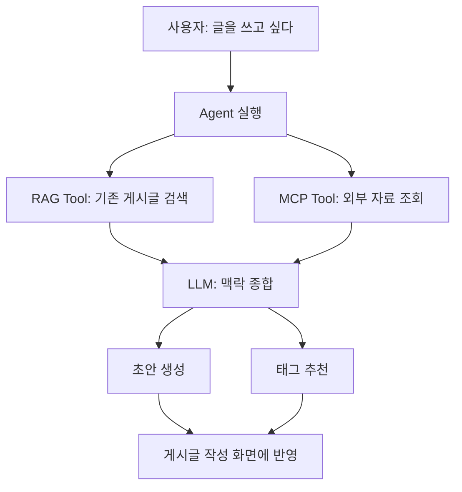

# AI 지식 공유 게시판 개인 과제 스프린트 운영 문서

작성일: 2026.06.13. 토요일  
적용 기간: 2026.06.13. 토요일 저녁 ~ 2026.06.18. 목요일 아침 발표 전  
운영 방식: 공통 주제, 공통 스프린트, 개인 구현, 팀 싱크

---

## 0. 문서 목적

이 문서는 팀이 앞으로 남은 기간 동안 **무엇을 같이 학습하고, 무엇을 각자 구현하고, 싱크 시간에 무엇을 확인할지**를 바로 실행할 수 있도록 정리한 운영 문서다.

이번 과제는 팀 프로젝트가 아니라 개인 과제다.  
따라서 한 명이 인증을 맡고, 다른 한 명이 RAG를 맡고, 또 다른 한 명이 MCP를 맡는 방식은 과제 취지와 맞지 않는다.

대신 팀은 같은 유형의 서비스를 기준으로 같은 순서의 기능을 각자 구현하고, 싱크 시간에는 각자의 설계 판단과 구현 흐름을 비교한다.

핵심 원칙은 다음이다.

> **같은 MVP를 각자 개인 repo에 구현한다.**  
> **기술 스택은 맞추고, 설계 판단은 각자가 한다.**  
> **스프린트는 개념 학습만 하지 않고 구현까지 포함한다.**  
> **싱크 시간에는 전체 코드 리뷰가 아니라 설계 판단, 막힌 부분, 구현 흐름, 발표 가능한 설명을 맞춘다.**

---

## 1. 최종 결정 사항

1. 앞으로의 스프린트는 개념 학습만 하지 않고, 구현까지 함께 진행한다.
2. 공통 주제는 **AI 지식 공유 게시판**으로 한다.
3. 각자는 개인 과제 형태로 직접 설계하고 구현한다.
4. 완전히 다른 주제로 흩어지지 않고, 공통 기능 순서와 공통 스프린트 목표를 따른다.
5. 스프린트는 기본적으로 약 3시간 단위로 운영한다.
6. 싱크 시간에는 전체 코드 리뷰가 아니라 핵심 설계 판단, 막힌 부분, 개념 이해, 구현 흐름을 공유한다.
7. 기술 스택은 팀 공통으로 고정한다.
   - Frontend: React + Vite
   - Backend/API Server: FastAPI
   - AI 기능 구현: FastAPI 내부 또는 FastAPI 기반 모듈
   - Database: PostgreSQL
   - RAG Vector DB: pgvector
8. 인증/인가 부분은 JWT와 Session을 중심으로 우선 구현한다.
9. OAuth/OIDC는 필요 시 추후 확장 학습 주제로 다룬다.
10. AI 기능의 세부 방향은 해당 스프린트에 도달했을 때 다시 결정한다.
11. 팀 내 진행률 차이가 있을 경우, 먼저 구현한 사람은 더 깊게 학습하거나 다른 팀원을 돕는다.

---

# 2. 공통 서비스 컨셉

## 2.1 서비스 한 줄 정의

> **AI 지식 공유 게시판은 개발자와 학습자가 질문, 트러블슈팅, 학습 노트, 참고 자료를 게시글로 공유하고, AI가 유사 글 탐색, 외부 자료 수집, 글쓰기 보조를 돕는 게시판 서비스다.**

---

## 2.2 조금 더 구체화한 컨셉

사용자는 학습하거나 개발하는 과정에서 생긴 지식을 게시글로 남긴다.

예를 들어 다음과 같은 글을 올릴 수 있다.

- JWT와 Session의 차이를 정리한 글
- FastAPI에서 DB Session을 관리하다가 겪은 오류 해결 기록
- React에서 로그인 상태를 관리하는 방법
- RAG 구현 중 embedding 저장 방식에 대한 학습 노트
- 특정 GitHub 이슈나 공식 문서를 읽고 정리한 글
- 프로젝트 중 발생한 버그와 해결 방법
- AI 응용 기술에 대한 질문과 답변

AI 기능은 이 게시판의 지식 흐름을 돕는 역할을 한다.

- **RAG**: 사용자가 글을 작성하거나 질문할 때 기존 게시글 중 유사한 내용을 찾아 추천하고 요약한다.
- **MCP**: 외부 서비스나 자료를 도구처럼 호출해 게시글 작성에 필요한 맥락을 가져온다.
- **Agent**: RAG와 MCP 도구를 필요에 따라 사용해 글 초안, 태그, 참고자료를 제안한다.

---

## 2.3 팀원별 자율성을 허용하는 범위

모든 팀원이 완전히 같은 게시판 이름과 같은 세부 주제를 가질 필요는 없다.  
다만 기능과 데이터 흐름이 크게 달라지면 싱크 비용이 커지므로, 아래 경계 안에서만 자율성을 둔다.

| 구분             | 공통으로 맞출 것                                            | 개인별 자율성 허용                                           |
| ---------------- | ----------------------------------------------------------- | ------------------------------------------------------------ |
| 서비스 유형      | 지식 공유형 게시판                                          | 개발 Q&A, AI 학습 노트, CS 지식 공유, 프로젝트 트러블슈팅 등 |
| 사용자 흐름      | 회원가입 → 로그인 → 글 작성 → 댓글/태그/검색 → AI 보조 기능 | UI 문구, 게시판 이름, 카테고리 이름                          |
| 핵심 데이터      | User, Post, Comment, Tag                                    | Category, Bookmark, Like, Difficulty, Source 등 추가 필드    |
| 기본 게시판 기능 | CRUD, 댓글, 태그, 검색, 페이징                              | 검색 범위, 태그 UI, 목록 정렬 방식                           |
| RAG              | 게시판 내부 데이터를 검색 대상으로 사용                     | 유사 글 추천, 중복 글 방지, 지식 Q&A 중 선택                 |
| MCP              | 외부 서비스 1개 이상 호출                                   | GitHub, URL metadata, 문서 API, 뉴스 API 등                  |
| Agent            | RAG/MCP 등 tool을 사용해 사용자 요청 처리                   | 글쓰기 도우미, 태그 추천, 자료 조사, 모더레이션 등           |

---

## 2.4 피해야 할 방향

아래 방향은 공통 싱크를 어렵게 만들기 때문에 피한다.

- 한 명은 쇼핑몰, 한 명은 맛집 리뷰, 한 명은 일정 관리 앱처럼 서비스 유형이 완전히 달라지는 것
- RAG/MCP/Agent가 게시판과 연결되지 않고 별도 데모 버튼으로만 존재하는 것
- AI 기능이 단순히 “LLM에게 질문하기” 수준으로만 구현되는 것
- 기본 게시판 기능이 부족한 상태에서 AI 기능만 붙이는 것
- 팀원별로 기능 순서가 완전히 달라져 싱크 시점이 맞지 않는 것

---

# 3. 추천 공통 MVP 시나리오

## 3.1 기본 사용자 흐름

서비스 이름은 개인별로 달라도 된다.  
다만 MVP의 사용자 경험은 아래 흐름을 공통 기준으로 둔다.

```text
1. 사용자가 회원가입한다.
2. 로그인한다.
3. 학습 노트나 질문 게시글을 작성한다.
4. 게시글에 태그를 붙인다.
5. 다른 사용자가 댓글을 단다.
6. 게시글 목록에서 검색과 페이징을 사용한다.
7. 글 작성 중 RAG가 유사 게시글을 추천한다.
8. MCP가 외부 자료를 가져와 게시글 작성에 활용한다.
9. Agent가 RAG/MCP 결과를 바탕으로 글 초안이나 태그를 제안한다.
```

---

## 3.2 추천 AI 기능 조합

AI 기능은 추후 스프린트에서 최종 결정하되, 현재 기준으로 가장 안전한 기본 조합은 다음이다.

```text
RAG:
글 작성 시 기존 게시글 중 유사한 글을 찾아 추천하고 요약한다.

MCP:
GitHub 이슈, GitHub 레포, 외부 URL, 문서 API 등 외부 자료를 가져와 게시글 작성에 활용한다.

Agent:
사용자의 글쓰기 요청을 받아 RAG로 기존 글을 검색하고,
MCP로 외부 자료를 가져온 뒤,
게시글 초안과 태그를 제안한다.
```

이 조합이 좋은 이유는 세 AI 기능이 따로 놀지 않고 하나의 사용자 흐름으로 연결되기 때문이다.



---

# 4. 기술 스택 및 선택 원칙

## 4.1 확정된 기술 스택

이번 개인 과제에서 팀 공통으로 사용하는 기술 스택은 다음과 같이 고정한다.

| 영역               | 확정 기술                           |
| ------------------ | ----------------------------------- |
| Frontend           | React + Vite                        |
| Backend/API Server | FastAPI                             |
| AI 기능 구현       | FastAPI 내부 또는 FastAPI 기반 모듈 |
| Database           | PostgreSQL                          |
| RAG Vector DB      | pgvector                            |

즉, 팀원별로 백엔드 프레임워크나 DB를 다르게 선택하지 않는다.  
FastAPI, React + Vite, PostgreSQL, pgvector를 공통 기반으로 사용한다.

이렇게 고정하는 이유는 다음과 같다.

1. 팀원 간 싱크 비용을 줄인다.
2. 같은 문제를 겪을 가능성이 높아 서로 도와주기 쉽다.
3. FastAPI에서 API 서버와 AI 기능을 함께 다루기 좋다.
4. PostgreSQL과 pgvector를 함께 사용하면 일반 게시판 데이터와 RAG용 벡터 데이터를 같은 DB 계열에서 다룰 수 있다.
5. 개인 구현은 유지하되, 기술 스택 차이로 인한 불필요한 복잡도를 줄인다.

---

## 4.2 아직 개인 또는 팀이 결정해야 하는 것

기술 스택의 큰 축은 고정되어 있지만, 아래 항목들은 아직 결정되지 않았다.

| 영역                  | 선택지 예시                                           | 결정 시점         |
| --------------------- | ----------------------------------------------------- | ----------------- |
| ORM/DB 접근 방식      | SQLAlchemy, SQLModel, raw SQL 등                      | Sprint 1          |
| DB migration 방식     | Alembic, 수동 SQL, create_all 임시 사용 등            | Sprint 1          |
| FastAPI 프로젝트 구조 | router/service/repository, router/service/db 등       | Sprint 1          |
| 인증 방식             | JWT, Session                                          | Sprint 2          |
| JWT 저장 위치         | localStorage, sessionStorage, memory, httpOnly cookie | Sprint 2          |
| Session 저장 위치     | 서버 메모리, DB, Redis 등                             | Sprint 2          |
| LLM Provider          | OpenAI, Anthropic, Gemini 등 상용 모델                | Sprint 5~6        |
| Embedding Model       | OpenAI embedding, 기타 상용 embedding 모델 등         | Sprint 5~6        |
| RAG 구현 방식         | 직접 구현, LangChain, LlamaIndex 등                   | Sprint 5~6        |
| MCP 외부 서비스       | GitHub, 외부 URL, 문서 API, 뉴스 API 등               | Sprint 5~7        |
| MCP 구현 형태         | FastAPI 내부 모듈, 별도 FastAPI 서버                  | Sprint 7          |
| Agent 구현 방식       | 직접 loop 구현, Function Calling, LangGraph 등        | Sprint 8          |
| 프론트 상태관리       | React state, Context, Zustand 등                      | 기능 구현 중 결정 |
| 배포 방식             | 로컬 실행, 클라우드 배포 등                           | 발표 전 결정      |

---

## 4.3 개인별 자율성 허용 범위

기술 스택의 큰 틀은 고정하지만, 모든 구현 세부를 완전히 동일하게 강제하지는 않는다.

| 영역      | 공통으로 맞출 것                        | 개인별 자율성 허용                             |
| --------- | --------------------------------------- | ---------------------------------------------- |
| Frontend  | React + Vite 사용                       | 폴더 구조, UI 구성, 상태관리 방식              |
| Backend   | FastAPI 사용                            | router/service/repository 구조의 세부 방식     |
| DB        | PostgreSQL 사용                         | ORM 선택, migration 방식                       |
| Vector DB | pgvector 사용                           | embedding 테이블 구조, metadata 설계           |
| Auth      | 회원가입/로그인/인가 구현               | JWT 또는 Session 중 선택                       |
| RAG       | 게시판 내부 데이터를 검색 대상으로 사용 | 유사 글 추천, 중복 글 방지, 지식 Q&A 중 선택   |
| MCP       | 외부 서비스 1개 이상 호출               | GitHub, URL metadata, 문서 API 등 선택         |
| Agent     | tool을 사용해 사용자 요청 처리          | 직접 loop, function calling, LangGraph 등 선택 |

핵심은 다음이다.

> **기술 스택은 맞춘다.**  
> **구현 방식과 설계 판단은 각자가 직접 한다.**

---

## 4.4 AI 사용 원칙

AI에게 코드를 생성시킬 수 있다.  
다만 다음 질문에 답하지 못하면 구현한 것으로 보지 않는다.

```text
1. 이 기능의 요청은 어떤 FastAPI endpoint로 들어오는가?
2. request body에는 무엇이 들어가는가?
3. FastAPI에서는 어떤 validation을 하는가?
4. service layer 또는 business logic은 어디에 있는가?
5. PostgreSQL에는 무엇이 저장되거나 조회되는가?
6. pgvector를 사용하는 경우 embedding은 어디에 저장되는가?
7. 성공하면 어떤 response가 나가는가?
8. 실패하면 어떤 error가 나는가?
9. 이 구조를 선택한 이유는 무엇인가?
10. 발표에서 이 기능을 어떻게 설명할 것인가?
```

---

# 5. 스프린트 운영 방식

## 5.1 기본 시간 구조

각 스프린트는 기본 3시간 단위로 운영한다.

```text
0:00 ~ 0:15  스프린트 목표와 완료 기준 확인
0:15 ~ 0:45  필요한 개념만 빠르게 학습
0:45 ~ 2:30  각자 개인 repo에 구현
2:30 ~ 2:50  각자 self-check 및 README 메모 작성
2:50 ~ 3:00  싱크 준비

스프린트 종료 후 30~45분  팀 싱크
```

학습 시간이 길어져 구현이 밀리면 안 된다.  
개념은 “이번 기능을 만들기 위해 지금 당장 필요한 만큼”만 본다.

---

## 5.2 싱크 시간 운영

싱크 시간에는 전체 코드 리뷰를 하지 않는다.  
각자는 아래 형식으로 짧게 공유한다.

```text
1. 내가 구현한 사용자 흐름
2. 내가 선택한 설계 방식
3. 선택한 이유와 포기한 대안
4. 막힌 부분
5. 아직 설명이 어려운 개념
6. 다음 스프린트 전에 보완할 것
```

---

## 5.3 스프린트 완료 기준

각 스프린트는 아래 조건을 만족해야 완료로 본다.

```text
1. 화면 또는 API에서 실제로 동작한다.
2. 핵심 요청 흐름을 설명할 수 있다.
3. DB에 무엇이 저장되는지 설명할 수 있다.
4. 실패 케이스를 최소 1개 이상 확인했다.
5. README 또는 sprint note에 설계 판단을 남겼다.
```

---

## 5.4 스프린트 노트 템플릿

각 스프린트가 끝날 때 개인 repo에 아래 파일을 남긴다.

```text
docs/sprint-notes/sprint-XX-{topic}.md
```

템플릿은 다음과 같다.

```md
# Sprint XX - 주제명

## 1. 구현한 기능

## 2. 선택한 기술/구조

## 3. 선택 이유

## 4. 고려했지만 선택하지 않은 대안

## 5. 요청 흐름

예: React → FastAPI Router → Service → Repository → PostgreSQL → Response

## 6. DB 변경 사항

## 7. 에러/예외 처리

## 8. AI에게 도움받은 부분

## 9. 아직 설명이 어려운 부분

## 10. 발표에 사용할 한 문장
```

---

# 6. 전체 스프린트 로드맵

| Sprint    | 시점                    | 주제                                   | 핵심 결과물                                    |
| --------- | ----------------------- | -------------------------------------- | ---------------------------------------------- |
| Sprint 1  | 토요일                  | FastAPI + React + PostgreSQL 기반 설계 | 개인 repo 기반 구조, DB 연결, 기본 모델/API    |
| Sprint 2  | 토요일                  | FastAPI 인증/인가 구현                 | 회원가입, 로그인, 현재 사용자 확인, 보호된 API |
| Sprint 3  | 일요일 오전             | 게시글 CRUD + 댓글                     | 게시글 작성/조회/수정/삭제, 댓글               |
| Sprint 4  | 일요일 오후             | 태그 + 검색 + 페이징                   | 태그, 목록 검색, 페이지네이션                  |
| Sprint 5  | 월요일 시작 전          | AI 기능 스코핑/아키텍처 결정           | RAG/MCP/Agent 기능 시나리오 확정               |
| Sprint 6  | 월요일                  | pgvector 기반 RAG 구현                 | 유사 게시글 검색/추천/요약                     |
| Sprint 7  | 화요일 오전             | FastAPI 기반 MCP 구현                  | MCP Server, JSON-RPC, 외부 서비스 연동         |
| Sprint 8  | 화요일 오후             | FastAPI 기반 Agent 구현                | RAG/MCP tool을 사용하는 글쓰기 Agent           |
| Sprint 9  | 수요일 오전             | 통합/버그 수정                         | 전체 데모 흐름 연결                            |
| Sprint 10 | 수요일 오후~목요일 아침 | README/발표 준비                       | 문서, 스크린샷, 발표 시나리오                  |

---

# 7. Sprint 1 - FastAPI + React + PostgreSQL 기반 설계

## 7.1 목표

개인 repo에서 AI 지식 공유 게시판을 구현할 수 있는 최소 기반을 만든다.

이 스프린트는 “완성된 게시판”을 만드는 것이 아니라, 이후 기능을 안정적으로 붙일 수 있도록 아래를 정하는 단계다.

```text
React + Vite 앱
FastAPI 앱
PostgreSQL 연결
기본 도메인 모델
기본 API 흐름
기본 에러 응답
프로젝트 구조
pgvector 사용을 고려한 DB 구조
```

---

## 7.2 구현할 기능

최소 구현 범위는 다음이다.

```text
1. React + Vite 앱 실행
2. FastAPI 서버 실행
3. PostgreSQL 연결
4. health check API
5. User/Post/Comment/Tag 모델 초안
6. 게시글 목록 조회 API 또는 게시글 생성 API 중 최소 1개
7. FastAPI router 구조 생성
8. DB session 관리 방식 구현
9. 기본 README 생성
```

가능하면 Sprint 1에서 게시글 생성과 목록 조회까지 만든다.  
다만 인증은 Sprint 2에서 붙인다.

---

## 7.3 학습할 개념

이번 스프린트에서 필요한 개념은 다음 정도로 제한한다.

```text
1. FastAPI 프로젝트 구조
2. React + Vite 프로젝트 구조
3. PostgreSQL 연결 방식
4. User/Post/Comment/Tag 관계
5. API request/response 흐름
6. Pydantic validation과 error response
7. router/service/repository 또는 이에 준하는 계층 분리
8. pgvector를 나중에 붙이기 위한 PostgreSQL 확장 구조
```

---

## 7.4 설계 의사결정

FastAPI, React + Vite, PostgreSQL, pgvector는 이미 확정된 기술 스택이므로 다시 선택하지 않는다.  
이 스프린트에서는 해당 기술 스택 안에서 프로젝트 구조와 데이터 접근 방식을 결정한다.

| 결정 항목                  | 선택지 예시                                                         | 결정할 것                           |
| -------------------------- | ------------------------------------------------------------------- | ----------------------------------- |
| FastAPI 프로젝트 구조      | router/service/repository, router/service/db, 단순 router 중심 구조 | 어떤 계층으로 나눌지                |
| React + Vite 프로젝트 구조 | pages/components/api/hooks, feature-based 구조 등                   | 프론트 폴더 구조                    |
| API prefix 구조            | `/api`, `/api/v1`, 기능별 router prefix                             | API 경로 기준                       |
| DB 접근 방식               | SQLAlchemy, SQLModel, raw SQL                                       | 어떤 방식으로 PostgreSQL에 접근할지 |
| DB session 관리            | FastAPI dependency injection, 직접 session 생성                     | DB session을 어떻게 주입할지        |
| Migration 방식             | Alembic, 수동 SQL, 초기 create_all                                  | DB schema 변경을 어떻게 관리할지    |
| API 응답 형식              | 단순 JSON, `data/error` 분리, 공통 response schema                  | 성공/실패 응답 형식                 |
| 에러 처리                  | FastAPI 기본 예외, custom exception handler                         | 공통 에러 형식 여부                 |
| 기본 Post 모델             | title/content/author/timestamps                                     | 필수 필드 확정                      |
| User 모델                  | email, username, password_hash 등                                   | 로그인 식별자 결정                  |
| Tag 모델                   | 별도 테이블, 문자열 배열, Sprint 4에서 추가                         | 태그 구조 초안                      |
| pgvector 준비              | Sprint 1에서 extension만 준비, Sprint 6에서 본격 사용               | pgvector 적용 시점                  |
| 환경변수 관리              | `.env`, settings 객체, 직접 환경변수 접근                           | DB URL, LLM key 관리 방식           |

Sprint 1에서는 pgvector를 반드시 완성할 필요는 없다.  
다만 이후 RAG 스프린트에서 사용할 예정이므로, PostgreSQL을 기준으로 설계하고 필요하면 `pgvector extension`을 활성화할 수 있는 구조를 고려한다.

---

## 7.5 추천 공통 데이터 모델 초안

팀원별 구현은 달라도 되지만, 최소한 아래 개념은 공통으로 유지한다.

```text
User
- id
- email 또는 username
- password_hash
- created_at

Post
- id
- title
- content
- author_id
- created_at
- updated_at

Comment
- id
- post_id
- author_id
- content
- created_at

Tag
- id
- name

PostTag
- post_id
- tag_id
```

RAG 구현 시점에는 아래 구조 중 하나를 추가한다.

```text
선택지 A: posts 테이블에 embedding vector 컬럼 추가
선택지 B: post_embeddings 별도 테이블 생성

PostEmbedding 예시
- id
- post_id
- embedding
- content_snapshot
- metadata
- created_at
```

---

## 7.6 Sprint 1 완료 기준

```text
1. React + Vite 앱이 실행된다.
2. FastAPI 서버가 실행된다.
3. PostgreSQL 연결이 된다.
4. health check API가 동작한다.
5. DB에 최소 User/Post 모델이 있다.
6. 게시글 목록 조회 또는 게시글 생성 API가 최소 1개 동작한다.
7. 요청이 어떤 계층을 거쳐 DB까지 가는지 설명할 수 있다.
8. Sprint 1 note에 기술 선택이 아니라 구조 선택 이유를 남겼다.
```

---

## 7.7 Sprint 1 싱크 질문

싱크 시간에는 아래 질문에 답한다.

```text
1. 내 FastAPI 앱 구조는 무엇인가?
2. 내 React + Vite 앱 구조는 무엇인가?
3. PostgreSQL 연결 방식은 무엇인가?
4. DB 접근 방식은 무엇인가?
5. User/Post/Comment/Tag 관계를 어떻게 잡았는가?
6. 요청은 어떤 파일/계층을 거쳐 처리되는가?
7. validation error와 application error를 구분했는가?
8. pgvector는 Sprint 1에서 어디까지 준비했는가?
9. 아직 구조가 불명확한 부분은 무엇인가?
```

---

# 8. Sprint 2 - FastAPI 인증/인가 구현

## 8.1 목표

FastAPI 기반으로 회원가입, 로그인, 현재 사용자 확인, 보호된 API를 구현한다.

이 스프린트에서는 JWT와 Session 중 하나를 선택해 구현해도 된다.  
중요한 것은 팀원 모두가 같은 인증 방식을 쓰는 것이 아니라, 각자 선택한 방식의 흐름과 trade-off를 설명할 수 있는 것이다.

React + Vite 프론트엔드에서는 로그인 요청을 보내고, 로그인 상태를 저장하며, 인증이 필요한 API 호출에 인증 정보를 포함해야 한다.

---

## 8.2 구현할 기능

```text
1. 회원가입
2. 로그인
3. 현재 로그인 사용자 확인
4. 로그아웃 또는 토큰/세션 제거
5. 인증이 필요한 API 보호
6. 게시글 작성 시 현재 사용자 연결
7. 게시글 수정/삭제 시 작성자 권한 확인
```

---

## 8.3 학습할 개념

이미 인증/인가 개념 학습은 진행했으므로, 여기서는 구현에 필요한 만큼만 다시 본다.

```text
1. 인증과 인가의 차이
2. JWT 방식의 흐름
3. Session 방식의 흐름
4. Access Token / Refresh Token 개념
5. Cookie, localStorage, sessionStorage, memory 저장의 차이
6. 401과 403의 차이
7. CSRF/CORS가 어떤 상황에서 문제가 되는지
8. FastAPI dependency로 current_user를 주입하는 방식
9. React에서 인증 상태를 보관하고 API 요청에 포함하는 방식
```

OAuth/OIDC는 이번 스프린트의 필수 구현 범위에서 제외한다.  
추후 소셜 로그인이나 외부 인증이 필요할 때 확장 학습 주제로 다룬다.

---

## 8.4 공통 인터페이스 기준

JWT를 쓰든 Session을 쓰든, 사용자 경험과 API 목적은 비슷하게 맞춘다.

```text
POST /auth/signup
POST /auth/login
GET  /auth/me
POST /auth/logout    # 구현 방식에 따라 optional
POST /posts          # 인증 필요
PATCH /posts/{id}    # 작성자 권한 필요
DELETE /posts/{id}   # 작성자 권한 필요
```

엔드포인트 이름은 개인별로 조금 달라도 되지만, FastAPI router 기준으로 위 기능은 반드시 존재해야 한다.  
React + Vite 프론트엔드에서 실제로 호출 가능한 상태여야 한다.

---

## 8.5 JWT를 선택한 경우 결정할 것

| 결정 항목     | 선택지 예시                                           |
| ------------- | ----------------------------------------------------- |
| Token 종류    | Access Token만, Access + Refresh Token                |
| 저장 위치     | localStorage, sessionStorage, memory, httpOnly cookie |
| 전달 방식     | Authorization Bearer header, cookie                   |
| 만료 시간     | 짧게, 길게, 개발 편의상 길게                          |
| Refresh Token | 구현, 미구현 후 한계점으로 문서화                     |
| 권한 확인     | user_id claim 사용, DB에서 user 조회                  |
| FastAPI 구현  | dependency로 current_user 주입, middleware 활용       |
| 보안 한계     | XSS, token 탈취, refresh token 부재 등                |

---

## 8.6 Session을 선택한 경우 결정할 것

| 결정 항목      | 선택지 예시                                         |
| -------------- | --------------------------------------------------- |
| 세션 저장 위치 | 서버 메모리, DB, Redis                              |
| 세션 ID 전달   | cookie                                              |
| Cookie 설정    | httpOnly, Secure, SameSite                          |
| CSRF 대응      | SameSite, CSRF token, 개발 단계에서는 한계점 문서화 |
| 로그아웃       | 서버 세션 삭제, cookie 만료                         |
| FastAPI 구현   | session middleware, dependency로 current_user 조회  |
| 확장성 한계    | 서버 상태 저장 부담, Redis 필요성                   |

---

## 8.7 Sprint 2 완료 기준

```text
1. 회원가입이 된다.
2. 로그인이 된다.
3. 로그인한 사용자를 확인할 수 있다.
4. 인증 없이 보호된 API를 호출하면 실패한다.
5. 로그인한 사용자는 게시글을 작성할 수 있다.
6. 작성자가 아닌 사용자는 게시글 수정/삭제를 할 수 없다.
7. 401과 403을 구분한다.
8. React + Vite 프론트에서 로그인 흐름을 확인할 수 있다.
9. 선택한 인증 방식의 장점과 한계를 설명할 수 있다.
10. Sprint 2 note에 인증 흐름을 남겼다.
```

---

## 8.8 Sprint 2 self-check

각자는 아래 시나리오를 직접 확인한다.

```text
1. User A 회원가입
2. User A 로그인
3. User A가 게시글 작성
4. 로그아웃 또는 인증 제거 후 게시글 작성 시도 → 실패
5. User B 회원가입
6. User B 로그인
7. User B가 User A의 게시글 수정/삭제 시도 → 실패
8. User A가 자기 게시글 수정/삭제 → 성공
```

---

## 8.9 Sprint 2 싱크 질문

```text
1. JWT와 Session 중 무엇을 선택했는가?
2. 왜 그 방식을 선택했는가?
3. 로그인 성공 후 서버는 무엇을 반환하거나 생성하는가?
4. React 클라이언트는 인증 정보를 어디에 저장하는가?
5. 이후 요청에서 인증 정보는 어떻게 전달되는가?
6. FastAPI는 현재 사용자를 어떻게 알아내는가?
7. current_user는 router, service, repository 중 어디까지 전달되는가?
8. 401과 403은 각각 어떤 상황에서 발생하는가?
9. CSRF/CORS 또는 XSS 관련 한계는 무엇인가?
10. 발표에서 인증 구조를 한 문단으로 설명하면 어떻게 말할 것인가?
```

---

## 8.10 발표용 설명 예시

JWT 선택 시:

```text
이번 프로젝트에서는 JWT 기반 인증을 사용했습니다.
사용자가 로그인하면 FastAPI 서버가 access token을 발급하고,
React 클라이언트는 이후 요청마다 Authorization header에 토큰을 포함합니다.
FastAPI는 토큰을 검증해 현재 사용자 정보를 얻고,
게시글 수정/삭제처럼 권한이 필요한 작업에서는
게시글 작성자와 현재 사용자가 같은지 확인합니다.
```

Session 선택 시:

```text
이번 프로젝트에서는 Session 기반 인증을 사용했습니다.
사용자가 로그인하면 FastAPI 서버가 세션을 생성하고,
React 클라이언트는 세션 ID가 담긴 쿠키를 사용합니다.
이후 요청에서 쿠키가 함께 전달되면 서버는 세션 저장소를 조회해 현재 사용자를 확인합니다.
게시글 수정/삭제 시에는 현재 사용자와 게시글 작성자가 같은지 확인해 인가를 처리합니다.
```

---

# 9. Sprint 3 - 게시글 CRUD + 댓글

## 9.1 목표

기본 게시판의 핵심 기능인 게시글 CRUD와 댓글 기능을 구현한다.

---

## 9.2 구현할 기능

```text
1. 게시글 작성
2. 게시글 목록 조회
3. 게시글 상세 조회
4. 게시글 수정
5. 게시글 삭제
6. 댓글 작성
7. 댓글 목록 조회
8. 댓글 삭제
```

---

## 9.3 설계 의사결정

| 결정 항목        | 선택지 예시                              |
| ---------------- | ---------------------------------------- |
| 게시글 삭제 방식 | hard delete, soft delete                 |
| 수정 권한        | 작성자만 가능, 관리자 role 추가          |
| 댓글 삭제 권한   | 댓글 작성자만, 게시글 작성자도 가능      |
| 목록 조회 정렬   | 최신순, 오래된순, 인기순                 |
| 상세 조회 응답   | 댓글 포함, 댓글 별도 API                 |
| transaction 범위 | service 단위, repository 단위            |
| validation       | 제목 길이, 본문 필수 여부, 댓글 길이     |
| 프론트 화면 구성 | 목록/상세/작성 페이지 분리, 모달 사용 등 |

---

## 9.4 완료 기준

```text
1. 로그인한 사용자가 게시글을 작성할 수 있다.
2. 게시글 목록과 상세를 볼 수 있다.
3. 작성자만 게시글을 수정/삭제할 수 있다.
4. 댓글을 작성하고 볼 수 있다.
5. 댓글 삭제 권한이 적용된다.
6. React 화면에서 최소한 목록/상세/작성/댓글 흐름이 동작한다.
```

---

## 9.5 싱크 질문

```text
1. 게시글 삭제는 hard delete인가 soft delete인가?
2. 댓글은 게시글 상세 응답에 포함했는가, 별도 API로 불러오는가?
3. 작성자 권한은 어디에서 확인하는가?
4. 댓글 삭제 권한은 어떻게 정했는가?
5. 어떤 validation을 넣었는가?
6. React에서 성공/실패 상태를 어떻게 보여주는가?
7. FastAPI service layer와 repository layer의 책임을 어떻게 나눴는가?
```

---

# 10. Sprint 4 - 태그 + 검색 + 페이징

## 10.1 목표

게시판을 지식 공유 서비스답게 탐색 가능한 형태로 만든다.

---

## 10.2 구현할 기능

```text
1. 게시글에 태그 추가
2. 태그 목록 조회
3. 태그 기반 필터링
4. 검색어 기반 게시글 검색
5. 게시글 목록 페이징
6. 검색 결과 없음/로딩/에러 처리
```

---

## 10.3 설계 의사결정

| 결정 항목       | 선택지 예시                                  |
| --------------- | -------------------------------------------- |
| 태그 모델링     | N:M 테이블, 문자열 배열, 단순 텍스트         |
| 검색 범위       | 제목만, 제목+본문, 제목+본문+태그            |
| 검색 방식       | LIKE, PostgreSQL full-text search, 단순 필터 |
| 페이징 방식     | offset pagination, cursor pagination         |
| 정렬 방식       | 최신순, 관련도순, 댓글 많은 순               |
| 태그 생성       | 사용자가 직접 입력, 기존 태그만 선택         |
| 중복 태그 처리  | lower-case normalize, 원문 유지              |
| React 상태 관리 | URL query param, local state, custom hook    |

---

## 10.4 완료 기준

```text
1. 글 작성 시 태그를 붙일 수 있다.
2. 태그가 게시글 상세 또는 목록에서 보인다.
3. 검색어로 게시글을 찾을 수 있다.
4. 게시글 목록이 페이징된다.
5. React에서 검색어와 페이지 상태를 다룬다.
6. 검색 결과 없음 상태가 표시된다.
```

---

## 10.5 싱크 질문

```text
1. 태그를 어떤 데이터 구조로 저장했는가?
2. 검색은 어떤 필드를 대상으로 하는가?
3. 페이징은 offset인가 cursor인가?
4. 검색과 페이징을 함께 사용할 때 query param은 어떻게 구성했는가?
5. RAG에서 태그를 metadata로 활용할 수 있는 구조인가?
6. React에서는 검색어와 page 상태를 어디에서 관리하는가?
```

---

# 11. Sprint 5 - AI 기능 스코핑/아키텍처 결정

## 11.1 목표

RAG, MCP, Agent를 각각 따로 붙인 기능이 아니라, 하나의 게시판 경험으로 연결되도록 AI 기능 시나리오를 확정한다.

---

## 11.2 이 스프린트의 성격

이 스프린트는 구현량이 적어도 된다.  
대신 이후 Sprint 6~8이 흔들리지 않도록 AI 기능의 경계를 정한다.

---

## 11.3 기본 추천 시나리오

팀 공통 기본안은 다음이다.

```text
사용자가 글 작성 화면에서 주제나 초안을 입력한다.

1. RAG는 기존 게시글 중 유사한 글을 찾아 추천한다.
2. MCP는 외부 서비스에서 참고자료를 가져온다.
3. Agent는 RAG와 MCP 결과를 종합해 게시글 초안과 태그를 제안한다.
```

---

## 11.4 결정할 것

| 결정 항목           | 선택지 예시                                           |
| ------------------- | ----------------------------------------------------- |
| RAG 기능            | 유사 게시글 추천, 중복 게시글 방지, 지식 Q&A          |
| RAG 데이터          | 게시글만, 게시글+댓글, 게시글+태그                    |
| Vector DB           | pgvector 고정                                         |
| Embedding 저장 위치 | posts 테이블 vector 컬럼, post_embeddings 별도 테이블 |
| Embedding 생성 시점 | 게시글 작성 시, 별도 버튼, background job             |
| LLM Provider        | OpenAI, Anthropic, Gemini 등 상용 모델                |
| Embedding Model     | OpenAI embedding, 기타 상용 embedding 모델            |
| MCP 외부 서비스     | GitHub, 외부 URL, 뉴스, 문서 API 등                   |
| MCP 결과 사용처     | 게시글 내용 삽입, 참고자료 카드, Agent 입력           |
| Agent 역할          | 글쓰기 도우미, 태그 추천, 자료 조사, 모더레이터       |
| Agent tool          | RAG search, MCP fetch, draft generate, tag recommend  |
| 저장 정책           | AI 결과 저장, 일회성 표시, 사용자 확인 후 저장        |

---

## 11.5 완료 기준

```text
1. RAG 기능 1개를 확정했다.
2. MCP 기능 1개를 확정했다.
3. Agent 기능 1개를 확정했다.
4. 세 기능이 하나의 사용자 흐름으로 연결된다.
5. pgvector embedding 테이블 구조 초안을 정했다.
6. 사용할 LLM Provider 후보를 정했다.
7. 사용할 Embedding Model 후보를 정했다.
8. MCP가 호출할 외부 서비스를 정했다.
9. Agent가 사용할 tool 목록을 정했다.
10. README에 들어갈 AI 아키텍처 초안을 작성했다.
```

---

## 11.6 싱크 질문

```text
1. AI 기능이 게시판의 어떤 사용자 문제를 해결하는가?
2. RAG, MCP, Agent가 각각 따로 놀지 않고 연결되는가?
3. 각 기능의 입력과 출력은 무엇인가?
4. pgvector에는 어떤 데이터를 저장할 것인가?
5. 팀원별 자율성을 어디까지 허용할 것인가?
6. 발표에서 AI 기능을 어떤 시나리오로 보여줄 것인가?
```

---

# 12. Sprint 6 - pgvector 기반 RAG 구현

## 12.1 목표

PostgreSQL과 pgvector를 사용해 게시판 내부 데이터를 기반으로 검색/추천/요약이 되는 RAG 기능을 구현한다.

---

## 12.2 추천 기능

가장 추천하는 기능은 다음이다.

> **글 작성 시 유사 게시글 추천 및 중복 게시글 방지**

사용자가 글 제목과 본문 초안을 입력하면, 기존 게시글 중 유사한 글을 찾아 보여주고, LLM이 간단히 요약한다.

---

## 12.3 구현할 기능

```text
1. pgvector extension을 준비한다.
2. 게시글 데이터를 embedding한다.
3. embedding 결과를 PostgreSQL의 vector 컬럼에 저장한다.
4. 사용자 입력을 embedding한다.
5. pgvector similarity search로 유사 게시글을 찾는다.
6. 검색 결과를 LLM에 전달해 요약한다.
7. React 화면에서 유사 게시글과 요약 결과를 보여준다.
```

---

## 12.4 설계 의사결정

RAG용 Vector DB는 pgvector로 고정한다.  
따라서 이 스프린트에서는 Vector DB를 고르는 것이 아니라, PostgreSQL과 pgvector 안에서 데이터를 어떻게 저장하고 검색할지 결정한다.

| 결정 항목             | 선택지 예시                                                  |
| --------------------- | ------------------------------------------------------------ |
| Embedding 대상        | title, content, title+content, 댓글 포함                     |
| Chunking              | 게시글 단위, 문단 단위                                       |
| Embedding 저장 테이블 | posts 테이블에 vector 컬럼 추가, post_embeddings 별도 테이블 |
| Metadata              | post_id, title, tags, author_id, created_at                  |
| 검색 개수             | top-3, top-5                                                 |
| 유사도 기준           | cosine distance, inner product, L2 distance                  |
| LLM 사용 위치         | 검색 후 요약, 답변 생성, 추천 이유 작성                      |
| 동기화 방식           | 게시글 작성 시 embedding 생성, 수동 재색인                   |
| 실패 처리             | pgvector 검색 실패, LLM 실패, 결과 없음                      |
| React UI              | 글 작성 중 추천 버튼, 별도 RAG 검색 화면                     |

pgvector를 사용하므로 일반 게시판 데이터와 embedding 데이터를 PostgreSQL 안에서 함께 관리할 수 있다.  
다만 게시글 테이블에 vector 컬럼을 직접 둘지, 별도의 embedding 테이블을 둘지는 각자가 결정하고 이유를 설명한다.

---

## 12.5 완료 기준

```text
1. pgvector를 사용할 수 있는 DB 구조가 준비되어 있다.
2. 게시글 데이터가 embedding되어 PostgreSQL에 저장된다.
3. 사용자 입력과 유사한 게시글을 검색할 수 있다.
4. 검색 결과가 게시글 title/content와 연결된다.
5. LLM이 검색 결과를 요약하거나 추천 이유를 만든다.
6. React 화면에서 RAG 결과를 확인할 수 있다.
7. README에 RAG 구조를 설명할 수 있다.
```

---

## 12.6 싱크 질문

```text
1. 무엇을 embedding했는가?
2. embedding은 posts 테이블에 저장했는가, 별도 테이블에 저장했는가?
3. vector 컬럼 차원 수는 어떻게 정했는가?
4. metadata는 무엇을 저장했는가?
5. 검색 query는 무엇인가?
6. 유사도 기준은 무엇인가?
7. 검색 결과가 없을 때 어떻게 처리했는가?
8. LLM prompt에는 어떤 context가 들어가는가?
9. RAG 결과가 게시판 사용자 경험에 어떻게 연결되는가?
```

---

# 13. Sprint 7 - FastAPI 기반 MCP 구현

## 13.1 목표

FastAPI 기반으로 MCP Server 또는 MCP 역할을 하는 모듈을 만들고, JSON-RPC 기반 요청/응답으로 외부 서비스 1개 이상을 호출해 게시판 기능에 활용한다.

---

## 13.2 추천 기능

추천하는 MCP 기능은 다음 중 하나다.

```text
1. GitHub repo/issue 정보 가져오기
2. 외부 URL metadata 또는 본문 요약 가져오기
3. 공식 문서나 외부 API에서 참고자료 가져오기
```

AI 지식 공유 게시판과 가장 잘 맞는 기본안은 **GitHub 또는 외부 URL 참고자료 가져오기**다.

---

## 13.3 구현할 기능

```text
1. FastAPI 내부 또는 별도 FastAPI 앱으로 MCP Server 역할 구성
2. JSON-RPC 요청/응답 형식 정의
3. tool 1개 이상 구현
4. 외부 서비스 호출
5. API Key 또는 권한 관리 전략 정리
6. 외부 호출 실패 시 예외 처리
7. 결과를 게시글 작성 화면 또는 Agent 입력에 활용
```

---

## 13.4 설계 의사결정

| 결정 항목    | 선택지 예시                            |
| ------------ | -------------------------------------- |
| MCP 구성     | FastAPI 내부 router, 별도 FastAPI 서버 |
| 호출 방식    | HTTP JSON-RPC, 내부 function wrapper   |
| 외부 서비스  | GitHub, URL, 뉴스, 문서 API            |
| API Key 관리 | `.env`, server-only, 사용자별 key      |
| 권한 처리    | 로그인 사용자만 호출, 전체 허용        |
| 결과 저장    | DB에 저장, 일회성 표시                 |
| 실패 처리    | timeout, retry, fallback message       |
| Agent 연동   | tool로 제공, 별도 API로만 제공         |

---

## 13.5 완료 기준

```text
1. FastAPI 기반 MCP Server 또는 MCP 역할의 모듈이 있다.
2. JSON-RPC 형태의 요청/응답이 있다.
3. 외부 서비스 1개 이상을 실제 호출한다.
4. API Key 또는 권한 관리 전략을 문서화했다.
5. 외부 호출 실패 시 에러 처리가 있다.
6. 게시판 기능 또는 Agent 기능 안에서 MCP 결과가 사용된다.
7. README에 MCP 구조를 설명할 수 있다.
```

---

## 13.6 싱크 질문

```text
1. MCP tool 이름은 무엇인가?
2. JSON-RPC request/response는 어떻게 생겼는가?
3. 어떤 외부 서비스를 호출했는가?
4. API Key는 어디에 저장했는가?
5. 외부 호출 실패 시 사용자는 무엇을 보는가?
6. MCP 결과는 게시글에 저장되는가, 일회성인가?
7. Agent가 이 MCP tool을 사용할 수 있는 구조인가?
8. FastAPI 일반 API와 MCP 호출 구조는 어떻게 분리했는가?
```

---

# 14. Sprint 8 - FastAPI 기반 Agent 구현

## 14.1 목표

FastAPI 기반으로 Agent 실행 API를 만들고, Agent가 사용자의 요청을 받아 필요한 tool을 선택하고 실행한 뒤, 게시판 사용자에게 의미 있는 결과를 제공하도록 구현한다.

---

## 14.2 추천 기능

가장 추천하는 기능은 다음이다.

> **글쓰기 도우미 Agent**

사용자가 글 주제나 초안을 입력하면 Agent가 다음을 수행한다.

```text
1. RAG tool로 기존 유사 게시글을 검색한다.
2. MCP tool로 외부 참고자료를 가져온다.
3. LLM으로 내용을 종합한다.
4. 게시글 초안을 제안한다.
5. 태그를 추천한다.
```

---

## 14.3 구현할 기능

```text
1. Agent 실행 FastAPI endpoint 또는 화면
2. Agent가 사용할 tool 목록 정의
3. RAG search tool 연결
4. MCP fetch tool 연결
5. LLM을 통한 최종 응답 생성
6. state 또는 memory 구조
7. 최대 반복 횟수 제한
8. tool 실패 시 예외 처리
9. 사용자 확인 후 게시글에 반영
```

---

## 14.4 설계 의사결정

| 결정 항목      | 선택지 예시                                          |
| -------------- | ---------------------------------------------------- |
| Agent 구조     | 직접 loop 구현, Function Calling, LangGraph 등       |
| Tool 목록      | RAG search, MCP fetch, draft generate, tag recommend |
| Tool 선택 방식 | LLM function calling, 규칙 기반, 혼합                |
| State          | user input, tool results, final answer               |
| Memory         | 이번 요청만, 사용자별 기록 저장                      |
| Loop 제한      | max iteration 3회, tool call 수 제한                 |
| DB 저장        | 사용자 확인 후 저장, 자동 저장 금지                  |
| 실패 처리      | tool 실패 시 부분 결과 제공, 전체 실패 처리          |
| React UI       | Agent 실행 버튼, 초안 미리보기, 태그 적용 버튼       |

---

## 14.5 완료 기준

```text
1. Agent가 최소 1개 이상의 tool을 호출한다.
2. 가능하면 RAG와 MCP tool을 모두 사용한다.
3. Agent state에 사용자 입력, tool 결과, 최종 응답이 남는다.
4. 무한 루프 방지 장치가 있다.
5. tool 실패 시 예외 처리가 있다.
6. React 화면 또는 FastAPI API에서 Agent를 실행할 수 있다.
7. README에 Agent 구조를 설명할 수 있다.
```

---

## 14.6 싱크 질문

```text
1. Agent의 역할은 무엇인가?
2. Agent가 사용할 수 있는 tool은 무엇인가?
3. Agent는 어떤 기준으로 tool을 선택하는가?
4. state에는 무엇을 저장하는가?
5. 무한 루프는 어떻게 막는가?
6. tool 실패 시 어떻게 처리하는가?
7. 사용자의 확인 없이 DB에 저장되는 일이 있는가?
8. FastAPI endpoint는 Agent 실행을 어떻게 노출하는가?
9. React 화면에서는 Agent 결과를 어떻게 보여주는가?
```

---

# 15. Sprint 9 - 통합/버그 수정

## 15.1 목표

개별 기능이 따로 동작하는 상태를 넘어서, 발표 가능한 하나의 사용자 흐름으로 연결한다.

---

## 15.2 통합 데모 흐름

수요일 오전까지 아래 흐름이 한 번에 시연 가능해야 한다.

```text
1. 회원가입
2. 로그인
3. 게시글 작성
4. 댓글 작성
5. 태그 확인
6. 검색과 페이징 확인
7. 글 작성 화면에서 RAG 유사글 추천
8. MCP로 외부 자료 가져오기
9. Agent 실행
10. Agent가 초안 또는 태그 추천
```

---

## 15.3 완료 기준

```text
1. React + Vite 앱과 FastAPI 서버가 함께 실행된다.
2. PostgreSQL 연결이 안정적이다.
3. 기본 게시판 기능이 화면에서 동작한다.
4. pgvector 기반 RAG가 게시판 데이터와 연결되어 있다.
5. MCP 기능이 외부 서비스를 호출하고 게시판 흐름 안에서 사용된다.
6. Agent가 RAG/MCP 결과를 활용하거나, 최소한 tool 호출 구조를 설명 가능하게 구현되어 있다.
7. 주요 에러 케이스가 최소한 깨지지 않는다.
8. 발표용 스크린샷을 찍을 수 있다.
```

---

## 15.4 싱크 질문

```text
1. 전체 데모가 어디에서 끊기는가?
2. 발표에서 반드시 보여줄 기능은 무엇인가?
3. 안 되는 기능을 어떻게 설명하거나 대체할 것인가?
4. README에서 구조 설명이 부족한 부분은 무엇인가?
5. FastAPI, PostgreSQL, pgvector, React 흐름을 한 그림으로 설명할 수 있는가?
```

---

# 16. Sprint 10 - README/발표 준비

## 16.1 목표

구현한 내용을 과제 제출물과 발표 기준에 맞게 정리한다.

---

## 16.2 README 필수 목차

README에는 최소한 아래 항목이 들어가야 한다.

```text
1. 프로젝트 개요
2. 주요 구현 기능
3. 전체 아키텍처 구조
4. RAG 기능, 기술, 아키텍처 구조
5. MCP 기능, 기술, 아키텍처 구조
6. Agent 기능, 기술, 아키텍처 구조
7. 데모 스크린샷
8. 회고
9. 한계점
10. 개선 아이디어
```

---

## 16.3 README에 포함할 기술 스택 설명

README에는 기술 스택을 아래처럼 명확히 적는다.

```text
Frontend:
- React + Vite

Backend:
- FastAPI

Database:
- PostgreSQL

Vector Search:
- pgvector

AI:
- 상용 LLM
- Embedding model
- RAG
- MCP
- Agent
```

그리고 단순히 나열하지 말고, 아래 흐름을 설명한다.

```text
React + Vite에서 사용자 요청이 발생한다.
FastAPI가 API 요청을 처리한다.
일반 게시판 데이터는 PostgreSQL에 저장된다.
RAG용 embedding은 PostgreSQL의 pgvector를 사용해 저장하고 검색한다.
MCP는 외부 서비스를 호출해 게시글 작성에 필요한 정보를 가져온다.
Agent는 RAG와 MCP tool을 사용해 사용자에게 글쓰기 보조 결과를 제공한다.
```

---

## 16.4 발표 추천 흐름

```text
1. 서비스 소개
2. 왜 AI 지식 공유 게시판인가
3. 기술 스택 소개
   - React + Vite
   - FastAPI
   - PostgreSQL
   - pgvector
4. 기본 게시판 기능
5. 인증/인가 구조
6. RAG 기능 시연 및 구조
7. MCP 기능 시연 및 구조
8. Agent 기능 시연 및 구조
9. 전체 아키텍처
10. 한계점과 개선 아이디어
```

---

## 16.5 한계점 예시

구현하지 못했거나 단순화한 부분은 숨기지 않고 한계점으로 정리한다.

```text
1. Refresh Token 미구현
2. OAuth/OIDC 미구현
3. RAG 품질 평가 부족
4. pgvector 인덱스 튜닝 부족
5. Vector DB 재색인 자동화 부족
6. MCP tool 종류 부족
7. Agent loop가 단순함
8. 배포 및 운영 보안 미흡
9. 테스트 코드 부족
```

---

## 16.6 완료 기준

```text
1. README가 과제 요구사항을 모두 포함한다.
2. 스크린샷이 1개 이상 있다.
3. 전체 아키텍처 그림이 있다.
4. RAG/MCP/Agent 각각의 구조 설명이 있다.
5. 데모 순서를 따라 실행할 수 있다.
6. 발표 중 설명할 핵심 문장을 정리했다.
```

---

# 17. 오늘 바로 실행할 Sprint 1~2 체크리스트

## 17.1 Sprint 1 시작 전 10분 결정

이미 확정된 것은 다시 논의하지 않는다.

```text
Frontend: React + Vite
Backend: FastAPI
DB: PostgreSQL
Vector DB: pgvector
```

Sprint 1 시작 전에는 아래만 결정한다.

```text
1. 새 repo로 갈지, 기존 repo를 정리해 사용할지 결정한다.
2. 프로젝트 이름을 정한다.
3. FastAPI 앱 구조를 정한다.
4. React + Vite 앱 구조를 정한다.
5. PostgreSQL 연결 방식을 정한다.
6. ORM/DB 접근 방식을 정한다.
7. Migration 방식을 정한다.
8. Sprint 1 완료 기준을 다시 확인한다.
```

---

## 17.2 Sprint 1 구현 체크리스트

```text
[ ] React + Vite 앱 실행
[ ] FastAPI 서버 실행
[ ] PostgreSQL 연결
[ ] health check API 구현
[ ] User/Post 모델 생성
[ ] Comment/Tag 모델 초안 작성
[ ] 게시글 목록 조회 또는 생성 API 1개 구현
[ ] FastAPI router 구조 생성
[ ] DB session 관리 방식 구현
[ ] 기본 error response 형식 결정
[ ] 환경변수 관리 방식 결정
[ ] README에 기술 스택과 구조 선택 이유 작성
```

선택 이유에는 “왜 FastAPI/React/PostgreSQL을 선택했는가”보다, 이미 정해진 스택 안에서 **내가 어떤 구조로 구현했는가**를 적는다.

예시:

```text
FastAPI에서는 router/service/repository 구조를 사용했다.
API 요청 처리와 비즈니스 로직, DB 접근 책임을 분리하기 위해서다.
PostgreSQL 접근에는 SQLAlchemy를 사용했다.
이후 pgvector를 같은 DB 안에서 활용할 수 있도록 PostgreSQL 기반으로 설계했다.
```

---

## 17.3 Sprint 1 싱크에서 반드시 말할 것

```text
내 FastAPI 앱 구조는 ________이다.
내 React + Vite 앱 구조는 ________이다.
내 PostgreSQL 연결 방식은 ________이다.
내 DB 접근 방식은 ________이다.
내 계층 구조는 ________이다.
User와 Post의 관계는 ________이다.
요청은 ________ 순서로 흐른다.
pgvector는 Sprint 1에서 ________까지 준비했다.
아직 불명확한 부분은 ________이다.
```

---

## 17.4 Sprint 2 구현 체크리스트

```text
[ ] 회원가입 API
[ ] 로그인 API
[ ] 현재 사용자 확인 API
[ ] JWT 또는 Session 방식 선택
[ ] 인증 정보 저장 위치 결정
[ ] 보호된 API 구현
[ ] 게시글 작성 시 current user 연결
[ ] 작성자 권한 확인
[ ] 401/403 구분
[ ] React + Vite에서 로그인 요청 연결
[ ] React + Vite에서 인증 필요한 API 호출 연결
[ ] README에 인증 방식 선택 이유 작성
```

---

## 17.5 Sprint 2 싱크에서 반드시 말할 것

```text
내 인증 방식은 ________이다.
선택 이유는 ________이다.
로그인 성공 후 FastAPI 서버는 ________을 반환/생성한다.
React 클라이언트는 인증 정보를 ________에 저장한다.
FastAPI는 현재 사용자를 ________ 방식으로 확인한다.
401은 ________ 상황에서 발생한다.
403은 ________ 상황에서 발생한다.
이 방식의 한계는 ________이다.
```

---

# 18. 진행률 차이 대응 방식

## 18.1 먼저 끝낸 사람

먼저 끝낸 사람은 다음 중 하나를 한다.

```text
1. sprint note를 더 자세히 작성한다.
2. 테스트 케이스를 추가한다.
3. README 설명을 보강한다.
4. 같은 기능을 구현 중인 팀원을 돕는다.
5. 선택하지 않은 대안을 짧게 조사한다.
6. 발표용 설명을 정리한다.
```

---

## 18.2 막힌 사람

막힌 사람은 아래 형식으로 도움을 요청한다.

```text
내가 만들려는 기능:
현재 상태:
기대한 동작:
실제 에러:
관련 코드 위치:
내가 이해한 흐름:
내가 모르는 부분:
```

막힌 것을 숨기지 않는다.  
싱크의 목적은 모든 사람이 같은 속도로 가는 것이 아니라, 필수 기능을 각자 완성할 수 있게 만드는 것이다.

---

# 19. 기능 동결 기준

수요일 점심 이후에는 새 기능을 추가하지 않는다.

수요일 오후부터는 다음만 한다.

```text
1. 버그 수정
2. README 작성
3. 스크린샷 정리
4. 발표 시나리오 정리
5. 데모 리허설
6. 안 되는 기능의 한계점 정리
```

목요일 아침에는 코드를 크게 수정하지 않는다.  
발표 직전에는 데모 안정성이 새 기능보다 중요하다.

---

# 20. 최종 요약

이제부터 팀의 스프린트는 “무엇을 공부할까?”가 아니라 “어떤 과제 필수 기능을 구현하면서 무엇을 이해할까?”를 기준으로 운영한다.

공통 주제는 **AI 지식 공유 게시판**이다.  
모든 팀원은 같은 기능 순서와 같은 스프린트 목표를 따르되, 각자 개인 repo에서 직접 설계하고 구현한다.

기술 스택은 다음으로 고정한다.

```text
Frontend: React + Vite
Backend/API Server: FastAPI
AI 기능 구현: FastAPI 내부 또는 FastAPI 기반 모듈
Database: PostgreSQL
RAG Vector DB: pgvector
```

핵심은 다음이다.

```text
같은 MVP
고정 기술 스택
개인 구현
3시간 스프린트
구현 중심 학습
설계 판단 공유
README 메모 누적
수요일 기능 동결
목요일 발표 안정화
```

가장 중요한 실행 문장은 이것이다.

> **같이 배우되, 하나를 나눠 만들지 말고, 같은 기능을 각자 얇게 완성한다.**
