# 조선왕조실록 AI 게시판 아키텍처

이 문서는 현재 코드 기준으로 데이터 구조, 홈페이지 구조, RAG/Agent 구조, 음성 토론 구조를 한 번에 볼 수 있도록 정리한 아키텍처 문서입니다.

## 1. 전체 시스템 구조

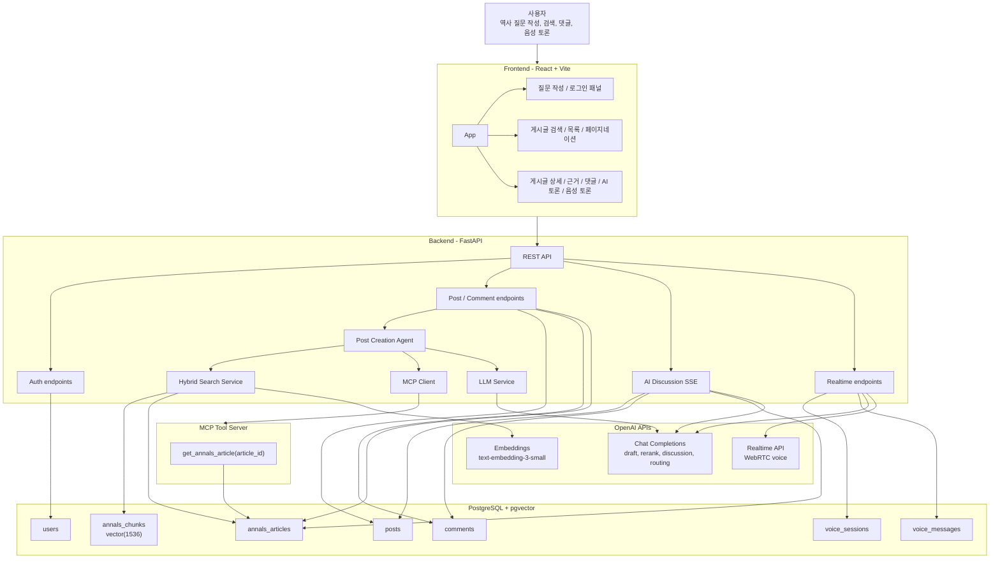

## 2. 배포 / 실행 구조

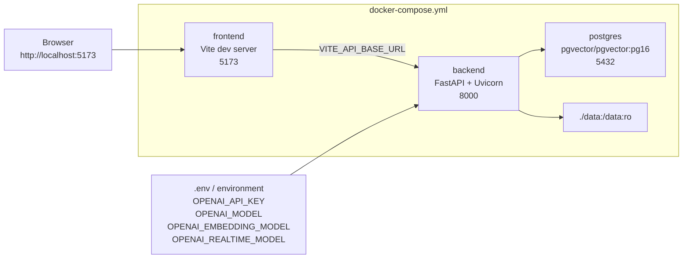

## 3. 홈페이지 / 프론트엔드 구조

현재 프론트엔드는 `frontend/src/main.jsx`의 단일 React 엔트리에서 `App`과 `PostDetail`을 구성합니다.

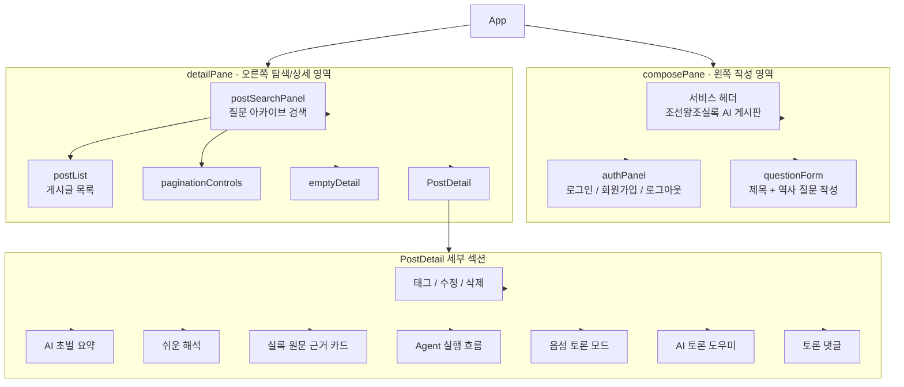

### 주요 프론트엔드 상태와 API 연결

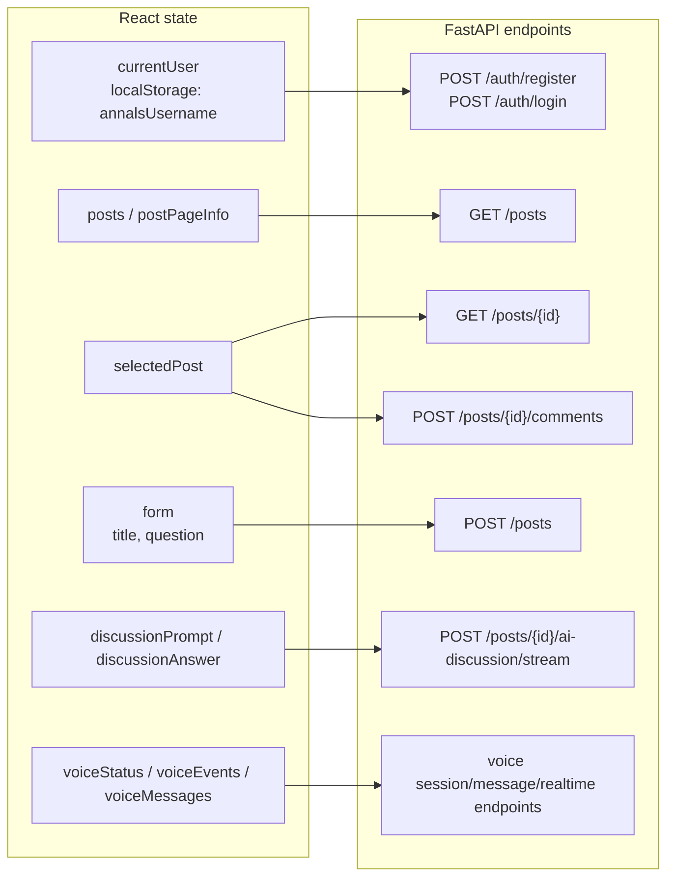

## 4. 백엔드 모듈 구조

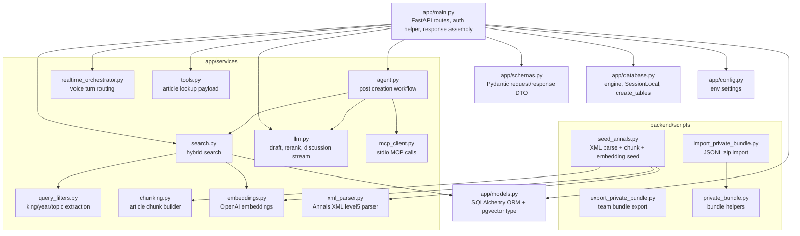

## 5. 데이터 모델 ERD

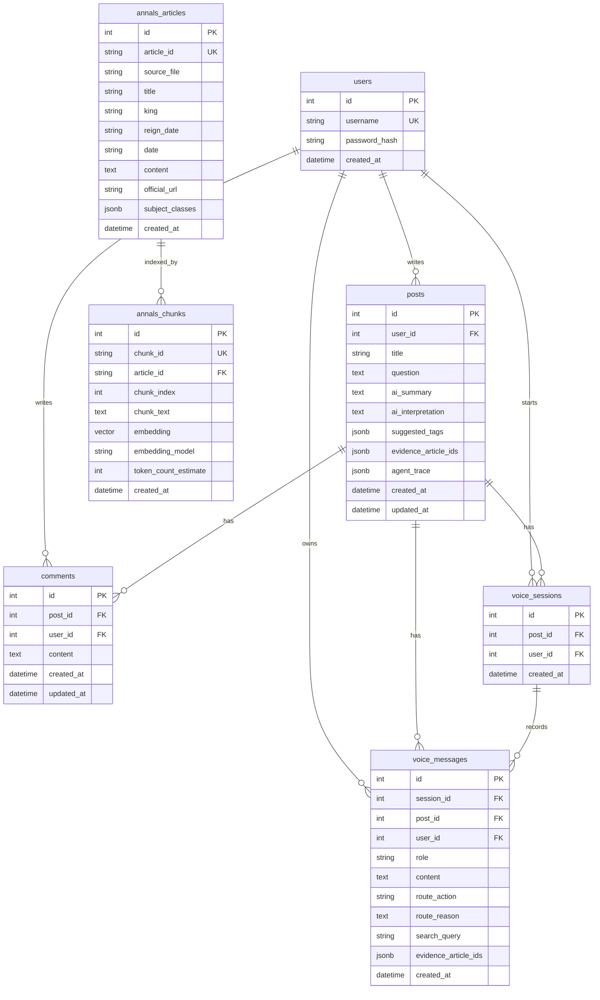

### 데이터 역할

| 테이블 | 역할 |
| --- | --- |
| `users` | 사용자 계정과 비밀번호 해시 저장 |
| `posts` | 질문 게시글, AI 요약/해석, 추천 태그, 근거 article_id, Agent trace 저장 |
| `comments` | 게시글 토론 댓글 저장 |
| `annals_articles` | 조선왕조실록 원문 기사 원본 저장소 |
| `annals_chunks` | RAG 검색용 chunk와 embedding vector 저장소 |
| `voice_sessions` | 게시글별 음성 토론 세션 저장 |
| `voice_messages` | 사용자/AI 음성 전사, 라우팅 판단, 추가 근거 article_id 저장 |

## 6. 데이터 적재 / 인덱싱 구조

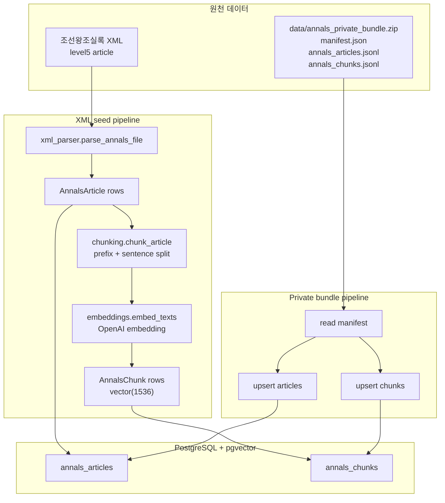

## 7. RAG / 게시글 생성 Agent 구조

사용자가 질문 게시글을 작성하면 `/posts` API가 `run_post_creation_agent`를 호출합니다. Agent는 검색, MCP 조회, LLM rerank, 초벌 생성 결과를 `posts` 테이블에 저장합니다.

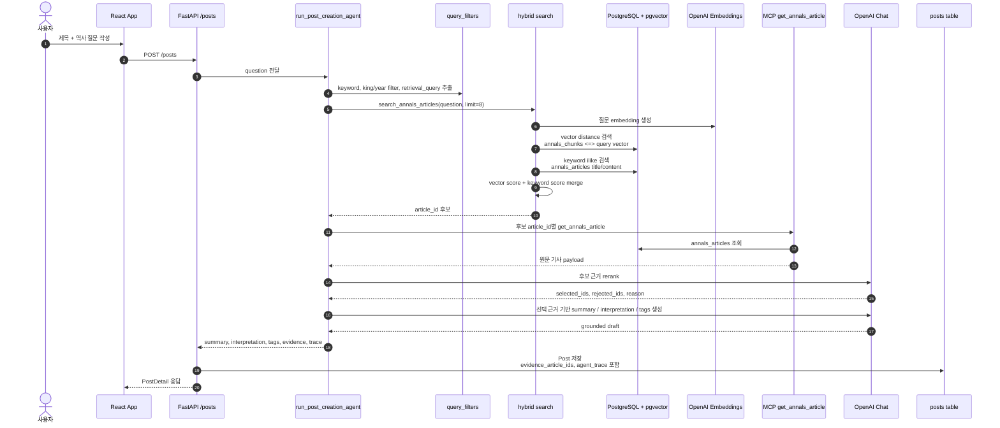

## 8. Hybrid Search 내부 구조

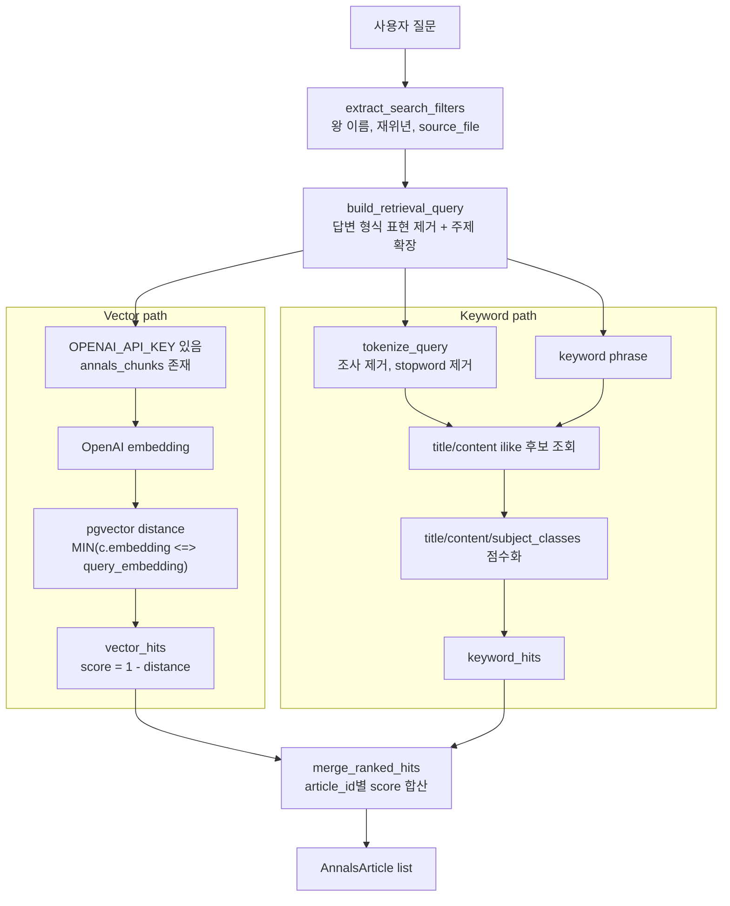

## 9. MCP 도구 구조

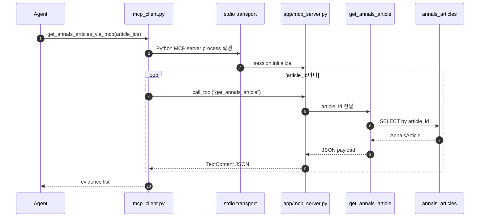

## 10. AI 토론 도우미 구조

게시글 상세 화면의 텍스트 기반 AI 토론 도우미는 SSE로 답변 조각을 스트리밍합니다.

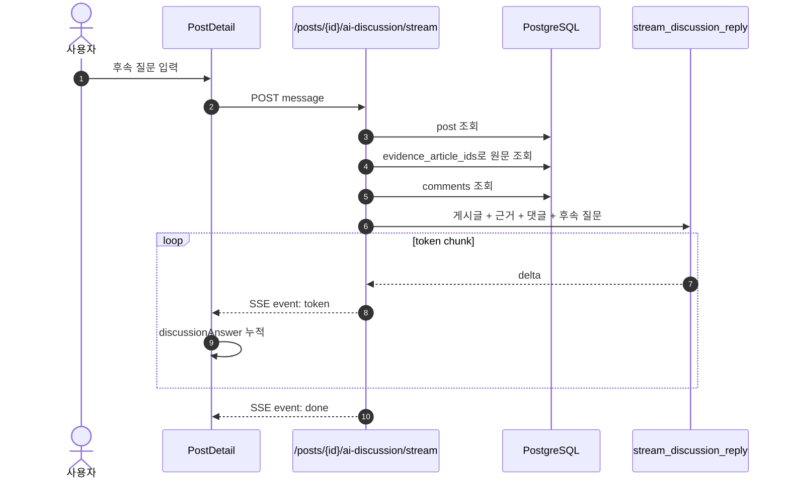

## 11. Realtime 음성 토론 구조

음성 토론은 WebRTC로 OpenAI Realtime API에 연결하고, 각 사용자 발화 전사마다 백엔드가 추가 검색 필요 여부를 판단합니다.

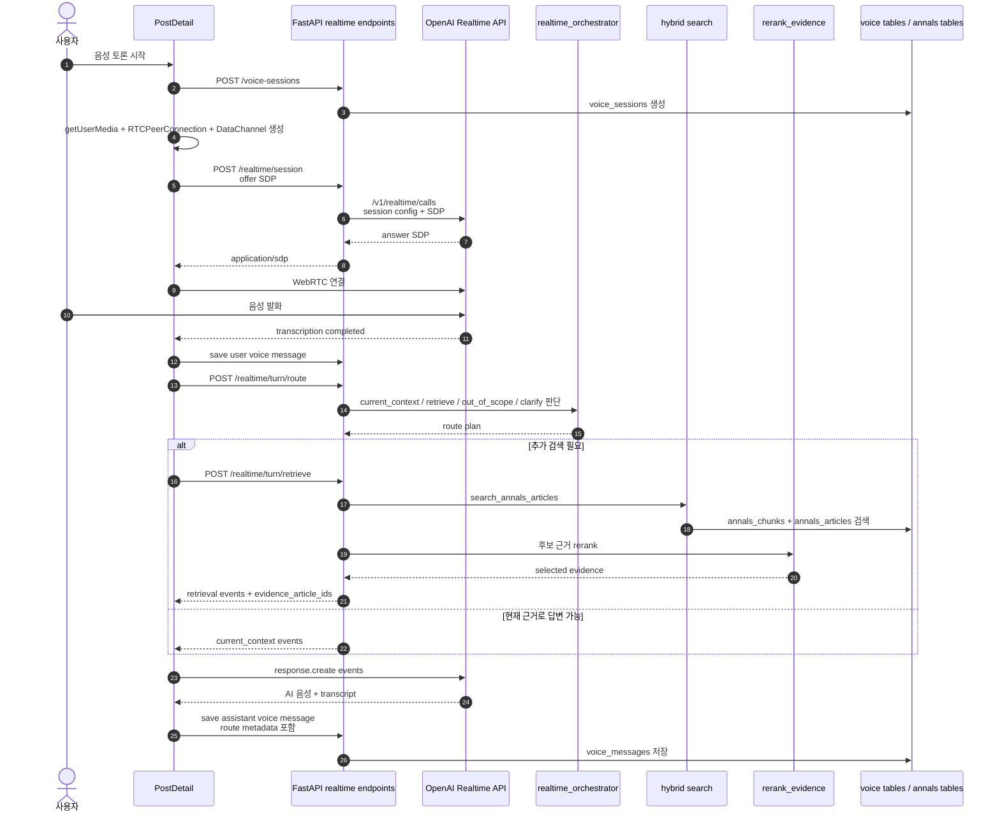

## 12. API 표면

| 영역 | Method / Path | 역할 |
| --- | --- | --- |
| Health | `GET /health` | API 상태 확인 |
| Auth | `POST /auth/register` | 회원가입 |
| Auth | `POST /auth/login` | 로그인 |
| Annals | `GET /annals/search` | 실록 원문 직접 검색 |
| Posts | `POST /posts` | 질문 작성 + RAG Agent 실행 + AI 초벌 저장 |
| Posts | `GET /posts` | 게시글 목록, 검색, 태그 필터, 페이징 |
| Posts | `GET /posts/{post_id}` | 게시글 상세, 댓글, 근거 기사 포함 |
| Posts | `PUT /posts/{post_id}` | 게시글 제목 수정 |
| Posts | `DELETE /posts/{post_id}` | 게시글 삭제 |
| Comments | `POST /posts/{post_id}/comments` | 댓글 작성 |
| AI Discussion | `POST /posts/{post_id}/ai-discussion/stream` | SSE 기반 후속 토론 답변 |
| Voice | `POST /posts/{post_id}/voice-sessions` | 음성 토론 로그 세션 생성 |
| Voice | `GET /posts/{post_id}/voice-messages` | 음성 대화 기록 조회 |
| Voice | `POST /posts/{post_id}/voice-sessions/{session_id}/messages` | 음성 전사/AI 답변 저장 |
| Realtime | `POST /posts/{post_id}/realtime/session` | OpenAI Realtime WebRTC SDP 교환 |
| Realtime | `POST /posts/{post_id}/realtime/turn/route` | 사용자 음성 발화 라우팅 |
| Realtime | `POST /posts/{post_id}/realtime/turn/retrieve` | 추가 RAG 검색 및 근거 이벤트 생성 |

## 13. 핵심 설계 포인트

- `annals_articles`는 원문 보존 테이블이고, `annals_chunks`는 검색 색인 테이블입니다.
- 게시글 생성 시에는 검색 결과 원문 전체를 바로 LLM에 넘기지 않고, MCP tool 조회와 LLM reranking을 거친 근거만 초벌 생성에 사용합니다.
- `posts.evidence_article_ids`와 `posts.agent_trace`를 저장해서, 게시글 상세에서 어떤 근거와 어떤 단계로 AI 결과가 만들어졌는지 확인할 수 있습니다.
- 검색은 embedding 기반 pgvector 검색과 keyword 검색을 합치는 hybrid 방식입니다. API 키나 chunk가 없으면 keyword 검색 중심으로 fallback됩니다.
- 텍스트 토론은 SSE 스트리밍, 음성 토론은 WebRTC + Realtime API로 분리되어 있습니다.
- 음성 토론은 모든 발화마다 무조건 RAG 검색하지 않고, `realtime_orchestrator`가 현재 근거로 답할지 추가 검색할지 먼저 라우팅합니다.
