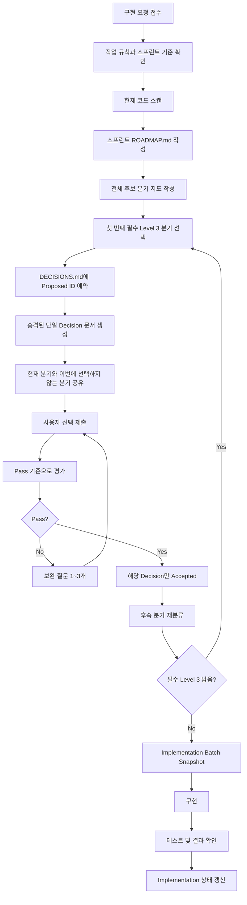

# Decision Harness Flow

이 문서는 설계 분기가 생겼을 때 Decision Harness가 실제로 어떻게 진행되는지 설명한다.

핵심은 하나다.

> 큰 선택지 하나로 여러 결정을 끝내지 않는다. 전체 분기 지도를 보고, 첫 번째 필수 분기부터 순서대로 통과한다.

---

## 1. 전체 흐름



---

## 2. Sprint Roadmap

구현 전에 Codex는 현재 요청을 만족하기 위해 보이는 결정 후보를 해당 스프린트의 `ROADMAP.md`에 먼저 나열한다.

예:

```md
# Sprint 1 Decision Roadmap

## 전체 분기 지도

| 순서 | 후보 | 질문 | 예상 Level | 상태 | 의존성 |
| --- | --- | --- | --- | --- | --- |
| 1 | C1 | 게시글에 `user_id`를 추가할 것인가? | Level 3 | Ready | 없음 |
| 2 | C2 | `author_name`을 유지할 것인가? | Level 3 또는 2 | Blocked | C1 |
| 3 | C3 | `author_name`은 서버에서 생성할 것인가, 클라이언트에서 받을 것인가? | Level 3 또는 2 | Blocked | C1, C2 |
| 4 | C4 | 게시글 수정/삭제 권한 검사는 어느 계층에서 할 것인가? | Level 2 | Blocked | C1 |
| 5 | C5 | 게시글 응답에 `user_id`를 노출할 것인가? | Level 2 또는 3 | Blocked | C1 |

## 지금 선택할 분기

현재 Decision으로 승격할 후보는 C1 하나뿐이다.

## 아직 선택하지 않는 분기

C2~C5는 C1 결과에 따라 다시 설명한다.
이번 선택으로 자동 확정하지 않는다.
```

ROADMAP의 목적은 후보에 가짜 Decision ID를 미리 붙이지 않고, 어떤 순서로 결정할지 사용자가 볼 수 있게 만드는 것이다.

---

## 3. 의존성 처리

여러 결정이 동시에 보이면 Codex는 먼저 의존성을 확인한다.

의존성이 있는 경우:

- 상위 결정을 먼저 찾는다.
- 상위 결정은 하위 결정을 자동 확정하지 않는다.
- 하위 결정은 상위 결정 결과에 따라 다시 Level을 판단한다.
- 하위 결정이 여전히 구조적 판단이면 별도 Decision으로 이어간다.
- 하위 결정이 명백한 구현 선택으로 낮아지면 Level 1 또는 Level 2로 처리하고 이유를 알린다.

대표적인 의존성 예:

- 게시글에 `user_id`를 추가할지 결정해야 수정/삭제 권한 검사 기준을 정할 수 있다.
- `author_name`을 유지할지 결정해야 생성 위치와 응답 계약을 정할 수 있다.
- DB 스키마가 정해져야 API 응답 필드를 안정적으로 정할 수 있다.

---

## 4. Level 1: 자동 처리

Level 1은 설계 학습보다 구현 흐름 유지가 더 중요한 작은 결정이다.

예:
- 변수명 정리
- 함수 내부 순서 조정
- 단순 조건문 정리
- 기존 패턴을 그대로 따르는 테스트 보강
- 명백한 버그 수정

이 경우 Codex는 멈추지 않고 진행한다.

---

## 5. Level 2: 짧은 알림 후 진행

Level 2는 약간의 설계 의미는 있지만, 되돌리기 쉽고 프로젝트 구조를 크게 바꾸지 않는 결정이다.

Codex는 다음 형식으로 짧게 알린 뒤 기본 선택으로 진행한다.

```md
[Small Branch]

상황:
기본 선택:
이유:
```

사용자가 이 시점에 개입하면 사용자 판단을 우선한다.

---

## 6. Level 3: Decision Harness 발동

Level 3는 사용자가 직접 판단해야 하는 구조적 결정이다.

분기 알림 전에 실제 Decision으로 승격된 후보만 `docs/decisions/DECISIONS.md`에 `Status: Proposed`로 예약한다. 실제 작업 문서는 해당 스프린트의 `decisions/` 폴더에 저장한다.

분기 알림 형식:

```md
[Decision Harness]

Proposed ID:

지금 선택할 분기:

이번에 선택하지 않는 것:
- 

왜 먼저 중요한가:

Roadmap 요약:
- 전체 분기:
- 의존성:
- 처리 순서:

Decision 문서:
- docs/decisions/sprint-1/decisions/D-001-{decision-topic}.md

선택지:
A.
B.

Codex 추천:

Pass 기준:
- 

사용자 답변 템플릿:
선택:
이유:
권한/DB/API/테스트 영향:
아직 다음 분기로 남겨둘 것:
```

---

## 7. 평가와 보완 질문

사용자 답변이 아래 중 하나라도 부족하면 바로 Pass하지 않는다.

- 선택은 했지만 이유가 없다.
- 권한 기준과 표시 기준을 구분하지 않았다.
- DB/API/테스트 중 무엇이 바뀌는지 언급하지 않았다.
- 상위 결정으로 인해 어떤 하위 결정이 남는지 이해하지 못했다.
- trade-off 없이 "그냥 A"처럼 답했다.
- 롤백 또는 재검토 조건이 전혀 없다.

이 경우 1~3개의 보완 질문을 한다.

짧은 Q&A는 Decision 문서 하단에 둘 수 있다. 선택 판단을 바꾸거나 길어진 Q&A, 재발 방지 성격의 Q&A, Final Accepted Prompt는 troubleshooting 문서로 분리한다.

---

## 8. 트러블슈팅 결론 기록

최종 Pass가 되면 troubleshooting 문서에 `Final Accepted Prompt` 섹션을 남긴다.

포함할 내용:

- 통과된 Decision
- 사용자 최종 답변
- Codex 평가
- Pass 이유
- 보완 질문 여부
- 아직 남은 후속 분기
- 최종 결론

질문과 답변만 남기지 않는다. 어떤 프롬프트가 왜 통과됐는지 결론 형태로 남긴다.
