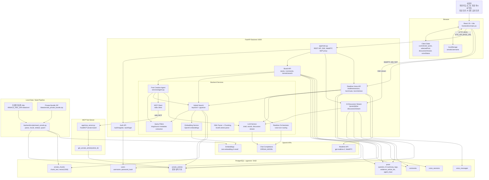
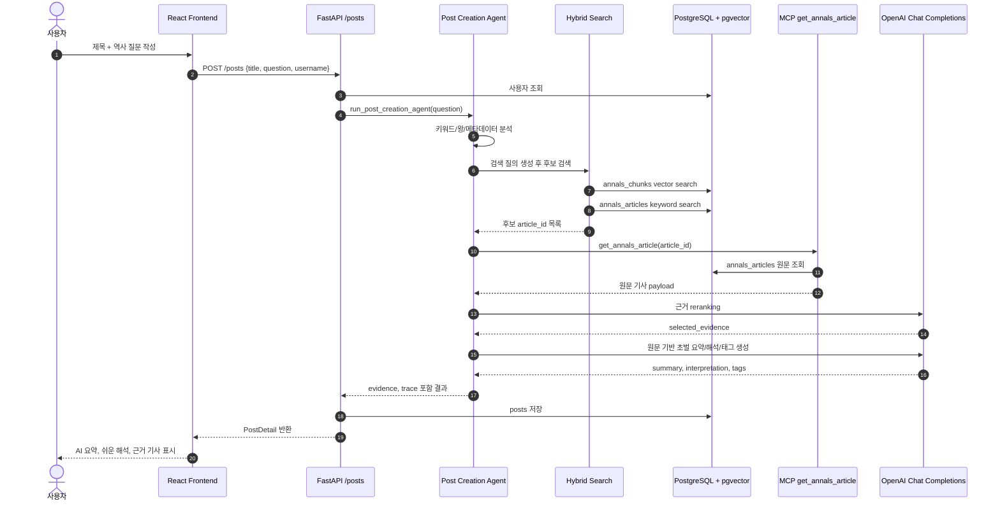
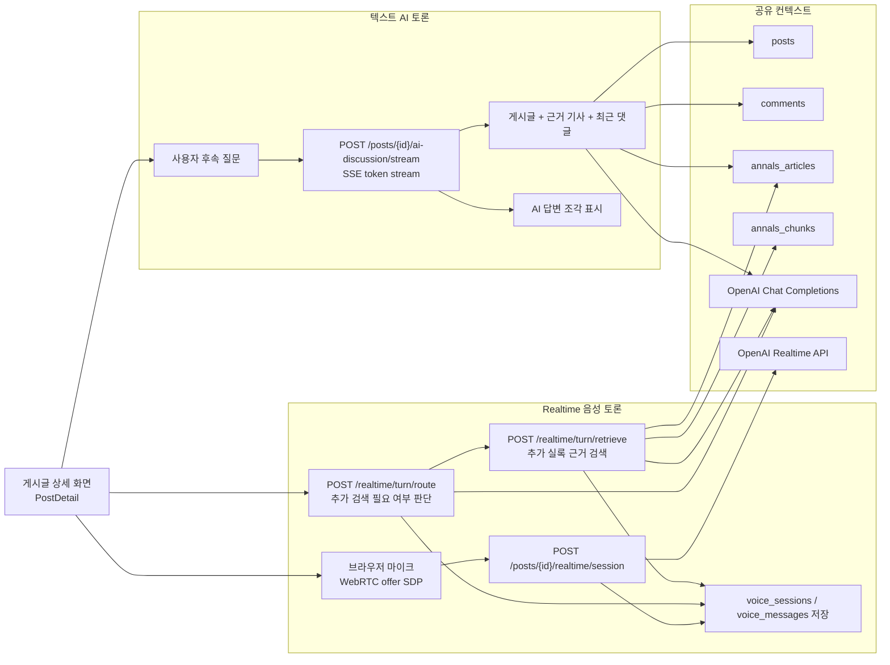
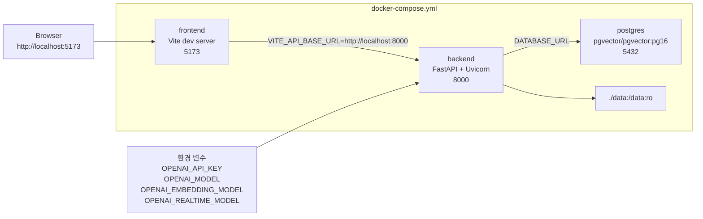
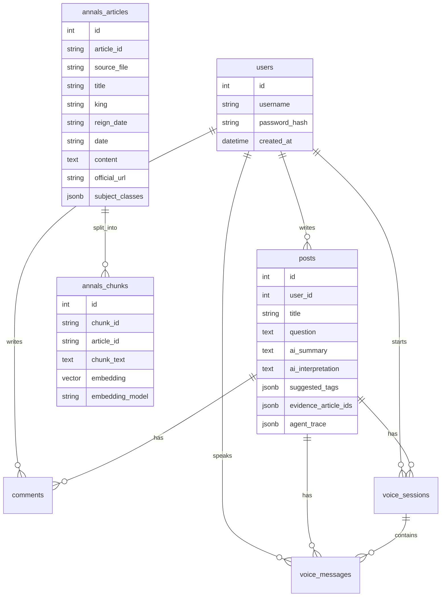

# 풀스택 아키텍처 다이어그램

이 문서는 현재 코드 기준으로 프론트엔드, 백엔드, 데이터베이스, RAG/Agent, MCP, OpenAI 연동을 한 번에 볼 수 있도록 정리한 전체 풀스택 아키텍처 다이어그램입니다.

## 1. 전체 풀스택 구조

## 2. 게시글 작성 및 RAG Agent 흐름

## 3. 토론 및 음성 기능 흐름

## 4. 배포 / 실행 컨테이너 구조

## 5. 저장 데이터 관점

