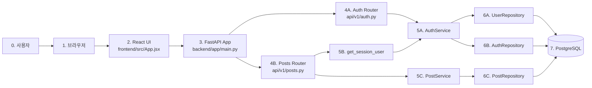
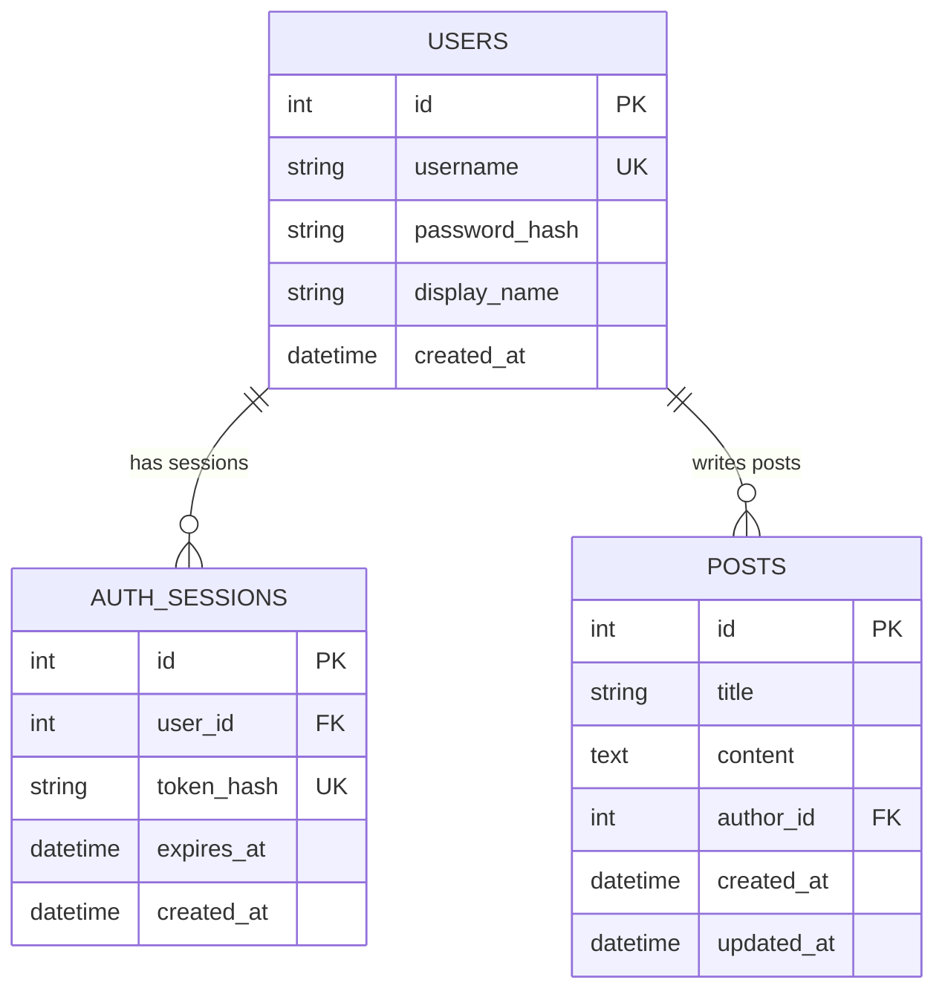
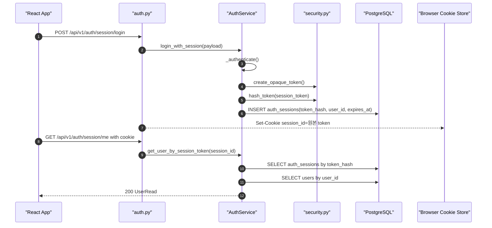
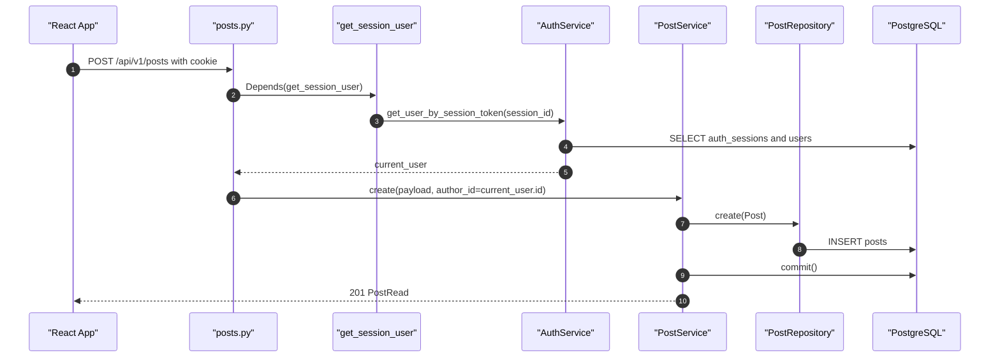
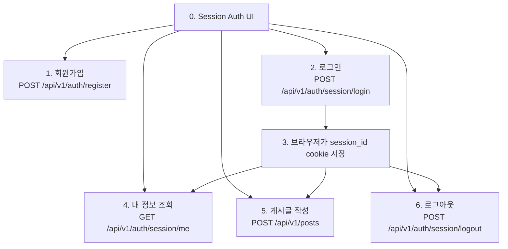

# 레포지토리 전체 흐름

이 문서는 현재 `ts` 브랜치의 Sprint 1, Sprint 2 구현을 한 번에 파악하기 위한 문서입니다.

현재 레포는 FastAPI 백엔드, PostgreSQL, React 프론트엔드로 구성되어 있습니다. Sprint 1에서는 게시글과 사용자 FK 기반 요청 흐름을 만들었고, Sprint 2에서는 인증 방식을 **Session only**로 정리했습니다.

## 전체 구조

```text
W16/
├── backend/
│   ├── app/
│   │   ├── main.py
│   │   ├── api/
│   │   ├── core/
│   │   ├── db/
│   │   ├── models/
│   │   ├── repositories/
│   │   ├── schemas/
│   │   └── services/
│   └── tests/
├── frontend/
│   ├── src/
│   │   ├── App.jsx
│   │   ├── main.jsx
│   │   └── styles.css
│   └── package.json
├── docs/
├── docs2/
├── docker-compose.yml
├── requirements.txt
└── README.md
```

## 시스템 흐름



프론트엔드는 `fetch()`로 백엔드 API를 호출합니다. Session cookie를 포함해야 하므로 공통 요청 함수에서 `credentials: "include"`를 사용합니다.

전체 흐름 읽는 법:

```text
1-3은 사용자의 브라우저 요청이 React를 거쳐 FastAPI 앱에 도착하는 구간이다.
4A-6B는 회원가입, 로그인, 내 정보 조회, 로그아웃 같은 인증 흐름이다.
4B-6C는 게시글 작성 같은 게시글 API 흐름이다.
7은 실제 데이터가 저장되거나 조회되는 PostgreSQL이다.
```

## 데이터 모델



## Session 인증 흐름



단계별 읽기:

```text
1-7은 로그인이다. 서버는 원본 session token을 만들고 DB에는 token_hash만 저장한다.
8-12는 현재 사용자 확인이다. 브라우저가 cookie를 보내면 서버가 session을 조회하고 user를 반환한다.
```

핵심:

```text
cookie에는 원본 session token이 들어간다.
DB에는 원본 token이 아니라 token_hash만 저장한다.
요청이 들어오면 cookie의 원본 token을 다시 hash해서 DB의 token_hash와 비교한다.
```

## 게시글 작성 흐름



게시글 생성 요청 body에는 작성자 정보가 없습니다. 서버가 Session으로 현재 사용자를 확인하고, `posts.author_id`에 `current_user.id`를 저장합니다.

단계별 읽기:

```text
1. React App이 게시글 작성 API를 호출한다.
2-5. posts.py는 먼저 session cookie로 current_user를 확인한다.
6. 서버는 current_user.id를 author_id로 넣는다.
7-8. PostRepository가 posts table에 저장한다.
9. PostService가 commit한다.
10. 생성된 게시글을 응답한다.
```

## 프론트엔드 흐름



`frontend/src/App.jsx`에서 봐야 할 함수:

프론트엔드 흐름 읽는 법:

```text
1은 cookie가 없어도 가능한 요청이다.
2-3에서 로그인 성공 후 session_id cookie가 생긴다.
4-6은 session_id cookie가 있어야 의미 있는 요청이다.
```

- `submit`: 회원가입 또는 Session 로그인 요청
- `loadMe`: 현재 사용자 확인 요청
- `createPost`: 보호 API인 게시글 작성 요청
- `logout`: 현재 Session 삭제 요청
- `request`: 모든 요청에 `credentials: "include"`를 붙이는 공통 fetch 함수

## 에러 기준

| 상황 | status | code |
| --- | --- | --- |
| username 중복 | `409` | `USERNAME_ALREADY_EXISTS` |
| 로그인 실패 | `401` | `INVALID_CREDENTIALS` |
| session cookie 없음 | `401` | `SESSION_REQUIRED` |
| session 만료/무효 | `401` | `INVALID_SESSION` |
| request validation 실패 | `422` | `VALIDATION_ERROR` |
| 게시글 없음 | `404` | `POST_NOT_FOUND` |

`403 Forbidden`은 내일 CRUD Sprint에서 게시글 수정/삭제 작성자 권한을 구현할 때 사용합니다.

## 코드 읽기 추천 순서

1. `frontend/src/App.jsx`
   - 사용자가 누르는 버튼과 API endpoint를 연결해서 봅니다.

2. `backend/app/main.py`
   - CORS `allow_credentials=True`, router 등록, error handler를 봅니다.

3. `backend/app/api/v1/auth.py`
   - `register`, `session_login`, `get_session_user`, `session_me`, `session_logout`을 봅니다.

4. `backend/app/services/auth_service.py`
   - Sprint 2의 핵심 파일입니다. 회원가입, 비밀번호 검증, 세션 생성, 세션 조회, 로그아웃을 봅니다.

5. `backend/app/core/security.py`
   - `hash_password`, `verify_password`, `create_opaque_token`, `hash_token`을 봅니다.

6. `backend/app/models/auth.py`
   - `auth_sessions` 테이블 구조를 봅니다.

7. `backend/app/api/v1/posts.py`
   - 게시글 작성 endpoint가 `get_session_user`를 dependency로 요구하는지 봅니다.

8. `backend/tests/test_auth_flow.py`, `backend/tests/test_posts_flow.py`
   - 의도한 인증 흐름이 테스트로 어떻게 고정되는지 봅니다.

## 설계 포인트

- Session 인증만 프로젝트 기본값으로 사용합니다.
- 세션 저장소는 PostgreSQL `auth_sessions` 테이블입니다.
- Session 만료 시간은 4시간입니다.
- Session cookie는 `HttpOnly`, `SameSite=Lax`, `Path=/`를 사용합니다.
- 로컬 개발에서는 `Secure=False`, 배포 환경에서는 `Secure=True`로 둡니다.
- CSRF token은 이번 Sprint에서 보류하고, `SameSite=Lax`와 CORS origin 제한을 최소 안전장치로 둡니다.
- 게시글 수정/삭제 권한의 `403 Forbidden` 처리는 다음 CRUD Sprint에서 구현합니다.
