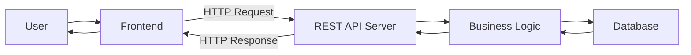
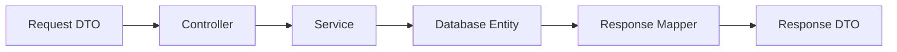
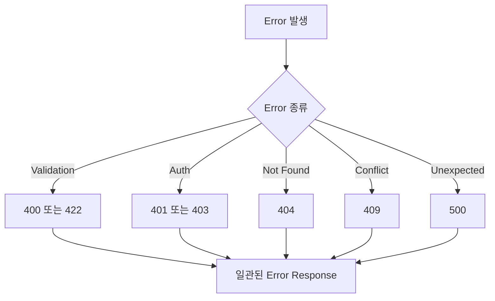
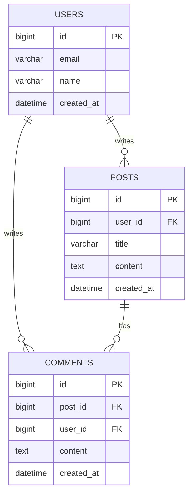
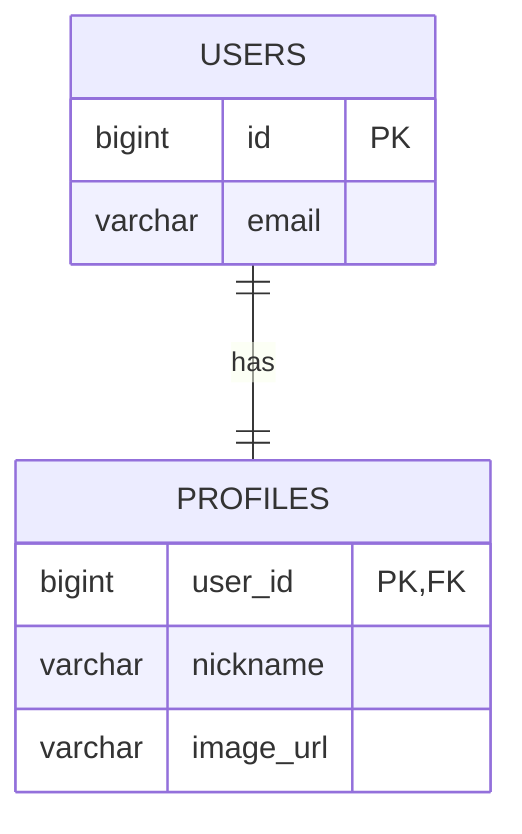
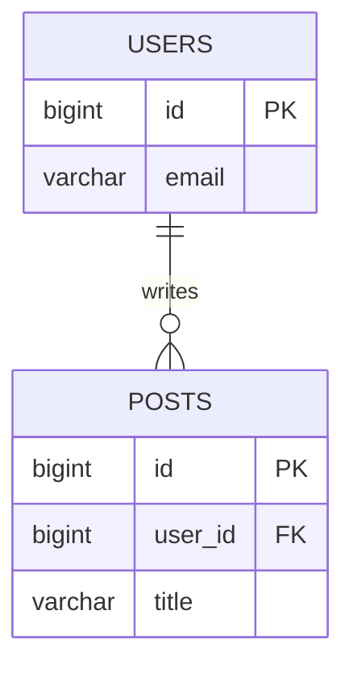
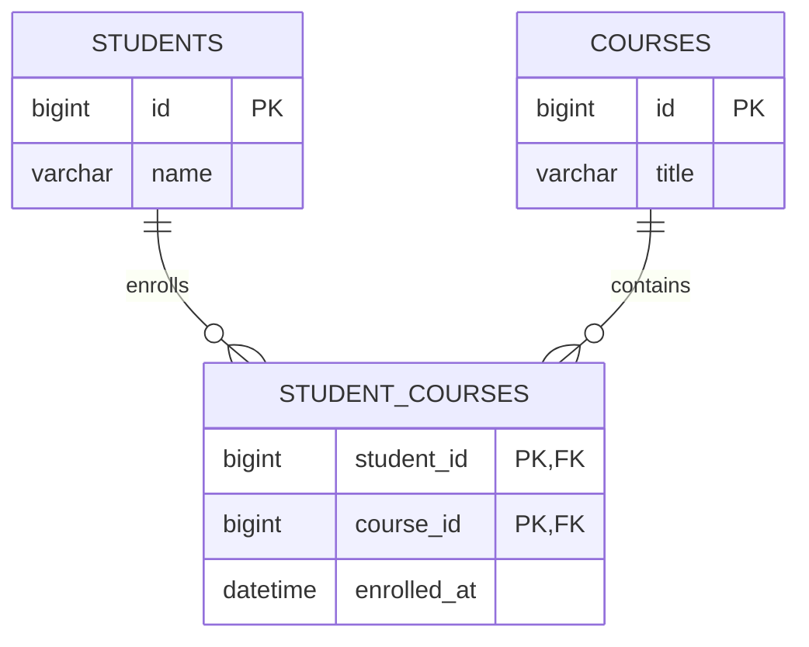
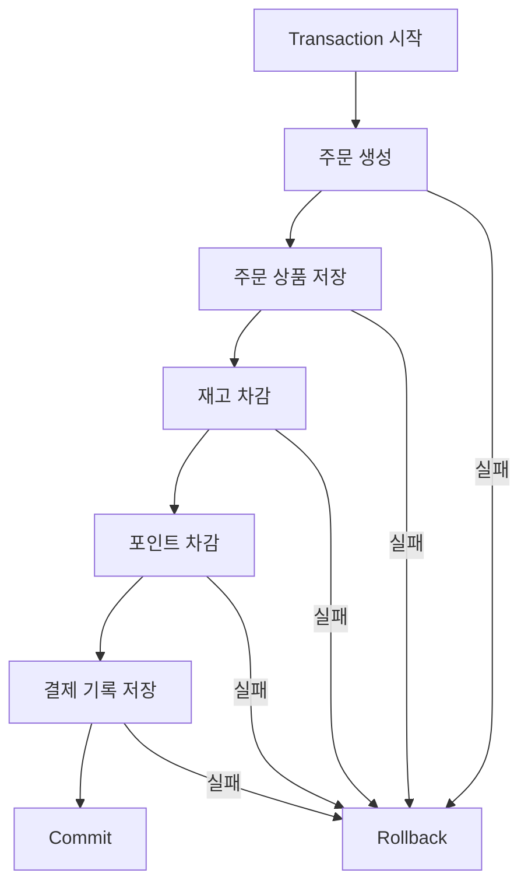
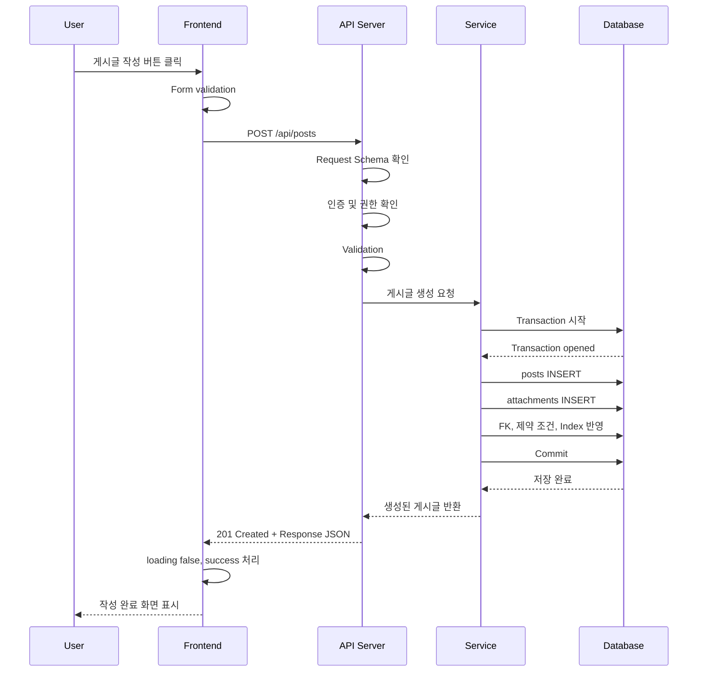
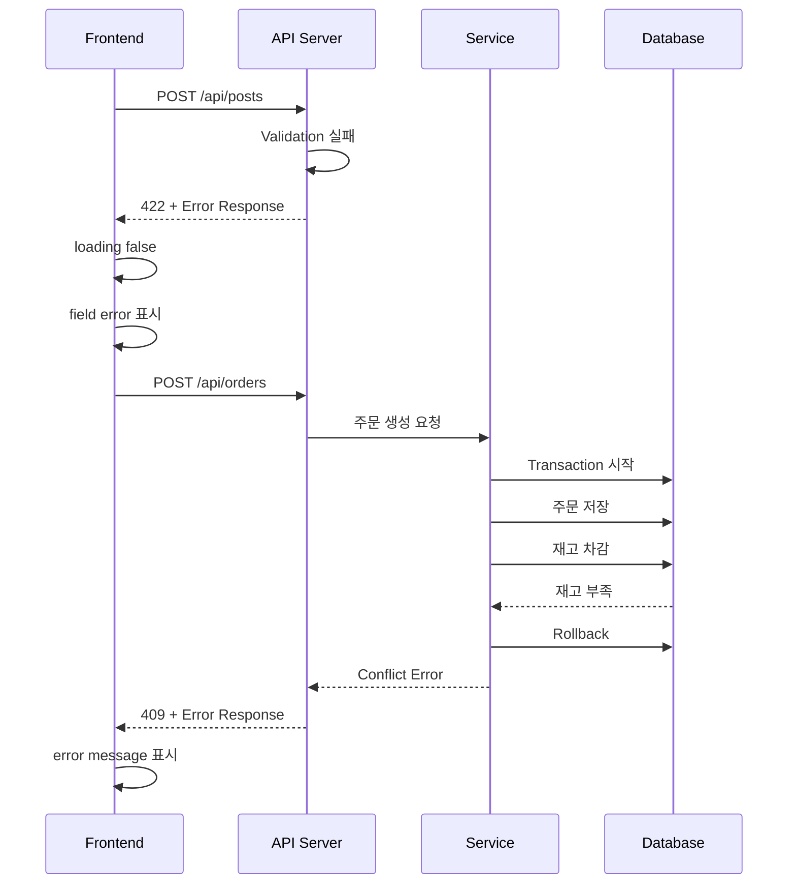

# 백엔드 API와 데이터 모델링 기본 정리

## 목차

1. REST API는 왜 필요할까?
2. REST API 기본 개념
3. HTTP Method
4. HTTP Status Code
5. Request / Response Schema
6. Validation
7. Error Response 형식
8. ERD와 데이터 모델링
9. 1:1, 1:N, N:M 관계
10. PK, FK, Index
11. Transaction이 필요한 순간
12. 프론트엔드에서 Loading / Error / Success 다루기
13. 전체 요청 흐름 정리
14. 결론

---

## 1. REST API는 왜 필요할까?

웹 애플리케이션은 크게 사용자가 보는 화면을 담당하는 프론트엔드와, 데이터를 저장하고 비즈니스 로직을 처리하는 백엔드로 나눌 수 있습니다.

예를 들어 사용자가 게시글 작성 버튼을 누르면 프론트엔드는 화면에서 제목과 내용을 입력받습니다. 하지만 이 데이터를 실제로 저장하고, 작성자가 누구인지 확인하고, 데이터베이스에 기록하는 일은 백엔드가 담당합니다.

이때 프론트엔드와 백엔드 사이에는 서로 약속된 대화 방식이 필요합니다. 프론트엔드가 아무 형식으로나 데이터를 보내고, 백엔드가 아무 형식으로나 응답하면 두 영역은 안정적으로 협력할 수 없습니다.

REST API는 이러한 문제를 해결하기 위한 약속입니다.

API(Application Programming Interface)는 서로 다른 프로그램이 정해진 방식으로 기능이나 데이터를 주고받기 위한 인터페이스입니다. REST API는 HTTP를 기반으로 자원(Resource)을 중심에 두고, 정해진 URL과 Method를 사용하여 클라이언트와 서버가 통신하도록 설계하는 방식입니다.

REST API를 단순히 "URL을 만드는 규칙"으로만 이해하면 부족합니다. 실무에서 REST API는 프론트엔드와 백엔드 사이의 계약(Contract)에 가깝습니다.

계약이라는 말은 다음을 뜻합니다.

- 프론트엔드는 어떤 URL로 어떤 데이터를 보내야 하는지 알고 있다.
- 백엔드는 어떤 요청을 받으면 어떤 검증과 처리를 해야 하는지 알고 있다.
- 응답 성공 시 어떤 데이터가 오는지 정해져 있다.
- 실패 시 어떤 에러 형식이 오는지 정해져 있다.
- 이 계약이 안정적이면 프론트엔드와 백엔드는 독립적으로 개발할 수 있다.



예를 들어 게시글 목록을 조회하는 API 계약은 다음처럼 표현할 수 있습니다.

```http
GET /api/posts?page=1&size=10 HTTP/1.1
Host: example.com
Accept: application/json
```

서버는 이 요청에 대해 다음과 같은 응답을 반환할 수 있습니다.

```json
{
  "items": [
    {
      "id": 1,
      "title": "REST API 정리",
      "authorName": "jungle",
      "createdAt": "2026-06-13T10:00:00Z"
    }
  ],
  "page": 1,
  "size": 10,
  "totalCount": 35
}
```

이처럼 API는 단순히 데이터를 주고받는 통로가 아니라, 서비스의 기능을 외부에서 사용할 수 있도록 정리한 공용 인터페이스입니다.

핵심은 REST API가 프론트엔드와 백엔드의 경계를 명확히 하고, 서로 독립적으로 개발할 수 있게 해주는 계약이라는 점입니다.

### 실제 코드에서 보기

```python
# backend/app/main.py
app = FastAPI(title="Sprint 1 API Data Flow", lifespan=lifespan)
register_error_handlers(app)
app.include_router(posts_router, prefix="/api/v1")
```

```python
# backend/tests/test_posts_flow.py
create_response = client.post(
    "/api/v1/posts",
    json={"title": "스프린트 1", "content": "API와 DB 흐름", "author_name": "team1"},
)

assert create_response.status_code == 201
```

#### 1. `backend/app/main.py` (API 서버 설정)

이 파일은 FastAPI 애플리케이션의 엔트리 포인트입니다. 서버가 실행될 때 어떤 라우터를 사용할지, 공통 에러 처리는 어떻게 할지, API의 기본 경로는 어떻게 묶을지를 설정합니다.

- `app = FastAPI(...)`: FastAPI 애플리케이션 인스턴스를 생성합니다. 여기서 만들어진 `app`이 실제 API 서버의 중심 객체입니다.
- `title="Sprint 1 API Data Flow"`: API 문서 화면이나 OpenAPI 문서에 표시될 애플리케이션 이름입니다.
- `lifespan=lifespan`: 서버가 시작될 때와 종료될 때 실행할 로직을 연결합니다. 이 프로젝트에서는 서버 시작 시 DB 테이블을 준비하는 흐름과 연결됩니다.
- `register_error_handlers(app)`: 서버에서 발생하는 에러를 한곳에서 처리하도록 등록합니다. 덕분에 에러가 발생해도 응답 형식을 API 전체에서 일관되게 유지할 수 있습니다.
- `app.include_router(posts_router, prefix="/api/v1")`: `posts_router`에 정의된 게시글 API들을 `/api/v1`이라는 공통 경로 아래에 붙입니다.

예를 들어 `posts_router` 내부에 `/posts`라는 경로가 있다면, `main.py`에서 `/api/v1` prefix가 붙어서 실제 호출 주소는 `/api/v1/posts`가 됩니다.

#### 2. `backend/tests/test_posts_flow.py` (API 기능 테스트)

이 파일은 API가 요구사항대로 동작하는지 확인하는 통합 테스트 코드입니다. 실제 프론트엔드가 아직 없더라도, 테스트 코드가 클라이언트 역할을 하면서 API 계약을 검증합니다.

- `client.post(...)`: FastAPI의 `TestClient`를 사용해 실제 서버를 따로 띄우지 않고 HTTP `POST` 요청을 보냅니다.
- `"/api/v1/posts"`: 클라이언트가 호출해야 하는 실제 API 경로입니다. 이 경로가 바뀌면 클라이언트 코드도 함께 영향을 받습니다.
- `json={...}`: 클라이언트가 서버로 보내는 request body입니다. 여기서는 `title`, `content`, `author_name`을 JSON 형식으로 전송합니다.
- `assert create_response.status_code == 201`: 게시글 생성이 성공했을 때 서버가 `201 Created`를 반환하는지 확인합니다. 이 테스트가 실패하면 API 계약이 깨졌다는 신호로 볼 수 있습니다.

#### 정리하면

이 코드는 실제 프로젝트에서 API 계약이 어디서 시작되는지 보여줍니다. [backend/app/main.py](/Users/tail1/Documents/스프린트1/backend/app/main.py:18)는 API 서버의 공통 경로와 에러 처리 환경을 만들고, [backend/tests/test_posts_flow.py](/Users/tail1/Documents/스프린트1/backend/tests/test_posts_flow.py:12)는 클라이언트가 어떤 URL과 JSON body로 요청해야 하는지 테스트로 고정합니다. 즉 테스트가 프론트엔드와 백엔드 사이의 API 계약 문서 역할도 함께 합니다.

---

## 2. REST API 기본 개념

REST(Representational State Transfer)는 웹의 기본 원리인 HTTP, URL, Method, 상태 코드 등을 활용하여 서버의 자원을 다루는 설계 방식입니다.

여기서 자원(Resource)이란 사용자, 게시글, 댓글, 주문, 상품처럼 시스템에서 다루는 핵심 대상을 의미합니다. REST에서는 기능 이름보다 자원 이름을 URL에 표현하는 것을 중요하게 봅니다.

예를 들어 게시글 목록 조회 API를 만든다고 해보겠습니다.

좋은 URL은 보통 다음과 같습니다.

```http
GET /api/posts
```

반면 다음과 같은 URL은 REST 관점에서 덜 좋은 설계입니다.

```http
GET /api/getPostList
```

첫 번째 URL은 `posts`라는 자원을 조회한다는 의미가 분명합니다. 두 번째 URL은 `getPostList`라는 동작 이름이 URL에 들어가 있습니다. REST에서는 URL은 자원을 나타내고, 동작은 HTTP Method로 표현하는 것을 권장합니다.

자주 사용하는 REST API 설계 예시는 다음과 같습니다.

```http
GET    /api/posts        # 게시글 목록 조회
GET    /api/posts/1      # 1번 게시글 조회
POST   /api/posts        # 게시글 생성
PATCH  /api/posts/1      # 1번 게시글 일부 수정
DELETE /api/posts/1      # 1번 게시글 삭제
```

REST API를 설계할 때 중요한 기준은 다음과 같습니다.

- URL은 명사 중심으로 작성한다.
- 자원은 복수형을 사용하는 경우가 많다. 예: `/posts`, `/users`
- 행위는 URL이 아니라 HTTP Method로 표현한다.
- 계층 관계는 URL 경로로 표현할 수 있다.
- 응답 형식은 일관되게 유지한다.

예를 들어 특정 게시글의 댓글 목록을 조회한다면 다음처럼 표현할 수 있습니다.

```http
GET /api/posts/1/comments
```

이는 "1번 게시글이라는 자원 아래에 속한 댓글 자원 목록"을 조회한다는 의미입니다.

하지만 모든 것을 URL 계층으로 깊게 표현하는 것이 좋은 것은 아닙니다. URL이 너무 길고 복잡해지면 API 사용성이 떨어집니다.

```http
GET /api/users/3/posts/1/comments/10/replies/5/likes
```

이런 식으로 지나치게 깊은 구조는 유지보수하기 어렵습니다. 실무에서는 자원의 소유 관계가 분명한 경우에만 계층을 사용하고, 검색 조건은 Query String으로 표현하는 경우가 많습니다.

```http
GET /api/comments?postId=1
```

REST API는 완벽한 이론을 지키는 것보다, 팀 안에서 일관된 규칙을 만들고 유지하는 것이 더 중요합니다. URL 설계, Method 사용, 상태 코드, 에러 응답 형식이 일관되면 프론트엔드와 백엔드 모두 예측 가능한 개발을 할 수 있습니다.

핵심은 REST API가 자원을 중심으로 URL을 설계하고, 동작은 HTTP Method로 표현하는 방식이라는 점입니다.

### 실제 코드에서 보기

```python
# backend/app/api/v1/posts.py
router = APIRouter(prefix="/posts", tags=["posts"])


@router.post("", response_model=PostRead, status_code=status.HTTP_201_CREATED)
def create_post(payload: PostCreate, db: Session = Depends(get_db)) -> PostRead:
    return PostService(db).create(payload)


@router.get("", response_model=list[PostRead])
def list_posts(db: Session = Depends(get_db)) -> list[PostRead]:
    return PostService(db).list()
```

#### 1. `backend/app/api/v1/posts.py` (게시글 API 라우터)

이 파일은 게시글이라는 자원(Resource)을 외부에서 다룰 수 있도록 HTTP endpoint를 정의합니다. REST API 관점에서는 URL은 자원을 나타내고, `POST`, `GET` 같은 HTTP Method가 동작을 나타냅니다.

- `router = APIRouter(prefix="/posts", tags=["posts"])`: 게시글 관련 API를 하나의 라우터로 묶습니다. `prefix="/posts"`는 이 라우터의 모든 endpoint가 게시글 자원을 다룬다는 뜻입니다.
- `tags=["posts"]`: FastAPI 문서에서 이 API들을 `posts` 그룹으로 묶어 보여주기 위한 설정입니다. 기능 동작에는 직접 영향을 주지 않지만 API 문서 가독성을 높입니다.
- `@router.post("")`: `/posts` 자원에 새 게시글을 생성하는 endpoint입니다. URL에 `createPost` 같은 동사를 넣지 않고, `POST` Method로 생성 의도를 표현합니다.
- `response_model=PostRead`: 이 API가 성공했을 때 응답 body가 `PostRead` schema를 따른다는 뜻입니다.
- `status_code=status.HTTP_201_CREATED`: 생성 성공 시 HTTP 상태 코드로 `201 Created`를 반환하겠다는 계약입니다.
- `@router.get("")`: `/posts` 자원 목록을 조회하는 endpoint입니다. 같은 URL이라도 Method가 `GET`이면 조회, `POST`이면 생성이 됩니다.
- `PostService(db).list()`: 라우터가 직접 DB 조회를 하지 않고, 서비스 계층에 목록 조회 작업을 위임합니다.

#### 정리하면

이 코드는 [backend/app/api/v1/posts.py](/Users/tail1/Documents/스프린트1/backend/app/api/v1/posts.py:8)의 `prefix="/posts"`가 자원(Resource)을 나타내고, `@router.post("")`, `@router.get("")`가 동작을 나타내는 구조입니다. 최종 URL은 [backend/app/main.py](/Users/tail1/Documents/스프린트1/backend/app/main.py:20)의 `/api/v1` prefix와 합쳐져 `/api/v1/posts`가 됩니다. URL에 `createPost`, `getPostList` 같은 동사를 넣지 않고, HTTP Method로 의도를 표현한다는 REST 설계 원칙이 드러납니다.

---

## 3. HTTP Method

HTTP Method는 클라이언트가 서버에게 "이 자원에 대해 무엇을 하고 싶은지"를 알려주는 동사입니다.

REST API에서 가장 많이 사용하는 Method는 GET, POST, PUT, PATCH, DELETE입니다.

### GET

GET은 데이터를 조회할 때 사용합니다.

```http
GET /api/posts/1 HTTP/1.1
```

GET 요청은 서버의 데이터를 변경하지 않는 것이 원칙입니다. 예를 들어 게시글 조회, 상품 목록 조회, 사용자 정보 조회처럼 읽기 작업에 사용합니다.

GET 요청에는 보통 Request Body를 사용하지 않고, 필요한 조건은 Query String으로 전달합니다.

```http
GET /api/posts?keyword=api&page=1&size=10
```

### POST

POST는 새로운 자원을 생성하거나, 단순 CRUD로 표현하기 어려운 명령을 처리할 때 사용합니다.

```http
POST /api/posts HTTP/1.1
Content-Type: application/json

{
  "title": "REST API 정리",
  "content": "REST API는 프론트엔드와 백엔드 사이의 계약이다."
}
```

게시글 생성, 회원가입, 로그인, 주문 생성 등에 자주 사용합니다.

### PUT

PUT은 특정 자원을 전체 교체할 때 사용합니다.

```http
PUT /api/posts/1 HTTP/1.1
Content-Type: application/json

{
  "title": "수정된 제목",
  "content": "수정된 내용",
  "published": true
}
```

PUT은 "이 자원의 현재 상태를 요청 본문으로 완전히 대체한다"는 의미에 가깝습니다. 따라서 일부 필드만 보낼 때는 주의가 필요합니다. 서버 구현에 따라 누락된 필드가 null이나 기본값으로 바뀔 수 있기 때문입니다.

### PATCH

PATCH는 특정 자원의 일부를 수정할 때 사용합니다.

```http
PATCH /api/posts/1 HTTP/1.1
Content-Type: application/json

{
  "title": "제목만 수정"
}
```

실무에서는 전체 수정과 일부 수정을 명확히 구분하기 어렵거나, 대부분 일부 필드만 수정하는 경우가 많기 때문에 PATCH가 자주 사용됩니다.

### DELETE

DELETE는 특정 자원을 삭제할 때 사용합니다.

```http
DELETE /api/posts/1 HTTP/1.1
```

삭제 후에는 `204 No Content`를 반환하거나, 삭제된 자원의 정보를 `200 OK`로 반환할 수 있습니다. 중요한 것은 팀에서 정한 규칙을 일관되게 유지하는 것입니다.

### 멱등성

HTTP Method를 이해할 때 중요한 개념 중 하나가 멱등성(Idempotency)입니다. 멱등성이란 같은 요청을 한 번 보내든 여러 번 보내든 서버의 최종 상태가 같다는 뜻입니다.

예를 들어 `GET /api/posts/1`은 여러 번 호출해도 데이터를 조회할 뿐 서버 상태를 바꾸지 않으므로 멱등합니다.

`DELETE /api/posts/1`도 보통 멱등한 요청으로 봅니다. 한 번 삭제하면 게시글이 삭제되고, 같은 요청을 다시 보내도 최종 상태는 "게시글이 없음"으로 같습니다.

반면 `POST /api/orders`는 보통 멱등하지 않습니다. 같은 주문 생성 요청을 두 번 보내면 주문이 두 개 생길 수 있기 때문입니다.

| Method | 주 용도 | Body 사용 | 서버 상태 변경 | 멱등성 |
| --- | --- | --- | --- | --- |
| GET | 조회 | 거의 사용하지 않음 | 없음 | 있음 |
| POST | 생성, 명령 처리 | 사용 | 있음 | 보통 없음 |
| PUT | 전체 교체 | 사용 | 있음 | 있음 |
| PATCH | 일부 수정 | 사용 | 있음 | 구현에 따라 다름 |
| DELETE | 삭제 | 거의 사용하지 않음 | 있음 | 있음 |

흔한 실수는 모든 요청을 POST로 만드는 것입니다.

```http
POST /api/getPosts
POST /api/createPost
POST /api/deletePost
```

이렇게 만들면 HTTP Method가 가진 의미, 캐싱, 로깅, 문서화, 권한 정책을 제대로 활용하기 어렵습니다.

핵심은 HTTP Method가 단순한 전송 방식이 아니라, 요청의 의도를 표현하는 중요한 설계 도구라는 점입니다.

### 실제 코드에서 보기

```python
# backend/app/api/v1/posts.py
@router.post("", response_model=PostRead, status_code=status.HTTP_201_CREATED)
def create_post(payload: PostCreate, db: Session = Depends(get_db)) -> PostRead:
    return PostService(db).create(payload)


@router.get("", response_model=list[PostRead])
def list_posts(db: Session = Depends(get_db)) -> list[PostRead]:
    return PostService(db).list()


@router.get("/{post_id}", response_model=PostRead)
def get_post(post_id: int, db: Session = Depends(get_db)) -> PostRead:
    return PostService(db).get(post_id)
```

#### 1. `backend/app/api/v1/posts.py` (HTTP Method별 endpoint)

이 파일은 같은 게시글 자원을 HTTP Method에 따라 다르게 처리합니다. 초보자 입장에서는 "URL이 같거나 비슷한데 왜 함수가 다르지?"라고 느낄 수 있는데, REST API에서는 URL만이 아니라 Method까지 합쳐서 하나의 endpoint 의미가 됩니다.

- `@router.post("")`: 게시글 목록 자원인 `/posts`에 새 게시글을 추가합니다. 생성 작업이므로 `POST`를 사용합니다.
- `create_post(...)`: 실제 Python 함수 이름입니다. 외부 클라이언트가 이 함수명을 직접 호출하는 것은 아니고, HTTP 요청이 들어오면 FastAPI가 이 함수를 실행합니다.
- `payload: PostCreate`: 클라이언트가 보낸 JSON body를 `PostCreate` schema로 해석합니다. 생성 요청에는 body가 필요하므로 `POST`와 잘 어울립니다.
- `@router.get("")`: 게시글 목록을 조회합니다. 데이터를 읽기만 하므로 `GET`을 사용합니다.
- `list_posts(...)`: 목록 조회 함수입니다. Request Body 없이 DB에서 게시글 목록을 가져옵니다.
- `@router.get("/{post_id}")`: 특정 게시글 하나를 조회합니다. `{post_id}`는 URL path parameter이며, `/api/v1/posts/1`처럼 실제 값으로 바뀝니다.
- `post_id: int`: FastAPI가 URL에서 꺼낸 `post_id`를 정수로 변환해 함수에 전달합니다. 숫자로 변환할 수 없는 값이 오면 validation 오류가 발생합니다.

#### 정리하면

현재 프로젝트에는 `POST`와 `GET`만 구현되어 있습니다. [backend/app/api/v1/posts.py](/Users/tail1/Documents/스프린트1/backend/app/api/v1/posts.py:11)의 `POST /api/v1/posts`는 게시글 생성, [backend/app/api/v1/posts.py](/Users/tail1/Documents/스프린트1/backend/app/api/v1/posts.py:16)의 `GET /api/v1/posts`는 목록 조회, [backend/app/api/v1/posts.py](/Users/tail1/Documents/스프린트1/backend/app/api/v1/posts.py:21)의 `GET /api/v1/posts/{post_id}`는 단건 조회를 담당합니다. 아직 수정과 삭제 기능이 없기 때문에 `PUT`, `PATCH`, `DELETE` 패턴은 이 프로젝트에서는 명확히 드러나지 않습니다.

---

## 4. HTTP Status Code

HTTP Status Code는 서버가 클라이언트에게 요청 처리 결과를 숫자로 알려주는 표준 신호입니다.

프론트엔드는 상태 코드를 보고 성공, 입력 오류, 인증 실패, 권한 부족, 서버 장애 등을 구분할 수 있습니다. 백엔드는 상태 코드를 정확히 사용함으로써 API의 의미를 분명하게 만들 수 있습니다.

상태 코드는 크게 다음 범위로 나뉩니다.

| 범위 | 의미 |
| --- | --- |
| 2xx | 성공 |
| 3xx | 리다이렉션 |
| 4xx | 클라이언트 요청 오류 |
| 5xx | 서버 내부 오류 |

### 200 OK

요청이 성공했고 응답 본문이 있는 경우 사용합니다.

```http
HTTP/1.1 200 OK
Content-Type: application/json

{
  "id": 1,
  "title": "REST API 정리"
}
```

조회 성공, 수정 후 결과 반환, 삭제 후 결과 반환 등에 사용할 수 있습니다.

### 201 Created

새로운 자원이 성공적으로 생성되었을 때 사용합니다.

```http
HTTP/1.1 201 Created
Location: /api/posts/1
Content-Type: application/json

{
  "id": 1,
  "title": "REST API 정리"
}
```

회원가입, 게시글 생성, 주문 생성 같은 API에서 적합합니다.

### 204 No Content

요청은 성공했지만 응답 본문이 없을 때 사용합니다.

```http
HTTP/1.1 204 No Content
```

삭제 성공 또는 응답 본문이 필요 없는 수정 성공에 자주 사용합니다.

### 400 Bad Request

요청 형식 자체가 잘못되었거나, 서버가 요청을 이해할 수 없을 때 사용합니다.

예를 들어 JSON 문법이 깨졌거나, 필수 Query Parameter가 누락된 경우입니다.

### 401 Unauthorized

인증(Authentication)이 필요한데 인증되지 않은 경우 사용합니다.

인증은 "당신이 누구인지 확인하는 것"입니다. 예를 들어 로그인하지 않았거나, 토큰이 없거나, 토큰이 만료된 경우입니다.

```json
{
  "code": "AUTH_REQUIRED",
  "message": "로그인이 필요합니다."
}
```

### 403 Forbidden

인증은 되었지만 권한(Authorization)이 없는 경우 사용합니다.

인가는 "당신이 이 작업을 할 수 있는 권한이 있는지 확인하는 것"입니다. 예를 들어 로그인한 사용자가 다른 사용자의 게시글을 삭제하려는 경우입니다.

### 404 Not Found

요청한 자원을 찾을 수 없을 때 사용합니다.

```http
GET /api/posts/999999
```

999999번 게시글이 없다면 `404 Not Found`가 적절합니다.

### 409 Conflict

현재 서버의 상태와 요청이 충돌할 때 사용합니다.

예를 들어 이미 사용 중인 이메일로 회원가입하려는 경우, 이미 취소된 주문을 다시 취소하려는 경우, 재고가 부족한 상품을 주문하려는 경우가 있습니다.

### 422 Unprocessable Content

요청 형식은 이해했지만 비즈니스 검증에 실패한 경우 사용할 수 있습니다.

예를 들어 JSON 형식은 올바르지만 제목이 너무 짧거나, 시작일이 종료일보다 늦은 경우입니다.

팀에 따라 validation 실패를 모두 `400 Bad Request`로 처리하기도 하고, 형식 오류는 400, 의미적 검증 실패는 422로 나누기도 합니다. 중요한 것은 기준을 문서화하고 일관되게 쓰는 것입니다.

### 500 Internal Server Error

서버 내부에서 예상하지 못한 오류가 발생했을 때 사용합니다.

500 에러는 클라이언트가 요청을 고쳐서 해결할 수 있는 문제가 아닙니다. 데이터베이스 장애, 코드 버그, 외부 API 장애 등이 원인일 수 있습니다.

상태 코드를 잘못 사용하면 프론트엔드가 잘못된 처리를 하게 됩니다. 예를 들어 로그인 만료를 500으로 반환하면 프론트엔드는 서버 장애로 판단할 수 있습니다. 중복 이메일을 200으로 반환하면 성공처럼 보일 수 있습니다.

핵심은 HTTP Status Code가 API의 결과를 표현하는 공통 언어이며, 정확한 상태 코드는 프론트엔드의 상태 처리와 사용자 경험을 안정적으로 만든다는 점입니다.

### 실제 코드에서 보기

```python
# backend/app/api/v1/posts.py
@router.post("", response_model=PostRead, status_code=status.HTTP_201_CREATED)
def create_post(payload: PostCreate, db: Session = Depends(get_db)) -> PostRead:
    return PostService(db).create(payload)
```

```python
# backend/app/services/post_service.py
if post is None:
    raise AppError(
        code="POST_NOT_FOUND",
        message="게시글을 찾을 수 없습니다.",
        status_code=status.HTTP_404_NOT_FOUND,
        details={"post_id": post_id},
    )
```

#### 1. `backend/app/api/v1/posts.py` (성공 상태 코드)

이 코드는 게시글 생성이 성공했을 때 어떤 HTTP 상태 코드를 반환할지 정합니다.

- `@router.post(...)`: 게시글 생성 endpoint를 정의합니다.
- `status_code=status.HTTP_201_CREATED`: 이 API가 정상적으로 새 자원을 만들면 `201 Created`를 반환하겠다는 의미입니다.
- `status.HTTP_201_CREATED`: 숫자 `201`을 직접 쓰는 대신 FastAPI가 제공하는 상수를 사용합니다. 이렇게 하면 코드를 읽는 사람이 "생성 성공 상태 코드구나"라고 더 쉽게 이해할 수 있습니다.
- `response_model=PostRead`: 상태 코드만 정하는 것이 아니라, 성공 응답 body의 구조도 함께 정합니다.

#### 2. `backend/app/services/post_service.py` (실패 상태 코드)

이 코드는 게시글 단건 조회 중 해당 게시글이 없을 때 어떤 에러를 반환할지 정합니다.

- `if post is None`: DB에서 `post_id`에 해당하는 게시글을 찾지 못한 상황입니다.
- `raise AppError(...)`: 일반 Python 예외를 발생시키듯이, 애플리케이션에서 정의한 에러를 발생시킵니다.
- `code="POST_NOT_FOUND"`: 프론트엔드가 분기 처리할 수 있는 안정적인 에러 코드입니다.
- `message="게시글을 찾을 수 없습니다."`: 사용자나 개발자가 이해할 수 있는 설명 메시지입니다.
- `status_code=status.HTTP_404_NOT_FOUND`: 요청한 자원이 없다는 의미의 `404 Not Found`를 반환하도록 지정합니다.
- `details={"post_id": post_id}`: 어떤 `post_id`를 찾지 못했는지 추가 정보를 담습니다.

#### 정리하면

[backend/app/api/v1/posts.py](/Users/tail1/Documents/스프린트1/backend/app/api/v1/posts.py:11)는 게시글 생성 성공을 `201 Created`로 표현합니다. 반대로 [backend/app/services/post_service.py](/Users/tail1/Documents/스프린트1/backend/app/services/post_service.py:24)는 없는 게시글을 조회했을 때 `404 Not Found`를 반환하도록 `AppError`를 발생시킵니다. 성공과 실패를 상태 코드로 구분하기 때문에 클라이언트는 생성 성공, 조회 성공, 자원 없음 같은 상황을 안정적으로 분기할 수 있습니다.

---

## 5. Request / Response Schema

Schema는 데이터의 구조를 뜻합니다. Request Schema는 클라이언트가 서버로 보내는 데이터의 구조이고, Response Schema는 서버가 클라이언트에게 돌려주는 데이터의 구조입니다.

API가 계약이라면 Schema는 계약서의 상세 조항입니다.

게시글 생성 API를 예로 들어보겠습니다.

```http
POST /api/posts HTTP/1.1
Content-Type: application/json

{
  "title": "REST API 정리",
  "content": "REST API는 프론트엔드와 백엔드의 계약이다.",
  "categoryId": 3
}
```

이 요청의 Request Schema는 다음처럼 표현할 수 있습니다.

```json
{
  "title": "string, required, maxLength: 100",
  "content": "string, required, maxLength: 5000",
  "categoryId": "number, required"
}
```

성공 응답은 다음처럼 설계할 수 있습니다.

```json
{
  "id": 1,
  "title": "REST API 정리",
  "content": "REST API는 프론트엔드와 백엔드의 계약이다.",
  "category": {
    "id": 3,
    "name": "Backend"
  },
  "author": {
    "id": 10,
    "name": "jungle"
  },
  "createdAt": "2026-06-13T10:00:00Z",
  "updatedAt": "2026-06-13T10:00:00Z"
}
```

좋은 Schema는 다음 특징을 가집니다.

- 필드 이름이 명확하다.
- 타입이 예측 가능하다.
- 날짜 형식이 일관된다.
- 성공 응답과 실패 응답의 구조가 분리되어 있다.
- 프론트엔드가 화면을 그리는 데 필요한 정보가 충분하다.
- 불필요하게 민감한 정보를 노출하지 않는다.

나쁜 예시는 다음과 같습니다.

```json
{
  "result": "ok",
  "data": "1|REST API 정리|jungle|2026-06-13",
  "msg": null
}
```

이 응답은 사람이 보기에는 대략 의미를 알 수 있지만, 프로그램이 안정적으로 사용하기 어렵습니다. `data`가 문자열로 뭉쳐 있기 때문에 프론트엔드는 다시 문자열을 쪼개야 합니다. 필드가 늘어나거나 순서가 바뀌면 버그가 발생하기 쉽습니다.

응답 설계에서 자주 고민하는 지점은 감싸기(envelope) 구조입니다.

```json
{
  "data": {
    "id": 1,
    "title": "REST API 정리"
  }
}
```

또는 바로 자원을 반환할 수도 있습니다.

```json
{
  "id": 1,
  "title": "REST API 정리"
}
```

둘 중 하나가 항상 정답은 아닙니다. 페이지네이션, 메타데이터, 공통 응답 구조가 필요한 서비스라면 envelope 구조가 유용할 수 있습니다.

```json
{
  "data": [
    {
      "id": 1,
      "title": "REST API 정리"
    }
  ],
  "meta": {
    "page": 1,
    "size": 10,
    "totalCount": 35
  }
}
```

반대로 단순한 API에서는 불필요한 감싸기 구조가 오히려 번거로울 수 있습니다.

Schema를 설계할 때 또 중요한 것은 서버 내부 모델과 API 응답 모델을 무조건 같게 만들지 않는 것입니다. 데이터베이스 테이블에 `password_hash`, `deleted_at`, `internal_memo` 같은 필드가 있더라도 API 응답에 그대로 노출해서는 안 됩니다.



DTO(Data Transfer Object)는 계층 사이에서 데이터를 전달하기 위해 사용하는 객체입니다. 실무에서는 Request DTO와 Response DTO를 분리하여 입력 검증, 응답 노출 범위, 내부 모델 변경의 영향을 줄입니다.

핵심은 Request / Response Schema가 API 계약의 구체적인 데이터 구조이며, 명확한 Schema는 프론트엔드와 백엔드의 결합도를 낮추고 버그를 줄인다는 점입니다.

### 실제 코드에서 보기

```python
# backend/app/schemas/post.py
class PostCreate(BaseModel):
    title: str = Field(min_length=1, max_length=120)
    content: str = Field(min_length=1)
    author_name: str = Field(default="anonymous", min_length=1, max_length=40)


class PostRead(BaseModel):
    model_config = ConfigDict(from_attributes=True)

    id: int
    title: str
    content: str
    author_name: str
    created_at: datetime
```

#### 1. `backend/app/schemas/post.py` (요청과 응답 schema)

이 파일은 게시글 API에서 주고받는 데이터의 모양을 정의합니다. FastAPI에서는 Pydantic 모델을 사용해 request body를 검증하고 response body를 직렬화합니다.

- `class PostCreate(BaseModel)`: 게시글 생성 요청에 사용하는 Request Schema입니다. 클라이언트가 `POST /api/v1/posts`로 보낼 수 있는 필드를 정의합니다.
- `title: str`: 제목은 문자열이어야 한다는 뜻입니다.
- `Field(min_length=1, max_length=120)`: 제목은 최소 1자, 최대 120자여야 합니다. 이 조건은 schema이면서 동시에 validation 규칙입니다.
- `content: str = Field(min_length=1)`: 내용은 문자열이고 비어 있으면 안 됩니다.
- `author_name: str = Field(default="anonymous", ...)`: 클라이언트가 작성자 이름을 보내지 않으면 기본값으로 `anonymous`를 사용합니다.
- `class PostRead(BaseModel)`: 게시글 응답에 사용하는 Response Schema입니다. 서버가 클라이언트에게 돌려줄 데이터 구조를 정의합니다.
- `model_config = ConfigDict(from_attributes=True)`: SQLAlchemy 모델 객체의 속성에서 값을 읽어 Pydantic 응답 모델로 변환할 수 있게 합니다.
- `id: int`: 생성 요청에는 없지만, DB에 저장된 뒤 응답에는 포함되는 게시글 식별자입니다.
- `created_at: datetime`: 생성 요청에는 없지만, 서버가 생성 시각을 저장한 뒤 응답에 포함합니다.

#### 정리하면

이 코드는 [backend/app/schemas/post.py](/Users/tail1/Documents/스프린트1/backend/app/schemas/post.py:6)에서 요청과 응답의 Schema를 분리합니다. `PostCreate`는 클라이언트가 생성 요청으로 보낼 수 있는 필드이고, `PostRead`는 서버가 응답으로 돌려주는 필드입니다. 생성 요청에는 `id`와 `created_at`이 없지만 응답에는 포함됩니다. 이는 Request Schema와 Response Schema가 항상 같을 필요가 없다는 점을 실제 코드로 보여줍니다.

---

## 6. Validation

Validation은 요청 데이터가 서비스에서 처리 가능한 올바른 값인지 검사하는 과정입니다.

예를 들어 게시글 제목은 비어 있으면 안 되고, 길이는 100자를 넘으면 안 됩니다. 이메일은 이메일 형식이어야 하고, 수량은 1 이상이어야 합니다.

```json
{
  "title": "",
  "content": "내용",
  "categoryId": null
}
```

이 요청은 JSON 형식은 맞지만 게시글 생성 요청으로는 유효하지 않습니다. 제목이 비어 있고, 카테고리 ID가 없기 때문입니다.

Validation은 프론트엔드와 백엔드 양쪽에서 모두 필요합니다.

프론트엔드 validation은 사용자 경험을 좋게 만듭니다. 사용자가 잘못 입력했을 때 서버 요청을 보내기 전에 바로 알려줄 수 있습니다.

```tsx
function validatePostForm(values: { title: string; content: string }) {
  const errors: Record<string, string> = {};

  if (!values.title.trim()) {
    errors.title = "제목을 입력해주세요.";
  }

  if (values.title.length > 100) {
    errors.title = "제목은 100자 이하로 입력해주세요.";
  }

  if (!values.content.trim()) {
    errors.content = "내용을 입력해주세요.";
  }

  return errors;
}
```

하지만 프론트엔드 validation만으로는 절대 충분하지 않습니다. 사용자는 브라우저 개발자 도구, curl, Postman 등을 사용해 프론트엔드를 거치지 않고 직접 서버에 요청할 수 있습니다. 따라서 백엔드는 반드시 스스로 요청을 검증해야 합니다.

백엔드 validation은 데이터 무결성을 지키기 위한 마지막 방어선입니다.

```ts
type CreatePostRequest = {
  title: string;
  content: string;
  categoryId: number;
};

function validateCreatePostRequest(body: CreatePostRequest) {
  if (!body.title || body.title.trim().length === 0) {
    throw new ValidationError("title", "제목은 필수입니다.");
  }

  if (body.title.length > 100) {
    throw new ValidationError("title", "제목은 100자 이하이어야 합니다.");
  }

  if (!body.categoryId) {
    throw new ValidationError("categoryId", "카테고리는 필수입니다.");
  }
}
```

Validation은 크게 형식 검증과 비즈니스 검증으로 나눌 수 있습니다.

형식 검증은 데이터 타입, 길이, 필수 여부, 패턴 등을 확인합니다.

```json
{
  "email": "이메일 형식인가?",
  "password": "8자 이상인가?",
  "age": "숫자인가?"
}
```

비즈니스 검증은 서비스 규칙을 확인합니다.

```json
{
  "email": "이미 가입된 이메일인가?",
  "stock": "주문 가능한 재고가 남아 있는가?",
  "owner": "이 게시글을 수정할 권한이 있는가?"
}
```

Validation 실패를 400으로 처리할지 422로 처리할지는 팀 정책에 따라 달라질 수 있습니다.

- 400 Bad Request: JSON 파싱 실패, 필수 파라미터 누락, 타입 오류처럼 요청 형식 자체가 잘못된 경우
- 422 Unprocessable Content: 요청 형식은 맞지만 비즈니스 규칙을 통과하지 못한 경우

실무에서는 모든 validation 오류를 400으로 통일하는 팀도 많습니다. 중요한 것은 프론트엔드가 안정적으로 처리할 수 있도록 에러 응답 형식을 일관되게 유지하는 것입니다.

흔한 실수는 데이터베이스 에러에 validation을 맡기는 것입니다. 예를 들어 `NOT NULL` 제약 조건 위반이 발생할 때까지 기다렸다가 500 에러를 반환하면 사용자는 무엇을 잘못 입력했는지 알 수 없습니다. 데이터베이스 제약 조건은 마지막 안전장치로 두고, API 계층에서 명확한 validation 에러를 반환하는 것이 좋습니다.

핵심은 validation이 사용자 입력을 믿지 않는 태도에서 출발하며, 프론트엔드는 빠른 피드백을 위해, 백엔드는 데이터 무결성을 위해 반드시 검증을 수행해야 한다는 점입니다.

### 실제 코드에서 보기

```python
# backend/app/schemas/post.py
class PostCreate(BaseModel):
    title: str = Field(min_length=1, max_length=120)
    content: str = Field(min_length=1)
    author_name: str = Field(default="anonymous", min_length=1, max_length=40)
```

```python
# backend/app/core/errors.py
@app.exception_handler(RequestValidationError)
def handle_validation_error(_: Request, exc: RequestValidationError) -> JSONResponse:
    return JSONResponse(
        status_code=status.HTTP_422_UNPROCESSABLE_ENTITY,
        content=error_body("VALIDATION_ERROR", "Invalid request", exc.errors()),
    )
```

#### 1. `backend/app/schemas/post.py` (입력값 검증 규칙)

이 파일은 게시글 생성 요청이 어떤 조건을 만족해야 하는지 정의합니다. FastAPI는 요청 body를 이 Pydantic 모델에 맞춰 읽고, 조건을 만족하지 않으면 endpoint 함수가 실행되기 전에 validation 오류를 발생시킵니다.

- `class PostCreate(BaseModel)`: 게시글 생성 요청 전용 schema입니다. 클라이언트가 보내는 JSON body는 이 구조에 맞아야 합니다.
- `title: str`: `title`은 문자열이어야 합니다. 숫자나 객체처럼 타입이 맞지 않는 값이 오면 validation 대상이 됩니다.
- `Field(min_length=1, max_length=120)`: 제목은 비어 있으면 안 되고 120자를 넘으면 안 됩니다.
- `content: str = Field(min_length=1)`: 내용도 빈 문자열이면 안 됩니다.
- `author_name: str = Field(default="anonymous", min_length=1, max_length=40)`: 작성자 이름은 없으면 `anonymous`를 기본값으로 쓰고, 값이 있다면 1자 이상 40자 이하여야 합니다.

이 validation은 백엔드에서 수행됩니다. 프론트엔드가 입력 검사를 하더라도, 사용자는 브라우저를 거치지 않고 직접 API를 호출할 수 있기 때문에 백엔드 validation은 반드시 필요합니다.

#### 2. `backend/app/core/errors.py` (validation 실패 응답 변환)

이 파일은 validation 실패가 발생했을 때 클라이언트에게 어떤 응답을 보낼지 정합니다.

- `@app.exception_handler(RequestValidationError)`: FastAPI가 요청 검증에 실패했을 때 발생시키는 `RequestValidationError`를 잡는 핸들러입니다.
- `handle_validation_error(...)`: validation 오류를 HTTP 응답으로 바꾸는 함수입니다.
- `status_code=status.HTTP_422_UNPROCESSABLE_ENTITY`: 요청 형식은 서버가 이해했지만 값이 schema 조건을 만족하지 못했다는 의미로 `422`를 반환합니다.
- `content=error_body(...)`: 에러 응답을 프로젝트의 공통 형식으로 감쌉니다.
- `"VALIDATION_ERROR"`: 프론트엔드가 validation 실패임을 구분할 수 있는 에러 코드입니다.
- `exc.errors()`: 어떤 필드에서 어떤 validation 오류가 났는지 FastAPI/Pydantic이 제공하는 상세 정보입니다.

#### 정리하면

[backend/app/schemas/post.py](/Users/tail1/Documents/스프린트1/backend/app/schemas/post.py:6)의 Pydantic `Field` 설정은 백엔드 validation입니다. 예를 들어 `title`이 빈 문자열이거나 120자를 넘으면 FastAPI가 `RequestValidationError`를 발생시킵니다. [backend/app/core/errors.py](/Users/tail1/Documents/스프린트1/backend/app/core/errors.py:31)는 이 validation 실패를 `422 Unprocessable Entity`와 공통 에러 형식으로 변환합니다. 현재 프로젝트에는 실제 프론트엔드 form validation 코드는 아직 없기 때문에, 프론트 validation 패턴은 명확히 드러나지 않습니다.

---

## 7. Error Response 형식

API에서 성공 응답만큼 중요한 것이 에러 응답입니다. 실제 서비스에서는 네트워크 실패, 입력 오류, 권한 부족, 데이터 충돌, 서버 장애 등 다양한 실패 상황이 발생합니다.

에러 응답 형식이 매번 다르면 프론트엔드는 에러를 처리하기 어렵습니다.

나쁜 예시는 다음과 같습니다.

```json
"error"
```

```json
{
  "message": "fail"
}
```

```json
{
  "success": false,
  "reason": "제목 오류"
}
```

API마다 에러 구조가 다르면 프론트엔드는 매 요청마다 다른 방식으로 에러를 파싱해야 합니다.

일관된 Error Response는 다음처럼 설계할 수 있습니다.

```json
{
  "code": "VALIDATION_FAILED",
  "message": "입력값이 올바르지 않습니다.",
  "details": [
    {
      "field": "title",
      "message": "제목은 필수입니다."
    },
    {
      "field": "content",
      "message": "내용은 5000자 이하이어야 합니다."
    }
  ],
  "traceId": "req-20260613-0001"
}
```

각 필드의 역할은 다음과 같습니다.

| 필드 | 의미 |
| --- | --- |
| code | 프론트엔드나 클라이언트가 분기 처리할 수 있는 안정적인 에러 코드 |
| message | 사용자 또는 개발자가 이해할 수 있는 대표 메시지 |
| details | 필드 단위 오류나 추가 정보 |
| traceId | 로그 추적을 위한 요청 ID |

에러 코드와 메시지를 분리하는 이유는 중요합니다.

메시지는 사용자에게 보여주기 위해 변경될 수 있습니다. 문구가 바뀌거나 다국어 처리가 들어갈 수 있습니다. 반면 에러 코드는 프론트엔드 로직이 의존하는 값이므로 안정적으로 유지되어야 합니다.

```tsx
if (error.code === "AUTH_REQUIRED") {
  navigate("/login");
}

if (error.code === "VALIDATION_FAILED") {
  setFieldErrors(error.details);
}
```

필드 오류를 details로 분리하면 폼 화면에서 각 입력창 아래에 정확한 메시지를 보여줄 수 있습니다.

```tsx
function PostFormError({ fieldErrors }: { fieldErrors: Record<string, string> }) {
  return (
    <>
      {fieldErrors.title && <p>{fieldErrors.title}</p>}
      {fieldErrors.content && <p>{fieldErrors.content}</p>}
    </>
  );
}
```

서버 내부 에러를 그대로 노출하지 않는 것도 중요합니다.

```json
{
  "message": "SQLSTATE[23000]: Integrity constraint violation..."
}
```

이런 응답은 사용자에게도 불친절하고, 보안상 내부 구조를 노출할 수 있습니다. 실제 로그에는 상세 원인을 남기되, 클라이언트에는 안전한 메시지를 반환해야 합니다.

```json
{
  "code": "INTERNAL_SERVER_ERROR",
  "message": "일시적인 오류가 발생했습니다. 잠시 후 다시 시도해주세요.",
  "traceId": "req-20260613-0002"
}
```



핵심은 에러 응답을 실패한 요청의 부산물이 아니라, 프론트엔드와 사용자 경험을 위한 또 하나의 중요한 API 계약으로 다루어야 한다는 점입니다.

### 실제 코드에서 보기

```python
# backend/app/core/errors.py
def error_body(code: str, message: str, details: Any = None) -> dict[str, Any]:
    return {
        "error": {
            "code": code,
            "message": message,
            "details": details or {},
        }
    }
```

```python
# backend/tests/test_posts_flow.py
assert response.json() == {
    "error": {
        "code": "POST_NOT_FOUND",
        "message": "게시글을 찾을 수 없습니다.",
        "details": {"post_id": 999},
    }
}
```

#### 1. `backend/app/core/errors.py` (공통 에러 응답 생성)

이 파일은 프로젝트 전체에서 사용할 에러 응답 모양을 정의합니다. API가 많아져도 에러 응답 구조가 흔들리지 않게 만드는 중심 역할을 합니다.

- `def error_body(...)`: 에러 응답 body를 만드는 함수입니다. 여러 곳에서 같은 형식의 에러 JSON을 만들 수 있게 합니다.
- `code: str`: 에러의 종류를 나타내는 코드입니다. 예를 들어 `POST_NOT_FOUND`, `VALIDATION_ERROR`처럼 프론트엔드가 분기 처리하기 좋은 값입니다.
- `message: str`: 사람이 읽을 수 있는 대표 에러 메시지입니다.
- `details: Any = None`: 필드별 오류, 찾지 못한 ID, validation 상세 정보처럼 추가 정보를 담는 자리입니다.
- `"error": {...}`: 실제 응답을 `error` 객체 아래로 감쌉니다. 이렇게 하면 성공 응답과 에러 응답을 구조적으로 구분할 수 있습니다.
- `details or {}`: 상세 정보가 없을 때도 `details` 필드는 빈 객체로 유지합니다. 프론트엔드 입장에서는 필드 존재 여부가 일정해져 처리하기 쉬워집니다.

#### 2. `backend/tests/test_posts_flow.py` (에러 응답 형식 테스트)

이 테스트는 없는 게시글을 조회했을 때 에러 응답이 약속한 모양 그대로 나오는지 확인합니다.

- `assert response.json() == {...}`: 응답 JSON 전체가 기대값과 정확히 같은지 비교합니다.
- `"code": "POST_NOT_FOUND"`: 프론트엔드가 "게시글 없음" 상황을 구분할 수 있는 안정적인 코드입니다.
- `"message": "게시글을 찾을 수 없습니다."`: 사용자에게 보여줄 수 있는 설명입니다.
- `"details": {"post_id": 999}`: 어떤 게시글 ID를 찾지 못했는지 추가 정보를 제공합니다.

이 테스트가 있으면 누군가 에러 응답 구조를 실수로 바꿨을 때 바로 알 수 있습니다. 에러 응답도 API 계약이기 때문입니다.

#### 정리하면

[backend/app/core/errors.py](/Users/tail1/Documents/스프린트1/backend/app/core/errors.py:19)는 모든 에러를 `{ "error": { "code", "message", "details" } }` 구조로 감쌉니다. [backend/tests/test_posts_flow.py](/Users/tail1/Documents/스프린트1/backend/tests/test_posts_flow.py:31)는 없는 게시글 조회 시 이 공통 형식이 유지되는지 검증합니다. 에러 응답 구조를 테스트로 고정해두면 프론트엔드는 `error.code`로 분기하고, `error.message`를 사용자에게 보여주고, `error.details`로 세부 정보를 처리할 수 있습니다.

---

## 8. ERD와 데이터 모델링

ERD(Entity Relationship Diagram)는 데이터베이스에 저장할 엔티티(Entity)와 그 관계(Relationship)를 그림으로 표현한 문서입니다.

엔티티는 데이터로 관리해야 할 대상입니다. 예를 들어 사용자, 게시글, 댓글, 주문, 상품이 엔티티가 될 수 있습니다. 관계는 엔티티 사이의 연결입니다. 사용자는 게시글을 작성하고, 게시글은 댓글을 가지며, 주문은 상품과 연결됩니다.

프로젝트에서 ERD를 먼저 그리는 이유는 데이터 구조가 서비스의 뼈대이기 때문입니다.

화면은 바뀔 수 있고, API URL도 조정될 수 있지만, 데이터 구조가 잘못 잡히면 이후 기능 개발 전체가 어려워집니다. 예를 들어 주문과 결제, 배송 정보를 어떻게 나눌지 처음에 고민하지 않으면 나중에 환불, 부분 취소, 배송 상태 변경 같은 기능을 추가할 때 큰 비용이 발생할 수 있습니다.

ERD는 다음 질문에 답하기 위해 사용합니다.

- 어떤 데이터를 저장해야 하는가?
- 각 데이터는 어떤 속성을 가지는가?
- 데이터끼리는 어떤 관계를 가지는가?
- 하나의 데이터가 여러 데이터를 가질 수 있는가?
- 어떤 컬럼으로 데이터를 식별할 것인가?
- 어떤 제약 조건이 필요한가?

간단한 게시판 ERD는 다음처럼 표현할 수 있습니다.



이 ERD는 다음을 말해줍니다.

- 한 명의 사용자는 여러 게시글을 작성할 수 있다.
- 하나의 게시글은 한 명의 작성자를 가진다.
- 하나의 게시글은 여러 댓글을 가질 수 있다.
- 하나의 댓글은 하나의 게시글에 속한다.
- 하나의 댓글은 한 명의 작성자를 가진다.

ERD를 그릴 때 주의할 점은 단순히 테이블을 나열하는 데서 끝내지 않는 것입니다. 관계의 방향, 필수 여부, 삭제 정책, 유니크 제약, 인덱스 후보까지 함께 고민해야 합니다.

예를 들어 사용자를 삭제할 때 게시글도 같이 삭제할 것인지, 게시글은 남기고 작성자만 탈퇴 사용자로 표시할 것인지 결정해야 합니다. 이 정책은 데이터베이스 설계뿐 아니라 서비스 정책과도 연결됩니다.

흔한 실수는 화면에 보이는 모양 그대로 테이블을 만드는 것입니다. 화면에서는 작성자 이름이 게시글 카드 안에 보인다고 해서 게시글 테이블에 작성자 이름, 이메일, 프로필 이미지 등을 모두 저장하면 중복과 불일치가 생기기 쉽습니다. 데이터 모델링은 화면 배치가 아니라 데이터의 본질과 관계를 기준으로 해야 합니다.

핵심은 ERD가 데이터베이스 그림이 아니라, 서비스의 핵심 데이터와 관계를 설계하는 도구라는 점입니다.

### 실제 코드에서 보기

```python
# backend/app/models/post.py
class Post(Base):
    __tablename__ = "posts"
    __table_args__ = (Index("ix_posts_created_at", "created_at"),)

    id: Mapped[int] = mapped_column(primary_key=True, index=True)
    title: Mapped[str] = mapped_column(String(120), nullable=False)
    content: Mapped[str] = mapped_column(Text, nullable=False)
    author_name: Mapped[str] = mapped_column(String(40), nullable=False, default="anonymous")
    created_at: Mapped[datetime] = mapped_column(DateTime, nullable=False, default=datetime.utcnow)
```

#### 1. `backend/app/models/post.py` (게시글 테이블 모델)

이 파일은 SQLAlchemy ORM으로 `posts` 테이블의 구조를 정의합니다. ERD에서 테이블과 컬럼으로 그릴 수 있는 내용이 실제 코드에서는 이 모델 클래스로 표현됩니다.

- `class Post(Base)`: `Post`라는 ORM 모델을 정의합니다. 이 클래스 하나가 데이터베이스의 한 테이블과 연결됩니다.
- `__tablename__ = "posts"`: 실제 데이터베이스 테이블 이름을 `posts`로 지정합니다.
- `__table_args__ = (Index(...),)`: 테이블에 추가 설정을 넣는 자리입니다. 여기서는 `created_at` 컬럼에 index를 생성합니다.
- `id: Mapped[int] = mapped_column(primary_key=True, index=True)`: 게시글을 고유하게 식별하는 기본 키입니다. ERD에서는 `id PK`처럼 표시할 수 있습니다.
- `title: Mapped[str] = mapped_column(String(120), nullable=False)`: 제목 컬럼입니다. 최대 길이는 120자이고, `NULL`을 허용하지 않습니다.
- `content: Mapped[str] = mapped_column(Text, nullable=False)`: 본문 컬럼입니다. 긴 텍스트를 저장하기 위해 `Text` 타입을 사용합니다.
- `author_name: Mapped[str] = mapped_column(...)`: 현재 프로젝트에서는 별도 사용자 테이블 없이 작성자 이름을 문자열로 저장합니다.
- `created_at: Mapped[datetime] = mapped_column(...)`: 게시글 생성 시각을 저장합니다.

이 모델을 ERD로 바꾸면 `posts`라는 엔티티와 그 안의 컬럼 목록이 됩니다. 다만 관계형 ERD의 핵심인 테이블 간 연결은 아직 코드에 없습니다.

#### 정리하면

현재 프로젝트의 데이터 모델은 [backend/app/models/post.py](/Users/tail1/Documents/스프린트1/backend/app/models/post.py:9)의 `Post` 단일 엔티티입니다. ERD로 그리면 `posts` 테이블 하나가 있고, `id`, `title`, `content`, `author_name`, `created_at` 컬럼을 갖는 구조입니다. 아직 `users`, `comments`, `attachments` 같은 다른 엔티티가 없기 때문에 테이블 간 관계가 있는 ERD 패턴은 명확히 드러나지 않습니다.

---

## 9. 1:1, 1:N, N:M 관계

관계형 데이터베이스에서는 데이터 사이의 관계를 주로 1:1, 1:N, N:M으로 표현합니다.

### 1:1 관계

1:1 관계는 한 데이터가 다른 데이터 하나와만 연결되는 관계입니다.

예를 들어 사용자와 사용자 프로필을 생각해볼 수 있습니다.



한 사용자는 하나의 프로필을 가지고, 하나의 프로필은 한 사용자에게만 속합니다.

1:1 관계는 다음 상황에서 사용할 수 있습니다.

- 자주 쓰는 정보와 드물게 쓰는 정보를 분리하고 싶을 때
- 보안 수준이 다른 정보를 분리하고 싶을 때
- 선택적으로 존재하는 확장 정보를 분리하고 싶을 때

하지만 모든 정보를 1:1로 나누는 것이 항상 좋은 것은 아닙니다. 지나치게 테이블을 나누면 조회할 때 Join이 늘어나고 복잡도가 증가합니다.

### 1:N 관계

1:N 관계는 하나의 데이터가 여러 데이터를 가질 수 있지만, 반대쪽 데이터는 하나의 부모만 가지는 관계입니다.

사용자와 게시글이 대표적입니다.



한 사용자는 여러 게시글을 작성할 수 있습니다. 하지만 하나의 게시글은 하나의 작성자에게 속합니다.

관계형 데이터베이스에서는 N쪽 테이블에 FK(Foreign Key)를 둡니다.

```sql
CREATE TABLE users (
  id BIGINT PRIMARY KEY,
  email VARCHAR(255) NOT NULL UNIQUE
);

CREATE TABLE posts (
  id BIGINT PRIMARY KEY,
  user_id BIGINT NOT NULL,
  title VARCHAR(100) NOT NULL,
  content TEXT NOT NULL,
  FOREIGN KEY (user_id) REFERENCES users(id)
);
```

### N:M 관계

N:M 관계는 양쪽 데이터가 서로 여러 개씩 연결될 수 있는 관계입니다.

학생과 수업을 예로 들 수 있습니다. 한 학생은 여러 수업을 들을 수 있고, 한 수업에도 여러 학생이 참여할 수 있습니다.

관계형 데이터베이스에서는 N:M 관계를 그대로 저장하지 않고 연결 테이블을 사용해 두 개의 1:N 관계로 풀어냅니다.



SQL로 표현하면 다음과 같습니다.

```sql
CREATE TABLE students (
  id BIGINT PRIMARY KEY,
  name VARCHAR(100) NOT NULL
);

CREATE TABLE courses (
  id BIGINT PRIMARY KEY,
  title VARCHAR(100) NOT NULL
);

CREATE TABLE student_courses (
  student_id BIGINT NOT NULL,
  course_id BIGINT NOT NULL,
  enrolled_at DATETIME NOT NULL,
  PRIMARY KEY (student_id, course_id),
  FOREIGN KEY (student_id) REFERENCES students(id),
  FOREIGN KEY (course_id) REFERENCES courses(id)
);
```

연결 테이블이 필요한 이유는 관계 자체도 데이터가 될 수 있기 때문입니다.

학생이 수업을 신청한 날짜, 수강 상태, 성적, 역할 같은 정보는 학생 테이블에도, 수업 테이블에도 자연스럽게 들어가기 어렵습니다. 이런 정보는 `student_courses` 같은 연결 테이블에 저장하는 것이 적절합니다.

실무에서 N:M 관계는 사용자와 역할, 게시글과 태그, 주문과 상품, 학생과 수업처럼 자주 등장합니다.

핵심은 관계의 종류를 정확히 파악해야 FK 위치와 테이블 구조가 자연스럽게 결정된다는 점입니다.

### 실제 코드에서 보기

```python
# backend/app/models/post.py
class Post(Base):
    __tablename__ = "posts"

    id: Mapped[int] = mapped_column(primary_key=True, index=True)
    title: Mapped[str] = mapped_column(String(120), nullable=False)
    content: Mapped[str] = mapped_column(Text, nullable=False)
    author_name: Mapped[str] = mapped_column(String(40), nullable=False, default="anonymous")
```

#### 1. `backend/app/models/post.py` (현재 게시글 모델)

이 파일은 현재 프로젝트의 `posts` 테이블 구조를 보여줍니다. 관계를 설명하는 섹션이지만, 이 코드에서 중요한 점은 아직 다른 테이블과의 관계가 없다는 사실입니다.

- `class Post(Base)`: 게시글 테이블에 대응하는 ORM 모델입니다.
- `__tablename__ = "posts"`: 실제 DB 테이블 이름입니다.
- `id`: 게시글 자체를 식별하는 기본 키입니다.
- `title`, `content`: 게시글이 직접 가지는 데이터입니다.
- `author_name`: 작성자 이름을 문자열로 저장합니다. 현재는 `users` 테이블의 `id`를 참조하는 FK가 아닙니다.

만약 나중에 `users` 테이블이 추가된다면, 현재의 `author_name`만으로는 "한 사용자가 여러 게시글을 작성한다"는 관계를 안정적으로 표현하기 어렵습니다. 그때는 보통 `posts.user_id` 같은 FK 컬럼을 추가하여 `users 1:N posts` 관계로 바꾸게 됩니다.

예를 들어 개념적으로는 다음 방향으로 확장될 수 있습니다.

```text
현재: posts.author_name = "team1"
확장: posts.user_id -> users.id
```

현재 구조는 작고 단순한 예제에는 충분하지만, 사용자 계정, 권한, 작성자별 게시글 조회가 필요해지는 순간 관계 모델링이 필요해집니다.

#### 정리하면

이 프로젝트에서는 아직 `users` 테이블이 없고, 게시글 작성자를 `author_name` 문자열로 저장합니다. 따라서 실제 코드에서 `users 1:N posts`, `posts 1:N comments`, `posts N:M tags` 같은 관계는 아직 명확히 드러나지 않습니다. 나중에 사용자 테이블이 생기면 `posts.author_name` 대신 `posts.user_id` FK를 두어 "한 명의 사용자는 여러 게시글을 작성한다"는 1:N 관계로 발전시킬 수 있습니다.

---

## 10. PK, FK, Index

PK, FK, Index는 관계형 데이터베이스를 이해할 때 반드시 알아야 하는 기본 개념입니다.

### PK

PK(Primary Key, 기본 키)는 테이블의 각 행을 고유하게 식별하는 값입니다.

예를 들어 사용자 테이블에서 `id`는 각 사용자를 구분하는 기본 키가 될 수 있습니다.

```sql
CREATE TABLE users (
  id BIGINT PRIMARY KEY,
  email VARCHAR(255) NOT NULL UNIQUE,
  name VARCHAR(100) NOT NULL
);
```

PK는 다음 특징을 가집니다.

- 중복될 수 없다.
- NULL일 수 없다.
- 한 행을 안정적으로 식별해야 한다.
- 다른 테이블에서 참조할 수 있다.

실무에서는 자동 증가 숫자 ID, UUID, ULID 등을 PK로 사용합니다. 숫자 ID는 단순하고 성능상 유리한 경우가 많습니다. UUID는 여러 서버에서 동시에 ID를 생성해야 하거나 외부 노출 시 순차 ID 추측을 피하고 싶을 때 사용합니다.

### FK

FK(Foreign Key, 외래 키)는 다른 테이블의 PK를 참조하는 컬럼입니다.

게시글 테이블의 `user_id`는 사용자 테이블의 `id`를 참조합니다.

```sql
CREATE TABLE posts (
  id BIGINT PRIMARY KEY,
  user_id BIGINT NOT NULL,
  title VARCHAR(100) NOT NULL,
  FOREIGN KEY (user_id) REFERENCES users(id)
);
```

FK는 데이터의 관계와 무결성을 지키는 역할을 합니다. 존재하지 않는 사용자의 게시글이 저장되는 것을 막을 수 있습니다.

다만 실무에서는 성능, 배포, 대규모 트래픽, 마이크로서비스 분리 등의 이유로 물리적인 FK 제약을 걸지 않는 경우도 있습니다. 그렇다고 관계가 사라지는 것은 아닙니다. 물리 FK를 걸지 않더라도 애플리케이션 로직과 인덱스, 데이터 정합성 검증으로 관계를 관리해야 합니다.

### Index

Index는 데이터를 빠르게 찾기 위한 자료구조입니다. 책의 색인처럼 특정 컬럼 기준으로 검색 속도를 높여줍니다.

```sql
CREATE INDEX idx_posts_user_id ON posts(user_id);
CREATE INDEX idx_posts_created_at ON posts(created_at);
```

예를 들어 특정 사용자가 작성한 게시글을 자주 조회한다면 `posts.user_id`에 Index를 두는 것이 도움이 됩니다.

```sql
SELECT *
FROM posts
WHERE user_id = 10
ORDER BY created_at DESC;
```

Index가 없으면 데이터베이스는 많은 행을 하나씩 확인해야 할 수 있습니다. 이를 Full Table Scan이라고 합니다. 데이터가 적을 때는 문제가 없어 보이지만, 수십만 건, 수백만 건이 되면 성능 문제가 크게 드러납니다.

하지만 Index는 많이 만들수록 좋은 것이 아닙니다.

Index의 단점은 다음과 같습니다.

- 저장 공간을 추가로 사용한다.
- INSERT, UPDATE, DELETE 시 Index도 함께 갱신해야 한다.
- 잘못 만든 Index는 사용되지 않을 수 있다.
- 너무 많은 Index는 쓰기 성능을 떨어뜨린다.

Index는 다음 컬럼에 우선 고려할 수 있습니다.

- WHERE 조건에 자주 사용되는 컬럼
- JOIN 조건에 자주 사용되는 컬럼
- ORDER BY에 자주 사용되는 컬럼
- UNIQUE 제약이 필요한 컬럼

복합 Index도 중요합니다.

```sql
CREATE INDEX idx_posts_user_created ON posts(user_id, created_at);
```

이 Index는 특정 사용자의 게시글을 최신순으로 조회하는 쿼리에 도움이 될 수 있습니다.

```sql
SELECT *
FROM posts
WHERE user_id = 10
ORDER BY created_at DESC;
```

하지만 복합 Index는 컬럼 순서가 중요합니다. `(user_id, created_at)` Index는 `user_id` 조건이 있는 쿼리에 유리하지만, `created_at`만 단독으로 검색하는 쿼리에는 기대만큼 효과가 없을 수 있습니다.

핵심은 PK는 행의 정체성, FK는 테이블 사이의 관계, Index는 조회 성능을 담당하며, 세 개 모두 데이터 모델링과 API 성능에 직접적인 영향을 준다는 점입니다.

### 실제 코드에서 보기

```python
# backend/app/models/post.py
class Post(Base):
    __tablename__ = "posts"
    __table_args__ = (Index("ix_posts_created_at", "created_at"),)

    id: Mapped[int] = mapped_column(primary_key=True, index=True)
    created_at: Mapped[datetime] = mapped_column(DateTime, nullable=False, default=datetime.utcnow)
```

```python
# backend/app/repositories/post_repository.py
def list(self) -> list[Post]:
    statement = select(Post).order_by(Post.created_at.desc())
    return list(self.db.scalars(statement))

def get(self, post_id: int) -> Post | None:
    return self.db.get(Post, post_id)
```

#### 1. `backend/app/models/post.py` (PK와 Index 정의)

이 파일은 `posts` 테이블에서 어떤 컬럼이 식별자이고, 어떤 컬럼에 index를 둘지 정의합니다.

- `id: Mapped[int]`: 게시글 ID의 Python 타입이 정수라는 뜻입니다.
- `mapped_column(primary_key=True, index=True)`: `id`를 Primary Key로 지정합니다. PK는 각 게시글을 고유하게 식별합니다.
- `index=True`: `id` 컬럼에 index를 만들도록 지정합니다. PK 자체도 조회에 유리한 구조를 가지지만, ORM 설정에서 index 의도를 함께 드러내고 있습니다.
- `__table_args__ = (Index("ix_posts_created_at", "created_at"),)`: `created_at` 컬럼에 `ix_posts_created_at`라는 이름의 index를 추가합니다.
- `created_at`: 게시글 목록을 최신순으로 정렬할 때 사용하는 컬럼입니다.

#### 2. `backend/app/repositories/post_repository.py` (PK 조회와 정렬 조회)

이 파일은 실제 DB 조회 코드입니다. 모델에 정의한 PK와 Index가 어떤 쿼리와 연결되는지 볼 수 있습니다.

- `statement = select(Post).order_by(Post.created_at.desc())`: 게시글 목록을 `created_at` 기준 최신순으로 조회합니다.
- `Post.created_at.desc()`: 생성일을 내림차순으로 정렬한다는 뜻입니다. 최신 게시글이 먼저 나옵니다.
- `self.db.scalars(statement)`: SQLAlchemy 세션을 통해 쿼리를 실행하고 `Post` 객체 목록을 가져옵니다.
- `self.db.get(Post, post_id)`: `Post` 테이블에서 PK 값이 `post_id`인 행을 찾습니다.

`get(post_id)`는 단건 상세 조회에서 자연스럽게 PK를 사용합니다. 반면 목록 조회는 `created_at` 정렬을 사용하므로, 데이터가 많아질수록 `created_at` index가 성능에 영향을 줄 수 있습니다.

#### 정리하면

[backend/app/models/post.py](/Users/tail1/Documents/스프린트1/backend/app/models/post.py:13)의 `id`는 게시글 한 행을 식별하는 PK입니다. [backend/app/repositories/post_repository.py](/Users/tail1/Documents/스프린트1/backend/app/repositories/post_repository.py:19)의 `self.db.get(Post, post_id)`는 이 PK로 단건 조회를 수행합니다. `created_at`에는 `ix_posts_created_at` Index가 잡혀 있고, [backend/app/repositories/post_repository.py](/Users/tail1/Documents/스프린트1/backend/app/repositories/post_repository.py:15)의 최신순 목록 조회와 연결됩니다. 아직 다른 테이블이 없기 때문에 FK 예시는 이 프로젝트에서는 명확히 드러나지 않습니다.

---

## 11. Transaction이 필요한 순간

Transaction은 여러 데이터베이스 작업을 하나의 작업 단위로 묶는 기능입니다.

예를 들어 사용자가 상품을 주문한다고 해보겠습니다. 주문 생성은 단순히 `orders` 테이블에 한 줄을 추가하는 것으로 끝나지 않습니다.

- 주문을 생성한다.
- 주문 상품을 저장한다.
- 재고를 차감한다.
- 포인트를 차감한다.
- 결제 기록을 저장한다.

이 중 일부만 성공하고 일부가 실패하면 데이터가 망가집니다. 주문은 생성되었는데 재고가 줄지 않거나, 포인트는 차감되었는데 주문이 없는 상황이 생길 수 있습니다.

Transaction은 이런 상황에서 모든 작업이 성공하면 commit하고, 하나라도 실패하면 rollback하여 이전 상태로 되돌립니다.



Transaction을 이해할 때 자주 등장하는 개념이 ACID입니다.

| 개념 | 의미 |
| --- | --- |
| Atomicity | 원자성. 모두 성공하거나 모두 실패해야 한다. |
| Consistency | 일관성. 작업 전후 데이터 규칙이 깨지면 안 된다. |
| Isolation | 격리성. 동시에 실행되는 작업끼리 잘못 간섭하면 안 된다. |
| Durability | 지속성. commit된 데이터는 장애가 나도 보존되어야 한다. |

초보자 관점에서는 ACID를 "데이터베이스 작업을 믿을 수 있게 만드는 네 가지 약속"으로 이해하면 됩니다.

Transaction이 필요한 대표 상황은 다음과 같습니다.

- 주문 생성과 재고 감소가 함께 일어나야 할 때
- 포인트 차감과 결제 기록 저장이 함께 일어나야 할 때
- 게시글 저장과 첨부파일 메타데이터 저장이 함께 일어나야 할 때
- 계좌 이체처럼 한쪽 차감과 다른 쪽 증가가 함께 일어나야 할 때
- 여러 테이블에 나뉜 데이터를 하나의 비즈니스 작업으로 변경할 때

예시 SQL은 다음과 같습니다.

```sql
START TRANSACTION;

INSERT INTO orders (id, user_id, status, total_price)
VALUES (1001, 10, 'CREATED', 30000);

INSERT INTO order_items (order_id, product_id, quantity, price)
VALUES (1001, 5, 2, 15000);

UPDATE products
SET stock = stock - 2
WHERE id = 5 AND stock >= 2;

UPDATE users
SET point = point - 1000
WHERE id = 10 AND point >= 1000;

COMMIT;
```

애플리케이션 코드에서는 보통 다음처럼 표현됩니다.

```ts
async function createOrder(command: CreateOrderCommand) {
  return await db.transaction(async (tx) => {
    const order = await tx.orders.create({
      userId: command.userId,
      totalPrice: command.totalPrice,
    });

    await tx.orderItems.createMany({
      orderId: order.id,
      items: command.items,
    });

    await tx.products.decreaseStock(command.items);
    await tx.users.decreasePoint(command.userId, command.usedPoint);

    return order;
  });
}
```

Transaction을 사용할 때 주의할 점도 있습니다.

Transaction을 너무 크게 잡으면 데이터베이스 자원을 오래 붙잡게 됩니다. 특히 사용자 입력을 기다리거나 외부 API 응답을 기다리는 작업을 Transaction 안에 넣으면 락이 오래 유지되어 성능 문제가 생길 수 있습니다.

예를 들어 결제 외부 API 호출을 DB Transaction 안에서 오래 기다리면, 관련 테이블이 잠긴 상태로 유지될 수 있습니다. 실무에서는 외부 시스템과의 통신, 재시도, 보상 트랜잭션, 상태 머신 등을 함께 고려해야 합니다.

또한 동시에 여러 사용자가 같은 재고를 주문할 때 동시성 문제가 발생할 수 있습니다. 단순히 재고를 조회한 뒤 감소시키면 두 요청이 동시에 "재고가 있다"고 판단할 수 있습니다.

```sql
UPDATE products
SET stock = stock - 1
WHERE id = 5 AND stock >= 1;
```

이처럼 조건부 업데이트를 사용하면 재고가 부족한 경우 업데이트된 행 수를 보고 실패 처리할 수 있습니다.

핵심은 Transaction이 여러 데이터 변경을 하나의 비즈니스 작업으로 묶어 데이터 불일치를 막는 장치이며, 범위는 필요한 만큼만 짧고 명확하게 잡아야 한다는 점입니다.

### 실제 코드에서 보기

```python
# backend/app/db/session.py
SessionLocal = sessionmaker(bind=engine, autoflush=False, autocommit=False)
```

```python
# backend/app/services/post_service.py
def create(self, payload: PostCreate) -> Post:
    post = Post(**payload.model_dump())
    saved_post = self.posts.create(post)
    self.db.commit()
    return saved_post
```

```python
# backend/app/repositories/post_repository.py
def create(self, post: Post) -> Post:
    self.db.add(post)
    self.db.flush()
    self.db.refresh(post)
    return post
```

#### 1. `backend/app/db/session.py` (DB 세션 설정)

이 파일은 데이터베이스와 통신할 SQLAlchemy 세션을 만드는 설정을 담고 있습니다. Transaction 관점에서는 `autocommit=False`가 특히 중요합니다.

- `SessionLocal = sessionmaker(...)`: DB 작업에 사용할 세션 객체를 만드는 factory입니다.
- `bind=engine`: 이 세션이 어떤 DB 연결 엔진을 사용할지 지정합니다.
- `autoflush=False`: SQLAlchemy가 쿼리 실행 전에 자동으로 변경 내용을 flush하지 않도록 설정합니다. 이 프로젝트에서는 필요한 시점에 repository에서 명시적으로 `flush()`를 호출합니다.
- `autocommit=False`: DB 변경이 자동으로 commit되지 않도록 합니다. 즉 데이터를 추가해도 `commit()`을 호출하기 전까지는 최종 확정되지 않습니다.

#### 2. `backend/app/services/post_service.py` (변경 확정)

이 파일은 게시글 생성이라는 비즈니스 흐름을 담당합니다.

- `post = Post(**payload.model_dump())`: API 요청 schema인 `PostCreate`를 DB 모델인 `Post` 객체로 변환합니다.
- `saved_post = self.posts.create(post)`: repository에 실제 저장 작업을 위임합니다.
- `self.db.commit()`: DB 변경 내용을 확정합니다. 이 줄이 실행되어야 게시글 생성 작업이 최종 반영됩니다.
- `return saved_post`: 저장된 게시글 객체를 라우터로 돌려주고, FastAPI는 이를 `PostRead` 응답 schema로 변환합니다.

#### 3. `backend/app/repositories/post_repository.py` (flush와 refresh)

이 파일은 실제 DB 세션에 모델 객체를 추가합니다.

- `self.db.add(post)`: SQLAlchemy 세션에 새 게시글 객체를 등록합니다. 아직 DB에 최종 commit된 상태는 아닙니다.
- `self.db.flush()`: 현재 세션의 변경 내용을 DB에 보내 PK 같은 값을 생성하게 합니다. 하지만 `flush()`는 `commit()`과 다릅니다. 실패하면 rollback될 수 있습니다.
- `self.db.refresh(post)`: DB에서 생성된 `id`, 기본값 등을 다시 읽어 `post` 객체에 반영합니다.

현재 코드는 한 테이블에 게시글 하나를 저장하는 단순한 흐름입니다. 그래도 `flush()`와 `commit()`의 차이를 보여준다는 점에서 Transaction 학습에 좋은 출발점이 됩니다.

#### 정리하면

[backend/app/db/session.py](/Users/tail1/Documents/스프린트1/backend/app/db/session.py:8)에서 `autocommit=False`로 세션을 만들기 때문에 DB 변경은 명시적으로 commit되어야 확정됩니다. [backend/app/services/post_service.py](/Users/tail1/Documents/스프린트1/backend/app/services/post_service.py:15)는 게시글 저장 후 `self.db.commit()`으로 작업을 확정합니다. 다만 현재 생성 작업은 `posts` 한 테이블만 변경하므로, 주문 생성처럼 여러 테이블을 하나의 Transaction으로 묶는 복잡한 패턴은 아직 명확히 드러나지 않습니다.

---

## 12. 프론트엔드에서 Loading / Error / Success 다루기

프론트엔드는 API를 호출한 뒤 즉시 결과를 받을 수 없습니다. 네트워크 지연이 있을 수 있고, 서버에서 validation 오류가 발생할 수 있으며, 정상적으로 성공할 수도 있습니다.

따라서 프론트엔드는 API 요청 상태를 보통 Loading, Error, Success로 나누어 관리합니다.

- Loading: 요청을 보내고 응답을 기다리는 중
- Error: 요청이 실패한 상태
- Success: 요청이 성공하여 데이터를 받은 상태

이 상태를 구분하지 않으면 사용자는 버튼을 눌렀는지 알 수 없고, 중복 요청이 발생하거나, 실패했는데도 성공한 것처럼 보이는 문제가 생깁니다.

React에서 기본적인 요청 상태 관리는 다음처럼 할 수 있습니다.

```tsx
import { useEffect, useState } from "react";

type Post = {
  id: number;
  title: string;
  content: string;
};

export function PostDetail({ postId }: { postId: number }) {
  const [post, setPost] = useState<Post | null>(null);
  const [isLoading, setIsLoading] = useState(false);
  const [errorMessage, setErrorMessage] = useState<string | null>(null);

  useEffect(() => {
    async function fetchPost() {
      setIsLoading(true);
      setErrorMessage(null);

      try {
        const response = await fetch(`/api/posts/${postId}`);

        if (!response.ok) {
          const error = await response.json();
          throw new Error(error.message ?? "게시글을 불러오지 못했습니다.");
        }

        const data = await response.json();
        setPost(data);
      } catch (error) {
        setErrorMessage(
          error instanceof Error ? error.message : "알 수 없는 오류가 발생했습니다."
        );
      } finally {
        setIsLoading(false);
      }
    }

    fetchPost();
  }, [postId]);

  if (isLoading) {
    return <p>불러오는 중입니다.</p>;
  }

  if (errorMessage) {
    return <p>{errorMessage}</p>;
  }

  if (!post) {
    return <p>게시글이 없습니다.</p>;
  }

  return (
    <article>
      <h1>{post.title}</h1>
      <p>{post.content}</p>
    </article>
  );
}
```

이 코드는 단순하지만 중요한 흐름을 담고 있습니다.

- 요청 시작 전에 loading을 true로 바꾼다.
- 이전 에러를 초기화한다.
- 성공하면 데이터를 저장한다.
- 실패하면 에러 메시지를 저장한다.
- 성공하든 실패하든 마지막에 loading을 false로 바꾼다.

폼 제출에서도 상태 관리는 중요합니다.

```tsx
async function handleSubmit() {
  setIsSubmitting(true);
  setFieldErrors({});

  try {
    const response = await fetch("/api/posts", {
      method: "POST",
      headers: {
        "Content-Type": "application/json",
      },
      body: JSON.stringify(formValues),
    });

    if (!response.ok) {
      const error = await response.json();

      if (error.code === "VALIDATION_FAILED") {
        setFieldErrors(
          Object.fromEntries(
            error.details.map((detail: { field: string; message: string }) => [
              detail.field,
              detail.message,
            ])
          )
        );
        return;
      }

      throw new Error(error.message ?? "저장에 실패했습니다.");
    }

    const post = await response.json();
    navigate(`/posts/${post.id}`);
  } catch (error) {
    setToastMessage(
      error instanceof Error ? error.message : "알 수 없는 오류가 발생했습니다."
    );
  } finally {
    setIsSubmitting(false);
  }
}
```

프론트엔드에서 success를 다루는 방식은 상황에 따라 다릅니다.

- 목록 조회 성공: 화면에 데이터를 렌더링한다.
- 생성 성공: 상세 페이지로 이동하거나 목록을 갱신한다.
- 수정 성공: 성공 메시지를 보여주고 최신 데이터를 반영한다.
- 삭제 성공: 목록에서 항목을 제거하거나 이전 페이지로 이동한다.

또 하나 중요한 개념은 optimistic update와 pessimistic update입니다.

Pessimistic update는 서버 응답을 받은 뒤 화면을 바꾸는 방식입니다.

```tsx
await deletePost(postId);
removePostFromList(postId);
```

이 방식은 안전합니다. 서버에서 실패하면 화면이 바뀌지 않습니다. 대신 사용자는 조금 느리게 느낄 수 있습니다.

Optimistic update는 서버가 성공할 것이라고 기대하고 먼저 화면을 바꾸는 방식입니다.

```tsx
removePostFromList(postId);

try {
  await deletePost(postId);
} catch (error) {
  restorePostToList(postId);
  showError("삭제에 실패했습니다.");
}
```

이 방식은 빠르게 느껴지지만, 서버 실패 시 원래 상태로 되돌리는 rollback 처리가 필요합니다. 좋아요, 북마크처럼 실패해도 영향이 비교적 작은 기능에는 유용할 수 있지만, 결제나 주문 같은 중요한 기능에는 신중해야 합니다.

흔한 실수는 loading 상태에서 버튼을 계속 누를 수 있게 두는 것입니다. 저장 요청이 중복으로 발생하면 게시글이 두 번 생성되거나 주문이 중복 생성될 수 있습니다. 요청 중에는 버튼을 비활성화하거나, 백엔드에서 멱등성 키를 사용해 중복 요청을 막는 방법을 고려해야 합니다.

핵심은 프론트엔드의 Loading, Error, Success 상태 관리가 단순한 화면 문제가 아니라, API 계약과 사용자 경험, 중복 요청 방지까지 연결된다는 점입니다.

### 실제 코드에서 보기

```python
# backend/tests/test_posts_flow.py
create_response = client.post(
    "/api/v1/posts",
    json={"title": "스프린트 1", "content": "API와 DB 흐름", "author_name": "team1"},
)

assert create_response.status_code == 201
created_post = create_response.json()
assert created_post["id"] == 1
```

#### 1. `backend/tests/test_posts_flow.py` (클라이언트 관점의 API 호출)

현재 프로젝트에는 React 컴포넌트나 실제 프론트엔드 API 호출 코드는 아직 없습니다. 대신 이 테스트 파일이 클라이언트 역할을 하며 API를 호출하고 응답을 확인합니다.

- `client.post(...)`: FastAPI의 `TestClient`로 HTTP `POST` 요청을 보냅니다. 실제 프론트엔드였다면 이 자리에 `fetch(...)`나 `axios.post(...)`가 들어갈 수 있습니다.
- `"/api/v1/posts"`: 게시글 생성 API의 실제 요청 경로입니다.
- `json={...}`: 프론트엔드가 서버로 보내는 request body에 해당합니다.
- `create_response`: 서버로부터 받은 response 객체입니다. 실제 프론트엔드에서는 이 응답을 보고 success 또는 error 상태를 결정합니다.
- `assert create_response.status_code == 201`: 생성 성공을 의미하는 `201 Created`가 왔는지 확인합니다. 프론트엔드라면 이 경우 success 상태로 전환하고 상세 페이지 이동이나 성공 메시지 표시를 할 수 있습니다.
- `created_post = create_response.json()`: 응답 body를 JSON으로 읽습니다. 프론트엔드에서는 이 데이터를 state에 저장하거나 화면 렌더링에 사용합니다.
- `assert created_post["id"] == 1`: 생성된 게시글에 서버가 ID를 부여했는지 확인합니다.

이 테스트에는 `isLoading`, `errorMessage`, `success` 같은 UI 상태 변수는 없습니다. 하지만 요청을 보내고, 응답 상태 코드를 확인하고, JSON을 읽는 기본 흐름은 프론트엔드 API 호출과 같은 구조입니다.

#### 정리하면

현재 프로젝트에는 React 컴포넌트나 실제 프론트엔드 API 호출 코드는 아직 없습니다. 대신 [backend/tests/test_posts_flow.py](/Users/tail1/Documents/스프린트1/backend/tests/test_posts_flow.py:12)의 `TestClient` 코드는 클라이언트 관점에서 요청을 보내고 응답 상태 코드와 JSON을 확인합니다. 실제 프론트엔드가 붙으면 이 테스트의 `client.post(...)` 자리에 `fetch`나 `axios` 호출이 들어가고, `status_code == 201`에 해당하는 성공 흐름은 success 상태, validation 실패나 404 응답은 error 상태로 연결됩니다. loading/error/success UI 상태 관리는 이 프로젝트에서는 아직 명확히 드러나지 않습니다.

---

## 13. 전체 요청 흐름 정리

지금까지 살펴본 REST API, HTTP Method, Status Code, Schema, Validation, Error Response, ERD, 관계, PK, FK, Index, Transaction, 프론트엔드 상태 관리는 따로 떨어진 개념이 아닙니다.

실제 서비스에서는 하나의 요청 안에서 모두 연결됩니다.

게시글 작성 기능을 예로 들어보겠습니다.

1. 사용자가 프론트엔드 폼에 제목과 내용을 입력한다.
2. 프론트엔드는 기본 validation을 수행한다.
3. 프론트엔드는 `POST /api/posts` 요청을 보낸다.
4. 백엔드는 Request Schema에 맞는지 확인한다.
5. 백엔드는 인증된 사용자인지 확인한다.
6. 백엔드는 validation을 수행한다.
7. 백엔드는 Transaction 안에서 게시글과 첨부파일 메타데이터를 저장한다.
8. 데이터베이스는 PK, FK, Index, 제약 조건을 기반으로 데이터를 저장한다.
9. 백엔드는 성공 시 201 Created와 Response Schema를 반환한다.
10. 실패 시 일관된 Error Response를 반환한다.
11. 프론트엔드는 loading을 종료하고 success 또는 error 상태를 화면에 반영한다.



실패 흐름도 함께 봐야 합니다.



이 흐름에서 어느 하나라도 대충 설계하면 전체 품질이 흔들립니다.

상태 코드가 부정확하면 프론트엔드가 실패 원인을 구분하지 못합니다. Schema가 불명확하면 화면 개발 중 계속 해석 차이가 생깁니다. Validation이 약하면 잘못된 데이터가 DB까지 들어갑니다. ERD가 부실하면 기능 추가 때마다 테이블 구조가 흔들립니다. Transaction이 없으면 일부 데이터만 저장되는 문제가 생깁니다. 프론트엔드 상태 처리가 없으면 사용자는 요청이 진행 중인지 실패했는지 알 수 없습니다.

핵심은 백엔드 API 설계와 데이터 모델링, 프론트엔드 상태 관리는 하나의 사용자 행동을 완성하기 위해 함께 맞물리는 시스템이라는 점입니다.

### 실제 코드에서 보기

```python
# backend/app/api/v1/posts.py
@router.post("", response_model=PostRead, status_code=status.HTTP_201_CREATED)
def create_post(payload: PostCreate, db: Session = Depends(get_db)) -> PostRead:
    return PostService(db).create(payload)
```

```python
# backend/app/services/post_service.py
def create(self, payload: PostCreate) -> Post:
    post = Post(**payload.model_dump())
    saved_post = self.posts.create(post)
    self.db.commit()
    return saved_post
```

```python
# backend/app/repositories/post_repository.py
def create(self, post: Post) -> Post:
    self.db.add(post)
    self.db.flush()
    self.db.refresh(post)
    return post
```

#### 1. `backend/app/api/v1/posts.py` (요청을 처음 받는 라우터)

이 코드는 클라이언트의 HTTP 요청이 백엔드 코드로 들어오는 첫 지점을 보여줍니다.

- `@router.post(...)`: `POST /api/v1/posts` 요청을 이 함수와 연결합니다.
- `payload: PostCreate`: 요청 body를 `PostCreate` schema로 검증하고 파싱합니다.
- `db: Session = Depends(get_db)`: 요청을 처리하는 동안 사용할 DB 세션을 주입받습니다.
- `return PostService(db).create(payload)`: 라우터가 직접 DB에 저장하지 않고 서비스 계층에 작업을 넘깁니다.

라우터의 핵심 책임은 HTTP 세계와 애플리케이션 내부 코드를 연결하는 것입니다. 그래서 URL, Method, Status Code, Request/Response Schema가 이 계층에 모입니다.

#### 2. `backend/app/services/post_service.py` (비즈니스 흐름)

이 코드는 게시글 생성이라는 작업의 실제 흐름을 담당합니다.

- `post = Post(**payload.model_dump())`: 요청 schema를 DB 모델 객체로 변환합니다.
- `payload.model_dump()`: Pydantic 모델을 Python dict로 바꿉니다.
- `self.posts.create(post)`: 저장 자체는 repository에 위임합니다.
- `self.db.commit()`: DB 변경을 확정합니다.
- `return saved_post`: 저장된 객체를 반환합니다. 이후 FastAPI가 `PostRead` schema에 맞춰 응답으로 변환합니다.

서비스 계층은 "게시글을 생성하려면 어떤 순서로 무엇을 해야 하는가"를 표현합니다. 지금은 단순하지만, 나중에 권한 확인, 첨부파일 저장, 알림 생성 같은 규칙이 생기면 이 계층이 더 중요해집니다.

#### 3. `backend/app/repositories/post_repository.py` (DB 접근)

이 코드는 SQLAlchemy 세션을 사용해 실제 DB 저장을 수행합니다.

- `self.db.add(post)`: 새 게시글 객체를 세션에 추가합니다.
- `self.db.flush()`: DB에 INSERT를 보내고 생성된 PK 같은 값을 받을 수 있게 합니다.
- `self.db.refresh(post)`: DB에 저장된 최신 값을 객체에 반영합니다.
- `return post`: 저장된 게시글 객체를 서비스 계층으로 돌려줍니다.

레포지토리 계층은 "데이터를 어떻게 저장하고 조회할 것인가"에 집중합니다. 라우터나 서비스가 SQLAlchemy의 세부 사용법을 직접 알 필요가 없게 만드는 역할을 합니다.

#### 정리하면

이 세 코드 조각은 요청 흐름을 짧게 연결해서 보여줍니다. [backend/app/api/v1/posts.py](/Users/tail1/Documents/스프린트1/backend/app/api/v1/posts.py:11)의 라우터가 HTTP 요청과 `PostCreate` schema를 받고, [backend/app/services/post_service.py](/Users/tail1/Documents/스프린트1/backend/app/services/post_service.py:13)의 서비스가 비즈니스 흐름을 담당하며, [backend/app/repositories/post_repository.py](/Users/tail1/Documents/스프린트1/backend/app/repositories/post_repository.py:11)의 레포지토리가 DB 저장을 수행합니다. 이 구조는 `클라이언트 요청 -> 라우터 -> 스키마/검증 -> 서비스 -> 레포지토리 -> DB -> 응답` 흐름을 실제 코드로 보여줍니다.

---

## 14. 결론

REST API는 프론트엔드와 백엔드가 협력하기 위한 계약입니다. URL은 자원을 표현하고, HTTP Method는 동작을 표현하며, Status Code는 처리 결과를 표현합니다.

Request / Response Schema는 이 계약의 데이터 구조를 구체화합니다. Validation은 잘못된 입력이 시스템 안으로 들어오지 못하도록 막고, Error Response는 실패 상황을 프론트엔드가 안정적으로 처리할 수 있게 합니다.

ERD와 데이터 모델링은 서비스의 데이터를 어떤 구조로 저장할지 결정하는 작업입니다. 1:1, 1:N, N:M 관계를 정확히 이해해야 테이블 구조와 FK 위치를 올바르게 설계할 수 있습니다. PK는 데이터를 식별하고, FK는 관계를 표현하며, Index는 조회 성능을 돕습니다.

Transaction은 여러 데이터 변경이 하나의 비즈니스 작업으로 묶여야 할 때 필요합니다. 주문 생성, 재고 감소, 포인트 차감처럼 일부만 성공하면 안 되는 작업에서는 Transaction이 데이터 일관성을 지키는 핵심 장치가 됩니다.

프론트엔드는 API 요청을 loading, error, success 상태로 나누어 다룹니다. 이 상태 관리는 단순한 UI 표현이 아니라 사용자 경험, 중복 요청 방지, 에러 복구와 직접 연결됩니다.

결국 좋은 웹 애플리케이션은 API, 데이터베이스, 트랜잭션, 프론트엔드 상태 관리가 따로 잘 만들어진 결과가 아니라, 하나의 흐름으로 일관되게 설계된 결과입니다. 초보자는 각 개념을 따로 이해하는 것에서 시작하면 되고, 실무자는 이 개념들이 서로 연결될 때 어떤 문제가 생기는지까지 고민해야 합니다.

### 실제 코드에서 보기

```text
backend/app/api/v1/posts.py              # HTTP endpoint
backend/app/schemas/post.py              # request/response schema, validation
backend/app/services/post_service.py      # business flow, error decision, commit
backend/app/repositories/post_repository.py # database access
backend/app/models/post.py               # database table model, PK, Index
backend/app/core/errors.py               # common error response
backend/tests/test_posts_flow.py         # API contract test
```

#### 1. 프로젝트 파일 구조와 학습 개념 연결

이 목록은 현재 프로젝트에서 각 파일이 어떤 책임을 맡고 있는지 보여줍니다. 작은 posts API 하나만 있어도 REST API, schema, validation, error response, DB 모델, 테스트 흐름을 모두 확인할 수 있습니다.

- `backend/app/api/v1/posts.py`: HTTP endpoint를 정의합니다. REST API, HTTP Method, Status Code가 가장 직접적으로 드러나는 파일입니다.
- `backend/app/schemas/post.py`: Request/Response Schema와 validation 규칙을 정의합니다. 클라이언트가 어떤 데이터를 보내야 하고, 서버가 어떤 데이터를 돌려주는지 이 파일에서 확인할 수 있습니다.
- `backend/app/services/post_service.py`: 비즈니스 흐름을 담당합니다. 게시글 생성 시 commit을 수행하고, 게시글이 없을 때 `AppError`를 발생시키는 판단이 들어 있습니다.
- `backend/app/repositories/post_repository.py`: DB 접근을 담당합니다. 게시글을 저장하고, 목록을 조회하고, PK로 단건 조회하는 코드가 있습니다.
- `backend/app/models/post.py`: DB 테이블 구조를 정의합니다. `posts` 테이블, PK, Index, 컬럼 타입이 이 파일에 표현됩니다.
- `backend/app/core/errors.py`: 공통 에러 응답 형식을 정의합니다. validation error와 application error를 일관된 JSON 구조로 바꿉니다.
- `backend/tests/test_posts_flow.py`: API 계약을 테스트합니다. 클라이언트 관점에서 요청을 보내고, 상태 코드와 응답 JSON이 기대한 대로 오는지 확인합니다.

#### 정리하면

현재 프로젝트는 작은 posts API이지만, 학습 문서에서 다룬 핵심 요소가 한 흐름 안에 배치되어 있습니다. 라우터는 REST API와 HTTP Method를 보여주고, schema는 Request/Response 계약과 validation을 담당하며, service는 비즈니스 판단과 에러를 만들고, repository와 model은 DB 저장 구조를 담당합니다. 아직 프론트엔드, FK 관계, N:M 관계, 복잡한 Transaction은 없지만, 지금 구조는 이후 기능이 커질 때 어떤 위치에 어떤 책임을 추가해야 하는지 판단할 수 있는 기본 틀입니다.
