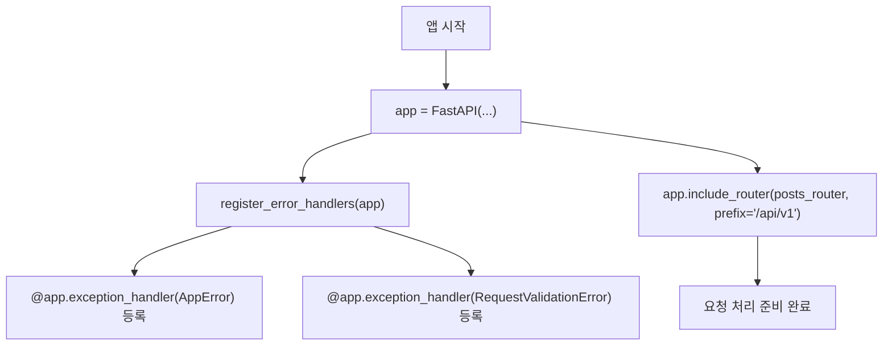
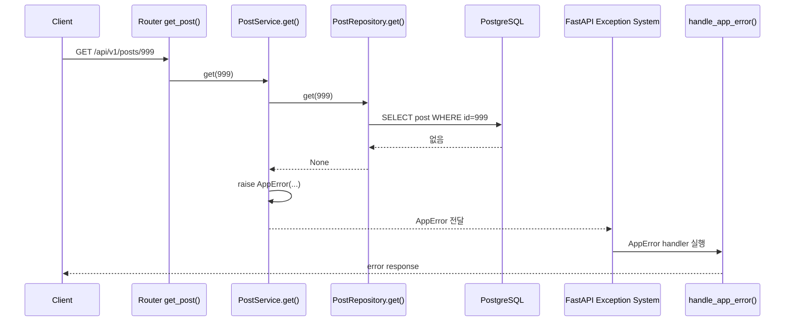

# Error Handler 흐름 이해하기

Sprint 1에는 크게 두 종류의 에러 흐름이 있습니다.

```text
1. AppError
   service 코드에서 직접 발생시키는 도메인 에러

2. RequestValidationError
   FastAPI와 Pydantic이 요청 검증 중 발생시키는 validation error
```

둘 다 최종적으로는 `backend/app/core/errors.py`에 있는 error handler를 통해 공통 에러 응답 형식으로 변환됩니다.

## 공통 에러 응답 형식

현재 프로젝트는 에러 응답을 아래 형식으로 맞춥니다.

```json
{
  "error": {
    "code": "ERROR_CODE",
    "message": "에러 메시지",
    "details": {}
  }
}
```

이렇게 통일하면 프론트엔드는 실패 응답을 받을 때 항상 같은 위치를 확인하면 됩니다.

```text
error.code
error.message
error.details
```

## 없는 게시글을 조회하면 어떤 흐름으로 가는가?

없는 게시글을 조회하는 요청을 예로 듭니다.

```text
GET /api/v1/posts/999
```

전체 흐름은 다음과 같습니다.

```text
get_post router
-> PostService.get()
-> PostRepository.get()
-> DB 조회 결과 없음
-> PostService.get()에서 raise AppError(...)
-> FastAPI가 AppError용 exception handler를 찾음
-> handle_app_error()
-> JSONResponse로 에러 응답 반환
```

## 1. Router에서 Service 호출

파일:

```text
backend/app/api/v1/posts.py
```

```python
@router.get("/{post_id}", response_model=PostRead)
def get_post(
    post_id: int,
    service: PostService = Depends(get_post_service),
) -> PostRead:
    return service.get(post_id)
```

클라이언트가 아래 요청을 보내면:

```text
GET /api/v1/posts/999
```

라우터는 service를 호출합니다.

```python
service.get(999)
```

## 2. Service에서 AppError 발생

파일:

```text
backend/app/services/post_service.py
```

```python
def get(self, post_id: int) -> Post:
    post = self.posts.get(post_id)
    if post is None:
        raise AppError(
            code="POST_NOT_FOUND",
            message="게시글을 찾을 수 없습니다.",
            status_code=status.HTTP_404_NOT_FOUND,
            details={"post_id": post_id},
        )
    return post
```

repository가 `None`을 반환하면 service는 `AppError`를 발생시킵니다.

이 순간 일반적인 `return` 흐름은 멈춥니다.

```text
return post로 가지 않음
raise AppError로 예외 흐름 시작
```

## 3. FastAPI가 AppError handler를 찾음

파일:

```text
backend/app/core/errors.py
```

```python
@app.exception_handler(AppError)
def handle_app_error(_: Request, exc: AppError) -> JSONResponse:
    return JSONResponse(
        status_code=exc.status_code,
        content=error_body(exc.code, exc.message, exc.details),
    )
```

핵심은 이 부분입니다.

```python
@app.exception_handler(AppError)
```

의미:

```text
AppError가 발생하면 이 함수로 보내라.
```

그래서 `PostService.get()`에서 `raise AppError(...)`가 발생하면 FastAPI가 `handle_app_error()`를 실행합니다.

## 4. Error handler는 어디서 등록되는가?

파일:

```text
backend/app/main.py
```

```python
app = FastAPI(title="Sprint 1 API Data Flow", lifespan=lifespan)
register_error_handlers(app)
app.include_router(posts_router, prefix="/api/v1")
```

여기서 아래 코드가 error handler 등록을 담당합니다.

```python
register_error_handlers(app)
```

`register_error_handlers()` 함수 안에서 FastAPI app에 두 가지 handler를 등록합니다.

```text
AppError가 발생하면 handle_app_error()로 처리한다.
RequestValidationError가 발생하면 handle_validation_error()로 처리한다.
```

## Error handler를 등록한다는 말의 의미

`등록한다`는 말은 FastAPI app에 아래와 같은 규칙을 미리 알려준다는 뜻입니다.

```text
앞으로 요청을 처리하다가 AppError가 발생하면 handle_app_error()를 실행해라.
앞으로 요청 검증 중 RequestValidationError가 발생하면 handle_validation_error()를 실행해라.
```

즉, error handler 등록은 에러가 발생한 순간에 새로 찾는 작업이 아니라, 앱이 만들어질 때 FastAPI에게 예외 처리 규칙을 붙여두는 작업입니다.

현재 `main.py`는 앱을 만들고, 그 앱에 error handler 규칙과 router 규칙을 붙입니다.

```python
app = FastAPI(title="Sprint 1 API Data Flow", lifespan=lifespan)
register_error_handlers(app)
app.include_router(posts_router, prefix="/api/v1")
```

이 세 줄은 각각 이렇게 이해하면 됩니다.

```text
app = FastAPI(...)
-> FastAPI 애플리케이션 객체를 만든다.

register_error_handlers(app)
-> 이 앱에서 사용할 예외 처리 규칙을 등록한다.

app.include_router(posts_router, prefix="/api/v1")
-> 이 앱에서 받을 API endpoint들을 등록한다.
```

비유하면 `app`은 서버 전체의 안내 데스크이고, `register_error_handlers(app)`는 안내 데스크에 이런 매뉴얼을 붙이는 일입니다.

```text
AppError가 오면 이 창구로 보내라.
ValidationError가 오면 이 창구로 보내라.
```

그래서 service에서 `raise AppError(...)`가 발생했을 때 service가 직접 `handle_app_error()`를 호출하는 것이 아닙니다. service는 그냥 예외를 던집니다.

```python
raise AppError(...)
```

그 다음 FastAPI가 이미 등록된 규칙을 보고 알맞은 handler를 호출합니다.

```text
PostService.get()
-> raise AppError
-> FastAPI가 app에 등록된 exception handler 목록을 확인
-> AppError에 맞는 handle_app_error() 실행
```

핵심은 다음입니다.

```text
Service는 error handler를 직접 부르지 않는다.
Service는 AppError를 raise한다.
FastAPI가 main.py에서 등록된 규칙을 보고 handler를 실행한다.
```

## 함수 하나를 호출했는데 왜 등록되는가?

`main.py`에는 아래 코드가 있습니다.

```python
register_error_handlers(app)
```

이 한 줄만 보면 함수 하나를 호출했을 뿐인데 어떻게 error handler가 등록되는지 헷갈릴 수 있습니다.

핵심은 `app`이 단순한 값이 아니라 FastAPI 애플리케이션 객체라는 점입니다.

```python
app = FastAPI(title="Sprint 1 API Data Flow", lifespan=lifespan)
```

이렇게 만든 `app` 객체를 `register_error_handlers()` 함수에 넘깁니다.

```python
register_error_handlers(app)
```

그러면 `register_error_handlers()` 함수 내부에서 이 `app` 객체에 예외 처리 규칙을 붙입니다.

구조를 단순화하면 다음과 같습니다.

```python
def register_error_handlers(app: FastAPI) -> None:
    @app.exception_handler(AppError)
    def handle_app_error(...):
        ...
```

여기서 아래 코드가 중요합니다.

```python
@app.exception_handler(AppError)
```

이 코드는 `app` 객체에 아래 규칙을 저장합니다.

```text
AppError가 발생하면 handle_app_error 함수를 실행한다.
```

즉, `register_error_handlers(app)`는 단순히 값을 계산하고 끝나는 함수가 아닙니다. 넘겨받은 `app` 객체에 error handler 규칙을 등록하는 함수입니다.

비유하면 다음과 같습니다.

```text
app = 서버 전체 안내 데스크
register_error_handlers(app) = 안내 데스크에 에러 처리 매뉴얼을 붙이는 함수
@app.exception_handler(AppError) = "AppError는 이 창구로 보내라"는 규칙
```

그래서 service는 handler를 직접 호출하지 않습니다.

```python
raise AppError(...)
```

service는 그냥 `AppError`를 던집니다. 그러면 FastAPI가 `app` 안에 등록된 규칙을 보고 판단합니다.

```text
AppError가 발생했네?
app에 등록된 handle_app_error()로 보내야겠다.
```

정리하면 다음과 같습니다.

```text
register_error_handlers(app)는 app 객체를 수정한다.
그 결과 app은 AppError를 어떻게 처리할지 기억하게 된다.
```

## Error handler 등록 흐름



## 5. 최종 에러 응답

`AppError`에는 아래 값들이 들어 있습니다.

```python
code="POST_NOT_FOUND"
message="게시글을 찾을 수 없습니다."
status_code=404
details={"post_id": post_id}
```

`handle_app_error()`는 이 값을 꺼내서 JSON 응답을 만듭니다.

```json
{
  "error": {
    "code": "POST_NOT_FOUND",
    "message": "게시글을 찾을 수 없습니다.",
    "details": {
      "post_id": 999
    }
  }
}
```

## AppError 흐름 Mermaid



## Validation Error는 언제 발생하는가?

Validation error는 request body가 `PostCreate` 조건을 만족하지 않을 때 발생합니다.

파일:

```text
backend/app/schemas/post.py
```

```python
class PostCreate(BaseModel):
    title: str = Field(min_length=1, max_length=120)
    content: str = Field(min_length=1)
    author_name: str = Field(default="anonymous", min_length=1, max_length=40)
```

예를 들어 아래 요청은 실패합니다.

```json
{
  "title": "",
  "content": "내용",
  "author_name": "team1"
}
```

이유:

```text
title은 min_length=1 조건을 만족해야 하는데 빈 문자열이다.
```

아래 요청도 실패합니다.

```json
{
  "title": "제목",
  "author_name": "team1"
}
```

이유:

```text
content는 필수값인데 요청 body에 없다.
```

## Validation Error 흐름

게시글 생성 endpoint는 아래처럼 request body를 `PostCreate`로 받습니다.

파일:

```text
backend/app/api/v1/posts.py
```

```python
@router.post("", response_model=PostRead, status_code=status.HTTP_201_CREATED)
def create_post(
    payload: PostCreate,
    service: PostService = Depends(get_post_service),
) -> PostRead:
    return service.create(payload)
```

핵심:

```python
payload: PostCreate
```

이 말은 FastAPI에게 다음을 요청하는 것과 같습니다.

```text
요청 body를 PostCreate 형식으로 검증해서 payload로 넣어줘.
```

검증 흐름은 다음과 같습니다.

```text
POST /api/v1/posts
-> FastAPI가 request body를 읽음
-> Pydantic이 PostCreate로 검증
-> 검증 실패
-> create_post() 실행 안 됨
-> RequestValidationError 발생
-> handle_validation_error() 실행
-> 공통 error response 반환
```

## Validation Error Handler

파일:

```text
backend/app/core/errors.py
```

```python
@app.exception_handler(RequestValidationError)
def handle_validation_error(_: Request, exc: RequestValidationError) -> JSONResponse:
    return JSONResponse(
        status_code=status.HTTP_422_UNPROCESSABLE_ENTITY,
        content=error_body("VALIDATION_ERROR", "Invalid request", exc.errors()),
    )
```

핵심은 이 부분입니다.

```python
@app.exception_handler(RequestValidationError)
```

의미:

```text
RequestValidationError가 발생하면 이 함수로 보내라.
```

최종 응답은 공통 에러 형식으로 나갑니다.

```json
{
  "error": {
    "code": "VALIDATION_ERROR",
    "message": "Invalid request",
    "details": [
      {
        "type": "...",
        "loc": ["body", "title"],
        "msg": "...",
        "input": ""
      }
    ]
  }
}
```

## AppError와 RequestValidationError 차이

| 구분 | AppError | RequestValidationError |
| --- | --- | --- |
| 발생 위치 | service 코드 안 | endpoint 함수 실행 전 |
| 발생 주체 | 우리가 직접 `raise` | FastAPI/Pydantic |
| 예시 | 없는 게시글 조회 | title 빈 값, content 누락 |
| handler | `handle_app_error()` | `handle_validation_error()` |
| 의미 | 도메인 규칙상 실패 | 요청 형식 검증 실패 |

## 에러 흐름 파악 순서

예외 흐름을 볼 때는 아래 순서로 추적하면 됩니다.

```text
1. 어떤 예외 클래스가 발생하는지 본다.
2. 그 예외 클래스 이름으로 검색한다.
3. @app.exception_handler(예외클래스)를 찾는다.
4. handler가 어떤 응답 body를 만드는지 본다.
5. 그 handler가 app에 등록되는 위치를 본다.
```

이 프로젝트에서는 다음처럼 추적합니다.

```text
raise AppError
-> core/errors.py의 @app.exception_handler(AppError)
-> main.py의 register_error_handlers(app)에서 등록
```

```text
Pydantic validation 실패
-> RequestValidationError
-> core/errors.py의 @app.exception_handler(RequestValidationError)
-> main.py의 register_error_handlers(app)에서 등록
```

## 최종 요약

```text
AppError
= service에서 우리가 직접 발생시키는 도메인 에러
= 없는 게시글 조회 같은 상황

RequestValidationError
= FastAPI/Pydantic이 endpoint 실행 전에 발생시키는 검증 에러
= request body가 schema 조건을 만족하지 않는 상황
```

둘 다 `core/errors.py`의 handler를 통해 공통 에러 응답 형식으로 변환됩니다.
