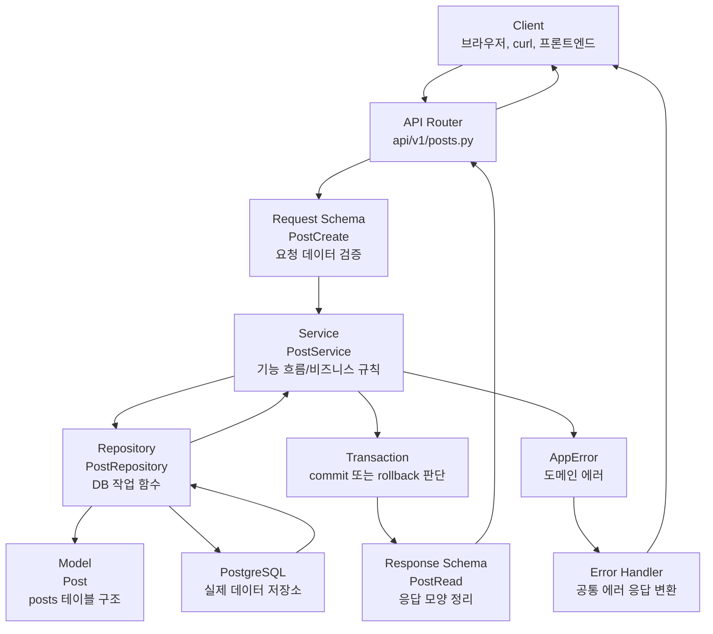
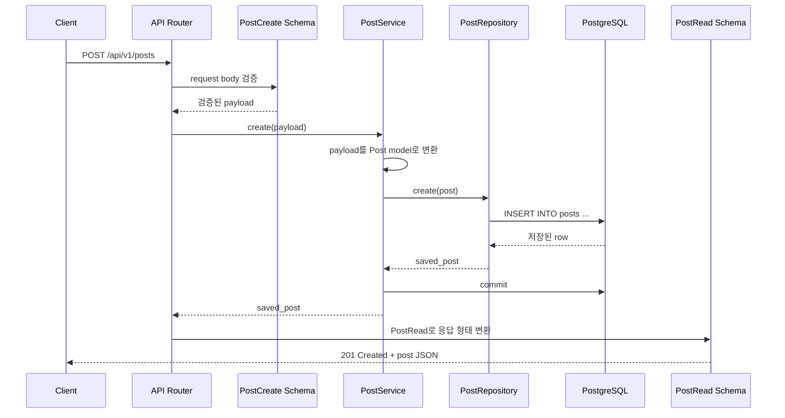
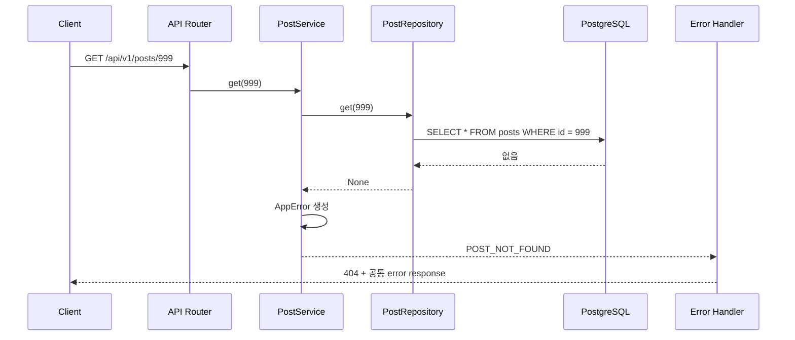

# Service와 Repository 역할 이해하기

Sprint 1의 핵심 흐름은 아래와 같습니다.

```text
Client
-> API Router
-> Schema
-> Service
-> Repository
-> PostgreSQL
-> Response 또는 Error
```

처음에는 `service`와 `repository`가 둘 다 DB 근처에 있어서 역할이 헷갈릴 수 있습니다. 가장 중요한 기준은 다음 한 문장입니다.

```text
Repository는 DB에 어떻게 접근할지 알고,
Service는 사용자 기능을 어떤 순서와 규칙으로 처리할지 안다.
```

## 계층을 나누는 이유

계층을 나누는 이유는 코드가 하는 일을 역할별로 분리해서, 나중에 기능이 커져도 어디를 봐야 하는지 헷갈리지 않게 만들기 위해서입니다.

작은 예제에서는 한 파일에 모두 넣어도 동작합니다. 하지만 기능이 커지면 API 처리, 요청 검증, 비즈니스 규칙, DB 쿼리, 에러 처리가 섞이면서 수정하기 어려워집니다.

그래서 Sprint 1에서는 역할을 아래처럼 나눕니다.

| 계층 | 쉬운 설명 |
| --- | --- |
| API Router | 어떤 주소로 온 요청인지 받고 service에 넘긴다. |
| Schema | 요청과 응답의 모양을 검사하고 정한다. |
| Service | 기능의 실제 처리 순서와 규칙을 담당한다. |
| Repository | DB에 저장하고 조회하는 일을 담당한다. |
| Model | DB 테이블 구조를 코드로 표현한다. |
| DB 설정 | 앱이 DB에 연결할 수 있게 해준다. |
| Error | 실패 응답을 같은 형식으로 정리한다. |

## Service와 Repository의 차이

### Repository

Repository는 DB 조작 담당입니다.

예를 들어 `PostRepository`는 아래 같은 일을 합니다.

- 게시글을 DB에 저장한다.
- 게시글 목록을 DB에서 가져온다.
- id로 게시글 하나를 찾는다.
- SQLAlchemy 쿼리 문법을 감춘다.

즉, repository는 DB에게 실제로 말을 거는 계층입니다.

```python
class PostRepository:
    def create(self, post: Post) -> Post:
        self.db.add(post)
        self.db.flush()
        self.db.refresh(post)
        return post

    def list(self) -> list[Post]:
        statement = select(Post).order_by(Post.created_at.desc())
        return list(self.db.scalars(statement))

    def get(self, post_id: int) -> Post | None:
        return self.db.get(Post, post_id)
```

Repository가 아는 것:

- SQLAlchemy로 객체를 저장하는 방법
- DB에서 데이터를 조회하는 방법
- 정렬 조건을 거는 방법
- DB 모델을 다루는 방법

### Service

Service는 사용자 기능의 흐름 담당입니다.

예를 들어 게시글 생성은 지금은 단순해 보이지만, 실제 서비스에서는 점점 이런 규칙이 붙을 수 있습니다.

```text
1. 로그인한 사용자인지 확인한다.
2. 제목이 비어 있지 않은지 확인한다.
3. 게시글을 저장한다.
4. 태그를 저장한다.
5. 알림을 만든다.
6. 전체 작업이 성공하면 commit한다.
```

이런 순서와 규칙을 아는 곳이 service입니다.

```python
class PostService:
    def __init__(self, db: Session, posts: PostRepository) -> None:
        self.db = db
        self.posts = posts

    def create(self, payload: PostCreate) -> Post:
        post = Post(**payload.model_dump())
        saved_post = self.posts.create(post)
        self.db.commit()
        return saved_post
```

Service가 아는 것:

- 이 기능이 어떤 순서로 처리되어야 하는지
- 어떤 repository 함수를 써야 하는지
- 기능이 실패했을 때 어떤 에러를 낼지
- 여러 DB 작업을 언제 commit할지

## Service가 Repository 함수를 쓰는가?

맞습니다. service가 repository의 함수를 가져다 씁니다.

`PostService`는 생성될 때 `PostRepository`를 주입받아 내부에 가지고 있습니다.

```python
self.posts = posts
```

그리고 기능 처리 중 필요한 DB 작업을 repository에 맡깁니다.

```python
saved_post = self.posts.create(post)
```

관계는 이렇게 이해하면 됩니다.

```text
Router는 Service를 부른다.
Service는 Repository를 부른다.
Repository는 DB와 대화한다.
Service는 기능 전체 성공 여부를 보고 commit한다.
```

조금 더 넓게 보면 전체 호출 관계는 아래와 같습니다.

```text
Client
-> Router
-> Service
-> Repository
-> DB
```

각 계층은 바로 아래 계층을 호출합니다.

```text
Router가 Service를 호출한다.
Service가 Repository를 호출한다.
Repository가 DB를 호출한다.
```

하지만 단순히 순서대로 부르는 것만 중요한 게 아닙니다. 각 계층이 맡는 책임이 다릅니다.

| 계층 | 호출하는 대상 | 맡는 책임 |
| --- | --- | --- |
| Router | Service | HTTP 요청을 받고 어떤 기능을 실행할지 연결한다. |
| Service | Repository | 기능의 흐름과 규칙을 처리한다. |
| Repository | DB | 실제 DB 저장과 조회를 수행한다. |

게시글 생성 흐름에 대입하면 다음과 같습니다.

```text
POST /api/v1/posts 요청
-> create_post() 라우터 함수 실행
-> PostService.create(payload) 호출
-> PostRepository.create(post) 호출
-> DB에 INSERT
-> service에서 commit
-> 응답 반환
```

코드에서는 라우터가 서비스를 호출합니다.

```python
def create_post(
    payload: PostCreate,
    service: PostService = Depends(get_post_service),
) -> PostRead:
    return service.create(payload)
```

서비스 안에서는 repository를 호출합니다.

```python
saved_post = self.posts.create(post)
```

여기서 `self.posts`는 `PostRepository`입니다.

```python
self.posts = posts
```

`PostService`가 `PostRepository`를 직접 만들지는 않습니다. `backend/app/api/dependencies.py`의 `get_post_service()`가 DB session으로 repository와 service를 조립합니다. 이렇게 하면 라우터는 HTTP 요청 처리에 집중하고, service는 기능 흐름에 집중하며, 객체 생성 방식은 조립 전용 함수에 모입니다.

따라서 가장 짧게 기억하면 다음과 같습니다.

```text
Router = HTTP/API 담당
Service = 기능 규칙 담당
Repository = DB 담당
```

## 왜 commit은 Service에서 하는가?

`commit`은 단순히 DB 작업 하나를 끝낸다는 의미보다, 사용자 기능 하나가 성공했다고 확정하는 의미에 가깝습니다.

지금 Sprint 1에서는 게시글 하나만 저장하므로 repository에서 commit해도 될 것처럼 보입니다.

하지만 기능이 커지면 하나의 요청 안에서 여러 DB 작업이 필요해집니다.

예를 들어 게시글 작성 기능이 이렇게 커질 수 있습니다.

```text
게시글 저장
-> 태그 저장
-> 게시글-태그 연결 저장
-> 활동 로그 저장
```

이 작업들은 모두 하나의 사용자 기능입니다. 중간에 하나라도 실패하면 전체가 실패해야 할 수 있습니다.

만약 repository가 각 작업마다 commit을 해버리면 이런 문제가 생길 수 있습니다.

```text
게시글 저장 commit 성공
태그 저장 commit 성공
게시글-태그 연결 실패
```

그러면 DB에는 게시글과 태그는 있는데 연결은 없는 어중간한 상태가 남습니다.

그래서 보통 service가 전체 흐름을 관리합니다.

```text
게시글 저장
태그 저장
게시글-태그 연결 저장
전부 성공하면 commit
중간에 실패하면 rollback
```

정리하면 다음과 같습니다.

```text
Repository = DB 작업 하나를 수행한다.
Service = 사용자 기능 하나를 끝까지 책임진다.
Commit = 기능 하나가 성공했다고 확정하는 일이므로 service가 한다.
```

## 전체 연결 구조



## 게시글 생성 흐름



## 없는 게시글 조회 흐름



## 헷갈릴 때 쓰는 판단 기준

아래 질문으로 service와 repository를 구분하면 됩니다.

### DB에서 어떻게 가져오거나 저장하지?

이 질문에 대한 답이면 repository입니다.

예시:

- id로 게시글 찾기
- 최신순으로 게시글 목록 가져오기
- 특정 작성자의 게시글 가져오기
- DB에 객체 저장하기

### 이 기능을 어떤 규칙과 순서로 처리하지?

이 질문에 대한 답이면 service입니다.

예시:

- 로그인한 사용자만 글을 쓸 수 있다.
- 작성자는 자기 글만 수정할 수 있다.
- 글 작성 후 알림을 만든다.
- 여러 DB 작업이 모두 성공해야 commit한다.
- 없는 게시글이면 `POST_NOT_FOUND` 에러를 낸다.

## 최종 요약

```text
Router = HTTP 요청을 받는 곳
Schema = 요청/응답 모양을 정하는 곳
Service = 사용자 기능 흐름을 책임지는 곳
Repository = DB 작업을 수행하는 곳
Model = DB 테이블 구조를 표현하는 곳
DB = 실제 데이터가 저장되는 곳
Error Handler = 실패 응답을 공통 형식으로 바꾸는 곳
```

가장 중요한 문장:

```text
Repository는 query를 담당하고,
Service는 use case를 담당한다.
```

여기서 `query`는 DB에 어떻게 물어볼지이고, `use case`는 사용자가 하려는 기능 전체입니다.
