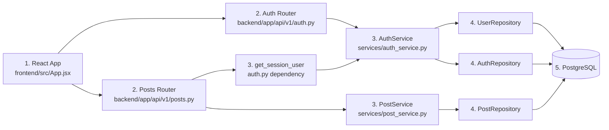
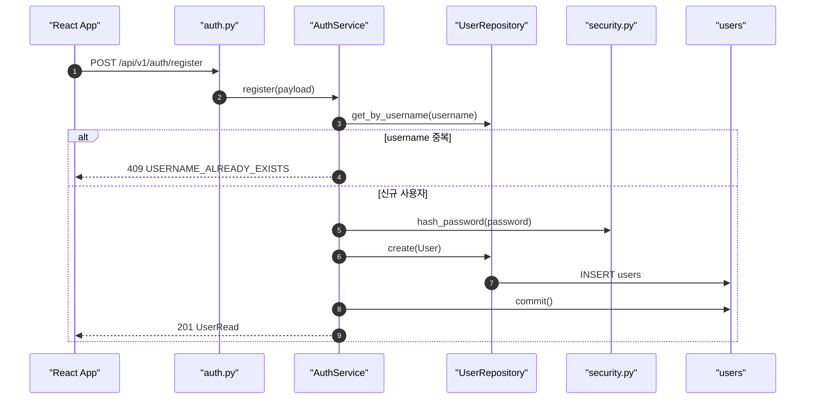
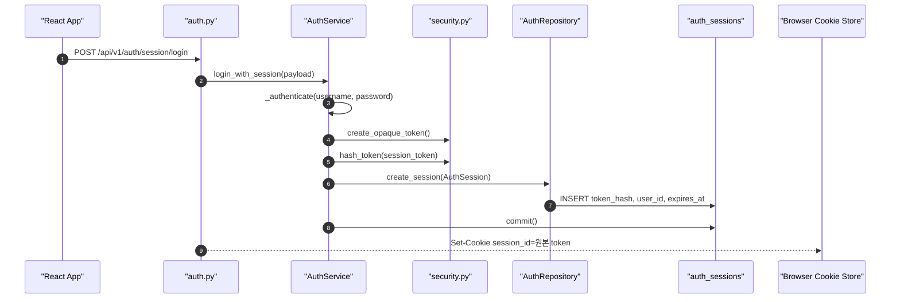
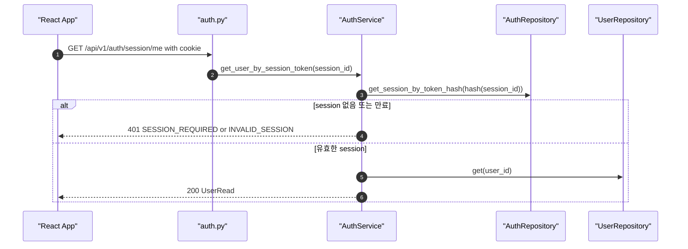
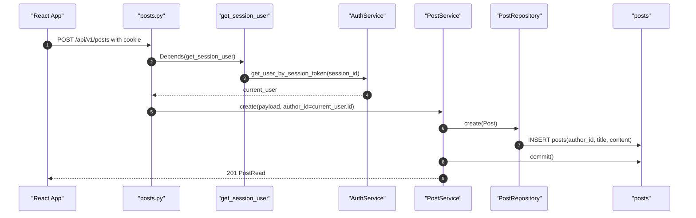
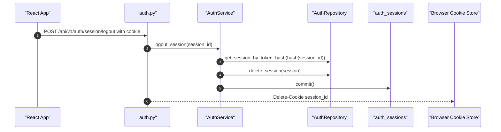
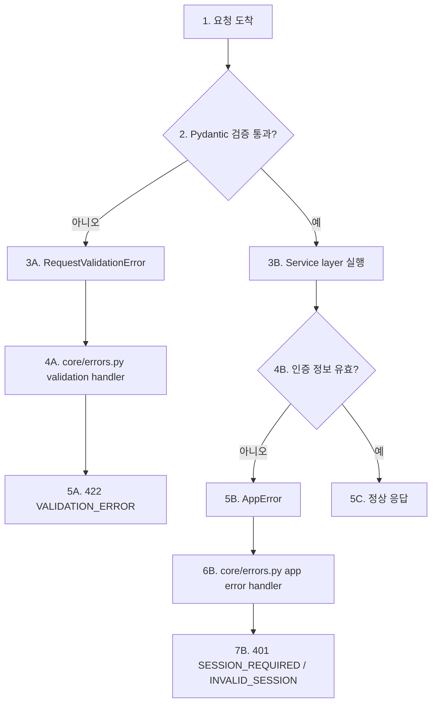

# 스프린트 2 Session 실행 흐름 가이드

이 문서는 Sprint 2 Session 인증 구현을 코드 실행 순서대로 따라가기 위한 가이드입니다.

## 전체 구조



코드를 읽을 때는 `frontend/src/App.jsx`에서 버튼이 어떤 API를 호출하는지 본 뒤, `backend/app/api/v1/auth.py`, `backend/app/services/auth_service.py`, repository/model 순서로 내려가면 됩니다.

전체 구조 읽는 법:

```text
1. React App은 사용자 행동을 API 요청으로 바꾼다.
2. Router는 URL endpoint를 받고, request body와 cookie를 꺼낸다.
3. Service 또는 dependency는 실제 비즈니스 흐름을 처리한다.
4. Repository는 DB 조회/저장만 담당한다.
5. PostgreSQL에는 users, auth_sessions, posts가 저장된다.
```

## 회원가입 흐름



단계별 읽기:

```text
1. React App이 회원가입 request body를 만든다.
2. auth.py register endpoint가 요청을 받는다.
3. AuthService.register가 username 중복 여부를 먼저 확인한다.
4. 중복이면 409를 반환한다.
5. 신규 사용자면 password를 hash해서 users table에 저장한다.
6. 성공 응답은 UserRead이며 password_hash는 응답에 포함되지 않는다.
```

봐야 할 코드:

- `frontend/src/App.jsx`: `submit`
- `backend/app/api/v1/auth.py`: `register`
- `backend/app/schemas/auth.py`: `UserCreate`, `UserRead`
- `backend/app/services/auth_service.py`: `register`
- `backend/app/core/security.py`: `hash_password`

## Session 로그인 흐름



단계별 읽기:

```text
1. React App이 로그인 API를 호출한다.
2. auth.py session_login endpoint가 요청을 받는다.
3. AuthService는 username/password를 검증한다.
4. 검증에 성공하면 랜덤 session token 원본을 만든다.
5. 서버는 원본 token을 hash해서 token_hash를 만든다.
6. auth_sessions table에는 token_hash, user_id, expires_at만 저장한다.
7. 브라우저에는 Set-Cookie로 원본 session_id를 내려준다.
```

봐야 할 코드:

- `backend/app/api/v1/auth.py`: `session_login`
- `backend/app/services/auth_service.py`: `login_with_session`, `_authenticate`
- `backend/app/core/security.py`: `create_opaque_token`, `hash_token`, `verify_password`
- `backend/app/models/auth.py`: `AuthSession`

## 현재 사용자 확인 흐름



단계별 읽기:

```text
1. React App이 /session/me를 호출한다.
2. 브라우저는 저장된 session_id cookie를 함께 보낸다.
3. auth.py는 cookie 값을 AuthService에 넘긴다.
4. AuthService는 원본 token을 hash해서 auth_sessions.token_hash와 비교한다.
5. 세션이 없거나 만료되면 401을 반환한다.
6. 세션이 유효하면 user_id로 users table을 조회하고 UserRead를 반환한다.
```

봐야 할 코드:

- `frontend/src/App.jsx`: `loadMe`, `request`
- `backend/app/api/v1/auth.py`: `get_session_user`, `session_me`
- `backend/app/services/auth_service.py`: `get_user_by_session_token`
- `backend/app/repositories/auth_repository.py`: `get_session_by_token_hash`

## 보호 API 게시글 작성 흐름



단계별 읽기:

```text
1. React App이 게시글 작성 API를 호출한다.
2. 브라우저는 session_id cookie를 함께 보낸다.
3. posts.py는 create_post 실행 전에 get_session_user dependency를 실행한다.
4. get_session_user가 세션을 검증하고 current_user를 만든다.
5. posts.py는 request body가 아니라 current_user.id를 author_id로 사용한다.
6. PostService와 PostRepository가 posts table에 저장한다.
7. 응답에는 생성된 게시글과 작성자 정보가 포함된다.
```

봐야 할 코드:

- `frontend/src/App.jsx`: `createPost`
- `backend/app/api/v1/posts.py`: `create_post`
- `backend/app/api/v1/auth.py`: `get_session_user`
- `backend/app/services/post_service.py`: `create`
- `backend/app/repositories/post_repository.py`: `create`

## 로그아웃 흐름



단계별 읽기:

```text
1. React App이 로그아웃 API를 호출한다.
2. 브라우저는 session_id cookie를 함께 보낸다.
3. AuthService는 해당 session row를 찾는다.
4. 서버는 auth_sessions row를 삭제하고 commit한다.
5. auth.py는 브라우저의 session_id cookie도 삭제하도록 응답한다.
```

봐야 할 코드:

- `frontend/src/App.jsx`: `logout`
- `backend/app/api/v1/auth.py`: `session_logout`
- `backend/app/services/auth_service.py`: `logout_session`
- `backend/app/repositories/auth_repository.py`: `delete_session`

## 에러 흐름



에러 흐름 읽는 법:

```text
1-2에서 request body 형식이 먼저 검증된다.
3A-5A는 body 자체가 잘못된 경우다.
3B-7B는 body 형식은 맞지만 session cookie가 없거나 무효한 경우다.
5C는 검증과 인증을 모두 통과한 정상 응답이다.
```

주요 에러:

- `422 VALIDATION_ERROR`: request body 형식이 schema와 맞지 않음
- `409 USERNAME_ALREADY_EXISTS`: 이미 사용 중인 username
- `401 INVALID_CREDENTIALS`: username 또는 password가 틀림
- `401 SESSION_REQUIRED`: session cookie가 없음
- `401 INVALID_SESSION`: session이 없거나 만료됨

## 코드 읽기 순서

1. `frontend/src/App.jsx`
   - `submit`, `loadMe`, `logout`, `createPost`, `request`를 봅니다.
   - 모든 요청이 `credentials: "include"`를 사용한다는 점을 확인합니다.

2. `backend/app/main.py`
   - CORS `allow_credentials=True`와 router 등록을 봅니다.

3. `backend/app/api/v1/auth.py`
   - `register`, `session_login`, `get_session_user`, `session_me`, `session_logout`을 봅니다.

4. `backend/app/services/auth_service.py`
   - `register`, `login_with_session`, `get_user_by_session_token`, `logout_session`, `_authenticate`를 봅니다.

5. `backend/app/core/security.py`
   - `hash_password`, `verify_password`, `create_opaque_token`, `hash_token`을 봅니다.

6. `backend/app/models/auth.py`
   - `AuthSession` 테이블에 `token_hash`, `user_id`, `expires_at`이 저장되는 것을 봅니다.

7. `backend/app/api/v1/posts.py`
   - 게시글 작성 endpoint가 `current_user: User = Depends(get_session_user)`를 요구하는 것을 봅니다.

8. `backend/tests/test_auth_flow.py`, `backend/tests/test_posts_flow.py`
   - Session login/me/logout, 비로그인 게시글 작성 실패, 로그인 후 게시글 작성 성공을 봅니다.
