# 스프린트 2 실행 흐름 가이드

이 문서는 스프린트 2 인증 예제를 코드 실행 순서대로 따라가기 위한 가이드입니다.

기존 [스프린트 2 인증/인가 흐름](sprint-2-auth-flow.md)은 요청 예시 중심이고, 이 문서는 Mermaid 그림과 코드 위치 중심입니다.

## 전체 구조

스프린트 2는 한 사용자 계정으로 세 가지 인증 방식을 비교합니다.

- Session cookie 방식
- JWT access token 방식
- access token + refresh token 방식

공통 실행 흐름은 아래와 같습니다.

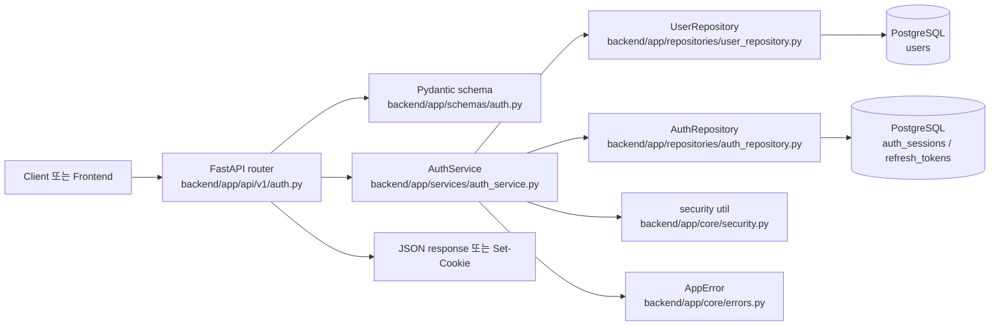

코드를 읽을 때는 `frontend/src/App.jsx`에서 버튼이 어떤 API를 호출하는지 본 뒤, `backend/app/api/v1/auth.py`의 endpoint, `backend/app/services/auth_service.py`의 메서드, repository/model 순서로 내려가면 됩니다.

## 앱 시작 흐름

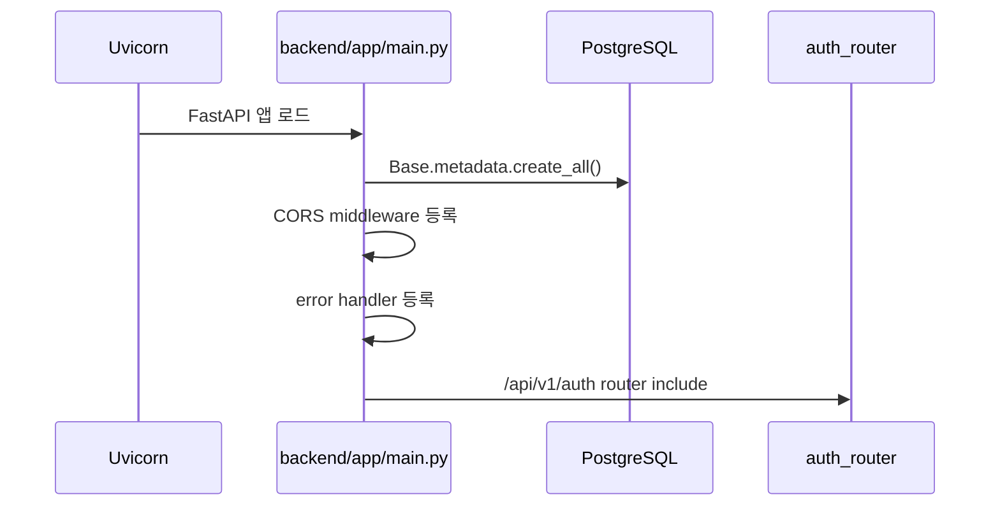

봐야 할 코드:

- `backend/app/main.py`: 앱 생성, CORS, 에러 핸들러, 라우터 등록
- `backend/app/db/base.py`: SQLAlchemy model metadata 연결
- `backend/app/core/config.py`: DB URL, 토큰 만료 시간, 쿠키 이름, CORS origin 설정

## 회원가입 실행 흐름

회원가입은 세 인증 방식이 모두 공유하는 출발점입니다.

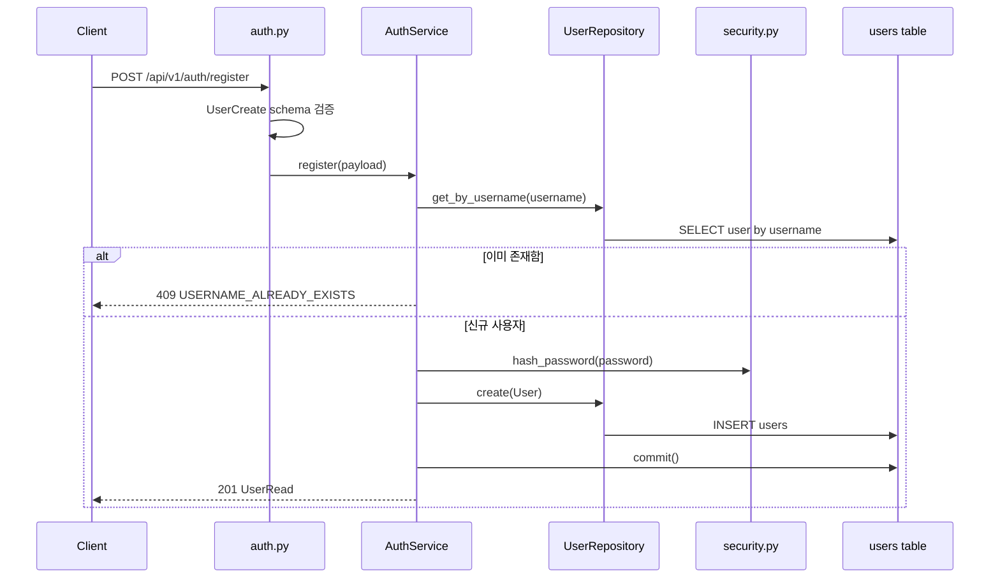

봐야 할 코드:

- `backend/app/api/v1/auth.py`: `register`
- `backend/app/schemas/auth.py`: `UserCreate`, `UserRead`
- `backend/app/services/auth_service.py`: `register`
- `backend/app/repositories/user_repository.py`: `get_by_username`, `create`
- `backend/app/models/user.py`: `users` 테이블
- `backend/app/core/security.py`: `hash_password`

학습 포인트:

- 비밀번호 원문은 저장하지 않고 PBKDF2 해시만 저장합니다.
- username 중복은 service layer에서 확인하고 `409 Conflict`로 응답합니다.
- DB 변경은 repository가 준비하고, transaction commit은 service가 수행합니다.

## Session 방식 실행 흐름

Session 방식은 서버가 로그인 상태를 DB에 저장하고, 클라이언트는 세션 ID를 cookie로 보관합니다.

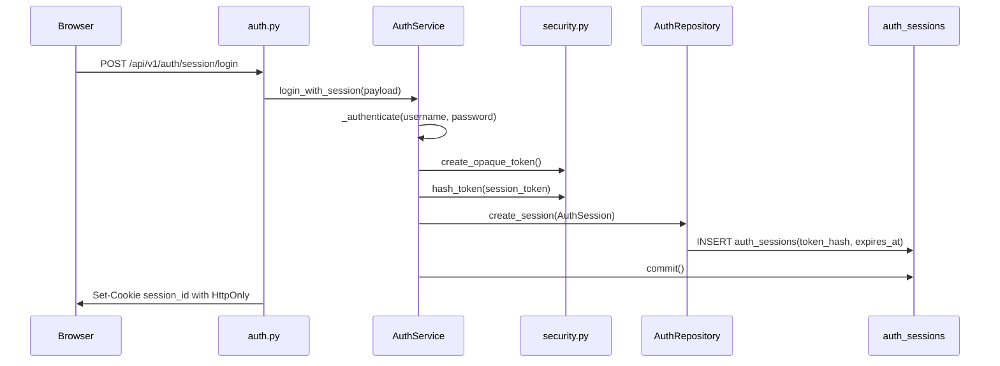

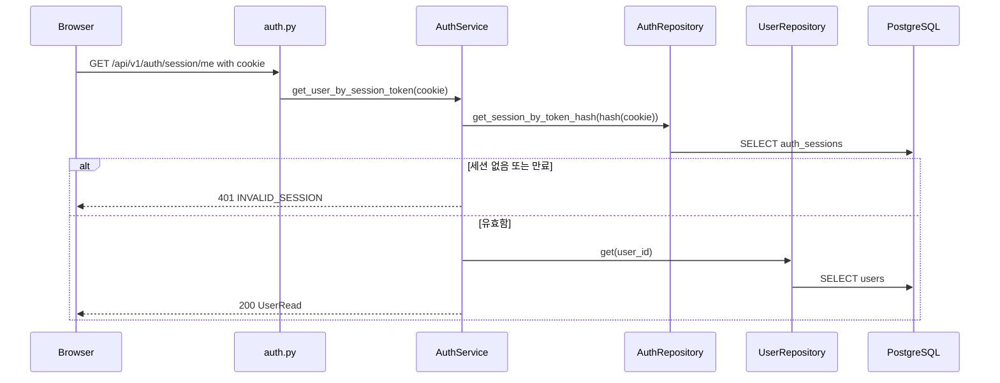

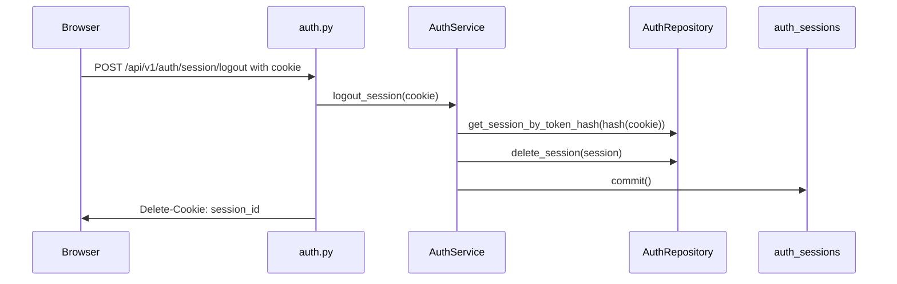

봐야 할 코드:

- `backend/app/api/v1/auth.py`: `session_login`, `get_session_user`, `session_me`, `session_logout`
- `backend/app/services/auth_service.py`: `login_with_session`, `get_user_by_session_token`, `logout_session`
- `backend/app/models/auth.py`: `AuthSession`
- `backend/app/repositories/auth_repository.py`: session 관련 메서드
- `frontend/src/App.jsx`: `credentials: "include"`와 session API 호출

학습 포인트:

- DB에는 세션 원본 값이 아니라 `sha256` 해시가 저장됩니다.
- 브라우저는 cookie를 자동으로 보내기 때문에 프론트 코드에서 `Authorization` 헤더를 붙이지 않습니다.
- `HttpOnly` cookie는 JavaScript에서 읽을 수 없어 XSS 피해를 줄이지만, cookie 기반 요청은 CSRF 방어 전략을 같이 고민해야 합니다.

## JWT access token 방식 실행 흐름

JWT 방식은 서버가 access token을 발급하고, 이후 요청마다 클라이언트가 `Authorization: Bearer` 헤더에 넣어 보냅니다.

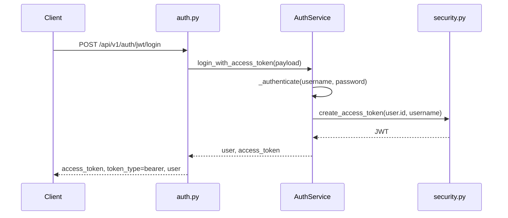

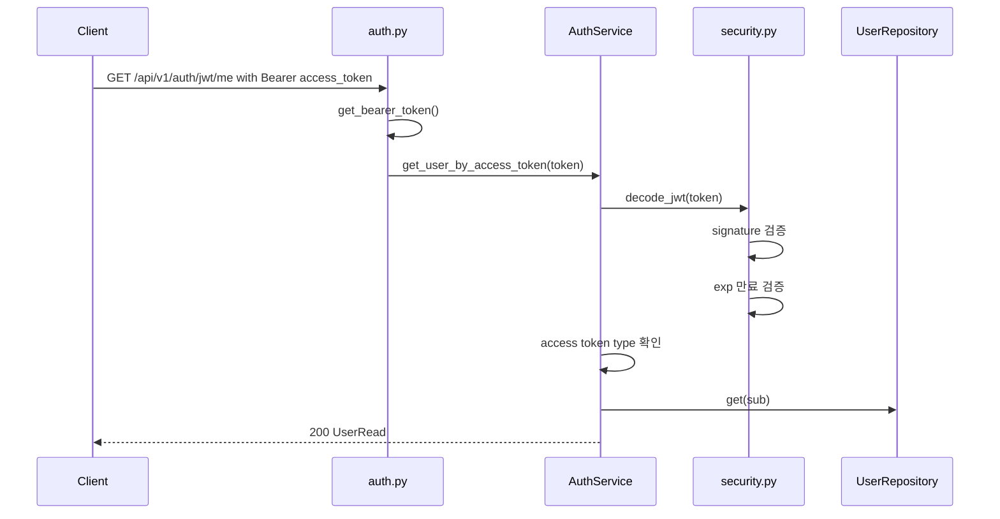

봐야 할 코드:

- `backend/app/api/v1/auth.py`: `jwt_login`, `jwt_me`, `get_bearer_token`, `get_access_token_user`
- `backend/app/services/auth_service.py`: `login_with_access_token`, `get_user_by_access_token`
- `backend/app/core/security.py`: `create_access_token`, `encode_jwt`, `decode_jwt`
- `frontend/src/App.jsx`: `authOptions()`에서 `Authorization` 헤더 생성

학습 포인트:

- access token은 DB에 저장하지 않습니다. 서버는 서명과 만료 시간만 검증합니다.
- 이 예제의 JWT는 `HS256` 방식으로 직접 구현되어 있습니다.
- 토큰 payload에는 `sub`, `username`, `type`, `exp`가 들어갑니다.
- 서버가 access token 상태를 저장하지 않으므로 만료 전 강제 폐기가 어렵습니다.

## Access token + Refresh token 방식 실행 흐름

Token pair 방식은 짧게 사는 access token과 길게 사는 refresh token을 함께 사용합니다.

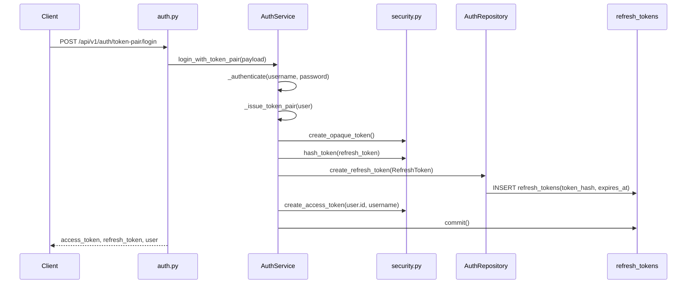

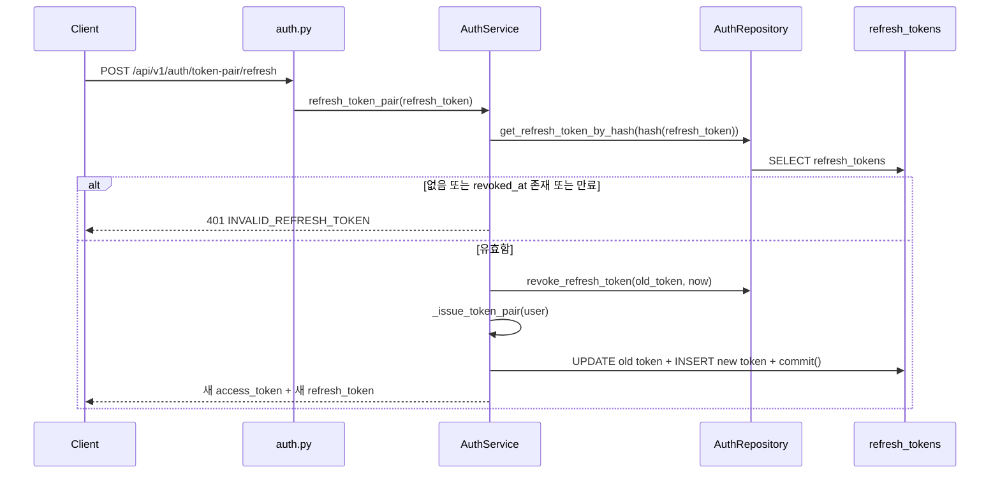

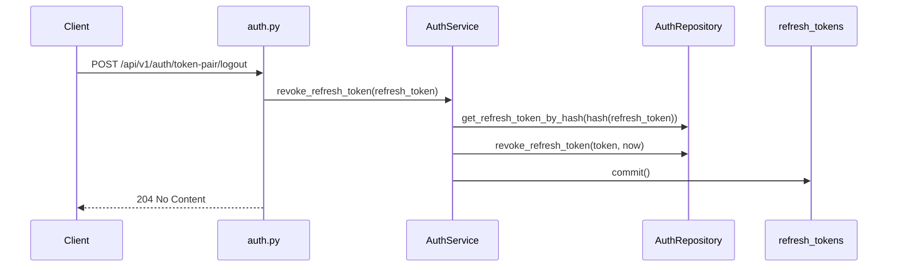

봐야 할 코드:

- `backend/app/api/v1/auth.py`: `token_pair_login`, `refresh_token_pair`, `token_pair_me`, `token_pair_logout`
- `backend/app/services/auth_service.py`: `login_with_token_pair`, `refresh_token_pair`, `revoke_refresh_token`, `_issue_token_pair`
- `backend/app/models/auth.py`: `RefreshToken`
- `backend/app/repositories/auth_repository.py`: refresh token 관련 메서드
- `backend/tests/test_auth_flow.py`: refresh token 재사용이 `401`이 되는 테스트

학습 포인트:

- refresh token도 DB에 원본을 저장하지 않고 해시만 저장합니다.
- refresh token을 한 번 사용하면 기존 토큰을 revoke하고 새 refresh token을 발급합니다. 이 패턴을 refresh token rotation이라고 합니다.
- access token 검증은 JWT 방식과 같습니다.
- logout은 access token을 폐기하지 않고 refresh token만 revoke합니다. access token은 만료될 때까지 유효할 수 있습니다.

## 에러 흐름

인증 실패와 검증 실패는 공통 에러 형태로 내려갑니다.

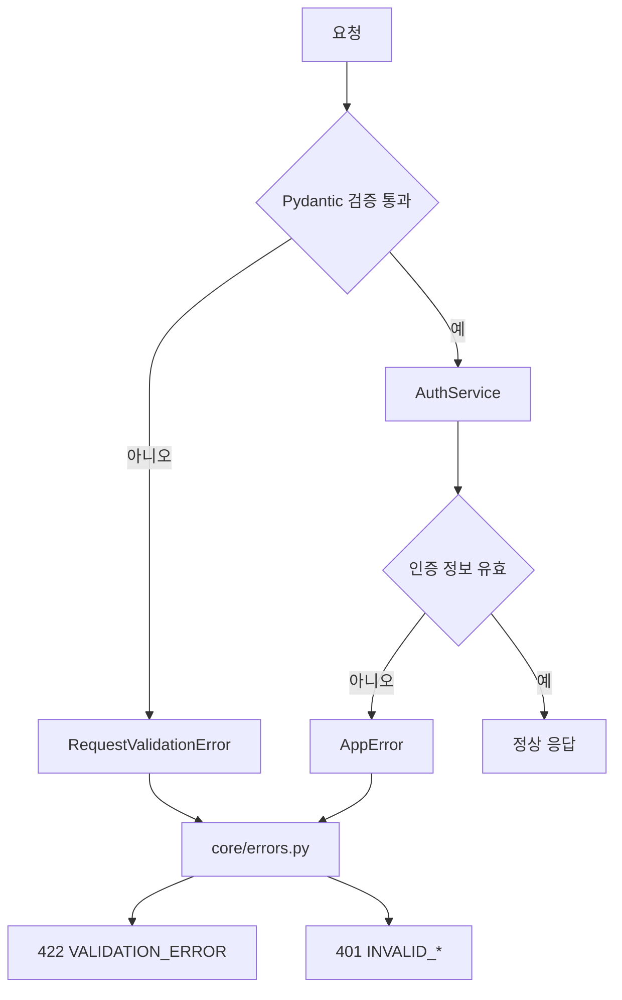

봐야 할 코드:

- `backend/app/core/errors.py`: `AppError`, `register_error_handlers`
- `backend/app/services/auth_service.py`: `_unauthorized`
- `backend/app/schemas/auth.py`: request schema validation

주요 에러:

- `422 VALIDATION_ERROR`: request body 형식이 schema와 맞지 않음
- `409 USERNAME_ALREADY_EXISTS`: 이미 사용 중인 username
- `401 INVALID_CREDENTIALS`: username 또는 password가 틀림
- `401 SESSION_REQUIRED`: 세션 cookie가 없음
- `401 INVALID_SESSION`: 세션이 없거나 만료됨
- `401 ACCESS_TOKEN_REQUIRED`: Bearer token이 없음
- `401 INVALID_ACCESS_TOKEN`: access token 서명, 만료, type, subject가 잘못됨
- `401 INVALID_REFRESH_TOKEN`: refresh token이 없거나 revoke되었거나 만료됨

## 코드 읽기 순서

처음 읽는다면 아래 순서가 가장 덜 헷갈립니다.

1. `frontend/src/App.jsx`
   - 버튼이 어떤 endpoint를 호출하는지 확인합니다.
   - session은 `credentials: "include"`에 의존하고, jwt/pair는 `Authorization` 헤더를 사용합니다.

2. `backend/app/api/v1/auth.py`
   - URL과 HTTP method를 확인합니다.
   - FastAPI `Depends`, `Cookie`, `Header`, `Response`가 어디서 쓰이는지 봅니다.

3. `backend/app/schemas/auth.py`
   - request body와 response body의 계약을 확인합니다.

4. `backend/app/services/auth_service.py`
   - 인증 성공/실패, token 발급, DB commit 위치를 확인합니다.
   - sprint 2의 핵심 파일입니다.

5. `backend/app/core/security.py`
   - password hash, opaque token, token hash, JWT encode/decode를 확인합니다.

6. `backend/app/repositories/*.py`
   - SQLAlchemy query가 service 밖으로 분리된 방식을 확인합니다.

7. `backend/app/models/*.py`
   - 실제 테이블과 컬럼을 확인합니다.

8. `backend/tests/test_auth_flow.py`
   - 팀이 의도한 인증 흐름을 테스트가 어떻게 고정하는지 확인합니다.

## Sprint 2 키워드 학습 노트

### 인증(Authentication)

사용자가 누구인지 확인하는 과정입니다. 이 예제에서는 username/password 검증이 인증입니다.

코드 위치: `AuthService._authenticate`

### 인가(Authorization)

인증된 사용자가 특정 행동을 해도 되는지 판단하는 과정입니다. 현재 sprint 2 예제는 인증 방식 비교가 중심이라 세밀한 권한 정책은 아직 구현하지 않았습니다. 이후 게시글 수정/삭제, 관리자 기능, 팀별 접근 제어가 생기면 인가가 필요합니다.

### Session

서버가 로그인 상태를 저장하는 방식입니다. 이 예제에서는 `auth_sessions` 테이블에 session token hash와 만료 시간을 저장합니다.

장점은 서버에서 세션을 삭제해 즉시 로그아웃시킬 수 있다는 점입니다. 단점은 서버 저장소 조회가 필요하고, cookie 기반이라 CSRF를 고려해야 한다는 점입니다.

### Cookie

브라우저가 서버 요청에 자동으로 붙여 보내는 저장 수단입니다. 이 예제의 session 방식은 `session_id` cookie를 사용합니다.

중요 옵션:

- `HttpOnly`: JavaScript에서 cookie를 읽지 못하게 합니다.
- `Secure`: HTTPS에서만 cookie를 전송합니다.
- `SameSite`: 다른 사이트에서 시작된 요청에 cookie를 보낼지 제한합니다.

### CSRF

사용자가 로그인된 브라우저 상태를 악용해 원하지 않는 요청을 보내게 만드는 공격입니다. cookie는 자동 전송되므로 session 방식에서 특히 중요합니다.

방어 예시:

- `SameSite=Lax` 또는 `Strict`
- CSRF token
- Origin/Referer 검증
- 상태 변경 요청에서 별도 custom header 요구

### JWT

JSON Web Token입니다. header, payload, signature 세 부분으로 구성됩니다.

이 예제의 payload:

- `sub`: 사용자 id
- `username`: 사용자 이름
- `type`: access token 여부
- `exp`: 만료 시각

중요한 점은 JWT payload는 암호화가 아니라 인코딩이라는 점입니다. 민감한 정보를 넣지 않아야 합니다.

### Bearer Token

`Authorization: Bearer <token>` 형식으로 보내는 토큰입니다. 이 예제의 JWT 방식과 token pair 방식의 `/me` endpoint가 사용합니다.

### Access Token

API 호출에 직접 사용하는 짧은 수명의 토큰입니다. 탈취 위험을 줄이기 위해 만료 시간을 짧게 잡습니다.

코드 위치: `create_access_token`

### Refresh Token

새 access token을 발급받기 위한 긴 수명의 토큰입니다. access token보다 더 민감하게 다뤄야 합니다.

이 예제에서는 refresh token을 DB에 hash로 저장하고, 재발급 시 기존 토큰을 revoke합니다.

### Token Rotation

refresh token을 사용할 때마다 새 refresh token을 발급하고 기존 refresh token을 폐기하는 전략입니다.

이 예제에서는 `refresh_token_pair`에서 기존 토큰의 `revoked_at`을 채우고 `_issue_token_pair`로 새 토큰을 만듭니다.

### Opaque Token

토큰 자체에 의미 있는 정보를 넣지 않은 랜덤 문자열입니다. session token과 refresh token이 opaque token입니다.

서버는 opaque token 원본을 보고 사용자를 알 수 없고, DB 조회로만 의미를 확인합니다.

### Token Hashing

토큰 원본이 유출되면 곧바로 인증에 악용될 수 있습니다. 그래서 이 예제는 session token과 refresh token의 원본 대신 `sha256` hash를 DB에 저장합니다.

코드 위치: `hash_token`

### Password Hashing

비밀번호는 복호화 가능한 암호화가 아니라 느린 단방향 해시로 저장해야 합니다. 이 예제는 PBKDF2-HMAC-SHA256을 사용합니다.

코드 위치: `hash_password`, `verify_password`

### Stateful vs Stateless

Stateful 인증은 서버가 로그인 상태를 저장합니다. session 방식이 여기에 해당합니다.

Stateless 인증은 서버가 로그인 상태를 저장하지 않고, token 자체의 서명과 만료로 검증합니다. JWT access token 방식이 여기에 해당합니다.

Token pair 방식은 섞여 있습니다. access token 검증은 stateless이고, refresh token은 DB에 저장되므로 stateful입니다.

### Dependency Injection

FastAPI `Depends`를 통해 필요한 객체를 endpoint에 주입하는 방식입니다.

코드 위치:

- `get_auth_service`
- `get_session_user`
- `get_access_token_user`

### Service Layer

비즈니스 규칙을 모아두는 계층입니다. 인증 성공/실패 판단, 토큰 발급, commit 위치가 `AuthService`에 있습니다.

### Repository Layer

DB query 세부 구현을 감추는 계층입니다. service는 SQLAlchemy query를 직접 만들지 않고 repository를 호출합니다.

### Schema

API의 request/response 계약입니다. 이 예제는 Pydantic schema로 입력 검증과 응답 직렬화를 처리합니다.

### CORS

브라우저가 다른 origin으로 API를 호출할 때 적용되는 보안 정책입니다. session cookie를 보내려면 서버 CORS 설정에 `allow_credentials=True`가 필요합니다.

코드 위치: `backend/app/main.py`, `backend/app/core/config.py`

## 팀 싱크 질문

스프린트 2를 마친 뒤에는 아래 질문에 답할 수 있어야 합니다.

- session 방식에서 DB에 저장되는 값과 브라우저에 저장되는 값은 각각 무엇인가?
- JWT access token은 왜 DB 조회 없이 검증할 수 있는가?
- access token 탈취와 refresh token 탈취 중 어떤 것이 더 오래 위험한가?
- refresh token rotation은 어떤 문제를 줄이기 위한 전략인가?
- `HttpOnly` cookie가 막아주는 공격과 막지 못하는 공격은 무엇인가?
- session 방식에서 CSRF를 고려해야 하는 이유는 무엇인가?
- JWT payload에 넣으면 안 되는 정보는 무엇인가?
- logout이 session 방식과 token pair 방식에서 각각 어떤 DB 변경을 만드는가?
- access token 만료 시간을 너무 길게 잡으면 어떤 문제가 생기는가?
- 이 예제에서 인증은 구현되어 있지만 인가는 아직 제한적인 이유는 무엇인가?
