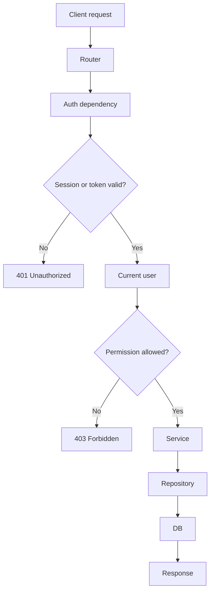
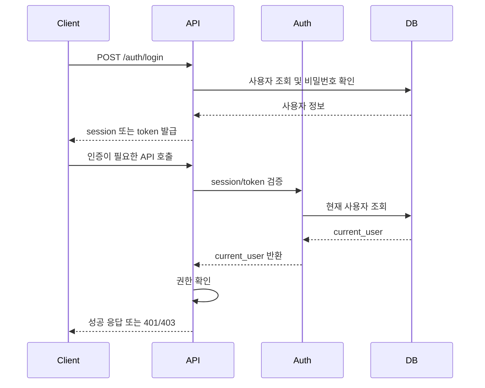

# Sprint 2 인증/인가 + 보안 기본 학습 가이드

목표 시간은 2시간입니다.

어제 access token을 통한 간단한 로그인/회원가입 코드와 흐름을 이미 봤다면, 이번 Sprint 2에서는 구현보다 개념 지도를 먼저 잡습니다. 핵심은 Session, JWT, OAuth/OIDC가 각각 어떤 문제를 해결하고, 코드 구조가 어떻게 달라지며, 우리 팀이 어떤 기준으로 인증 방식을 선택해야 하는지 이해하는 것입니다.

## 핵심 질문

```text
로그인 후 인증이 필요한 API를 호출할 때,
프론트엔드와 백엔드 사이에서 무슨 일이 일어나는가?
```

이 질문을 조금 더 쪼개면 다음과 같습니다.

- 인증과 인가는 무엇이 다른가?
- Session 방식은 서버와 브라우저가 무엇을 나눠 가지는가?
- JWT 방식에서 access token과 refresh token은 각각 무엇을 하는가?
- OAuth2와 OIDC는 직접 로그인/JWT 로그인과 무엇이 다른가?
- token 또는 session 정보는 프론트엔드 어디에 저장되는가?
- `401`과 `403`은 언제 구분해서 쓰는가?
- CORS, CSRF, HTTPS, rate limit은 인증 흐름과 어떻게 연결되는가?

## 2시간 학습 순서

| 시간 | 문서 | 목표 |
| --- | --- | --- |
| 0-20분 | [인증/인가 전체 흐름](study/auth-overview.md) | Sprint 1 API 흐름에 인증 단계가 어디에 붙는지 이해한다. |
| 20-35분 | [인증 방식과 저장 위치 구분하기](study/auth-storage-map.md) | session_id, access token, cookie, localStorage, Redis를 층위별로 구분한다. |
| 35-55분 | [Session 인증 방식](study/session-auth.md) | cookie, session 저장소, CSRF 연결을 이해한다. |
| 55-85분 | [JWT 인증 방식](study/jwt-auth.md) | access token, refresh token, 저장 위치, 로그아웃 문제를 이해한다. |
| 85-100분 | [OAuth2와 OIDC](study/oauth-oidc.md) | 소셜 로그인과 권한 위임이 직접 로그인과 어떻게 다른지 이해한다. |
| 100-110분 | [인증 방식 선택 지도](study/auth-choice-map.md) | Session/JWT/OAuth 중 무엇을 언제 쓸지 비교한다. |
| 110-120분 | 아래 정리 템플릿 | 우리 프로젝트의 기본값 후보와 미결 질문을 남긴다. |

## 먼저 잡아야 하는 큰 그림

Sprint 1의 요청 흐름은 아래와 같았습니다.

```text
Router
-> Schema
-> Service
-> Repository
-> DB
-> Response
```

Sprint 2에서는 이 흐름 앞쪽에 "현재 사용자를 확인하는 단계"가 들어옵니다.

```text
Router
-> Auth dependency
-> Current user
-> Service
-> Repository
-> DB
-> Response
```



FastAPI 코드로 보면 대략 이런 모양입니다.

```python
@router.post("/posts")
def create_post(
    payload: PostCreate,
    current_user: User = Depends(get_current_user),
    service: PostService = Depends(get_post_service),
) -> PostRead:
    return service.create(payload, author_id=current_user.id)
```

여기서 `get_current_user`가 session cookie를 볼 수도 있고, JWT access token을 볼 수도 있고, OAuth/OIDC 로그인 이후 발급한 우리 서비스 token을 볼 수도 있습니다.

## 이번 학습에서 꼭 구분할 것

| 개념 | 한 줄 요약 |
| --- | --- |
| 인증 | 사용자가 누구인지 확인한다. |
| 인가 | 그 사용자가 이 행동을 할 수 있는지 확인한다. |
| Session | 서버가 로그인 상태를 저장하고, 브라우저는 session_id cookie를 보낸다. |
| JWT | 클라이언트가 서명된 token을 보내고, 서버가 token을 검증한다. |
| access token | API 요청에 사용하는 짧은 수명 token이다. |
| refresh token | access token을 재발급받기 위한 긴 수명 token이다. |
| OAuth2 | 외부 서비스 권한 위임 흐름이다. |
| OIDC | OAuth2 위에서 사용자 신원을 확인하는 로그인 계층이다. |
| CORS | 브라우저가 다른 origin 요청을 제한하는 정책이다. |
| CSRF | cookie 자동 전송을 악용해 사용자가 원치 않는 요청을 보내게 하는 공격이다. |
| XSS | 공격자가 페이지에서 악성 JavaScript를 실행시키는 공격이다. |

저장 위치가 헷갈리면 [인증 방식과 저장 위치 구분하기](study/auth-storage-map.md)를 먼저 봅니다. `cookie`, `localStorage`, `sessionStorage`, `memory`는 인증 방식이 아니라 클라이언트 저장 위치입니다.

## 팀 싱크용 정리 템플릿

학습 마지막 10분에 아래를 채웁니다.

```md
# Sprint 2 개인 학습 정리

## 내가 이해한 인증 흐름

- 로그인 요청부터 인증 API 호출까지 어떤 순서로 흘러가는가?

## Session / JWT / OAuth 비교

| 방식 | 핵심 아이디어 | 장점 | 단점 | 우리 프로젝트 적합도 |
| --- | --- | --- | --- | --- |
| Session |  |  |  |  |
| JWT |  |  |  |  |
| OAuth/OIDC |  |  |  |  |

## 기본값 후보

- 인증 방식:
- access token 저장 위치:
- refresh token 사용 여부:
- 인증 실패 status/code:
- 권한 실패 status/code:
- CORS 허용 origin:
- rate limit이 필요한 API:

## 팀에 물어볼 질문

- 
```

## Sprint 2 기본값 후보

팀 싱크에서 별도 반대가 없다면 아래를 초기 후보로 둘 수 있습니다.

| 항목 | 기본값 후보 | 이유 |
| --- | --- | --- |
| 인증과 인가 구분 | 인증은 사용자 식별, 인가는 행동 권한 확인 | API 설계와 에러 처리를 분리해서 생각할 수 있다. |
| 인증 실패 | `401 Unauthorized` | 로그인하지 않았거나 token/session이 유효하지 않은 상황이다. |
| 권한 실패 | `403 Forbidden` | 사용자는 식별됐지만 해당 행동 권한이 없는 상황이다. |
| 로그인 API | `POST /api/v1/auth/login` | 인증도 API 계약으로 먼저 정의할 수 있다. |
| 내 정보 API | `GET /api/v1/me` | token/session으로 현재 사용자를 확인하는 흐름을 검증하기 좋다. |
| 인증 필요 API 표시 | API 문서에 `auth required` 표시 | 프론트엔드와 백엔드가 권한 요구사항을 공유하기 쉽다. |
| CORS | 허용 origin을 명시한다 | 모든 origin 허용은 인증 API에서 위험하다. |
| HTTPS | 배포 환경 필수 | token/cookie 탈취 위험을 줄인다. |
| rate limit | 로그인, AI 요청부터 적용 후보 | 보안과 비용 보호에 직접 연결된다. |

## 지금 깊게 파지 않아도 되는 것

- JWT 라이브러리별 세부 옵션
- OAuth provider별 콘솔 설정
- OAuth grant type 전체 암기
- Redis session store 구현
- refresh token rotation 완전 구현
- OWASP Top 10 전체 상세
- 운영용 WAF, IDS, SIEM

지금은 구현보다 아래 흐름을 설명할 수 있으면 충분합니다.

```text
로그인 요청
-> 사용자 확인
-> session 또는 token 발급
-> 클라이언트 저장
-> 인증 API 호출
-> 백엔드 사용자 식별
-> 권한 확인
-> 성공 또는 401/403 응답
```



## 완료 체크리스트

- [ ] 인증과 인가의 차이를 말로 설명할 수 있다.
- [ ] Session 방식의 흐름과 장단점을 설명할 수 있다.
- [ ] JWT 방식의 흐름과 access/refresh token 역할을 설명할 수 있다.
- [ ] OAuth2와 OIDC가 직접 로그인과 어떻게 다른지 설명할 수 있다.
- [ ] token 저장 위치별 장단점을 비교할 수 있다.
- [ ] `401`과 `403`을 구분할 수 있다.
- [ ] CORS와 CSRF가 서로 다른 문제라는 것을 설명할 수 있다.
- [ ] HTTPS와 rate limit이 인증 기능에서 왜 필요한지 설명할 수 있다.
- [ ] 팀 싱크에 가져갈 기본값 후보와 미결 질문을 정리했다.
