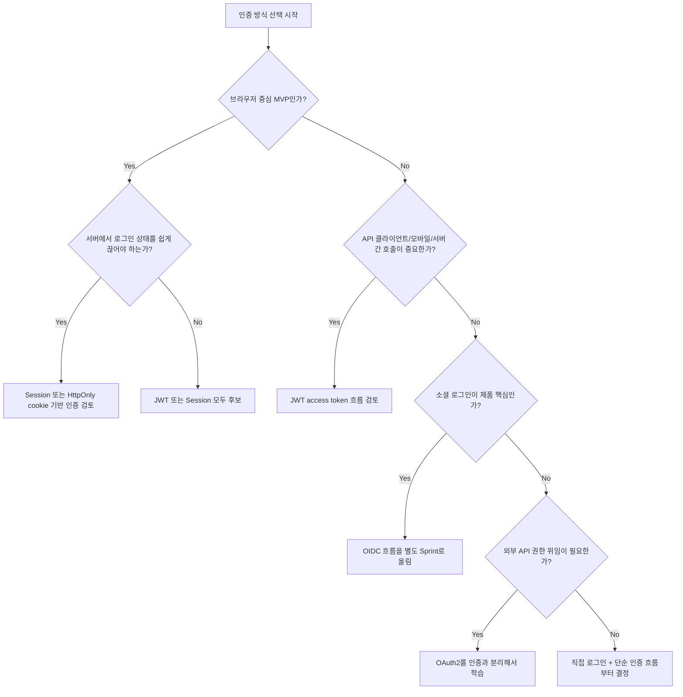

# 인증 방식 선택 지도

## 왜 이 문서를 보는가?

Session, JWT, OAuth/OIDC를 각각 따로 보면 모두 좋아 보입니다. 팀 의사결정에서는 "무엇이 더 멋진가"가 아니라 "우리 서비스에 지금 필요한 기본값이 무엇인가"를 봐야 합니다.

## 먼저 정해야 할 질문

```text
1. 사용자는 브라우저만 쓰는가, 모바일 앱/API 클라이언트도 쓰는가?
2. 우리 서비스가 직접 이메일/비밀번호를 받을 것인가?
3. 소셜 로그인이 MVP에 꼭 필요한가?
4. 로그인 상태를 서버에서 즉시 끊어야 하는 요구가 강한가?
5. refresh token까지 지금 구현할 여유가 있는가?
6. 프론트엔드는 token을 어디에 저장할 것인가?
7. 인증 실패와 권한 실패를 어떤 에러 형식으로 통일할 것인가?
```

## 선택지 비교

| 기준 | Session | JWT | OAuth/OIDC |
| --- | --- | --- | --- |
| 핵심 아이디어 | 서버가 로그인 상태 저장 | 클라이언트가 token 전송 | 외부 provider로 인증/권한 위임 |
| 서버 상태 | 필요 | access token은 불필요, refresh token은 보통 필요 | provider 연동 정보 필요 |
| 브라우저 웹앱 | 좋음 | 가능 | 소셜 로그인에 좋음 |
| 모바일/API 클라이언트 | 번거로울 수 있음 | 좋음 | provider 로그인에 사용 |
| 즉시 로그아웃 | 쉬움 | access token은 어려움 | 우리 서비스 token 정책에 따름 |
| 주요 위험 | CSRF, session 저장소 | XSS, token 탈취, 만료/폐기 | redirect/state/code 검증 오류 |
| 학습 난이도 | 중간 | 중간 | 높음 |

## 단순한 의사결정 흐름

```text
브라우저 기반 MVP이고 빠르게 안전한 흐름을 잡고 싶다.
-> Session 또는 HttpOnly cookie 기반 인증 검토

API 중심이고 Authorization header 기반 흐름을 이미 봤다.
-> JWT access token 흐름 검토

소셜 로그인이 제품 핵심이다.
-> OIDC 흐름을 별도 Sprint로 올린다.

외부 API 권한 위임이 필요하다.
-> OAuth2를 인증과 분리해서 별도로 학습한다.
```



## Sprint 2에서 추천하는 학습 결론

이번 Sprint에서 바로 결론 내릴 필요가 있는 것:

- 인증과 인가의 차이
- `401`과 `403` 기준
- 인증 필요한 API 표시 방식
- 직접 로그인 흐름의 기본 endpoint
- user table에 필요한 최소 필드
- token/session을 프론트엔드가 어떻게 들고 있는지

이번 Sprint에서 질문으로 남겨도 되는 것:

- refresh token rotation을 지금 할 것인가?
- OAuth/OIDC를 MVP에 넣을 것인가?
- Session 저장소를 Redis로 둘 것인가?
- token을 memory, localStorage, HttpOnly cookie 중 어디에 둘 것인가?
- 관리자 권한 체계를 지금 만들 것인가?

## API 초안

인증 방식을 무엇으로 고르든 기본 API 초안은 비슷하게 시작할 수 있습니다.

```text
POST /api/v1/auth/signup
POST /api/v1/auth/login
POST /api/v1/auth/logout
GET  /api/v1/me
```

JWT refresh token을 쓴다면:

```text
POST /api/v1/auth/refresh
```

OAuth/OIDC를 붙인다면:

```text
GET /api/v1/auth/{provider}/login
GET /api/v1/auth/{provider}/callback
```

## 에러 응답 후보

Sprint 1의 공통 에러 형식을 이어서 씁니다.

로그인 실패:

```json
{
  "error": {
    "code": "INVALID_CREDENTIALS",
    "message": "이메일 또는 비밀번호가 올바르지 않습니다.",
    "details": {}
  }
}
```

인증 필요:

```json
{
  "error": {
    "code": "AUTHENTICATION_REQUIRED",
    "message": "로그인이 필요합니다.",
    "details": {}
  }
}
```

권한 없음:

```json
{
  "error": {
    "code": "FORBIDDEN",
    "message": "이 작업을 수행할 권한이 없습니다.",
    "details": {}
  }
}
```

## DB 모델 질문

직접 로그인만 보면 최소 user table은 아래처럼 시작할 수 있습니다.

```text
users
- id
- email
- password_hash
- display_name
- created_at
```

refresh token을 저장한다면:

```text
refresh_tokens
- id
- user_id
- token_hash
- expires_at
- revoked_at
- created_at
```

session을 저장한다면:

```text
sessions
- id
- session_id
- user_id
- expires_at
- created_at
```

OAuth/OIDC를 고려한다면:

```text
oauth_accounts
- id
- user_id
- provider
- provider_user_id
- email
- created_at
```

## 팀 싱크용 결정 후보

아래 표를 채워서 팀 싱크에 가져갑니다.

| 항목 | 후보 | 이유 | 아직 모르는 것 |
| --- | --- | --- | --- |
| 인증 방식 |  |  |  |
| token/session 저장 위치 |  |  |  |
| refresh token 사용 여부 |  |  |  |
| 인증 필요 API 표시 방식 |  |  |  |
| 401 에러 코드 |  |  |  |
| 403 에러 코드 |  |  |  |
| OAuth/OIDC 도입 시점 |  |  |  |
| rate limit 적용 API |  |  |  |

## 체크 질문

- 우리 서비스에는 Session과 JWT 중 무엇이 더 단순한가?
- OAuth/OIDC는 MVP 필수인가, 후순위인가?
- 인증 방식 선택이 프론트엔드 라우팅에 어떤 영향을 주는가?
- 인증 방식 선택이 DB table에 어떤 영향을 주는가?
- 보안상 지금 반드시 정해야 하는 기본값은 무엇인가?
