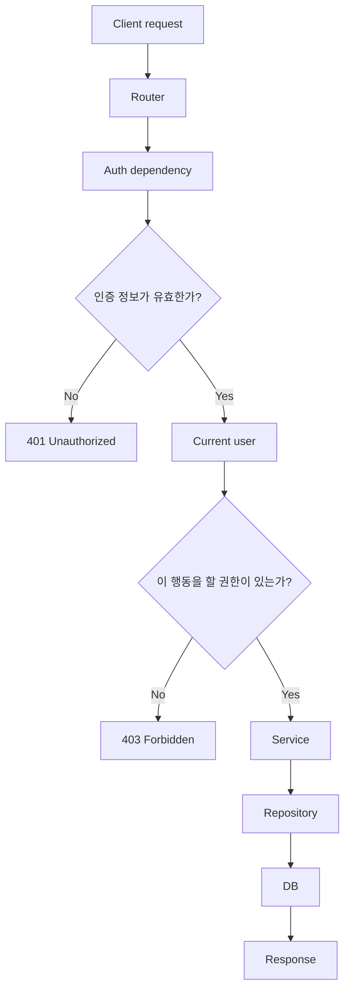

# 인증/인가 전체 흐름

## 왜 이 문서를 보는가?

어제 access token을 통한 간단한 로그인/회원가입 흐름을 봤다면, 이제 봐야 할 것은 "로그인이 작동한다"가 아니라 "인증 방식마다 서버와 클라이언트의 책임이 어떻게 달라지는가"입니다.

Sprint 2에서 다루는 Session, JWT, OAuth/OIDC는 모두 로그인과 관련 있지만 같은 문제가 아닙니다.

```text
Session
서버가 로그인 상태를 기억한다.

JWT
클라이언트가 서명된 token을 들고 다니고, 서버가 token을 검증한다.

OAuth2
외부 서비스에 대한 권한 위임 흐름이다.

OIDC
OAuth2 위에 로그인한 사용자가 누구인지 확인하는 인증 계층이다.
```

## 인증과 인가

인증은 "너는 누구인가?"를 확인하는 일입니다.

```text
이메일/비밀번호 확인
token 검증
session 조회
소셜 로그인 id token 검증
```

인가는 "너는 이 행동을 할 수 있는가?"를 확인하는 일입니다.

```text
게시글 작성자만 수정 가능
관리자만 사용자 정지 가능
로그인 사용자만 댓글 작성 가능
```

둘은 순서가 있습니다.

```text
1. 인증: 현재 사용자가 누구인지 확인한다.
2. 인가: 그 사용자가 이 행동을 할 수 있는지 확인한다.
```

## 공통 요청 흐름

인증 방식이 달라도 백엔드 API가 처리해야 하는 큰 흐름은 비슷합니다.

```text
클라이언트 요청
-> 인증 정보 확인
-> 현재 사용자 식별
-> 권한 확인
-> service 로직 실행
-> DB 변경 또는 조회
-> 응답
```

Sprint 1 흐름과 비교하면 인증/인가가 API 라우터 앞이나 라우터 의존성 단계에 붙습니다.

```text
Sprint 1
Router -> Schema -> Service -> Repository -> DB

Sprint 2
Router -> Auth dependency -> Current user -> Service -> Repository -> DB
```



## FastAPI에서는 어디에 붙는가?

FastAPI에서는 보통 `Depends(...)`로 현재 사용자를 주입합니다.

```python
from fastapi import Depends

def get_current_user() -> User:
    # session cookie 또는 Authorization header를 확인한다.
    # 유효하면 User를 반환한다.
    # 유효하지 않으면 401을 발생시킨다.
    ...


@router.post("/posts")
def create_post(
    payload: PostCreate,
    current_user: User = Depends(get_current_user),
    service: PostService = Depends(get_post_service),
) -> PostRead:
    return service.create(payload, author_id=current_user.id)
```

라우터는 인증 방식의 세부 구현을 몰라도 됩니다.

```text
Router가 아는 것
- 이 API에는 현재 사용자가 필요하다.
- 현재 사용자는 get_current_user가 가져온다.

Router가 몰라도 되는 것
- session_id를 어디서 읽는지
- JWT 서명을 어떻게 검증하는지
- OAuth id token을 어떻게 검증하는지
```

## 401과 403

인증/인가에서 가장 먼저 맞춰야 하는 status code는 `401`과 `403`입니다.

| 상황 | 의미 | status |
| --- | --- | --- |
| 로그인하지 않음 | 사용자가 누구인지 모른다. | `401 Unauthorized` |
| token/session이 만료됨 | 현재 사용자를 확인할 수 없다. | `401 Unauthorized` |
| 로그인했지만 권한 없음 | 사용자는 알지만 이 행동을 할 수 없다. | `403 Forbidden` |

예시:

```text
로그인 안 한 사용자가 글 작성
-> 401

로그인한 사용자가 남의 글 수정
-> 403
```

## 팀 싱크에서 결정할 것

- 인증이 필요한 API를 어떻게 표시할 것인가?
- 로그인하지 않은 요청은 어떤 공통 에러 코드를 줄 것인가?
- 권한 없는 요청은 어떤 공통 에러 코드를 줄 것인가?
- `current_user`는 라우터에 직접 주입할 것인가, service까지 넘길 것인가?
- 작성자 권한 확인은 service에서 할 것인가, 별도 policy 함수로 뺄 것인가?

## 체크 질문

- 인증과 인가의 차이를 예시로 설명할 수 있는가?
- `401`과 `403`을 구분할 수 있는가?
- Sprint 1 흐름에서 인증 단계가 어디에 끼어드는지 설명할 수 있는가?
- FastAPI의 `Depends(get_current_user)`가 왜 유용한지 설명할 수 있는가?
