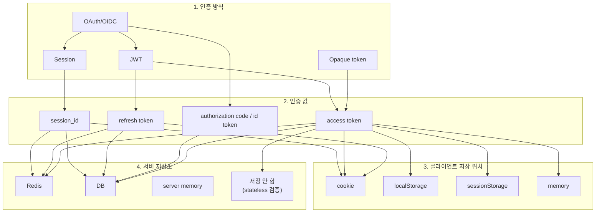
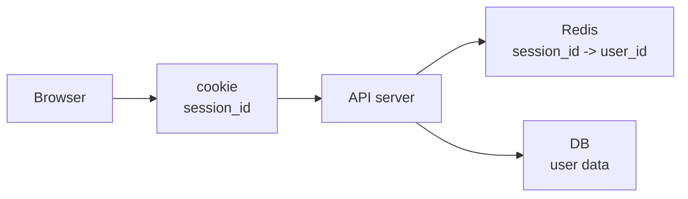
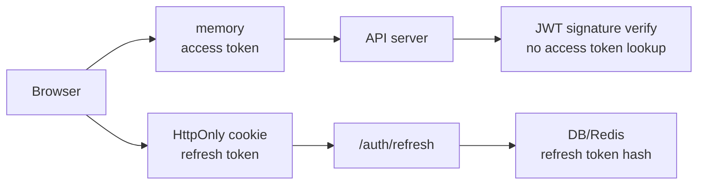
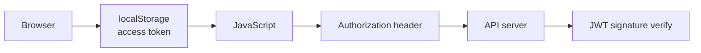
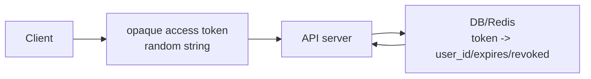

# 인증 방식과 저장 위치 구분하기

## 왜 이 문서를 보는가?

Session, JWT, cookie, localStorage, sessionStorage, Redis가 한꺼번에 나오면 헷갈리기 쉽습니다. 이유는 이 단어들이 같은 종류가 아니기 때문입니다.

먼저 아래 네 층위를 분리해야 합니다.

```text
인증 방식
-> Session, JWT, OAuth/OIDC

인증 값
-> session_id, access token, refresh token

클라이언트 저장 위치
-> cookie, localStorage, sessionStorage, memory

서버 저장소
-> Redis, DB, server memory
```

시각적으로 보면 아래처럼 나눌 수 있습니다.



핵심은 선이 하나만 있는 것이 아니라는 점입니다. `access token`은 localStorage에만 저장되는 것이 아니고, cookie도 JWT 전용이나 Session 전용이 아닙니다. 문맥에 따라 조합이 달라집니다.

## 층위별로 다시 보기

```text
┌──────────────────────────────────────────────┐
│ 1. 인증 방식                                  │
│ Session / JWT / OAuth-OIDC / Opaque token     │
└──────────────────────────────────────────────┘
                    ↓
┌──────────────────────────────────────────────┐
│ 2. 인증 값                                    │
│ session_id / access token / refresh token     │
└──────────────────────────────────────────────┘
                    ↓
┌──────────────────────────────────────────────┐
│ 3. 클라이언트 저장 위치                       │
│ cookie / localStorage / sessionStorage / memory│
└──────────────────────────────────────────────┘
                    ↓
┌──────────────────────────────────────────────┐
│ 4. 서버 저장소                                │
│ Redis / DB / memory / 저장 안 함              │
└──────────────────────────────────────────────┘
```

## 한 장으로 보는 매핑

| 인증 방식 | 클라이언트가 들고 있는 값 | 클라이언트 저장 위치 | 서버가 저장하는 것 |
| --- | --- | --- | --- |
| Session | `session_id` | 보통 cookie | session data in Redis/DB/memory |
| JWT access token | `access token` | memory, localStorage, sessionStorage, cookie 가능 | 보통 access token 자체는 저장하지 않음 |
| JWT + refresh token | `access token` + `refresh token` | access token은 memory/localStorage 등, refresh token은 HttpOnly cookie가 흔함 | refresh token hash를 DB/Redis에 저장 가능 |
| Opaque access token | 랜덤 문자열 access token | memory, localStorage, sessionStorage, cookie 가능 | token data를 DB/Redis에 저장 |
| OAuth/OIDC | provider code/id token을 거쳐 우리 서비스 token 발급 | 최종적으로 우리 서비스 session/JWT 정책을 따름 | provider account mapping, refresh token 등 |

## cookie

cookie는 브라우저가 관리하는 저장/전송 수단입니다.

서버는 응답에 `Set-Cookie`를 넣어 브라우저에 cookie 저장을 지시할 수 있습니다.

```http
Set-Cookie: session_id=abc123; HttpOnly; Secure; SameSite=Lax
```

브라우저는 조건이 맞으면 다음 요청에 cookie를 자동으로 붙입니다.

```http
Cookie: session_id=abc123
```

cookie는 보통 Session 방식에서 `session_id`를 들고 다니는 데 많이 씁니다.

```text
cookie
-> session_id=abc123

Redis
-> session:abc123 = user_id=1
```

하지만 cookie가 session 전용은 아닙니다. refresh token을 HttpOnly cookie에 저장하는 방식도 자주 검토합니다.

## localStorage

localStorage는 브라우저 안에 JavaScript가 값을 저장하는 공간입니다.

```javascript
localStorage.setItem("access_token", "eyJ...");
const token = localStorage.getItem("access_token");
```

localStorage 값은 요청에 자동으로 붙지 않습니다. JavaScript가 직접 읽어서 header에 넣어야 합니다.

```javascript
fetch("/api/v1/me", {
  headers: {
    Authorization: `Bearer ${token}`,
  },
});
```

장점:

- 구현이 쉽다.
- 새로고침해도 값이 남는다.

단점:

- JavaScript가 항상 읽을 수 있다.
- XSS가 발생하면 token이 탈취될 수 있다.

## sessionStorage

sessionStorage도 브라우저 안에 JavaScript가 값을 저장하는 공간입니다. 사용법은 localStorage와 비슷합니다.

```javascript
sessionStorage.setItem("access_token", "eyJ...");
const token = sessionStorage.getItem("access_token");
```

차이는 유지 범위입니다.

```text
localStorage
-> 브라우저를 닫았다가 다시 열어도 남을 수 있다.

sessionStorage
-> 현재 탭의 세션 동안만 유지된다.
-> 탭을 닫으면 사라진다.
```

sessionStorage도 JavaScript로 읽을 수 있으므로 XSS 위험은 localStorage와 비슷하게 봐야 합니다.

## memory

memory는 브라우저 저장소에 남기지 않고 JavaScript 변수나 앱 상태에만 token을 들고 있는 방식입니다.

```javascript
let accessToken = null;

accessToken = loginResponse.access_token;
```

장점:

- 새로고침하면 사라지므로 token이 오래 남지 않는다.
- localStorage보다 token 탈취 표면이 줄어든다.

단점:

- 새로고침하면 access token이 사라진다.
- 로그인 유지 UX를 만들려면 refresh token 재발급 흐름이 필요하다.

그래서 실제 브라우저 앱에서는 아래 조합을 많이 검토합니다.

```text
access token
-> memory

refresh token
-> HttpOnly cookie
```

## 서버 저장소: Redis, DB, memory

서버 저장소는 클라이언트 저장 위치와 다른 개념입니다.

```text
클라이언트 저장 위치
-> 브라우저가 무엇을 들고 있나?

서버 저장소
-> 서버가 인증 상태나 token 상태를 어디에 저장하나?
```

| 서버 저장소 | 주로 저장하는 것 | 특징 |
| --- | --- | --- |
| Redis | session data, refresh token, blocklist, rate limit counter | 빠르고 TTL 관리가 쉽다. |
| DB | user, refresh token hash, session 기록, OAuth account | 영속성과 감사 기록에 좋다. |
| memory | 개발/학습용 session, 임시 token | 서버 재시작 시 사라지고 서버 여러 대에서 공유가 어렵다. |

## 자주 헷갈리는 문장 정리

### "cookie는 session이랑 연결되고 localStorage는 token이랑 연결된다?"

출발점으로는 맞지만 정확히는 아닙니다.

```text
Session 방식에서는 보통 cookie에 session_id를 저장한다.
Token 방식에서는 token을 localStorage에 저장할 수도 있다.
```

하지만 token도 cookie에 저장할 수 있고, session_id도 넓게 보면 인증 값입니다.

정확히는 이렇게 봅니다.

```text
cookie/localStorage/sessionStorage/memory
-> 저장 위치 또는 전송 방식

session_id/access token/refresh token
-> 인증에 쓰는 값

Session/JWT/OAuth
-> 인증 방식 또는 인증 프로토콜

Redis/DB
-> 서버 쪽 저장소
```

### "access token은 어디에 저장하는가?"

정답은 하나가 아닙니다.

| 저장 위치 | 특징 |
| --- | --- |
| memory | 보안상 선호되지만 새로고침 시 사라진다. |
| localStorage | 구현이 쉽지만 XSS에 취약하다. |
| sessionStorage | 탭을 닫으면 사라지지만 XSS 위험은 있다. |
| HttpOnly cookie | JavaScript가 읽지 못하지만 CSRF를 고려해야 한다. |

### "JWT를 쓰면 Redis는 안 쓰는가?"

아닙니다.

JWT access token 검증 자체에는 Redis가 필수는 아닙니다.

```text
JWT access token
-> 서명 검증
-> exp 확인
-> sub로 user_id 확인
```

하지만 JWT 프로젝트에서도 Redis를 쓸 수 있습니다.

- refresh token 저장
- access token blocklist
- rate limit
- 인증 실패 횟수 제한
- 이메일 인증 코드
- 비밀번호 재설정 코드

## 실제 프로젝트에서 자주 보는 조합

### 브라우저 중심 Session 방식

```text
session_id
-> HttpOnly cookie

session data
-> Redis
```

특징:

- 서버가 session을 강하게 통제한다.
- 로그아웃과 강제 만료가 쉽다.
- CSRF 대응이 필요하다.



### JWT + refresh token 방식

```text
access token
-> memory

refresh token
-> HttpOnly cookie

refresh token hash
-> DB 또는 Redis
```

특징:

- access token은 짧게 둔다.
- refresh token으로 access token을 재발급한다.
- refresh token은 서버에서 revoke/delete할 수 있게 저장한다.



### 단순 JWT 학습/MVP 방식

```text
access token
-> localStorage
```

특징:

- 구현이 쉽다.
- 새로고침해도 유지된다.
- XSS에 취약하므로 실서비스 기본값으로는 신중해야 한다.



### Opaque token 방식

```text
access token
-> 랜덤 문자열

token data
-> DB 또는 Redis
```

특징:

- token을 즉시 무효화하기 쉽다.
- 매 요청마다 서버 저장소 조회가 필요하다.
- 중앙 통제가 중요한 서비스에 맞을 수 있다.



## 체크 질문

- 지금 말하는 것은 인증 방식인가, 인증 값인가, 저장 위치인가, 서버 저장소인가?
- cookie에 들어가는 값은 session data 자체인가, session_id인가?
- localStorage에 저장한 token은 요청에 자동으로 붙는가?
- sessionStorage와 localStorage의 차이는 무엇인가?
- JWT access token 검증에 Redis가 반드시 필요한가?
- refresh token은 왜 DB나 Redis에 저장하는 경우가 많은가?
