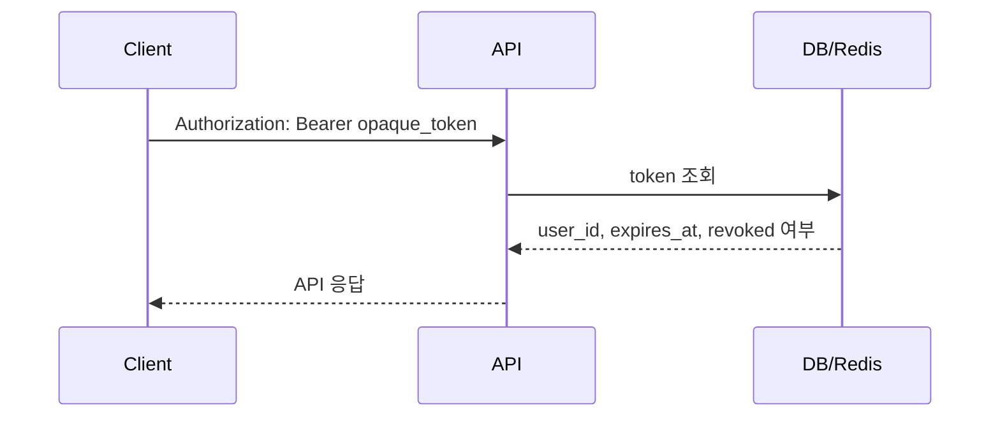
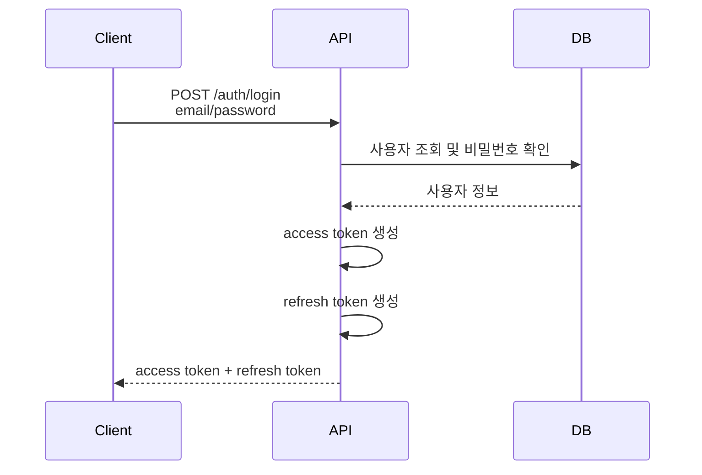
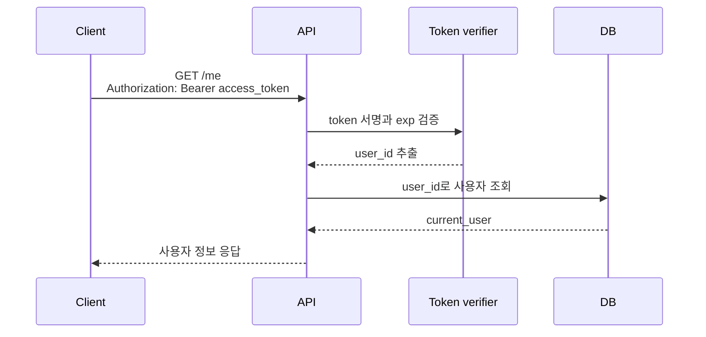
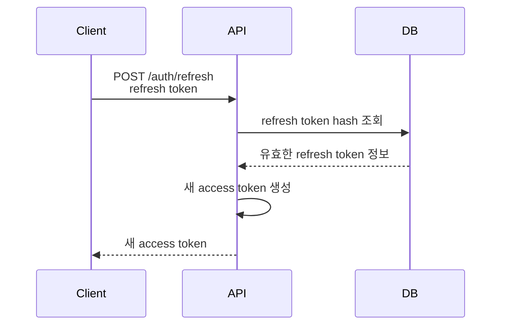

# JWT 인증 방식

## JWT 방식 한 줄 요약

JWT 방식은 서버가 로그인 성공 시 서명된 token을 발급하고, 클라이언트가 이후 요청마다 token을 보내면 서버가 서명을 검증해 사용자를 확인하는 방식입니다.

```text
클라이언트: access token을 들고 다닌다.
서버: token 서명과 만료 시간을 검증한다.
```

## JWT는 무엇인가?

JWT는 JSON Web Token의 줄임말입니다. JSON 형태의 정보를 안전하게 전달하기 위해 만든 token 형식입니다.

JWT는 보통 세 부분으로 구성됩니다.

```text
header.payload.signature
```

실제 token은 아래처럼 점(`.`)으로 구분된 긴 문자열입니다.

```text
eyJhbGciOiJIUzI1NiIsInR5cCI6IkpXVCJ9
.
eyJzdWIiOiIxIiwiZXhwIjoxNzYwMDAwMDAwfQ
.
SflKxwRJSMeKKF2QT4fwpMeJf36POk6yJV_adQssw5c
```

### header

header에는 token의 종류와 서명 알고리즘이 들어갑니다.

```json
{
  "typ": "JWT",
  "alg": "HS256"
}
```

의미:

```text
이 token은 JWT이고, HS256 방식으로 서명했다.
```

### payload

payload에는 서버가 전달하고 싶은 claim이 들어갑니다. claim은 token 안에 담긴 정보 조각이라고 보면 됩니다.

payload 예시:

```json
{
  "sub": "1",
  "exp": 1760000000,
  "iat": 1759996400,
  "role": "user"
}
```

자주 보는 claim:

| claim | 의미 |
| --- | --- |
| `sub` | subject. 보통 user id를 넣는다. |
| `exp` | expiration time. token 만료 시각이다. |
| `iat` | issued at. token 발급 시각이다. |
| `jti` | JWT ID. token을 식별하는 고유 id다. blocklist에 쓸 수 있다. |
| `iss` | issuer. token 발급자다. |
| `aud` | audience. token 대상 서비스다. |

### signature

signature는 header와 payload가 중간에 바뀌지 않았는지 확인하기 위한 서명입니다.

```text
signature = sign(header + "." + payload, secret_key)
```

서버는 token을 받을 때 같은 secret key 또는 public key로 signature를 검증합니다. 누군가 payload의 `sub`를 `"1"`에서 `"999"`로 바꾸면 signature 검증이 실패해야 합니다.

중요한 점:

```text
JWT payload는 암호화가 아니다.
base64url로 인코딩되어 있을 뿐이다.
비밀번호, API key, 주민번호 같은 민감한 값을 넣으면 안 된다.
```

정리하면 JWT는 "내용을 숨기는 token"이 아니라 "내용이 변조되지 않았는지 검증할 수 있는 token"에 가깝습니다.

## access token 방식과 JWT 방식은 무엇이 다른가?

둘은 같은 층위의 단어가 아닙니다.

```text
access token
-> API 접근 권한을 증명하는 token의 역할 이름

JWT
-> token을 표현하는 구체적인 형식
```

즉 access token은 JWT일 수도 있고, 아닐 수도 있습니다.

| 구분 | 설명 |
| --- | --- |
| opaque access token | 랜덤 문자열 token. 서버가 DB/Redis에서 조회해야 의미를 알 수 있다. |
| JWT access token | token 자체에 `sub`, `exp` 같은 정보가 있고, 서버가 서명 검증으로 확인할 수 있다. |

예시:

```text
opaque access token
abc123randomtoken

JWT access token
eyJhbGciOiJIUzI1NiIsInR5cCI6IkpXVCJ9...
```

어제 봤던 "access token 로그인"이 JWT를 썼다면 `access token 역할을 하는 JWT`를 본 것입니다. 반대로 access token이 단순 랜덤 문자열이었다면 서버가 저장소에서 token을 조회하는 방식일 수 있습니다.

어제 구현한 방식이 단순 랜덤 문자열 access token을 DB나 메모리에 저장해두고, 요청 때마다 그 token을 조회해서 사용자를 찾는 구조였다면 `opaque access token` 방식입니다.

```text
opaque access token 흐름
클라이언트 -> Authorization: Bearer abc123randomtoken
서버 -> DB/Redis에서 abc123randomtoken 조회
서버 -> user_id 확인
서버 -> API 처리
```



## opaque access token도 실제로 쓰는가?

씁니다. 특히 서버가 token 상태를 강하게 통제해야 하거나, token 자체에 정보를 노출하고 싶지 않은 경우에 쓰입니다.

opaque token을 쓰는 경우:

- token을 즉시 revoke해야 한다.
- 매 요청마다 token이 아직 유효한지 서버 저장소에서 확인하고 싶다.
- token 안에 user id, role, 만료 시간 같은 정보를 노출하고 싶지 않다.
- 인증 서버와 리소스 서버가 token introspection으로 유효성을 확인하는 구조다.
- 내부 서비스나 관리자 기능처럼 중앙 통제가 더 중요한 경우다.

장점:

- 서버 저장소에서 token을 지우면 즉시 무효화할 수 있다.
- token 문자열만 봐서는 아무 정보도 알 수 없다.
- 권한 변경, 계정 정지, 로그아웃 반영이 쉽다.

단점:

- 매 인증 요청마다 DB/Redis 조회가 필요하다.
- 서버 저장소가 장애나 병목 지점이 될 수 있다.
- 여러 서비스가 token을 검증해야 하면 중앙 introspection endpoint나 공유 저장소가 필요하다.

## 실제 프로젝트에서는 무엇을 많이 쓰는가?

정답은 서비스 형태에 따라 다르지만, 일반적으로는 아래처럼 많이 나뉩니다.

| 상황 | 자주 쓰는 방식 | 이유 |
| --- | --- | --- |
| 단일 백엔드 + 빠른 MVP | JWT access token 또는 opaque token 둘 다 가능 | 구현팀이 이해하기 쉬운 쪽을 고른다. |
| API 서버가 여러 개 | JWT access token | 각 서버가 DB 조회 없이 서명 검증만으로 인증할 수 있다. |
| 모바일 앱/외부 API 클라이언트 | JWT access token | Authorization header 기반 흐름과 잘 맞는다. |
| 로그아웃/강제 차단이 매우 중요 | opaque token 또는 JWT + blocklist | 서버가 token 상태를 통제해야 한다. |
| 브라우저 중심 웹앱 | Session 또는 access token + HttpOnly refresh cookie | UX와 보안 trade-off를 함께 본다. |
| OAuth2 provider 구조 | opaque token도 흔함 | token introspection으로 중앙 검증하는 구조가 가능하다. |

JWT를 많이 쓰는 이유:

- access token을 매번 DB에서 조회하지 않아도 된다.
- 서버가 여러 대여도 같은 secret/public key로 검증할 수 있다.
- API 중심 구조에서 `Authorization: Bearer` 패턴과 잘 맞는다.
- payload에 `sub`, `exp`, `scope` 같은 최소 정보를 담아 빠르게 판단할 수 있다.

opaque token을 안 쓰는 경우의 주된 이유:

- 매 요청마다 token 저장소를 조회해야 해서 stateless하지 않다.
- 저장소 장애가 인증 장애로 바로 이어질 수 있다.
- 서버가 여러 개일 때 token 조회 경로를 공통으로 관리해야 한다.

opaque token을 쓰는 이유:

- 즉시 폐기와 중앙 통제가 쉽다.
- token에 정보를 노출하지 않는다.
- 서버가 token 상태를 항상 최신으로 판단할 수 있다.

정리하면 JWT가 opaque보다 항상 좋은 것은 아닙니다. JWT는 "분산된 서버가 빠르게 검증하기 좋다"는 장점이 있고, opaque token은 "서버가 token 상태를 강하게 통제하기 좋다"는 장점이 있습니다.

## access token

access token은 API를 호출할 때 현재 사용자를 증명하기 위한 짧은 수명의 token입니다.

```http
GET /api/v1/me
Authorization: Bearer <access_token>
```

백엔드는 다음을 확인합니다.

```text
1. token 형식이 맞는가?
2. 서명이 맞는가?
3. 만료되지 않았는가?
4. payload의 sub에 해당하는 사용자가 존재하는가?
```

## refresh token

refresh token은 access token이 만료되었을 때 새 access token을 받기 위한 긴 수명의 token입니다.

```text
access token
- 수명이 짧다.
- API 요청마다 사용한다.
- 탈취되면 짧은 시간 동안 위험하다.

refresh token
- 수명이 길다.
- access token 재발급에 사용한다.
- 탈취되면 위험이 크므로 더 조심해서 저장해야 한다.
```

## 기본 로그인 흐름

```text
POST /api/v1/auth/login
-> 이메일/비밀번호 확인
-> access token 생성
-> refresh token 생성
-> 클라이언트에 반환
```



응답 예시:

```json
{
  "access_token": "eyJ...",
  "refresh_token": "eyJ...",
  "token_type": "bearer"
}
```

이후 요청:

```http
GET /api/v1/me
Authorization: Bearer eyJ...
```



refresh token으로 access token을 재발급하는 흐름은 아래처럼 볼 수 있습니다.



## 코드 흐름 예시

token 생성:

```python
from datetime import datetime, timedelta, timezone
import jwt

SECRET_KEY = "change-me"
ALGORITHM = "HS256"


def create_access_token(user_id: int) -> str:
    now = datetime.now(timezone.utc)
    payload = {
        "sub": str(user_id),
        "iat": now,
        "exp": now + timedelta(minutes=15),
    }
    return jwt.encode(payload, SECRET_KEY, algorithm=ALGORITHM)
```

token 검증:

```python
from fastapi import HTTPException, status
from fastapi.security import HTTPAuthorizationCredentials, HTTPBearer

bearer_scheme = HTTPBearer()


def decode_access_token(token: str) -> int:
    try:
        payload = jwt.decode(token, SECRET_KEY, algorithms=[ALGORITHM])
    except jwt.ExpiredSignatureError:
        raise HTTPException(status_code=401, detail="Token expired")
    except jwt.InvalidTokenError:
        raise HTTPException(status_code=401, detail="Invalid token")

    return int(payload["sub"])
```

현재 사용자 의존성:

```python
def get_current_user(
    credentials: HTTPAuthorizationCredentials = Depends(bearer_scheme),
) -> User:
    user_id = decode_access_token(credentials.credentials)
    user = find_user(user_id)
    if user is None:
        raise HTTPException(status_code=401, detail="User not found")
    return user
```

인증 API:

```python
@router.get("/me")
def me(current_user: User = Depends(get_current_user)) -> UserRead:
    return UserRead.model_validate(current_user)
```

## refresh token을 DB에 저장하는 경우

access token은 stateless하게 검증하더라도, refresh token은 DB에 저장하는 경우가 많습니다.

여기서 stateless하다는 말은 "서버가 access token을 DB에서 매번 조회하지 않아도, token 자체의 서명과 만료 시간을 검증해서 사용할 수 있다"는 뜻입니다.

```text
JWT access token 검증
-> DB에서 token을 찾지 않는다.
-> secret/public key로 서명 검증
-> exp 만료 확인
-> sub에서 user_id 확인
```

그런데 refresh token은 보통 수명이 길고, 탈취되면 계속 access token을 새로 만들 수 있기 때문에 더 강하게 통제해야 합니다. 그래서 서버 저장소에 refresh token 정보를 저장해두고, 재발급 요청이 올 때마다 확인하는 경우가 많습니다.

```text
refresh token 재발급 요청
-> refresh token이 서버 저장소에 있는가?
-> 만료되지 않았는가?
-> revoke되지 않았는가?
-> 맞다면 새 access token 발급
```

```text
refresh_tokens
- id
- user_id
- token_hash
- expires_at
- revoked_at
- created_at
```

왜 원문 token이 아니라 hash를 저장하는가?

```text
DB가 유출되어도 refresh token 원문을 바로 사용할 수 없게 하기 위해서다.
비밀번호를 hash로 저장하는 것과 비슷한 이유다.
```

DB에 refresh token을 저장하면 다음을 할 수 있습니다.

- 로그아웃 시 refresh token을 revoke한다.
- 특정 기기에서만 로그아웃한다.
- refresh token 만료 시간을 관리한다.
- 탈취 의심 시 모든 refresh token을 폐기한다.
- 사용자가 로그인한 기기 목록을 보여줄 수 있다.

Redis에 저장할 수도 있습니다.

```text
DB에 저장
- 감사 기록, 기기 목록, 관리 기능에 좋다.
- 영속성이 필요할 때 적합하다.

Redis에 저장
- TTL 관리가 쉽고 빠르다.
- 단순 만료/조회 중심이면 적합하다.
- Redis 데이터가 사라졌을 때 재로그인이 필요할 수 있다.
```

실제 프로젝트에서는 refresh token을 DB에 저장하거나, Redis에 저장하거나, 둘을 섞기도 합니다. 중요한 것은 access token처럼 "발급 후 완전히 방치"하지 않고, refresh token은 서버에서 추적 가능하게 만드는 경우가 많다는 점입니다.

## token 저장 위치

저장 위치와 인증 방식이 헷갈리면 먼저 [인증 방식과 저장 위치 구분하기](auth-storage-map.md)를 봅니다.

| 위치 | 장점 | 위험 |
| --- | --- | --- |
| memory | XSS로 token을 빼가기 어렵다. | 새로고침하면 사라진다. |
| localStorage | 구현이 쉽다. | XSS에 취약하다. |
| sessionStorage | 탭 단위로 유지된다. | XSS에 취약하다. |
| HttpOnly cookie | JavaScript에서 읽지 못한다. | CSRF 대응이 필요하다. |

단순히 "JWT는 localStorage에 넣는다"로 끝내면 위험합니다. token 저장 위치는 XSS, CSRF, 새로고침 UX, 구현 난이도를 함께 봐야 합니다.

실제 프로젝트에서 자주 보는 선택지는 크게 두 가지입니다.

### 1. access token은 memory, refresh token은 HttpOnly cookie

브라우저 기반 서비스에서 많이 고려하는 방식입니다.

```text
access token
-> JavaScript memory에만 보관
-> API 요청 때 Authorization header에 넣음
-> 새로고침하면 사라짐

refresh token
-> HttpOnly Secure SameSite cookie에 저장
-> JavaScript가 직접 읽지 못함
-> access token 재발급에 사용
```

장점:

- access token이 localStorage에 오래 남지 않는다.
- refresh token은 JavaScript로 읽을 수 없다.
- access token 수명을 짧게 가져갈 수 있다.

주의점:

- refresh token cookie를 쓰므로 CSRF 대응을 봐야 한다.
- 새로고침 시 access token 재발급 흐름이 필요하다.

### 2. access token을 localStorage에 저장

학습용이나 단순한 프로젝트에서 자주 보입니다.

장점:

- 구현이 쉽다.
- 새로고침해도 로그인 상태를 유지하기 쉽다.

단점:

- XSS가 발생하면 token이 탈취될 수 있다.
- 실제 서비스에서는 보안 검토 없이 기본값으로 두기엔 위험하다.

### Redis는 JWT에서 안 쓰는가?

JWT access token만 놓고 보면 Redis가 없어도 됩니다. 이것이 JWT의 장점 중 하나입니다.

```text
JWT access token
-> 서버가 Redis/DB에서 token을 찾지 않아도
-> 서명과 만료 시간만 검증해서 사용할 수 있다.
```

하지만 JWT를 쓰는 프로젝트에서도 Redis를 쓸 수 있습니다.

Redis를 쓰는 경우:

- refresh token 저장소
- 로그아웃된 access token blocklist
- rate limit
- 인증 실패 횟수 제한
- 이메일 인증 코드, 비밀번호 재설정 코드

즉 "JWT를 쓰면 Redis를 안 쓴다"가 아닙니다. "JWT access token 검증 자체에는 Redis가 필수는 아니다"가 더 정확합니다.

## 로그아웃 문제

JWT access token은 서버가 저장하지 않기 때문에 이미 발급된 token을 즉시 무효화하기 어렵습니다.

가능한 방법:

| 방법 | 설명 |
| --- | --- |
| access token 수명을 짧게 둔다 | 탈취되어도 위험 시간을 줄인다. |
| refresh token을 DB에서 revoke한다 | 새 access token 발급을 막는다. |
| token blocklist를 둔다 | access token jti를 저장해 거부한다. 구현 비용이 든다. |

보통 많이 쓰는 현실적인 방식은 아래 조합입니다.

```text
1. access token 수명을 짧게 둔다.
2. refresh token은 DB 또는 Redis에 저장한다.
3. 로그아웃하면 refresh token을 revoke/delete한다.
4. 이미 발급된 access token은 짧은 만료 시간까지는 살아 있을 수 있다고 본다.
```

예시:

```text
access token 만료: 10-30분
refresh token 만료: 7-30일
로그아웃: refresh token revoke
```

강제 차단이 매우 중요한 서비스라면 access token에도 `jti`를 넣고 blocklist를 둘 수 있습니다.

```text
access token payload
{ "sub": "1", "jti": "token-uuid", "exp": ... }

로그아웃 또는 강제 차단
-> Redis에 blocklist:jti 저장
-> API 요청 때 JWT 검증 후 jti가 blocklist에 있는지 확인
```

다만 이 방식은 매 요청마다 Redis 조회가 추가됩니다. JWT의 stateless 장점이 줄어듭니다. 그래서 일반적인 MVP나 학습 단계에서는 refresh token revoke와 짧은 access token 만료를 먼저 이해하는 것이 좋습니다.

## 장점

- 서버가 access token 상태를 저장하지 않아도 된다.
- API 클라이언트, 모바일 앱, 서버 간 통신에 쓰기 좋다.
- `Authorization` header 기반이면 cookie 자동 전송 문제를 줄일 수 있다.

## 단점

- token 저장 위치를 잘못 고르면 위험하다.
- 즉시 로그아웃/강제 차단이 session보다 어렵다.
- refresh token 설계를 해야 실제 서비스에 가까워진다.
- payload에 무엇을 넣을지 잘못 정하면 보안과 데이터 정합성 문제가 생긴다.

## 팀 기본값 후보

```text
처음에는 access token 기반으로 흐름을 잡되,
refresh token 저장/회전/폐기는 별도 결정으로 분리한다.

JWT payload에는 user_id에 해당하는 sub, exp, iat 정도만 넣고
민감 정보나 자주 바뀌는 권한 정보는 최소화한다.
```

## 체크 질문

- JWT payload에 넣어도 되는 정보와 안 되는 정보는 무엇인가?
- access token과 refresh token의 역할은 어떻게 다른가?
- access token이 탈취되면 어떤 문제가 생기는가?
- 로그아웃 시 access token과 refresh token은 각각 어떻게 처리할 것인가?
- token을 localStorage에 저장하면 어떤 공격에 취약한가?
