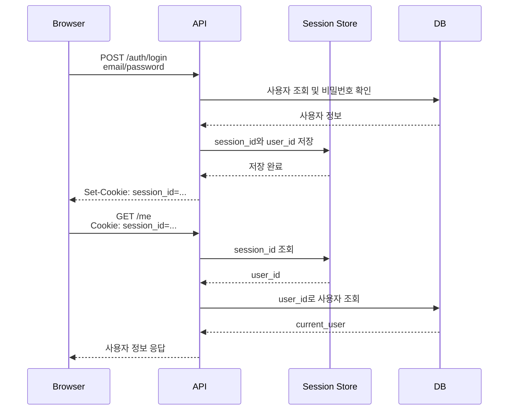
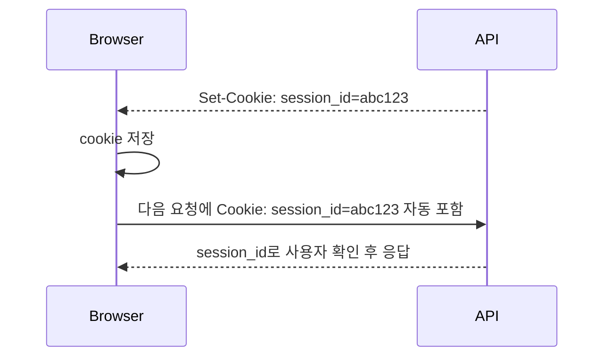
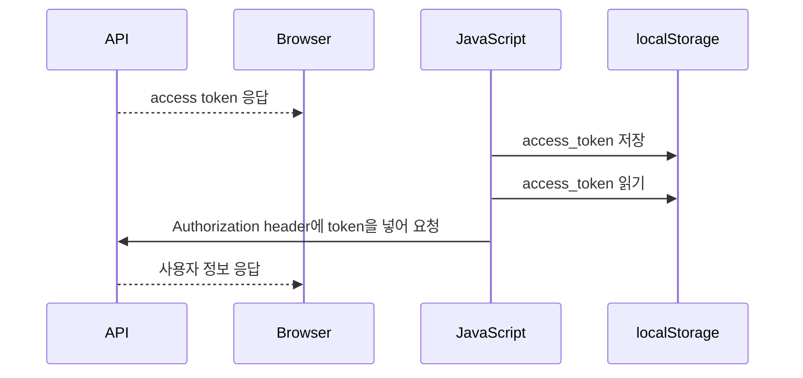
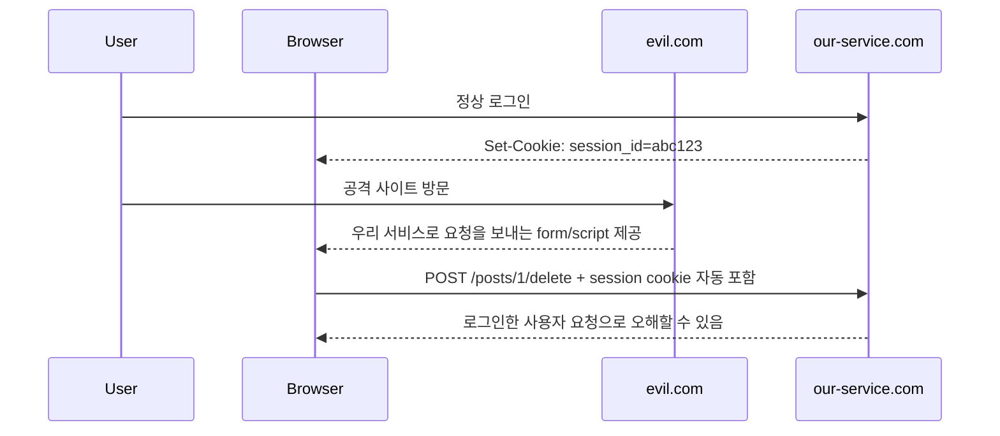

# Session 인증 방식

## Session 방식 한 줄 요약

Session 인증은 서버가 로그인 상태를 저장하고, 클라이언트는 그 상태를 찾기 위한 `session_id`만 cookie로 들고 다니는 방식입니다.

```text
서버: 이 session_id는 user_id=1이다.
브라우저: 요청마다 session_id cookie를 자동으로 보낸다.
```

## 기본 흐름

```text
1. 사용자가 이메일/비밀번호로 로그인한다.
2. 서버가 사용자를 확인한다.
3. 서버가 session 저장소에 로그인 상태를 만든다.
4. 서버가 session_id를 cookie로 내려준다.
5. 브라우저는 이후 요청마다 cookie를 자동으로 보낸다.
6. 서버는 session_id로 현재 사용자를 찾는다.
```



## 요청/응답 예시

로그인:

```http
POST /api/v1/auth/login
Content-Type: application/json

{
  "email": "a@example.com",
  "password": "password"
}
```

응답:

```http
HTTP/1.1 204 No Content
Set-Cookie: session_id=abc123; HttpOnly; Secure; SameSite=Lax; Path=/
```

이후 인증 API 호출:

```http
GET /api/v1/me
Cookie: session_id=abc123
```

## cookie란 무엇인가?

cookie는 서버가 브라우저에 저장해두라고 내려주는 작은 데이터입니다. 브라우저는 저장해둔 cookie를 조건에 맞는 요청에 자동으로 다시 붙여 보냅니다.

Session 인증에서 cookie는 로그인 상태 자체를 저장하는 곳이 아닙니다. 보통 cookie에는 서버 session 저장소에서 로그인 상태를 찾기 위한 `session_id`만 들어갑니다.

```text
cookie에 들어가는 것
- session_id=abc123

서버 session 저장소에 들어가는 것
- session_id=abc123
- user_id=1
- expires_at=...
```

즉, 브라우저는 "나는 abc123 session_id를 가지고 있다"고 알려주고, 서버는 그 session_id로 실제 사용자를 찾습니다.

## Set-Cookie와 Cookie 헤더

cookie는 HTTP header를 통해 오갑니다.

### Set-Cookie

`Set-Cookie`는 서버가 브라우저에게 cookie를 저장하라고 지시하는 응답 header입니다.

```http
Set-Cookie: session_id=abc123; HttpOnly; Secure; SameSite=Lax; Path=/
```

의미:

```text
브라우저야, session_id=abc123이라는 cookie를 저장해라.
이 cookie는 JavaScript에서 읽지 못하게 하고,
HTTPS에서만 보내고,
다른 사이트에서 온 요청에는 제한적으로만 보내라.
```

### Cookie

`Cookie`는 브라우저가 서버로 다시 보내는 요청 header입니다.

```http
Cookie: session_id=abc123
```

의미:

```text
서버야, 나는 session_id=abc123 cookie를 가지고 있다.
이 값으로 내가 누구인지 확인해라.
```

## cookie가 자동으로 붙는다는 말

브라우저는 cookie의 domain, path, SameSite, Secure 조건이 맞으면 요청에 cookie를 자동으로 붙입니다.



이 자동 전송은 편리하지만, CSRF와 연결됩니다. 사용자가 의도하지 않은 요청에도 cookie가 붙을 수 있기 때문입니다.

## cookie와 localStorage 차이

Session 인증을 이해할 때 cookie와 localStorage를 자주 비교합니다.

저장 위치와 인증 방식이 헷갈리면 먼저 [인증 방식과 저장 위치 구분하기](auth-storage-map.md)를 봅니다.

먼저 localStorage가 무엇인지부터 잡아야 합니다.

localStorage는 브라우저가 제공하는 클라이언트 측 저장소입니다. 웹 페이지의 JavaScript가 문자열 데이터를 브라우저 안에 저장하고, 나중에 다시 꺼내 쓸 수 있습니다.

```javascript
localStorage.setItem("access_token", "eyJ...");

const token = localStorage.getItem("access_token");
```

저장된 값은 같은 origin의 페이지에서 다시 접근할 수 있습니다.

```text
origin = scheme + host + port

http://localhost:5173
https://example.com
```

예를 들어 `https://example.com`에서 localStorage에 저장한 값은 같은 `https://example.com` 페이지의 JavaScript가 읽을 수 있습니다. 브라우저를 새로고침해도 남아 있고, 탭을 닫았다가 다시 열어도 보통 유지됩니다.

## 인증에서 localStorage를 쓰는 방식

localStorage는 요청에 자동으로 붙지 않습니다. JavaScript가 직접 값을 꺼내서 HTTP header에 넣어야 합니다.

```javascript
const token = localStorage.getItem("access_token");

fetch("/api/v1/me", {
  headers: {
    Authorization: `Bearer ${token}`,
  },
});
```

이 흐름을 그림으로 보면 아래와 같습니다.



반대로 cookie는 JavaScript가 직접 꺼내 header에 넣지 않아도, 조건이 맞으면 브라우저가 자동으로 요청에 붙입니다.

| 항목 | cookie | localStorage |
| --- | --- | --- |
| 저장 위치 | 브라우저 cookie 저장소 | 브라우저 localStorage 저장소 |
| 저장 형식 | key-value 문자열 + 옵션 | key-value 문자열 |
| 누가 저장하는가 | 서버가 `Set-Cookie`로 저장시킬 수 있다. JavaScript도 저장 가능하다. | JavaScript가 `localStorage.setItem()`으로 저장한다. |
| 누가 요청에 붙이는가 | 브라우저가 조건에 맞으면 자동으로 붙인다. | JavaScript가 직접 읽어서 header에 넣어야 한다. |
| 서버가 직접 설정할 수 있는가 | 응답의 `Set-Cookie` header로 가능하다. | 서버가 직접 저장시키지는 못하고, 프론트엔드 코드가 저장해야 한다. |
| JavaScript 접근 | `HttpOnly`면 접근 불가 | 같은 origin의 JavaScript가 항상 접근 가능 |
| 만료 관리 | `Max-Age`, `Expires`로 설정 가능 | 자동 만료가 없어 직접 삭제해야 한다. |
| 요청 범위 제어 | domain, path, SameSite, Secure로 제어 | 같은 origin JavaScript가 읽을 수 있다. |
| 주요 위험 | CSRF | XSS로 token 탈취 |
| 자주 쓰이는 방식 | session_id, refresh token cookie | access token 저장에 쓰이지만 보안상 주의 필요 |

핵심 차이는 이것입니다.

```text
cookie는 브라우저가 자동으로 보낸다.
localStorage는 JavaScript가 직접 꺼내서 보내야 한다.
```

그래서 cookie 기반 인증은 CSRF를, localStorage 기반 token 저장은 XSS를 특히 조심해야 합니다.

## localStorage가 XSS에 취약하다는 말

XSS는 공격자가 우리 페이지에서 악성 JavaScript를 실행시키는 공격입니다. localStorage는 JavaScript로 읽을 수 있으므로, XSS가 발생하면 저장된 token이 탈취될 수 있습니다.

```javascript
const token = localStorage.getItem("access_token");
sendToAttacker(token);
```

공격자가 access token을 가져가면, 사용자의 브라우저 밖에서도 API 요청을 보낼 수 있습니다.

```text
공격자 서버
-> Authorization: Bearer 탈취한_access_token
-> 우리 API 호출
```

반면 `HttpOnly` cookie는 JavaScript에서 읽을 수 없습니다. 그래서 XSS가 발생해도 cookie 값을 직접 훔치기는 어렵습니다. 하지만 cookie는 브라우저가 자동으로 요청에 붙이기 때문에, XSS나 CSRF 상황에서 "사용자 브라우저를 이용해 요청을 보내는 방식"은 여전히 조심해야 합니다.

정리하면:

```text
localStorage
- JavaScript가 읽을 수 있다.
- Authorization header에 직접 넣어 보낸다.
- XSS로 token이 탈취될 수 있다.

HttpOnly cookie
- JavaScript가 읽을 수 없다.
- 브라우저가 자동으로 요청에 붙인다.
- CSRF 대응이 필요하다.
```

## CSRF란 무엇인가?

CSRF는 Cross-Site Request Forgery의 줄임말입니다. 한국어로는 사이트 간 요청 위조라고 부릅니다.

핵심은 "사용자가 로그인된 상태를 악용해서, 사용자가 의도하지 않은 요청을 보내게 만드는 공격"입니다.

예를 들어 사용자가 우리 서비스에 로그인되어 있고, 브라우저에 `session_id` cookie가 저장되어 있다고 가정합니다.

```text
사용자 브라우저
- 우리 서비스 session cookie를 가지고 있음
- 우리 서비스에 요청을 보내면 cookie가 자동으로 붙음
```

이때 사용자가 공격자가 만든 사이트에 들어갔고, 그 사이트가 아래와 같은 요청을 몰래 보내게 만들면 문제가 됩니다.

```html
<form action="https://our-service.com/api/v1/posts/1/delete" method="POST">
  <button>무료 쿠폰 받기</button>
</form>
```

사용자가 이 버튼을 누르면 브라우저는 `our-service.com`으로 요청을 보냅니다. 그리고 cookie 조건이 맞으면 우리 서비스 session cookie도 자동으로 붙을 수 있습니다.

```text
공격자는 사용자의 비밀번호나 session_id를 몰라도 된다.
브라우저가 이미 가지고 있는 cookie를 자동으로 붙여 보내는 성질을 이용한다.
```



## CSRF가 성립하려면 필요한 조건

CSRF는 보통 아래 조건이 맞을 때 문제가 됩니다.

1. 사용자가 공격 대상 서비스에 로그인되어 있다.
2. 인증 정보가 cookie처럼 자동으로 요청에 포함된다.
3. 서버가 요청의 출처나 의도를 충분히 확인하지 않는다.
4. 해당 요청이 서버 상태를 바꾼다.

특히 위험한 요청은 보통 조회보다 변경 요청입니다.

```text
상대적으로 덜 위험한 요청
- GET /posts
- GET /me

위험한 요청
- POST /posts
- PATCH /posts/1
- DELETE /posts/1
- POST /payment
- POST /auth/change-password
```

GET 요청도 민감한 정보를 반환한다면 조심해야 하지만, CSRF에서 특히 중요한 것은 "사용자 의도 없이 서버 상태가 바뀌는 요청"입니다.

## CSRF와 XSS의 차이

CSRF와 XSS는 둘 다 웹 보안에서 자주 나오지만 공격 방식이 다릅니다.

| 개념 | 공격자가 노리는 것 | 핵심 위험 |
| --- | --- | --- |
| CSRF | 브라우저가 cookie를 자동으로 보내는 성질 | 사용자가 원치 않은 요청이 인증된 요청처럼 처리됨 |
| XSS | 페이지에서 악성 JavaScript 실행 | token 탈취, 사용자 대신 API 호출, 화면 변조 |

간단히 말하면:

```text
CSRF
공격자가 cookie를 직접 훔치지 않아도,
브라우저가 cookie를 붙여 요청하게 만든다.

XSS
공격자가 우리 페이지 안에서 JavaScript를 실행시켜
token이나 사용자 입력을 훔치거나 직접 API를 호출한다.
```

## CSRF를 줄이는 방법

Session cookie를 쓴다면 아래 대응을 같이 고려해야 합니다.

| 방법 | 의미 |
| --- | --- |
| `SameSite` cookie | 다른 사이트에서 시작된 요청에 cookie가 붙는 범위를 줄인다. |
| CSRF token | 서버가 발급한 예측 불가능한 값을 form/header에 포함하게 해서 진짜 화면에서 온 요청인지 확인한다. |
| custom header 요구 | 브라우저의 단순 form 요청만으로는 만들기 어려운 header를 요구한다. |
| CORS origin 제한 | 허용한 origin에서 온 브라우저 요청만 받도록 제한한다. |
| 중요한 요청 재인증 | 비밀번호 변경, 결제 같은 요청은 추가 확인을 요구한다. |

주의할 점은 CORS만으로 CSRF가 완전히 해결되는 것은 아니라는 점입니다. CORS는 브라우저가 응답을 읽을 수 있는지를 통제하는 성격이 강하고, cookie 기반 상태 변경 요청 자체를 어떻게 막을지는 별도로 봐야 합니다.

## 코드 흐름 예시

실제 구현은 라이브러리나 저장소에 따라 달라지지만, 구조는 보통 아래와 같습니다.

```python
from fastapi import Cookie, HTTPException, Response, status


def create_session(user_id: int) -> str:
    session_id = make_random_token()
    save_session(session_id=session_id, user_id=user_id)
    return session_id


@router.post("/auth/login", status_code=204)
def login(payload: LoginRequest, response: Response) -> None:
    user = authenticate_user(payload.email, payload.password)
    if user is None:
        raise HTTPException(status_code=401, detail="Invalid credentials")

    session_id = create_session(user.id)
    response.set_cookie(
        key="session_id",
        value=session_id,
        httponly=True,
        secure=True,
        samesite="lax",
    )
```

현재 사용자 조회:

```python
def get_current_user(
    session_id: str | None = Cookie(default=None),
) -> User:
    if session_id is None:
        raise HTTPException(status_code=401, detail="Not authenticated")

    session = find_session(session_id)
    if session is None:
        raise HTTPException(status_code=401, detail="Invalid session")

    return find_user(session.user_id)
```

인증이 필요한 API:

```python
@router.get("/me")
def me(current_user: User = Depends(get_current_user)) -> UserRead:
    return UserRead.model_validate(current_user)
```

## session 저장소

session은 서버 어딘가에 저장되어야 합니다.

| 저장소 | 특징 | 주의점 |
| --- | --- | --- |
| 메모리 | 가장 단순하다. | 서버 재시작 시 사라지고, 서버 여러 대에서 공유가 어렵다. |
| DB | 구현과 조회가 명확하다. | 요청마다 DB 조회가 늘 수 있다. |
| Redis | session 저장소로 많이 쓴다. TTL 관리가 쉽다. | Redis 운영이 필요하다. |

실제 서비스에서는 Redis를 session 저장소로 쓰는 경우가 많습니다. 이유는 단순히 "캐싱이라서 빠르다"만은 아닙니다. 더 정확히는 Redis가 빠른 중앙 session store 역할을 하기 좋기 때문입니다.

Redis를 자주 쓰는 이유:

- 메모리 기반이라 session 조회가 빠르다.
- key별 TTL을 줄 수 있어 session 만료 관리가 쉽다.
- 서버가 여러 대여도 같은 Redis를 보면 로그인 상태를 공유할 수 있다.
- 로그아웃이나 강제 만료가 필요할 때 session key를 지우면 된다.

예를 들어 Redis에는 이런 형태로 저장할 수 있습니다.

```text
key: session:abc123
value: { "user_id": 1 }
TTL: 30분
```

브라우저 cookie에는 여전히 `session_id=abc123`만 들어갑니다. 실제 로그인 상태는 Redis에 있습니다.

```text
브라우저 cookie
-> session_id=abc123

Redis
-> session:abc123 = user_id=1
```

학습 단계에서는 DB session table이나 단순 in-memory 저장소로 흐름을 이해해도 충분합니다. 실서비스에 가까운 구조를 생각할 때 Redis를 session store 후보로 올리면 됩니다.

학습 단계에서는 DB session table로 이해해도 충분합니다.

```text
sessions
- id
- session_id
- user_id
- expires_at
- created_at
```

## cookie 옵션

Session 방식에서 cookie 설정은 보안상 중요합니다.

| 옵션 | 의미 |
| --- | --- |
| `HttpOnly` | JavaScript에서 cookie를 읽지 못하게 한다. XSS로 인한 탈취 위험을 줄인다. |
| `Secure` | HTTPS에서만 cookie를 보내게 한다. |
| `SameSite=Lax` | 다른 사이트에서 온 요청에 cookie가 자동으로 붙는 상황을 줄인다. |
| `Path=/` | cookie가 적용될 경로를 정한다. |
| `Max-Age` / `Expires` | session cookie 만료 시간을 정한다. |

## 장점

- 서버가 session을 지우면 즉시 로그아웃시킬 수 있다.
- 브라우저 cookie 기반 서비스와 자연스럽게 맞는다.
- token 내용을 클라이언트가 직접 관리하지 않아도 된다.

## 단점

- 서버가 session 저장소를 운영해야 한다.
- 서버 여러 대를 쓰면 session 공유 전략이 필요하다.
- cookie 기반이라 CSRF 대응을 함께 봐야 한다.

## 팀 기본값 후보

```text
브라우저 중심 서비스이고, 서버에서 로그인 상태를 쉽게 끊어야 한다면 Session 방식이 단순할 수 있다.
다만 CSRF 대응과 session 저장소를 함께 설계해야 한다.
```

## 체크 질문

- Session 방식에서 서버가 저장하는 것은 무엇인가?
- 클라이언트가 들고 다니는 것은 무엇인가?
- `HttpOnly` cookie는 왜 필요한가?
- Session 방식에서 CSRF를 왜 신경 써야 하는가?
- session을 DB에 저장하면 어떤 table이 필요할까?
