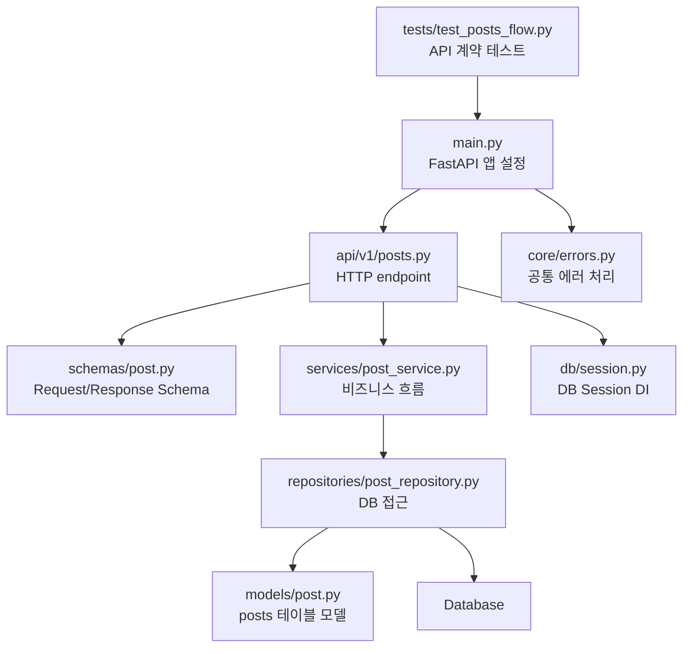
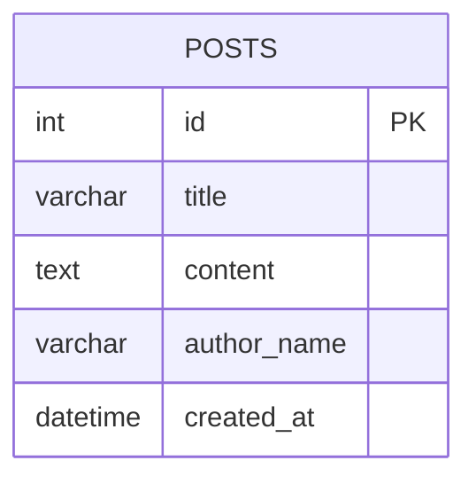
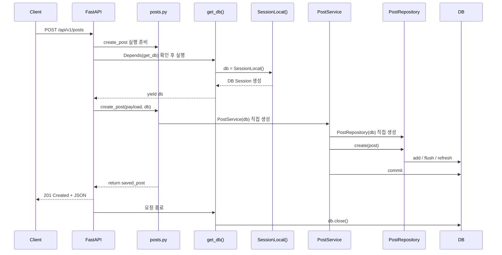
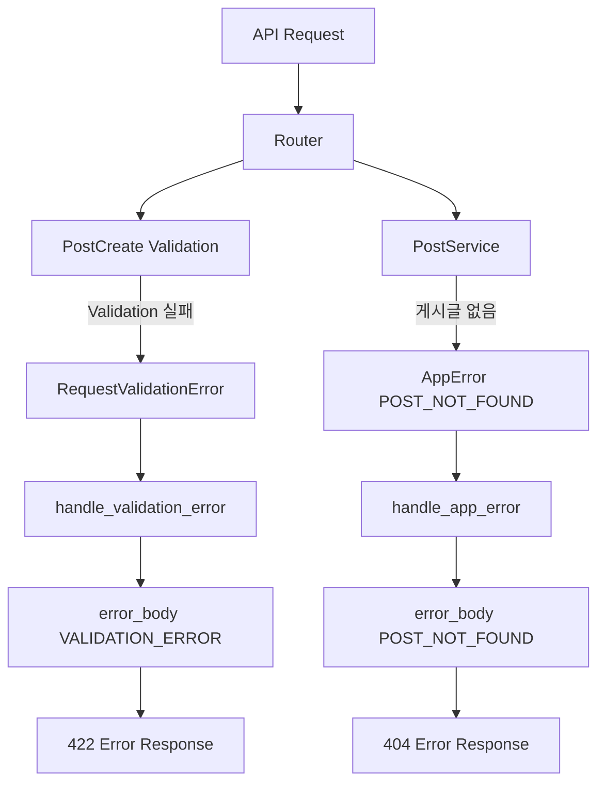
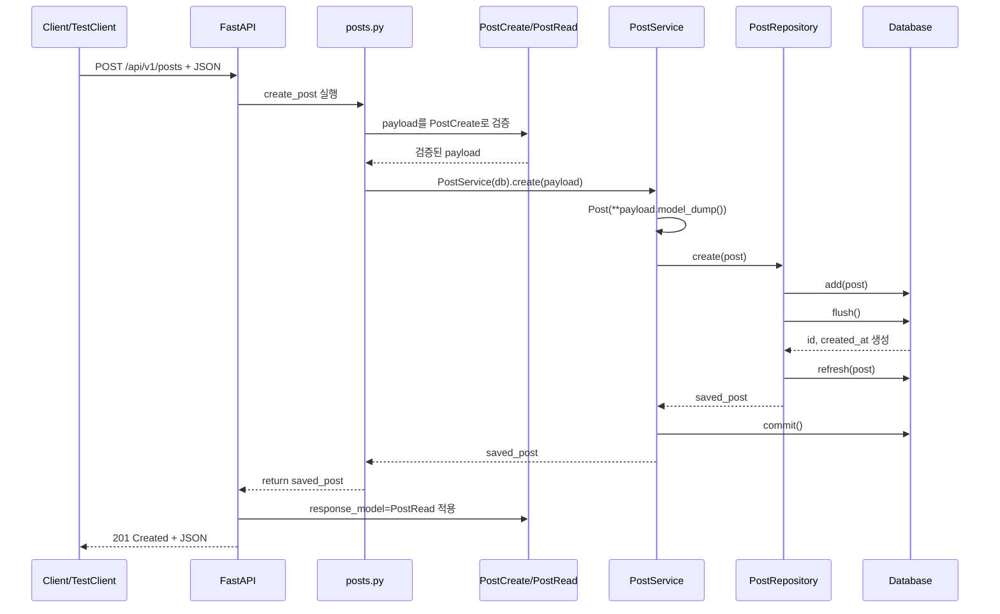

# 프로젝트 코드로 이해하는 백엔드 API 흐름

## 목차

1. 이 프로젝트는 무엇을 학습하기 위한 예제인가?
2. 전체 폴더 구조 한눈에 보기
3. 요청은 어디로 들어오는가? - `main.py`
4. API 경로는 어디서 정의되는가? - `api/v1/posts.py`
5. 요청 데이터는 어디서 검증되는가? - `schemas/post.py`
6. 비즈니스 흐름은 어디에 있는가? - `services/post_service.py`
7. DB 접근은 어디서 일어나는가? - `repositories/post_repository.py`
8. DB 테이블 구조는 어디에 정의되는가? - `models/post.py`
9. DB 세션과 DI는 어떻게 연결되는가? - `db/session.py`
10. 에러 응답은 어디서 공통 처리되는가? - `core/errors.py`
11. API 계약은 어떻게 테스트되는가? - `tests/test_posts_flow.py`
12. 게시글 생성 요청 전체 흐름 따라가기
13. 게시글 조회 실패 흐름 따라가기
14. 이 프로젝트 코드에서 배울 수 있는 핵심 개념
15. 현재 프로젝트에 아직 없는 개념과 다음 확장 방향
16. 결론

---

## 1. 이 프로젝트는 무엇을 학습하기 위한 예제인가?

이 프로젝트는 큰 서비스를 만들기 전에, 백엔드 API의 기본 흐름을 작은 `posts` API로 확인하기 위한 학습용 예제입니다.

핵심 질문은 하나입니다.

> 클라이언트가 API 요청을 보냈을 때, 그 요청은 백엔드 안에서 어떤 파일들을 지나 DB에 저장되고 다시 응답으로 돌아오는가?

현재 구현된 기능은 게시글 생성, 게시글 목록 조회, 게시글 단건 조회입니다. 기능은 작지만 백엔드의 기본 구성 요소가 모두 들어 있습니다.

```text
클라이언트 요청
-> FastAPI 앱
-> Router
-> Schema / Validation
-> Service
-> Repository
-> Model / Database
-> Response Schema
-> 클라이언트 응답
```

이 문서는 개념을 먼저 설명하지 않습니다. 대신 프로젝트 파일을 먼저 따라갑니다. 코드를 읽고 나서, 그 코드가 REST API, HTTP Method, Schema, Validation, DI, Service Layer, Repository Pattern, ORM, Error Response, API Contract Test 중 어떤 개념과 연결되는지 정리합니다.

### 연결되는 개념

- REST API
- API 계약
- Request / Response Schema
- Validation
- DI
- Service Layer
- Repository Pattern
- ORM
- Error Response
- API Contract Test

### 현재 구조의 한계와 확장 방향

현재 프로젝트는 `Post` 단일 도메인을 다룹니다. 따라서 인증/인가, 사용자와 게시글의 FK 관계, 댓글, 태그, 첨부파일, 복잡한 Transaction, 실제 프론트엔드 상태 관리는 아직 명확히 드러나지 않습니다.

---

## 2. 전체 폴더 구조 한눈에 보기

### 프로젝트 코드

```text
backend/app/main.py
backend/app/api/v1/posts.py
backend/app/schemas/post.py
backend/app/services/post_service.py
backend/app/repositories/post_repository.py
backend/app/models/post.py
backend/app/db/session.py
backend/app/db/base.py
backend/app/core/errors.py
backend/tests/test_posts_flow.py
```

### 코드 해설

- `backend/app/main.py`: FastAPI 앱을 생성하고 라우터와 에러 핸들러를 등록하는 엔트리 포인트입니다.
- `backend/app/api/v1/posts.py`: 게시글 API endpoint를 정의합니다. `POST`, `GET` 같은 HTTP Method가 이 파일에서 드러납니다.
- `backend/app/schemas/post.py`: 요청과 응답 데이터 구조를 정의합니다. `PostCreate`는 Request Schema, `PostRead`는 Response Schema입니다.
- `backend/app/services/post_service.py`: 게시글 생성, 목록 조회, 단건 조회의 비즈니스 흐름을 담당합니다.
- `backend/app/repositories/post_repository.py`: SQLAlchemy를 사용해 실제 DB 저장/조회 작업을 담당합니다.
- `backend/app/models/post.py`: `posts` 테이블 구조를 ORM 모델로 정의합니다.
- `backend/app/db/session.py`: DB engine, session factory, `get_db()` provider를 정의합니다.
- `backend/app/core/errors.py`: 공통 에러 응답 형식과 에러 핸들러를 정의합니다.
- `backend/tests/test_posts_flow.py`: API가 계약대로 동작하는지 검증하는 테스트입니다.

### 프로젝트 파일 역할 구조도



### 연결되는 개념

이 구조는 계층 분리를 보여줍니다. 라우터는 HTTP 요청을 받고, 서비스는 비즈니스 흐름을 담당하고, 레포지토리는 DB 접근을 담당합니다. Schema는 요청/응답 계약을 담당하고, Error Handler는 실패 응답 계약을 담당합니다.

### 현재 구조의 한계와 확장 방향

현재는 작은 예제라 계층이 다소 얇습니다. 기능이 늘어나면 `users`, `comments`, `auth`, `files`처럼 도메인별 라우터, 서비스, 레포지토리, 모델이 추가될 수 있습니다.

---

## 3. 요청은 어디로 들어오는가? - `main.py`

### 프로젝트 코드

```python
# backend/app/main.py
@asynccontextmanager
async def lifespan(_: FastAPI) -> AsyncIterator[None]:
    Base.metadata.create_all(bind=engine)
    yield


app = FastAPI(title="Sprint 1 API Data Flow", lifespan=lifespan)
register_error_handlers(app)
app.include_router(posts_router, prefix="/api/v1")
```

### 코드 해설

- `lifespan(...)`: 서버가 시작되고 종료될 때 실행할 로직을 정의합니다.
- `Base.metadata.create_all(bind=engine)`: SQLAlchemy 모델 정보를 바탕으로 DB 테이블을 생성합니다. 학습용 프로젝트라 서버 시작 시 테이블을 준비합니다.
- `app = FastAPI(...)`: FastAPI 애플리케이션 객체를 생성합니다. 이 객체가 API 서버의 중심입니다.
- `title="Sprint 1 API Data Flow"`: 자동 API 문서에 표시되는 이름입니다.
- `register_error_handlers(app)`: 공통 에러 핸들러를 FastAPI 앱에 등록합니다.
- `app.include_router(posts_router, prefix="/api/v1")`: `posts_router`에 정의된 endpoint를 `/api/v1` 아래에 붙입니다.

예를 들어 `posts_router` 내부의 prefix가 `/posts`라면 실제 API 경로는 다음처럼 조합됩니다.

```text
/api/v1 + /posts = /api/v1/posts
```

### 연결되는 개념

이 파일은 API 서버 설정과 라우터 등록을 보여줍니다. `include_router`는 여러 API 묶음을 하나의 FastAPI 앱에 연결하는 방식입니다. 여기서 `/api/v1` prefix를 붙였기 때문에 API versioning의 기본 형태도 확인할 수 있습니다.

또한 `register_error_handlers(app)`는 Error Response를 프로젝트 전체에서 일관되게 만들기 위한 시작점입니다.

### 현재 구조의 한계와 확장 방향

현재는 `posts_router` 하나만 등록되어 있습니다. 실무 프로젝트라면 다음처럼 여러 라우터가 붙을 수 있습니다.

```text
/api/v1/users
/api/v1/posts
/api/v1/comments
/api/v1/auth
```

이 프로젝트에서는 아직 인증/인가 미들웨어, CORS 설정, 로깅 미들웨어, 환경별 설정 분리는 명확히 드러나지 않습니다.

---

## 4. API 경로는 어디서 정의되는가? - `api/v1/posts.py`

### 프로젝트 코드

```python
# backend/app/api/v1/posts.py
router = APIRouter(prefix="/posts", tags=["posts"])


@router.post("", response_model=PostRead, status_code=status.HTTP_201_CREATED)
def create_post(payload: PostCreate, db: Session = Depends(get_db)) -> PostRead:
    return PostService(db).create(payload)


@router.get("", response_model=list[PostRead])
def list_posts(db: Session = Depends(get_db)) -> list[PostRead]:
    return PostService(db).list()


@router.get("/{post_id}", response_model=PostRead)
def get_post(post_id: int, db: Session = Depends(get_db)) -> PostRead:
    return PostService(db).get(post_id)
```

### 코드 해설

- `router = APIRouter(prefix="/posts", tags=["posts"])`: 게시글 관련 endpoint를 하나의 라우터로 묶습니다.
- `prefix="/posts"`: 이 라우터의 모든 API가 게시글 자원과 관련 있음을 나타냅니다.
- `@router.post("")`: `POST /posts` 요청을 처리합니다. `main.py`의 `/api/v1`과 합쳐져 실제 경로는 `POST /api/v1/posts`입니다.
- `response_model=PostRead`: 성공 응답을 `PostRead` schema 모양으로 내보냅니다.
- `status_code=status.HTTP_201_CREATED`: 게시글 생성 성공 시 `201 Created`를 반환합니다.
- `payload: PostCreate`: 클라이언트가 보낸 JSON body를 `PostCreate`로 검증하고 함수에 전달합니다.
- `db: Session = Depends(get_db)`: FastAPI DI를 사용해 DB 세션을 주입받습니다.
- `@router.get("")`: 게시글 목록 조회 API입니다.
- `@router.get("/{post_id}")`: 특정 게시글 단건 조회 API입니다. `{post_id}`는 URL path parameter입니다.

### 연결되는 개념

이 파일은 REST API와 HTTP Method가 코드에서 어떻게 표현되는지 보여줍니다.

```text
POST /api/v1/posts      -> 게시글 생성
GET /api/v1/posts       -> 게시글 목록 조회
GET /api/v1/posts/{id}  -> 게시글 단건 조회
```

URL은 `posts`라는 자원을 나타내고, `POST`, `GET`은 그 자원에 대한 동작을 나타냅니다.

라우터는 애플리케이션 코드에서 요청 처리의 시작점이면서, 서비스 결과가 다시 돌아와 `return`되는 마무리 지점이기도 합니다. 다만 최종 HTTP 응답 변환과 전송은 FastAPI 프레임워크가 수행합니다.

### 현재 구조의 한계와 확장 방향

현재는 `POST`와 `GET`만 있습니다. 게시글 수정과 삭제가 추가되면 다음 endpoint가 생길 수 있습니다.

```text
PATCH /api/v1/posts/{post_id}
DELETE /api/v1/posts/{post_id}
```

또한 현재 라우터에서 `PostService(db)`를 직접 생성합니다. 더 DI를 적극적으로 쓰는 구조라면 `PostService` 자체도 dependency로 주입할 수 있습니다.

---

## 5. 요청 데이터는 어디서 검증되는가? - `schemas/post.py`

### 프로젝트 코드

```python
# backend/app/schemas/post.py
class PostCreate(BaseModel):
    title: str = Field(min_length=1, max_length=120)
    content: str = Field(min_length=1)
    author_name: str = Field(default="anonymous", min_length=1, max_length=40)


class PostRead(BaseModel):
    model_config = ConfigDict(from_attributes=True)

    id: int
    title: str
    content: str
    author_name: str
    created_at: datetime
```

### 코드 해설

- `class PostCreate(BaseModel)`: 게시글 생성 요청에 사용하는 Request Schema입니다.
- `title: str`: 제목은 문자열이어야 합니다.
- `Field(min_length=1, max_length=120)`: 제목은 비어 있으면 안 되고 120자를 넘으면 안 됩니다.
- `content: str = Field(min_length=1)`: 본문도 비어 있으면 안 됩니다.
- `author_name: str = Field(default="anonymous", ...)`: 작성자 이름이 없으면 `anonymous`를 기본값으로 사용합니다.
- `class PostRead(BaseModel)`: 게시글 응답에 사용하는 Response Schema입니다.
- `model_config = ConfigDict(from_attributes=True)`: SQLAlchemy 모델 객체의 속성을 읽어 Pydantic 응답 객체로 변환할 수 있게 합니다.
- `id: int`: DB에 저장된 뒤 생성되는 게시글 식별자입니다.
- `created_at: datetime`: 서버가 생성한 게시글 작성 시각입니다.

### 연결되는 개념

`PostCreate`는 Request Schema이자 validation 진입점입니다.

라우터에서 다음처럼 사용됩니다.

```python
def create_post(payload: PostCreate, db: Session = Depends(get_db)) -> PostRead:
```

클라이언트가 보낸 JSON이 `PostCreate` 조건을 만족하지 않으면 라우터 함수의 본문이 실행되기 전에 FastAPI/Pydantic validation이 실패합니다.

`PostRead`는 Response Schema입니다.

라우터에서 다음처럼 사용됩니다.

```python
@router.post("", response_model=PostRead, status_code=status.HTTP_201_CREATED)
```

서비스가 DB 모델 객체를 반환하더라도 FastAPI는 `response_model=PostRead`를 보고 응답 모양을 정리합니다.

### 현재 구조의 한계와 확장 방향

현재 schema는 단순한 필드 길이 검증만 포함합니다. 실무에서는 이메일 형식, enum 값, 날짜 범위, 중복 여부, 권한 여부 같은 검증이 추가될 수 있습니다.

다만 중복 여부나 권한 검사는 단순 schema validation이 아니라 DB 조회나 현재 로그인 사용자 정보가 필요한 비즈니스 validation에 가깝습니다. 그런 검증은 보통 service 계층에서 처리합니다.

---

## 6. 비즈니스 흐름은 어디에 있는가? - `services/post_service.py`

### 프로젝트 코드

```python
# backend/app/services/post_service.py
class PostService:
    def __init__(self, db: Session) -> None:
        self.db = db
        self.posts = PostRepository(db)

    def create(self, payload: PostCreate) -> Post:
        post = Post(**payload.model_dump())
        saved_post = self.posts.create(post)
        self.db.commit()
        return saved_post

    def get(self, post_id: int) -> Post:
        post = self.posts.get(post_id)
        if post is None:
            raise AppError(
                code="POST_NOT_FOUND",
                message="게시글을 찾을 수 없습니다.",
                status_code=status.HTTP_404_NOT_FOUND,
                details={"post_id": post_id},
            )
        return post
```

### 코드 해설

- `class PostService`: 게시글 관련 비즈니스 흐름을 담당하는 클래스입니다.
- `self.db = db`: 라우터에서 받은 DB 세션을 서비스 내부에 보관합니다.
- `self.posts = PostRepository(db)`: 게시글 DB 접근을 담당할 repository 객체를 생성합니다.
- `post = Post(**payload.model_dump())`: 요청 schema인 `PostCreate`를 DB 모델인 `Post` 객체로 변환합니다.
- `self.posts.create(post)`: 실제 DB 저장 작업은 repository에 맡깁니다.
- `self.db.commit()`: 게시글 생성 작업을 DB에 확정합니다.
- `self.posts.get(post_id)`: 특정 게시글을 DB에서 조회합니다.
- `if post is None`: 게시글이 없을 때의 비즈니스 판단입니다.
- `raise AppError(...)`: 게시글이 없다는 상황을 공통 에러 처리 흐름으로 넘깁니다.

### 연결되는 개념

이 파일은 Service Layer를 보여줍니다. Service Layer는 라우터와 DB 접근 코드 사이에서 비즈니스 흐름을 표현합니다.

라우터가 HTTP 요청과 응답 규칙을 담당한다면, 서비스는 "게시글 생성이란 무엇을 해야 하는 작업인가?"를 담당합니다.

현재 `create()`에서는 다음 흐름이 들어 있습니다.

```text
Request Schema
-> DB Model 변환
-> Repository 저장
-> commit
-> 저장 결과 반환
```

`get()`에서는 "없는 게시글이면 404 에러로 처리한다"는 비즈니스 판단이 들어 있습니다.

### 현재 구조의 한계와 확장 방향

현재 service는 단순합니다. 실무에서는 이 계층에 다음 흐름이 추가될 수 있습니다.

- 현재 로그인 사용자 확인
- 게시글 작성 권한 확인
- 첨부파일 메타데이터 저장
- 태그 연결
- 알림 생성
- 여러 테이블 변경을 하나의 Transaction으로 묶기

또한 현재 `PostRepository(db)`는 service 내부에서 직접 생성합니다. 테스트하기 더 쉬운 구조를 원한다면 repository를 외부에서 주입받도록 바꿀 수 있습니다.

---

## 7. DB 접근은 어디서 일어나는가? - `repositories/post_repository.py`

### 프로젝트 코드

```python
# backend/app/repositories/post_repository.py
class PostRepository:
    def __init__(self, db: Session) -> None:
        self.db = db

    def create(self, post: Post) -> Post:
        self.db.add(post)
        self.db.flush()
        self.db.refresh(post)
        return post

    def list(self) -> list[Post]:
        statement = select(Post).order_by(Post.created_at.desc())
        return list(self.db.scalars(statement))

    def get(self, post_id: int) -> Post | None:
        return self.db.get(Post, post_id)
```

### 코드 해설

- `class PostRepository`: 게시글 DB 접근을 담당하는 클래스입니다.
- `self.db = db`: SQLAlchemy 세션을 보관합니다.
- `self.db.add(post)`: 새 게시글 객체를 DB 세션에 추가합니다.
- `self.db.flush()`: 변경 내용을 DB에 보내고, 생성된 PK 같은 값을 받을 수 있게 합니다. 아직 최종 commit은 아닙니다.
- `self.db.refresh(post)`: DB에 저장된 최신 값을 객체에 다시 반영합니다.
- `select(Post).order_by(Post.created_at.desc())`: 게시글을 생성 시각 기준 최신순으로 조회하는 SQLAlchemy 쿼리입니다.
- `self.db.scalars(statement)`: 쿼리 결과에서 `Post` 객체들을 가져옵니다.
- `self.db.get(Post, post_id)`: PK를 기준으로 게시글 하나를 조회합니다.

### 연결되는 개념

이 파일은 Repository Pattern과 ORM을 보여줍니다.

Repository Pattern은 DB 접근 코드를 한곳에 모아 서비스가 SQLAlchemy 세부 문법을 몰라도 되게 만드는 구조입니다.

ORM(Object Relational Mapping)은 Python 클래스와 DB 테이블을 연결해 객체처럼 DB 데이터를 다루게 해주는 방식입니다. 여기서는 SQLAlchemy가 ORM 역할을 합니다.

### 현재 구조의 한계와 확장 방향

현재 repository는 기본 CRUD 일부만 다룹니다. 실무에서는 다음 메서드가 추가될 수 있습니다.

- `update(...)`
- `delete(...)`
- `find_by_author(...)`
- `find_with_comments(...)`
- `exists_by_id(...)`

또한 복잡한 검색 조건, pagination, join, locking이 들어가면 repository의 책임이 더 중요해집니다.

---

## 8. DB 테이블 구조는 어디에 정의되는가? - `models/post.py`

### 프로젝트 코드

```python
# backend/app/models/post.py
class Post(Base):
    __tablename__ = "posts"
    __table_args__ = (Index("ix_posts_created_at", "created_at"),)

    id: Mapped[int] = mapped_column(primary_key=True, index=True)
    title: Mapped[str] = mapped_column(String(120), nullable=False)
    content: Mapped[str] = mapped_column(Text, nullable=False)
    author_name: Mapped[str] = mapped_column(String(40), nullable=False, default="anonymous")
    created_at: Mapped[datetime] = mapped_column(DateTime, nullable=False, default=datetime.utcnow)
```

### 코드 해설

- `class Post(Base)`: SQLAlchemy ORM 모델입니다. DB의 `posts` 테이블과 연결됩니다.
- `__tablename__ = "posts"`: 실제 테이블 이름을 지정합니다.
- `__table_args__ = (...)`: 테이블 수준의 추가 설정을 넣습니다.
- `Index("ix_posts_created_at", "created_at")`: `created_at` 컬럼에 index를 생성합니다.
- `id`: 게시글의 Primary Key입니다.
- `primary_key=True`: 이 컬럼이 각 행을 고유하게 식별한다는 뜻입니다.
- `title`: 최대 120자의 문자열 컬럼입니다.
- `nullable=False`: DB에 `NULL` 값을 허용하지 않습니다.
- `content`: 긴 본문 저장을 위한 `Text` 컬럼입니다.
- `author_name`: 현재는 작성자를 문자열로 저장합니다.
- `created_at`: 생성 시각을 저장합니다. 기본값은 `datetime.utcnow`입니다.

### 연결되는 개념

이 파일은 ERD, PK, Index, ORM과 연결됩니다.

ERD로 표현하면 현재 프로젝트에는 `posts` 테이블 하나가 있습니다.



`id`는 PK이고, `created_at`에는 index가 있습니다. 최신순 목록 조회가 있으므로 `created_at` index는 조회 성능과 연결됩니다.

### 현재 구조의 한계와 확장 방향

현재는 `users` 테이블이 없기 때문에 `author_name`이 단순 문자열입니다. 실제 서비스에서 작성자 계정이 필요해지면 다음 구조가 더 자연스럽습니다.

```text
users.id
posts.user_id -> users.id
```

이렇게 바뀌면 `users`와 `posts`는 1:N 관계가 됩니다. 현재 프로젝트에서는 FK 관계, 1:N 관계, N:M 관계가 아직 명확히 드러나지 않습니다.

---

## 9. DB 세션과 DI는 어떻게 연결되는가? - `db/session.py`

### 프로젝트 코드

```python
# backend/app/db/session.py
engine = create_engine(settings.database_url)
SessionLocal = sessionmaker(bind=engine, autoflush=False, autocommit=False)


def get_db() -> Generator[Session, None, None]:
    db = SessionLocal()
    try:
        yield db
    finally:
        db.close()
```

### 코드 해설

- `engine = create_engine(settings.database_url)`: DB 연결 엔진을 생성합니다.
- `SessionLocal = sessionmaker(...)`: DB 세션을 만들어내는 factory를 정의합니다.
- `autoflush=False`: 자동 flush를 끕니다.
- `autocommit=False`: 자동 commit을 끕니다. 변경 사항은 명시적으로 `commit()`해야 확정됩니다.
- `def get_db()`: FastAPI DI에서 사용할 provider 함수입니다.
- `db = SessionLocal()`: 실제 DB 세션 객체를 생성합니다.
- `yield db`: 생성한 DB 세션을 라우터 함수에 주입할 수 있게 FastAPI에 넘깁니다.
- `finally: db.close()`: 요청 처리가 끝난 뒤 DB 세션을 닫습니다.

### DI 포함 요청 처리 흐름도



### 연결되는 개념

이 파일은 DI(Dependency Injection, 의존성 주입)와 DB session lifecycle을 보여줍니다.

DI의 핵심은 "사용하는 곳이 직접 만들지 않고, 바깥에서 넣어준다"는 점입니다. 라우터 함수는 `db = SessionLocal()`을 직접 실행하지 않습니다.

라우터에는 이렇게 선언되어 있습니다.

```python
db: Session = Depends(get_db)
```

FastAPI는 이 선언을 보고 `get_db()`를 실행합니다. 객체 생성 자체는 `get_db()` 안의 `db = SessionLocal()`에서 일어납니다. FastAPI는 생성된 `db`를 라우터 함수의 `db` 파라미터에 넣어줍니다.

중요한 점은 현재 프로젝트에서 DI가 적용된 부분과 직접 생성되는 부분이 섞여 있다는 것입니다.

```text
DI로 주입되는 것: db Session
직접 생성되는 것: PostService(db), PostRepository(db)
```

### 현재 구조의 한계와 확장 방향

현재는 DB 세션만 `Depends(get_db)`로 주입합니다. 더 테스트하기 쉬운 구조를 원한다면 `PostService`나 `PostRepository`도 provider 함수로 만들 수 있습니다.

또한 실무에서는 요청 중 예외가 발생했을 때 rollback을 어디서 처리할지 명확히 정해야 합니다. 현재 코드는 생성 성공 시 service에서 `commit()`하지만, 공통 rollback 처리 구조는 아직 명확히 드러나지 않습니다.

---

## 10. 에러 응답은 어디서 공통 처리되는가? - `core/errors.py`

### 프로젝트 코드

```python
# backend/app/core/errors.py
class AppError(Exception):
    def __init__(
        self,
        code: str,
        message: str,
        status_code: int,
        details: dict[str, Any] | None = None,
    ) -> None:
        self.code = code
        self.message = message
        self.status_code = status_code
        self.details = details or {}


def error_body(code: str, message: str, details: Any = None) -> dict[str, Any]:
    return {
        "error": {
            "code": code,
            "message": message,
            "details": details or {},
        }
    }
```

```python
# backend/app/core/errors.py
def register_error_handlers(app: FastAPI) -> None:
    @app.exception_handler(AppError)
    def handle_app_error(_: Request, exc: AppError) -> JSONResponse:
        return JSONResponse(
            status_code=exc.status_code,
            content=error_body(exc.code, exc.message, exc.details),
        )

    @app.exception_handler(RequestValidationError)
    def handle_validation_error(_: Request, exc: RequestValidationError) -> JSONResponse:
        return JSONResponse(
            status_code=status.HTTP_422_UNPROCESSABLE_ENTITY,
            content=error_body("VALIDATION_ERROR", "Invalid request", exc.errors()),
        )
```

### 코드 해설

- `class AppError(Exception)`: 프로젝트에서 직접 발생시키는 애플리케이션 에러입니다.
- `code`: 프론트엔드가 분기 처리할 수 있는 에러 코드입니다.
- `message`: 사람이 읽을 수 있는 대표 메시지입니다.
- `status_code`: HTTP 상태 코드입니다.
- `details`: 추가 에러 정보입니다.
- `error_body(...)`: 모든 에러 응답을 같은 JSON 구조로 감싸는 함수입니다.
- `@app.exception_handler(AppError)`: `AppError`가 발생했을 때 실행할 핸들러를 등록합니다.
- `@app.exception_handler(RequestValidationError)`: FastAPI/Pydantic validation 실패를 처리하는 핸들러입니다.
- `status.HTTP_422_UNPROCESSABLE_ENTITY`: 요청 값이 schema 조건을 만족하지 못했을 때 반환하는 상태 코드입니다.

### 에러 처리 흐름도



### 연결되는 개념

이 파일은 Error Response 형식과 예외 처리 전략을 보여줍니다.

없는 게시글 조회처럼 애플리케이션이 직접 판단한 실패는 `AppError`로 처리합니다. 반면 request body가 schema를 만족하지 못하는 실패는 FastAPI의 `RequestValidationError`로 처리합니다.

둘의 출발점은 다르지만, 최종 응답은 `error_body(...)`를 통해 같은 구조가 됩니다.

```json
{
  "error": {
    "code": "POST_NOT_FOUND",
    "message": "게시글을 찾을 수 없습니다.",
    "details": {
      "post_id": 999
    }
  }
}
```

### 현재 구조의 한계와 확장 방향

현재 에러 응답에는 `traceId`나 timestamp가 없습니다. 실무에서는 로그 추적을 위해 요청 ID, 발생 시각, 문서 링크 등을 추가할 수 있습니다.

또한 모든 내부 에러를 안전한 `500 Internal Server Error` 응답으로 바꾸는 공통 핸들러도 추가될 수 있습니다.

---

## 11. API 계약은 어떻게 테스트되는가? - `tests/test_posts_flow.py`

### 프로젝트 코드

```python
# backend/tests/test_posts_flow.py
def setup_function() -> None:
    Base.metadata.drop_all(bind=engine)
    Base.metadata.create_all(bind=engine)
```

```python
# backend/tests/test_posts_flow.py
def test_create_list_and_get_post() -> None:
    create_response = client.post(
        "/api/v1/posts",
        json={"title": "스프린트 1", "content": "API와 DB 흐름", "author_name": "team1"},
    )

    assert create_response.status_code == 201
    created_post = create_response.json()
    assert created_post["id"] == 1
    assert created_post["title"] == "스프린트 1"
```

```python
# backend/tests/test_posts_flow.py
def test_get_missing_post_returns_common_error_shape() -> None:
    response = client.get("/api/v1/posts/999")

    assert response.status_code == 404
    assert response.json() == {
        "error": {
            "code": "POST_NOT_FOUND",
            "message": "게시글을 찾을 수 없습니다.",
            "details": {"post_id": 999},
        }
    }
```

### 코드 해설

- `client = TestClient(app)`: FastAPI 앱을 테스트용 클라이언트로 감쌉니다.
- `setup_function()`: 각 테스트 전에 DB 테이블을 초기화합니다.
- `client.post(...)`: 실제 HTTP 요청처럼 게시글 생성 API를 호출합니다.
- `json={...}`: 클라이언트가 보내는 request body입니다.
- `assert create_response.status_code == 201`: 생성 성공 상태 코드가 API 계약과 맞는지 확인합니다.
- `create_response.json()`: 서버 응답 body를 JSON으로 읽습니다.
- `client.get("/api/v1/posts/999")`: 존재하지 않는 게시글을 조회합니다.
- `assert response.status_code == 404`: 없는 자원을 조회했을 때 `404 Not Found`가 반환되는지 확인합니다.
- `assert response.json() == {...}`: 에러 응답 형식이 공통 계약과 맞는지 확인합니다.

### 연결되는 개념

이 파일은 API Contract Test입니다. API 계약 테스트는 단순히 함수가 동작하는지 보는 것이 아니라, 클라이언트가 기대하는 URL, request body, status code, response body가 유지되는지 확인합니다.

현재 테스트는 실제 프론트엔드가 없지만, 프론트엔드 역할을 일부 대신합니다.

```text
프론트엔드가 보낼 요청
-> 테스트 코드가 대신 전송
프론트엔드가 기대할 응답
-> 테스트 코드가 assert로 확인
```

### 현재 구조의 한계와 확장 방향

현재 테스트는 생성, 목록 조회, 단건 조회, 404 에러를 확인합니다. 추가로 validation 실패, 잘못된 타입, 빈 제목, 긴 제목, DB 장애, pagination 등을 테스트할 수 있습니다.

---

## 12. 게시글 생성 요청 전체 흐름 따라가기

### 프로젝트 코드

```python
# backend/tests/test_posts_flow.py
create_response = client.post(
    "/api/v1/posts",
    json={"title": "스프린트 1", "content": "API와 DB 흐름", "author_name": "team1"},
)
```

```python
# backend/app/api/v1/posts.py
@router.post("", response_model=PostRead, status_code=status.HTTP_201_CREATED)
def create_post(payload: PostCreate, db: Session = Depends(get_db)) -> PostRead:
    return PostService(db).create(payload)
```

```python
# backend/app/services/post_service.py
def create(self, payload: PostCreate) -> Post:
    post = Post(**payload.model_dump())
    saved_post = self.posts.create(post)
    self.db.commit()
    return saved_post
```

```python
# backend/app/repositories/post_repository.py
def create(self, post: Post) -> Post:
    self.db.add(post)
    self.db.flush()
    self.db.refresh(post)
    return post
```

### 게시글 생성 API sequenceDiagram



### 코드 해설

- 테스트 클라이언트가 `POST /api/v1/posts` 요청을 보냅니다.
- FastAPI는 `main.py`에 등록된 라우터를 기준으로 `posts.py`의 `create_post()`를 찾습니다.
- `payload: PostCreate`에 의해 request body가 검증됩니다.
- `Depends(get_db)`에 의해 DB 세션이 라우터 함수에 주입됩니다.
- 라우터는 `PostService(db).create(payload)`를 호출합니다.
- 서비스는 `PostCreate`를 `Post` DB 모델로 변환합니다.
- 레포지토리는 DB 세션에 `Post`를 추가하고 flush/refresh합니다.
- 서비스는 `commit()`으로 변경을 확정합니다.
- 라우터는 저장된 객체를 반환합니다.
- FastAPI는 `response_model=PostRead`를 적용해 최종 JSON 응답을 만듭니다.

### 연결되는 개념

이 흐름 하나에 REST API, HTTP Method, Request Schema, Validation, DI, Service Layer, Repository Pattern, ORM, Transaction, Response Schema가 모두 들어 있습니다.

특히 "라우터가 응답을 직접 다 만든다"기보다는 다음처럼 이해하는 것이 정확합니다.

```text
라우터는 서비스 결과를 return한다.
FastAPI는 response_model과 status_code를 적용해 HTTP 응답으로 변환한다.
```

### 현재 구조의 한계와 확장 방향

현재 게시글 생성은 `posts` 한 테이블만 변경합니다. 나중에 첨부파일, 태그, 알림, 활동 로그가 함께 저장된다면 여러 repository 작업을 하나의 Transaction으로 묶는 구조가 필요합니다.

---

## 13. 게시글 조회 실패 흐름 따라가기

### 프로젝트 코드

```python
# backend/tests/test_posts_flow.py
response = client.get("/api/v1/posts/999")
```

```python
# backend/app/api/v1/posts.py
@router.get("/{post_id}", response_model=PostRead)
def get_post(post_id: int, db: Session = Depends(get_db)) -> PostRead:
    return PostService(db).get(post_id)
```

```python
# backend/app/services/post_service.py
def get(self, post_id: int) -> Post:
    post = self.posts.get(post_id)
    if post is None:
        raise AppError(
            code="POST_NOT_FOUND",
            message="게시글을 찾을 수 없습니다.",
            status_code=status.HTTP_404_NOT_FOUND,
            details={"post_id": post_id},
        )
    return post
```

```python
# backend/app/core/errors.py
@app.exception_handler(AppError)
def handle_app_error(_: Request, exc: AppError) -> JSONResponse:
    return JSONResponse(
        status_code=exc.status_code,
        content=error_body(exc.code, exc.message, exc.details),
    )
```

### 코드 해설

- `client.get("/api/v1/posts/999")`: 존재하지 않는 게시글을 조회합니다.
- `@router.get("/{post_id}")`: URL의 `999`가 `post_id`로 전달됩니다.
- `post_id: int`: path parameter를 정수로 받습니다.
- `PostService(db).get(post_id)`: 서비스에 단건 조회를 위임합니다.
- `self.posts.get(post_id)`: repository를 통해 DB에서 게시글을 조회합니다.
- `if post is None`: 게시글이 없다는 상황을 판단합니다.
- `raise AppError(...)`: 404 에러로 처리하기 위해 애플리케이션 에러를 발생시킵니다.
- `handle_app_error(...)`: `AppError`를 잡아 JSON 응답으로 변환합니다.
- `error_body(...)`: 에러 응답을 공통 구조로 만듭니다.

### 연결되는 개념

이 흐름은 Error Response와 HTTP Status Code가 어떻게 연결되는지 보여줍니다.

없는 게시글을 조회하는 것은 서버 버그가 아닙니다. 클라이언트가 요청한 자원이 없다는 의미이므로 `404 Not Found`가 적절합니다.

서비스는 "게시글이 없다"는 비즈니스 상황을 `AppError`로 표현하고, 에러 핸들러는 이를 HTTP 응답으로 바꿉니다.

### 현재 구조의 한계와 확장 방향

현재는 `AppError`와 validation error만 공통 처리합니다. 실무에서는 예상하지 못한 예외를 `500`으로 안전하게 바꾸는 핸들러, 로그 기록, trace id, 알림 연동 등이 추가될 수 있습니다.

---

## 14. 이 프로젝트 코드에서 배울 수 있는 핵심 개념

이 프로젝트는 작지만 백엔드 API의 기본 뼈대를 학습하기에 충분합니다.

### 1. API 계약

API 계약은 클라이언트와 서버가 주고받을 요청과 응답의 약속입니다.

이 프로젝트에서는 다음 파일들이 API 계약을 구성합니다.

```text
api/v1/posts.py
schemas/post.py
core/errors.py
tests/test_posts_flow.py
```

라우터는 URL, Method, Status Code를 정하고, schema는 요청/응답 body를 정하고, error handler는 실패 응답 형식을 정하고, 테스트는 이 계약이 깨지지 않는지 확인합니다.

### 2. 계층 분리

```text
Router -> Service -> Repository -> Model/DB
```

라우터가 모든 일을 하지 않습니다. 라우터는 HTTP 요청을 받고 서비스에 넘깁니다. 서비스는 비즈니스 흐름을 담당합니다. 레포지토리는 DB 접근을 담당합니다. 모델은 DB 테이블 구조를 정의합니다.

### 3. Schema와 Validation

`PostCreate`는 요청을 검증하고, `PostRead`는 응답 모양을 정합니다.

```text
Request Schema = 들어오는 데이터의 계약
Response Schema = 나가는 데이터의 계약
```

### 4. DI

`Depends(get_db)`는 DB 세션을 라우터 함수에 주입합니다.

객체 생성은 `get_db()` 내부의 `SessionLocal()`에서 일어나고, FastAPI가 그 객체를 라우터 함수에 넣어줍니다.

### 5. Error Response

`AppError`와 `RequestValidationError`는 출발점이 다르지만, 최종적으로 `error_body(...)`를 통해 공통 에러 응답이 됩니다.

---

## 15. 현재 프로젝트에 아직 없는 개념과 다음 확장 방향

현재 프로젝트는 학습용으로 의도적으로 작게 구성되어 있습니다. 그래서 중요한 개념 중 일부는 아직 코드에 명확히 드러나지 않습니다.

### 아직 명확히 드러나지 않는 것

- `PATCH`, `DELETE` API
- 실제 프론트엔드의 loading/error/success 상태 관리
- 인증/인가
- `users`와 `posts`의 1:N 관계
- `posts`와 `tags`의 N:M 관계
- FK 제약 조건
- 복잡한 Transaction
- pagination
- 정렬/검색 조건
- DB migration 도구
- 운영용 logging과 trace id

### 다음 확장 방향

1. 사용자 테이블 추가

```text
users.id
posts.user_id -> users.id
```

이렇게 바꾸면 1:N 관계와 FK를 실제 코드에서 학습할 수 있습니다.

2. 댓글 테이블 추가

```text
posts.id
comments.post_id -> posts.id
```

게시글과 댓글의 1:N 관계를 볼 수 있습니다.

3. 태그 기능 추가

```text
posts
tags
post_tags
```

N:M 관계와 연결 테이블을 학습할 수 있습니다.

4. 수정/삭제 API 추가

```text
PATCH /api/v1/posts/{post_id}
DELETE /api/v1/posts/{post_id}
```

HTTP Method, 204 응답, 권한 검사, soft delete 같은 주제를 확장할 수 있습니다.

5. 프론트엔드 연결

React에서 `fetch`나 React Query를 사용해 loading/error/success 상태를 연결하면 API 계약이 실제 UI와 어떻게 만나는지 볼 수 있습니다.

---

## 16. 결론

이 문서는 프로젝트 코드에서 출발해 백엔드 개념을 거꾸로 뽑아내는 방식으로 정리했습니다.

현재 프로젝트의 핵심 흐름은 다음과 같습니다.

```text
TestClient 또는 Client
-> main.py
-> api/v1/posts.py
-> schemas/post.py
-> services/post_service.py
-> repositories/post_repository.py
-> models/post.py
-> Database
-> response_model=PostRead
-> JSON Response
```

이 흐름에서 `main.py`는 서버의 입구를 만들고, `posts.py`는 HTTP endpoint를 정의하고, `schemas/post.py`는 요청과 응답의 데이터 계약을 정의합니다. `post_service.py`는 비즈니스 흐름을 담당하고, `post_repository.py`는 DB 접근을 담당하며, `post.py` 모델은 DB 테이블 구조를 정의합니다. `errors.py`는 실패 응답을 공통 형식으로 만들고, 테스트 코드는 이 모든 계약이 실제로 지켜지는지 확인합니다.

결국 이 작은 posts API는 백엔드의 기본 절차를 압축해서 보여줍니다.

```text
요청을 받는다.
요청을 검증한다.
비즈니스 흐름을 실행한다.
DB에 저장하거나 조회한다.
성공 또는 실패를 정해진 형식으로 응답한다.
```

초보자는 이 파일들을 순서대로 따라 읽으면 백엔드 요청 흐름을 잡을 수 있고, 더 깊게 들어가고 싶은 사람은 각 계층을 확장하면서 REST API, 데이터 모델링, Transaction, 프론트엔드 상태 관리까지 이어서 학습할 수 있습니다.

