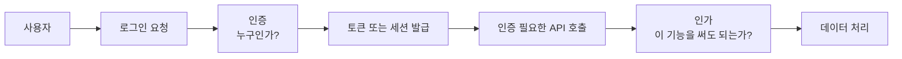
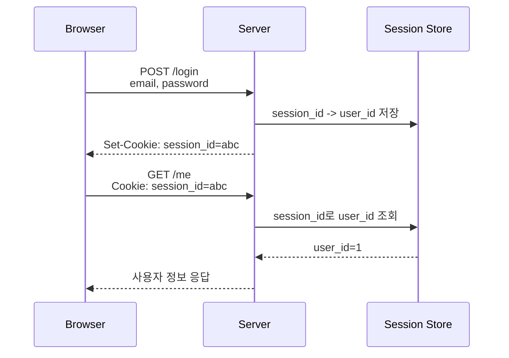
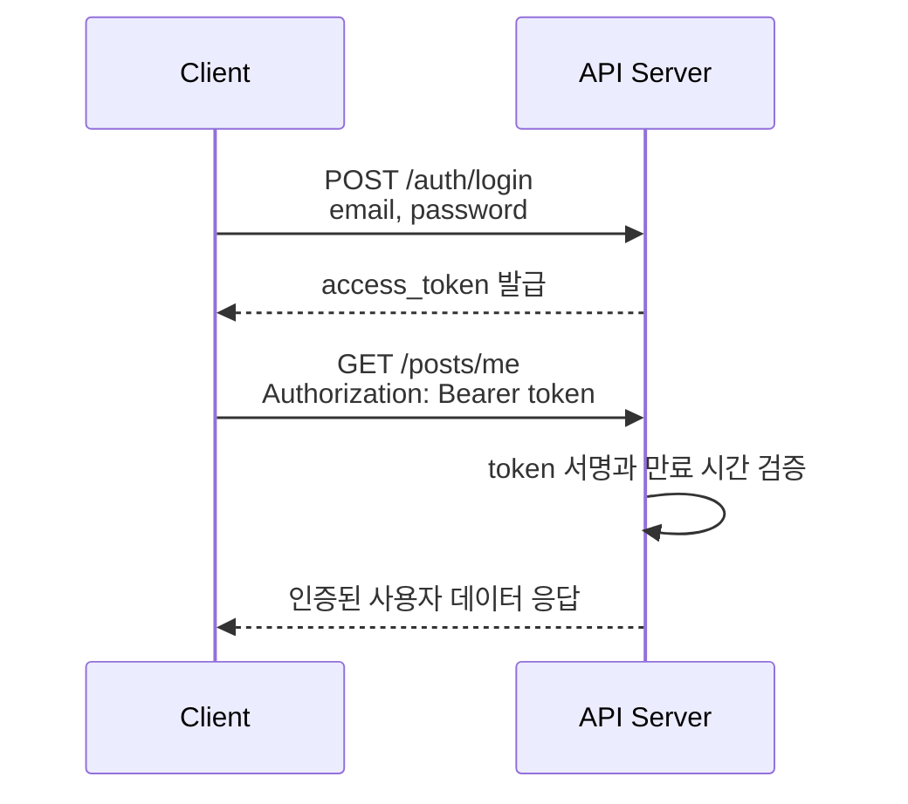
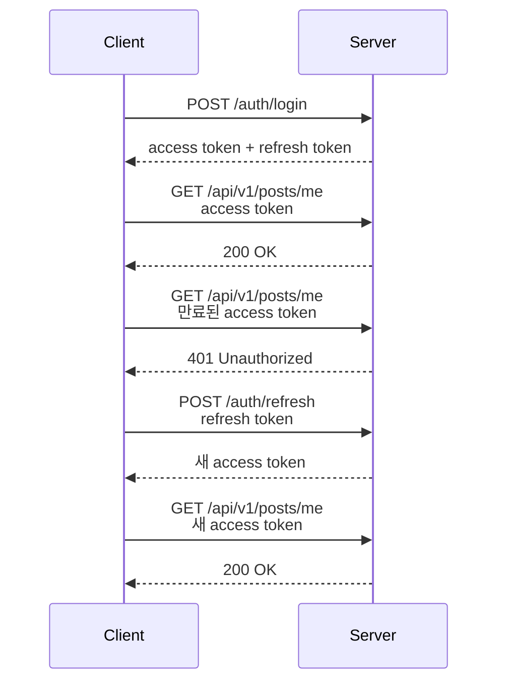
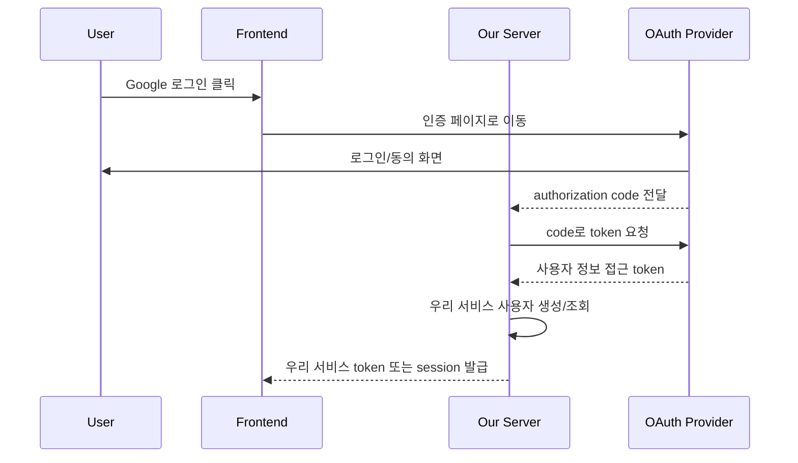
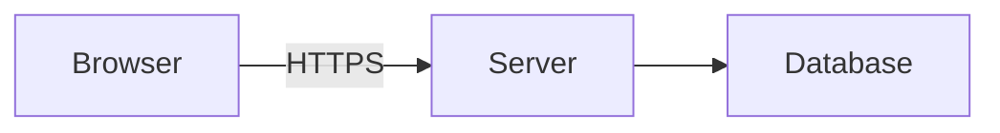
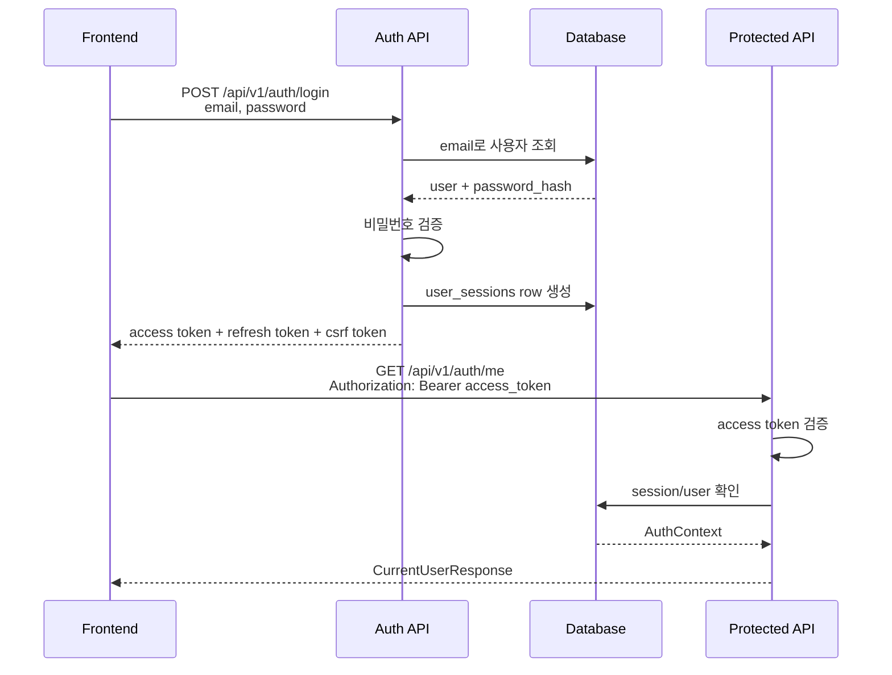

# 인증/인가와 보안 기본 정리

## 목차

1. 인증과 인가는 왜 필요할까?
2. 인증과 인가의 차이
3. Session 방식
4. JWT 방식
5. access token / refresh token
6. OAuth2와 OIDC
7. 프론트엔드에서 토큰 저장 위치
8. 백엔드에서 인증 사용자 확인하기
9. 인증 필요한 API 구분 방식
10. CORS와 CSRF
11. HTTPS
12. Rate Limit
13. 보안 기본 체크리스트
14. 우리 팀 기본 인증 흐름
15. 결론

---

## 1. 인증과 인가는 왜 필요할까?

서비스를 만들다 보면 아주 빠르게 "누가 요청했는가?"라는 질문을 만나게 됩니다.

예를 들어 게시글 목록 조회는 누구나 할 수 있어도, 게시글 작성은 로그인한 사용자만 가능해야 할 수 있습니다. 또 게시글 수정은 로그인만 했다고 모두 가능한 것이 아니라, 그 게시글을 작성한 사용자만 가능해야 합니다.

이때 필요한 개념이 인증(Authentication)과 인가(Authorization)입니다.

인증은 사용자가 누구인지 확인하는 과정입니다. 로그인 화면에서 이메일과 비밀번호를 입력하고, 서버가 그 정보가 맞는지 확인하는 일이 인증입니다.

인가는 인증된 사용자가 특정 기능을 사용할 수 있는지 판단하는 과정입니다. 로그인한 사용자라 하더라도 다른 사람의 게시글을 수정할 수 없다면, 서버는 그 요청을 막아야 합니다.

인증은 나중에 단순히 붙이는 기능이 아닙니다. 인증이 들어오면 프론트엔드 라우팅, 백엔드 미들웨어, DB 유저 테이블, 토큰 저장 방식, API 권한 처리, 보안 정책이 함께 연결됩니다.




현재 프로젝트에는 인증 학습용 코드가 추가되어 있습니다. 로그인 API는 [backend/app/api/v1/auth.py](/Users/tail1/Documents/스프린트1/backend/app/api/v1/auth.py:24)에 있고, 사용자 테이블은 [backend/app/models/user.py](/Users/tail1/Documents/스프린트1/backend/app/models/user.py:9), 세션 테이블은 [backend/app/models/user_session.py](/Users/tail1/Documents/스프린트1/backend/app/models/user_session.py:9)에 정의되어 있습니다.

다만 게시글 도메인은 아직 인증 사용자와 연결되지 않았습니다. [backend/app/models/post.py](/Users/tail1/Documents/스프린트1/backend/app/models/post.py:16)의 `Post` 모델은 여전히 `author_name`을 문자열로 저장합니다. 실제 서비스 기능까지 연결하려면 다음 단계에서 `posts.user_id`가 `users.id`를 참조하도록 확장해야 합니다.

### 현재 구조의 한계와 확장 방향

현재 인증 학습 API에서는 서버가 access token을 검증해 현재 사용자를 확인할 수 있습니다. [backend/app/api/auth_dependencies.py](/Users/tail1/Documents/스프린트1/backend/app/api/auth_dependencies.py:35)의 `get_current_auth_context()`가 Bearer token을 읽고, [backend/app/services/auth_service.py](/Users/tail1/Documents/스프린트1/backend/app/services/auth_service.py:137)의 `authenticate_access_token()`이 토큰과 세션을 검증합니다.

하지만 게시글 API에서는 아직 누가 요청했는지 사용하지 않습니다. `author_name` 값은 클라이언트가 보내는 문자열이기 때문에, 악의적인 사용자가 다른 이름을 넣어도 서버가 진짜 작성자인지 확인할 수 없습니다.

확장하려면 다음 구조가 필요합니다.

- 게시글과 사용자 사이의 FK 관계
- 게시글 생성/수정/삭제 API에 인증 dependency 연결
- 리소스 작성자와 현재 사용자를 비교하는 인가 로직
- 운영용 비밀번호 해시 알고리즘 적용
- 운영 환경 HTTPS/CORS/Rate Limit 정책 확정

핵심은 로그인 기능 자체보다, 요청마다 "이 요청을 보낸 사용자가 누구인지"를 서버가 신뢰할 수 있게 확인하고 그 사용자가 해당 작업을 해도 되는지 판단하는 것입니다.

---

## 2. 인증과 인가의 차이

인증(Authentication)은 신원 확인입니다.

질문으로 표현하면 다음과 같습니다.

```text
당신은 누구인가?
```

예를 들어 사용자가 로그인할 때 이메일과 비밀번호를 입력합니다. 서버는 DB에 저장된 사용자 정보와 비교하여 이 사용자가 실제 가입자인지 확인합니다. 확인에 성공하면 서버는 이후 요청에서 사용할 수 있는 세션 ID나 토큰을 발급합니다.

인가는 권한 확인입니다.

질문으로 표현하면 다음과 같습니다.

```text
당신은 이 작업을 해도 되는가?
```

예를 들어 사용자가 로그인한 상태로 다음 API를 호출한다고 해보겠습니다.

```http
DELETE /api/v1/posts/10
Authorization: Bearer access-token
```

서버는 먼저 토큰을 확인해 사용자가 누구인지 알아냅니다. 그 다음 10번 게시글의 작성자가 이 사용자와 같은지 확인합니다. 로그인은 성공했더라도 작성자가 다르면 삭제를 허용하면 안 됩니다.

### 예시

```text
인증 성공: "이 요청은 user_id=3 사용자가 보낸 요청이다."
인가 성공: "user_id=3은 post_id=10의 작성자이므로 삭제할 수 있다."
인가 실패: "user_id=3은 로그인했지만 post_id=10의 작성자가 아니므로 삭제할 수 없다."
```

HTTP 상태 코드도 구분해서 이해하는 것이 좋습니다.

- `401 Unauthorized`: 인증이 필요하거나 인증 정보가 잘못되었습니다.
- `403 Forbidden`: 인증은 되었지만 해당 작업을 할 권한이 없습니다.

이름이 조금 헷갈리지만 실무에서는 보통 `401`은 "로그인부터 하고 오세요", `403`은 "로그인은 했지만 이 작업은 안 됩니다"에 가깝게 이해하면 됩니다.

### 실제 코드에서 보기

현재 프로젝트의 [backend/app/api/v1/auth.py](/Users/tail1/Documents/스프린트1/backend/app/api/v1/auth.py:34)에는 다음과 같은 내 정보 조회 API가 있습니다.

```python
@router.get("/me", response_model=CurrentUserResponse)
def me(context: CurrentAuthContext) -> CurrentUserResponse:
    return CurrentUserResponse(
        id=context.user.id,
        email=context.user.email,
        role=context.user.role,
        session_id=context.session_id,
    )
```

이 코드는 [backend/app/api/auth_dependencies.py](/Users/tail1/Documents/스프린트1/backend/app/api/auth_dependencies.py:48)의 `CurrentAuthContext`를 통해 현재 로그인 사용자를 확인합니다. 토큰이 없거나 유효하지 않으면 endpoint 본문이 실행되기 전에 `401`이 반환됩니다.

게시글 API에 인증을 붙인다면 다음처럼 로그인된 사용자를 함께 받는 구조로 바뀔 수 있습니다.

```python
@router.post("", response_model=PostRead, status_code=status.HTTP_201_CREATED)
def create_post(
    payload: PostCreate,
    context: CurrentAuthContext,
    service: PostServiceDependency,
) -> PostRead:
    return service.create(payload, author_id=context.user.id)
```

여기서 `CurrentAuthContext`는 인증을 담당합니다. 토큰을 읽고, 사용자를 찾고, 유효하지 않으면 `401`을 발생시킵니다. 게시글 수정/삭제에서는 추가로 "이 사용자가 이 게시글을 수정할 수 있는가?"를 확인해야 하므로 인가 로직이 필요합니다.

이 코드는 다음 확장 방향을 보여주는 예시입니다. 현재 [backend/app/services/post_service.py](/Users/tail1/Documents/스프린트1/backend/app/services/post_service.py:34)의 `create()`는 아직 `author_id`를 받지 않으므로, 실제로 게시글 인증을 붙일 때는 `posts.user_id` 컬럼과 service/repository 저장 흐름도 함께 바뀌어야 합니다.

### 현재 구조의 한계와 확장 방향

현재 프로젝트에는 `CurrentAuthContext`에 해당하는 dependency가 있습니다. 다만 `Post` 모델에 아직 `user_id`가 없기 때문에 "이 게시글의 작성자 계정"을 안정적으로 판단할 수 없습니다.

확장 방향은 다음과 같습니다.

```text
users.id
posts.user_id -> users.id
```

인증은 사용자를 확인하는 기반이고, 인가는 그 사용자가 특정 리소스에 대해 어떤 행동을 할 수 있는지 판단하는 규칙입니다.

---

## 3. Session 방식

Session 방식은 로그인 상태를 서버가 기억하는 방식입니다.

사용자가 로그인에 성공하면 서버는 세션 저장소에 로그인 정보를 저장하고, 클라이언트에게 세션 ID를 쿠키로 내려줍니다. 이후 클라이언트가 요청할 때마다 쿠키에 담긴 세션 ID가 서버로 전송됩니다. 서버는 세션 ID를 보고 세션 저장소에서 사용자 정보를 찾습니다.




Session 방식의 장점은 서버가 로그인 상태를 직접 관리한다는 점입니다. 강제 로그아웃, 세션 만료, 특정 기기 로그아웃 같은 기능을 비교적 명확하게 구현할 수 있습니다.

단점은 서버가 세션 저장소를 운영해야 한다는 점입니다. 서버가 여러 대로 늘어나면 모든 서버가 같은 세션 정보를 볼 수 있도록 Redis 같은 공용 세션 저장소가 필요할 수 있습니다.

### Session 방식을 쓰기 좋은 상황

- 브라우저 기반 웹 서비스
- 서버와 프론트엔드가 같은 도메인 또는 가까운 도메인에서 운영되는 경우
- 서버에서 로그인 상태를 강하게 통제하고 싶은 경우
- 관리자 페이지처럼 보수적인 보안 정책이 중요한 경우

### 주의할 점

Session ID는 보통 쿠키에 저장됩니다. 쿠키를 사용하면 CSRF 공격을 고려해야 합니다. 따라서 `HttpOnly`, `Secure`, `SameSite` 같은 쿠키 옵션과 CSRF 방어 정책을 함께 설계해야 합니다.

```http
Set-Cookie: session_id=abc;
  HttpOnly;
  Secure;
  SameSite=Lax
```

### 현재 구조의 한계와 확장 방향

현재 프로젝트에는 로그인 세션 저장소 역할을 하는 `user_sessions` 테이블이 있습니다. [backend/app/models/user_session.py](/Users/tail1/Documents/스프린트1/backend/app/models/user_session.py:9)의 `UserSession`은 `user_id`, `refresh_token_hash`, `csrf_token`, `expires_at`, `revoked_at`을 저장합니다.

[backend/app/db/session.py](/Users/tail1/Documents/스프린트1/backend/app/db/session.py:8)의 `SessionLocal`은 SQLAlchemy DB 세션이며, 로그인 세션과는 다른 개념입니다.

이름이 같아서 헷갈릴 수 있습니다.

- DB Session: DB 연결과 transaction을 관리하는 객체
- Login Session: 사용자의 로그인 상태를 기억하는 서버 측 상태

인증 학습에서는 두 세션을 구분해서 말하는 것이 중요합니다.

---

## 4. JWT 방식

JWT(JSON Web Token)는 로그인 상태를 토큰 자체에 담아 클라이언트가 들고 다니는 방식입니다.

사용자가 로그인하면 서버는 사용자 식별자와 만료 시간 같은 정보를 담은 토큰을 발급합니다. 클라이언트는 이후 API를 호출할 때 `Authorization` 헤더에 토큰을 넣어 보냅니다.

```http
GET /api/v1/me HTTP/1.1
Host: example.com
Authorization: Bearer eyJhbGciOi...
```

서버는 요청을 받을 때마다 토큰의 서명을 검증하고, 만료 시간을 확인하고, 토큰 안의 사용자 식별자를 읽습니다.




JWT의 일반적인 장점은 서버가 매 요청마다 세션 저장소를 조회하지 않아도 된다는 점입니다. 토큰의 서명만 검증하면 토큰이 서버에서 발급된 것인지 확인할 수 있습니다.

단점은 이미 발급된 토큰을 중간에 무효화하기 어렵다는 점입니다. access token이 탈취되면 만료 전까지 악용될 수 있습니다. 그래서 access token은 짧게 유지하고, refresh token을 별도로 두는 방식이 자주 사용됩니다.

현재 프로젝트는 이 단점을 줄이기 위해 JWT와 서버 세션 테이블을 함께 사용합니다. access token 안에는 `sid`가 들어 있고, 서버는 [backend/app/services/auth_service.py](/Users/tail1/Documents/스프린트1/backend/app/services/auth_service.py:137)의 `authenticate_access_token()`에서 `user_sessions` row가 살아 있는지 함께 확인합니다. 그래서 logout으로 세션을 폐기하면, 아직 만료 시간이 남은 access token이라도 더 이상 보호 API를 호출할 수 없습니다.

### JWT 안에 넣어도 되는 것과 안 되는 것

JWT는 암호화가 아니라 서명된 데이터 형식으로 사용하는 경우가 많습니다. 즉 토큰 payload는 누구나 디코딩해서 볼 수 있다고 생각해야 합니다.

넣어도 되는 정보:

- 사용자 ID
- 권한 이름
- 토큰 만료 시간
- 토큰 발급자

넣으면 안 되는 정보:

- 비밀번호
- 주민등록번호
- 전화번호 같은 민감한 개인정보
- 결제 정보
- 외부에 노출되면 안 되는 내부 비밀값

### 실제 코드에서 보기

현재 프로젝트는 [backend/app/core/security.py](/Users/tail1/Documents/스프린트1/backend/app/core/security.py:47)의 `create_jwt()`와 [backend/app/core/security.py](/Users/tail1/Documents/스프린트1/backend/app/core/security.py:77)의 `decode_jwt()`로 학습용 JWT 생성/검증 흐름을 직접 보여줍니다.

```python
def create_jwt(
    *,
    subject: int,
    role: str,
    token_type: str,
    session_id: str,
    expires_delta: timedelta,
    jwt_id: str | None = None,
) -> str:
    ...
```

```python
def decode_jwt(token: str, *, expected_type: str) -> dict[str, Any]:
    ...
```

이 구현은 학습용으로 base64url, HMAC 서명, 만료 시간, token type 검증이 어떻게 이어지는지 보여줍니다. 운영에서는 검증된 JWT 라이브러리와 더 엄격한 key 관리가 필요합니다.

### 현재 구조의 한계와 확장 방향

현재 [backend/app/core/security.py](/Users/tail1/Documents/스프린트1/backend/app/core/security.py:25)는 다음 역할을 담당합니다.

- 비밀번호 해시 생성
- 비밀번호 검증
- access token / refresh token 생성
- refresh token 저장을 위한 secret hash 생성
- token payload 검증
- 인증 실패 시 `401` 응답 반환

JWT는 "로그인을 구현하는 마법 코드"가 아니라, 인증 결과를 이후 요청에서 전달하기 위한 형식입니다.

---

## 5. access token / refresh token

access token은 API를 호출할 때 사용하는 짧은 수명의 토큰입니다.

refresh token은 access token이 만료되었을 때 새 access token을 발급받기 위한 긴 수명의 토큰입니다.

두 토큰을 나누는 이유는 위험을 줄이기 위해서입니다. API 요청마다 사용하는 access token은 네트워크와 브라우저 환경에서 자주 사용됩니다. 따라서 탈취될 가능성을 완전히 없앨 수 없습니다. 그래서 access token의 유효 시간을 짧게 둡니다.

하지만 access token을 너무 짧게 두면 사용자가 계속 로그인해야 하므로 불편합니다. 이때 refresh token을 사용합니다.




### 역할 정리


| 구분            | 역할               | 수명  | 사용 위치     | 위험                    |
| ------------- | ---------------- | --- | --------- | --------------------- |
| access token  | API 인증           | 짧게  | API 요청 헤더 | 탈취되면 만료 전까지 API 호출 가능 |
| refresh token | access token 재발급 | 길게  | 재발급 요청    | 탈취되면 장기간 세션 유지 가능     |


refresh token은 access token보다 더 조심해서 다뤄야 합니다. 가능하면 서버에 저장해 무효화할 수 있게 만들고, 재사용 탐지나 rotation 전략을 고려합니다.

### 예시 정책

```text
access token 만료: 15분
refresh token 만료: 7일 또는 14일
refresh token 저장: HttpOnly Secure Cookie 또는 서버 저장소
로그아웃: refresh token 폐기
```

### 현재 구조의 한계와 확장 방향

현재 프로젝트에는 token lifecycle이 구현되어 있습니다. [backend/app/services/auth_service.py](/Users/tail1/Documents/스프린트1/backend/app/services/auth_service.py:78)의 `login()`은 access token, refresh token, csrf token을 발급하고, [backend/app/services/auth_service.py](/Users/tail1/Documents/스프린트1/backend/app/services/auth_service.py:110)의 `refresh()`는 refresh token을 회전시킵니다.

이제 팀에서 추가로 합의해야 하는 질문은 다음과 같습니다.

- access token 만료 시간을 얼마로 할 것인가?
- refresh token hash를 얼마나 오래 보관할 것인가?
- 로그아웃 시 어떤 토큰을 폐기할 것인가?
- 토큰이 탈취되었을 때 피해를 어떻게 줄일 것인가?

이 질문에 답하지 않고 JWT 코드만 붙이면, 작동은 하지만 위험한 인증 구조가 되기 쉽습니다.

---

## 6. OAuth2와 OIDC

OAuth2는 다른 서비스의 권한을 위임받기 위한 표준입니다.

예를 들어 사용자가 "Google로 로그인" 버튼을 누른다고 해보겠습니다. 우리 서비스는 사용자의 Google 비밀번호를 직접 받아서는 안 됩니다. 대신 Google이 제공하는 인증 화면으로 사용자를 보내고, 사용자가 동의하면 Google이 우리 서비스에 권한을 위임합니다.

OAuth2의 핵심은 "비밀번호를 공유하지 않고 권한을 위임한다"는 점입니다.

OIDC(OpenID Connect)는 OAuth2 위에 신원 확인을 추가한 표준입니다. OAuth2가 권한 위임에 초점을 둔다면, OIDC는 "이 사용자가 누구인지"를 표준화된 방식으로 확인하는 데 초점을 둡니다.

### 언제 무엇을 쓸까?


| 상황                       | 선택                        |
| ------------------------ | ------------------------- |
| 우리 서비스 이메일/비밀번호 로그인      | Session 또는 JWT            |
| Google, Kakao, Naver 로그인 | OAuth2 + OIDC 또는 제공자별 로그인 |
| 외부 서비스 API 접근 권한 위임      | OAuth2                    |
| 기업 SSO, 조직 로그인           | OIDC 또는 SAML              |
| 단순 학습용 로그인               | Session 또는 JWT 중 하나로 시작   |


### OAuth2 로그인 흐름 예시




중요한 점은 Google access token을 그대로 우리 API 인증용으로 쓰는 것이 아니라는 점입니다. 보통 외부 제공자에서 사용자 정보를 확인한 뒤, 우리 서비스 자체의 세션이나 토큰을 발급합니다.

### 현재 구조의 한계와 확장 방향

현재 프로젝트에는 자체 사용자 테이블이 있습니다. OAuth2/OIDC를 붙이려면 이제 "외부 제공자의 사용자와 우리 서비스의 `users` row를 어떻게 연결할 것인가?"를 정해야 합니다.

예를 들어 다음 정보가 필요할 수 있습니다.

- `users.provider`
- `users.provider_user_id`
- `users.email_verified`
- 외부 IdP의 id token 검증 방식
- 자체 로그인 사용자와 소셜 로그인 사용자의 병합 기준

OAuth2/OIDC는 처음부터 필수는 아닙니다. 하지만 소셜 로그인이나 기업 로그인이 필요해지는 순간 직접 비밀번호를 받는 로그인과는 다른 흐름이 필요하다는 점을 알아두어야 합니다.

---

## 7. 프론트엔드에서 토큰 저장 위치

JWT를 사용할 때 가장 많이 나오는 질문은 "토큰을 어디에 저장할 것인가?"입니다.

대표적인 선택지는 메모리, localStorage, sessionStorage, Cookie입니다. 각각 장단점이 있습니다.


| 저장 위치           | 장점                        | 단점                 |
| --------------- | ------------------------- | ------------------ |
| Memory          | 새로고침 시 사라져 안전성이 상대적으로 높음  | 새로고침하면 다시 발급 흐름 필요 |
| localStorage    | 구현이 쉽고 새로고침 후에도 유지        | XSS에 취약하면 토큰 탈취 위험 |
| sessionStorage  | 탭 단위로 유지                  | XSS 위험은 여전히 존재     |
| HttpOnly Cookie | JS에서 읽을 수 없어 XSS 탈취 위험 감소 | CSRF 방어와 쿠키 설정 필요  |


정답은 하나가 아닙니다. 중요한 것은 선택한 저장 위치에 맞는 위험을 알고 방어하는 것입니다.

### 예시 판단

브라우저 기반 웹 서비스에서 refresh token을 오래 유지해야 한다면, refresh token은 `HttpOnly`, `Secure`, `SameSite` 쿠키로 두는 방식을 고려할 수 있습니다. access token은 메모리에만 들고 있다가 만료되면 refresh token으로 재발급받는 구조도 가능합니다.

반대로 학습용 프로젝트나 API 클라이언트 중심 프로젝트에서는 access token을 `Authorization` 헤더에 넣는 JWT 방식으로 흐름을 먼저 이해할 수 있습니다.

### XSS와 CSRF 관점

localStorage는 CSRF에는 상대적으로 덜 노출됩니다. 브라우저가 자동으로 헤더에 토큰을 붙이지 않기 때문입니다. 하지만 XSS가 발생하면 JavaScript로 토큰을 읽어갈 수 있습니다.

Cookie는 `HttpOnly`를 설정하면 JavaScript로 읽기 어렵습니다. 하지만 브라우저가 요청에 쿠키를 자동으로 붙이기 때문에 CSRF 방어를 고려해야 합니다.

### 현재 구조의 한계와 확장 방향

현재 프로젝트에는 프론트엔드 코드가 없습니다. 하지만 백엔드 인증 정책은 프론트엔드 저장 방식과 함께 결정해야 합니다.

팀에서 최소한 다음 질문에 답해야 합니다.

- access token은 어디에 저장할 것인가?
- refresh token은 사용할 것인가?
- refresh token을 쿠키에 둘 경우 CSRF 방어는 어떻게 할 것인가?
- 로그아웃 시 프론트와 백엔드는 각각 무엇을 지울 것인가?

토큰 저장 방식은 프론트엔드만의 문제가 아니라 전체 인증 설계의 일부입니다.

---

## 8. 백엔드에서 인증 사용자 확인하기

백엔드는 인증이 필요한 API가 호출될 때마다 현재 사용자를 확인해야 합니다.

JWT 방식이라면 보통 다음 순서로 진행됩니다.

```text
1. Authorization 헤더에서 Bearer token을 읽는다.
2. token 서명을 검증한다.
3. token 만료 시간을 확인한다.
4. token payload에서 user_id를 꺼낸다.
5. DB에서 user_id에 해당하는 사용자를 조회한다.
6. 사용자가 없거나 비활성 상태면 401을 반환한다.
7. 정상 사용자면 endpoint 함수에 `AuthContext` 또는 현재 사용자 정보로 전달한다.
```

FastAPI에서는 이 흐름을 dependency로 만들 수 있습니다. 현재 프로젝트에서는 [backend/app/api/auth_dependencies.py](/Users/tail1/Documents/스프린트1/backend/app/api/auth_dependencies.py:35)의 `get_current_auth_context()`가 이 역할을 합니다.

```python
def get_current_auth_context(
    credentials: Annotated[HTTPAuthorizationCredentials | None, Depends(bearer_scheme)],
    service: AuthServiceDependency,
) -> AuthContext:
    if credentials is None:
        raise AppError(
            code="AUTH_REQUIRED",
            message="Authorization Bearer 토큰이 필요합니다.",
            status_code=status.HTTP_401_UNAUTHORIZED,
        )
    return service.authenticate_access_token(credentials.credentials)
```

이 dependency를 endpoint에 붙이면, 해당 API는 로그인한 사용자만 호출할 수 있습니다.

```python
@router.get("/me", response_model=CurrentUserResponse)
def me(context: CurrentAuthContext) -> CurrentUserResponse:
    return CurrentUserResponse(
        id=context.user.id,
        email=context.user.email,
        role=context.user.role,
        session_id=context.session_id,
    )
```

### 인증 실패와 인가 실패

인증 실패는 현재 사용자를 확인할 수 없는 경우입니다.

```text
토큰 없음
토큰 형식 오류
토큰 서명 오류
토큰 만료
토큰 user_id에 해당하는 사용자가 없음
```

이 경우 보통 `401 Unauthorized`를 반환합니다.

인가 실패는 사용자는 확인했지만 권한이 없는 경우입니다.

```text
다른 사용자의 게시글 수정
일반 사용자의 관리자 API 호출
팀 멤버가 아닌 사용자의 팀 리소스 접근
```

이 경우 보통 `403 Forbidden`을 반환합니다.

### 현재 구조의 한계와 확장 방향

현재 프로젝트에서는 [backend/app/api/v1/auth.py](/Users/tail1/Documents/스프린트1/backend/app/api/v1/auth.py:34)의 `/auth/me`, [backend/app/api/v1/auth.py](/Users/tail1/Documents/스프린트1/backend/app/api/v1/auth.py:44)의 `/auth/logout`, [backend/app/api/v1/auth.py](/Users/tail1/Documents/스프린트1/backend/app/api/v1/auth.py:59)의 `/auth/admin/report`가 인증 사용자 확인을 사용합니다.

다만 [backend/app/api/v1/posts.py](/Users/tail1/Documents/스프린트1/backend/app/api/v1/posts.py:9)의 게시글 생성 endpoint는 아직 `CurrentAuthContext`를 받지 않습니다. 따라서 게시글 API는 현재 모든 요청을 익명 요청으로 처리합니다.

---

## 9. 인증 필요한 API 구분 방식

팀 프로젝트에서 중요한 것은 어떤 API가 인증을 요구하는지 명확하게 표시하는 것입니다.

API 목록만 보고는 이 API가 공개 API인지, 로그인 필요 API인지, 관리자 전용 API인지 헷갈리면 구현 중 누락이 생기기 쉽습니다.

### 문서에서 표시하기

API 계약 문서에 다음처럼 표시할 수 있습니다.


| Method | Path                          | 인증     | 권한            | 설명        |
| ------ | ----------------------------- | ------ | ------------- | --------- |
| `POST` | `/api/v1/auth/login`          | 불필요    | 공개            | 로그인       |
| `POST` | `/api/v1/auth/refresh`        | 불필요    | refresh token | 토큰 재발급    |
| `GET`  | `/api/v1/auth/me`             | 필요     | 로그인 사용자       | 내 정보 조회   |
| `POST` | `/api/v1/auth/logout`         | 필요     | 로그인 사용자       | 세션 폐기     |
| `POST` | `/api/v1/auth/session-action` | 필요     | 로그인 + CSRF    | CSRF demo |
| `GET`  | `/api/v1/auth/admin/report`   | 필요     | admin         | 관리자 보고서   |
| `GET`  | `/api/v1/posts`               | 불필요    | 공개            | 게시글 목록 조회 |
| `POST` | `/api/v1/posts`               | 현재 불필요 | 공개            | 게시글 생성    |


### 코드에서 표시하기

FastAPI에서는 dependency를 붙여 코드에서도 드러나게 할 수 있습니다.

```python
@router.post("", response_model=PostRead)
def create_post(
    payload: PostCreate,
    context: CurrentAuthContext,
    service: PostServiceDependency,
) -> PostRead:
    return service.create(payload, author_id=context.user.id)
```

관리자 권한이 필요하다면 현재 프로젝트처럼 role dependency를 둘 수 있습니다.

```python
def require_role(role: str) -> Callable[[CurrentAuthContext], AuthContext]:
    def dependency(context: CurrentAuthContext) -> AuthContext:
        if context.user.role != role:
            raise AppError(
                code="FORBIDDEN",
                message="요청한 리소스에 접근할 권한이 없습니다.",
                status_code=status.HTTP_403_FORBIDDEN,
            )
        return context

    return dependency
```

```python
@router.get("/admin/report", response_model=AdminReportResponse)
def admin_report(
    context: AuthContext = Depends(require_role("admin")),
) -> AdminReportResponse:
    ...
```

### 현재 구조의 한계와 확장 방향

현재 프로젝트의 게시글 생성 API는 누구나 호출할 수 있습니다. 학습용 예제에서는 괜찮지만, 실제 서비스에서는 게시글 생성, 수정, 삭제 API에 인증이 붙는 경우가 많습니다.

팀 문서에는 API마다 최소한 다음 정보를 표시하는 것이 좋습니다.

- 인증 필요 여부
- 필요한 권한
- 토큰 전달 방식
- 인증 실패 응답
- 권한 실패 응답

이 표시 방식이 있어야 프론트엔드는 로그인 화면 이동, 에러 메시지, 라우팅 보호를 일관되게 구현할 수 있습니다.

---

## 10. CORS와 CSRF

CORS와 CSRF는 이름도 비슷하고 둘 다 브라우저 보안과 관련이 있어 자주 헷갈립니다. 하지만 두 개념은 해결하는 문제가 다릅니다.

CORS(Cross-Origin Resource Sharing)는 브라우저가 다른 출처(origin)의 API 호출을 허용할지 판단하는 정책입니다.

예를 들어 프론트엔드가 `http://localhost:3000`에서 실행되고, 백엔드가 `http://localhost:8000`에서 실행되면 둘은 출처가 다릅니다. 이때 백엔드가 CORS 설정으로 `http://localhost:3000`의 요청을 허용해야 브라우저에서 API 호출이 가능합니다.

```text
프론트엔드: http://localhost:3000
백엔드:     http://localhost:8000
```

CSRF(Cross-Site Request Forgery)는 사용자가 의도하지 않은 요청을 다른 사이트가 보내게 만드는 공격입니다.

특히 쿠키 기반 인증에서 문제가 됩니다. 브라우저는 특정 도메인으로 요청을 보낼 때 쿠키를 자동으로 붙입니다. 악성 사이트가 사용자의 브라우저를 이용해 우리 서비스에 요청을 보내면, 사용자의 로그인 쿠키가 함께 전송될 수 있습니다.

### 차이 정리


| 구분       | CORS                 | CSRF                            |
| -------- | -------------------- | ------------------------------- |
| 목적       | 다른 출처 요청 허용 여부 제어    | 사용자가 원하지 않은 요청 방지               |
| 주체       | 브라우저 보안 정책           | 공격 기법                           |
| 주로 관련된 것 | API 서버의 Origin 허용 설정 | 쿠키 기반 인증                        |
| 해결 방향    | 허용 Origin 제한         | SameSite, CSRF token, Origin 검증 |


### FastAPI CORS 예시

```python
from fastapi.middleware.cors import CORSMiddleware

app.add_middleware(
    CORSMiddleware,
    allow_origins=["http://localhost:3000"],
    allow_credentials=True,
    allow_methods=["GET", "POST", "PATCH", "DELETE"],
    allow_headers=["Authorization", "Content-Type"],
)
```

`allow_origins=["*"]`는 학습 중에는 편해 보이지만, 인증 쿠키나 민감한 API가 있는 서비스에서는 조심해야 합니다.

### 현재 구조의 한계와 확장 방향

현재 [backend/app/main.py](/Users/tail1/Documents/스프린트1/backend/app/main.py:35)에는 CORS middleware 설정이 있습니다. 허용 origin은 [backend/app/core/config.py](/Users/tail1/Documents/스프린트1/backend/app/core/config.py:1)의 `settings.allowed_origins`에서 관리됩니다.

또한 [backend/app/api/v1/auth.py](/Users/tail1/Documents/스프린트1/backend/app/api/v1/auth.py:50)의 `/auth/session-action`은 [backend/app/api/auth_dependencies.py](/Users/tail1/Documents/스프린트1/backend/app/api/auth_dependencies.py:51)의 `require_csrf_token()`으로 `X-CSRF-Token`을 확인합니다. CORS 설정만으로 CSRF가 해결되는 것은 아니기 때문에, 쿠키 기반 인증을 쓰는 변경 요청에서는 이런 별도 검증이 필요합니다.

---

## 11. HTTPS

HTTPS는 HTTP 통신을 TLS로 암호화한 방식입니다.

로그인 요청에는 이메일, 비밀번호, 토큰 같은 민감한 정보가 포함됩니다. HTTPS가 없다면 네트워크 중간에서 요청 내용을 훔쳐보거나 변조할 위험이 커집니다.




HTTPS가 필요한 이유는 다음과 같습니다.

- 비밀번호와 토큰이 평문으로 노출되는 것을 막기 위해
- 요청과 응답이 중간에서 변조되는 것을 줄이기 위해
- 브라우저의 보안 기능을 제대로 사용하기 위해
- `Secure` 쿠키를 사용하기 위해

특히 `Secure` 쿠키는 HTTPS 환경에서만 전송됩니다. 운영 환경에서 인증 쿠키를 쓴다면 HTTPS는 선택이 아니라 기본 전제에 가깝습니다.

### 로컬 개발과 운영 환경

로컬 개발에서는 `http://localhost`를 사용할 수 있습니다. 하지만 운영 환경에서는 로그인과 인증이 있는 서비스라면 HTTPS를 반드시 사용해야 합니다.

팀에서 구분해야 할 것은 다음입니다.

```text
로컬 개발: http://localhost:8000
운영 배포: https://api.example.com
```

### 현재 구조의 한계와 확장 방향

현재 프로젝트는 로컬 FastAPI 학습용 구조입니다. HTTPS는 애플리케이션 코드보다 배포 환경, 프록시 서버, 인증서 설정과 더 관련이 있습니다.

나중에 배포하면 다음 요소를 확인해야 합니다.

- HTTPS 인증서
- HTTP에서 HTTPS로 redirect
- Secure cookie 설정
- HSTS 적용 여부
- 프록시 뒤에서 클라이언트 IP와 scheme을 올바르게 처리하는지

HTTPS는 보안 기능 하나가 아니라, 인증 정보를 안전하게 주고받기 위한 기본 바닥입니다.

---

## 12. Rate Limit

Rate Limit은 일정 시간 동안 허용할 요청 수를 제한하는 정책입니다.

로그인 API는 특히 rate limit이 중요합니다. 공격자가 비밀번호를 무작위로 계속 시도할 수 있기 때문입니다. 게시글 작성 API도 너무 자주 호출되면 스팸이 될 수 있습니다.

```text
로그인 API: IP당 1분에 5회
회원가입 API: IP당 1시간에 10회
댓글 작성 API: 사용자당 1분에 20회
```

Rate Limit은 사용자를 불편하게 만들기 위한 기능이 아닙니다. 정상적인 사용 범위를 넘어서는 요청을 줄여 서비스와 사용자를 보호하는 장치입니다.

### 기준을 잡는 방법

Rate Limit 기준은 API 성격에 따라 달라집니다.


| API      | 제한 기준 예시     | 이유            |
| -------- | ------------ | ------------- |
| 로그인      | IP + 계정      | 비밀번호 대입 공격 방지 |
| 회원가입     | IP           | 대량 가입 방지      |
| 댓글 작성    | 사용자 ID       | 스팸 방지         |
| 검색       | IP 또는 사용자 ID | 서버 부하 방지      |
| 비밀번호 재설정 | 계정 + IP      | 이메일 폭탄 방지     |


### 응답 예시

제한을 넘으면 보통 `429 Too Many Requests`를 반환합니다.

```json
{
  "detail": "Too many requests. Please try again later."
}
```

### 현재 구조의 한계와 확장 방향

현재 프로젝트에는 [backend/app/core/rate_limit.py](/Users/tail1/Documents/스프린트1/backend/app/core/rate_limit.py:14)의 `SimpleRateLimitMiddleware`가 있습니다. [backend/app/main.py](/Users/tail1/Documents/스프린트1/backend/app/main.py:34)에서 앱 전체 middleware로 등록됩니다.

FastAPI에서는 middleware를 직접 만들거나, Redis 기반 저장소를 사용해 분산 환경에서도 요청 횟수를 공유할 수 있습니다.

현재 구현은 단순 메모리 기반 rate limit입니다. 학습에는 좋지만 서버가 여러 대가 되면 한계가 있습니다. 운영에서는 Redis 같은 공용 저장소를 고려해야 합니다.

---

## 13. 보안 기본 체크리스트

인증/인가를 구현할 때 팀에서 함께 확인할 기본 체크리스트입니다.

### 비밀번호

- 비밀번호를 평문으로 저장하지 않는다.
- bcrypt, argon2 같은 password hashing 알고리즘을 사용한다.
- 해시와 암호화를 구분한다.
- 로그인 실패 메시지로 어떤 이메일이 가입되어 있는지 과도하게 노출하지 않는다.

### 토큰

- access token 수명을 짧게 둔다.
- refresh token은 access token보다 더 조심해서 저장한다.
- JWT payload에 민감 정보를 넣지 않는다.
- JWT 알고리즘을 서버에서 고정한다.
- 만료된 토큰은 거부한다.

### 쿠키와 브라우저

- 인증 쿠키에는 가능하면 `HttpOnly`를 사용한다.
- 운영 환경에서는 `Secure` 쿠키를 사용한다.
- 쿠키 기반 인증이면 `SameSite`와 CSRF 방어를 확인한다.
- XSS가 생기면 localStorage의 token도 탈취될 수 있음을 이해한다.

### API

- 인증 필요한 API를 문서와 코드에 명확히 표시한다.
- 인증 실패는 `401`, 권한 실패는 `403`으로 구분한다.
- 로그인 API에는 rate limit을 둔다.
- 에러 응답에 내부 정보를 과도하게 노출하지 않는다.

### 서버 설정

- 운영 환경에서는 HTTPS를 사용한다.
- CORS 허용 Origin을 필요한 도메인으로 제한한다.
- secret key를 코드에 하드코딩하지 않는다.
- 환경 변수와 설정 파일을 분리한다.

### 현재 구조의 한계와 확장 방향

현재 프로젝트에는 로그인, access/refresh token, refresh token hash 저장, CSRF demo, CORS, Rate Limit, role 기반 인가 예시가 반영되어 있습니다. 다만 비밀번호 해시는 학습용 단순 구현이고, HTTPS와 운영용 secret/key 관리는 배포 환경에서 별도로 다뤄야 합니다.

---

## 14. 우리 팀 기본 인증 흐름

우리 팀의 기본 학습 목표는 로그인 요청부터 인증이 필요한 API 호출까지의 흐름을 모두가 설명할 수 있게 되는 것입니다.

현재 프로젝트는 자체 로그인, access token, refresh token rotation, 서버 세션 테이블, CSRF demo, admin role 인가까지 학습용으로 구현되어 있습니다. 먼저 다음 흐름을 팀 전체가 설명할 수 있어야 합니다.




### 기본 합의안 예시


| 항목              | 기본 방향                              |
| --------------- | ---------------------------------- |
| 학습 시작 방식        | JWT access token 중심                |
| API 토큰 전달       | `Authorization: Bearer <token>`    |
| access token 수명 | 짧게 설정                              |
| refresh token   | 구현됨, refresh 때 rotation            |
| 인증 사용자 확인       | `CurrentAuthContext` dependency    |
| 인증 필요한 API 표시   | API 문서 표 + 코드 dependency           |
| 게시글 작성자 저장      | 다음 확장: `posts.user_id -> users.id` |
| CORS            | `settings.allowed_origins` 기준 허용   |
| HTTPS           | 운영 배포 시 필수                         |
| Rate Limit      | `SimpleRateLimitMiddleware` 구현됨    |


### Session/JWT/OAuth 선택 기준


| 선택지         | 언제 적합한가                          | 팀이 확인할 질문                        |
| ----------- | -------------------------------- | -------------------------------- |
| Session     | 서버가 로그인 상태를 직접 관리하고 싶을 때         | 세션 저장소를 어디에 둘 것인가?               |
| JWT         | API 서버가 토큰 기반으로 인증을 확인하게 하고 싶을 때 | 토큰 탈취와 만료를 어떻게 다룰 것인가?           |
| OAuth2/OIDC | 외부 서비스 로그인이나 권한 위임이 필요할 때        | 외부 사용자와 우리 서비스 사용자를 어떻게 연결할 것인가? |


### 인증 필요한 API 표시 방식

```text
POST   /api/v1/auth/login            인증 불필요
POST   /api/v1/auth/refresh          refresh token 필요
GET    /api/v1/auth/me               인증 필요: 로그인 사용자
POST   /api/v1/auth/logout           인증 필요: 로그인 사용자
POST   /api/v1/auth/session-action   인증 필요: 로그인 + CSRF
GET    /api/v1/auth/admin/report     인증 필요: admin
GET    /api/v1/posts                 현재 인증 불필요
POST   /api/v1/posts                 현재 인증 불필요
```

이 표시를 문서와 코드 양쪽에 남겨야 합니다. 문서에는 프론트엔드와 백엔드가 합의한 계약으로 남기고, 코드에는 `CurrentAuthContext`, `CsrfProtectedContext`, `require_role("admin")` 같은 방식으로 실제 보호 장치를 둡니다.

### 현재 구조의 한계와 확장 방향

현재 프로젝트에는 인증 학습 흐름이 구현되어 있습니다. [backend/app/api/v1/auth.py](/Users/tail1/Documents/스프린트1/backend/app/api/v1/auth.py:24), [backend/app/api/auth_dependencies.py](/Users/tail1/Documents/스프린트1/backend/app/api/auth_dependencies.py:35), [backend/app/services/auth_service.py](/Users/tail1/Documents/스프린트1/backend/app/services/auth_service.py:78), [backend/app/core/security.py](/Users/tail1/Documents/스프린트1/backend/app/core/security.py:47)를 따라가면 로그인부터 보호 API 호출까지 설명할 수 있습니다.

다음 단계에서는 이 인증 흐름을 게시글 도메인에 연결하면 됩니다. `posts.user_id`를 추가하고 게시글 생성/수정/삭제 API에 `CurrentAuthContext`와 소유권 인가를 붙이면 됩니다.

---

## 15. 결론

인증/인가는 단순히 로그인 화면을 만들고 JWT를 발급하는 기능이 아닙니다.

인증은 서버가 "이 요청을 보낸 사용자가 누구인지" 신뢰할 수 있게 확인하는 과정입니다. 인가는 그 사용자가 "이 리소스에 대해 이 행동을 해도 되는지" 판단하는 과정입니다.

JWT, Session, OAuth2/OIDC는 서로 경쟁하는 정답이라기보다 상황에 따라 선택하는 도구입니다. 중요한 것은 팀이 선택의 이유와 위험을 함께 이해하는 것입니다.

처음 목표는 JWT 코드를 완벽하게 구현하는 것이 아닙니다. 로그인 요청, 토큰 발급, 토큰 저장, 인증 필요한 API 호출, 백엔드 사용자 확인, 권한 확인, 보안 체크리스트까지의 흐름을 팀원 모두가 말로 설명할 수 있어야 합니다.

현재 프로젝트에는 인증 구조가 들어왔고, API 라우터, dependency, 서비스, 모델, 세션 테이블, 테스트까지 나뉘어 있습니다. 이 구조를 따라 읽으면 "작동하는 로그인"을 넘어서 "왜 이렇게 인증해야 하는지 이해하는 팀의 공통 기준"을 만들 수 있습니다.