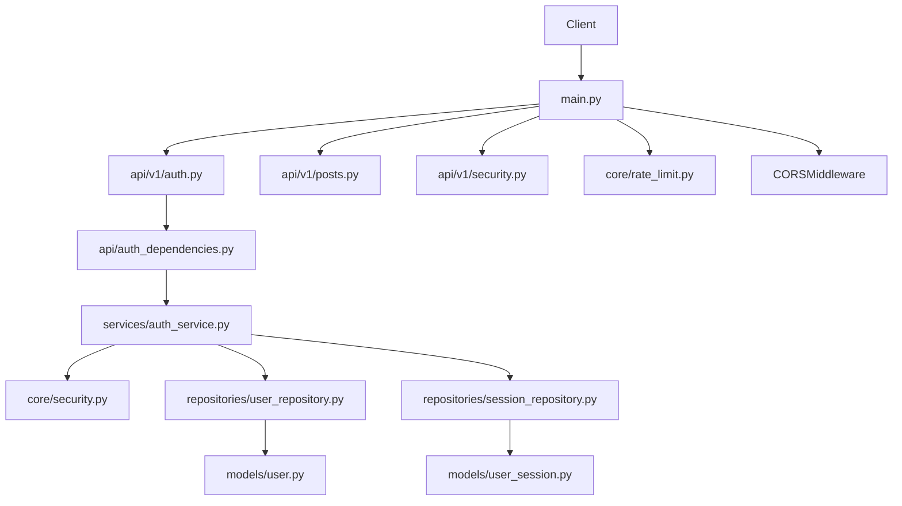
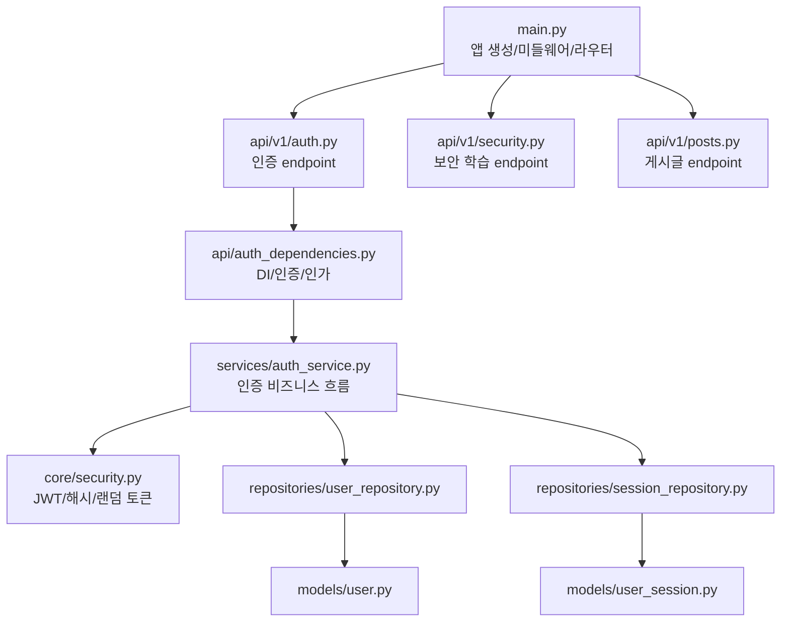
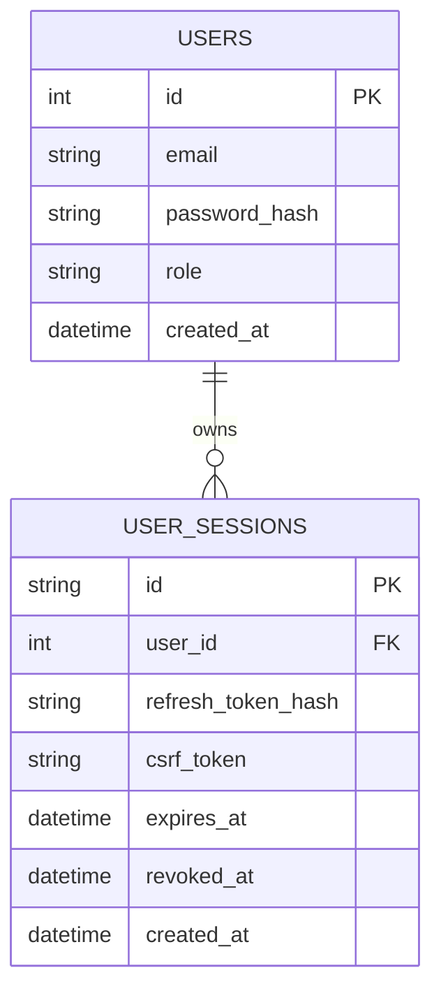
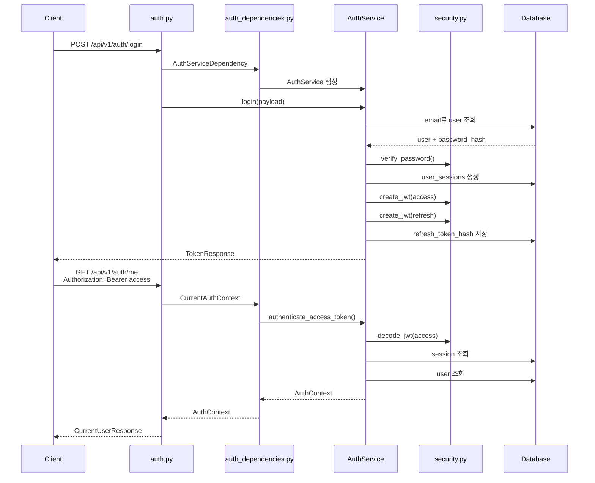

# 프로젝트 코드로 이해하는 인증/인가와 보안 흐름

## 목차

1. 이 문서는 무엇을 학습하기 위한 문서인가?
2. 현재 인증/보안 관련 폴더 구조
3. 앱 시작 시 인증 라우터와 보안 설정은 어디서 연결되는가?
4. 로그인 요청은 어디로 들어오는가?
5. 사용자 테이블과 세션 테이블은 어디에 정의되는가?
6. 비밀번호와 JWT는 어디서 처리되는가?
7. access token과 refresh token은 어디서 발급되는가?
8. access token은 어떻게 검증되는가?
9. 로그인된 사용자는 어떻게 확인하는가?
10. 인증과 인가는 코드에서 어떻게 구분되는가?
11. refresh token과 logout은 어떻게 다루는가?
12. CORS/CSRF/HTTPS/Rate Limit은 어디에서 확인하는가?
13. 테스트는 어떤 인증 계약을 고정하는가?
14. 로그인부터 보호 API 호출까지 전체 흐름
15. 현재 구조의 한계와 다음 확장 방향
16. 결론

---

## 1. 이 문서는 무엇을 학습하기 위한 문서인가?

이 문서는 현재 프로젝트에 실제로 추가된 인증/인가와 보안 기본 코드를 따라가며, 로그인 요청부터 인증이 필요한 API 호출까지 어떤 파일들이 연결되는지 이해하기 위한 문서입니다.

이전에는 게시글 API만 있었지만, 원격 브랜치의 최신 변경을 반영한 현재 코드에는 인증 학습용 파일들이 추가되어 있습니다.

핵심 질문은 하나입니다.

> 사용자가 로그인한 뒤 보호 API를 호출하면, 백엔드 안에서 어떤 파일들을 지나 현재 사용자와 권한이 확인되는가?

현재 프로젝트의 인증 흐름은 다음 구성으로 볼 수 있습니다.

```text
POST /api/v1/auth/login
-> api/v1/auth.py
-> api/auth_dependencies.py
-> services/auth_service.py
-> repositories/user_repository.py
-> repositories/session_repository.py
-> core/security.py
-> models/user.py
-> models/user_session.py
-> TokenResponse
```

그리고 보호 API 호출은 다음 흐름을 가집니다.

```text
Authorization: Bearer <access_token>
-> api/auth_dependencies.py
-> AuthService.authenticate_access_token()
-> core/security.decode_jwt()
-> user_sessions 조회
-> users 조회
-> AuthContext 반환
-> endpoint 실행
```



### 연결되는 개념

- 인증(Authentication)
- 인가(Authorization)
- JWT access token
- refresh token
- 서버 세션 테이블
- CSRF token
- CORS
- Rate Limit
- Role 기반 권한 확인
- 테스트로 고정하는 API 계약

### 현재 구조의 한계와 확장 방향

현재 구현은 학습용 인증 흐름을 보여주기 위한 데모입니다. 실제 운영용 인증 시스템으로 쓰기보다는, 팀원이 인증 요청 흐름과 보안 선택지를 함께 설명할 수 있게 만드는 기준 코드에 가깝습니다.

---

## 2. 현재 인증/보안 관련 폴더 구조

현재 프로젝트의 인증/보안 관련 파일은 다음과 같습니다.

```text
backend/app/api/v1/auth.py
backend/app/api/v1/security.py
backend/app/api/auth_dependencies.py
backend/app/api/dependencies.py
backend/app/core/security.py
backend/app/core/rate_limit.py
backend/app/core/config.py
backend/app/models/user.py
backend/app/models/user_session.py
backend/app/repositories/user_repository.py
backend/app/repositories/session_repository.py
backend/app/schemas/auth.py
backend/app/services/auth_service.py
backend/app/db/seeds.py
backend/tests/test_auth_security_flow.py
docs/sprint-2-auth-security.md
```

### 파일별 역할

- [backend/app/main.py](/Users/tail1/Documents/스프린트1/backend/app/main.py:28): FastAPI 앱을 만들고 인증 라우터, 보안 학습 라우터, CORS, Rate Limit middleware를 연결합니다.
- [backend/app/api/v1/auth.py](/Users/tail1/Documents/스프린트1/backend/app/api/v1/auth.py:21): 로그인, refresh, 내 정보, logout, CSRF demo, admin report endpoint를 정의합니다.
- [backend/app/api/auth_dependencies.py](/Users/tail1/Documents/스프린트1/backend/app/api/auth_dependencies.py:24): `AuthService`를 만들고, Bearer token 인증과 role 권한 확인 dependency를 제공합니다.
- [backend/app/services/auth_service.py](/Users/tail1/Documents/스프린트1/backend/app/services/auth_service.py:67): 실제 로그인, 토큰 발급, 토큰 검증, CSRF 검증, logout 흐름을 담당합니다.
- [backend/app/core/security.py](/Users/tail1/Documents/스프린트1/backend/app/core/security.py:25): 비밀번호 해시, secret 해시, JWT 생성/검증, 랜덤 토큰 생성을 담당합니다.
- [backend/app/models/user.py](/Users/tail1/Documents/스프린트1/backend/app/models/user.py:9): `users` 테이블을 정의합니다.
- [backend/app/models/user_session.py](/Users/tail1/Documents/스프린트1/backend/app/models/user_session.py:9): `user_sessions` 테이블을 정의합니다.
- [backend/app/core/rate_limit.py](/Users/tail1/Documents/스프린트1/backend/app/core/rate_limit.py:14): IP와 path 기준의 단순 Rate Limit middleware를 제공합니다.
- [backend/tests/test_auth_security_flow.py](/Users/tail1/Documents/스프린트1/backend/tests/test_auth_security_flow.py:26): 로그인, 보호 API, admin 권한, CSRF, refresh rotation, logout 계약을 테스트합니다.

### 프로젝트 구조도



### 현재 구조의 한계와 확장 방향

현재 인증은 게시글 작성 API에는 아직 연결되어 있지 않습니다. 게시글 API는 [backend/app/api/v1/posts.py](/Users/tail1/Documents/스프린트1/backend/app/api/v1/posts.py:9)에서 `PostServiceDependency`만 받고, `CurrentAuthContext`를 요구하지 않습니다.

즉 인증 학습 endpoint는 구현되어 있지만, 게시글 도메인의 작성자 FK 연결은 아직 다음 확장 과제입니다.

---

## 3. 앱 시작 시 인증 라우터와 보안 설정은 어디서 연결되는가?

인증 기능은 [backend/app/main.py](/Users/tail1/Documents/스프린트1/backend/app/main.py:28)의 `create_app()`에서 연결됩니다.

```python
def create_app(database_engine=engine) -> FastAPI:
    app = FastAPI(
        title="Sprint 1 API Data Flow",
        lifespan=create_lifespan(database_engine),
    )
    register_error_handlers(app)
    app.add_middleware(SimpleRateLimitMiddleware)
    app.add_middleware(
        CORSMiddleware,
        allow_origins=list(settings.allowed_origins),
        allow_credentials=True,
        allow_methods=["*"],
        allow_headers=["*"],
    )
    app.include_router(posts_router, prefix="/api/v1")
    app.include_router(auth_router, prefix="/api/v1")
    app.include_router(security_router, prefix="/api/v1")
    return app
```

여기서 중요한 연결은 세 가지입니다.

- `SimpleRateLimitMiddleware`: 모든 요청에 대해 단순 요청 제한을 적용합니다.
- `CORSMiddleware`: 프론트엔드 origin 허용 정책을 적용합니다.
- `auth_router`: `/api/v1/auth` 아래 로그인/refresh/logout/me/admin API를 붙입니다.

서버 시작 시에는 [backend/app/main.py](/Users/tail1/Documents/스프린트1/backend/app/main.py:18)의 `create_lifespan()`에서 테이블을 만들고 demo user를 심습니다.

```python
def create_lifespan(database_engine=engine):
    @asynccontextmanager
    async def lifespan(_: FastAPI) -> AsyncIterator[None]:
        Base.metadata.create_all(bind=database_engine)
        seed_demo_users(database_engine)
        yield

    return lifespan
```

### 연결되는 개념

`main.py`는 인증 기능의 입구입니다. 라우터만 만든다고 인증 기능이 서비스에 붙는 것이 아니라, 앱에 라우터와 미들웨어가 등록되어야 실제 HTTP 요청이 해당 코드로 들어옵니다.

### 현재 구조의 한계와 확장 방향

`allow_methods=["*"]`, `allow_headers=["*"]`는 학습용으로 편합니다. 운영에서는 허용 method와 header를 필요한 범위로 줄이는 것이 좋습니다.

---

## 4. 로그인 요청은 어디로 들어오는가?

로그인 요청은 [backend/app/api/v1/auth.py](/Users/tail1/Documents/스프린트1/backend/app/api/v1/auth.py:24)의 `/auth/login` endpoint로 들어옵니다.

```python
@router.post("/login", response_model=TokenResponse, status_code=status.HTTP_200_OK)
def login(payload: LoginRequest, service: AuthServiceDependency) -> TokenResponse:
    return service.login(payload)
```

최종 경로는 `main.py`의 `/api/v1` prefix와 합쳐져 다음이 됩니다.

```http
POST /api/v1/auth/login
```

요청 body는 [backend/app/schemas/auth.py](/Users/tail1/Documents/스프린트1/backend/app/schemas/auth.py:6)의 `LoginRequest`가 검증합니다.

```python
class LoginRequest(BaseModel):
    email: str = Field(examples=["member@sprint.local"])
    password: str = Field(examples=["password123"])
```

로그인 성공 응답은 [backend/app/schemas/auth.py](/Users/tail1/Documents/스프린트1/backend/app/schemas/auth.py:15)의 `TokenResponse` 형태입니다.

```python
class TokenResponse(BaseModel):
    access_token: str
    refresh_token: str
    token_type: str = "Bearer"
    expires_in: int
    refresh_expires_in: int
    session_id: str
    csrf_token: str
```

### 요청과 응답 예시

```http
POST /api/v1/auth/login HTTP/1.1
Content-Type: application/json

{
  "email": "member@sprint.local",
  "password": "password123"
}
```

```json
{
  "access_token": "...",
  "refresh_token": "...",
  "token_type": "Bearer",
  "expires_in": 900,
  "refresh_expires_in": 604800,
  "session_id": "...",
  "csrf_token": "..."
}
```

### 현재 구조의 한계와 확장 방향

현재 `LoginRequest.email`은 `str`입니다. 운영 수준의 입력 검증을 더 강하게 하려면 `EmailStr` 사용, 비밀번호 길이 제한, 로그인 실패 rate limit 세분화 등을 고려할 수 있습니다.

---

## 5. 사용자 테이블과 세션 테이블은 어디에 정의되는가?

사용자 테이블은 [backend/app/models/user.py](/Users/tail1/Documents/스프린트1/backend/app/models/user.py:9)에 있습니다.

```python
class User(Base):
    __tablename__ = "users"
    __table_args__ = (Index("ix_users_email", "email", unique=True),)

    id: Mapped[int] = mapped_column(primary_key=True, index=True)
    email: Mapped[str] = mapped_column(String(255), nullable=False, unique=True)
    password_hash: Mapped[str] = mapped_column(String(255), nullable=False)
    role: Mapped[str] = mapped_column(String(40), nullable=False, default="member")
    created_at: Mapped[datetime] = mapped_column(DateTime, nullable=False, default=datetime.utcnow)
```

세션 테이블은 [backend/app/models/user_session.py](/Users/tail1/Documents/스프린트1/backend/app/models/user_session.py:9)에 있습니다.

```python
class UserSession(Base):
    __tablename__ = "user_sessions"

    id: Mapped[str] = mapped_column(String(36), primary_key=True)
    user_id: Mapped[int] = mapped_column(ForeignKey("users.id"), nullable=False, index=True)
    refresh_token_hash: Mapped[str] = mapped_column(String(255), nullable=False)
    csrf_token: Mapped[str] = mapped_column(String(255), nullable=False)
    expires_at: Mapped[datetime] = mapped_column(DateTime, nullable=False)
    revoked_at: Mapped[datetime | None] = mapped_column(DateTime, nullable=True)
    created_at: Mapped[datetime] = mapped_column(DateTime, nullable=False, default=datetime.utcnow)
```

ERD로 보면 다음과 같습니다.



### 연결되는 개념

이 프로젝트는 JWT만 쓰는 구조가 아니라, `user_sessions` 테이블도 함께 사용합니다. access token과 refresh token 안에는 `sid`가 들어가고, 서버는 이 `sid`로 세션이 살아 있는지 확인합니다.

즉 "토큰을 들고 있으면 끝"이 아니라, 서버 DB의 세션 상태도 함께 봅니다.

### 현재 구조의 한계와 확장 방향

현재 `posts` 테이블은 아직 `users.id`를 FK로 참조하지 않습니다. [backend/app/models/post.py](/Users/tail1/Documents/스프린트1/backend/app/models/post.py:16)는 여전히 `author_name` 문자열을 사용합니다. 다음 단계에서는 `posts.user_id -> users.id`로 연결하면 인증과 게시글 도메인이 실제로 이어집니다.

---

## 6. 비밀번호와 JWT는 어디서 처리되는가?

비밀번호와 JWT 관련 함수는 [backend/app/core/security.py](/Users/tail1/Documents/스프린트1/backend/app/core/security.py:25)에 있습니다.

비밀번호 해시는 다음 함수가 담당합니다.

```python
def hash_password(password: str) -> str:
    salt = "sprint-demo-salt"
    return hash_secret(f"{salt}:{password}")


def verify_password(password: str, password_hash: str) -> bool:
    return hmac.compare_digest(hash_password(password), password_hash)
```

JWT 생성은 [backend/app/core/security.py](/Users/tail1/Documents/스프린트1/backend/app/core/security.py:47)의 `create_jwt()`가 담당합니다.

```python
def create_jwt(
    *,
    subject: int,
    role: str,
    token_type: str,
    session_id: str,
    expires_delta: timedelta,
    jwt_id: str | None = None,
) -> str:
```

payload에는 다음 값들이 들어갑니다.

```text
sub  -> 사용자 id
role -> 사용자 role
type -> access 또는 refresh
sid  -> 서버 세션 id
jti  -> JWT id
iat  -> 발급 시각
exp  -> 만료 시각
```

JWT 검증은 [backend/app/core/security.py](/Users/tail1/Documents/스프린트1/backend/app/core/security.py:77)의 `decode_jwt()`가 담당합니다.

검증 내용은 다음과 같습니다.

- 토큰이 `header.payload.signature` 형식인지 확인
- HMAC 서명 검증
- `exp` 만료 시간 확인
- 기대한 token type인지 확인

### 주의할 점

현재 비밀번호 해시는 학습용 단순 SHA-256 + 고정 salt 구조입니다. 실제 서비스에서는 bcrypt, argon2 같은 password hashing 알고리즘을 사용해야 합니다.

또한 현재 JWT 구현은 학습을 위해 직접 base64url, HMAC 처리를 보여줍니다. 운영에서는 검증된 JWT 라이브러리를 사용하고 key rotation, algorithm 고정, 예외 처리, clock skew 같은 요소를 더 엄격히 다룹니다.

---

## 7. access token과 refresh token은 어디서 발급되는가?

토큰 발급은 [backend/app/services/auth_service.py](/Users/tail1/Documents/스프린트1/backend/app/services/auth_service.py:169)의 `_issue_tokens()`가 담당합니다.

```python
def _issue_tokens(self, *, user: User, session: UserSession) -> TokenResponse:
    refresh_jti = str(uuid4())
    csrf_token = random_token()
    access_token = create_jwt(
        subject=user.id,
        role=user.role,
        token_type="access",
        session_id=session.id,
        expires_delta=timedelta(seconds=settings.access_token_seconds),
    )
    refresh_token = create_jwt(
        subject=user.id,
        role=user.role,
        token_type="refresh",
        session_id=session.id,
        expires_delta=timedelta(seconds=settings.refresh_token_seconds),
        jwt_id=refresh_jti,
    )
```

로그인 흐름은 [backend/app/services/auth_service.py](/Users/tail1/Documents/스프린트1/backend/app/services/auth_service.py:78)의 `login()`에서 시작합니다.

```text
1. email로 user 조회
2. password 검증
3. user_sessions row 생성
4. access token / refresh token / csrf token 발급
5. refresh token hash 저장
6. commit
7. TokenResponse 반환
```

실제 코드에서는 refresh token 원문을 DB에 저장하지 않고 [backend/app/services/auth_service.py](/Users/tail1/Documents/스프린트1/backend/app/services/auth_service.py:100)에서 `hash_secret(tokens.refresh_token)`을 저장합니다.

### 연결되는 개념

access token은 보호 API 호출에 사용합니다. refresh token은 access token을 새로 발급받기 위해 사용합니다. 이 프로젝트는 refresh token을 재발급할 때 새 refresh token으로 교체하는 rotation 흐름도 보여줍니다.

### 현재 구조의 한계와 확장 방향

현재 refresh token 재사용 감지는 "저장된 hash와 다르면 401" 수준입니다. 운영에서는 재사용이 감지되면 해당 사용자 세션 전체 폐기, 보안 알림, 기기별 세션 관리까지 확장할 수 있습니다.

---

## 8. access token은 어떻게 검증되는가?

access token 검증은 [backend/app/services/auth_service.py](/Users/tail1/Documents/스프린트1/backend/app/services/auth_service.py:137)의 `authenticate_access_token()`에서 시작합니다.

```python
def authenticate_access_token(self, access_token: str) -> AuthContext:
    payload = decode_jwt(access_token, expected_type="access")
    session = self._get_active_session(payload["sid"])
    user = self._get_user(int(payload["sub"]))

    if session.user_id != user.id:
        raise AppError(
            code="SESSION_USER_MISMATCH",
            message="토큰 사용자와 세션 사용자가 일치하지 않습니다.",
            status_code=status.HTTP_401_UNAUTHORIZED,
        )

    return AuthContext(user=user, session_id=session.id, token_payload=payload)
```

검증 순서는 다음과 같습니다.

```text
1. JWT 서명과 만료 시간을 검증한다.
2. token type이 access인지 확인한다.
3. payload의 sid로 user_sessions를 조회한다.
4. 세션이 폐기되었거나 만료되었는지 확인한다.
5. payload의 sub로 users를 조회한다.
6. 세션의 user_id와 token의 user_id가 같은지 확인한다.
7. AuthContext를 반환한다.
```

### 연결되는 개념

이 구조는 JWT와 서버 세션을 함께 사용합니다. JWT만 검증하는 구조보다 서버가 세션 폐기와 logout을 더 명확하게 처리할 수 있습니다.

### 현재 구조의 한계와 확장 방향

현재 `User` 모델에는 `is_active` 컬럼이 없습니다. 계정 비활성화, 탈퇴, 정지 같은 정책을 넣으려면 `users.is_active` 또는 `status` 컬럼을 추가하고 `_get_user()`에서 확인하는 방식으로 확장할 수 있습니다.

---

## 9. 로그인된 사용자는 어떻게 확인하는가?

FastAPI dependency 연결은 [backend/app/api/auth_dependencies.py](/Users/tail1/Documents/스프린트1/backend/app/api/auth_dependencies.py:35)의 `get_current_auth_context()`가 담당합니다.

```python
def get_current_auth_context(
    credentials: Annotated[HTTPAuthorizationCredentials | None, Depends(bearer_scheme)],
    service: AuthServiceDependency,
) -> AuthContext:
    if credentials is None:
        raise AppError(
            code="AUTH_REQUIRED",
            message="Authorization Bearer 토큰이 필요합니다.",
            status_code=status.HTTP_401_UNAUTHORIZED,
        )
    return service.authenticate_access_token(credentials.credentials)
```

이 dependency는 아래 alias로 endpoint에서 사용됩니다.

```python
CurrentAuthContext = Annotated[AuthContext, Depends(get_current_auth_context)]
```

실제 사용 예시는 [backend/app/api/v1/auth.py](/Users/tail1/Documents/스프린트1/backend/app/api/v1/auth.py:34)의 `/auth/me`입니다.

```python
@router.get("/me", response_model=CurrentUserResponse)
def me(context: CurrentAuthContext) -> CurrentUserResponse:
    return CurrentUserResponse(
        id=context.user.id,
        email=context.user.email,
        role=context.user.role,
        session_id=context.session_id,
    )
```

### 연결되는 개념

`CurrentAuthContext`는 "이 요청의 현재 로그인 사용자"를 endpoint에 전달하는 통로입니다. endpoint는 직접 토큰을 파싱하지 않고, dependency가 인증 실패를 먼저 처리합니다.

### 현재 구조의 한계와 확장 방향

현재 게시글 API에는 이 dependency가 붙어 있지 않습니다. 게시글 작성 API를 로그인 사용자 전용으로 만들려면 [backend/app/api/v1/posts.py](/Users/tail1/Documents/스프린트1/backend/app/api/v1/posts.py:9)에 `CurrentAuthContext`를 추가하고, `PostService.create()`가 `context.user.id`를 받도록 바꿔야 합니다.

---

## 10. 인증과 인가는 코드에서 어떻게 구분되는가?

인증은 `CurrentAuthContext`를 만드는 과정입니다. 토큰이 없거나 잘못되면 `401 Unauthorized`가 발생합니다.

인가는 인증된 사용자의 role이나 리소스 소유권을 확인하는 과정입니다. 이 프로젝트에서는 role 기반 인가 예시가 있습니다.

[backend/app/api/auth_dependencies.py](/Users/tail1/Documents/스프린트1/backend/app/api/auth_dependencies.py:63)의 `require_role()`은 특정 role이 아니면 `403 Forbidden`을 반환합니다.

```python
def require_role(role: str) -> Callable[[CurrentAuthContext], AuthContext]:
    def dependency(context: CurrentAuthContext) -> AuthContext:
        if context.user.role != role:
            raise AppError(
                code="FORBIDDEN",
                message="요청한 리소스에 접근할 권한이 없습니다.",
                status_code=status.HTTP_403_FORBIDDEN,
                details={"required_role": role, "current_role": context.user.role},
            )
        return context

    return dependency
```

실제 admin 전용 API는 [backend/app/api/v1/auth.py](/Users/tail1/Documents/스프린트1/backend/app/api/v1/auth.py:59)에 있습니다.

```python
@router.get("/admin/report", response_model=AdminReportResponse)
def admin_report(
    context: AuthContext = Depends(require_role("admin")),
) -> AdminReportResponse:
```

### API 표시 방식

| Method | Path | 인증 | 권한 | 코드 위치 |
| --- | --- | --- | --- | --- |
| `POST` | `/api/v1/auth/login` | 불필요 | 공개 | `auth.py` |
| `POST` | `/api/v1/auth/refresh` | 불필요 | refresh token 필요 | `auth.py` |
| `GET` | `/api/v1/auth/me` | 필요 | 로그인 사용자 | `CurrentAuthContext` |
| `POST` | `/api/v1/auth/logout` | 필요 | 로그인 사용자 | `CurrentAuthContext` |
| `POST` | `/api/v1/auth/session-action` | 필요 | 로그인 + CSRF | `CsrfProtectedContext` |
| `GET` | `/api/v1/auth/admin/report` | 필요 | admin | `require_role("admin")` |
| `GET` | `/api/v1/posts` | 불필요 | 공개 | 현재 보호 없음 |
| `POST` | `/api/v1/posts` | 불필요 | 공개 | 현재 보호 없음 |

### 현재 구조의 한계와 확장 방향

현재 인가 예시는 role 기반입니다. 게시글 수정/삭제 같은 리소스 소유권 기반 인가는 아직 없습니다. 다음 단계에서는 `post.user_id == context.user.id` 또는 `context.user.role == "admin"` 같은 규칙이 필요합니다.

---

## 11. refresh token과 logout은 어떻게 다루는가?

refresh endpoint는 [backend/app/api/v1/auth.py](/Users/tail1/Documents/스프린트1/backend/app/api/v1/auth.py:29)에 있습니다.

```python
@router.post("/refresh", response_model=TokenResponse)
def refresh(payload: RefreshRequest, service: AuthServiceDependency) -> TokenResponse:
    return service.refresh(payload.refresh_token)
```

실제 refresh 로직은 [backend/app/services/auth_service.py](/Users/tail1/Documents/스프린트1/backend/app/services/auth_service.py:110)에 있습니다.

```text
1. refresh token을 decode_jwt(expected_type="refresh")로 검증한다.
2. sid로 active session을 조회한다.
3. refresh token 원문의 hash가 DB의 refresh_token_hash와 같은지 확인한다.
4. user를 조회한다.
5. access token과 refresh token을 새로 발급한다.
6. 새 refresh token hash와 새 csrf token을 저장한다.
7. commit한다.
```

logout endpoint는 [backend/app/api/v1/auth.py](/Users/tail1/Documents/스프린트1/backend/app/api/v1/auth.py:44)에 있습니다.

```python
@router.post("/logout", response_model=LogoutResponse)
def logout(context: CurrentAuthContext, service: AuthServiceDependency) -> LogoutResponse:
    service.logout(context.session_id)
    return LogoutResponse(revoked=True, session_id=context.session_id)
```

logout은 [backend/app/services/auth_service.py](/Users/tail1/Documents/스프린트1/backend/app/services/auth_service.py:160)에서 세션을 revoke합니다.

```python
def logout(self, session_id: str) -> None:
    session = self._get_active_session(session_id)
    try:
        self.sessions.revoke(session, utc_now())
        self.unit_of_work.commit()
    except Exception:
        self.unit_of_work.rollback()
        raise
```

### 연결되는 개념

refresh token은 긴 수명을 가지므로 access token보다 더 조심해야 합니다. 이 프로젝트는 refresh token 원문을 저장하지 않고 hash를 저장하며, refresh 때마다 새 refresh token으로 교체합니다.

### 현재 구조의 한계와 확장 방향

refresh token 재사용이 감지되면 현재는 `REFRESH_TOKEN_REUSED`로 `401`을 반환합니다. 운영에서는 해당 세션뿐 아니라 같은 사용자 전체 세션 폐기까지 검토할 수 있습니다.

---

## 12. CORS/CSRF/HTTPS/Rate Limit은 어디에서 확인하는가?

### CORS

CORS는 [backend/app/main.py](/Users/tail1/Documents/스프린트1/backend/app/main.py:35)에서 `CORSMiddleware`로 설정합니다.

```python
app.add_middleware(
    CORSMiddleware,
    allow_origins=list(settings.allowed_origins),
    allow_credentials=True,
    allow_methods=["*"],
    allow_headers=["*"],
)
```

허용 origin은 [backend/app/core/config.py](/Users/tail1/Documents/스프린트1/backend/app/core/config.py:1)의 `settings.allowed_origins`에서 관리합니다.

### CSRF

CSRF demo endpoint는 [backend/app/api/v1/auth.py](/Users/tail1/Documents/스프린트1/backend/app/api/v1/auth.py:50)의 `/auth/session-action`입니다.

```python
@router.post("/session-action", response_model=CsrfDemoResponse)
def session_action(context: CsrfProtectedContext) -> CsrfDemoResponse:
```

실제 CSRF 검증은 [backend/app/api/auth_dependencies.py](/Users/tail1/Documents/스프린트1/backend/app/api/auth_dependencies.py:51)의 `require_csrf_token()`이 `X-CSRF-Token` header를 읽어 처리합니다.

```python
def require_csrf_token(
    context: CurrentAuthContext,
    service: AuthServiceDependency,
    x_csrf_token: Annotated[str | None, Header(alias="X-CSRF-Token")] = None,
) -> AuthContext:
    service.verify_csrf_token(context.session_id, x_csrf_token)
    return context
```

### HTTPS

HTTPS는 현재 코드 안에서 직접 TLS를 처리하지 않습니다. 보통 운영 배포 환경의 reverse proxy, load balancer, hosting layer에서 담당합니다.

이 프로젝트에서는 [backend/app/api/v1/security.py](/Users/tail1/Documents/스프린트1/backend/app/api/v1/security.py:6)의 `/security/study-guide`가 HTTPS를 학습 항목으로 명시합니다.

### Rate Limit

Rate Limit은 [backend/app/core/rate_limit.py](/Users/tail1/Documents/스프린트1/backend/app/core/rate_limit.py:14)의 `SimpleRateLimitMiddleware`가 담당합니다.

```python
class SimpleRateLimitMiddleware(BaseHTTPMiddleware):
    def __init__(self, app: ASGIApp) -> None:
        super().__init__(app)
        self.requests: dict[str, deque[float]] = defaultdict(deque)
```

요청 제한을 넘으면 [backend/app/core/rate_limit.py](/Users/tail1/Documents/스프린트1/backend/app/core/rate_limit.py:29)에서 `429 Too Many Requests`를 반환합니다.

### 현재 구조의 한계와 확장 방향

현재 Rate Limit은 프로세스 메모리 기반입니다. 서버가 여러 대로 늘어나면 Redis 같은 공용 저장소가 필요합니다. HTTPS도 코드가 아니라 배포 설정 영역이므로, 운영 배포 시 별도 체크리스트로 확인해야 합니다.

---

## 13. 테스트는 어떤 인증 계약을 고정하는가?

인증 테스트는 [backend/tests/test_auth_security_flow.py](/Users/tail1/Documents/스프린트1/backend/tests/test_auth_security_flow.py:26)에 있습니다.

테스트가 확인하는 계약은 다음과 같습니다.

- 로그인하면 access token으로 `/api/v1/auth/me`를 호출할 수 있다.
- member role은 admin endpoint를 호출하면 `403`을 받는다.
- admin role은 admin endpoint를 호출할 수 있다.
- CSRF header가 없으면 session-action이 `403`을 반환한다.
- 올바른 `X-CSRF-Token`이 있으면 session-action이 성공한다.
- refresh token을 사용하면 새 refresh token으로 rotation된다.
- 이전 refresh token을 재사용하면 `401`을 받는다.
- logout 후 같은 access token으로 `/auth/me`를 호출하면 `401`을 받는다.

예를 들어 [backend/tests/test_auth_security_flow.py](/Users/tail1/Documents/스프린트1/backend/tests/test_auth_security_flow.py:78)의 refresh/logout 테스트는 token lifecycle의 핵심 계약을 보여줍니다.

```python
def test_refresh_rotates_refresh_token_and_logout_revokes_session() -> None:
    tokens = login()
    refresh_response = client.post(
        "/api/v1/auth/refresh",
        json={"refresh_token": tokens["refresh_token"]},
    )
    assert refresh_response.status_code == 200
```

### 연결되는 개념

테스트는 문서의 설명을 코드 계약으로 고정합니다. 인증은 "대충 로그인 된다"보다 실패 조건이 중요하므로, `401`, `403`, `429`, refresh 재사용 실패 같은 테스트가 특히 중요합니다.

### 현재 구조의 한계와 확장 방향

게시글 API와 인증 사용자가 연결되는 테스트는 아직 없습니다. 다음 단계에서는 "토큰이 없으면 게시글 작성 실패", "로그인 사용자의 `user_id`로 게시글 저장", "다른 사용자의 게시글 수정 실패" 같은 테스트가 필요합니다.

---

## 14. 로그인부터 보호 API 호출까지 전체 흐름

이 장은 팀원 모두가 설명할 수 있어야 하는 핵심 흐름입니다.

### 1단계: 로그인 요청

```http
POST /api/v1/auth/login
Content-Type: application/json

{
  "email": "member@sprint.local",
  "password": "password123"
}
```

흐름:

```text
api/v1/auth.py
-> AuthServiceDependency
-> AuthService.login()
-> UserRepository.get_by_email()
-> verify_password()
-> UserSession 생성
-> _issue_tokens()
-> refresh token hash 저장
-> commit
```

### 2단계: access token으로 보호 API 호출

```http
GET /api/v1/auth/me
Authorization: Bearer <access_token>
```

흐름:

```text
api/v1/auth.py
-> CurrentAuthContext
-> get_current_auth_context()
-> AuthService.authenticate_access_token()
-> decode_jwt(expected_type="access")
-> _get_active_session()
-> _get_user()
-> CurrentUserResponse
```

### 3단계: admin 권한 API 호출

```http
GET /api/v1/auth/admin/report
Authorization: Bearer <access_token>
```

흐름:

```text
require_role("admin")
-> CurrentAuthContext로 먼저 인증
-> context.user.role 확인
-> admin이면 200
-> admin이 아니면 403
```

### 전체 흐름도



### 현재 구조의 한계와 확장 방향

현재 보호 API 예시는 `/auth/me`, `/auth/logout`, `/auth/session-action`, `/auth/admin/report`입니다. 게시글 작성 API는 아직 보호 API가 아닙니다.

---

## 15. 현재 구조의 한계와 다음 확장 방향

현재 구현된 것과 앞으로 확장할 것을 구분하면 다음과 같습니다.

| 영역 | 현재 상태 | 다음 확장 |
| --- | --- | --- |
| 사용자 테이블 | `users` 구현됨 | `is_active`, profile, OAuth provider 연결 |
| 세션 테이블 | `user_sessions` 구현됨 | 기기 정보, IP, user agent, 전체 세션 폐기 |
| 로그인 API | 구현됨 | 회원가입, 비밀번호 재설정 |
| access token | 구현됨 | 검증 라이브러리 사용, key rotation |
| refresh token | hash 저장 + rotation 구현됨 | 재사용 감지 시 전체 세션 폐기 |
| CSRF | demo endpoint 구현됨 | 쿠키 인증 정책과 실제 변경 API 연결 |
| CORS | middleware 구현됨 | 운영 origin 최소화 |
| Rate Limit | 메모리 기반 구현됨 | Redis 기반 분산 rate limit |
| 게시글 인증 | 아직 미연결 | `CurrentAuthContext`와 `posts.user_id` 연결 |
| OAuth2/OIDC | 미구현 | 소셜 로그인/SSO 필요 시 추가 |

### 다음 단계 추천

1. `posts.user_id`를 추가하고 `users.id`와 FK로 연결합니다.
2. 게시글 생성 API에 `CurrentAuthContext`를 붙입니다.
3. 게시글 수정/삭제 API를 만들고 작성자 또는 admin만 가능하게 합니다.
4. 게시글 인증 흐름을 테스트로 고정합니다.
5. 비밀번호 해시를 운영용 알고리즘으로 교체합니다.
6. Rate Limit 저장소를 Redis로 바꿀 수 있는 구조로 분리합니다.

---

## 16. 결론

현재 프로젝트에는 인증/인가와 보안 기본 흐름을 학습하기 위한 실제 코드가 추가되어 있습니다.

로그인 요청은 [backend/app/api/v1/auth.py](/Users/tail1/Documents/스프린트1/backend/app/api/v1/auth.py:24)로 들어오고, [backend/app/services/auth_service.py](/Users/tail1/Documents/스프린트1/backend/app/services/auth_service.py:78)가 사용자 조회, 비밀번호 검증, 세션 생성, 토큰 발급을 처리합니다. 보호 API는 [backend/app/api/auth_dependencies.py](/Users/tail1/Documents/스프린트1/backend/app/api/auth_dependencies.py:35)의 `CurrentAuthContext`를 통해 access token을 검증하고 현재 사용자를 확인합니다.

중요한 것은 JWT 코드 자체를 외우는 것이 아닙니다. 팀원 모두가 "로그인 요청부터 보호 API 호출까지 어떤 파일을 지나고, 어느 지점에서 401과 403이 갈리는지" 설명할 수 있어야 합니다.

이제 다음 학습 포인트는 인증 코드를 게시글 도메인과 연결하는 것입니다. `users`, `user_sessions`, token lifecycle은 준비되었으므로, `posts.user_id`와 보호된 게시글 작성/수정/삭제 API를 만들면 인증/인가가 실제 서비스 기능과 이어집니다.
