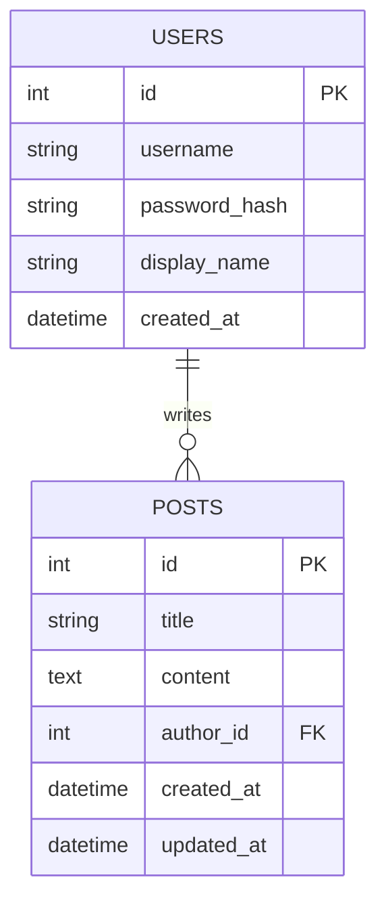
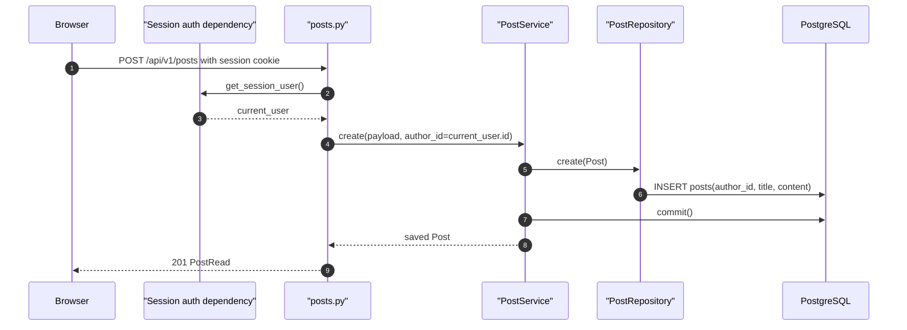
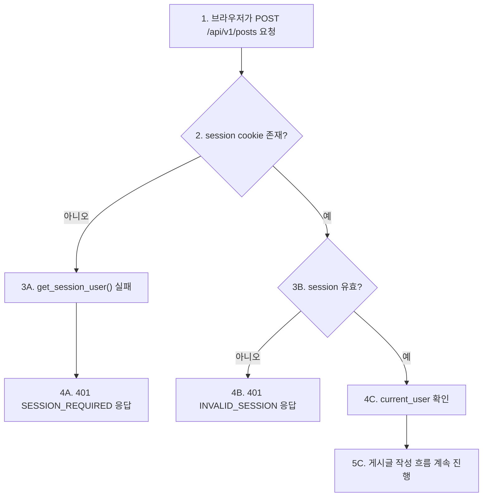

# Sprint 1 구현 기록

## 1. 구현 목표

Sprint 1의 목표는 AI 지식 공유 게시판의 기반 모델과 요청 흐름을 Session 인증과 연결 가능한 구조로 정리하는 것입니다.

이번 구현에서는 게시글 작성자를 단순 문자열이 아니라 `User`와의 FK 관계로 연결했습니다. 이렇게 해야 Sprint 2에서 Session으로 확인한 현재 사용자를 게시글 작성자로 저장할 수 있습니다.

## 2. 확정한 설계 결정

| 항목 | 결정 |
| --- | --- |
| DB schema 변경 방식 | Alembic 없이 로컬 DB reset 방식 사용 |
| 게시글 작성자 | `posts.author_id -> users.id` FK |
| 기존 `author_name` | 제거 |
| 수정 시각 | `posts.updated_at` 추가 |
| 게시글 응답 작성자 표시 | `author_display_name` 포함 |
| Comment/Tag | 다음 Sprint에서 구현 |
| 게시글 작성 인증 | Session 사용자 기준으로 작성자 연결 |
| 게시글 수정/삭제 권한 | 다음 CRUD Sprint에서 구현 |

## 3. 변경한 파일

```text
backend/app/models/user.py
backend/app/models/post.py
backend/app/schemas/post.py
backend/app/repositories/post_repository.py
backend/app/services/post_service.py
backend/app/api/v1/posts.py
backend/tests/test_post_service.py
backend/tests/test_posts_flow.py
```

## 4. 모델 변경

기존 구조:

```text
posts
- id
- title
- content
- author_name
- created_at
```

변경 후 구조:

```text
users
- id
- username
- password_hash
- display_name
- created_at

posts
- id
- title
- content
- author_id
- created_at
- updated_at
```

관계:



ERD 읽는 법:

```text
1. USERS는 게시글 작성자가 되는 사용자 테이블이다.
2. POSTS는 게시글 본문 데이터를 저장하는 테이블이다.
3. POSTS.author_id는 USERS.id를 참조하는 FK다.
4. 사용자 1명은 게시글 여러 개를 작성할 수 있고, 게시글 1개는 작성자 1명에 연결된다.
5. 이 구조 덕분에 Sprint 2에서 Session으로 확인한 current_user.id를 posts.author_id에 저장할 수 있다.
```

## 5. 요청/응답 변경

기존 게시글 생성 요청:

```json
{
  "title": "스프린트 1",
  "content": "API와 DB 흐름",
  "author_name": "team1"
}
```

변경 후 게시글 생성 요청:

```json
{
  "title": "스프린트 1",
  "content": "API와 DB 흐름"
}
```

작성자는 request body에서 받지 않습니다. Session cookie로 현재 사용자를 확인하고, 서버가 `current_user.id`를 `posts.author_id`로 저장합니다.

응답 예시:

```json
{
  "id": 1,
  "title": "스프린트 1",
  "content": "API와 DB 흐름",
  "author_id": 1,
  "author_display_name": "Team One",
  "created_at": "2026-06-14T10:00:00",
  "updated_at": "2026-06-14T10:00:00"
}
```

## 6. 현재 게시글 작성 흐름



단계별 읽기:

```text
1. 브라우저가 session cookie를 포함해 POST /api/v1/posts 요청을 보낸다.
2. posts.py router는 게시글을 저장하기 전에 get_session_user() dependency를 실행한다.
3. get_session_user()가 session cookie를 검증하고 current_user를 만든다.
4. router는 request body에서 작성자를 받지 않고 current_user.id를 author_id로 넘긴다.
5. PostService.create()는 payload와 author_id로 Post 객체를 만든다.
6. PostRepository.create()가 posts table에 INSERT한다.
7. PostService가 commit해서 트랜잭션을 확정한다.
8. 저장된 Post가 router로 돌아온다.
9. router는 PostRead 형식으로 201 응답을 반환한다.
```

## 7. 에러 흐름

Session 없이 게시글 생성을 시도하면 `get_session_user()` 단계에서 실패합니다.



에러 흐름 읽는 법:

```text
1-2에서 게시글 작성 요청에 session cookie가 있는지 먼저 본다.
3A-4A는 cookie 자체가 없는 경우다.
3B-4B는 cookie는 있지만 DB에서 유효한 session을 찾지 못한 경우다.
4C-5C는 인증을 통과해 게시글 작성 로직으로 넘어가는 정상 흐름이다.
```

```text
POST /api/v1/posts
-> session cookie 없음
-> 401 SESSION_REQUIRED
```

이 흐름은 Sprint 2 Session 인증 완료 기준과도 연결됩니다.

## 8. 테스트 변경

테스트는 더 이상 `author_name`을 request body에 넣지 않습니다.

`test_posts_flow.py`는 아래 순서로 바뀌었습니다.

```text
1. 테스트 사용자 회원가입
2. Session 로그인
3. session cookie를 가진 client로 게시글 작성
4. 응답의 author_id, author_display_name 확인
5. session 없이 게시글 작성 시 401 확인
```

`test_post_service.py`는 `PostService.create(payload, author_id)` 형태를 검증합니다.

## 9. 검증 결과

아래 명령으로 전체 백엔드 테스트를 실행했습니다.

```bash
.venv/bin/python -m pytest backend/tests
```

결과:

```text
8 passed
```

## 10. Sprint 1 완료 판단

완료된 것:

- User 모델 존재
- Post 모델이 User와 FK로 연결됨
- Post에 `updated_at` 추가
- Post 응답에 `author_display_name` 포함
- Session 사용자 기반 게시글 작성 흐름 연결
- 비로그인 게시글 작성 실패 확인
- 테스트 통과

다음 Sprint로 넘길 것:

- 게시글 수정/삭제
- 작성자 권한 확인
- Comment/Tag 모델 및 API
- Alembic 도입 여부 재검토
- pgvector 준비

## 11. 발표에 사용할 한 문장

```text
Sprint 1에서는 게시글 작성자를 문자열이 아니라 User FK로 연결해,
이후 Session 인증으로 확인한 현재 사용자가 게시글 작성자가 되는 구조를 만들었습니다.
```
