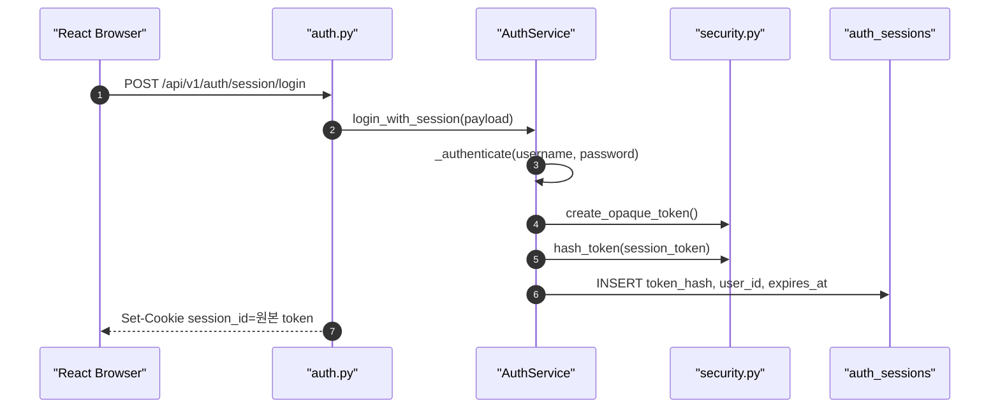
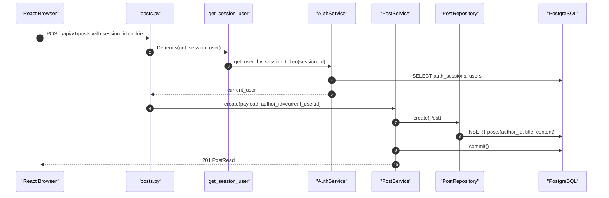
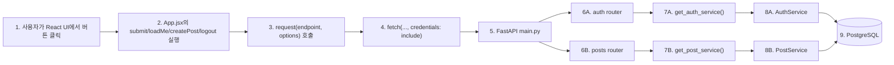
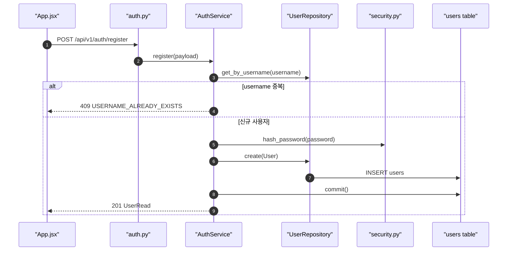
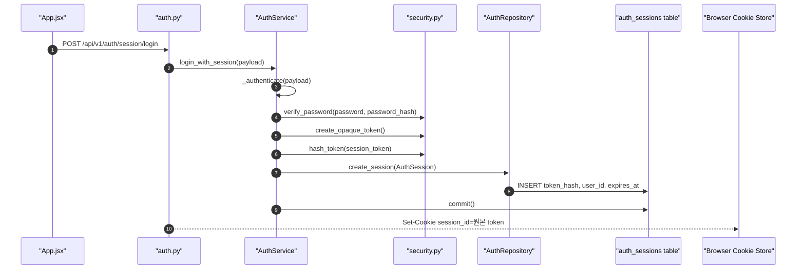
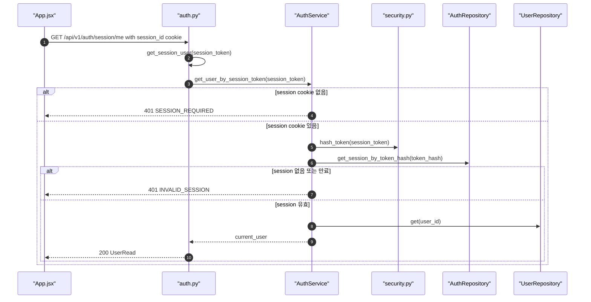
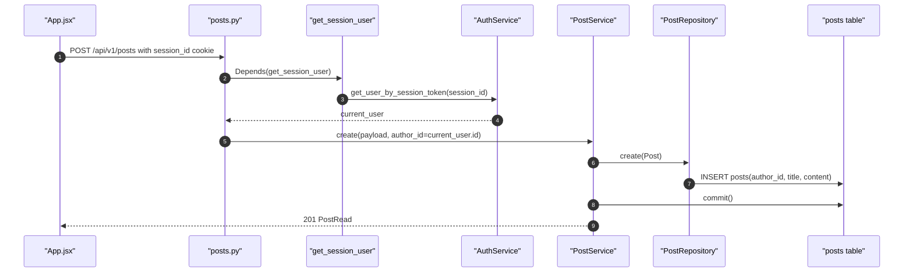
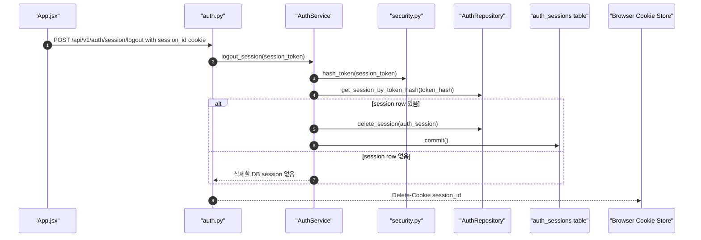
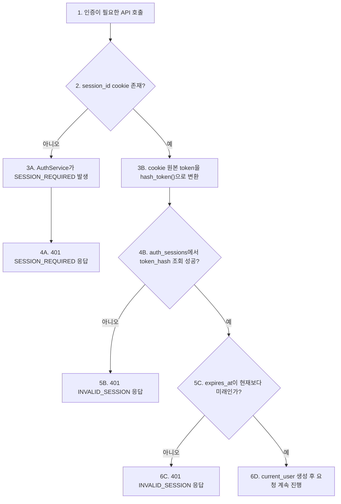
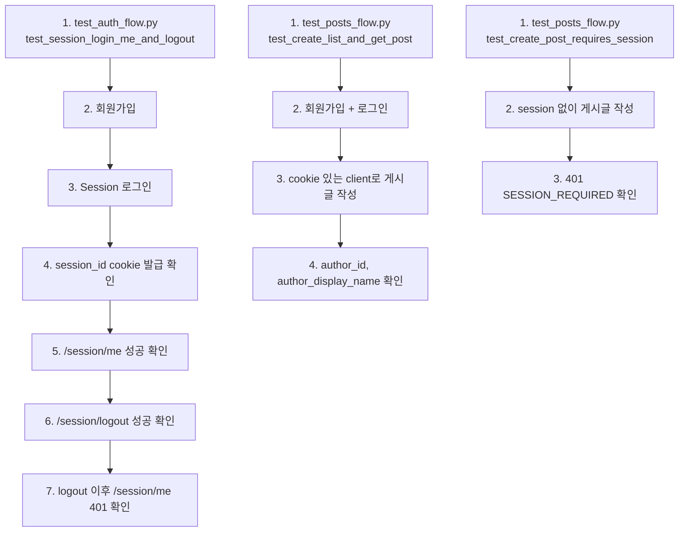

# Sprint 2 구현 기록

## 1. 구현 목표

Sprint 2의 목표는 인증 방식을 **Session only**로 확정하고, 로그인한 사용자가 보호 API인 게시글 작성 요청을 수행할 수 있게 만드는 것입니다.

이번 구현에서는 기존 학습용 JWT access token, access/refresh token pair 코드를 제거하고, Session cookie 기반 인증 흐름만 남겼습니다.

## 2. 확정한 설계 결정

| 항목 | 결정 |
| --- | --- |
| Main auth | Session 인증 |
| JWT/token pair | 구현 코드에서 제거 |
| Session 저장소 | PostgreSQL `auth_sessions` table |
| Cookie 이름 | `session_id` |
| Cookie 옵션 | `HttpOnly`, `SameSite=Lax`, `Path=/` |
| Secure 옵션 | 로컬 `False`, 배포 `True` |
| Session 만료 | absolute timeout 4시간 |
| CSRF token | 이번 Sprint에서는 보류, 한계점 문서화 |
| 보호 API | `POST /api/v1/posts` |
| 403 권한 처리 | 다음 CRUD Sprint에서 구현 |

## 3. 변경한 파일

```text
.env.example
backend/app/core/config.py
backend/app/core/security.py
backend/app/models/auth.py
backend/app/repositories/auth_repository.py
backend/app/schemas/auth.py
backend/app/services/auth_service.py
backend/app/api/v1/auth.py
backend/tests/test_auth_flow.py
frontend/src/App.jsx
frontend/src/styles.css
docs/sprint-2-auth-flow.md
docs/sprint-2-execution-flow-guide.md
docs/repository-overall-flow.md
README.md
```

## 4. 제거한 것

아래 코드는 더 이상 프로젝트 기본 인증 방식에 포함하지 않습니다.

```text
- /api/v1/auth/jwt/login
- /api/v1/auth/jwt/me
- /api/v1/auth/token-pair/login
- /api/v1/auth/token-pair/refresh
- /api/v1/auth/token-pair/me
- /api/v1/auth/token-pair/logout
- RefreshToken model
- RefreshToken request/response schema
- access token 발급/검증 로직
- refresh token rotation 로직
- 프론트엔드 인증 방식 선택 탭
```

## 5. 남긴 Session API

```text
POST /api/v1/auth/register
POST /api/v1/auth/session/login
GET  /api/v1/auth/session/me
POST /api/v1/auth/session/logout
POST /api/v1/posts
```

## 6. 현재 Session 로그인 흐름



단계별 읽기:

```text
1. 브라우저가 로그인 API를 호출한다.
2. auth.py router는 실제 인증 처리를 AuthService로 넘긴다.
3. AuthService는 username/password를 검증한다.
4. 검증에 성공하면 랜덤 session token 원본을 만든다.
5. 원본 token을 hash해서 DB 저장용 token_hash를 만든다.
6. DB에는 token_hash, user_id, expires_at만 저장한다.
7. 브라우저에는 Set-Cookie로 원본 session_id를 내려준다.
```

중요한 점:

```text
브라우저 cookie에는 원본 session token이 들어간다.
DB에는 원본 session token이 아니라 token_hash만 저장한다.
이후 요청에서는 cookie의 원본 token을 다시 hash해서 DB의 token_hash와 비교한다.
```

## 7. 보호 API 게시글 작성 흐름



단계별 읽기:

```text
1. 브라우저가 session_id cookie와 함께 게시글 작성 API를 호출한다.
2. posts.py router는 본문 처리 전에 get_session_user dependency를 실행한다.
3. get_session_user는 cookie의 session_id를 AuthService에 넘긴다.
4. AuthService는 session token을 hash해서 auth_sessions와 users를 조회한다.
5. 세션이 유효하면 current_user가 posts.py로 돌아온다.
6. posts.py는 클라이언트가 보낸 author_id를 믿지 않고 current_user.id를 author_id로 사용한다.
7. PostService가 PostRepository에 저장을 맡긴다.
8. PostRepository가 posts table에 게시글을 저장한다.
9. PostService가 commit하고 생성된 게시글과 작성자 정보를 응답한다.
```

## 8. 전체 흐름을 시각화해서 따라가기

이 섹션의 목적은 코드를 문법 단위로 전부 해석하는 것이 아닙니다.
먼저 Mermaid로 요청 흐름을 잡고, 그 다음 코드에서는 각 단계가 실제로 어떤 함수에 대응되는지만 확인합니다.

코드를 볼 때는 아래 5가지만 체크하면 됩니다.

```text
1. 이 함수는 어떤 요청에서 호출되는가?
2. 입력으로 무엇을 받는가?
3. 다음에 어떤 함수를 호출하는가?
4. DB, cookie, response 중 무엇을 바꾸는가?
5. 실패하면 어떤 에러를 반환하는가?
```

### 8.1 공통 진입점



말로 설명하면:

```text
사용자 행동은 App.jsx의 이벤트 함수로 들어간다.
이벤트 함수는 직접 fetch를 만들지 않고 공통 request()를 사용한다.
request()는 credentials: "include"를 붙여 session_id cookie가 같이 갈 수 있게 한다.
백엔드는 main.py에서 router를 등록하고, router는 service를 dependency로 받아 실제 처리를 맡긴다.
```

코드에서 볼 것:

```text
frontend/src/App.jsx
- App(): 화면 상태와 이벤트 함수가 모여 있는 시작점
- request(endpoint, options): 모든 API 요청이 지나가는 공통 fetch 함수
- 확인할 줄: credentials: "include"

backend/app/main.py
- CORS 설정
- auth/posts router 등록부

backend/app/db/session.py
- get_db(): router/service/repository가 공유하는 DB session 제공

backend/app/api/v1/auth.py
- get_auth_service(): UserRepository, AuthRepository, AuthService 조립

backend/app/api/dependencies.py
- get_post_service(): PostRepository, PostService 조립
```

### 8.2 회원가입 흐름



말로 설명하면:

```text
회원가입은 username 중복 확인이 먼저다.
중복이 아니면 password 원문을 그대로 저장하지 않고 hash_password() 결과를 저장한다.
응답은 UserRead schema를 사용하므로 password_hash는 밖으로 나가지 않는다.
```

코드에서 볼 것:

```text
frontend/src/App.jsx
- submit(event): mode가 register일 때 /api/v1/auth/register 호출

backend/app/api/v1/auth.py
- register(payload, service): request body를 받고 service.register() 호출

backend/app/schemas/auth.py
- UserCreate: 회원가입 요청 body
- UserRead: 회원가입 성공 응답 body

backend/app/services/auth_service.py
- AuthService.register(payload): username 중복 확인, password hash, user 저장

backend/app/repositories/user_repository.py
- UserRepository.get_by_username(username): 중복 확인
- UserRepository.create(user): users table 저장

backend/app/core/security.py
- hash_password(password): 비밀번호 원문을 저장용 hash로 변환

backend/app/models/user.py
- User: users table 구조 확인
```

### 8.3 Session 로그인 흐름



말로 설명하면:

```text
로그인은 username/password 검증으로 시작한다.
검증에 성공하면 서버는 랜덤 session token 원본을 만든다.
원본 token은 브라우저 cookie로 내려가고, DB에는 원본이 아니라 token_hash만 저장된다.
응답 body에는 session token을 넣지 않는다.
```

코드에서 볼 것:

```text
frontend/src/App.jsx
- submit(event): mode가 login일 때 /api/v1/auth/session/login 호출

backend/app/api/v1/auth.py
- session_login(payload, response, service): 로그인 성공 후 response.set_cookie(...) 실행
- 확인할 옵션: httponly, secure, samesite, path, max_age

backend/app/services/auth_service.py
- AuthService.login_with_session(payload): session token 생성과 DB 저장 흐름
- AuthService._authenticate(payload): username/password 검증

backend/app/core/security.py
- verify_password(password, password_hash): 비밀번호 검증
- create_opaque_token(): cookie에 넣을 원본 session token 생성
- hash_token(token): DB 저장용 token_hash 생성
- utcnow(): expires_at 계산 기준 시간

backend/app/models/auth.py
- AuthSession: user_id, token_hash, expires_at 저장 구조

backend/app/repositories/auth_repository.py
- AuthRepository.create_session(auth_session): auth_sessions table 저장
```

### 8.4 현재 사용자 확인 흐름



말로 설명하면:

```text
브라우저가 /session/me를 호출하면 session_id cookie가 함께 간다.
auth.py의 get_session_user()가 cookie 값을 꺼내 AuthService에 넘긴다.
서버는 cookie 원본 token을 다시 hash해서 auth_sessions.token_hash와 비교한다.
세션이 유효하면 users table에서 current_user를 조회한다.
```

코드에서 볼 것:

```text
frontend/src/App.jsx
- loadMe(): /api/v1/auth/session/me 호출
- request(): cookie가 같이 가도록 credentials: "include" 사용

backend/app/api/v1/auth.py
- get_session_user(session_token, service): Cookie에서 session_id를 받는 dependency
- session_me(current_user): get_session_user()가 반환한 User를 그대로 응답

backend/app/services/auth_service.py
- AuthService.get_user_by_session_token(session_token): session 없음, 만료, user 없음 처리

backend/app/core/security.py
- hash_token(token): cookie 원본 token을 DB 조회용 hash로 변환
- utcnow(): expires_at 만료 판단

backend/app/repositories/auth_repository.py
- AuthRepository.get_session_by_token_hash(token_hash): auth_sessions 조회

backend/app/repositories/user_repository.py
- UserRepository.get(user_id): current_user 조회
```

### 8.5 보호 API 게시글 작성 흐름



말로 설명하면:

```text
게시글 작성은 보호 API다.
posts.py의 create_post()는 실행 전에 get_session_user dependency로 current_user를 받아야 한다.
따라서 session이 없으면 게시글 저장 로직까지 가지 못한다.
클라이언트가 author_id를 보내지 않고, 서버가 current_user.id를 author_id로 저장한다.
```

코드에서 볼 것:

```text
frontend/src/App.jsx
- createPost(event): /api/v1/posts 호출

backend/app/api/v1/posts.py
- create_post(payload, current_user, service): current_user: User = Depends(get_session_user) 확인

backend/app/api/v1/auth.py
- get_session_user(session_token, service): 게시글 작성 전에 실행되는 인증 관문

backend/app/services/auth_service.py
- AuthService.get_user_by_session_token(session_token): current_user 생성

backend/app/services/post_service.py
- PostService.create(payload, author_id): Post 객체 생성, commit

backend/app/repositories/post_repository.py
- PostRepository.create(post): posts table INSERT

backend/app/models/post.py
- Post: author_id FK와 author relationship 확인

backend/app/schemas/post.py
- PostCreate: 요청에는 author_id가 없는지 확인
- PostRead: 응답에는 author_id, author_display_name이 있는지 확인
```

### 8.6 로그아웃 흐름



말로 설명하면:

```text
로그아웃은 서버 DB의 session row를 삭제하고, 브라우저 cookie도 지우는 흐름이다.
DB row만 지우면 브라우저에는 낡은 cookie가 남고, cookie만 지우면 서버에는 불필요한 session row가 남는다.
그래서 session_logout()은 logout_session()과 delete_cookie()를 모두 수행한다.
```

코드에서 볼 것:

```text
frontend/src/App.jsx
- logout(): /api/v1/auth/session/logout 호출

backend/app/api/v1/auth.py
- session_logout(response, session_token, service): service.logout_session() 호출 후 response.delete_cookie(...)

backend/app/services/auth_service.py
- AuthService.logout_session(session_token): session_token이 있으면 DB session 조회 후 삭제

backend/app/core/security.py
- hash_token(token): cookie 원본 token을 token_hash로 변환

backend/app/repositories/auth_repository.py
- AuthRepository.get_session_by_token_hash(token_hash): 삭제할 session row 조회
- AuthRepository.delete_session(auth_session): session row 삭제
```

### 8.7 인증 실패 흐름



말로 설명하면:

```text
Session 인증 실패는 크게 세 가지다.
cookie 자체가 없으면 SESSION_REQUIRED다.
cookie는 있지만 DB에서 session을 못 찾으면 INVALID_SESSION이다.
DB session이 있어도 expires_at이 지났으면 INVALID_SESSION이다.
```

코드에서 볼 것:

```text
backend/app/api/v1/auth.py
- get_session_user(session_token, service): 모든 보호 API의 인증 관문

backend/app/services/auth_service.py
- AuthService.get_user_by_session_token(session_token): SESSION_REQUIRED, INVALID_SESSION 발생 위치
- AuthService._unauthorized(code, message): 401 AppError 생성

backend/app/core/errors.py
- register_error_handlers(app): AppError가 공통 에러 응답으로 바뀌는 위치
```

### 8.8 테스트로 흐름 확인



말로 설명하면:

```text
테스트는 구현을 이해하기 위한 가장 짧은 시나리오다.
auth 테스트는 회원가입, 로그인, 내 정보 조회, 로그아웃이 하나의 session 흐름으로 연결되는지 본다.
posts 테스트는 로그인한 사용자만 게시글을 작성할 수 있고, 작성자 정보가 서버 기준으로 들어가는지 본다.
```

코드에서 볼 것:

```text
backend/tests/test_auth_flow.py
- test_session_login_me_and_logout(): Sprint 2 인증 흐름의 end-to-end 기준

backend/tests/test_posts_flow.py
- register_and_login(client): 테스트에서 session cookie를 준비하는 helper
- test_create_list_and_get_post(): 로그인 후 게시글 작성 성공, 작성자 응답 확인
- test_create_post_requires_session(): 비로그인 게시글 작성 401 확인
```

## 9. Frontend 변경

`frontend/src/App.jsx`는 Session 전용 UI로 정리했습니다.

남은 사용자 행동:

```text
- 회원가입
- Session 로그인
- 내 정보 조회
- 게시글 작성
- 로그아웃
```

프론트의 모든 요청은 공통 `request()` 함수로 지나가며, 여기서 `credentials: "include"`를 사용합니다.

```js
fetch(endpoint, {
  method: options.method ?? "GET",
  credentials: "include",
  headers: {
    "Content-Type": "application/json",
    ...(options.headers ?? {}),
  },
  body: options.body,
});
```

## 10. 테스트 변경

`backend/tests/test_auth_flow.py`는 Session 흐름만 검증합니다.

검증하는 것:

```text
1. 회원가입
2. Session 로그인
3. session_id cookie 발급
4. 응답 body에 원본 session token이 노출되지 않음
5. /session/me 성공
6. /session/logout 성공
7. logout 이후 /session/me 401
```

`backend/tests/test_posts_flow.py`는 Sprint 1과 Sprint 2 연결을 검증합니다.

```text
1. 회원가입
2. Session 로그인
3. 게시글 작성
4. 응답의 author_id, author_display_name 확인
5. 비로그인 게시글 작성은 401 SESSION_REQUIRED
```

## 11. 검증 결과

아래 명령으로 검증했습니다.

```bash
.venv/bin/python -m pytest backend/tests
```

```bash
npm run build
```

결과:

```text
backend tests: 6 passed
frontend build: vite build passed
```

로컬 서버도 아래 주소로 확인했습니다.

```text
Frontend: http://127.0.0.1:5173
Backend:  http://127.0.0.1:8001
```

수동 확인:

```text
1. 비로그인 게시글 작성 -> 401 SESSION_REQUIRED
2. 회원가입 -> 201 UserRead
3. Session 로그인 -> 200 AuthUserResponse + session_id cookie
4. session_id cookie로 /session/me -> 200 UserRead
5. session_id cookie로 /posts -> 201 PostRead(author_id, author_display_name 포함)
6. 로그아웃 -> 204
7. 로그아웃 후 /session/me -> 401 SESSION_REQUIRED
```

## 12. Sprint 2 완료 판단

완료된 것:

- Session only 인증 구조 정리
- JWT/token pair 구현 코드 제거
- Session cookie `Path=/` 명시
- Session 만료 기본값 4시간 적용
- 보호 API 게시글 작성과 Session 사용자 연결
- 프론트 Session 전용 흐름 정리
- Sprint 2 흐름 문서 Session 기준 갱신

다음 Sprint로 넘길 것:

- 게시글 수정/삭제
- 작성자 권한 확인
- `403 Forbidden` 처리
- CSRF token 또는 Origin 검증 추가 여부
- 만료된 session cleanup

## 13. 발표에 사용할 한 문장

```text
Sprint 2에서는 인증 방식을 Session으로 확정했고,
브라우저에는 HttpOnly session_id cookie를 저장하며,
서버 DB에는 원본 token이 아니라 token_hash만 저장해 현재 사용자를 확인하도록 구현했습니다.
```
