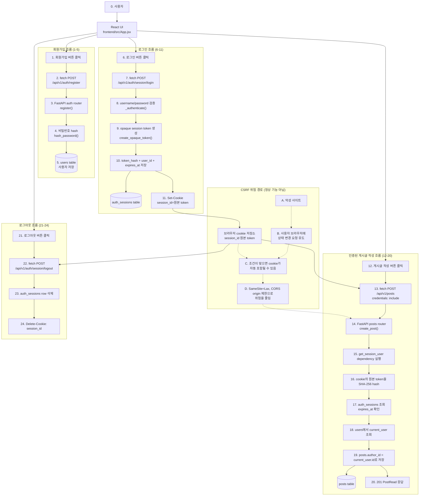

# Sprint 2 Session 인증 의사결정과 전체 흐름

## 1. 문서 목적

이 문서는 Sprint 2 구현 전에 Session 인증 방식에서 헷갈릴 수 있는 지점을 정리하기 위한 문서입니다.

핵심 질문은 아래입니다.

```text
사용자가 React 화면에서 버튼을 눌렀을 때,
브라우저는 어떤 요청을 보내고,
session_id cookie는 언제 같이 보내지며,
FastAPI는 그 cookie로 어떻게 현재 사용자를 확인하고,
CSRF 위험은 어떤 안전장치로 줄일 것인가?
```

## 2. 현재 방향

Sprint 2의 인증 방식은 **Session only**로 정리합니다.

구현에서 제거한 범위:

```text
- JWT access token endpoint
- access token + refresh token pair endpoint
- RefreshToken model
- RefreshToken schema
- JWT 발급/검증 서비스 로직
- 프론트엔드의 JWT/token pair 선택 UI
- JWT/token pair 테스트
```

남긴 범위:

```text
- 회원가입
- Session 로그인
- 현재 로그인 사용자 확인
- Session 로그아웃
- Session 기반 current_user dependency
- 로그인 사용자만 게시글 작성 가능
```

## 3. Frontend fetch는 무엇인가?

사용자가 직접 백엔드 API를 호출하는 것이 아니라, 사용자가 React UI를 조작하면 우리가 작성한 React 코드가 `fetch()`를 실행합니다.

```text
사용자
-> "글 작성" 버튼 클릭
-> React event handler 실행
-> fetch() 실행
-> 브라우저가 실제 HTTP 요청 전송
-> FastAPI가 요청 처리
```

예시:

```js
fetch("http://localhost:8000/api/v1/posts", {
  method: "POST",
  credentials: "include",
  headers: { "Content-Type": "application/json" },
  body: JSON.stringify({ title, content }),
});
```

여기서 `credentials: "include"`는 CORS를 허용한다는 뜻이 아닙니다.

정확한 의미:

```text
브라우저야,
이 fetch 요청에 cookie 같은 인증 정보를 포함해서 보내라.
```

브라우저가 실제로 cookie를 보내려면 프론트엔드와 백엔드 양쪽 조건이 맞아야 합니다.

```text
Frontend fetch:
credentials: "include"

Backend CORS:
allow_credentials=True
allow_origins=["http://localhost:5173"]
```

## 4. 왜 `credentials: "include"`가 필요한가?

로컬 개발 환경에서는 보통 프론트엔드와 백엔드 주소가 다릅니다.

```text
React dev server:
http://localhost:5173

FastAPI server:
http://localhost:8000
```

origin은 아래 세 요소로 결정됩니다.

```text
scheme + host + port
```

따라서 위 두 주소는 port가 달라서 다른 origin입니다.

```text
http://localhost:5173
http://localhost:8000
=> cross-origin
```

브라우저의 `fetch()`는 cross-origin 요청에 cookie를 기본으로 포함하지 않습니다. 그래서 React 앱이 Session cookie 기반 API를 호출하려면 `credentials: "include"`가 필요합니다.

주의할 점:

```text
localhost와 127.0.0.1은 cookie 관점에서 다른 host입니다.
프론트와 백엔드는 한쪽 표현으로 통일해서 접근해야 합니다.
```

## 5. Cookie는 언제 자동으로 붙는가?

브라우저가 cookie를 무조건 항상 보내는 것은 아닙니다. 조건이 맞는 요청에 자동으로 붙입니다.

대표 조건:

```text
1. 요청 host/domain이 cookie domain과 맞는가?
2. 요청 path가 cookie path 범위 안인가?
3. Secure cookie라면 HTTPS 요청인가?
4. SameSite 정책상 cookie를 보낼 수 있는 요청인가?
5. fetch/XHR 요청이라면 credentials 옵션이 허용되어 있는가?
```

따라서 아래 두 문장은 동시에 맞습니다.

```text
Session cookie는 조건이 맞으면 브라우저가 자동으로 붙인다.
React cross-origin fetch에서는 credentials: "include"를 명시해야 cookie가 붙는다.
```

## 6. CSRF 위험은 어디서 생기는가?

Session cookie 방식의 편리함은 동시에 CSRF 위험의 원인이 됩니다.

정상 흐름:

```text
사용자가 우리 React 앱에서 버튼 클릭
-> 우리 React 코드가 fetch 실행
-> session_id cookie가 포함됨
-> FastAPI가 현재 사용자를 확인
-> 정상 요청 처리
```

공격 흐름:

```text
사용자가 우리 서비스에 로그인한 상태
-> 악성 사이트 방문
-> 악성 사이트가 우리 API로 요청을 유도
-> 브라우저가 조건에 따라 session_id cookie를 자동으로 붙일 수 있음
-> 서버가 진짜 사용자 요청으로 오해할 수 있음
```

이 공격이 CSRF입니다.

공격자는 cookie 값을 직접 몰라도 됩니다. 브라우저가 이미 가진 cookie를 자동으로 보내게 만드는 것이 핵심입니다.

## 7. 최소 안전장치

Sprint 2에서는 아래를 기본값으로 둡니다.

```text
HttpOnly=True
SameSite=Lax
Secure=False in local
Secure=True in production
Path=/
Domain 미지정
CORS allow_origins는 우리 프론트 주소만 허용
CSRF token은 오늘 보류하고 한계점 문서화
```

각 옵션의 의미:

| 설정 | 의미 | 줄이는 위험 |
| --- | --- | --- |
| `HttpOnly=True` | JavaScript에서 cookie를 읽지 못하게 한다. | XSS로 session_id를 직접 탈취하는 위험 |
| `SameSite=Lax` | 다른 사이트에서 시작된 요청에 cookie가 붙는 범위를 줄인다. | 기본적인 CSRF 위험 |
| `Secure=True` | HTTPS 요청에서만 cookie를 보낸다. | 평문 HTTP에서 cookie 노출 |
| `Path=/` | 사이트 전체 경로에 cookie를 적용한다. | 경로 범위 혼란 |
| `Domain` 미지정 | 현재 host에만 cookie를 묶는다. | 하위 도메인까지 cookie가 넓게 공유되는 위험 |
| CORS origin 제한 | 허용한 프론트 origin에서 온 요청만 브라우저가 정상 처리하게 한다. | 악성 origin의 JS 접근 |

조금 더 구체적으로 말하면 아래와 같습니다.

### `HttpOnly=True`

`HttpOnly`는 JavaScript가 cookie 값을 읽지 못하게 합니다.

예를 들어 공격자가 XSS로 아래 코드를 실행시키는 상황을 생각할 수 있습니다.

```js
console.log(document.cookie);
```

`HttpOnly`가 없으면 `session_id`가 JavaScript에 노출될 수 있습니다. 공격자는 이 값을 훔쳐 자기 브라우저나 스크립트에서 같은 사용자처럼 요청할 수 있습니다.

`HttpOnly=True`이면 JavaScript에서 `session_id`를 직접 읽을 수 없습니다.

말로 설명할 문장:

```text
HttpOnly는 XSS가 발생했을 때 JavaScript로 세션 쿠키 값을 직접 훔치는 위험을 줄입니다.
다만 XSS 자체를 막는 옵션은 아니고, 공격자가 사용자 브라우저 안에서 요청을 보내는 위험까지 없애지는 못합니다.
```

### `SameSite=Lax`

`SameSite`는 다른 사이트에서 시작된 요청에 cookie를 얼마나 붙일지 결정합니다.

`SameSite=Lax`는 기본적인 cross-site 요청에서 cookie가 붙는 범위를 줄입니다. 특히 악성 사이트가 우리 API로 몰래 상태 변경 요청을 보내는 CSRF 위험을 낮춥니다.

말로 설명할 문장:

```text
SameSite=Lax는 다른 사이트에서 우리 서비스로 요청을 유도하더라도 세션 쿠키가 자동으로 붙는 상황을 줄여 CSRF 위험을 낮춥니다.
하지만 모든 CSRF를 완전히 막는 것은 아니기 때문에, 중요한 상태 변경 API가 많아지면 CSRF token이나 Origin 검증을 추가해야 합니다.
```

### `Secure=True`

`Secure`는 HTTPS 요청에서만 cookie를 보내게 합니다.

로컬 개발은 보통 `http://localhost`를 사용하므로 `Secure=False`가 필요합니다. 하지만 배포 환경에서는 반드시 HTTPS를 쓰고 `Secure=True`로 둬야 합니다.

말로 설명할 문장:

```text
Secure는 세션 쿠키가 평문 HTTP로 전송되지 않게 해서 네트워크 구간에서 쿠키가 노출되는 위험을 줄입니다.
로컬 개발에서는 HTTP라서 꺼두지만, 배포 환경에서는 켜는 것이 맞습니다.
```

### `Path=/`

`Path=/`는 이 cookie가 사이트 전체 경로에서 쓰인다는 뜻입니다.

예를 들어 `Path=/api/v1/auth`처럼 좁게 잡으면 `/api/v1/posts` 요청에는 cookie가 붙지 않을 수 있습니다. Session 인증은 여러 API에서 현재 사용자를 확인해야 하므로 `Path=/`로 두는 것이 단순합니다.

말로 설명할 문장:

```text
Path=/는 세션 쿠키를 auth API뿐 아니라 posts 같은 보호 API에도 보내기 위한 설정입니다.
경로를 너무 좁게 잡으면 로그인은 됐는데 게시글 작성 요청에는 쿠키가 안 붙는 문제가 생길 수 있습니다.
```

### `Domain` 미지정

`Domain`을 지정하지 않으면 cookie는 현재 host 기준으로만 적용됩니다.

예를 들어 `Domain=.example.com`처럼 넓게 잡으면 `api.example.com`, `admin.example.com` 같은 하위 도메인에도 cookie가 공유될 수 있습니다. 하위 도메인 중 하나가 취약하면 세션 cookie 정책이 함께 영향을 받을 수 있습니다.

말로 설명할 문장:

```text
Domain을 지정하지 않으면 쿠키 범위를 현재 host로 좁게 유지할 수 있습니다.
불필요하게 하위 도메인 전체에 세션 쿠키를 공유하지 않기 위한 선택입니다.
```

### CORS origin 제한

CORS는 다른 origin의 JavaScript가 우리 API 응답을 읽을 수 있는지와 관련된 브라우저 정책입니다.

우리 프로젝트에서는 React 개발 서버만 허용합니다.

```text
allow_origins=["http://localhost:5173"]
allow_credentials=True
```

이렇게 하면 아무 사이트에서나 브라우저 JavaScript로 우리 API를 정상 클라이언트처럼 호출하고 응답을 읽는 것을 막을 수 있습니다.

말로 설명할 문장:

```text
CORS origin 제한은 우리 React 앱 origin만 인증 포함 요청을 정상적으로 보낼 수 있게 하는 설정입니다.
다만 CORS는 응답 접근을 통제하는 성격이 강해서, CSRF를 완전히 막는 장치로 보면 안 됩니다.
```

중요한 한계:

```text
CORS는 CSRF를 완전히 막는 장치가 아닙니다.
CSRF의 핵심 방어는 SameSite, CSRF token, Origin/Referer 검증 쪽입니다.
```

이번 Sprint에서는 `SameSite=Lax`를 최소 방어로 두고, 게시글 수정/삭제처럼 상태 변경 API가 늘어나면 CSRF token 또는 Origin 검증을 추가 검토합니다.

## 8. Session token을 hash해서 저장한다는 뜻

정확히 말하면 "cookie token을 hash한다"기보다는, **cookie에 들어 있는 원본 session token을 서버에서 hash해서 DB의 `token_hash`와 비교한다**는 뜻입니다.

Session 방식에서 cookie에는 사용자 정보가 들어가지 않습니다.

```text
cookie에 들어가는 것:
session_id=랜덤한 원본 session token

cookie에 들어가지 않는 것:
user_id
username
password
권한 정보
```

여기서 session token은 **opaque token**입니다.

opaque token은 token 자체만 봐서는 의미를 알 수 없는 랜덤 문자열입니다.

```text
JWT:
token 안에 user_id, exp 같은 정보가 들어 있다.
서버는 token의 서명과 만료 시간을 검증해서 사용자 정보를 해석할 수 있다.

Opaque session token:
token 자체는 그냥 랜덤 문자열이다.
token만 봐서는 user_id를 알 수 없다.
서버가 DB의 auth_sessions를 조회해야 의미를 알 수 있다.
```

같은 사용자라도 로그인마다 다른 session이 만들어질 수 있습니다.

```text
User 10이 Chrome에서 로그인
-> session A 발급

User 10이 Safari에서 로그인
-> session B 발급

User 10이 모바일에서 로그인
-> session C 발급
```

각 session은 서로 다른 원본 session token을 가집니다. 그래서 한 기기에서 로그아웃해 session A를 삭제해도, 정책에 따라 session B나 session C는 유지될 수 있습니다.

말로 설명할 문장:

```text
Session cookie에 들어가는 값은 user_id가 아니라 랜덤한 opaque token입니다.
이 token 자체에는 사용자 정보가 없고, 서버가 DB의 auth_sessions에서 token_hash를 조회해야 어떤 사용자 세션인지 알 수 있습니다.
또 같은 사용자라도 로그인할 때마다 새로운 session이 만들어질 수 있어서, 브라우저나 기기별로 서로 다른 session token을 가질 수 있습니다.
```

### 로그인할 때

로그인 성공 시 서버는 예측하기 어려운 랜덤 문자열을 만듭니다.

예시:

```text
원본 session token:
R7x9...랜덤문자열...K2a
```

이 원본 token은 브라우저 cookie로 내려갑니다.

```http
Set-Cookie: session_id=R7x9...랜덤문자열...K2a; HttpOnly; SameSite=Lax; Path=/
```

하지만 DB에는 원본 token을 그대로 저장하지 않습니다. 서버는 원본 token을 SHA-256 같은 단방향 hash 함수에 넣고, 결과값만 저장합니다.

```text
hash_token("R7x9...랜덤문자열...K2a")
-> "0f4c2a...64자리 hash 값..."
```

DB에는 이렇게 저장됩니다.

```text
auth_sessions
- id: 1
- user_id: 10
- token_hash: "0f4c2a...64자리 hash 값..."
- expires_at: "2026-06-14 18:00:00"
```

현재 코드에서는 아래 함수가 이 역할을 합니다.

```python
def hash_token(token: str) -> str:
    return hashlib.sha256(token.encode("utf-8")).hexdigest()
```

### 인증이 필요한 요청이 들어올 때

브라우저가 게시글 작성 요청을 보낼 때 cookie를 함께 보냅니다.

```http
Cookie: session_id=R7x9...랜덤문자열...K2a
```

서버는 이 원본 token을 다시 hash합니다.

```text
hash_token("R7x9...랜덤문자열...K2a")
-> "0f4c2a...64자리 hash 값..."
```

그리고 DB에서 같은 `token_hash`를 찾습니다.

```text
SELECT * FROM auth_sessions
WHERE token_hash = "0f4c2a...64자리 hash 값..."
```

세션 row가 있고, `expires_at`이 지나지 않았으면 `user_id`로 현재 사용자를 찾습니다.

```text
auth_sessions.user_id = 10
-> users.id = 10 조회
-> current_user 확정
```

### 왜 원본 token을 DB에 저장하지 않는가?

원본 session token은 사실상 로그인 열쇠입니다.

누군가 원본 token을 알면, password를 몰라도 해당 사용자처럼 요청할 수 있습니다. 그래서 DB에 원본 token을 그대로 저장하면 DB가 유출됐을 때 세션 탈취 위험이 커집니다.

반대로 DB에 hash만 저장하면, DB가 유출돼도 공격자가 바로 cookie에 넣어 쓸 수 있는 원본 session token을 얻기 어렵습니다.

말로 설명할 문장:

```text
세션 쿠키에는 랜덤한 원본 session token이 들어갑니다.
서버는 이 원본 token을 DB에 그대로 저장하지 않고, SHA-256 hash 값만 저장합니다.
이후 요청이 오면 cookie의 원본 token을 다시 hash해서 DB의 token_hash와 비교합니다.
이렇게 하면 DB가 유출돼도 원본 session token이 바로 노출되지 않아 세션 탈취 위험을 줄일 수 있습니다.
```

주의할 점:

```text
hash는 암호화가 아닙니다.
암호화는 key로 다시 복호화할 수 있지만, hash는 원래 값을 되돌리는 용도가 아닙니다.
같은 입력은 같은 hash를 만들지만, hash 값만 보고 원본 token을 알아내기는 어렵게 만드는 방식입니다.
```

비밀번호 hash와의 차이:

```text
password는 사용자가 만든 값이라 짧거나 예측 가능할 수 있다.
그래서 salt와 반복 계산이 있는 PBKDF2, bcrypt, Argon2 같은 password hashing이 필요하다.

session token은 서버가 충분히 길고 랜덤하게 만든 값이다.
그래서 현재 코드에서는 SHA-256으로 token hash를 저장한다.
```

## 9. Session 저장소 결정: DB vs Redis

이번 프로젝트에서는 우선 **PostgreSQL DB 저장소**를 추천합니다.

### DB를 사용할 때 필요한 것

```text
auth_sessions table
- id
- user_id
- token_hash
- expires_at
- created_at
```

필요한 로직:

```text
1. 로그인 성공 시 opaque session token 생성
2. 원본 token은 cookie로 내려줌
3. DB에는 token_hash만 저장
4. 인증 요청마다 session_id 원본 token을 hash 처리
5. auth_sessions에서 token_hash 조회
6. expires_at 만료 여부 확인
7. user_id로 현재 사용자 조회
8. 로그아웃 시 현재 session row 삭제
```

장점:

```text
- PostgreSQL을 이미 사용하므로 추가 인프라가 없다.
- 세션 기록을 직접 확인하기 쉽다.
- 테스트와 디버깅이 단순하다.
- MVP 규모에서는 성능 부담이 작다.
```

비용:

```text
- 보호 API마다 DB 조회가 생긴다.
- 만료된 세션 cleanup이 필요하다.
- 서버가 많아지고 트래픽이 커지면 세션 조회 부하가 커질 수 있다.
```

### Redis를 사용할 때 필요한 것

필요한 인프라:

```text
- Redis 컨테이너 또는 서버
- Python Redis client
- SESSION_REDIS_URL 설정
- session key naming 규칙
- TTL 설정
```

예시 구조:

```text
key: session:{token_hash}
value: user_id
ttl: 4 hours
```

장점:

```text
- 세션 조회가 빠르다.
- TTL로 만료 세션을 자동 제거하기 쉽다.
- 여러 FastAPI 서버 인스턴스에서 공유 세션 저장소로 쓰기 좋다.
```

비용:

```text
- Redis 인프라가 추가된다.
- 로컬 실행과 테스트가 복잡해진다.
- Redis 장애 시 로그인 상태 처리 정책이 필요하다.
- 세션 감사 기록을 남기려면 별도 설계가 필요하다.
```

현재 결론:

```text
MVP/개인 과제 단계에서는 PostgreSQL DB session을 사용한다.
Redis는 트래픽, 다중 서버, TTL 자동 관리 필요성이 생길 때 도입한다.
```

## 10. 세션 만료 시간

현재 추천값:

```text
SESSION_EXPIRE_HOURS=4
```

이 값은 절대 표준이 있는 것은 아닙니다. 서비스 위험도와 사용 패턴에 따라 정합니다.

현재 코드의 `expires_at`은 absolute timeout입니다.

```text
로그인 시각 + 4시간이 지나면 만료
사용자가 계속 활동해도 자동 연장하지 않음
```

오늘 구현 범위:

```text
- absolute timeout 4시간
- idle timeout은 구현하지 않음
- 만료 세션 cleanup은 구현하지 않음
- 로그아웃 시 현재 세션 삭제
```

## 11. 401과 403 기준

표준적인 구분은 아래처럼 둡니다.

```text
401 Unauthorized:
- 로그인하지 않음
- session_id cookie 없음
- 세션 만료
- 잘못된 세션

403 Forbidden:
- 로그인은 됨
- 하지만 해당 행동 권한이 없음
- 예: 다른 사용자의 게시글 수정/삭제
```

Sprint 2에서는 401을 명확히 구현합니다.

403은 내일 CRUD Sprint에서 게시글 수정/삭제 권한을 구현할 때 사용합니다.

## 12. Sprint 2 전체 흐름



다이어그램 읽는 법:

```text
1-5는 회원가입이다. 아직 session cookie는 없다.
6-11은 로그인이다. 이때 서버는 DB에 token_hash를 저장하고, 브라우저에는 원본 session_id cookie를 내려준다.
12-20은 인증이 필요한 게시글 작성이다. React fetch가 credentials: include로 요청을 보내면 브라우저가 session_id cookie를 함께 보낸다.
21-24는 로그아웃이다. 서버 DB의 session row를 지우고 브라우저 cookie도 삭제한다.
A-D 점선은 정상 기능 흐름이 아니라 CSRF 위험 경로다. cookie가 자동 전송될 수 있기 때문에 SameSite, CORS, Secure 같은 안전장치가 필요하다.
```

## 13. 요청 흐름을 문장으로 설명하기

회원가입:

```text
React가 회원가입 요청을 보내면 FastAPI는 username/password/display_name을 검증하고,
비밀번호를 hash한 뒤 users table에 저장한다.
```

로그인:

```text
React가 로그인 요청을 보내면 FastAPI는 username/password를 검증하고,
랜덤 session token을 만든다.
원본 token은 HttpOnly cookie로 브라우저에 내려주고,
DB에는 token hash, user_id, expires_at만 저장한다.
```

인증된 게시글 작성:

```text
사용자가 글 작성 버튼을 누르면 React fetch가 credentials: include로 요청을 보낸다.
브라우저는 session_id cookie를 함께 보내고,
FastAPI는 session_id 원본 token을 hash해서 auth_sessions.token_hash에서 찾는다.
세션이 유효하면 users table에서 current_user를 조회하고,
posts.author_id에 current_user.id를 넣어 게시글을 저장한다.
```

CSRF 관점:

```text
Session cookie는 브라우저가 자동으로 붙일 수 있으므로 CSRF 위험이 있다.
Sprint 2에서는 HttpOnly, SameSite=Lax, Secure, CORS origin 제한을 기본 안전장치로 둔다.
다만 이것이 완전한 CSRF 방어는 아니므로,
상태 변경 API가 많아지면 CSRF token 또는 Origin 검증을 추가한다.
```

보안 설정 설명:

```text
HttpOnly는 JavaScript로 session_id를 직접 훔치는 위험을 줄인다.
SameSite=Lax는 다른 사이트에서 시작된 요청에 cookie가 붙는 범위를 줄여 CSRF 위험을 낮춘다.
Secure는 HTTPS에서만 cookie를 보내게 해서 네트워크 구간 노출을 줄인다.
Path=/는 인증이 필요한 여러 API에 cookie가 붙도록 범위를 명확히 한다.
Domain 미지정은 cookie가 불필요하게 하위 도메인 전체로 퍼지는 것을 막는다.
CORS origin 제한은 우리 React 앱이 아닌 사이트의 JavaScript가 API 응답을 읽는 것을 막는다.
```

## 14. Sprint 2 구현 체크리스트

- [x] JWT/token pair 코드를 제거할 범위를 확인했다.
- [x] Session 저장소는 PostgreSQL DB로 결정했다.
- [x] Session 만료 시간은 4시간으로 확정했다.
- [x] Cookie 옵션을 `HttpOnly`, `SameSite=Lax`, `Path=/` 기준으로 확정했다.
- [x] 로컬에서는 `Secure=False`, 배포에서는 `Secure=True`로 둔다.
- [x] Session token 원본은 cookie에만 두고, DB에는 `token_hash`만 저장한다.
- [x] 프론트 fetch에는 `credentials: "include"`를 사용한다.
- [x] CORS `allow_credentials=True`와 명시적 origin 허용을 사용한다.
- [x] `localhost`와 `127.0.0.1`을 섞지 않는다.
- [x] Sprint 2에서는 401을 구현하고, 403은 CRUD Sprint에서 구현하기로 했다.
- [x] CSRF token은 이번 Sprint에서 보류하되 한계점으로 문서화했다.
