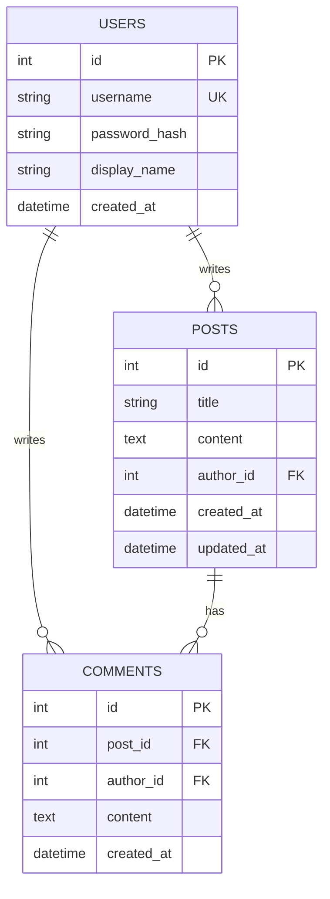
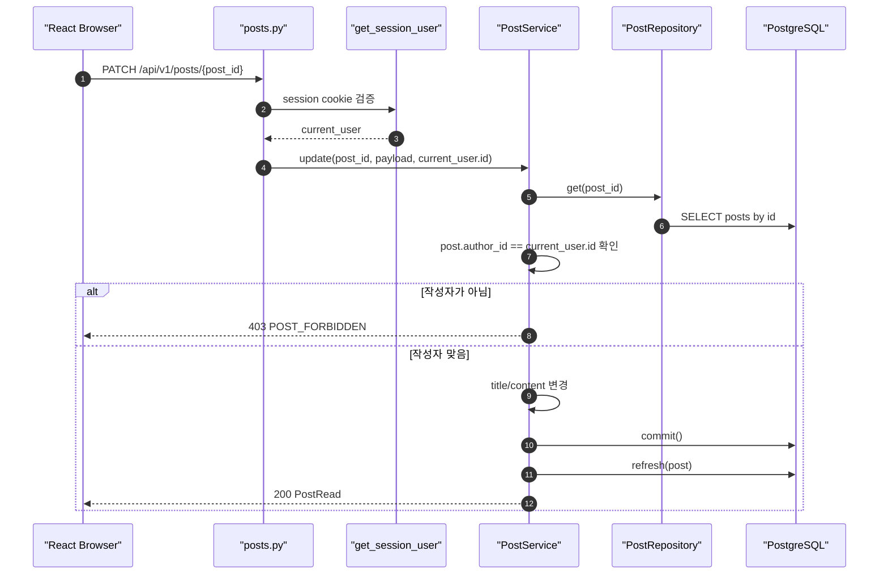
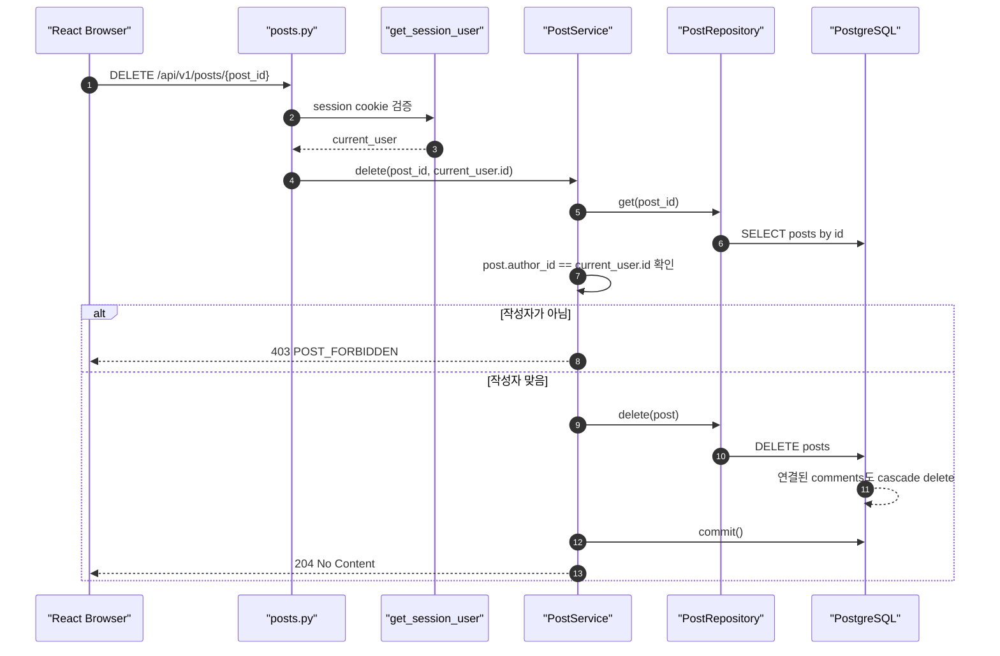
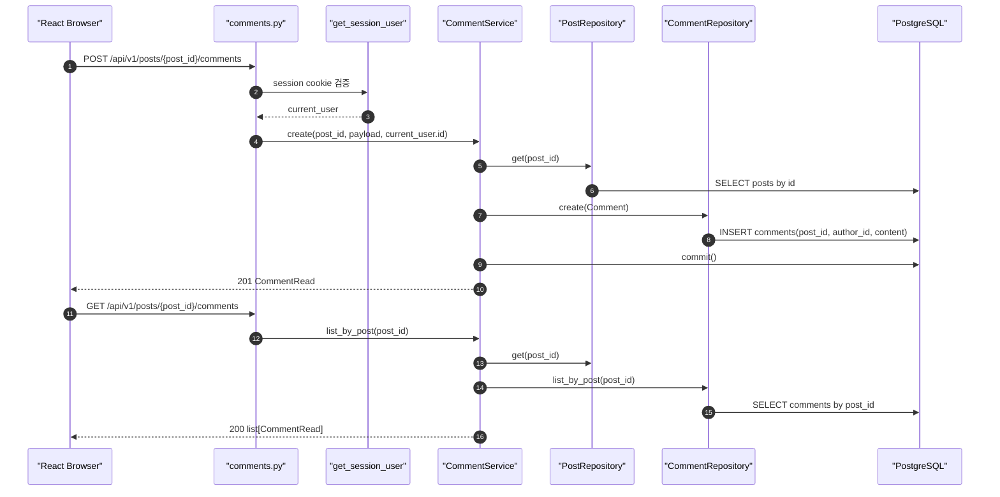
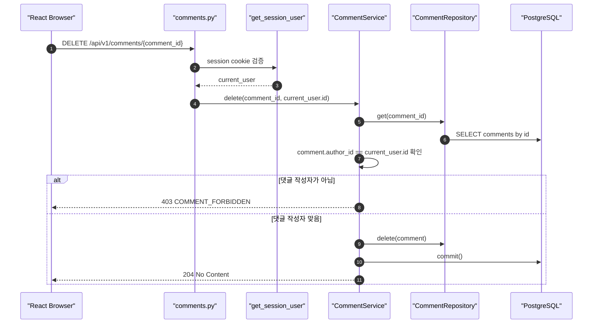

# Sprint 3 구현 기록

## 1. 구현 목표

Sprint 3의 목표는 기본 게시판 기능을 **게시글 CRUD + 댓글**까지 확장하고, Session으로 확인한 `current_user`를 기준으로 작성자 권한을 적용하는 것입니다.

Sprint 1에서 `Post.author_id -> User.id` FK를 만들었고, Sprint 2에서 Session 인증으로 현재 사용자를 확인했습니다. Sprint 3에서는 이 두 흐름을 사용해 아래 기능을 구현했습니다.

```text
1. 게시글 수정
2. 게시글 삭제
3. 댓글 작성
4. 댓글 목록 조회
5. 댓글 삭제
6. 게시글/댓글 작성자 권한 확인
```

## 2. 확정한 설계 결정

| 항목 | 결정 |
| --- | --- |
| 게시글 삭제 방식 | hard delete |
| 게시글 삭제 시 댓글 | 같이 삭제 |
| 게시글 수정 권한 | 게시글 작성자만 가능 |
| 게시글 삭제 권한 | 게시글 작성자만 가능 |
| 댓글 삭제 권한 | 댓글 작성자만 가능 |
| 댓글 조회 방식 | 별도 API |
| DB schema 변경 | Alembic 없이 DB reset |
| 제목 길이 | 1~120자 |
| 게시글 본문 길이 | 1~10,000자 |
| 댓글 본문 길이 | 1~1,000자 |

Hard delete는 `posts` row를 실제로 삭제하는 방식입니다. 이번 구현에서는 `Post.comments` 관계에 cascade를 설정해서 게시글이 삭제되면 연결된 댓글도 함께 삭제됩니다.

## 3. 변경한 파일

```text
backend/app/models/user.py
backend/app/models/post.py
backend/app/models/comment.py
backend/app/schemas/post.py
backend/app/schemas/comment.py
backend/app/repositories/post_repository.py
backend/app/repositories/comment_repository.py
backend/app/services/post_service.py
backend/app/services/comment_service.py
backend/app/api/dependencies.py
backend/app/api/v1/posts.py
backend/app/api/v1/comments.py
backend/app/main.py
backend/tests/test_post_service.py
backend/tests/test_posts_flow.py
backend/tests/test_comments_flow.py
frontend/index.html
frontend/src/App.jsx
frontend/src/styles.css
```

## 4. 남긴 API

```text
POST   /api/v1/posts
GET    /api/v1/posts
GET    /api/v1/posts/{post_id}
PATCH  /api/v1/posts/{post_id}
DELETE /api/v1/posts/{post_id}

POST   /api/v1/posts/{post_id}/comments
GET    /api/v1/posts/{post_id}/comments
DELETE /api/v1/comments/{comment_id}
```

## 5. 데이터 모델



ERD 읽는 법:

```text
1. USERS는 게시글과 댓글의 작성자다.
2. POSTS.author_id는 USERS.id를 참조한다.
3. COMMENTS.author_id는 USERS.id를 참조한다.
4. COMMENTS.post_id는 POSTS.id를 참조한다.
5. 게시글 1개는 댓글 여러 개를 가질 수 있다.
6. 게시글을 hard delete하면 연결된 comments row도 같이 삭제된다.
```

코드에서 볼 것:

```text
- backend/app/models/user.py
   - User.posts
   - User.comments

- backend/app/models/post.py
   - Post.author_id
   - Post.comments
   - cascade="all, delete-orphan"

- backend/app/models/comment.py
   - Comment.post_id
   - Comment.author_id
   - Comment.author_display_name

- backend/app/schemas/comment.py
   - CommentCreate
   - CommentRead
```

## 6. 게시글 수정 흐름



단계별 읽기 (다이어그램 1~12):

```text
1. Browser가 PATCH /api/v1/posts/{post_id} 요청을 보낸다.
   - 요청 body에는 수정할 title 또는 content가 들어간다.

2. posts.py의 update_post()는 get_session_user dependency를 먼저 실행한다.
   - 이 단계에서 session_id cookie가 없으면 401 SESSION_REQUIRED가 발생한다.

3. get_session_user()가 유효한 세션을 찾으면 current_user를 posts.py로 반환한다.
   - current_user는 "지금 로그인한 사용자"다.

4. update_post()는 PostService.update(post_id, payload, current_user.id)를 호출한다.
   - 클라이언트가 author_id를 보내지 않아도 서버가 current_user.id를 사용한다.

5. PostService.update()는 PostRepository.get(post_id)로 게시글을 조회한다.
   - 게시글이 없으면 404 POST_NOT_FOUND가 발생한다.

6. PostRepository.get()은 DB에서 post_id에 해당하는 posts row를 조회한다.
   - author 관계도 함께 로드해서 PostRead 응답에 author_display_name을 채울 수 있다.

7. PostService._ensure_author()가 post.author_id와 current_user.id를 비교한다.
   - 이 비교가 Sprint 3의 인가 핵심이다.

8. 작성자가 아니면 403 POST_FORBIDDEN을 반환한다.
   - 로그인은 했지만 이 게시글을 수정할 권한이 없는 경우다.

9. 작성자가 맞으면 전달된 title/content만 Post 객체에 반영한다.
   - PATCH라서 body에 없는 필드는 그대로 둔다.

10. DB commit으로 수정 내용을 확정한다.

11. refresh(post)로 DB에 반영된 최신 Post 상태를 다시 읽는다.

12. Browser에 200 PostRead 응답을 반환한다.
```

코드에서 볼 것:

```text
- frontend/src/App.jsx
   - updatePost(event)

- backend/app/api/v1/posts.py
   - update_post(post_id, payload, current_user, service)

- backend/app/api/v1/auth.py
   - get_session_user(session_token, service)

- backend/app/services/post_service.py
   - PostService.update(post_id, payload, author_id)
   - PostService._ensure_author(post, user_id)

- backend/app/repositories/post_repository.py
   - PostRepository.get(post_id)

- backend/app/schemas/post.py
   - PostUpdate
   - PostRead
```

## 7. 게시글 삭제와 댓글 cascade 흐름



단계별 읽기 (다이어그램 1~13):

```text
1. Browser가 DELETE /api/v1/posts/{post_id} 요청을 보낸다.
   - 삭제는 상태 변경 요청이므로 로그인이 필요하다.

2. posts.py의 delete_post()는 get_session_user dependency를 먼저 실행한다.
   - session cookie가 없거나 무효하면 여기서 401이 발생한다.

3. get_session_user()가 current_user를 posts.py로 반환한다.

4. delete_post()는 PostService.delete(post_id, current_user.id)를 호출한다.

5. PostService.delete()는 PostRepository.get(post_id)로 삭제 대상 게시글을 조회한다.
   - 게시글이 없으면 404 POST_NOT_FOUND가 발생한다.

6. PostRepository.get()은 DB에서 posts row를 조회한다.

7. PostService._ensure_author()가 post.author_id와 current_user.id를 비교한다.
   - 게시글 삭제 권한은 게시글 작성자에게만 있다.

8. 작성자가 아니면 403 POST_FORBIDDEN을 반환한다.

9. 작성자가 맞으면 PostRepository.delete(post)를 호출한다.
   - 이 시점에는 아직 DB에서 바로 사라진 것이 아니라 삭제 대상으로 표시된다.

10. commit 시점에 posts row가 실제로 삭제된다.

11. Post.comments cascade 설정 때문에 연결된 comments row도 같이 삭제된다.
   - 숨김 처리나 deleted_at 표시가 아니라 실제 row 삭제다.

12. commit으로 삭제 트랜잭션을 확정한다.

13. Browser에 204 No Content를 반환한다.
```

코드에서 볼 것:

```text
- frontend/src/App.jsx
   - deletePost()

- backend/app/api/v1/posts.py
   - delete_post(post_id, current_user, service)

- backend/app/api/v1/auth.py
   - get_session_user(session_token, service)

- backend/app/services/post_service.py
   - PostService.delete(post_id, author_id)
   - PostService._ensure_author(post, user_id)

- backend/app/repositories/post_repository.py
   - PostRepository.get(post_id)
   - PostRepository.delete(post)

- backend/app/models/post.py
   - Post.comments
   - cascade="all, delete-orphan"
```

## 8. 댓글 작성/조회 흐름



단계별 읽기 (다이어그램 1~16):

```text
1. Browser가 POST /api/v1/posts/{post_id}/comments 요청을 보낸다.
   - request body에는 댓글 content만 들어간다.

2. comments.py의 create_comment()는 get_session_user dependency를 먼저 실행한다.
   - 댓글 작성은 로그인 사용자만 가능하다.

3. get_session_user()가 current_user를 comments.py로 반환한다.

4. create_comment()는 CommentService.create(post_id, payload, current_user.id)를 호출한다.
   - 댓글 작성자는 request body가 아니라 current_user.id로 정한다.

5. CommentService.create()는 PostRepository.get(post_id)로 댓글을 달 게시글을 조회한다.
   - 존재하지 않는 게시글이면 404 POST_NOT_FOUND가 발생한다.

6. PostRepository.get()이 DB에서 posts row를 조회한다.

7. 게시글이 존재하면 CommentRepository.create(Comment)를 호출한다.

8. CommentRepository.create()가 comments table에 post_id, author_id, content를 INSERT한다.

9. DB commit으로 댓글 생성을 확정한다.

10. Browser에 201 CommentRead 응답을 반환한다.

11. Browser가 GET /api/v1/posts/{post_id}/comments 요청을 보낸다.
    - 댓글 조회는 비로그인 사용자도 가능하다.

12. comments.py의 list_comments()가 CommentService.list_by_post(post_id)를 호출한다.

13. CommentService.list_by_post()는 먼저 PostRepository.get(post_id)로 게시글 존재 여부를 확인한다.

14. 게시글이 존재하면 CommentRepository.list_by_post(post_id)를 호출한다.

15. CommentRepository가 DB에서 해당 post_id의 comments row들을 created_at 오름차순으로 조회한다.

16. Browser에 200 list[CommentRead] 응답을 반환한다.
    - 각 댓글에는 author_id와 author_display_name이 포함된다.
```

코드에서 볼 것:

```text
- frontend/src/App.jsx
   - createComment(event)
   - loadComments(postId, options)

- backend/app/api/v1/comments.py
   - create_comment(post_id, payload, current_user, service)
   - list_comments(post_id, service)

- backend/app/api/v1/auth.py
   - get_session_user(session_token, service)

- backend/app/services/comment_service.py
   - CommentService.create(post_id, payload, author_id)
   - CommentService.list_by_post(post_id)
   - CommentService._get_post_or_raise(post_id)

- backend/app/repositories/post_repository.py
   - PostRepository.get(post_id)

- backend/app/repositories/comment_repository.py
   - CommentRepository.create(comment)
   - CommentRepository.list_by_post(post_id)

- backend/app/schemas/comment.py
   - CommentCreate
   - CommentRead
```

## 9. 댓글 삭제 권한 흐름



단계별 읽기 (다이어그램 1~11):

```text
1. Browser가 DELETE /api/v1/comments/{comment_id} 요청을 보낸다.
   - 댓글 삭제는 상태 변경 요청이므로 로그인이 필요하다.

2. comments.py의 delete_comment()는 get_session_user dependency를 먼저 실행한다.
   - session cookie가 없거나 무효하면 401이 발생한다.

3. get_session_user()가 current_user를 comments.py로 반환한다.

4. delete_comment()는 CommentService.delete(comment_id, current_user.id)를 호출한다.

5. CommentService.delete()는 CommentRepository.get(comment_id)로 삭제 대상 댓글을 조회한다.
   - 댓글이 없으면 404 COMMENT_NOT_FOUND가 발생한다.

6. CommentRepository.get()이 DB에서 comments row를 조회한다.

7. CommentService.delete()가 comment.author_id와 current_user.id를 비교한다.
   - 댓글 삭제 권한은 댓글 작성자에게만 있다.

8. 댓글 작성자가 아니면 403 COMMENT_FORBIDDEN을 반환한다.

9. 댓글 작성자가 맞으면 CommentRepository.delete(comment)를 호출한다.

10. DB commit으로 댓글 삭제를 확정한다.

11. Browser에 204 No Content를 반환한다.
```

코드에서 볼 것:

```text
- frontend/src/App.jsx
   - deleteComment(commentId)

- backend/app/api/v1/comments.py
   - delete_comment(comment_id, current_user, service)

- backend/app/api/v1/auth.py
   - get_session_user(session_token, service)

- backend/app/services/comment_service.py
   - CommentService.delete(comment_id, author_id)

- backend/app/repositories/comment_repository.py
   - CommentRepository.get(comment_id)
   - CommentRepository.delete(comment)
```

## 10. Frontend 변경

`frontend/src/App.jsx`는 Sprint 3 확인용 UI로 확장했습니다.

확인 가능한 사용자 행동:

```text
- 회원가입
- Session 로그인
- 내 정보 조회
- 게시글 작성
- 게시글 목록 조회
- 게시글 상세 조회
- 게시글 수정
- 게시글 삭제
- 댓글 작성
- 댓글 목록 조회
- 댓글 삭제
- 로그아웃
```

프론트의 모든 요청은 `request()`를 지나고, 계속 `credentials: "include"`를 사용합니다.

## 11. 테스트 변경

`backend/tests/test_posts_flow.py`에서 확인하는 것:

```text
1. 게시글 작성/목록/상세 조회
2. 비로그인 게시글 작성 401
3. 다른 사용자의 게시글 수정 403
4. 작성자의 게시글 수정 성공
5. 다른 사용자의 게시글 삭제 403
6. 작성자의 게시글 삭제 성공
7. 게시글 삭제 후 조회 404
8. 게시글 삭제 시 댓글도 삭제됨
```

`backend/tests/test_comments_flow.py`에서 확인하는 것:

```text
1. 로그인 사용자의 댓글 작성 성공
2. 게시글별 댓글 목록 조회 성공
3. 댓글 작성자가 아닌 사용자의 댓글 삭제 403
4. 댓글 작성자의 댓글 삭제 성공
5. 비로그인 댓글 작성 401
```

`backend/tests/test_post_service.py`에서 확인하는 것:

```text
1. PostService.create() commit
2. 없는 게시글 조회 시 POST_NOT_FOUND
3. 작성자가 아닌 사용자의 update 시 POST_FORBIDDEN
4. 작성자의 delete 시 repository delete와 commit 실행
```

## 12. 검증 결과

아래 명령으로 검증했습니다.

```bash
.venv/bin/python -m pytest backend/tests
```

```bash
npm run build
```

결과:

```text
backend tests: 11 passed
frontend build: vite build passed
```

로컬 서버 확인:

```text
POST /api/v1/posts/1/comments without session -> 401 SESSION_REQUIRED
GET  http://127.0.0.1:5173/ -> 200
```

주의:

```text
기본 sandbox에서는 localhost:5433 PostgreSQL 접속이 막혀 테스트가 실패했다.
권한 상승 실행으로 실제 PostgreSQL 테스트 DB에 접속해 11 passed를 확인했다.
```

## 13. Sprint 3 완료 판단

완료된 것:

- 게시글 수정 API
- 게시글 삭제 API
- 게시글 작성자 권한 확인
- Comment 모델과 API
- 댓글 작성/목록/삭제
- 댓글 작성자 권한 확인
- 게시글 hard delete 시 댓글 cascade delete
- Sprint 3 프론트 확인 UI
- Sprint 3 테스트

다음 Sprint로 넘길 것:

- Tag 모델/API
- 검색
- 페이징
- 게시글 목록 정렬 옵션
- CSRF token 또는 Origin 검증 추가 여부
- Alembic 도입 여부 재검토

## 14. 발표에 사용할 한 문장

```text
Sprint 3에서는 Session으로 확인한 current_user를 기준으로
게시글 수정/삭제와 댓글 삭제 권한을 처리했고,
게시글 hard delete 시 연결된 댓글도 함께 삭제되도록 기본 게시판 CRUD 흐름을 완성했습니다.
```
