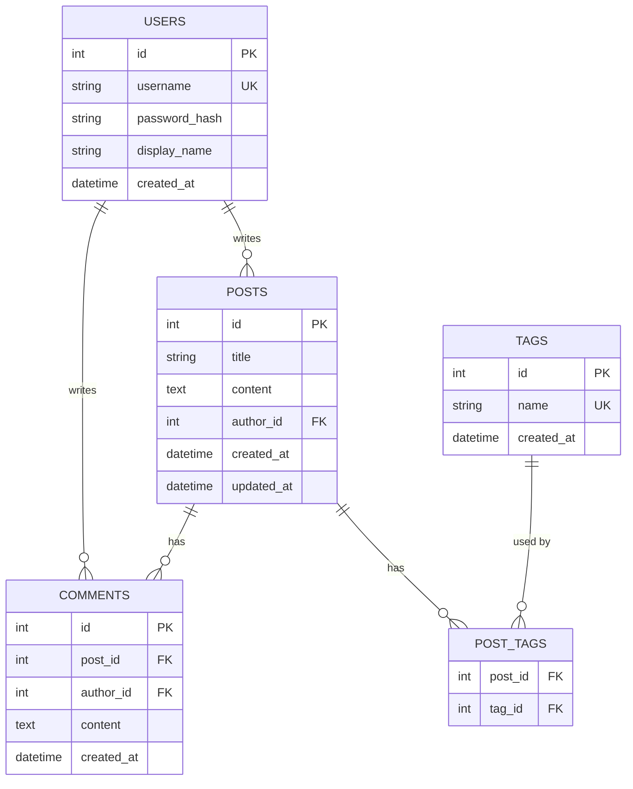
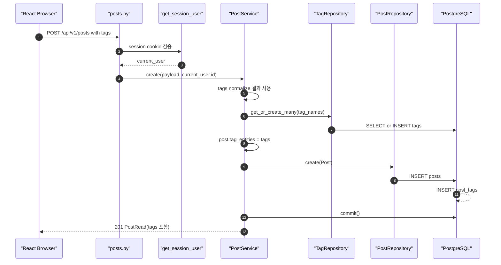
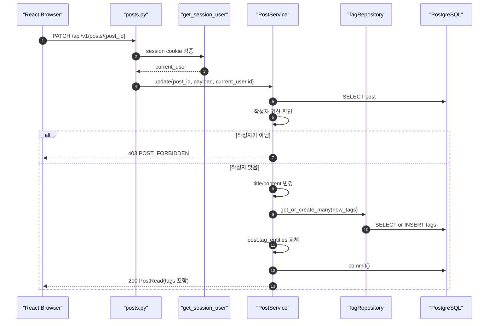
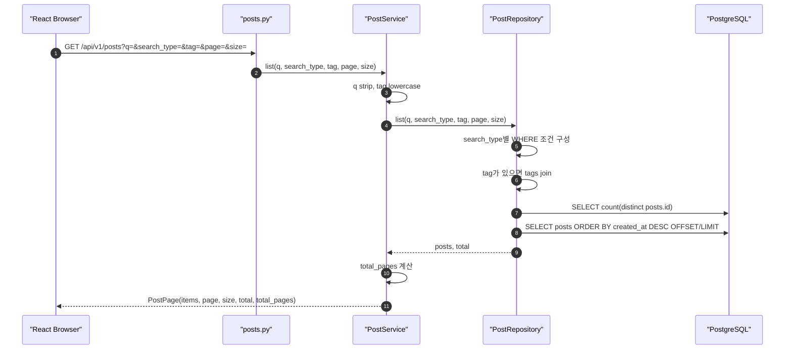
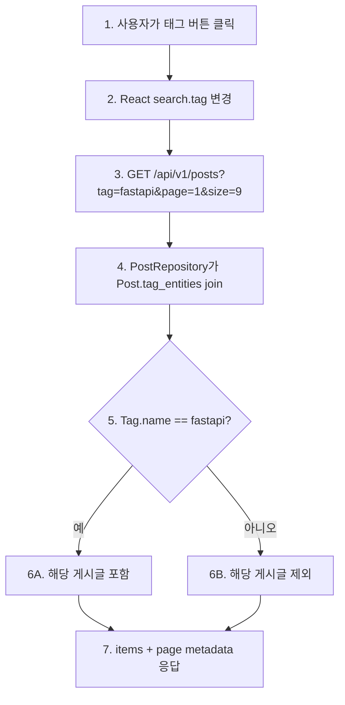
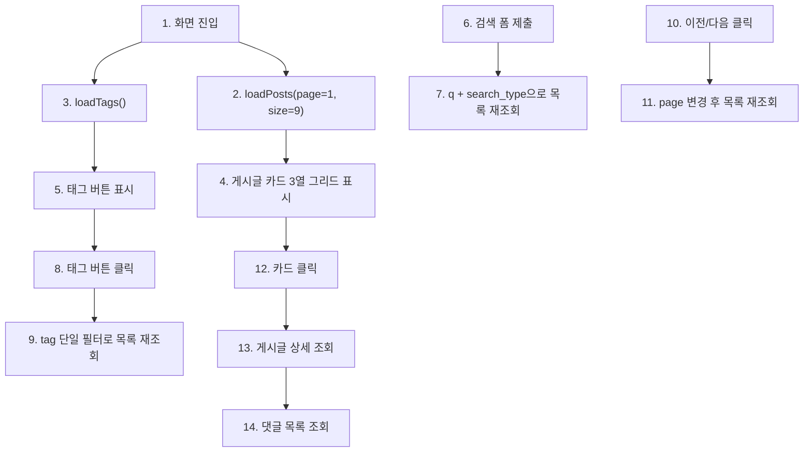

# Sprint 4 구현 기록

## 1. 구현 목표

Sprint 4의 목표는 게시판을 단순 CRUD에서 **탐색 가능한 게시판**으로 확장하는 것입니다.

Sprint 3까지는 게시글과 댓글을 만들고 권한을 확인하는 흐름을 완성했습니다. Sprint 4에서는 게시글을 찾기 쉽게 하기 위해 아래 기능을 추가했습니다.

```text
1. Tag 모델
2. Post-Tag N:M 관계
3. 게시글 작성/수정 시 태그 연결
4. 게시글 목록 검색
5. 단일 태그 필터
6. page/size 기반 페이징
7. 페이징 metadata 응답
8. 프론트 검색/태그/페이지 UI
```

## 2. 확정한 설계 결정

| 항목 | 결정 |
| --- | --- |
| 태그 구조 | `tags` + `post_tags` 별도 테이블 |
| 관계 | `posts`와 `tags` N:M |
| 태그 normalize | `strip + lowercase` |
| 태그 표시 | 소문자 |
| 게시글당 태그 수 | 최대 5개 |
| 태그 길이 | 최대 30자 |
| 검색 방식 | PostgreSQL `ILIKE` |
| 검색 타입 | `title`, `content`, `title_content`, `author` |
| 태그 필터 | 단일 tag |
| 페이징 | `page`, `size` |
| 기본 page size | 9 |
| 최대 page size | 50 |
| 정렬 | 최신순 `created_at desc` |
| 목록 응답 | `items + page + size + total + total_pages` |
| DB schema 변경 | Alembic 없이 DB reset |

## 3. 변경한 파일

```text
backend/app/models/post.py
backend/app/models/tag.py
backend/app/schemas/post.py
backend/app/schemas/tag.py
backend/app/repositories/post_repository.py
backend/app/repositories/tag_repository.py
backend/app/services/post_service.py
backend/app/api/dependencies.py
backend/app/api/v1/posts.py
backend/app/api/v1/tags.py
backend/app/main.py
backend/tests/test_post_service.py
backend/tests/test_posts_flow.py
frontend/index.html
frontend/src/App.jsx
frontend/src/styles.css
docs2/sprint-4/implementation-record.md
```

## 4. API 계약

### 4.1 게시글 목록 조회

```text
GET /api/v1/posts?q=&search_type=title_content&tag=&page=1&size=9
```

query parameter:

| 이름 | 의미 | 기본값 |
| --- | --- | --- |
| `q` | 검색어 | 없음 |
| `search_type` | 검색 범위 | `title_content` |
| `tag` | 단일 태그 필터 | 없음 |
| `page` | 페이지 번호 | `1` |
| `size` | 한 페이지 크기 | `9` |

`search_type` 값:

```text
title          -> posts.title
content        -> posts.content
title_content  -> posts.title OR posts.content
author         -> users.username OR users.display_name
```

응답:

```json
{
  "items": [],
  "page": 1,
  "size": 9,
  "total": 23,
  "total_pages": 3
}
```

### 4.2 게시글 작성/수정 태그 입력

```http
POST /api/v1/posts
PATCH /api/v1/posts/{post_id}
```

request body:

```json
{
  "title": "Session 인증 정리",
  "content": "쿠키 기반 인증 흐름...",
  "tags": ["FastAPI", " Auth ", "fastapi"]
}
```

서버 normalize 후:

```json
{
  "tags": ["fastapi", "auth"]
}
```

### 4.3 태그 목록 조회

```text
GET /api/v1/tags
```

응답:

```json
[
  {
    "id": 1,
    "name": "auth",
    "created_at": "2026-06-15T00:00:00"
  }
]
```

## 5. 데이터 모델



ERD 읽는 법:

```text
1. USERS는 게시글과 댓글의 작성자다.
2. POSTS는 게시글 본문과 작성자 FK를 가진다.
3. COMMENTS는 게시글과 작성자를 각각 FK로 참조한다.
4. TAGS는 중복 없는 태그 이름을 저장한다.
5. POST_TAGS는 posts와 tags 사이의 N:M 관계를 표현한다.
6. 게시글 하나는 여러 태그를 가질 수 있고, 태그 하나는 여러 게시글에 붙을 수 있다.
```

## 6. 게시글 작성 + 태그 연결 흐름



단계별 읽기:

```text
1. 브라우저는 title, content, tags를 함께 보낸다.
2. 게시글 작성은 Sprint 2 Session 인증을 통과해야 한다.
3. Pydantic schema가 태그를 strip + lowercase로 normalize한다.
4. 중복 태그는 제거된다.
5. PostService는 TagRepository로 태그를 조회하거나 새로 만든다.
6. Post.tag_entities에 Tag 객체들을 연결한다.
7. PostRepository가 posts row를 저장한다.
8. SQLAlchemy 관계를 통해 post_tags row도 함께 만들어진다.
9. 응답에는 tags 문자열 배열이 포함된다.
```

## 7. 게시글 수정 + 태그 교체 흐름



단계별 읽기:

```text
1. 수정 요청도 Session 인증이 필요하다.
2. PostService.update()는 먼저 게시글을 조회한다.
3. current_user.id와 post.author_id가 다르면 403이다.
4. tags가 request body에 포함되면 기존 태그 연결을 새 태그 목록으로 교체한다.
5. tags가 request body에 없으면 기존 태그 연결은 유지된다.
```

## 8. 게시글 목록 검색/태그/페이징 흐름



검색 타입별 조건:

```text
title:
  posts.title ILIKE %q%

content:
  posts.content ILIKE %q%

title_content:
  posts.title ILIKE %q% OR posts.content ILIKE %q%

author:
  users.username ILIKE %q% OR users.display_name ILIKE %q%
```

단계별 읽기:

```text
1. 목록 조회는 비로그인 사용자도 가능하다.
2. q가 없으면 검색 조건 없이 최신순 목록을 가져온다.
3. tag가 있으면 단일 태그 이름과 연결된 게시글만 가져온다.
4. page와 size로 offset을 계산한다.
5. total은 현재 검색/필터 조건에 맞는 전체 게시글 수다.
6. total_pages는 프론트의 이전/다음 버튼 상태를 판단하는 데 사용한다.
```

## 9. 단일 태그 필터 흐름



단일 태그로 제한한 이유:

```text
한 번에 하나의 tag만 필터링한다.
AND/OR 다중 태그 조합은 이번 Sprint에서 제외했다.
검색, 태그, 페이징을 동시에 구현하는 Sprint에서는 단일 tag가 API와 UI를 가장 명확하게 만든다.
```

## 10. Frontend 흐름



Frontend에서 봐야 할 핵심:

```text
loadPosts()는 page metadata가 포함된 PostPage 응답을 받아 posts와 pageMeta를 갱신한다.
submitSearch()는 page를 1로 되돌린 뒤 검색한다.
filterByTag()는 단일 태그를 toggle한다.
changePage()는 현재 검색/태그 조건을 유지한 채 page만 바꾼다.
게시글 작성/수정 시 tags input은 comma-separated string이고, request 직전에 배열로 변환한다.
```

## 11. 전체 흐름을 따라가는 코드 읽기 순서

### 11.1 데이터 모델

```text
1. backend/app/models/tag.py
   - Tag
   - post_tags

2. backend/app/models/post.py
   - Post.tag_entities
   - Post.tags property
```

확인할 것:

```text
post_tags는 posts와 tags 사이의 중간 테이블이다.
Post.tag_entities는 SQLAlchemy 관계용 객체 목록이다.
Post.tags는 API 응답용 문자열 배열이다.
```

### 11.2 게시글 작성/수정 태그 처리

```text
1. backend/app/schemas/post.py
   - PostCreate
   - PostUpdate
   - normalize_tag_names(tags)

2. backend/app/services/post_service.py
   - PostService.create(payload, author_id)
   - PostService.update(post_id, payload, author_id)
   - PostService._get_tags(tag_names)

3. backend/app/repositories/tag_repository.py
   - TagRepository.get_by_name(name)
   - TagRepository.get_or_create(name)
   - TagRepository.get_or_create_many(names)
```

확인할 것:

```text
태그 normalize는 schema에서 먼저 일어난다.
service는 normalize된 tag 이름을 받아 Tag 객체로 바꾼다.
새 태그면 INSERT하고 기존 태그면 재사용한다.
```

### 11.3 목록 검색/필터/페이징

```text
1. backend/app/api/v1/posts.py
   - list_posts(q, search_type, tag, page, size, service)

2. backend/app/schemas/post.py
   - PostSearchType
   - PostPage

3. backend/app/services/post_service.py
   - PostService.list(q, search_type, tag, page, size)

4. backend/app/repositories/post_repository.py
   - PostRepository.list(q, search_type, tag, page, size)
```

확인할 것:

```text
router는 query parameter를 받는다.
service는 q와 tag를 정리하고 total_pages를 계산한다.
repository는 실제 SQLAlchemy select/count/offset/limit 조건을 만든다.
```

### 11.4 태그 목록 조회

```text
1. backend/app/api/v1/tags.py
   - list_tags(db)

2. backend/app/repositories/tag_repository.py
   - TagRepository.list()

3. backend/app/schemas/tag.py
   - TagRead
```

### 11.5 Frontend 확인 순서

```text
1. frontend/src/App.jsx
   - SEARCH_TYPES
   - search state
   - pageMeta state
   - loadPosts(options)
   - submitSearch(event)
   - filterByTag(tagName)
   - changePage(nextPage)
   - buildPostBody(form)

2. frontend/src/styles.css
   - .search-bar
   - .tag-filter
   - .post-grid
   - .pagination
```

## 12. 테스트 변경

`backend/tests/test_posts_flow.py`에서 검증하는 것:

```text
1. 게시글 작성 시 tags 입력 가능
2. 태그는 strip + lowercase + dedupe 처리됨
3. PostRead 응답에 tags 포함
4. GET /api/v1/tags로 태그 목록 조회 가능
5. PATCH /posts/{id}로 태그 교체 가능
6. title 검색 가능
7. content 검색 가능
8. title_content 검색 가능
9. author 검색 가능
10. 단일 tag 필터 가능
11. page/size pagination metadata 응답 가능
```

`backend/tests/test_post_service.py`에서 검증하는 것:

```text
PostService.create()가 TagRepository.get_or_create_many()를 호출하고 commit한다.
```

## 13. 검증 결과

아래 명령으로 검증했습니다.

```bash
.venv/bin/python -m pytest backend/tests
```

```bash
npm run build
```

결과:

```text
backend tests: 12 passed
frontend build: vite build passed
```

로컬 API 확인:

```text
GET /api/v1/posts?page=1&size=9 -> 200 PostPage
GET /api/v1/tags -> 200 list[TagRead]
GET http://127.0.0.1:5173/ -> 200
```

## 14. Sprint 4 완료 판단

완료된 것:

- Tag 모델
- `post_tags` N:M 중간 테이블
- 게시글 작성/수정 태그 연결
- 태그 normalize
- 태그 목록 API
- 검색 타입 4개
- 단일 태그 필터
- page/size 페이징
- metadata 포함 목록 응답
- 프론트 검색/태그/페이징 UI
- 테스트 및 빌드 검증

다음 Sprint로 넘길 것:

- AI 기능 스코핑
- RAG/MCP/Agent 시나리오 결정
- pgvector 도입
- 검색 성능 개선
- 다중 태그 AND/OR 필터
- Alembic 도입 여부 재검토

## 15. 발표에 사용할 한 문장

```text
Sprint 4에서는 게시글에 태그를 붙이고,
검색 타입과 단일 태그 필터, page/size 기반 페이징을 추가해
게시판을 단순 CRUD에서 탐색 가능한 지식 공유 화면으로 확장했습니다.
```
