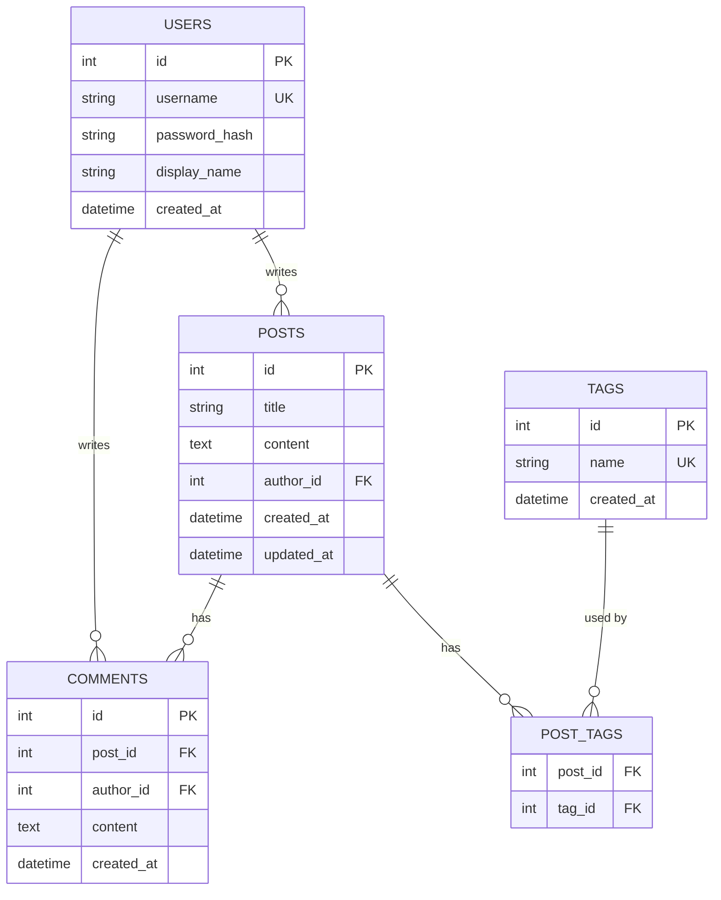
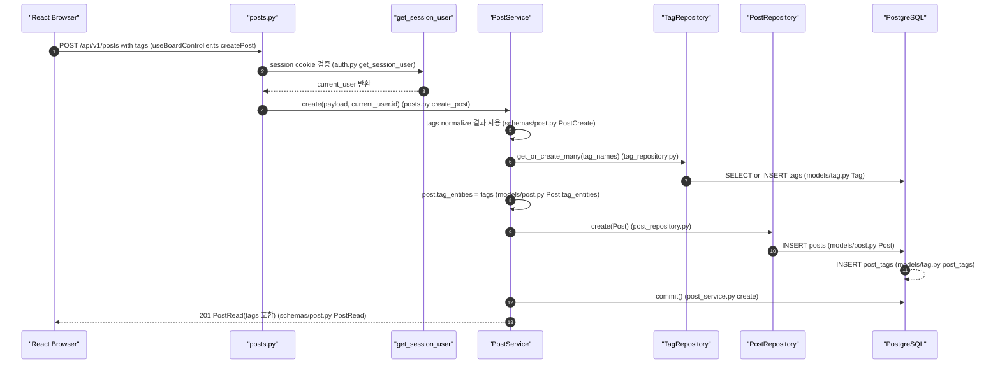
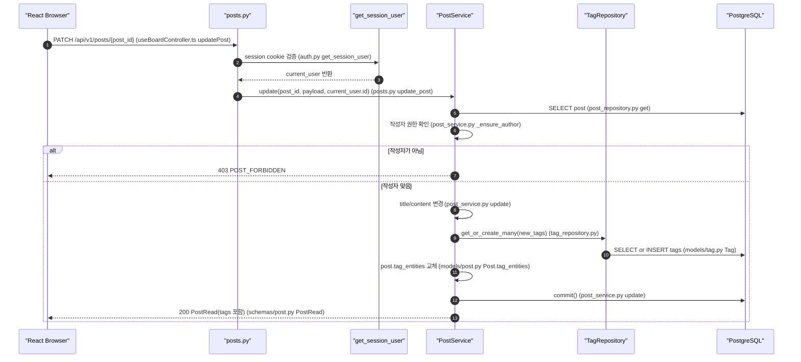
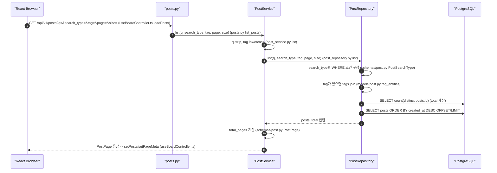
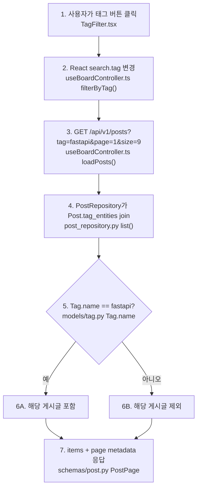
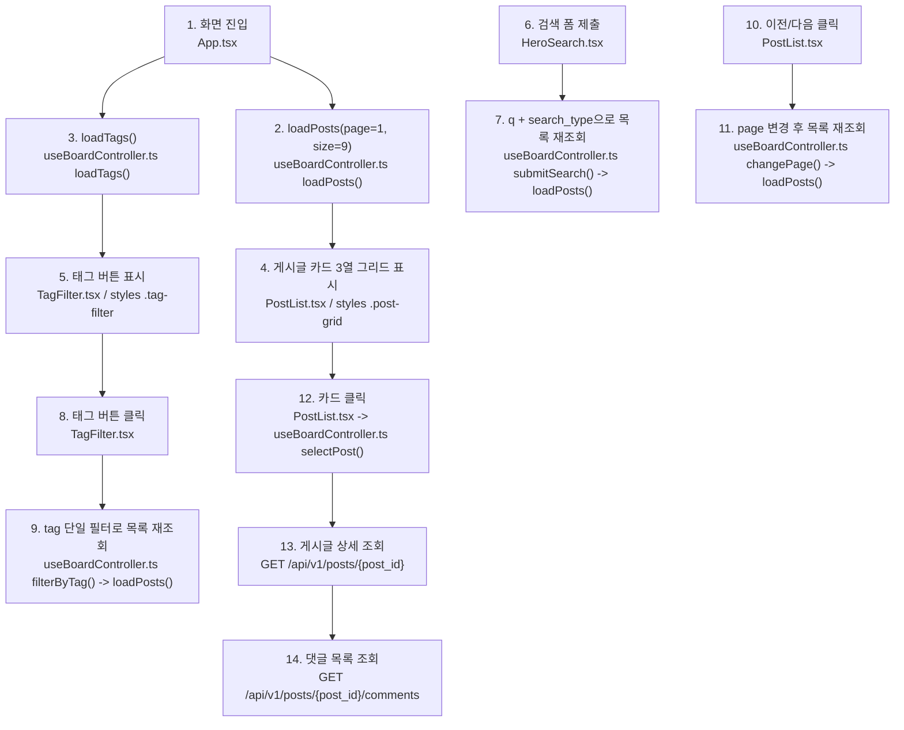

# Sprint 4 구현 기록

## 1. 구현 목표

Sprint 4의 목표는 게시판을 단순 CRUD에서 **탐색 가능한 게시판**으로 확장하는 것입니다.

Sprint 3까지는 게시글과 댓글을 만들고 권한을 확인하는 흐름을 완성했습니다. Sprint 4에서는 게시글을 찾기 쉽게 하기 위해 아래 기능을 추가했습니다.

```text
1. Tag 모델
2. Post-Tag N:M 관계
3. 게시글 작성/수정 시 태그 연결
4. 게시글 목록 검색
5. 단일 태그 필터
6. page/size 기반 페이징
7. 페이징 metadata 응답
8. 프론트 검색/태그/페이지 UI
```

### 1.1 Sprint 4 완료 판단 핵심 포인트

Sprint 4는 코드를 전부 외우는 것이 아니라, **탐색 가능한 게시판이 어떤 흐름으로 동작하는지 설명할 수 있으면 완료**로 판단합니다.

문법을 모두 이해하지 못해도 괜찮습니다. 아래 핵심 포인트를 문서를 보면서라도 말로 설명할 수 있으면 다음 스프린트로 넘어가도 됩니다.

| 핵심 포인트 | 설명 |
| --- | --- |
| 태그를 `posts` 컬럼 하나가 아니라 `tags + post_tags`로 분리한 이유 | 태그를 문자열로 저장하면 검색, 중복 제거, 태그 목록 조회, RAG metadata 활용이 어려워집니다. `tags`는 태그 이름을 중복 없이 저장하고, `post_tags`는 게시글과 태그의 연결만 저장합니다. |
| 게시글 작성/수정 시 태그가 저장되는 흐름 | 프론트는 `tags` 배열을 request body로 보내고, 백엔드는 태그를 `strip + lowercase + dedupe`로 정리합니다. 이후 기존 태그는 재사용하고, 없는 태그는 새로 만든 뒤 `post_tags`로 게시글과 연결합니다. |
| 목록 조회 query parameter의 역할 | `q`는 검색어, `search_type`은 검색 범위, `tag`는 단일 태그 필터, `page/size`는 페이징 기준입니다. 정렬이 포함된 상태라면 `sort`는 최신순, 댓글 많은 순, 좋아요 많은 순 같은 목록 순서를 결정합니다. |
| 댓글 수와 좋아요 수가 목록과 정렬에 쓰이는 방식 | 댓글 수는 댓글 테이블에서 계산해 응답에 포함하고, 좋아요 수는 post의 속성으로 응답에 포함합니다. 프론트는 이 값을 카드에 표시하고, 백엔드는 이 값을 기준으로 정렬할 수 있습니다. |
| 프론트 검색/태그/정렬/페이지 변경 흐름 | 사용자가 검색어를 입력하거나 태그, 정렬, 페이지를 바꾸면 React 상태가 바뀌고, 그 상태를 바탕으로 `GET /api/v1/posts?...` 요청을 다시 보냅니다. 응답으로 받은 `items`와 page metadata가 화면 카드와 pagination을 다시 그립니다. |
| 다이어그램에서 코드 읽는 법 | 전체 문법을 다 읽지 않아도 됩니다. 각 Mermaid 단계의 괄호 안에 적힌 파일/함수만 따라가면 됩니다. 예를 들어 `useBoardController.ts loadPosts()`에서 요청이 시작되고, `posts.py list_posts`, `post_service.py list`, `post_repository.py list`, `schemas/post.py PostPage` 순서로 보면 됩니다. |
| 완료 판단 질문 | “사용자가 검색어를 입력하고 댓글 많은 순을 선택하면, 프론트는 어떤 URL로 요청하고, 백엔드는 어떤 조건으로 DB를 조회하고, 응답은 화면에 어떻게 반영되는가?”를 문서 보면서 설명할 수 있으면 Sprint 4 학습은 완료로 봅니다. |

## 2. 확정한 설계 결정

| 항목 | 결정 |
| --- | --- |
| 태그 구조 | `tags` + `post_tags` 별도 테이블 |
| 관계 | `posts`와 `tags` N:M |
| 태그 normalize | `strip + lowercase` |
| 태그 표시 | 소문자 |
| 게시글당 태그 수 | 최대 5개 |
| 태그 길이 | 최대 30자 |
| 검색 방식 | PostgreSQL `ILIKE` |
| 검색 타입 | `title`, `content`, `title_content`, `author` |
| 태그 필터 | 단일 tag |
| 페이징 | `page`, `size` |
| 기본 page size | 9 |
| 최대 page size | 50 |
| 정렬 | 최신순 `created_at desc` |
| 목록 응답 | `items + page + size + total + total_pages` |
| DB schema 변경 | Alembic 없이 DB reset |

## 3. 변경한 파일

```text
backend/app/models/post.py
backend/app/models/tag.py
backend/app/schemas/post.py
backend/app/schemas/tag.py
backend/app/repositories/post_repository.py
backend/app/repositories/tag_repository.py
backend/app/services/post_service.py
backend/app/api/dependencies.py
backend/app/api/v1/posts.py
backend/app/api/v1/tags.py
backend/app/main.py
backend/tests/test_post_service.py
backend/tests/test_posts_flow.py
frontend/index.html
frontend/src/App.tsx
frontend/src/hooks/useBoardController.ts
frontend/src/components/HeroSearch.tsx
frontend/src/components/TagFilter.tsx
frontend/src/components/PostList.tsx
frontend/src/components/ComposeModal.tsx
frontend/src/components/PostDetail.tsx
frontend/src/constants/board.ts
frontend/src/utils/postFormatting.ts
frontend/src/styles.css
docs2/sprint-4/implementation-record.md
```

## 4. API 계약

### 4.1 게시글 목록 조회

```text
GET /api/v1/posts?q=&search_type=title_content&tag=&page=1&size=9
```

query parameter:

| 이름 | 의미 | 기본값 |
| --- | --- | --- |
| `q` | 검색어 | 없음 |
| `search_type` | 검색 범위 | `title_content` |
| `tag` | 단일 태그 필터 | 없음 |
| `page` | 페이지 번호 | `1` |
| `size` | 한 페이지 크기 | `9` |

`search_type` 값:

```text
title          -> posts.title
content        -> posts.content
title_content  -> posts.title OR posts.content
author         -> users.username OR users.display_name
```

응답:

```json
{
  "items": [],
  "page": 1,
  "size": 9,
  "total": 23,
  "total_pages": 3
}
```

### 4.2 게시글 작성/수정 태그 입력

```http
POST /api/v1/posts
PATCH /api/v1/posts/{post_id}
```

request body:

```json
{
  "title": "Session 인증 정리",
  "content": "쿠키 기반 인증 흐름...",
  "tags": ["FastAPI", " Auth ", "fastapi"]
}
```

서버 normalize 후:

```json
{
  "tags": ["fastapi", "auth"]
}
```

### 4.3 태그 목록 조회

```text
GET /api/v1/tags
```

응답:

```json
[
  {
    "id": 1,
    "name": "auth",
    "created_at": "2026-06-15T00:00:00"
  }
]
```

## 5. 데이터 모델



ERD 읽는 법:

```text
1. USERS는 게시글과 댓글의 작성자다.
2. POSTS는 게시글 본문과 작성자 FK를 가진다.
3. COMMENTS는 게시글과 작성자를 각각 FK로 참조한다.
4. TAGS는 중복 없는 태그 이름을 저장한다.
5. POST_TAGS는 posts와 tags 사이의 N:M 관계를 표현한다.
6. 게시글 하나는 여러 태그를 가질 수 있고, 태그 하나는 여러 게시글에 붙을 수 있다.
```

### 5.1 N:M 관계와 `post_tags`를 쉽게 이해하기

N:M은 "여러 개 대 여러 개" 관계라는 뜻입니다.

게시글과 태그는 아래처럼 연결될 수 있습니다.

```text
게시글 A: fastapi, auth
게시글 B: fastapi, db
게시글 C: react, auth
```

게시글 하나는 태그를 여러 개 가질 수 있습니다.

```text
게시글 A -> fastapi
게시글 A -> auth
```

반대로 태그 하나도 여러 게시글에 붙을 수 있습니다.

```text
fastapi -> 게시글 A
fastapi -> 게시글 B

auth -> 게시글 A
auth -> 게시글 C
```

그래서 게시글과 태그는 `1:N`이 아니라 `N:M`입니다.

```text
posts 여러 개 <-> tags 여러 개
```

DB에서는 이런 N:M 관계를 보통 두 테이블만으로 직접 표현하지 않고, 중간 연결 테이블을 하나 둡니다.

이번 구현에서는 그 중간 테이블이 `post_tags`입니다.

```text
posts

id | title
1  | Session 인증 정리
2  | React 상태 관리
```

```text
tags

id | name
1  | auth
2  | fastapi
3  | react
```

```text
post_tags

post_id | tag_id
1       | 1
1       | 2
2       | 3
```

위 데이터를 말로 풀면 아래와 같습니다.

```text
post_id 1번 게시글에는 tag_id 1번 auth가 붙어 있다.
post_id 1번 게시글에는 tag_id 2번 fastapi가 붙어 있다.
post_id 2번 게시글에는 tag_id 3번 react가 붙어 있다.
```

중요한 점은 `post_tags`가 게시글 내용이나 태그 이름을 저장하는 테이블이 아니라는 것입니다.

`post_tags`는 오직 "어떤 게시글에 어떤 태그가 붙었는가"만 저장하는 연결표입니다.

문자열로 단순 저장하지 않은 이유:

```text
posts.tags = "auth, fastapi"
```

이런 식으로 게시글 row 안에 문자열로 저장하면 처음에는 쉬워 보이지만, 나중에 아래 작업이 불편해집니다.

```text
1. auth 태그가 붙은 게시글만 찾기
2. fastapi 태그가 몇 개 게시글에 쓰였는지 세기
3. 중복 없는 태그 목록 만들기
4. Auth, auth, AUTH처럼 대소문자가 섞이는 문제 막기
5. 태그를 RAG metadata로 활용하기
```

그래서 이번 Sprint에서는 아래처럼 역할을 나눴습니다.

```text
posts      -> 게시글 자체를 저장
tags       -> 태그 이름을 중복 없이 저장
post_tags  -> 게시글과 태그의 연결만 저장
```

## 6. 게시글 작성 + 태그 연결 흐름



단계별 읽기 (다이어그램 1~13):

```text
1. 브라우저는 title, content, tags를 함께 보낸다.

2. posts.py의 create_post()는 get_session_user dependency를 실행한다.
   - Session cookie가 없거나 만료되면 401 SESSION_REQUIRED가 발생한다.

3. get_session_user()가 유효한 세션을 찾으면 current_user를 posts.py로 반환한다.
   - 게시글 작성자는 클라이언트가 보내는 값이 아니라 서버가 확인한 current_user다.

4. create_post()는 PostService.create(payload, current_user.id)를 호출한다.
   - 이 시점의 payload.tags는 schema validator를 거친 값이다.

5. PostService.create()는 normalize된 tag 이름 목록을 사용한다.
   - strip, lowercase, dedupe 처리는 schema에서 먼저 끝난다.

6. PostService는 TagRepository.get_or_create_many(tag_names)를 호출한다.
   - 이미 있는 태그는 재사용하고, 없는 태그는 새로 만든다.

7. TagRepository는 DB에서 tags row를 SELECT하거나 INSERT한다.
   - 여기서 Tag 객체 목록이 준비된다.

8. PostService는 post.tag_entities에 Tag 객체들을 연결한다.
   - 이 연결이 나중에 post_tags 중간 테이블 row가 된다.

9. PostService는 PostRepository.create(Post)를 호출한다.
   - repository는 DB 저장만 담당한다.

10. PostRepository는 posts row를 INSERT한다.

11. SQLAlchemy relationship에 의해 post_tags row도 함께 INSERT된다.
    - posts와 tags의 N:M 연결이 이 단계에서 저장된다.

12. PostService가 commit()으로 posts, tags, post_tags 변경을 확정한다.

13. Browser에 201 PostRead 응답을 반환한다.
    - 응답에는 tags 문자열 배열이 포함된다.
```

## 7. 게시글 수정 + 태그 교체 흐름



단계별 읽기 (다이어그램 1~13):

```text
1. Browser가 PATCH /api/v1/posts/{post_id} 요청을 보낸다.
   - body에는 title, content, tags 중 수정할 값만 들어갈 수 있다.

2. posts.py의 update_post()는 get_session_user dependency를 실행한다.
   - 수정은 로그인 사용자만 가능하다.

3. get_session_user()가 current_user를 posts.py로 반환한다.

4. update_post()는 PostService.update(post_id, payload, current_user.id)를 호출한다.
   - 클라이언트가 author_id를 보내지 않아도 서버가 current_user.id를 사용한다.

5. PostService.update()는 DB에서 post_id에 해당하는 게시글을 조회한다.
   - 게시글이 없으면 404 POST_NOT_FOUND가 발생한다.

6. PostService._ensure_author()가 작성자 권한을 확인한다.
   - current_user.id와 post.author_id를 비교한다.

7. 작성자가 아니면 Browser에 403 POST_FORBIDDEN을 반환한다.
   - 로그인은 했지만 이 게시글을 수정할 권한이 없는 경우다.

8. 작성자가 맞으면 title/content 변경분을 Post 객체에 반영한다.
   - PATCH라서 body에 없는 필드는 유지된다.

9. tags가 request body에 있으면 TagRepository.get_or_create_many(new_tags)를 호출한다.
   - tags가 없으면 기존 태그 연결은 유지된다.

10. TagRepository는 DB에서 필요한 tags row를 SELECT하거나 INSERT한다.

11. PostService는 post.tag_entities를 새 Tag 객체 목록으로 교체한다.
    - 기존 post_tags 연결은 새 목록 기준으로 바뀐다.

12. PostService가 commit()으로 수정 내용을 확정한다.

13. Browser에 200 PostRead 응답을 반환한다.
    - 응답에는 수정 후 tags 문자열 배열이 포함된다.
```

## 8. 게시글 목록 검색/태그/페이징 흐름



단계별 읽기 (다이어그램 1~11):

```text
1. 목록 조회는 비로그인 사용자도 가능하다.
   - Browser가 GET /api/v1/posts 요청을 보낸다.

2. posts.py의 list_posts()는 query parameter를 PostService.list()로 넘긴다.
   - q, search_type, tag, page, size가 여기 포함된다.

3. PostService는 q를 strip하고 tag를 lowercase로 정리한다.
   - 빈 문자열은 검색/필터 조건에서 제외한다.

4. PostService는 PostRepository.list(q, search_type, tag, page, size)를 호출한다.

5. PostRepository는 search_type에 따라 WHERE 조건을 만든다.
   - title, content, title_content, author 중 하나를 선택한다.

6. tag가 있으면 Post.tag_entities를 join한다.
   - 단일 태그와 연결된 게시글만 남기기 위한 join이다.

7. DB에서 현재 검색/필터 조건에 맞는 전체 개수를 count한다.
   - total 값이 된다.

8. DB에서 posts를 최신순으로 조회하고 OFFSET/LIMIT을 적용한다.
   - page와 size로 offset을 계산한다.

9. PostRepository는 posts와 total을 PostService로 반환한다.

10. PostService는 total_pages를 계산한다.
    - 프론트의 이전/다음 버튼 상태 판단에 사용한다.

11. Browser에 PostPage(items, page, size, total, total_pages)를 반환한다.
```

검색 타입별 조건:

```text
title:
  posts.title ILIKE %q%

content:
  posts.content ILIKE %q%

title_content:
  posts.title ILIKE %q% OR posts.content ILIKE %q%

author:
  users.username ILIKE %q% OR users.display_name ILIKE %q%
```

## 9. 단일 태그 필터 흐름



단계별 읽기 (다이어그램 1~7):

```text
1. 사용자가 태그 버튼을 클릭한다.
   - 예: #fastapi 버튼 클릭

2. React가 search.tag 상태를 변경한다.
   - 이미 선택된 태그를 다시 누르면 tag를 비워 toggle할 수 있다.

3. React가 GET /api/v1/posts?tag=fastapi&page=1&size=9 요청을 보낸다.
   - 태그를 바꾸면 page는 1로 되돌린다.

4. PostRepository가 Post.tag_entities를 join한다.
   - posts와 tags를 연결한 post_tags 관계를 타고 조회한다.

5. DB 조건에서 Tag.name == fastapi인지 확인한다.

6A. 조건에 맞으면 해당 게시글을 결과에 포함한다.

6B. 조건에 맞지 않으면 해당 게시글을 결과에서 제외한다.

7. Browser에 items와 page metadata를 반환한다.
```

단일 태그로 제한한 이유:

```text
한 번에 하나의 tag만 필터링한다.
AND/OR 다중 태그 조합은 이번 Sprint에서 제외했다.
검색, 태그, 페이징을 동시에 구현하는 Sprint에서는 단일 tag가 API와 UI를 가장 명확하게 만든다.
```

## 10. Frontend 흐름



단계별 읽기 (다이어그램 1~14):

```text
1. 사용자가 게시판 화면에 진입한다.

2. React가 loadPosts(page=1, size=9)를 실행한다.
   - 첫 화면의 게시글 목록을 가져온다.

3. React가 loadTags()를 실행한다.
   - 태그 필터 버튼을 만들기 위한 태그 목록을 가져온다.

4. loadPosts() 응답으로 게시글 카드 3열 그리드를 표시한다.
   - 화면 크기가 줄어들면 2열 또는 1열로 바뀐다.

5. loadTags() 응답으로 태그 버튼을 표시한다.

6. 사용자가 검색 폼을 제출한다.

7. React가 q와 search_type을 사용해 목록을 다시 조회한다.
   - 검색 시 page는 1로 되돌린다.

8. 사용자가 태그 버튼을 클릭한다.

9. React가 tag 단일 필터로 목록을 다시 조회한다.
   - 기존 검색어와 검색 범위는 유지된다.

10. 사용자가 이전/다음 버튼을 클릭한다.

11. React가 page만 변경해 목록을 다시 조회한다.
    - 검색어와 태그 조건은 유지된다.

12. 사용자가 게시글 카드를 클릭한다.

13. React가 GET /api/v1/posts/{post_id}로 게시글 상세를 조회한다.

14. React가 GET /api/v1/posts/{post_id}/comments로 댓글 목록을 조회한다.
```

Frontend에서 봐야 할 핵심:

```text
loadPosts()는 page metadata가 포함된 PostPage 응답을 받아 posts와 pageMeta를 갱신한다.
submitSearch()는 page를 1로 되돌린 뒤 검색한다.
filterByTag()는 단일 태그를 toggle한다.
changePage()는 현재 검색/태그 조건을 유지한 채 page만 바꾼다.
게시글 작성/수정 시 tags input은 comma-separated string이고, request 직전에 배열로 변환한다.
```

### 10.1 React 상태 관리를 쉽게 이해하기

상태 관리는 "화면이 기억하고 있어야 하는 값을 어디에 저장하고, 언제 바꾸는가"를 정하는 것입니다.

게시판 화면은 단순히 HTML을 한 번 그리는 화면이 아닙니다. 사용자가 검색어를 입력하고, 태그를 누르고, 다음 페이지로 이동하고, 게시글을 작성하면 화면이 계속 바뀝니다.

이때 React가 기억해야 하는 값들이 있습니다.

```text
1. 현재 화면에 보여줄 게시글 목록
2. 전체 태그 목록
3. 선택한 게시글
4. 댓글 목록
5. 검색어
6. 검색 범위
7. 선택한 태그
8. 현재 페이지
9. 한 페이지에 보여줄 게시글 수
10. 게시글 작성 폼 입력값
11. 게시글 수정 폼 입력값
12. 로딩/성공/에러 메시지
```

이런 값들을 "상태"라고 부릅니다.

현재 구현에서는 이 상태를 전부 `frontend/src/hooks/useBoardController.ts` 안에서 React `useState`로 관리합니다.
`frontend/src/App.tsx`는 이 hook이 돌려준 상태와 함수를 각 컴포넌트에 내려주며 화면을 조립합니다.

예를 들어 게시글 목록 상태는 아래처럼 생겼습니다.

```typescript
const [posts, setPosts] = useState<Post[]>([]);
```

읽는 법:

```text
posts    -> 현재 화면에 보여줄 게시글 목록
setPosts -> 게시글 목록을 바꾸는 함수
[]       -> 처음에는 게시글 목록이 비어 있음
```

서버에서 게시글 목록을 받아오면 `setPosts()`로 상태를 바꿉니다.

```javascript
setPosts(result.data.items);
```

그러면 React는 `posts`가 바뀐 것을 보고 화면을 다시 그립니다.

검색 조건도 상태입니다.

```typescript
const [search, setSearch] = useState<SearchState>({
  q: "",
  search_type: "title_content",
  tag: "",
  page: 1,
  size: 9,
});
```

각 값의 의미:

```text
q            -> 검색어
search_type  -> 검색 범위
tag          -> 선택된 태그
page         -> 현재 페이지
size         -> 한 페이지에 보여줄 게시글 수
```

사용자가 검색어를 입력하면 `search.q`가 바뀝니다.
사용자가 태그를 누르면 `search.tag`가 바뀝니다.
사용자가 다음 페이지를 누르면 `search.page`가 바뀝니다.

그 다음 React는 이 상태를 바탕으로 API 요청 주소를 만듭니다.

```text
GET /api/v1/posts?q=fastapi&search_type=title_content&tag=auth&page=1&size=9
```

전체 흐름은 아래 순서로 보면 됩니다.

```text
1. 사용자가 검색어를 입력한다.
2. React가 search 상태를 바꾼다.
3. search 상태를 바탕으로 API 요청 주소를 만든다.
4. 백엔드에 게시글 목록을 요청한다.
5. 응답으로 받은 게시글을 posts 상태에 저장한다.
6. React가 posts 상태를 보고 게시글 카드를 다시 그린다.
```

이번 Sprint의 상태 관리 방식은 `local state`입니다.

```text
local state = useBoardController.ts hook 안에서 관리하고,
필요한 값과 함수만 App.tsx를 통해 하위 컴포넌트로 전달하는 상태
```

현재 앱은 화면 구조가 아직 크지 않기 때문에 `useState` 기반 local state로 충분합니다.
다만 `App.tsx`가 너무 길어지는 문제는 custom hook과 컴포넌트 분리로 이미 줄였습니다.

이미 적용한 것:

```text
custom hook:
  현재 적용된 방식이다.
  useBoardController.ts가 loadPosts, submitSearch, filterByTag 같은 로직을 별도 함수 묶음으로 관리한다.
```

아직 하지 않은 것:

```text
URL query param 상태 관리:
  검색어, 태그, 페이지를 브라우저 주소에 저장하는 방식이다.
  예: /?q=fastapi&tag=auth&page=2
  새로고침하거나 링크를 공유해도 같은 검색 조건이 유지된다.

Zustand/Redux:
  여러 페이지와 여러 컴포넌트가 같은 상태를 공유해야 할 때 쓰는 전역 상태 관리 도구다.
```

지금은 아래 정도로 이해하면 충분합니다.

```text
상태 = 화면의 기억
상태 관리 = 그 기억을 저장하고, 바꾸고, 바뀐 값으로 화면을 다시 그리는 방식
이번 구현 = useBoardController.ts 안에서 useState로 검색어/태그/페이지/게시글 목록을 관리하고, App.tsx는 화면 조립만 담당
```

## 11. 테스트 변경

`backend/tests/test_posts_flow.py`에서 검증하는 것:

```text
1. 게시글 작성 시 tags 입력 가능
2. 태그는 strip + lowercase + dedupe 처리됨
3. PostRead 응답에 tags 포함
4. GET /api/v1/tags로 태그 목록 조회 가능
5. PATCH /posts/{id}로 태그 교체 가능
6. title 검색 가능
7. content 검색 가능
8. title_content 검색 가능
9. author 검색 가능
10. 단일 tag 필터 가능
11. page/size pagination metadata 응답 가능
```

`backend/tests/test_post_service.py`에서 검증하는 것:

```text
PostService.create()가 TagRepository.get_or_create_many()를 호출하고 commit한다.
```

## 12. 검증 결과

아래 명령으로 검증했습니다.

```bash
.venv/bin/python -m pytest backend/tests
```

```bash
npm run build
```

결과:

```text
backend tests: 12 passed
frontend build: vite build passed
```

로컬 API 확인:

```text
GET /api/v1/posts?page=1&size=9 -> 200 PostPage
GET /api/v1/tags -> 200 list[TagRead]
GET http://127.0.0.1:5173/ -> 200
```

## 13. Sprint 4 완료 판단

완료된 것:

- Tag 모델
- `post_tags` N:M 중간 테이블
- 게시글 작성/수정 태그 연결
- 태그 normalize
- 태그 목록 API
- 검색 타입 4개
- 단일 태그 필터
- page/size 페이징
- metadata 포함 목록 응답
- 프론트 검색/태그/페이징 UI
- 테스트 및 빌드 검증

다음 Sprint로 넘길 것:

- AI 기능 스코핑
- RAG/MCP/Agent 시나리오 결정
- pgvector 도입
- 검색 성능 개선
- 다중 태그 AND/OR 필터
- Alembic 도입 여부 재검토

## 14. 발표에 사용할 한 문장

```text
Sprint 4에서는 게시글에 태그를 붙이고,
검색 타입과 단일 태그 필터, page/size 기반 페이징을 추가해
게시판을 단순 CRUD에서 탐색 가능한 지식 공유 화면으로 확장했습니다.
```
