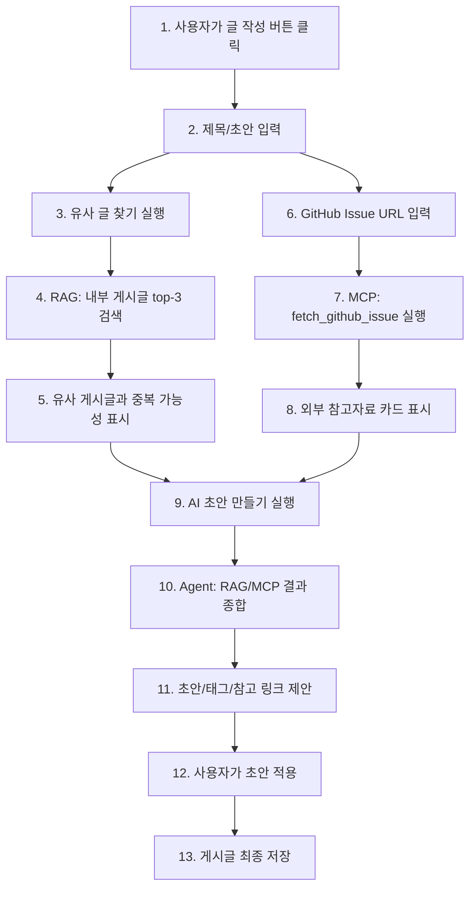

# Sprint 5 의사결정 기록

## 1. Sprint 5 목표

Sprint 5의 목표는 RAG, MCP, Agent를 각각 따로 붙이는 것이 아니라, **게시판의 글쓰기 흐름 안에 자연스럽게 들어가는 AI 기능 시나리오를 확정하는 것**입니다.

Sprint 1~4에서 만든 게시판 기능은 아래 기반을 이미 갖고 있습니다.

```text
1. 회원가입 / 로그인
2. 게시글 CRUD
3. 댓글
4. 태그
5. 검색 / 필터 / 정렬 / 페이징
```

Sprint 5에서는 이 기능들을 AI 기능의 데이터 기반으로 보고, Sprint 6부터 구현할 AI 기능 범위를 결정합니다.

## 2. 최종 결정

최종 방향은 **AI 글쓰기 도우미가 붙은 개발 지식 공유 게시판**입니다.

서비스 이름은 임시로 **DevNote AI**로 둡니다.

```text
DevNote AI

개발자가 트러블슈팅과 학습 노트를 작성하면,
AI가 기존 게시글과 외부 자료를 함께 참고해서
중복 작성을 줄이고 더 좋은 게시글 초안과 태그를 제안하는 지식 공유 게시판
```

### 2.1 핵심 사용자 시나리오

사용자가 글 작성 화면에서 제목 또는 초안을 입력합니다.

```text
FastAPI에서 JWT 인증 구현하다가 401 Unauthorized가 계속 뜹니다.
```

그러면 AI는 아래 순서로 개입합니다.

```text
1. RAG가 내부 게시글에서 유사 글을 찾는다.
2. MCP가 GitHub Issue 같은 외부 참고자료를 가져온다.
3. Agent가 RAG/MCP 결과를 종합한다.
4. Agent가 게시글 초안, 추천 태그, 참고 링크, 중복 가능성을 제안한다.
5. 사용자가 확인한 뒤 게시글 작성 폼에 적용한다.
6. 최종 저장은 사용자가 직접 한다.
```

## 3. 왜 이 방향을 선택했는가

가장 중요한 이유는 **AI 기능이 게시판의 핵심 사용 흐름과 분리되지 않기 때문**입니다.

나쁜 방향은 별도 AI 메뉴를 만들어서 "ChatGPT에게 질문하기"처럼 보이게 하는 것입니다. 이렇게 되면 게시판 CRUD, 댓글, 태그, 검색 기능과 RAG/MCP/Agent가 따로 놀게 됩니다.

이번 방향에서는 기본 게시판 기능이 AI 기능의 데이터가 됩니다.

| 기존 게시판 기능 | AI 기능에서의 역할 |
| --- | --- |
| 게시글 title/content | RAG 검색 대상 |
| 댓글 | 기존 해결 맥락과 토론 데이터 |
| 태그 | RAG metadata / 추천 태그 후보 |
| 검색/필터/정렬 | 일반 검색과 RAG 검색의 차이를 설명하는 비교 대상 |
| 글 작성 화면 | AI Agent가 개입하는 핵심 사용자 접점 |

발표 문장도 명확합니다.

```text
이 서비스는 개발자가 트러블슈팅 글이나 학습 노트를 작성할 때,
기존 게시글과 외부 자료를 AI가 함께 참고해서
중복 작성을 줄이고 더 좋은 게시글 초안과 태그를 제안하는 AI 지식 공유 게시판입니다.
```

## 4. 확정한 AI 기능 범위

### 4.1 RAG: 유사 게시글 추천 및 중복 글 방지

RAG는 글 작성 중 기존 게시글을 기반으로 유사 글을 추천하는 기능으로 구현합니다.

사용자가 제목과 본문 초안을 입력하면, 기존 게시글의 `title`, `content`, `tags`를 embedding한 데이터와 비교해 top-3 유사 게시글을 찾습니다.

화면 예시:

```text
비슷한 글을 찾았어요.

1. FastAPI JWT current_user dependency 오류 해결
2. Authorization Bearer 토큰 누락으로 인한 401 문제
3. JWT 만료 시간 설정과 refresh token 처리

요약:
현재 작성 중인 글은 2번 글과 가장 유사합니다.
기존 글에서는 Authorization 헤더 형식이 잘못되어 401이 발생한 사례를 다룹니다.
```

Sprint 6 MVP에서는 게시글 단위 embedding만 저장합니다. 댓글 포함 검색이나 문단 단위 chunking은 확장 범위로 둡니다.

추천 DB 초안:

```text
post_embeddings

id
post_id
embedding
content_snapshot
metadata
created_at
```

`metadata`에는 아래 정보를 우선 저장할 수 있습니다.

```json
{
  "title": "FastAPI JWT 인증에서 401 오류",
  "tags": ["fastapi", "jwt", "auth"],
  "author_id": 1
}
```

### 4.2 MCP: GitHub Issue 참고자료 가져오기

MCP는 외부 자료를 게시글 작성 흐름 안으로 가져오는 기능으로 구현합니다.

Sprint 6 MVP에서는 tool을 하나만 둡니다.

```text
tool name: fetch_github_issue
```

입력:

```json
{
  "owner": "fastapi",
  "repo": "fastapi",
  "issue_number": 1234
}
```

출력:

```json
{
  "title": "JWT auth issue",
  "state": "closed",
  "labels": ["question", "auth"],
  "body_summary": "Authorization 헤더 형식 문제로 인증 dependency가 실패한 사례입니다.",
  "url": "https://github.com/fastapi/fastapi/issues/1234"
}
```

화면에서는 참고자료 카드로 보여줍니다.

```text
참고자료

GitHub Issue: FastAPI auth dependency fails with 401
상태: closed
핵심 요약: Authorization 헤더 형식이 잘못된 경우 dependency에서 사용자 검증이 실패할 수 있음
추천 반영 위치: 원인 후보 섹션
```

GitHub Issue 하나만 먼저 구현하고, 시간이 남으면 `fetch_url_metadata`를 추가합니다.

### 4.3 Agent: RAG/MCP를 사용하는 글쓰기 도우미

Agent는 단순 초안 생성기가 아니라, RAG와 MCP tool을 조합해서 글쓰기 보조 결과를 만드는 역할입니다.

입력 예시:

```text
FastAPI JWT 401 오류 해결 글을 쓰고 싶어.
기존 글이 있는지 보고, 참고자료도 반영해서 초안을 만들어줘.
```

Agent 내부 흐름:

```text
1. 사용자 입력 분석
2. RAG search tool 호출
3. MCP fetch_github_issue tool 호출
4. 검색 결과와 외부 자료를 state에 저장
5. LLM으로 초안 생성
6. 추천 태그 생성
7. 사용자에게 미리보기 반환
8. 사용자가 확인해야만 게시글 작성 폼에 반영
```

출력 예시:

```json
{
  "draft_title": "FastAPI JWT 인증에서 401 Unauthorized가 발생할 때 확인할 것",
  "draft_content": "문제 상황...\n원인 후보...\n확인 방법...\n해결 코드...\n참고 자료...",
  "recommended_tags": ["fastapi", "jwt", "auth", "backend"],
  "related_posts": [
    {
      "post_id": 3,
      "title": "Authorization Bearer 누락 문제",
      "reason": "401 오류 원인이 유사함"
    }
  ],
  "external_sources": [
    {
      "type": "github_issue",
      "title": "JWT auth issue",
      "url": "https://github.com/example/repo/issues/1"
    }
  ]
}
```

Agent 안전장치:

| 항목 | 결정 |
| --- | --- |
| max iterations | 3 |
| max tool calls | 2 |
| tool 실패 처리 | 부분 결과 반환 |
| 저장 정책 | AI 결과는 미리보기만 제공 |
| 최종 저장 | 사용자가 명시적으로 적용/저장 |

## 5. 통합 사용자 흐름



단계별 설명:

```text
1~2. 사용자는 기존 게시판처럼 글을 작성하기 시작한다.
3~5. RAG는 현재 작성 중인 글과 비슷한 기존 게시글을 찾아준다.
6~8. MCP는 GitHub Issue 같은 외부 참고자료를 가져와 작성 화면에 붙인다.
9~11. Agent는 내부 지식과 외부 자료를 합쳐 초안과 태그를 제안한다.
12~13. AI가 바로 DB에 저장하지 않는다. 사용자가 확인하고 적용한 뒤 저장한다.
```

## 6. Sprint 6 MVP 범위

Sprint 6에서는 욕심내지 않고 아래 범위까지만 안정적으로 구현합니다.

| 영역 | Sprint 6 MVP | 제외/확장 |
| --- | --- | --- |
| RAG | 게시글 단위 embedding 저장, 유사 게시글 top-3 검색 | 댓글 포함 검색, chunking, 개인화 |
| MCP | GitHub Issue 1개 tool | 공식문서 검색, StackOverflow, URL 본문 크롤링 |
| Agent | RAG/MCP 결과 기반 초안/태그 제안 | 자동 게시, 자동 모더레이션, 장기 memory |
| UI | 작성 화면 안에 AI 보조 패널 | 별도 챗봇 페이지 |
| 저장 정책 | 사용자가 적용해야 저장 | AI 자동 저장 |
| 실패 처리 | tool 실패 시 부분 결과 반환 | 복잡한 retry/circuit breaker |

## 7. Sprint 6에서 먼저 의사결정할 것

구현 전에 아래 결정을 먼저 해야 합니다.

| 결정 항목 | 선택지 | 추천 기본값 |
| --- | --- | --- |
| Embedding provider | OpenAI, local embedding model, 임시 mock | OpenAI 또는 mock fallback |
| Vector 저장 방식 | pgvector, 별도 vector DB, 단순 cosine 계산 | pgvector |
| Embedding 생성 시점 | 게시글 저장 시, 수동 재색인, 배치 작업 | 게시글 저장 시 |
| RAG 검색 대상 | title only, content only, title+content+tags | title+content+tags |
| 유사 글 개수 | top-3, top-5 | top-3 |
| MCP 외부 서비스 | GitHub Issue, URL metadata, 공식문서 | GitHub Issue |
| GitHub 인증 | public API only, GitHub token | public API first, token optional |
| Agent 저장 정책 | 자동 저장, 초안만 반환 | 초안만 반환 |
| Agent 적용 방식 | 폼 자동 덮어쓰기, 사용자 버튼으로 적용 | 사용자 버튼으로 적용 |

## 8. Sprint 6 예상 API 초안

### 8.1 유사 게시글 검색

```http
POST /api/v1/ai/rag/related-posts
```

request:

```json
{
  "title": "FastAPI JWT 인증에서 401 오류가 납니다",
  "content": "current_user dependency에서 계속 인증 실패가 납니다.",
  "tags": ["fastapi", "jwt", "auth"]
}
```

response:

```json
{
  "items": [
    {
      "post_id": 3,
      "title": "Authorization Bearer 누락 문제",
      "similarity": 0.86,
      "summary": "Authorization 헤더 형식 문제로 401이 발생한 사례입니다."
    }
  ]
}
```

### 8.2 GitHub Issue 가져오기

```http
POST /api/v1/ai/mcp/github-issue
```

request:

```json
{
  "owner": "fastapi",
  "repo": "fastapi",
  "issue_number": 1234
}
```

response:

```json
{
  "title": "JWT auth issue",
  "state": "closed",
  "labels": ["question"],
  "body_summary": "Authorization 헤더 형식 문제로 인증이 실패한 사례입니다.",
  "url": "https://github.com/fastapi/fastapi/issues/1234"
}
```

### 8.3 Agent 초안 생성

```http
POST /api/v1/ai/agent/draft-post
```

request:

```json
{
  "title": "FastAPI JWT 인증에서 401 오류가 납니다",
  "content": "current_user dependency에서 계속 인증 실패가 납니다.",
  "tags": ["fastapi", "jwt"],
  "github_issue": {
    "owner": "fastapi",
    "repo": "fastapi",
    "issue_number": 1234
  }
}
```

response:

```json
{
  "draft_title": "FastAPI JWT 인증에서 401 Unauthorized가 발생할 때 확인할 것",
  "draft_content": "문제 상황...\n원인 후보...\n확인 방법...\n해결 코드...\n참고 자료...",
  "recommended_tags": ["fastapi", "jwt", "auth", "backend"],
  "related_posts": [],
  "external_sources": []
}
```

## 9. Sprint 6 예상 파일 구조

```text
backend/app/models/post_embedding.py
backend/app/schemas/ai.py
backend/app/repositories/embedding_repository.py
backend/app/services/embedding_service.py
backend/app/services/rag_service.py
backend/app/services/mcp_service.py
backend/app/services/agent_service.py
backend/app/api/v1/ai.py
backend/tests/test_ai_rag_flow.py
backend/tests/test_ai_mcp_flow.py
backend/tests/test_ai_agent_flow.py
```

프론트는 Sprint 6 진행 중 `App.tsx + useBoardController.ts + components/*.tsx` 구조로 분리했습니다.
따라서 이후 AI 글쓰기 보조 UI도 `App.tsx`에 직접 쌓기보다, 기존 분리 기준을 유지해서 별도 컴포넌트와 API 모듈로 붙입니다.

```text
frontend/src/App.tsx
frontend/src/hooks/useBoardController.ts
frontend/src/components/PostList.tsx
frontend/src/components/PostDetail.tsx
frontend/src/components/ComposeModal.tsx
frontend/src/components/AiWritingAssistant.tsx
frontend/src/api/client.ts
```

`PostList`, `PostDetail`, `ComposeModal`은 이미 분리된 게시판 UI입니다.
Sprint 6 이후 AI 기능을 붙일 때는 `AiWritingAssistant.tsx` 같은 별도 컴포넌트를 만들고, API 호출은 필요하면 `frontend/src/api/client.ts`로 분리합니다.

## 10. 완료 기준

Sprint 5는 아래 질문에 답할 수 있으면 완료입니다.

```text
1. 우리 서비스에서 AI 기능은 어디에 붙는가?
2. RAG는 어떤 데이터를 검색하는가?
3. MCP는 어떤 외부 자료를 가져오는가?
4. Agent는 어떤 tool을 어떤 순서로 사용하는가?
5. AI 결과는 자동 저장되는가, 사용자 확인 후 저장되는가?
6. Sprint 6 MVP에서 무엇을 구현하고 무엇을 제외하는가?
```

팀의 답:

```text
AI 기능은 글 작성 화면에 붙는다.
RAG는 내부 게시글을 검색한다.
MCP는 GitHub Issue 정보를 가져온다.
Agent는 RAG/MCP 결과를 사용해 초안과 태그를 제안한다.
AI 결과는 자동 저장하지 않고 사용자가 적용해야 저장한다.
Sprint 6 MVP는 유사 글 추천, GitHub Issue 참고자료, 초안/태그 제안까지다.
```
