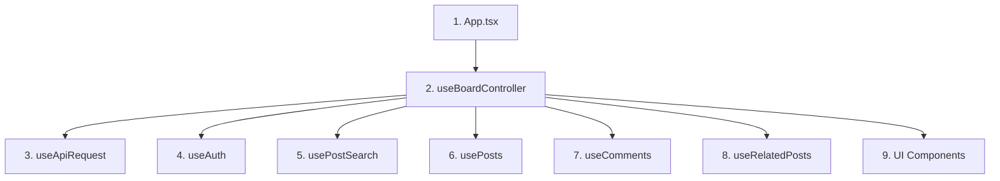
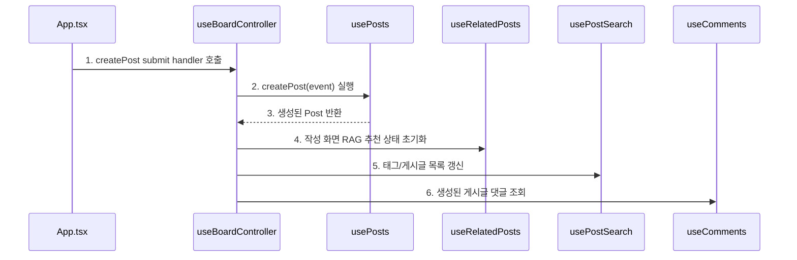
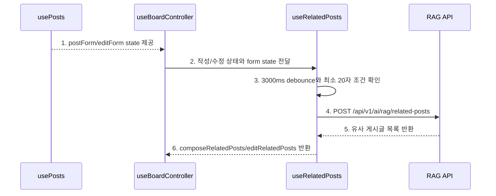

# Sprint 6 프론트 훅 리팩터링 기록

## 1. 목적

이번 리팩터링의 목적은 **거대해진 `useBoardController.ts`를 기능별 custom hook으로 분리해서 프론트 흐름을 읽기 쉽게 만드는 것**입니다.

기능은 바꾸지 않았습니다. UI 컴포넌트가 받는 props 이름도 최대한 유지했습니다.

```text
리팩터링 전:
- useBoardController.ts 하나가 인증, 목록, 검색, 게시글 CRUD, 댓글, 좋아요, RAG 추천, API 요청을 모두 담당했다.

리팩터링 후:
- useBoardController.ts는 여러 hook을 조립하는 역할만 담당한다.
- 실제 상태와 동작은 기능별 hook으로 나뉜다.
```

## 2. React Hook이란 무엇인가

React hook은 **컴포넌트 안에서 필요한 상태와 동작을 함수로 묶는 방법**입니다.

가장 기본 hook은 아래 두 개입니다.

```text
useState
- 값을 기억한다.
- 값이 바뀌면 화면을 다시 그리게 한다.

useEffect
- 특정 값이 바뀐 뒤 실행할 부수 효과를 등록한다.
- API 호출, timer 등록, 외부 이벤트 구독 같은 일을 한다.
```

직접 만든 hook은 보통 `use`로 시작합니다.

```text
useAuth
usePosts
useComments
useRelatedPosts
```

custom hook은 화면을 직접 그리지 않습니다. 대신 화면에 필요한 상태와 함수를 반환합니다.

```text
컴포넌트:
- 화면을 그린다.

hook:
- 화면에 필요한 state와 event handler를 준비한다.
```

### 2.1 훅을 더 쉽게 이해하기

React hook을 너무 공식 문서식으로 이해하려고 하면 헷갈릴 수 있습니다. 지금 리팩터링 맥락에서는 아래처럼 이해하면 충분합니다.

```text
hook = 화면이 뭔가를 기억하거나, 어떤 일을 하게 만드는 함수
custom hook = 그런 기억과 행동을 기능 단위로 묶은 함수
```

가장 작은 기본 hook은 이런 역할을 합니다.

```text
useState
- 값을 기억한다.
- 예: 현재 로그인한 사용자, 게시글 목록, 작성 중인 제목

useEffect
- 어떤 타이밍에 일을 실행한다.
- 예: 화면이 처음 뜰 때 게시글 불러오기, 입력이 멈춘 뒤 RAG 추천 요청하기
```

그런데 `useState`, `useEffect`, API 호출 코드가 한 파일에 계속 쌓이면 `useBoardController.ts`처럼 너무 길어집니다.

그래서 직접 만든 custom hook으로 기능을 나눕니다.

```text
useAuth
- 로그인 상태를 기억한다.
- 로그인/회원가입/로그아웃 요청을 실행한다.

usePosts
- 선택된 게시글, 작성 폼, 수정 폼을 기억한다.
- 게시글 작성/수정/삭제/좋아요 요청을 실행한다.

useComments
- 댓글 목록과 댓글 작성 폼을 기억한다.
- 댓글 작성/삭제 요청을 실행한다.

useRelatedPosts
- 작성 중인 제목/본문을 보고 3초 뒤 RAG 추천 API를 호출한다.
- 추천 결과를 기억한다.
```

즉 아래 두 설명은 같은 말입니다.

```text
React hook은 상태와 동작을 다루는 함수다.

=

custom hook은 상태와 동작을 기능별 파일로 나누는 방법이다.
```

이번 리팩터링에서 말하는 "훅으로 나눈다"는 뜻은 어려운 React 이론이 아닙니다.

```text
useBoardController.ts 하나에 다 들어 있던 기능을
로그인 박스, 게시글 박스, 댓글 박스, RAG 추천 박스로 나눈다.
```

비유하면 `useBoardController.ts`는 원래 게시판 전체가 들어 있는 큰 박스였습니다.

```text
기존:
useBoardController
- 로그인
- 회원가입
- 게시글 목록
- 게시글 작성
- 게시글 수정
- 게시글 삭제
- 댓글 작성
- 댓글 삭제
- 좋아요
- 검색
- 페이징
- RAG 추천
```

리팩터링 후에는 이렇게 작은 박스들로 나눕니다.

```text
useAuth
- 인증 담당 박스

usePostSearch
- 목록/검색/정렬/페이징 담당 박스

usePosts
- 게시글 상세/작성/수정/삭제/좋아요 담당 박스

useComments
- 댓글 담당 박스

useRelatedPosts
- RAG 유사 게시글 추천 담당 박스

useBoardController
- 위 박스들을 조립하는 박스
```

따라서 이 문서에서 hook을 볼 때는 아래 한 문장만 기억하면 됩니다.

```text
기본 hook은 기억/실행 도구이고, custom hook은 그 도구들을 모아 만든 기능 박스다.
```

## 3. 분리 전후 구조



다이어그램 번호와 같은 순서로 코드를 보면 됩니다.

```text
1. App.tsx
   - 코드: frontend/src/App.tsx
   - 확인: 화면 컴포넌트에 board.* props를 넘기는 최상위 컴포넌트다.

2. useBoardController
   - 코드: frontend/src/hooks/useBoardController.ts
   - 확인: 기능별 hook을 호출하고, 서로 필요한 후속 작업을 연결한다.

3. useApiRequest
   - 코드: frontend/src/hooks/useApiRequest.ts
   - 확인: fetch 공통 옵션, credentials include, status message 관리를 담당한다.

4. useAuth
   - 코드: frontend/src/hooks/useAuth.ts
   - 확인: 로그인/회원가입/로그아웃/현재 사용자 상태를 담당한다.

5. usePostSearch
   - 코드: frontend/src/hooks/usePostSearch.ts
   - 확인: 게시글 목록, 태그, 검색, 정렬, 페이징을 담당한다.

6. usePosts
   - 코드: frontend/src/hooks/usePosts.ts
   - 확인: 선택된 게시글, 작성 폼, 수정 폼, 게시글 CRUD, 좋아요를 담당한다.

7. useComments
   - 코드: frontend/src/hooks/useComments.ts
   - 확인: 댓글 목록, 댓글 작성 폼, 댓글 작성/삭제/조회 흐름을 담당한다.

8. useRelatedPosts
   - 코드: frontend/src/hooks/useRelatedPosts.ts
   - 확인: RAG 유사 게시글 추천, debounce, 중복 요청 방지, stale response 방지를 담당한다.

9. UI Components
   - 코드: frontend/src/components/*
   - 확인: hook에서 준비한 state와 handler를 props로 받아 화면만 그린다.
```

## 4. 파일별 책임

| 파일 | 책임 |
| --- | --- |
| `useApiRequest.ts` | 공통 API 요청, `credentials: include`, 성공/실패 status 메시지 |
| `useAuth.ts` | 인증 화면 상태, 로그인/회원가입/로그아웃, 현재 사용자 |
| `usePostSearch.ts` | 게시글 목록, 태그 목록, 검색어, 검색 타입, 정렬, 페이징 |
| `usePosts.ts` | 선택 게시글, 새 글 작성, 글 수정, 글 삭제, 좋아요 |
| `useComments.ts` | 댓글 목록, 댓글 작성 폼, 댓글 작성/삭제 |
| `useRelatedPosts.ts` | RAG 추천 자동 호출, 3000ms debounce, stale response 방지 |
| `useBoardController.ts` | 위 hook들을 조립하고 후속 작업을 연결 |

## 5. 왜 useBoardController를 완전히 없애지 않았는가

`useBoardController`를 완전히 없애면 `App.tsx`가 너무 많은 hook을 직접 조립해야 합니다.

예를 들어 게시글 작성 성공 후에는 여러 일이 이어집니다.

```text
1. 작성 모달 닫기
2. 선택 게시글 갱신
3. RAG 추천 상태 초기화
4. 태그 목록 갱신
5. 게시글 목록 갱신
6. 댓글 목록 조회
```

이 흐름은 한 hook 안에만 속하지 않습니다. 그래서 `useBoardController`는 **기능 로직을 직접 들고 있는 파일**이 아니라, **기능별 hook을 연결하는 조립자**로 남겼습니다.

## 6. 게시글 작성 흐름



다이어그램 번호와 같은 순서로 코드를 보면 됩니다.

```text
1. createPost submit handler 호출
   - 코드: frontend/src/App.tsx
   - 확인: ComposeModal의 onSubmit이 board.createPost를 호출한다.

2. createPost(event) 실행
   - 코드: frontend/src/hooks/useBoardController.ts
   - 함수: createPost()
   - 코드: frontend/src/hooks/usePosts.ts
   - 함수: createPost()
   - 확인: usePosts가 실제 /api/v1/posts 요청과 작성 폼 상태 변경을 담당한다.

3. 생성된 Post 반환
   - 코드: frontend/src/hooks/usePosts.ts
   - 함수: createPost()
   - 확인: 성공하면 생성된 Post를 useBoardController로 반환한다.

4. 작성 화면 RAG 추천 상태 초기화
   - 코드: frontend/src/hooks/useBoardController.ts
   - 함수: createPost()
   - 코드: frontend/src/hooks/useRelatedPosts.ts
   - 함수: resetComposeRelatedPosts()
   - 확인: 작성 완료 후 이전 추천 결과가 남지 않게 한다.

5. 태그/게시글 목록 갱신
   - 코드: frontend/src/hooks/useBoardController.ts
   - 함수: createPost()
   - 코드: frontend/src/hooks/usePostSearch.ts
   - 함수: loadTags(), loadPosts()
   - 확인: 새 게시글과 새 태그가 목록에 반영되게 한다.

6. 생성된 게시글 댓글 조회
   - 코드: frontend/src/hooks/useBoardController.ts
   - 함수: createPost()
   - 코드: frontend/src/hooks/useComments.ts
   - 함수: loadComments()
   - 확인: 상세 화면으로 이동한 뒤 댓글 영역이 초기화된 상태로 보이게 한다.
```

## 7. RAG 추천 흐름



다이어그램 번호와 같은 순서로 코드를 보면 됩니다.

```text
1. postForm/editForm state 제공
   - 코드: frontend/src/hooks/usePosts.ts
   - 확인: 작성 폼과 수정 폼의 입력 상태는 게시글 hook이 소유한다.

2. 작성/수정 상태와 form state 전달
   - 코드: frontend/src/hooks/useBoardController.ts
   - hook: useRelatedPosts()
   - 확인: useBoardController가 usePosts의 상태를 useRelatedPosts에 넘긴다.

3. 3000ms debounce와 최소 20자 조건 확인
   - 코드: frontend/src/hooks/useRelatedPosts.ts
   - 함수: scheduleRelatedPosts(), buildRelatedRequestKey()
   - 확인: 입력마다 바로 요청하지 않고 조건을 만족할 때만 timer를 건다.

4. POST /api/v1/ai/rag/related-posts
   - 코드: frontend/src/hooks/useRelatedPosts.ts
   - 함수: loadRelatedPosts()
   - 확인: 추천 API 요청은 RAG 전용 hook 안에서만 발생한다.

5. 유사 게시글 목록 반환
   - 코드: frontend/src/hooks/useRelatedPosts.ts
   - 함수: loadRelatedPosts()
   - 확인: 최신 requestId와 맞는 응답만 state에 반영한다.

6. composeRelatedPosts/editRelatedPosts 반환
   - 코드: frontend/src/hooks/useRelatedPosts.ts
   - 확인: 작성 화면과 수정 화면의 추천 결과를 분리해서 반환한다.
```

## 8. 코드 읽는 순서

처음부터 모든 hook을 동시에 읽으면 헷갈립니다. 아래 순서로 보면 됩니다.

```text
1. frontend/src/App.tsx
   - 어떤 컴포넌트에 어떤 board.* props가 넘어가는지 본다.

2. frontend/src/hooks/useBoardController.ts
   - board.* 값이 어떤 hook에서 오는지 본다.

3. frontend/src/hooks/useApiRequest.ts
   - 모든 API 요청이 어떤 공통 fetch를 거치는지 본다.

4. frontend/src/hooks/usePostSearch.ts
   - 목록, 검색, 정렬, 페이징 흐름을 본다.

5. frontend/src/hooks/usePosts.ts
   - 게시글 작성/수정/삭제/좋아요 흐름을 본다.

6. frontend/src/hooks/useComments.ts
   - 댓글 작성/삭제 흐름을 본다.

7. frontend/src/hooks/useRelatedPosts.ts
   - RAG 자동 추천 흐름을 본다.
```

## 9. 이번 리팩터링에서 의도적으로 하지 않은 것

```text
1. Zustand/Redux 같은 외부 상태관리 라이브러리는 도입하지 않았다.
2. API client 파일을 endpoint별로 더 잘게 쪼개지는 않았다.
3. UI 컴포넌트의 props 이름은 크게 바꾸지 않았다.
4. 기능 동작은 바꾸지 않고 hook 책임만 분리했다.
```

이유는 지금 목표가 프론트 아키텍처 완성보다 **현재 코드를 읽고 따라갈 수 있게 만드는 것**이기 때문입니다.

## 10. 검증

```bash
npm run build
```

결과:

```text
통과
tsc --noEmit 통과
vite build 통과
```
