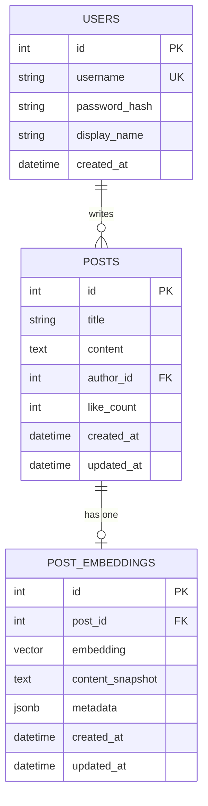
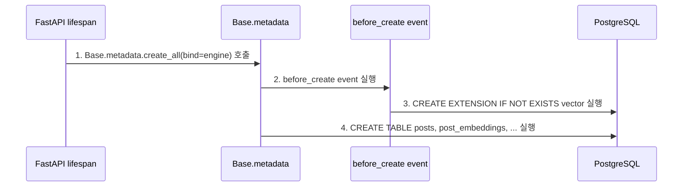
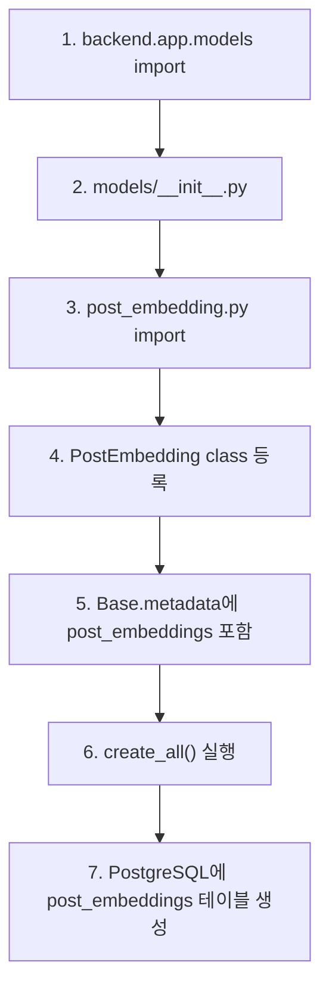

# Sprint 6 Step 1 구현 기록

## 1. 오늘 구현 범위

이번 기록은 Sprint 6 전체가 아니라 **Step 1: pgvector와 post_embeddings 테이블 준비**까지만 다룹니다.

Sprint 6 전체 목표는 pgvector 기반 RAG입니다. 하지만 오늘은 RAG 검색 API나 프론트 자동 추천까지 가지 않고, RAG를 저장할 수 있는 DB 구조를 먼저 만들었습니다.

```text
오늘 완료:
1. PostgreSQL image를 pgvector 지원 image로 변경
2. pgvector extension 자동 생성
3. post_embeddings 테이블 모델 추가
4. posts -> post_embeddings 1:1 관계 연결
5. Step 1 스키마 테스트 추가
6. 전체 백엔드 테스트 통과 확인

오늘 제외:
1. embedding 생성
2. embedding 저장/갱신 service
3. 유사 게시글 검색 API
4. React 자동 유사글 추천 UI
5. LLM 요약
```

## 2. Step 1 완료 판단 핵심 포인트

Step 1은 코드를 많이 외우는 단계가 아닙니다. 아래 질문에 답할 수 있으면 완료로 봅니다.

| 질문 | 답 |
| --- | --- |
| pgvector extension은 왜 필요한가? | PostgreSQL이 기본으로는 `vector(1536)` 타입을 모르기 때문에, vector 컬럼과 vector 연산자를 쓰려면 `CREATE EXTENSION vector`가 필요하다. |
| embedding을 `posts`에 직접 넣지 않은 이유는? | 게시글 본문 데이터와 RAG용 vector 데이터를 분리하기 위해서다. 나중에 embedding 재생성, 모델 변경, chunking 확장 시 `posts` 테이블을 덜 흔들 수 있다. |
| `post_embeddings.post_id`는 왜 FK인가? | embedding row가 어떤 게시글을 위한 것인지 보장하고, 게시글 삭제 시 연결된 embedding도 같이 정리하기 위해서다. |
| 지금 Step 1에서 RAG 검색이 가능한가? | 아직 아니다. 오늘은 vector를 저장할 수 있는 테이블까지만 만들었다. 검색은 Step 3에서 구현한다. |
| vector 차원은 왜 1536인가? | MVP 기준 embedding 모델을 1536차원으로 가정했기 때문이다. Step 2에서 실제 embedding/mock embedding이 이 차원에 맞춰진다. |

## 3. 확정한 설계 결정

| 항목 | 결정 |
| --- | --- |
| DB image | `pgvector/pgvector:pg16` |
| pgvector 활성화 | `Base.metadata.create_all()` 전에 `CREATE EXTENSION IF NOT EXISTS vector` 실행 |
| embedding 저장 위치 | `post_embeddings` 별도 테이블 |
| 게시글과 embedding 관계 | `posts 1:1 post_embeddings` |
| vector column | `embedding vector(1536)` |
| metadata column | PostgreSQL `JSONB` |
| Python attribute 이름 | `embedding_metadata` |
| 실제 DB column 이름 | `metadata` |
| 게시글 삭제 동기화 | `Post.embedding` relationship에 `cascade="all, delete-orphan"` |
| 테스트 방식 | PostgreSQL catalog에서 실제 vector column 타입 확인 |

`metadata`라는 이름은 SQLAlchemy Declarative 내부에서 이미 쓰는 이름입니다. 그래서 Python 모델에서는 `embedding_metadata`로 쓰고, 실제 DB column만 `"metadata"`로 매핑했습니다.

## 4. 변경한 파일

```text
docker-compose.yml
backend/app/db/base.py
backend/app/main.py
backend/app/models/__init__.py
backend/app/models/post.py
backend/app/models/post_embedding.py
backend/tests/test_rag_schema.py
docs2/sprint-6/implementation-record.md
```

주의:

```text
backend/app/models/post.py에는 이전 작업의 like_count/comment_count 변경도 함께 들어있는 상태다.
Sprint 6 Step 1에서 새로 의미 있는 변경은 Post.embedding relationship 추가다.
```

## 5. 데이터 모델



ERD 읽는 법:

```text
1. USERS는 게시글 작성자다.
2. POSTS.author_id는 USERS.id를 참조한다.
3. POST_EMBEDDINGS.post_id는 POSTS.id를 참조한다.
4. 게시글 하나는 embedding row를 0개 또는 1개 가진다.
5. Step 1에서는 테이블만 준비했기 때문에 기존 게시글에 embedding row가 없을 수도 있다.
6. Step 2에서 게시글 작성/수정 시 embedding row를 만들고 갱신한다.
```

## 6. pgvector extension 생성 흐름



다이어그램 번호와 같은 순서로 코드를 보면 됩니다.

```text
1. Base.metadata.create_all(bind=engine) 호출
   - 코드: backend/app/main.py
   - 함수: lifespan()
   - 확인: FastAPI 시작 시 Base.metadata.create_all(bind=engine)을 호출한다.

2. before_create event 실행
   - 코드: backend/app/db/base.py
   - 함수: create_pgvector_extension()
   - 확인: Base.metadata에 before_create event listener가 붙어 있다.

3. CREATE EXTENSION IF NOT EXISTS vector 실행
   - 코드: backend/app/db/base.py
   - 함수: create_pgvector_extension()
   - 확인: PostgreSQL이 vector 타입을 알 수 있도록 테이블 생성 전에 vector extension을 켠다.

4. CREATE TABLE posts, post_embeddings, ... 실행
   - 코드: backend/app/models/post_embedding.py
   - 클래스: PostEmbedding, Vector
   - 확인: extension이 준비된 뒤 SQLAlchemy가 vector(1536) 컬럼이 있는 post_embeddings 테이블을 만든다.
```

## 7. post_embeddings 테이블 생성 흐름



다이어그램 번호와 같은 순서로 코드를 보면 됩니다.

```text
1. main.py에서 backend.app.models를 import한다.
   - 코드: backend/app/main.py
   - 확인: from backend.app import models 라인이 모델 등록의 시작점이다.

2. models/__init__.py가 실행된다.
   - 코드: backend/app/models/__init__.py
   - 확인: auth, user, post, comment, tag, post_embedding 모델을 한 번에 import한다.

3. post_embedding.py가 import된다.
   - 코드: backend/app/models/__init__.py
   - 확인: post_embedding이 __all__과 import 목록에 포함되어 있다.

4. PostEmbedding class가 등록된다.
   - 코드: backend/app/models/post_embedding.py
   - 클래스: PostEmbedding
   - 확인: class PostEmbedding(Base)가 import되는 순간 SQLAlchemy declarative model로 등록된다.

5. Base.metadata에 post_embeddings가 포함된다.
   - 코드: backend/app/db/base.py, backend/app/models/post_embedding.py
   - 확인: PostEmbedding이 Base를 상속하므로 Base.metadata가 post_embeddings 테이블 정의를 알게 된다.

6. create_all()이 실행된다.
   - 코드: backend/app/main.py
   - 함수: lifespan()
   - 확인: Base.metadata.create_all(bind=engine)이 metadata에 등록된 테이블 생성을 시도한다.

7. PostgreSQL에 post_embeddings 테이블이 생성된다.
   - 코드: backend/app/models/post_embedding.py
   - 클래스: PostEmbedding
   - 확인: post_id FK, embedding vector(1536), content_snapshot, metadata, timestamp 컬럼이 DB 테이블로 만들어진다.
```

## 8. 코드 읽는 순서

Step 1 코드를 읽을 때는 아래 순서로 보면 됩니다.

```text
1. docker-compose.yml
   - db image가 pgvector/pgvector:pg16인지 확인

2. backend/app/db/base.py
   - Base.metadata before_create event 확인
   - CREATE EXTENSION IF NOT EXISTS vector 확인

3. backend/app/models/post_embedding.py
   - EMBEDDING_DIMENSIONS = 1536
   - Vector.get_col_spec()
   - PostEmbedding.embedding
   - PostEmbedding.embedding_metadata
   - PostEmbedding.post relationship

4. backend/app/models/post.py
   - Post.embedding relationship
   - cascade="all, delete-orphan"

5. backend/app/models/__init__.py
   - post_embedding 모델이 import되는지 확인

6. backend/app/main.py
   - backend.app.models import
   - Base.metadata.create_all()

7. backend/tests/test_rag_schema.py
   - post_embeddings 테이블 존재 확인
   - embedding column이 vector(1536)인지 확인
   - pgvector extension이 설치됐는지 확인
```

## 9. 핵심 코드 포인트

### 9.1 pgvector extension

```python
@event.listens_for(Base.metadata, "before_create")
def create_pgvector_extension(_, connection, **__) -> None:
    connection.execute(text("CREATE EXTENSION IF NOT EXISTS vector"))
```

이 코드는 테이블 생성 전에 PostgreSQL에 vector extension을 켭니다. 테스트에서도 `Base.metadata.create_all()`을 직접 호출하므로 같은 event가 실행됩니다.

### 9.2 vector column

```python
EMBEDDING_DIMENSIONS = 1536

class Vector(UserDefinedType):
    def get_col_spec(self, **_: Any) -> str:
        return f"vector({self.dimensions})"
```

SQLAlchemy 기본 타입에는 pgvector의 `vector(1536)`가 없습니다. 그래서 Step 1에서는 최소 custom type을 만들어 DB column spec만 정확히 생성하게 했습니다.

### 9.3 post_embeddings model

```python
class PostEmbedding(Base):
    __tablename__ = "post_embeddings"

    post_id = mapped_column(ForeignKey("posts.id", ondelete="CASCADE"))
    embedding = mapped_column(Vector(EMBEDDING_DIMENSIONS), nullable=False)
    content_snapshot = mapped_column(Text, nullable=False)
    embedding_metadata = mapped_column("metadata", JSONB, nullable=False, default=dict)
```

이 테이블은 Step 2에서 실제 embedding 값을 저장할 목적입니다. Step 1에서는 아직 row를 만들지 않습니다.

## 10. 검증 결과

### 10.1 DB 컨테이너 준비

실행한 명령:

```bash
docker compose up -d db
docker compose up -d db --remove-orphans
docker compose up -d --force-recreate db
docker compose ps
```

확인 결과:

```text
DB image: pgvector/pgvector:pg16
port: 0.0.0.0:5433 -> 5432
status: healthy
```

중간에 기존 orphan PostgreSQL 컨테이너가 5433 포트를 잡고 있어서 새 pgvector 컨테이너 시작이 한 번 실패했습니다. `--remove-orphans`로 기존 orphan 컨테이너를 정리했고, `--force-recreate`로 compose 설정에 맞는 포트 매핑을 다시 만들었습니다.

### 10.2 Step 1 스키마 테스트

실행:

```bash
.venv/bin/python -m pytest backend/tests/test_rag_schema.py
```

결과:

```text
2 passed
```

검증 내용:

```text
1. post_embeddings 테이블 존재
2. embedding 컬럼이 vector(1536) 타입
3. post_embeddings.post_id -> posts.id FK 존재
4. pgvector extension 설치 확인
```

### 10.3 기존 post service 단위 테스트

실행:

```bash
.venv/bin/python -m pytest backend/tests/test_post_service.py
```

결과:

```text
4 passed
```

### 10.4 전체 백엔드 테스트

실행:

```bash
.venv/bin/python -m pytest backend/tests
```

결과:

```text
16 passed
```

## 11. Step 1 완료 후 이해 체크

아래 질문에 답할 수 있으면 Step 1은 이해한 것으로 봅니다.

```text
1. 왜 DB image를 pgvector/pgvector:pg16으로 바꿨는가?
2. 왜 CREATE EXTENSION IF NOT EXISTS vector가 create_all보다 먼저 실행되어야 하는가?
3. post_embeddings는 posts와 어떤 관계인가?
4. metadata column을 Python에서는 왜 embedding_metadata라고 부르는가?
5. Step 1에서 아직 구현하지 않은 것은 무엇인가?
```

답:

```text
1. 기존 postgres image에는 vector extension이 없을 수 있기 때문이다.
2. extension이 없으면 PostgreSQL이 vector(1536) 타입을 만들 수 없기 때문이다.
3. posts 1개는 post_embeddings 0개 또는 1개를 가진다.
4. SQLAlchemy Declarative의 metadata 이름과 충돌하기 때문이다.
5. embedding 생성, 저장 service, 유사도 검색 API, 프론트 UI는 아직 구현하지 않았다.
```

## 12. 다음 Step

다음은 **Step 2 - 게시글 embedding 생성/저장 흐름 구현**입니다.

Step 2에서 구현할 핵심:

```text
1. title + content + tags를 하나의 embedding 대상 텍스트로 조립
2. 같은 텍스트는 같은 vector가 나오는 mock embedding service 구현
3. 게시글 작성 시 post_embeddings row 생성
4. 게시글 수정 시 post_embeddings row 갱신
5. embedding 실패가 게시글 저장을 막지 않도록 처리
```

Step 2가 끝나면 `PostService.create()`와 `PostService.update()`에서 embedding 저장 흐름을 따라 읽으면 됩니다.
