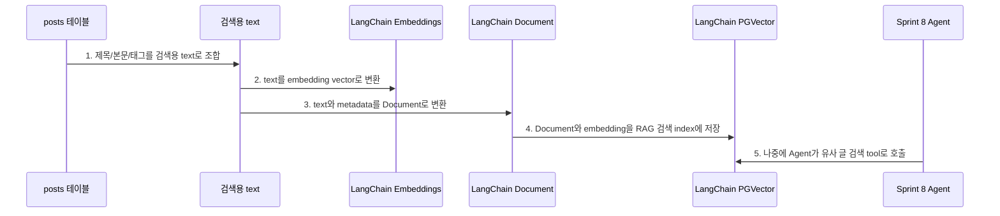
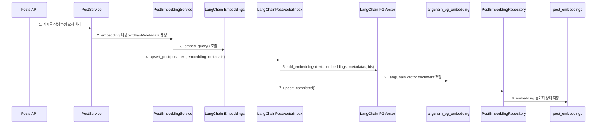
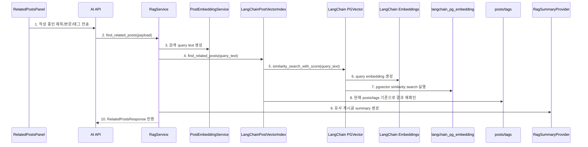
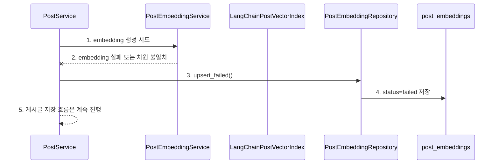

# Sprint 6 LangChain RAG 리팩토링 구현 기록

## 1. 목표

기존 Sprint 6 RAG는 OpenAI embedding 호출과 pgvector SQL 검색을 직접 구현했습니다.
이번 리팩토링의 목표는 **RAG 흐름을 LangChain 기반으로 바꾸고, Sprint 8 Agent에서 같은 검색 기능을 tool로 연결하기 쉬운 구조를 만드는 것**입니다.

이번 변경으로 아래 기준을 맞췄습니다.

```text
1. Embedding provider가 LangChain Embeddings 인터페이스를 따른다.
2. 게시글은 LangChain Document로 변환된다.
3. RAG 검색 index는 LangChain PGVector를 사용한다.
4. 기존 post_embeddings 테이블은 동기화 상태와 실패 기록으로 유지한다.
5. API 응답 형식과 프론트 호출 방식은 바꾸지 않는다.
```

## 2. 핵심 의사결정

| 항목 | 결정 |
| --- | --- |
| RAG framework | LangChain |
| Vector DB | PostgreSQL + pgvector |
| LangChain vector store | `langchain-postgres`의 `PGVector` |
| Embedding model | OpenAI `text-embedding-3-small` 기본값 |
| 테스트 embedding | LangChain `Embeddings` 인터페이스를 구현한 mock |
| 기존 `post_embeddings` | 제거하지 않고 상태/실패 기록 테이블로 유지 |
| LangChain collection | `LANGCHAIN_RAG_COLLECTION_NAME`, 기본값 `post_rag_documents` |

## 3. 왜 LangChain PGVector를 쓰는가

### 3.1 먼저 용어부터 정리

이번 변경에서 가장 헷갈리는 표현은 **"게시글 RAG 검색 index를 만들었다"**는 말입니다.

여기서 `index`는 화면에 보이는 게시글 목록이 아닙니다.
DB의 일반 index와 완전히 같은 뜻도 아닙니다.

여기서는 아래 의미로 보면 됩니다.

```text
RAG 검색 index:
  AI가 유사 게시글을 빨리 찾을 수 있도록,
  게시글 내용을 embedding vector와 metadata 형태로 따로 정리해 둔 검색용 저장소
```

즉 게시글 원본은 여전히 `posts` 테이블에 있습니다.
하지만 AI 유사도 검색은 원문 문자열을 그대로 훑는 방식이 아니라, 글을 숫자 벡터로 바꿔서 가까운 글을 찾습니다.
그래서 RAG 검색을 위해서는 원본 게시글과 별개로 아래 같은 검색용 데이터가 필요합니다.

```text
post_id: 12
page_content: "title: FastAPI 세션 인증 흐름 ..."
embedding: [0.012, -0.448, 0.092, ...]
metadata: {"post_id": 12, "title": "...", "tags": ["fastapi", "auth"]}
```

이런 검색용 묶음을 저장하고 검색하는 곳을 이 문서에서는 **RAG 검색 index**라고 부릅니다.

### 3.2 비유로 이해하기

게시판을 도서관이라고 생각하면 됩니다.

```text
posts 테이블:
  실제 책이 꽂혀 있는 책장

post_embeddings 테이블:
  이 책이 AI 검색에 잘 등록됐는지 확인하는 관리 장부

LangChain PGVector index:
  AI가 책을 의미 기준으로 찾기 위해 사용하는 검색 카드함
```

사용자가 글을 쓰면 실제 책은 `posts` 테이블에 저장됩니다.
그런데 AI가 "이 글과 비슷한 글을 찾아줘"라고 하려면, 책 내용을 숫자 벡터로 바꿔 검색 카드함에 넣어야 합니다.
이번 리팩토링은 그 검색 카드함을 우리가 직접 SQL로 관리하지 않고, LangChain의 `PGVector`가 관리하게 바꾼 것입니다.

### 3.3 기존 방식은 뭐였나

기존 방식은 우리가 RAG 검색 카드함을 직접 만든 것에 가깝습니다.

```text
1. 게시글 내용을 직접 조합한다.
2. OpenAI embedding API를 직접 호출한다.
3. embedding vector를 post_embeddings 테이블에 직접 저장한다.
4. 유사 글 검색 시 pgvector SQL을 직접 작성한다.
5. SQL 결과를 API 응답 모양으로 직접 바꾼다.
```

이 방식도 동작합니다.
실제로 Sprint 6 Step 1~5는 이 방식으로 구현했고, RAG 흐름을 이해하기에는 좋았습니다.

하지만 단점도 있습니다.

```text
1. LangChain/Agent와 바로 연결되는 표준 객체가 없다.
2. 검색 대상이 "LangChain Document"가 아니라 우리만 아는 row 구조다.
3. Agent가 사용할 tool로 감싸려면 또 변환 코드를 만들어야 한다.
4. 나중에 retriever, tool, agent, tracing 같은 기능을 붙일 때 직접 연결해야 한다.
5. 과제의 "프레임워크 선택" 항목을 설명하기 애매하다.
```

### 3.4 LangChain 방식은 뭐가 달라졌나

LangChain 방식에서는 게시글을 RAG 검색용으로 다룰 때 표준 부품을 사용합니다.

```text
Embedding model:
  OpenAIEmbeddings

검색 대상 문서:
  LangChain Document

Vector DB 연결:
  LangChain PGVector

나중에 Agent가 호출할 수 있는 단위:
  LangChain Tool 후보
```

즉 코드가 "우리가 직접 만든 RAG"에서 "LangChain 표준 부품으로 조립한 RAG"에 가까워졌습니다.

```text
PostgreSQL + pgvector:
  vector 저장과 similarity search 담당

LangChain:
  Embeddings, Document, VectorStore, Retriever, Tool, Agent 연결 담당
```

LangChain은 pgvector를 대체하지 않습니다.
pgvector는 여전히 벡터를 저장하고 가까운 벡터를 찾는 역할입니다.

바뀐 점은 **pgvector를 직접 SQL로만 다루던 방식에서, LangChain의 `PGVector` vector store를 통해 다루는 방식으로 바뀐 것**입니다.

### 3.5 실제로 개선된 점

이번 리팩토링의 이점은 "코드가 줄었다"보다 **다음 Sprint로 이어지는 구조가 좋아졌다**는 쪽이 큽니다.

| 개선점 | 설명 | 왜 중요한가 |
| --- | --- | --- |
| 프레임워크 선택이 명확해짐 | RAG framework로 LangChain을 사용한다고 말할 수 있다. | 과제 고려사항의 "프레임워크 선택"을 정면으로 만족한다. |
| Agent 연결이 쉬워짐 | RAG 검색 기능을 LangChain tool로 감싸기 쉬워졌다. | Sprint 8에서 Agent가 RAG/MCP tool을 호출하는 구조로 이어진다. |
| 표준 객체를 사용함 | 게시글이 LangChain `Document`로 변환된다. | LangChain retriever/tool/agent가 이해하기 쉬운 형태가 된다. |
| Vector store 책임이 분리됨 | pgvector 저장/검색은 `PGVector`가 맡는다. | 직접 SQL을 계속 늘리는 부담이 줄어든다. |
| 모델 교체가 쉬워짐 | embedding provider가 LangChain `Embeddings` 인터페이스를 따른다. | OpenAI 외 다른 embedding으로 바꿔도 service 구조가 덜 흔들린다. |
| 기존 학습 기록은 유지됨 | `post_embeddings`는 상태/실패 기록으로 남겼다. | embedding 실패, attempt count, content hash를 계속 확인할 수 있다. |

초보자 관점에서 가장 중요한 변화는 이것입니다.

```text
이전:
  우리가 직접 embedding 저장소와 검색 SQL을 관리한다.

이후:
  게시글을 LangChain Document로 바꾸고,
  LangChain PGVector에게 "이 문서를 검색 가능하게 저장해줘"라고 맡긴다.
```

### 3.6 그래서 코드 읽을 때 어디를 보면 되나

처음에는 아래 순서로 보면 됩니다.

```text
1. backend/app/services/post_service.py
   - 게시글 저장 후 _sync_embedding()이 호출되는지 본다.

2. backend/app/services/embedding_service.py
   - OpenAIEmbeddingProvider가 LangChain OpenAIEmbeddings를 감싸는지 본다.
   - MockEmbeddingProvider도 LangChain Embeddings 인터페이스를 맞추는지 본다.

3. backend/app/services/langchain_rag_index.py
   - 게시글이 Document로 바뀌는 부분을 본다.
   - PGVector.add_embeddings()와 similarity_search_with_score()를 본다.

4. backend/app/services/rag_service.py
   - API 요청이 LangChainPostVectorIndex.find_related_posts()로 이어지는지 본다.
```

이 순서로 보면 "게시글 저장 -> LangChain index 저장 -> 유사 글 검색" 흐름이 연결됩니다.

### 3.7 한눈에 보는 개념 흐름



1. 제목/본문/태그를 검색용 text로 조합
   - 코드: `backend/app/services/embedding_service.py`
   - 함수: `PostEmbeddingService.build_post_text()`
   - 확인: 게시글 원본을 AI가 검색하기 좋은 텍스트 형태로 바꿉니다.

2. text를 embedding vector로 변환
   - 코드: `backend/app/services/embedding_service.py`
   - 함수: `OpenAIEmbeddingProvider.embed_query()`
   - 확인: LangChain `OpenAIEmbeddings`를 통해 숫자 벡터를 만듭니다.

3. text와 metadata를 Document로 변환
   - 코드: `backend/app/services/langchain_rag_index.py`
   - 함수: `LangChainPostVectorIndex._build_document()`
   - 확인: `page_content`에는 검색 대상 text, `metadata`에는 `post_id`, `title`, `tags`를 넣습니다.

4. Document와 embedding을 RAG 검색 index에 저장
   - 코드: `backend/app/services/langchain_rag_index.py`
   - 함수: `LangChainPostVectorIndex.upsert_post()`
   - 확인: `PGVector.add_embeddings()`가 LangChain 관리 테이블에 검색용 document를 저장합니다.

5. 나중에 Agent가 유사 글 검색 tool로 호출
   - 코드 후보: Sprint 8에서 추가할 Agent service
   - 확인: 이번 리팩토링 덕분에 `LangChainPostVectorIndex.find_related_posts()`를 tool로 감싸기 쉬워졌습니다.

## 4. 변경된 구조

```text
기존:
PostService
-> PostEmbeddingService
-> OpenAI client 직접 호출
-> PostEmbeddingRepository
-> post_embeddings.embedding 저장
-> RagService
-> PostEmbeddingRepository.find_related_posts()
-> 직접 pgvector SQL

변경 후:
PostService
-> PostEmbeddingService
-> LangChain Embeddings
-> LangChainPostVectorIndex
-> PGVector.add_embeddings()
-> langchain_pg_embedding 저장
-> PostEmbeddingRepository
-> post_embeddings 상태 기록

RagService
-> LangChainPostVectorIndex
-> PGVector.similarity_search_with_score()
-> 현재 posts 테이블에서 결과 재확인
-> RelatedPostsResponse 반환
```

## 5. 게시글 저장 시 RAG index 동기화 흐름



1. 게시글 작성/수정 요청 처리
   - 코드: `backend/app/services/post_service.py`
   - 함수: `PostService.create()`, `PostService.update()`
   - 확인: 게시글 본문 또는 태그가 바뀌면 `_sync_embedding()`이 호출됩니다.

2. embedding 대상 text/hash/metadata 생성
   - 코드: `backend/app/services/embedding_service.py`
   - 함수: `PostEmbeddingService.build_post_text()`, `build_content_hash()`, `build_metadata()`
   - 확인: `title`, `content`, `tags`를 하나의 embedding 대상 text로 만듭니다.

3. embed_query() 호출
   - 코드: `backend/app/services/embedding_service.py`
   - 함수: `OpenAIEmbeddingProvider.embed_query()`, `MockEmbeddingProvider.embed_query()`
   - 확인: 실제 앱은 LangChain `OpenAIEmbeddings`, 테스트는 mock embedding을 사용합니다.

4. upsert_post(post, text, embedding, metadata)
   - 코드: `backend/app/services/langchain_rag_index.py`
   - 함수: `LangChainPostVectorIndex.upsert_post()`
   - 확인: 게시글을 LangChain `Document` 구조로 변환한 뒤 vector index에 넘깁니다.

5. add_embeddings(texts, embeddings, metadatas, ids)
   - 코드: `backend/app/services/langchain_rag_index.py`
   - 함수: `LangChainPostVectorIndex.upsert_post()`
   - 확인: 이미 생성한 embedding을 넘겨 중복 OpenAI embedding 호출을 피합니다.

6. LangChain vector document 저장
   - 코드: `langchain-postgres`의 `PGVector`
   - DB: `langchain_pg_collection`, `langchain_pg_embedding`
   - 확인: LangChain이 관리하는 pgvector collection에 RAG 검색용 document가 저장됩니다.

7. upsert_completed()
   - 코드: `backend/app/repositories/embedding_repository.py`
   - 함수: `PostEmbeddingRepository.upsert_completed()`
   - 확인: LangChain index 저장까지 성공한 뒤 기존 상태 테이블을 `completed`로 기록합니다.

8. embedding 동기화 상태 저장
   - 코드: `backend/app/models/post_embedding.py`
   - 테이블: `post_embeddings`
   - 확인: 학습과 운영 확인을 위해 embedding vector, content hash, status, attempt count를 유지합니다.

## 6. 유사 게시글 검색 흐름



1. 작성 중인 제목/본문/태그 전송
   - 코드: `frontend/src/hooks/useRelatedPosts.ts`
   - 확인: 프론트는 기존과 동일하게 `/api/v1/ai/rag/related-posts`를 호출합니다.

2. find_related_posts(payload)
   - 코드: `backend/app/api/v1/ai.py`, `backend/app/services/rag_service.py`
   - 함수: `find_related_posts()`, `RagService.find_related_posts()`
   - 확인: API endpoint와 response schema는 바꾸지 않았습니다.

3. 검색 query text 생성
   - 코드: `backend/app/services/embedding_service.py`
   - 함수: `PostEmbeddingService.build_text()`
   - 확인: 작성 중인 글의 `title`, `content`, `tags`를 검색 query text로 합칩니다.

4. find_related_posts(query_text)
   - 코드: `backend/app/services/langchain_rag_index.py`
   - 함수: `LangChainPostVectorIndex.find_related_posts()`
   - 확인: RAG 검색 책임이 repository SQL에서 LangChain index service로 이동했습니다.

5. similarity_search_with_score(query_text)
   - 코드: `backend/app/services/langchain_rag_index.py`
   - 함수: `LangChainPostVectorIndex.find_related_posts()`
   - 확인: LangChain `PGVector`가 query text를 받아 similarity search를 실행합니다.

6. query embedding 생성
   - 코드: `backend/app/services/embedding_service.py`
   - 함수: `as_langchain_embeddings()`, `OpenAIEmbeddingProvider.embed_query()`
   - 확인: 실제 앱에서는 OpenAI embedding이 호출되고, 테스트에서는 mock embedding이 호출됩니다.

7. pgvector similarity search 실행
   - 코드: `langchain-postgres`의 `PGVector`
   - DB: `langchain_pg_embedding`
   - 확인: LangChain이 관리하는 pgvector collection에서 후보 document를 찾습니다.

8. 현재 posts/tags 기준으로 결과 재확인
   - 코드: `backend/app/services/langchain_rag_index.py`
   - 함수: `LangChainPostVectorIndex._hydrate_related_posts()`
   - 확인: 오래된 LangChain document가 있어도 현재 `posts` 테이블에 없는 글은 응답에서 제외합니다.

9. 유사 게시글 summary 생성
   - 코드: `backend/app/services/rag_summary_service.py`
   - 함수: `OpenAIRagSummaryProvider.summarize()`
   - 확인: 유사 게시글이 있으면 각 글마다 2-3문장 summary를 생성합니다.

10. RelatedPostsResponse 반환
    - 코드: `backend/app/schemas/ai.py`
    - 클래스: `RelatedPostsResponse`, `RelatedPostItem`
    - 확인: 프론트가 기대하는 `post_id`, `title`, `content_preview`, `tags`, `similarity`, `summary` 형식은 유지됩니다.

## 7. 실패 처리 흐름



1. embedding 생성 시도
   - 코드: `backend/app/services/post_service.py`
   - 함수: `PostService._sync_embedding()`
   - 확인: 게시글 저장 후 embedding 동기화를 시도합니다.

2. embedding 실패 또는 차원 불일치
   - 코드: `backend/app/services/embedding_service.py`, `backend/app/services/langchain_rag_index.py`
   - 확인: OpenAI embedding 실패, LangChain PGVector 저장 실패, 차원 불일치가 모두 실패로 처리됩니다.

3. upsert_failed()
   - 코드: `backend/app/repositories/embedding_repository.py`
   - 함수: `PostEmbeddingRepository.upsert_failed()`
   - 확인: 실패해도 게시글 작성/수정 자체는 막지 않습니다.

4. status=failed 저장
   - 코드: `backend/app/models/post_embedding.py`
   - 테이블: `post_embeddings`
   - 확인: 실패 사유는 `error_message`, 시도 횟수는 `attempt_count`에 남습니다.

5. 게시글 저장 흐름은 계속 진행
   - 코드: `backend/app/services/post_service.py`
   - 함수: `PostService.create()`, `PostService.update()`
   - 확인: Sprint 6 결정대로 embedding 실패는 게시글 저장 실패로 전파하지 않습니다.

## 8. 주요 코드 위치

| 파일 | 볼 것 |
| --- | --- |
| `backend/app/services/embedding_service.py` | LangChain `Embeddings` 기반 OpenAI/mock provider, legacy adapter |
| `backend/app/services/langchain_rag_index.py` | LangChain `PGVector` upsert/search/delete, Document 변환 |
| `backend/app/services/post_service.py` | 게시글 작성/수정/삭제 시 RAG index 동기화 |
| `backend/app/services/rag_service.py` | RAG API가 LangChain index를 호출하는 흐름 |
| `backend/app/api/dependencies.py` | `LangChainPostVectorIndex` 의존성 주입 |
| `backend/app/core/config.py` | `LANGCHAIN_RAG_COLLECTION_NAME` 설정 |
| `requirements.txt` | `langchain`, `langchain-openai`, `langchain-postgres` 의존성 |

## 9. 테스트 결과

```text
python3 -m pytest backend/tests/test_embedding_flow.py backend/tests/test_ai_rag_flow.py
9 passed

python3 -m pytest backend/tests
25 passed
```

테스트는 localhost PostgreSQL 접속이 필요해서 sandbox 밖에서 실행했습니다.

## 10. Sprint 8로 이어지는 포인트

다음 Sprint 8 Agent에서는 이 구조를 그대로 tool로 감싸면 됩니다.

```text
search_related_posts tool
-> LangChainPostVectorIndex.find_related_posts()

fetch_reference_doc tool
-> Sprint 7 MCP JSON-RPC tool

writing assistant agent
-> RAG tool + MCP tool 결과를 조합
-> 초안/태그/참고자료 제안
```

즉, 이번 리팩토링의 핵심은 RAG를 단순 API 기능이 아니라 **Agent가 호출 가능한 LangChain 기반 검색 도구 후보**로 바꾼 것입니다.
