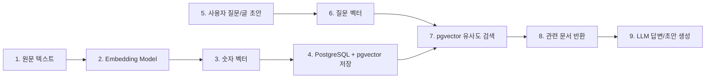
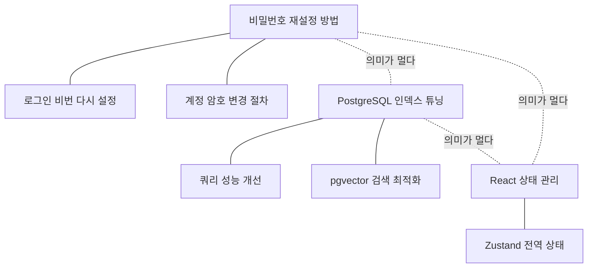
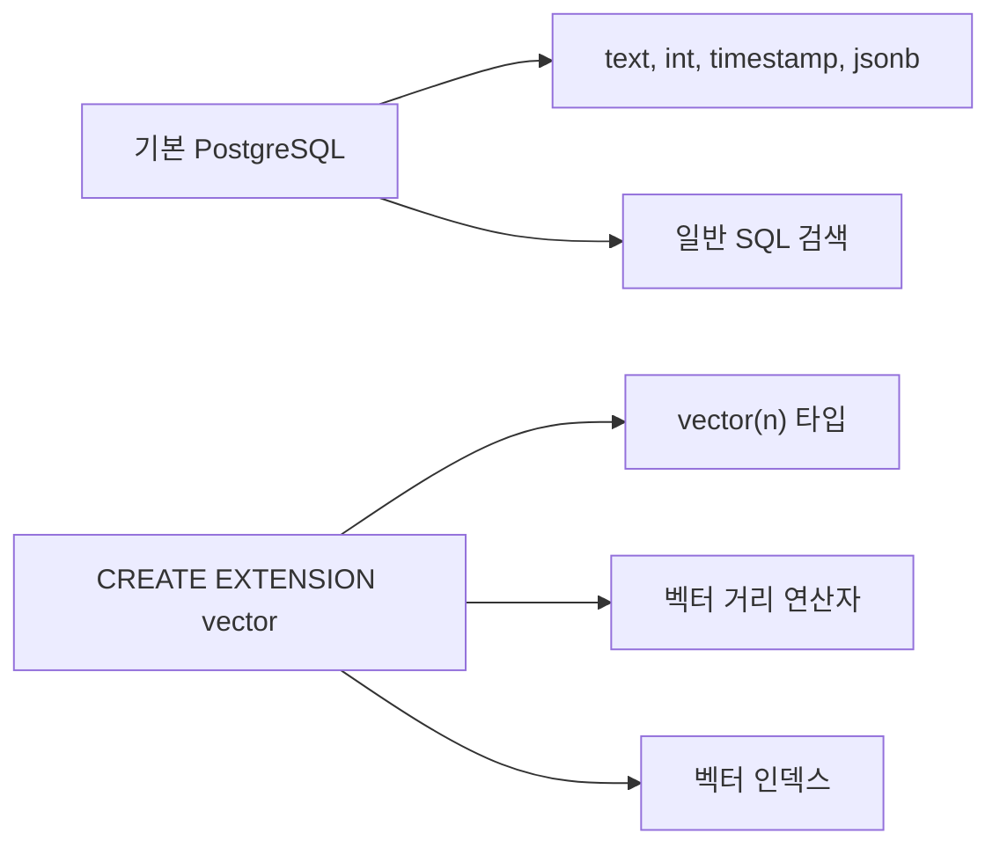
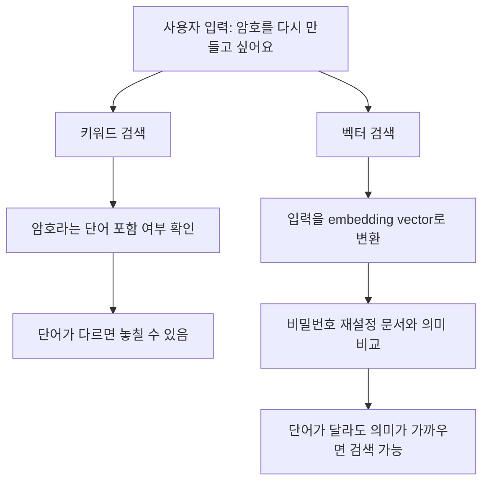
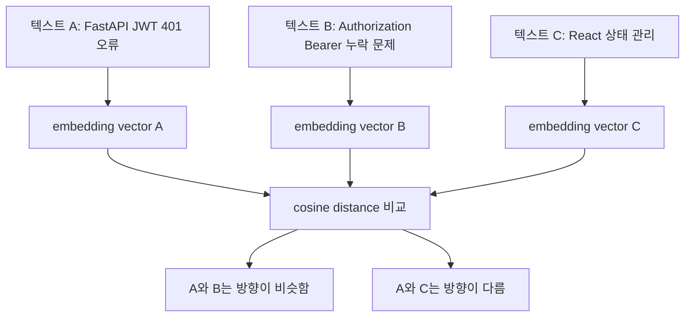
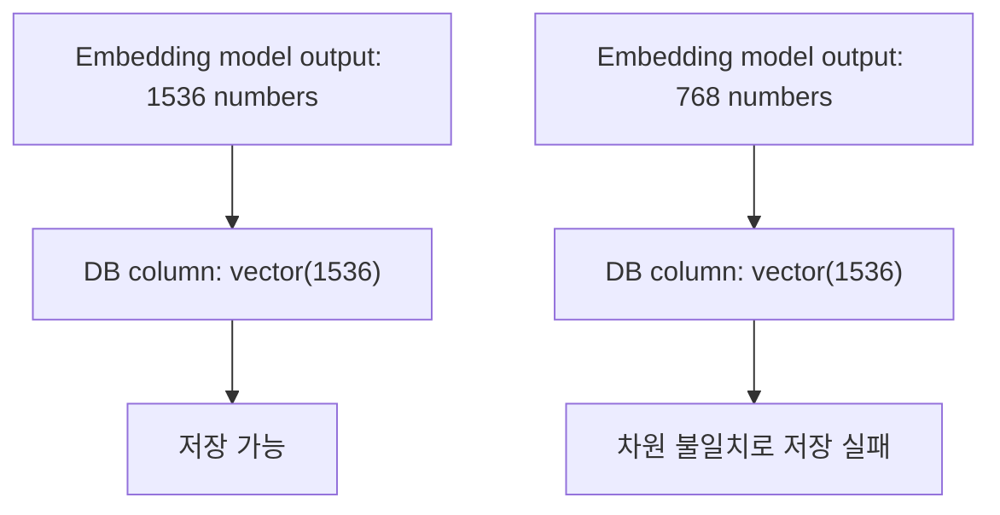
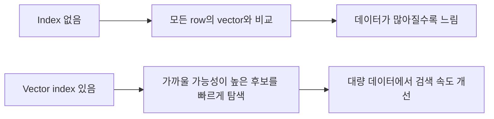

# pgvector 기본 개념

## 1. 한 문장으로 이해하기

PostgreSQL을 DB로 쓰고 RAG를 위해 pgvector를 쓴다는 말은 아래 뜻입니다.

```text
문서의 "의미"를 숫자 벡터로 저장해두고,
사용자 질문이나 작성 중인 글과 의미가 가까운 문서를
PostgreSQL 안에서 찾기 위해 pgvector를 사용한다.
```

pgvector는 답변을 생성하지 않습니다.

```text
pgvector:
  관련 문서를 찾는 검색 도구

LLM:
  검색된 문서를 참고해서 답변, 요약, 초안을 생성하는 도구
```

## 2. RAG에서 pgvector의 위치



RAG 전체 흐름은 보통 이렇습니다.

```text
1. 문서, 게시글, FAQ 같은 원문을 DB에 저장한다.
2. 각 원문을 embedding model로 숫자 벡터로 변환한다.
3. 사용자가 질문하면 질문도 숫자 벡터로 변환한다.
4. pgvector로 질문 벡터와 가까운 문서 벡터를 찾는다.
5. 찾은 문서를 LLM에게 참고자료로 넘긴다.
6. LLM이 참고자료를 바탕으로 답변이나 초안을 만든다.
```

즉 pgvector는 RAG 중 **검색**을 담당합니다.

## 3. 벡터와 임베딩

임베딩 모델은 문장의 의미를 숫자 배열로 바꿉니다.

```text
비밀번호를 재설정하는 방법

-> [0.12, -0.45, 0.88, 0.03, ...]
```

이 숫자 배열을 **embedding vector**라고 합니다.

핵심은 아래입니다.

```text
의미가 비슷한 문장은 벡터 공간에서도 가깝다.
의미가 다른 문장은 벡터 공간에서도 멀다.
```



## 4. pgvector가 추가해주는 것

PostgreSQL은 원래 `text`, `integer`, `timestamp`, `jsonb` 같은 일반 데이터를 잘 다룹니다.

하지만 기본 PostgreSQL만으로는 아래 같은 벡터 데이터를 자연스럽게 저장하고 비교하기 어렵습니다.

```text
[0.12, -0.45, 0.88, 0.03, ...]
```

pgvector는 PostgreSQL에 아래 기능을 추가합니다.

| 기능 | 설명 |
| --- | --- |
| `vector(n)` 타입 | n개 숫자로 이루어진 벡터 컬럼 저장 |
| 거리 연산자 | 벡터끼리 얼마나 가까운지 계산 |
| 유사도 검색 | 질문 벡터와 가까운 문서 벡터 정렬 |
| 벡터 인덱스 | 데이터가 많아졌을 때 검색 속도 개선 |



그래서 벡터 컬럼을 만들기 전에는 보통 아래 extension이 필요합니다.

```sql
CREATE EXTENSION IF NOT EXISTS vector;
```

## 5. 키워드 검색과 벡터 검색 차이

일반 SQL 검색은 단어가 실제로 들어있는지 봅니다.

```sql
SELECT *
FROM documents
WHERE content LIKE '%비밀번호%';
```

이 방식은 `"비밀번호"`라는 단어가 있는 문서는 찾을 수 있습니다.

하지만 사용자가 이렇게 입력하면 놓칠 수 있습니다.

```text
로그인이 안 돼서 암호를 다시 만들고 싶어요
```

문서에는 이렇게 적혀 있을 수 있기 때문입니다.

```text
비밀번호 재설정 방법
```

벡터 검색은 단어가 정확히 같은지보다 의미가 가까운지를 봅니다.



## 6. 아주 단순한 SQL 예시

```sql
CREATE TABLE documents (
  id bigserial PRIMARY KEY,
  content text,
  embedding vector(1536)
);
```

각 컬럼의 의미는 아래와 같습니다.

| 컬럼 | 의미 |
| --- | --- |
| `content` | 원문 문서 |
| `embedding` | 원문을 임베딩 모델로 변환한 벡터 |
| `vector(1536)` | 1536개 숫자로 이루어진 벡터 |

질문 벡터와 가까운 문서를 찾는 쿼리는 이런 모양입니다.

```sql
SELECT content
FROM documents
ORDER BY embedding <=> '[질문 벡터]'
LIMIT 5;
```

이 쿼리는 아래 뜻입니다.

```text
질문 벡터와 cosine distance가 가까운 문서 5개를 가져와라.
```

## 7. 거리 연산자 기본

pgvector에서 자주 보는 거리 기준은 세 가지입니다.

| 연산자 | 기준 | 의미 | 값 해석 |
| --- | --- | --- | --- |
| `<=>` | cosine distance | 두 벡터의 방향 차이 | 작을수록 유사 |
| `<->` | L2 distance | 좌표상 실제 거리 | 작을수록 유사 |
| `<#>` | inner product | 내적 기반 비교 | pgvector에서는 정렬을 위해 음수값으로 다룸 |

Sprint 6에서는 cosine distance를 기본으로 둡니다.



텍스트 의미 검색에서는 벡터의 절대 크기보다 **방향**이 중요할 때가 많습니다. 그래서 단어가 완전히 같지 않아도 의미가 비슷한 글을 찾는 용도에는 cosine distance가 무난한 기본값입니다.

표시용 유사도 점수는 보통 이렇게 바꿔 볼 수 있습니다.

```text
similarity = 1 - cosine_distance
```

단, 실제로 어느 정도부터 "유사하다"고 볼지는 데이터가 쌓인 뒤 조정해야 합니다.

## 8. `vector(1536)`에서 1536은 무엇인가

`vector(1536)`에서 1536은 벡터 안에 들어가는 숫자의 개수입니다.

```text
vector(3):
  [0.12, -0.45, 0.88]

vector(1536):
  [0.12, -0.45, 0.88, ..., 1536개]
```

이 값은 아무 숫자나 고르는 값이 아닙니다. **사용하는 embedding model이 반환하는 벡터 차원과 DB 컬럼 차원이 반드시 같아야 합니다.**



현재 Sprint 6에서 1536으로 고정한 가장 직접적인 이유는 **기본 embedding 모델을 OpenAI `text-embedding-3-small`로 가정했기 때문**입니다.

OpenAI embedding 모델의 기본 출력 차원은 대표적으로 아래처럼 다릅니다.

| 모델 | 기본 embedding 차원 |
| --- | --- |
| `text-embedding-3-small` | 1536 |
| `text-embedding-3-large` | 3072 |

그래서 현재 프로젝트에서는 아래처럼 기준을 잡았습니다.

```text
1. RAG MVP에서는 비용과 성능 균형이 좋은 text-embedding-3-small을 기본 모델로 가정한다.
2. text-embedding-3-small의 기본 출력이 1536차원이므로 DB 컬럼도 vector(1536)으로 맞춘다.
3. mock embedding, 실제 embedding, 테스트, 검색 쿼리 모두 1536차원을 기준으로 맞춘다.
4. 나중에 모델을 바꾸면 DB 컬럼 차원도 함께 바꿔야 한다.
```

중요한 점은 1536이 pgvector의 필수값은 아니라는 것입니다.

```text
1536:
  text-embedding-3-small을 기본 embedding 모델로 가정했을 때의 출력 차원

pgvector:
  vector(768), vector(1536), vector(3072) 등 다른 차원도 가능

주의:
  text-embedding-3-large를 쓰면 기본 3072차원이고,
  다른 로컬 embedding 모델을 쓰면 384, 768, 1024차원일 수도 있다.
  모델을 바꾸면 DB 컬럼 차원, mock embedding 차원, 테스트도 함께 바꿔야 한다.
```

즉 1536으로 고정한 이유는 **pgvector가 1536만 지원해서가 아니라, 현재 MVP의 기본 embedding 모델을 `text-embedding-3-small`로 잡았고 그 모델의 기본 출력 차원이 1536이기 때문**입니다.

## 9. pgvector index 기본

데이터가 적을 때는 index 없이도 검색이 됩니다. 하지만 문서가 많아지면 모든 벡터를 매번 비교해야 하므로 느려질 수 있습니다.



pgvector에서 자주 쓰는 index는 HNSW와 IVFFlat입니다.

| Index | 특징 |
| --- | --- |
| HNSW | 검색 품질이 좋고 빠른 편이지만 메모리를 더 쓸 수 있음 |
| IVFFlat | 대량 데이터에서 튜닝하며 쓰는 근사 검색 방식 |

MVP에서는 먼저 정확히 동작하는 저장/검색 흐름을 만들고, 데이터가 많아졌을 때 index를 추가해도 됩니다.

## 10. pgvector가 해결하지 않는 것

pgvector는 RAG의 일부만 담당합니다.

| 구성 요소 | 역할 |
| --- | --- |
| PostgreSQL | 원문과 메타데이터 저장 |
| pgvector | 벡터 저장 및 유사도 검색 |
| 임베딩 모델 | 텍스트를 벡터로 변환 |
| LLM | 답변, 요약, 초안 생성 |
| chunking | 긴 문서를 검색하기 좋은 단위로 나눔 |
| reranking | 검색 결과를 더 정확한 순서로 재정렬 |

따라서 pgvector는 "RAG 전체"가 아니라, **벡터 저장소이자 의미 기반 검색 엔진**에 가깝습니다.

## 11. 말로 설명할 때 쓸 수 있는 요약

```text
pgvector는 PostgreSQL에 vector 타입과 벡터 거리 계산 기능을 추가하는 extension이다.
RAG에서는 원문을 embedding vector로 저장해두고, 사용자 질문이나 글 초안과 의미가 가까운 문서를 찾는 역할을 한다.
답변 생성은 LLM이 하고, pgvector는 LLM에게 넘길 참고자료를 찾는 검색 엔진에 가깝다.
현재 1536차원으로 고정한 이유는 embedding model의 출력 차원과 DB의 vector 컬럼 차원을 맞추기 위해서다.
```

## 12. 이해 체크 질문

```text
1. pgvector는 RAG 전체 중 어떤 부분을 담당하는가?
2. embedding vector는 무엇인가?
3. 키워드 검색과 벡터 검색은 무엇이 다른가?
4. cosine distance는 왜 텍스트 의미 검색에 적합한가?
5. distance와 similarity는 어떻게 다른가?
6. vector(1536)에서 1536은 무엇을 의미하는가?
7. embedding model의 출력 차원과 DB 컬럼 차원이 다르면 무슨 문제가 생기는가?
8. pgvector index는 언제 필요해지는가?
9. pgvector가 해결하지 않는 RAG 구성 요소는 무엇인가?
```
