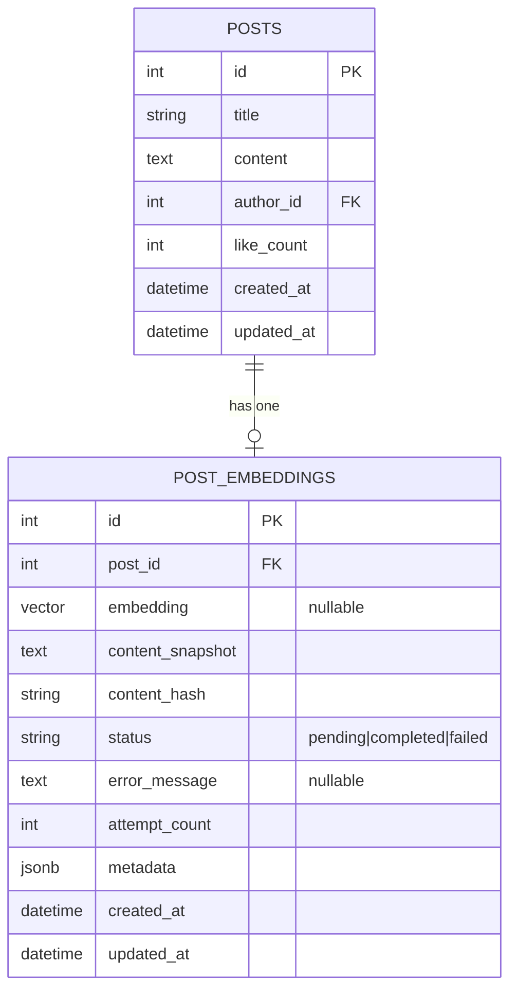
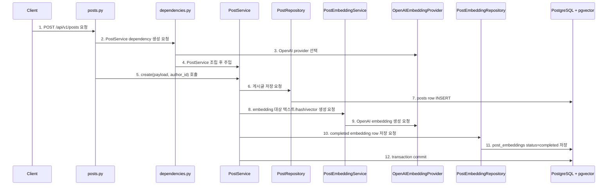
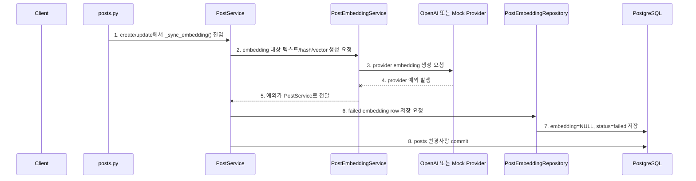
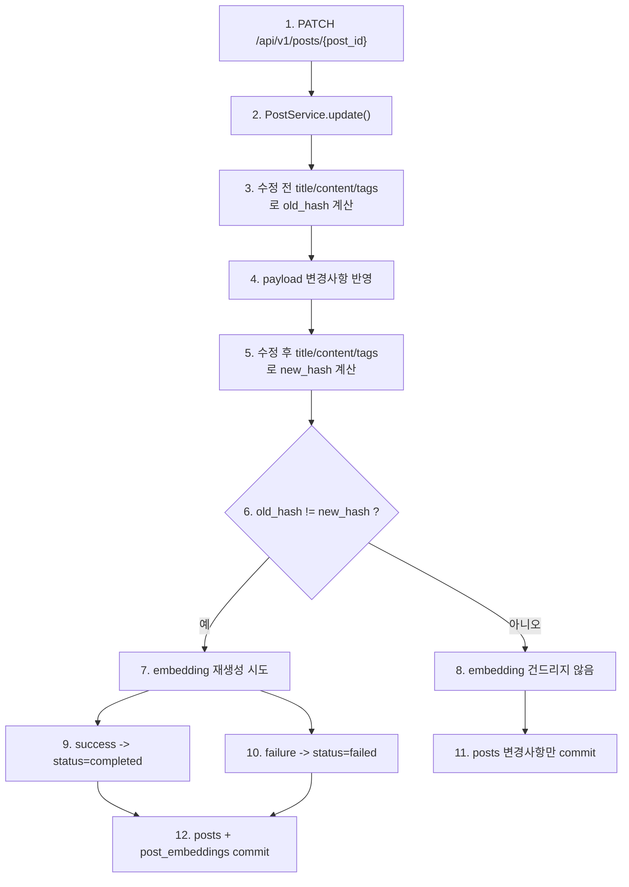
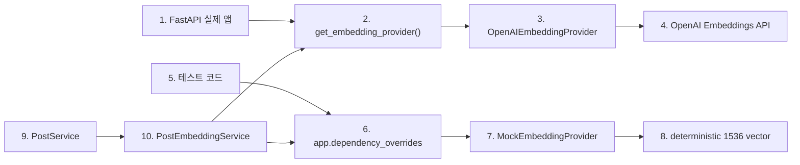

# Sprint 6 Step 2 구현 기록

## 1. 이번 Step의 목표

Step 2의 목표는 **게시글 작성/수정 흐름과 embedding 저장 흐름을 연결하는 것**입니다.

Step 1에서는 `post_embeddings` 테이블과 pgvector 타입만 준비했습니다. Step 2에서는 실제 게시글 데이터가 저장될 때 RAG 검색에 쓸 embedding row도 같이 관리되도록 만들었습니다.

```text
이번 Step에서 완료:
1. 실제 앱은 OpenAI embedding provider를 사용하도록 dependency 구성
2. 테스트는 deterministic mock embedding provider를 사용
3. 게시글 작성 시 post_embeddings row 생성
4. 게시글 수정 시 embedding 대상 텍스트가 바뀐 경우에만 재생성
5. embedding 실패 시 게시글 저장/수정은 성공시키고 status=failed row 저장
6. 실패 row에 재시도 판단에 필요한 content_hash, content_snapshot, error_message, attempt_count 저장

이번 Step에서 제외:
1. 유사 게시글 검색 API
2. React 작성 화면의 실시간 유사글 추천 UI
3. failed embedding 재시도 API
4. LLM 요약
5. pgvector similarity query
```

## 2. 확정한 의사결정

| 항목 | 결정 | 이유 |
| --- | --- | --- |
| 실제 앱 embedding provider | OpenAI embedding | 실제 서비스 흐름에서는 외부 embedding 모델을 사용해야 한다. |
| 테스트 provider | deterministic mock embedding | API key와 네트워크 없이 같은 입력에 같은 vector가 나오게 하기 위해서다. |
| 기본 모델 | `text-embedding-3-small` | 현재 MVP의 vector 차원 `1536`과 맞는 기본 embedding 모델로 가정한다. |
| embedding 실패 처리 | 게시글 저장/수정은 성공 | AI 보조 기능 실패가 게시판 기본 기능을 막으면 안 된다. |
| 실패 기록 | `status=failed` row 저장 | 나중에 failed row만 골라 재시도할 수 있게 하기 위해서다. |
| 수정 시 재생성 조건 | `title + content + tags` hash가 바뀐 경우만 | 좋아요, 빈 PATCH, 기타 비-RAG 필드 변경으로 불필요한 embedding 호출을 막기 위해서다. |
| embedding 대상 텍스트 | title, content, tags | RAG 유사글 추천에서 핵심 비교 대상은 글의 의미와 태그다. |
| 작성자 정보 | metadata에만 저장 | 작성자는 유사도 계산 대상보다 필터/표시/분석 metadata에 가깝다. |

## 3. 변경한 파일

```text
backend/app/models/post_embedding.py
backend/app/repositories/embedding_repository.py
backend/app/services/embedding_service.py
backend/app/services/post_service.py
backend/app/api/dependencies.py
backend/app/core/config.py
backend/app/db/schema.py
backend/tests/test_rag_schema.py
backend/tests/test_embedding_flow.py
requirements.txt
docs2/sprint-6/implementation-record.md
docs2/sprint-6/step-2-implementation-record.md
```

## 4. 데이터 모델 변경

Step 1의 `post_embeddings`는 vector 저장 테이블이었습니다. Step 2에서는 성공/실패/재시도 판단을 위해 상태 컬럼을 추가했습니다.



### 4.1 컬럼 의미

| 컬럼 | 의미 |
| --- | --- |
| `embedding` | pgvector `vector(1536)`. 성공 시 vector 저장, 실패 시 `NULL` |
| `content_snapshot` | embedding을 만들 때 사용한 텍스트 원본 |
| `content_hash` | `content_snapshot`의 SHA-256 hash |
| `status` | `pending`, `completed`, `failed` 중 하나 |
| `error_message` | 실패 이유. 예: OpenAI key 없음, provider 장애, 차원 불일치 |
| `attempt_count` | 해당 row에 embedding 생성을 시도한 횟수 |
| `metadata` | title, tags, author_id 같은 검색 보조 정보 |

`embedding`을 nullable로 바꾼 이유는 실패 row도 남겨야 하기 때문입니다. 실패했을 때 vector가 없는데도 `status=failed`, `content_snapshot`, `error_message`를 저장해야 나중에 재시도 대상을 찾을 수 있습니다.

## 5. 게시글 작성 시 embedding 저장 흐름



다이어그램 번호와 같은 순서로 코드를 보면 됩니다.

```text
1. POST /api/v1/posts 요청
   - 코드: frontend/src/App.jsx
   - 확인: 게시글 작성 submit에서 /api/v1/posts로 요청을 보낸다.

2. PostService dependency 생성 요청
   - 코드: backend/app/api/v1/posts.py
   - 함수: create_post()
   - 확인: current_user와 PostService를 Depends로 받는다.

3. OpenAI provider 선택
   - 코드: backend/app/api/dependencies.py
   - 함수: get_embedding_provider()
   - 확인: 실제 앱에서는 OpenAIEmbeddingProvider()를 반환한다.

4. PostService 조립 후 주입
   - 코드: backend/app/api/dependencies.py
   - 함수: get_post_service()
   - 확인: PostRepository, TagRepository, PostEmbeddingRepository, PostEmbeddingService를 생성해서 PostService에 넣는다.

5. create(payload, author_id) 호출
   - 코드: backend/app/services/post_service.py
   - 함수: PostService.create()
   - 확인: Post 객체를 만들고 tags를 연결한 뒤 저장 흐름을 시작한다.

6. 게시글 저장 요청
   - 코드: backend/app/repositories/post_repository.py
   - 함수: PostRepository.create()
   - 확인: DB에 저장할 Post 객체를 Session에 등록한다.

7. posts row INSERT
   - 코드: backend/app/repositories/post_repository.py
   - 함수: PostRepository.create()
   - 확인: db.add(), db.flush(), db.refresh()로 post.id를 확보한다.

8. embedding 대상 텍스트/hash/vector 생성 요청
   - 코드: backend/app/services/embedding_service.py
   - 함수: PostEmbeddingService.build_post_text(), build_content_hash(), embed()
   - 확인: title/content/tags를 embedding 대상 텍스트로 만들고 hash를 만든 뒤 provider 호출을 준비한다.

9. OpenAI embedding 생성 요청
   - 코드: backend/app/services/embedding_service.py
   - 함수: OpenAIEmbeddingProvider.embed()
   - 확인: OPENAI_API_KEY와 OPENAI_EMBEDDING_MODEL을 사용해 1536차원 embedding을 만든다.

10. completed embedding row 저장 요청
   - 코드: backend/app/repositories/embedding_repository.py
   - 함수: PostEmbeddingRepository.upsert_completed()
   - 확인: 성공한 vector와 snapshot/hash/metadata를 저장할 row를 준비한다.

11. post_embeddings status=completed 저장
   - 코드: backend/app/models/post_embedding.py
   - 모델: PostEmbedding
   - 확인: embedding, content_snapshot, content_hash, status, attempt_count가 저장된다.

12. transaction commit
   - 코드: backend/app/services/post_service.py
   - 함수: PostService.create()
   - 확인: posts와 post_embeddings가 같은 DB transaction으로 commit된다.
```

## 6. embedding 실패 흐름



다이어그램 번호와 같은 순서로 코드를 보면 됩니다.

```text
1. create/update에서 _sync_embedding() 진입
   - 코드: backend/app/services/post_service.py
   - 함수: PostService.create(), PostService.update(), PostService._sync_embedding()
   - 확인: 게시글 작성 또는 수정 중 embedding 동기화가 필요한 경우 이 함수로 들어온다.

2. embedding 대상 텍스트/hash/vector 생성 요청
   - 코드: backend/app/services/embedding_service.py
   - 함수: PostEmbeddingService.build_post_text(), build_content_hash(), embed()
   - 확인: 실패해도 남길 content_snapshot과 content_hash를 만들고 provider 호출을 시도한다.

3. provider embedding 생성 요청
   - 코드: backend/app/services/embedding_service.py
   - 함수: OpenAIEmbeddingProvider.embed(), MockEmbeddingProvider.embed()
   - 확인: 실제 앱이면 OpenAI provider, 테스트면 mock provider가 호출된다.

4. provider 예외 발생
   - 코드: backend/app/services/embedding_service.py
   - 함수: OpenAIEmbeddingProvider.embed()
   - 확인: OPENAI_API_KEY 누락, openai package 누락, API 장애, 차원 불일치 등이 실패 원인이 될 수 있다.

5. 예외가 PostService로 전달
   - 코드: backend/app/services/embedding_service.py
   - 함수: PostEmbeddingService.embed()
   - 확인: embedding_service는 provider 예외를 여기서 삼키지 않고 호출자인 PostService로 전달한다.

6. failed embedding row 저장 요청
   - 코드: backend/app/repositories/embedding_repository.py
   - 함수: PostEmbeddingRepository.upsert_failed()
   - 확인: PostService._sync_embedding()의 except 블록에서 호출되며, 실패 row를 만들거나 기존 row를 failed 상태로 갱신한다.

7. embedding=NULL, status=failed 저장
   - 코드: backend/app/models/post_embedding.py
   - 모델: PostEmbedding
   - 확인: embedding은 NULL, status는 failed, error_message와 attempt_count는 저장된다.

8. posts 변경사항 commit
   - 코드: backend/app/services/post_service.py
   - 함수: PostService.create(), PostService.update()
   - 확인: embedding 실패가 게시글 저장/수정 성공을 막지 않는다. 그래서 라우터는 create는 201, update는 200 응답을 유지한다.
```

이 설계 덕분에 나중에 아래처럼 재시도 기능을 만들 수 있습니다.

```text
1. status=failed row 조회
2. content_snapshot을 다시 provider에 전달
3. 성공하면 같은 post_id row를 status=completed로 갱신
4. 실패하면 attempt_count 증가 및 error_message 갱신
```

## 7. 게시글 수정 시 재생성 판단 흐름



다이어그램 번호와 같은 순서로 코드를 보면 됩니다.

```text
1. PATCH /api/v1/posts/{post_id}
   - 코드: backend/app/api/v1/posts.py
   - 함수: update_post()
   - 확인: 로그인 사용자를 확인한 뒤 service.update()를 호출한다.

2. PostService.update()
   - 코드: backend/app/services/post_service.py
   - 함수: PostService.update()
   - 확인: post 조회와 작성자 권한 확인을 먼저 한다.

3. 수정 전 title/content/tags로 old_hash 계산
   - 코드: backend/app/services/post_service.py
   - 함수: PostService._build_embedding_hash()
   - 확인: payload를 반영하기 전 현재 RAG 대상 텍스트 hash를 저장한다.

4. payload 변경사항 반영
   - 코드: backend/app/services/post_service.py
   - 함수: PostService.update()
   - 확인: title/content 필드를 바꾸고, tags가 있으면 TagRepository로 tag_entities를 다시 연결한다.

5. 수정 후 title/content/tags로 new_hash 계산
   - 코드: backend/app/services/post_service.py
   - 함수: PostService._embedding_content_changed()
   - 확인: 변경 후 RAG 대상 텍스트 hash를 다시 계산한다.

6. old_hash != new_hash ?
   - 코드: backend/app/services/post_service.py
   - 함수: PostService._embedding_content_changed()
   - 확인: hash가 같으면 embedding 재생성이 필요 없다고 판단한다.

7. embedding 재생성 시도
   - 코드: backend/app/services/post_service.py
   - 함수: PostService._sync_embedding()
   - 확인: hash가 달라진 경우에만 provider를 호출한다.

8. embedding 건드리지 않음
   - 코드: backend/app/services/post_service.py
   - 함수: PostService.update()
   - 확인: 빈 PATCH, 좋아요 변경처럼 RAG 대상 텍스트가 같으면 post_embeddings attempt_count가 늘지 않는다.

9. success -> status=completed
   - 코드: backend/app/repositories/embedding_repository.py
   - 함수: PostEmbeddingRepository.upsert_completed()
   - 확인: 새 vector와 content_hash로 기존 row를 completed 상태로 갱신한다.

10. failure -> status=failed
    - 코드: backend/app/repositories/embedding_repository.py
    - 함수: PostEmbeddingRepository.upsert_failed()
    - 확인: 새 content_snapshot/hash는 저장하되 embedding은 NULL, status는 failed로 둔다.

11. posts 변경사항만 commit
    - 코드: backend/app/services/post_service.py
    - 함수: PostService.update()
    - 확인: embedding을 건드리지 않은 경우 post 변경사항만 commit된다.

12. posts + post_embeddings commit
    - 코드: backend/app/services/post_service.py
    - 함수: PostService.update()
    - 확인: embedding 성공/실패 row 갱신까지 포함해 같은 transaction으로 commit된다.
```

좋아요 수 증가나 빈 PATCH처럼 RAG 대상 텍스트가 바뀌지 않는 변경은 embedding을 재생성하지 않습니다.

## 8. provider 분리 구조



다이어그램 번호와 같은 순서로 코드를 보면 됩니다.

```text
1. FastAPI 실제 앱
   - 코드: backend/app/main.py
   - 확인: 라우터가 등록되고 요청은 dependencies.py를 통해 service를 받는다.

2. get_embedding_provider()
   - 코드: backend/app/api/dependencies.py
   - 함수: get_embedding_provider()
   - 확인: 실제 앱 기본 provider를 결정한다.

3. OpenAIEmbeddingProvider
   - 코드: backend/app/services/embedding_service.py
   - 클래스: OpenAIEmbeddingProvider
   - 확인: OPENAI_API_KEY와 OPENAI_EMBEDDING_MODEL을 사용한다.

4. OpenAI Embeddings API
   - 코드: backend/app/services/embedding_service.py
   - 함수: OpenAIEmbeddingProvider.embed()
   - 확인: client.embeddings.create(model=..., input=...)를 호출한다.

5. 테스트 코드
   - 코드: backend/tests/test_embedding_flow.py
   - 확인: 실제 OpenAI API를 부르지 않도록 dependency override를 설정한다.

6. app.dependency_overrides
   - 코드: backend/tests/test_embedding_flow.py
   - 확인: app.dependency_overrides[get_embedding_provider] = lambda: MockEmbeddingProvider()

7. MockEmbeddingProvider
   - 코드: backend/app/services/embedding_service.py
   - 클래스: MockEmbeddingProvider
   - 확인: 같은 텍스트에서 같은 1536차원 vector를 만든다.

8. deterministic 1536 vector
   - 코드: backend/app/services/embedding_service.py
   - 함수: MockEmbeddingProvider.embed()
   - 확인: SHA-256 기반으로 테스트용 vector를 만든다.

9. PostService
   - 코드: backend/app/services/post_service.py
   - 클래스: PostService
   - 확인: OpenAI를 직접 모르고 PostEmbeddingService만 호출한다.

10. PostEmbeddingService
    - 코드: backend/app/services/embedding_service.py
    - 클래스: PostEmbeddingService
    - 확인: provider를 주입받아 embed()를 호출한다.
```

핵심은 `PostService`가 OpenAI를 직접 모른다는 점입니다. 실제 provider와 mock provider는 dependency layer에서 갈라지고, `PostService`는 게시글 저장/수정 흐름만 조율합니다.

## 9. 코드 읽는 순서

위 다이어그램만 보고 끝내지 말고, 아래 순서대로 실제 코드를 열어서 확인해야 합니다.

### 9.1 게시글 작성 성공 흐름

```text
1. backend/app/api/v1/posts.py
   - create_post()

2. backend/app/api/dependencies.py
   - get_post_service()
   - get_embedding_provider()

3. backend/app/services/post_service.py
   - PostService.create()
   - PostService._sync_embedding()

4. backend/app/services/embedding_service.py
   - PostEmbeddingService.build_post_text()
   - PostEmbeddingService.build_content_hash()
   - PostEmbeddingService.embed()
   - OpenAIEmbeddingProvider.embed()

5. backend/app/repositories/embedding_repository.py
   - PostEmbeddingRepository.upsert_completed()

6. backend/app/models/post_embedding.py
   - PostEmbedding
```

### 9.2 게시글 수정 재생성 판단 흐름

```text
1. backend/app/api/v1/posts.py
   - update_post()

2. backend/app/services/post_service.py
   - PostService.update()
   - PostService._build_embedding_hash()
   - PostService._embedding_content_changed()
   - PostService._sync_embedding()

3. backend/app/services/embedding_service.py
   - PostEmbeddingService.build_post_text()
   - PostEmbeddingService.build_content_hash()

4. backend/app/repositories/embedding_repository.py
   - PostEmbeddingRepository.upsert_completed()
   - PostEmbeddingRepository.upsert_failed()
```

### 9.3 테스트에서 mock provider 쓰는 흐름

```text
1. backend/tests/test_embedding_flow.py
   - app.dependency_overrides[get_embedding_provider]

2. backend/app/services/embedding_service.py
   - MockEmbeddingProvider.embed()

3. backend/tests/test_embedding_flow.py
   - test_mock_embedding_is_saved_and_regenerated_only_when_post_text_changes()
   - test_embedding_failure_keeps_post_write_successful_and_marks_failed()
```

### 9.4 파일별 역할 요약

```text
backend/app/api/dependencies.py
  실제 앱 provider와 service dependency를 조립한다.

backend/app/services/post_service.py
  게시글 저장/수정과 embedding 동기화 호출 시점을 결정한다.

backend/app/services/embedding_service.py
  embedding 대상 텍스트, hash, metadata, provider 호출, 차원 검증을 담당한다.

backend/app/repositories/embedding_repository.py
  post_embeddings row를 completed 또는 failed로 upsert한다.

backend/app/models/post_embedding.py
  pgvector column, status, 실패 기록 컬럼을 정의한다.

backend/tests/test_embedding_flow.py
  mock provider 성공/실패 흐름을 검증한다.
```

`Vector`는 SQLAlchemy 기본 타입에 없는 `vector(1536)`을 PostgreSQL에 만들기 위한 최소 custom type입니다. Step 2에서는 Python list를 pgvector 입력 문자열로 바꾸는 bind 처리도 추가했습니다.

## 10. 테스트

실행한 테스트:

```bash
.venv/bin/python -m pytest backend/tests/test_rag_schema.py backend/tests/test_embedding_flow.py
.venv/bin/python -m pytest backend/tests/test_post_service.py
.venv/bin/python -m pytest backend/tests
```

결과:

```text
backend/tests/test_rag_schema.py backend/tests/test_embedding_flow.py
4 passed

backend/tests/test_post_service.py
4 passed

backend/tests
18 passed
```

### 10.1 테스트에서 확인한 것

```text
1. post_embeddings 테이블에 Step 2 상태 컬럼이 존재한다.
2. mock embedding provider로 1536차원 vector가 저장된다.
3. 빈 PATCH는 embedding을 재생성하지 않는다.
4. 좋아요 증가는 embedding을 재생성하지 않는다.
5. content가 바뀌면 embedding을 재생성한다.
6. provider가 실패해도 게시글 작성은 201로 성공한다.
7. provider가 실패해도 게시글 수정은 200으로 성공한다.
8. 실패 row는 status=failed, embedding=NULL, error_message 포함 상태로 남는다.
```

## 11. 완료 판단 질문

Step 2는 아래 질문에 답할 수 있으면 완료입니다.

```text
1. 실제 앱에서는 어떤 provider가 embedding을 만드는가?
2. 테스트에서는 왜 mock provider를 쓰는가?
3. 게시글 작성 시 posts와 post_embeddings는 어떤 순서로 저장되는가?
4. embedding provider가 실패하면 사용자는 게시글 작성 실패를 보는가?
5. failed row에는 어떤 정보가 남는가?
6. 게시글 수정 시 언제 embedding을 다시 만드는가?
7. 좋아요 증가가 embedding 재생성을 일으키지 않는 이유는 무엇인가?
8. 다음 Step에서 유사 게시글 검색을 구현하려면 어떤 데이터가 이미 준비되어 있는가?
```

## 12. 다음 Step으로 이어지는 부분

Step 3에서는 아래 흐름을 붙이면 됩니다.

```text
1. 사용자가 작성 중인 title/content/tags를 보낸다.
2. 서버가 query embedding을 만든다.
3. post_embeddings 중 status=completed인 row만 대상으로 cosine distance를 계산한다.
4. 가까운 게시글 top-3를 반환한다.
5. 프론트는 글쓰기 화면 사이드에 유사글을 보여준다.
```

Step 2가 끝난 현재 상태에서는 검색에 필요한 저장 데이터가 준비된 것입니다. 아직 “비슷한 글 찾기” 자체는 구현하지 않았습니다.
