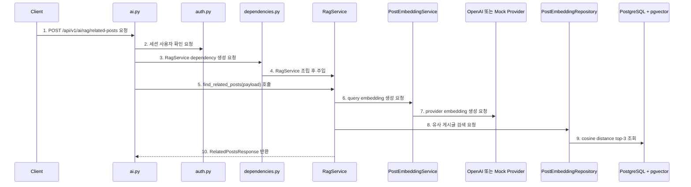
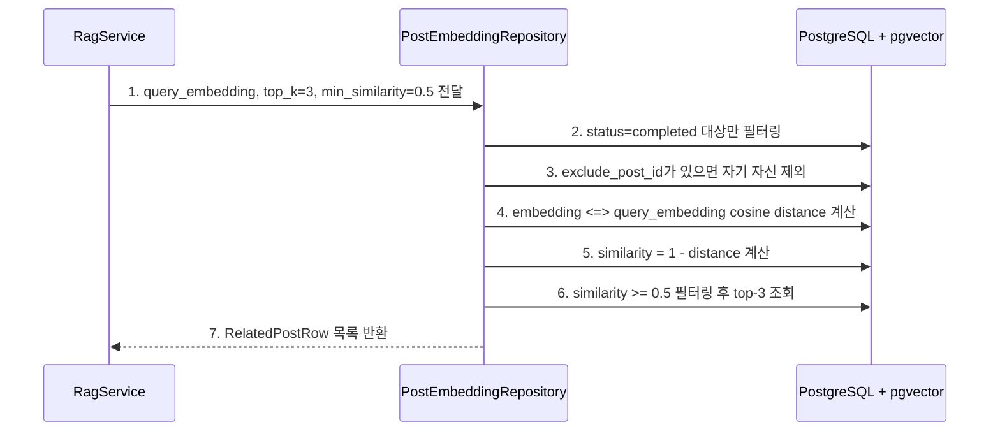
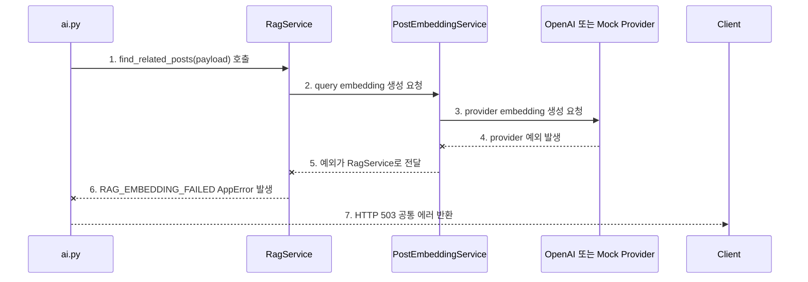

# Sprint 6 Step 3 구현 기록

## 1. 이번 Step의 목표

Step 3의 목표는 **사용자가 작성 중인 글을 embedding한 뒤, pgvector cosine distance로 유사 게시글 top-3를 찾는 API를 구현하는 것**입니다.

Sprint 6 계획의 Step 3 위치는 아래입니다.

```text
1. pgvector extension을 준비한다.                 -> Step 1 완료
2. 게시글 데이터를 embedding한다.                 -> Step 2 완료
3. embedding 결과를 PostgreSQL vector 컬럼에 저장한다. -> Step 2 완료
4. 사용자 입력을 embedding한다.                   -> Step 3 완료
5. pgvector similarity search로 유사 게시글을 찾는다. -> Step 3 완료
6. 검색 결과를 LLM에 전달해 요약한다.              -> 이후 Step
7. React 화면에서 유사 게시글과 요약 결과를 보여준다. -> 이후 Step
```

이번 Step에서는 백엔드 API까지만 구현했습니다. React 자동 추천 UI와 LLM 요약은 아직 구현하지 않았습니다.

## 2. 확정한 의사결정

| 항목 | 결정 |
| --- | --- |
| API | `POST /api/v1/ai/rag/related-posts` |
| 인증 | 세션 인증 필요 |
| 검색 개수 | top-3 |
| 최소 유사도 | `min_similarity = 0.5` |
| 유사도 기준 | pgvector cosine distance |
| 응답 similarity | `1 - cosine_distance` |
| 최소 입력 길이 | `title + content` trim 기준 20자 |
| 검색 대상 | `post_embeddings.status = completed`이고 `embedding IS NOT NULL`인 row |
| 자기 자신 제외 | `exclude_post_id` optional |
| 결과 없음 | 에러가 아니라 `items: []` |
| query embedding 실패 | `RAG_EMBEDDING_FAILED`, HTTP 503 |
| summary | Step 3에서는 `null` |
| failed embedding 재시도 API | 관리자 권한 모델이 없으므로 구현하지 않음 |

failed embedding row는 Step 2에서 `status=failed`로 남아 있으므로 재시도 가능하게 설계되어 있습니다. 다만 지금은 관리자 권한 모델이 없기 때문에 수동 재시도 API는 만들지 않았습니다.

## 3. 변경한 파일

```text
backend/app/api/v1/ai.py
backend/app/api/dependencies.py
backend/app/core/errors.py
backend/app/main.py
backend/app/repositories/embedding_repository.py
backend/app/schemas/ai.py
backend/app/services/embedding_service.py
backend/app/services/rag_service.py
backend/tests/test_ai_rag_flow.py
docs2/sprint-6/step-3-implementation-record.md
```

## 4. API 계약

### 4.1 Request

```http
POST /api/v1/ai/rag/related-posts
```

```json
{
  "title": "FastAPI JWT 인증에서 401 오류가 납니다",
  "content": "current_user dependency에서 계속 인증 실패가 납니다.",
  "tags": ["fastapi", "jwt", "auth"],
  "exclude_post_id": null
}
```

요청 조건:

```text
1. 세션 로그인 필요
2. title + content 합산 trim 기준 최소 20자
3. tags는 기존 게시글 tag와 같은 normalize 규칙 적용
4. exclude_post_id는 optional
```

### 4.2 Response

```json
{
  "items": [
    {
      "post_id": 3,
      "title": "Authorization Bearer 누락 문제",
      "content_preview": "FastAPI 인증에서 401이 발생할 때...",
      "tags": ["auth", "fastapi"],
      "similarity": 0.86,
      "summary": null
    }
  ]
}
```

`summary`는 Step 3에서는 항상 `null`입니다. LLM 요약은 이후 Step에서 붙입니다.

## 5. 전체 요청 흐름



다이어그램 번호와 같은 순서로 코드를 보면 됩니다.

```text
1. POST /api/v1/ai/rag/related-posts 요청
   - 코드: backend/app/api/v1/ai.py
   - 함수: find_related_posts()
   - 확인: AI/RAG 유사 게시글 검색 endpoint가 여기서 시작된다.

2. 세션 사용자 확인 요청
   - 코드: backend/app/api/v1/auth.py
   - 함수: get_session_user()
   - 확인: 로그인하지 않은 사용자는 SESSION_REQUIRED로 막힌다.

3. RagService dependency 생성 요청
   - 코드: backend/app/api/dependencies.py
   - 함수: get_rag_service()
   - 확인: 라우터가 RagService를 Depends로 받는다.

4. RagService 조립 후 주입
   - 코드: backend/app/api/dependencies.py
   - 함수: get_rag_service()
   - 확인: PostEmbeddingRepository와 PostEmbeddingService를 RagService에 넣는다.

5. find_related_posts(payload) 호출
   - 코드: backend/app/services/rag_service.py
   - 함수: RagService.find_related_posts()
   - 확인: query text 생성, query embedding 생성, repository 검색 호출을 조율한다.

6. query embedding 생성 요청
   - 코드: backend/app/services/embedding_service.py
   - 함수: PostEmbeddingService.build_text(), embed()
   - 확인: 사용자의 title/content/tags를 Step 2와 같은 형식의 embedding 대상 텍스트로 만든다.

7. provider embedding 생성 요청
   - 코드: backend/app/services/embedding_service.py
   - 함수: OpenAIEmbeddingProvider.embed(), MockEmbeddingProvider.embed()
   - 확인: 실제 앱은 OpenAI, 테스트는 mock provider를 사용한다.

8. 유사 게시글 검색 요청
   - 코드: backend/app/repositories/embedding_repository.py
   - 함수: PostEmbeddingRepository.find_related_posts()
   - 확인: query embedding, limit, min_similarity, exclude_post_id를 받아 DB 검색을 실행한다.

9. cosine distance top-3 조회
   - 코드: backend/app/repositories/embedding_repository.py
   - 함수: PostEmbeddingRepository.find_related_posts()
   - 확인: pgvector `<=>` 연산자로 cosine distance를 계산하고 similarity로 바꾼다.

10. RelatedPostsResponse 반환
    - 코드: backend/app/services/rag_service.py
    - 함수: RagService.find_related_posts()
    - 확인: post_id, title, content_preview, tags, similarity, summary=null 형태로 응답을 만든다.
```

## 6. pgvector 검색 흐름



다이어그램 번호와 같은 순서로 코드를 보면 됩니다.

```text
1. query_embedding, top_k=3, min_similarity=0.5 전달
   - 코드: backend/app/services/rag_service.py
   - 함수: RagService.find_related_posts()
   - 확인: limit=3, min_similarity=0.5 기준으로 repository를 호출한다.

2. status=completed 대상만 필터링
   - 코드: backend/app/repositories/embedding_repository.py
   - 함수: PostEmbeddingRepository.find_related_posts()
   - 확인: failed/pending embedding은 검색 대상에서 제외한다.

3. exclude_post_id가 있으면 자기 자신 제외
   - 코드: backend/app/repositories/embedding_repository.py
   - 함수: PostEmbeddingRepository.find_related_posts()
   - 확인: 수정 화면에서 자기 자신이 1등으로 나오는 문제를 막을 수 있다.

4. embedding <=> query_embedding cosine distance 계산
   - 코드: backend/app/repositories/embedding_repository.py
   - 함수: PostEmbeddingRepository.find_related_posts()
   - 확인: pgvector `<=>` 연산자는 cosine distance를 계산한다.

5. similarity = 1 - distance 계산
   - 코드: backend/app/repositories/embedding_repository.py
   - 함수: PostEmbeddingRepository.find_related_posts()
   - 확인: API 사용자가 이해하기 쉽도록 distance를 similarity로 바꾼다.

6. similarity >= 0.5 필터링 후 top-3 조회
   - 코드: backend/app/repositories/embedding_repository.py
   - 함수: PostEmbeddingRepository.find_related_posts()
   - 확인: 너무 낮은 유사도 결과는 제외하고 높은 순서로 최대 3개만 반환한다.

7. RelatedPostRow 목록 반환
   - 코드: backend/app/repositories/embedding_repository.py
   - 클래스: RelatedPostRow
   - 확인: service가 response schema로 바꾸기 쉬운 형태로 반환한다.
```

### 6.1 Repository 쿼리 구현 방식: raw SQL vs ORM

현재 `PostEmbeddingRepository.find_related_posts()`는 pgvector 유사도 검색을 위해 repository 내부에서 raw SQL을 사용합니다.

이 방식은 router나 service까지 SQL이 새지 않고 repository 안에 격리되어 있으므로 구조적으로 큰 문제는 아닙니다. 다만 다른 repository들이 대부분 SQLAlchemy ORM 스타일로 DB에 접근하고 있다면, embedding 검색만 raw SQL을 쓰는 것이 팀 학습과 코드 일관성 측면에서 어색하게 보일 수 있습니다.

실무에서는 보통 아래 기준으로 판단합니다.

```text
1. 일반 CRUD, 단순 join, 조건 조합
   - ORM 스타일을 우선 사용한다.

2. pgvector, full-text search, window function, recursive CTE처럼 DB 특화 기능이 강한 쿼리
   - ORM expression으로 명확하게 표현 가능하면 ORM을 사용한다.
   - ORM으로 표현했을 때 오히려 읽기 어려우면 repository 내부에 raw SQL로 격리한다.

3. 어떤 방식을 쓰든 router/service는 DB 쿼리 방식을 몰라야 한다.
   - 외부 계층은 repository method만 호출한다.
```

ORM 스타일로 바꿨을 때 얻는 이점은 아래와 같습니다.

```text
1. 코드 일관성이 좋아진다.
   - 다른 repository와 같은 select(), join(), where() 흐름으로 읽을 수 있다.

2. 모델 변경에 조금 더 강해진다.
   - 컬럼명, 관계, 모델 import 오류가 raw SQL 문자열보다 빨리 드러날 가능성이 높다.

3. 조건 조합이 쉬워진다.
   - 나중에 visibility, author_id, tag, created_at, deleted 여부 같은 필터가 붙어도 query builder로 조합하기 쉽다.

4. 관계 기반 join 의도가 잘 드러난다.
   - Post, User, Tag, PostEmbedding 모델 관계를 코드에서 바로 따라갈 수 있다.

5. parameter binding 실수를 줄일 수 있다.
   - 지금 raw SQL도 bind parameter를 쓰므로 안전하지만, ORM은 기본적으로 이 흐름을 강제하기 쉽다.
```

반대로 ORM 스타일로 바꿨을 때 불리한 점도 있습니다.

```text
1. pgvector 연산 의도가 덜 직접적으로 보일 수 있다.
   - raw SQL에서는 embedding <=> query_embedding이 바로 보여 cosine distance 쿼리임을 알기 쉽다.
   - ORM에서는 cosine_distance(), op("<=>"), label() 같은 SQLAlchemy/pgvector 표현을 알아야 한다.

2. SQLAlchemy pgvector 확장 지식이 필요하다.
   - pgvector.sqlalchemy.Vector, comparator, distance operator 사용법을 추가로 알아야 한다.

3. 실제 생성 SQL을 반드시 확인해야 한다.
   - ORM으로 작성해도 DB가 원하는 SQL로 실행된다는 보장은 없다.
   - 특히 vector index를 타는지, order by가 올바른지 확인해야 한다.

4. 복잡한 DB 특화 쿼리는 raw SQL이 더 명확할 수 있다.
   - 억지로 ORM으로 바꾸면 일관성은 생기지만 읽기 어려운 코드가 될 수 있다.
```

실무적으로 더 ORM에 가까운 형태로 정리하면 대략 아래와 같은 방향이 됩니다.

```python
distance = PostEmbedding.embedding.cosine_distance(query_embedding)

stmt = (
    select(
        Post.id,
        Post.title,
        Post.content,
        (1 - distance).label("similarity"),
    )
    .join(PostEmbedding, PostEmbedding.post_id == Post.id)
    .where(PostEmbedding.status == "completed")
    .where(PostEmbedding.embedding.is_not(None))
    .where((1 - distance) >= min_similarity)
    .order_by(distance)
    .limit(limit)
)
```

따라서 이 Sprint에서의 판단은 아래처럼 정리할 수 있습니다.

```text
1. 현재 raw SQL은 repository 내부에만 격리되어 있으므로 설계적으로 허용 가능한 선택이다.
2. 학습 관점에서는 pgvector <=> 연산과 similarity 계산을 직접 볼 수 있어 직관적이다.
3. 장기 유지보수 관점에서는 pgvector SQLAlchemy 연동을 도입해 ORM expression으로 바꾸는 것을 리팩터링 후보로 둘 수 있다.
4. raw SQL을 유지한다면 주석과 테스트로 min_similarity, 정렬, limit, status 필터, exclude_post_id 동작을 고정해야 한다.
```

## 7. 실패 흐름



다이어그램 번호와 같은 순서로 코드를 보면 됩니다.

```text
1. find_related_posts(payload) 호출
   - 코드: backend/app/api/v1/ai.py
   - 함수: find_related_posts()
   - 확인: RAG 검색 API 요청이 RagService로 넘어간다.

2. query embedding 생성 요청
   - 코드: backend/app/services/rag_service.py
   - 함수: RagService.find_related_posts()
   - 확인: query embedding이 없으면 유사도 검색을 할 수 없다.

3. provider embedding 생성 요청
   - 코드: backend/app/services/embedding_service.py
   - 함수: OpenAIEmbeddingProvider.embed(), MockEmbeddingProvider.embed()
   - 확인: 실제 앱에서는 OpenAI embedding 호출이 실패할 수 있다.

4. provider 예외 발생
   - 코드: backend/app/services/embedding_service.py
   - 함수: PostEmbeddingService.embed()
   - 확인: provider 예외나 dimension mismatch가 발생할 수 있다.

5. 예외가 RagService로 전달
   - 코드: backend/app/services/rag_service.py
   - 함수: RagService.find_related_posts()
   - 확인: RagService가 예외를 잡아 AppError로 바꾼다.

6. RAG_EMBEDDING_FAILED AppError 발생
   - 코드: backend/app/services/rag_service.py
   - 함수: RagService.find_related_posts()
   - 확인: query embedding을 만들 수 없으면 AppError(code="RAG_EMBEDDING_FAILED")를 발생시킨다.

7. HTTP 503 공통 에러 반환
   - 코드: backend/app/core/errors.py
   - 함수: register_error_handlers()
   - 확인: 공통 에러 형식으로 code/message/details를 반환한다.
```

## 8. 코드 읽는 순서

Step 3 코드는 아래 순서로 보면 됩니다.

```text
1. backend/app/api/v1/ai.py
   - find_related_posts()

2. backend/app/api/dependencies.py
   - get_rag_service()
   - get_embedding_provider()

3. backend/app/schemas/ai.py
   - RelatedPostsRequest
   - RelatedPostsResponse
   - MIN_RAG_QUERY_LENGTH
   - RELATED_POST_MIN_SIMILARITY

4. backend/app/services/rag_service.py
   - RagService.find_related_posts()

5. backend/app/services/embedding_service.py
   - PostEmbeddingService.build_text()
   - PostEmbeddingService.embed()
   - OpenAIEmbeddingProvider.embed()
   - MockEmbeddingProvider.embed()

6. backend/app/repositories/embedding_repository.py
   - PostEmbeddingRepository.find_related_posts()
   - RelatedPostRow

7. backend/tests/test_ai_rag_flow.py
   - 인증 필요
   - 결과 없음
   - 유사 게시글 반환
   - exclude_post_id
   - 짧은 입력 validation
   - RAG_EMBEDDING_FAILED
```

## 9. 테스트

실행한 테스트:

```bash
.venv/bin/python -m pytest backend/tests/test_ai_rag_flow.py
.venv/bin/python -m pytest backend/tests
```

결과:

```text
backend/tests/test_ai_rag_flow.py
5 passed

backend/tests
23 passed
```

테스트에서 확인한 것:

```text
1. 비로그인 사용자는 RAG API를 호출할 수 없다.
2. 검색 대상 embedding이 없으면 items: []를 반환한다.
3. 같은 title/content/tags로 query하면 해당 게시글이 top 결과로 나온다.
4. exclude_post_id를 넣으면 해당 게시글은 결과에서 제외된다.
5. title + content가 20자 미만이면 validation error가 난다.
6. query embedding 생성 실패 시 RAG_EMBEDDING_FAILED를 반환한다.
```

## 10. 다음 Step으로 이어지는 부분

이제 백엔드는 사용자 입력 기반 유사 게시글 검색을 할 수 있습니다.

다음 Step에서는 프론트 글쓰기 화면에서 아래 정책으로 API를 호출하면 됩니다.

```text
1. title + content가 20자 이상일 때만 호출
2. 입력이 바뀔 때마다 즉시 호출하지 않고 debounce 적용
3. 같은 입력에 대한 중복 요청 방지
4. 이전 요청보다 늦게 도착한 오래된 응답 무시
5. items가 비어 있으면 추천 영역을 숨김
```

LLM 요약은 아직 붙이지 않았으므로, 현재는 `summary: null`을 그대로 표시하지 않거나 숨기면 됩니다.
