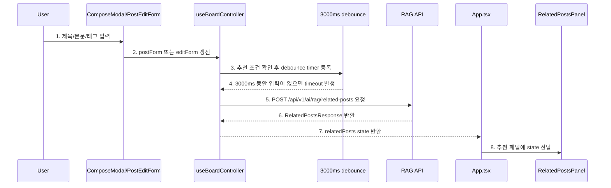
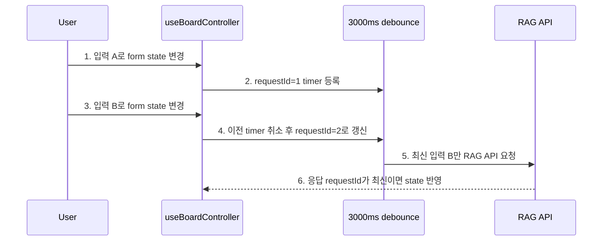

# Sprint 6 Step 4 구현 기록

## 1. 이번 Step의 목표

Step 4의 목표는 **React 글 작성/수정 화면에서 RAG 유사 게시글 추천 API를 자동 호출하고, 결과를 작성 흐름 안에 표시하는 것**입니다.

Sprint 6 전체 흐름에서 이번 Step의 위치는 아래입니다.

```text
1. pgvector extension을 준비한다.                      -> Step 1 완료
2. 게시글 데이터를 embedding한다.                      -> Step 2 완료
3. embedding 결과를 PostgreSQL vector 컬럼에 저장한다.  -> Step 2 완료
4. 사용자 입력을 embedding한다.                        -> Step 3 완료
5. pgvector similarity search로 유사 게시글을 찾는다.  -> Step 3 완료
6. React 화면에서 유사 게시글을 보여준다.               -> Step 4 완료
7. 검색 결과를 LLM에 전달해 요약한다.                   -> 이후 Step
```

이번 Step에서는 LLM 요약은 붙이지 않았습니다. 백엔드 응답의 `summary`는 아직 `null`이고, 프론트에서도 표시하지 않습니다.

## 2. 확정한 의사결정

| 항목 | 결정 |
| --- | --- |
| 호출 방식 | 사용자가 입력을 멈춘 뒤 자동 호출 |
| debounce | `3000ms` |
| 최소 입력 길이 | `title + content` trim 기준 20자 이상 |
| API | `POST /api/v1/ai/rag/related-posts` |
| 작성 화면 | 새 글 작성 모달에서 자동 추천 |
| 수정 화면 | 작성자 수정 폼에서 자동 추천 |
| 자기 자신 제외 | 수정 화면에서는 `exclude_post_id = selectedPost.id` 전달 |
| 표시 개수 | 백엔드 응답 기준 최대 3개 |
| 표시 필드 | `title`, `content_preview`, `tags`, `similarity` |
| 숨기는 필드 | `summary`는 Step 4에서 표시하지 않음 |
| 결과 없음 | 추천 패널 숨김 |
| API 실패 | 게시글 작성/수정 흐름을 막지 않고 추천 패널 숨김 |
| 중복 요청 방지 | 같은 입력 payload는 반복 호출하지 않음 |
| 오래된 응답 방지 | 최신 `requestId`와 맞는 응답만 화면에 반영 |
| 레이아웃 | 데스크톱은 오른쪽 패널, 모바일은 폼 아래 |

핵심 기준은 **RAG 추천은 글쓰기 보조 기능이지 게시글 저장 기능의 선행 조건이 아니다**입니다. 그래서 추천 API가 실패해도 작성/수정 form submit은 그대로 가능해야 합니다.

## 3. 변경한 파일

```text
frontend/src/App.tsx
frontend/src/components/ComposeModal.tsx
frontend/src/components/PostDetail.tsx
frontend/src/components/RelatedPostsPanel.tsx
frontend/src/hooks/useBoardController.ts
frontend/src/styles.css
frontend/src/types.ts
frontend/src/utils/postFormatting.ts
docs2/sprint-6/step-4-implementation-record.md
```

## 4. 프론트 자동 추천 흐름



다이어그램 번호와 같은 순서로 코드를 보면 됩니다.

```text
1. 제목/본문/태그 입력
   - 코드: frontend/src/components/ComposeModal.tsx
   - 컴포넌트: ComposeModal
   - 코드: frontend/src/components/PostDetail.tsx
   - 컴포넌트: PostEditForm
   - 확인: 작성 모달과 수정 폼의 input/textarea가 같은 PostFormState 구조를 사용한다.

2. postForm 또는 editForm 갱신
   - 코드: frontend/src/hooks/useBoardController.ts
   - 함수: updatePostForm(), updateEditForm(), updateForm()
   - 확인: 사용자가 입력하면 postForm 또는 editForm state가 바뀐다.

3. 추천 조건 확인 후 debounce timer 등록
   - 코드: frontend/src/hooks/useBoardController.ts
   - 함수: scheduleRelatedPosts(), buildRelatedRequestKey()
   - 확인: 로그인 상태, 작성/수정 화면 활성화 여부, title+content 20자 이상, 중복 payload 여부를 확인한다.

4. 3000ms 동안 입력이 없으면 timeout 발생
   - 코드: frontend/src/hooks/useBoardController.ts
   - 함수: scheduleRelatedPosts()
   - 확인: `RELATED_POSTS_DEBOUNCE_MS = 3000` 기준으로 `window.setTimeout()`을 등록하고, 입력이 바뀌면 cleanup으로 이전 timer를 취소한다.

5. POST /api/v1/ai/rag/related-posts 요청
   - 코드: frontend/src/hooks/useBoardController.ts
   - 함수: loadRelatedPosts()
   - 코드: frontend/src/utils/postFormatting.ts
   - 함수: buildRelatedPostsPayload()
   - 확인: title/content는 trim하고, tags는 comma string을 배열로 변환하며, 수정 화면에서는 exclude_post_id를 같이 보낸다.

6. RelatedPostsResponse 반환
   - 코드: frontend/src/hooks/useBoardController.ts
   - 함수: loadRelatedPosts(), request()
   - 확인: 응답이 성공이고 최신 requestId와 일치할 때만 items를 state에 반영한다. 실패하면 작성 흐름을 막지 않고 빈 추천 상태로 둔다.

7. relatedPosts state 반환
   - 코드: frontend/src/hooks/useBoardController.ts
   - 반환값: composeRelatedPosts, editRelatedPosts
   - 코드: frontend/src/App.tsx
   - 컴포넌트: App
   - 확인: 작성 모달에는 composeRelatedPosts, 수정 폼에는 editRelatedPosts를 각각 전달한다.

8. 추천 패널에 state 전달
   - 코드: frontend/src/components/RelatedPostsPanel.tsx
   - 컴포넌트: RelatedPostsPanel
   - 확인: 로딩 중이면 "유사글 찾는 중"을 보여주고, 결과가 있으면 title/content_preview/tags/similarity 카드만 표시한다.
```

## 5. 중복 요청과 오래된 응답 방지 흐름



다이어그램 번호와 같은 순서로 코드를 보면 됩니다.

```text
1. 입력 A로 form state 변경
   - 코드: frontend/src/hooks/useBoardController.ts
   - 함수: updatePostForm(), updateEditForm()
   - 확인: 사용자가 입력할 때마다 React state가 먼저 바뀐다.

2. requestId=1 timer 등록
   - 코드: frontend/src/hooks/useBoardController.ts
   - 함수: scheduleRelatedPosts()
   - 확인: relatedRequestIds.current[scope] 값을 증가시키고, 3000ms timer를 등록한다.

3. 입력 B로 form state 변경
   - 코드: frontend/src/hooks/useBoardController.ts
   - 함수: updatePostForm(), updateEditForm()
   - 확인: timer가 끝나기 전에 새 입력이 들어오면 effect dependency가 바뀐다.

4. 이전 timer 취소 후 requestId=2로 갱신
   - 코드: frontend/src/hooks/useBoardController.ts
   - 함수: scheduleRelatedPosts()
   - 확인: useEffect cleanup이 이전 timer를 취소하고, 새 입력 기준 requestId를 다시 만든다.

5. 최신 입력 B만 RAG API 요청
   - 코드: frontend/src/hooks/useBoardController.ts
   - 함수: loadRelatedPosts()
   - 확인: debounce가 끝난 최신 입력만 `/api/v1/ai/rag/related-posts`로 전송된다.

6. 응답 requestId가 최신이면 state 반영
   - 코드: frontend/src/hooks/useBoardController.ts
   - 함수: loadRelatedPosts()
   - 확인: requestId가 relatedRequestIds.current[scope]와 다르면 오래된 응답으로 보고 화면에 반영하지 않는다.
```

## 6. 작성 화면과 수정 화면의 차이

| 화면 | state | 추천 API 조건 | exclude_post_id |
| --- | --- | --- | --- |
| 새 글 작성 | `composeRelatedPosts` | 로그인 상태이고 작성 모달이 열려 있음 | `null` |
| 게시글 수정 | `editRelatedPosts` | 로그인 상태이고 수정 폼이 열려 있음 | `selectedPost.id` |

수정 화면에서 `exclude_post_id`를 보내는 이유는 현재 수정 중인 글이 자기 자신과 가장 유사한 결과로 나오는 문제를 막기 위해서입니다.

## 7. UI 표시 기준

```text
1. 추천 API 호출 전
   - 패널을 숨긴다.

2. debounce 후 API 요청 중
   - "유사글 찾는 중" 상태를 표시한다.

3. 결과가 1개 이상
   - 오른쪽 패널에 카드로 표시한다.
   - 카드에는 title, content_preview, tags, similarity만 표시한다.

4. 결과가 0개
   - 패널을 숨긴다.

5. API 실패
   - 패널을 숨긴다.
   - 작성/수정 submit은 막지 않는다.
```

레이아웃은 `frontend/src/styles.css`에서 조정합니다.

```text
데스크톱:
- .compose-layout.has-related
- .edit-layout.has-related
- grid-template-columns: form + related panel

모바일:
- @media (max-width: 760px)
- 추천 패널이 form 아래로 내려간다.
```

## 8. 이번 Step 이후 코드를 읽는 순서

```text
1. frontend/src/components/ComposeModal.tsx
   - 새 글 작성 form과 RelatedPostsPanel이 어떻게 같이 배치되는지 본다.

2. frontend/src/components/PostDetail.tsx
   - 게시글 수정 form에서 RelatedPostsPanel을 어떻게 재사용하는지 본다.

3. frontend/src/hooks/useBoardController.ts
   - scheduleRelatedPosts(), loadRelatedPosts()를 중심으로 debounce, 중복 방지, stale response 방지를 본다.

4. frontend/src/utils/postFormatting.ts
   - buildRelatedPostsPayload()가 백엔드 RAG API 요청 body를 어떻게 만드는지 본다.

5. frontend/src/components/RelatedPostsPanel.tsx
   - 추천 결과를 어떤 필드만 화면에 보여주는지 본다.

6. frontend/src/styles.css
   - .compose-layout, .edit-layout, .related-panel 스타일을 본다.
```

## 9. 검증 기록

```bash
npm run build
```

결과:

```text
통과
tsc --noEmit 통과
vite build 통과
```

```bash
.venv/bin/python -m pytest backend/tests/test_ai_rag_flow.py
```

결과:

```text
5 passed
```

처음 sandbox 안에서 실행했을 때는 `127.0.0.1:5433` PostgreSQL 연결이 `Operation not permitted`로 막혔습니다. 같은 테스트를 sandbox 밖에서 다시 실행했고 통과했습니다.

```bash
curl -L http://127.0.0.1:5174/
```

결과:

```text
Vite dev server HTML 응답 확인
```

브라우저 픽셀 검증은 현재 Node REPL 환경에 Playwright가 없어 수행하지 못했습니다.

## 10. 남은 일

```text
1. 실제 브라우저에서 로그인 후 작성 모달을 열고 3초 뒤 추천 패널이 뜨는지 확인한다.
2. 게시글 수정 화면에서 현재 글이 추천 결과에 포함되지 않는지 확인한다.
3. 이후 Step에서 summary=null 대신 LLM 요약을 붙일지 결정한다.
```
