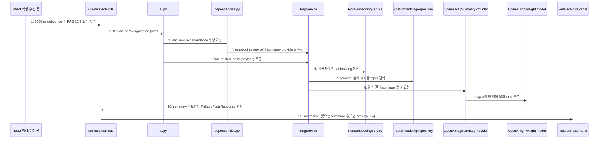
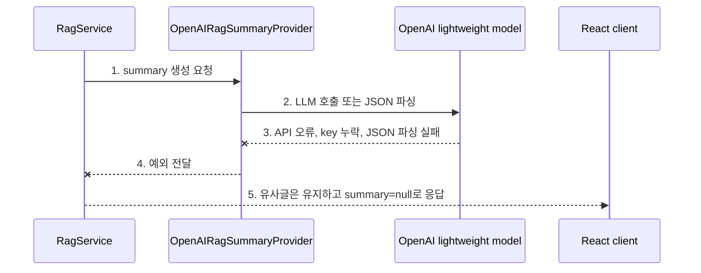

# Sprint 6 Step 5 구현 기록

## 1. 이번 Step의 목표

Step 5의 목표는 **pgvector로 찾은 유사 게시글 top-3를 lightweight LLM에 전달해 각 글마다 2-3문장 summary를 자동 생성하는 것**입니다.

이전 Step까지는 RAG API가 유사 게시글을 찾기는 했지만, 응답의 `summary`는 항상 `null`이었습니다. 이번 Step에서는 유사글 추천이 자동으로 실행될 때 요약도 같이 생성되도록 연결했습니다.

```text
1. pgvector extension을 준비한다.                      -> Step 1 완료
2. 게시글 데이터를 embedding한다.                      -> Step 2 완료
3. embedding 결과를 PostgreSQL vector 컬럼에 저장한다.  -> Step 2 완료
4. 사용자 입력을 embedding한다.                        -> Step 3 완료
5. pgvector similarity search로 유사 게시글을 찾는다.  -> Step 3 완료
6. React 화면에서 유사 게시글을 보여준다.               -> Step 4 완료
7. 검색 결과를 LLM에 전달해 요약한다.                   -> Step 5 완료
```

## 2. 확정한 의사결정

| 항목 | 결정 |
| --- | --- |
| LLM 호출 시점 | 유사 게시글 검색 결과가 있을 때 자동 호출 |
| 모델 기본값 | `gpt-5.4-nano` |
| 모델 설정 | `OPENAI_SUMMARY_MODEL`로 교체 가능 |
| 호출 횟수 | top-3 전체를 한 번에 묶어서 1회 호출 |
| summary 길이 | 각 유사 게시글마다 2-3문장 |
| summary 내용 | 왜 관련 있는지 + 기존 글 핵심 내용 |
| summary 저장 여부 | DB 저장 안 함 |
| 실패 처리 | LLM 실패 시 `summary=null`, 유사글 추천은 유지 |
| 프론트 표시 | summary가 있으면 summary 표시, 없으면 기존 preview 표시 |
| 테스트 | 실제 OpenAI 호출 없이 mock summary provider 사용 |

핵심 기준은 **LLM 요약은 RAG 추천의 부가 정보**라는 점입니다. 그래서 요약 생성이 실패해도 검색된 유사 게시글은 그대로 내려갑니다.

## 3. 변경한 파일

```text
backend/app/api/dependencies.py
backend/app/core/config.py
backend/app/repositories/embedding_repository.py
backend/app/schemas/ai.py
backend/app/services/rag_service.py
backend/app/services/rag_summary_service.py
backend/tests/test_ai_rag_flow.py
frontend/src/components/RelatedPostsPanel.tsx
frontend/src/styles.css
frontend/src/types.ts
docs2/sprint-6/step-5-implementation-record.md
```

## 4. 전체 요청 흐름



다이어그램 번호와 같은 순서로 코드를 보면 됩니다.

```text
1. 3000ms debounce 후 RAG 요청 조건 충족
   - 코드: frontend/src/hooks/useRelatedPosts.ts
   - 함수: scheduleRelatedPosts()
   - 확인: 사용자가 입력을 멈춘 뒤 3000ms가 지나고, title+content가 20자 이상이면 요청을 예약한다.

2. POST /api/v1/ai/rag/related-posts
   - 코드: frontend/src/hooks/useRelatedPosts.ts
   - 함수: loadRelatedPosts()
   - 확인: 작성 화면은 exclude_post_id=null, 수정 화면은 selectedPostId를 exclude_post_id로 보낸다.

3. RagService dependency 생성 요청
   - 코드: backend/app/api/v1/ai.py
   - 함수: find_related_posts()
   - 확인: 세션 사용자 확인 후 RagService를 Depends로 받는다.

4. embedding service와 summary provider를 주입
   - 코드: backend/app/api/dependencies.py
   - 함수: get_rag_service(), get_rag_summary_provider()
   - 확인: RagService에 PostEmbeddingService와 OpenAIRagSummaryProvider를 함께 넣는다.

5. find_related_posts(payload) 호출
   - 코드: backend/app/services/rag_service.py
   - 함수: RagService.find_related_posts()
   - 확인: query embedding, vector search, summary 생성을 한 흐름으로 조율한다.

6. 사용자 입력 embedding 생성
   - 코드: backend/app/services/embedding_service.py
   - 함수: PostEmbeddingService.build_text(), embed()
   - 확인: title/content/tags를 Step 2와 같은 형식의 embedding 대상 텍스트로 만든다.

7. pgvector 유사 게시글 top-3 검색
   - 코드: backend/app/repositories/embedding_repository.py
   - 함수: PostEmbeddingRepository.find_related_posts()
   - 확인: completed embedding만 대상으로 cosine similarity >= 0.5인 게시글을 최대 3개 찾는다.

8. 검색 결과 summary 생성 요청
   - 코드: backend/app/services/rag_service.py
   - 함수: RagService.find_related_posts()
   - 확인: 검색 결과가 있을 때만 summary_provider.summarize()를 호출한다.

9. top-3를 한 번에 묶어 LLM 호출
   - 코드: backend/app/services/rag_summary_service.py
   - 함수: OpenAIRagSummaryProvider.summarize(), _build_prompt()
   - 확인: 모델 기본값은 gpt-5.4-nano이고, 각 글마다 2-3문장 summary를 JSON 배열로 요청한다.

10. summary가 포함된 RelatedPostsResponse 반환
    - 코드: backend/app/services/rag_service.py
    - 함수: RagService.find_related_posts()
    - 확인: post_id별 summary를 RelatedPostItem.summary에 매핑한다.

11. summary가 있으면 summary, 없으면 preview 표시
    - 코드: frontend/src/components/RelatedPostsPanel.tsx
    - 컴포넌트: RelatedPostsPanel
    - 확인: summary가 있으면 요약문을 보여주고, null이면 content_preview를 fallback으로 보여준다.
```

## 5. LLM 실패 처리 흐름



다이어그램 번호와 같은 순서로 코드를 보면 됩니다.

```text
1. summary 생성 요청
   - 코드: backend/app/services/rag_service.py
   - 함수: RagService.find_related_posts()
   - 확인: rows가 있을 때만 summary_provider를 호출한다.

2. LLM 호출 또는 JSON 파싱
   - 코드: backend/app/services/rag_summary_service.py
   - 함수: OpenAIRagSummaryProvider.summarize(), _parse_output()
   - 확인: OpenAI Responses API를 호출하고, JSON 배열을 post_id별 summary dict로 바꾼다.

3. API 오류, key 누락, JSON 파싱 실패
   - 코드: backend/app/services/rag_summary_service.py
   - 함수: OpenAIRagSummaryProvider.summarize()
   - 확인: OPENAI_API_KEY 누락, 네트워크 실패, 모델 응답 파싱 실패가 발생할 수 있다.

4. 예외 전달
   - 코드: backend/app/services/rag_service.py
   - 함수: RagService.find_related_posts()
   - 확인: summary provider 예외를 잡아서 summaries={}로 대체한다.

5. 유사글은 유지하고 summary=null로 응답
   - 코드: backend/app/schemas/ai.py
   - 클래스: RelatedPostItem
   - 확인: summary는 str 또는 null이며, null이어도 API 응답은 200을 유지한다.
```

## 6. Prompt 구조

`OpenAIRagSummaryProvider._build_prompt()`는 아래 정보를 LLM에 전달합니다.

```text
1. 사용자가 작성 중인 title/content/tags
2. 유사 게시글 post_id
3. 유사 게시글 title
4. 유사 게시글 tags
5. similarity
6. 요약용 content 일부
```

LLM에게 요구하는 출력은 JSON 배열입니다.

```json
[
  {
    "post_id": 1,
    "summary": "작성 중인 글과 인증 흐름이라는 점에서 관련됩니다. 기존 글은 세션 쿠키로 로그인 사용자를 확인하고 CSRF 위험을 줄이는 방법을 다룹니다."
  }
]
```

## 7. 왜 summary를 저장하지 않았는가

이번 Step에서는 summary를 DB에 저장하지 않았습니다.

이유:

```text
1. summary는 작성 중인 query에 따라 달라질 수 있다.
2. 같은 게시글이라도 어떤 글과 비교하느냐에 따라 "왜 관련 있는지"가 달라진다.
3. MVP에서는 캐싱보다 흐름 이해와 안정성이 우선이다.
4. 비용 문제가 실제로 보이면 request key 기반 캐싱을 다음 단계에서 추가할 수 있다.
```

## 8. 이번 Step 이후 코드를 읽는 순서

```text
1. backend/app/services/rag_service.py
   - vector search 이후 summary_provider를 어디에서 호출하는지 본다.

2. backend/app/services/rag_summary_service.py
   - LLM prompt, OpenAI 호출, JSON parsing, post_id 매핑을 본다.

3. backend/app/api/dependencies.py
   - OpenAIRagSummaryProvider가 RagService에 어떻게 주입되는지 본다.

4. backend/app/repositories/embedding_repository.py
   - content_preview와 content_for_summary가 어떻게 분리되는지 본다.

5. backend/app/schemas/ai.py
   - RelatedPostItem.summary 타입이 str | null로 열린 것을 본다.

6. frontend/src/components/RelatedPostsPanel.tsx
   - summary가 있으면 summary, 없으면 preview를 보여주는 fallback을 본다.

7. backend/tests/test_ai_rag_flow.py
   - mock summary provider로 성공/실패 흐름을 검증하는 방식을 본다.
```

## 9. 검증 기록

```bash
npm run build
```

결과:

```text
통과
tsc --noEmit 통과
vite build 통과
```

```bash
.venv/bin/python -m pytest backend/tests/test_ai_rag_flow.py
```

결과:

```text
7 passed
```

```bash
.venv/bin/python -m pytest backend/tests
```

결과:

```text
25 passed
```

처음 sandbox 안에서 백엔드 테스트를 실행했을 때는 `127.0.0.1:5433` PostgreSQL 연결이 `Operation not permitted`로 막혔습니다. 같은 테스트를 sandbox 밖에서 다시 실행했고 통과했습니다.

## 10. 남은 일

```text
1. 실제 브라우저에서 자동 추천 결과에 2-3문장 summary가 보이는지 확인한다.
2. 실제 OpenAI 응답이 JSON 배열 형식을 안정적으로 지키는지 확인한다.
3. summary 지연 시간이 UX상 부담되면 request key 기반 캐싱을 추가한다.
4. 다음 Sprint에서 MCP/Agent가 이 RAG API를 tool처럼 사용할 수 있게 연결한다.
```
