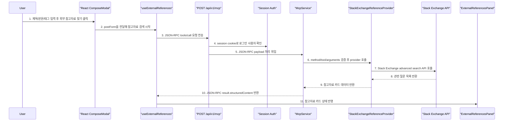
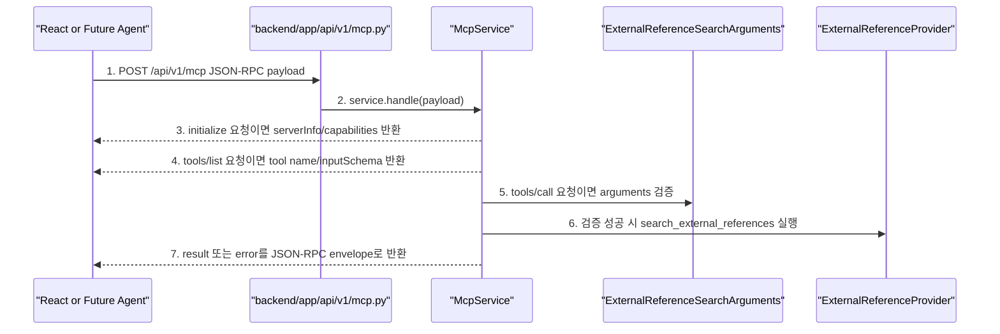
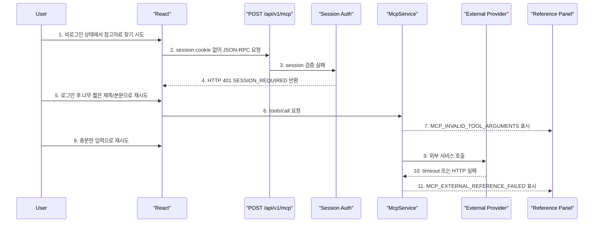

# Sprint 7 구현 기록 - JSON-RPC MCP 외부 참고자료 찾기

## 1. 구현 목표

Sprint 7의 목표는 게시글 작성 흐름 안에 **MCP 기반 외부 참고자료 찾기**를 붙이는 것입니다.

사용자가 글을 저장하기 전에 `외부 참고자료 찾기` 버튼을 누르면, 작성 중인 제목/본문/태그를 기반으로 외부 개발 지식 서비스를 검색하고, 결과를 참고자료 카드로 표시합니다.

이번 스프린트에서 중요한 점은 아래입니다.

```text
1. 일반 REST endpoint가 아니라 JSON-RPC 요청/응답으로 처리한다.
2. MCP tool 목록과 호출 흐름을 설명할 수 있어야 한다.
3. 최소 1개 이상의 실제 외부 서비스를 호출한다.
4. 외부 서비스 권한/API key 전략을 server-side env로 설명할 수 있어야 한다.
5. Sprint 8 Agent가 이 tool 결과를 재사용할 수 있게 structuredContent 형태로 반환한다.
```

## 2. 확정한 설계 결정

| 항목 | 결정 |
| --- | --- |
| MCP 구현 방식 | JSON-RPC 직접 구현 |
| endpoint | `POST /api/v1/mcp` |
| MCP server 위치 | 기존 FastAPI 내부 router |
| FastMCP 사용 | 사용하지 않음 |
| protocol 범위 | `initialize`, `tools/list`, `tools/call` |
| tool 이름 | `search_external_references` |
| tool 입력 | 작성 중인 `title`, `content`, `tags`, `limit` |
| 외부 서비스 | Stack Exchange advanced search API |
| API key 전략 | `STACK_EXCHANGE_API_KEY` server-only env optional |
| 인증 | 기존 Session 인증 재사용 |
| 결과 저장 | DB 저장 없음, 작성 화면에 일회성 표시 |
| 실패 정책 | JSON-RPC error 반환, 게시글 저장 흐름은 계속 가능 |

## 3. 변경한 파일

```text
backend/app/core/config.py
backend/app/main.py
backend/app/api/dependencies.py
backend/app/api/v1/mcp.py
backend/app/schemas/mcp.py
backend/app/services/mcp_service.py
backend/app/services/external_reference_service.py
backend/tests/test_mcp_flow.py

frontend/src/types.ts
frontend/src/utils/postFormatting.ts
frontend/src/hooks/useBoardController.ts
frontend/src/hooks/useExternalReferences.ts
frontend/src/components/ComposeModal.tsx
frontend/src/components/ExternalReferencesPanel.tsx
frontend/src/App.tsx
frontend/src/styles.css

.env.example
docs2/sprint-7/mcp-concept-and-decision-guide.md
docs2/sprint-7/implementation-record.md
```

## 4. 전체 사용자 흐름



다이어그램 번호와 같은 순서로 코드를 보면 됩니다.

```text
1. 제목/본문/태그 입력 후 외부 참고자료 찾기 클릭
   - frontend/src/components/ComposeModal.tsx
   - 확인 함수/위치: ComposeModal의 "외부 참고자료 찾기" button
   - 핵심: type="button"이라 게시글 submit과 분리된다.

2. postForm을 전달해 참고자료 검색 시작
   - frontend/src/components/ComposeModal.tsx
   - frontend/src/hooks/useBoardController.ts findComposeExternalReferences()
   - 핵심: 현재 작성 폼 postActions.postForm을 MCP 검색 hook으로 넘긴다.

3. JSON-RPC tools/call 요청 전송
   - frontend/src/hooks/useExternalReferences.ts buildJsonRpcBody()
   - frontend/src/hooks/useExternalReferences.ts findComposeExternalReferences()
   - 핵심: REST payload가 아니라 jsonrpc/id/method/params 구조로 `/api/v1/mcp`에 POST한다.

4. session cookie로 로그인 사용자 확인
   - backend/app/api/v1/mcp.py handle_mcp_request()
   - backend/app/api/v1/auth.py get_session_user()
   - 핵심: MCP tool은 글쓰기 보조 기능이므로 로그인 사용자만 호출 가능하다.

5. JSON-RPC payload 처리 위임
   - backend/app/api/v1/mcp.py handle_mcp_request()
   - backend/app/services/mcp_service.py McpService.handle()
   - 핵심: router는 인증과 진입점 역할만 하고, JSON-RPC 판단은 service가 맡는다.

6. method/tool/arguments 검증 후 provider 호출
   - backend/app/services/mcp_service.py McpService.handle()
   - backend/app/services/mcp_service.py McpService._call_tool()
   - backend/app/schemas/mcp.py ExternalReferenceSearchArguments
   - 핵심: `initialize`, `tools/list`, `tools/call`만 허용하고, `search_external_references` arguments를 검증한 뒤 provider를 호출한다.

7. Stack Exchange advanced search API 호출
   - backend/app/services/external_reference_service.py StackExchangeReferenceProvider.search()
   - backend/app/core/config.py Settings.stack_exchange_api_url
   - 핵심: 외부 HTTP 호출은 backend에서만 수행한다. API key가 필요하면 env의 `STACK_EXCHANGE_API_KEY`를 사용한다.

8. 관련 질문 목록 반환
   - backend/app/services/external_reference_service.py StackExchangeReferenceProvider.search()
   - 핵심: 외부 API 응답의 `items` 배열을 읽는다.

9. 참고자료 카드 데이터 반환
   - backend/app/services/external_reference_service.py StackExchangeReferenceProvider._to_reference_item()
   - backend/app/schemas/mcp.py ExternalReferenceItem
   - 핵심: title/url/source/summary/tags/score/answer_count/is_answered 형태로 화면 친화적인 데이터로 바꾼다.

10. JSON-RPC result.structuredContent 반환
   - backend/app/services/mcp_service.py McpService._call_tool()
   - 핵심: Sprint 8 Agent가 재사용하기 쉽도록 result.structuredContent.items에 구조화된 결과를 담는다.

11. 참고자료 카드 상태 반영
   - frontend/src/hooks/useExternalReferences.ts findComposeExternalReferences()
   - frontend/src/components/ExternalReferencesPanel.tsx
   - 핵심: 결과는 DB에 저장하지 않고 작성 화면의 일회성 상태로만 표시한다.
```

## 5. JSON-RPC method 처리 흐름



다이어그램 번호와 같은 순서로 코드를 보면 됩니다.

```text
1. POST /api/v1/mcp JSON-RPC payload
   - frontend/src/hooks/useExternalReferences.ts buildJsonRpcBody()
   - 핵심: method는 `tools/call`, params.name은 `search_external_references`다.

2. service.handle(payload)
   - backend/app/api/v1/mcp.py handle_mcp_request()
   - backend/app/services/mcp_service.py McpService.handle()
   - 핵심: FastAPI router는 service에 payload를 넘긴다.

3. initialize 요청이면 serverInfo/capabilities 반환
   - backend/app/services/mcp_service.py McpService._initialize_result()
   - 핵심: 완전한 SDK 서버는 아니지만 MCP 서버의 기본 capability 설명을 반환한다.

4. tools/list 요청이면 tool name/inputSchema 반환
   - backend/app/services/mcp_service.py McpService._search_external_references_tool()
   - 핵심: Agent가 사용할 수 있는 tool 이름과 inputSchema를 노출한다.

5. tools/call 요청이면 arguments 검증
   - backend/app/services/mcp_service.py McpService._call_tool()
   - backend/app/schemas/mcp.py ExternalReferenceSearchArguments
   - 핵심: 잘못된 입력은 HTTP 200 안의 JSON-RPC error로 표현한다.

6. 검증 성공 시 search_external_references 실행
   - backend/app/services/external_reference_service.py StackExchangeReferenceProvider.search()
   - 핵심: 실제 외부 서비스 호출은 provider가 맡는다.

7. result 또는 error를 JSON-RPC envelope로 반환
   - backend/app/services/mcp_service.py McpService._result()
   - backend/app/services/mcp_service.py McpService._error()
   - 핵심: 성공이면 result, 실패면 error 중 하나만 반환한다.
```

## 6. 실패와 권한 처리 흐름



다이어그램 번호와 같은 순서로 코드를 보면 됩니다.

```text
1. 비로그인 상태에서 참고자료 찾기 시도
   - frontend/src/hooks/useBoardController.ts findComposeExternalReferences()
   - 핵심: 프론트에서도 currentUser가 없으면 로그인 안내를 띄운다.

2. session cookie 없이 JSON-RPC 요청
   - frontend/src/hooks/useApiRequest.ts request()
   - 핵심: credentials include를 쓰지만 로그인 쿠키가 없으면 인증 실패다.

3. session 검증 실패
   - backend/app/api/v1/auth.py get_session_user()
   - backend/app/services/auth_service.py get_user_by_session_token()
   - 핵심: 기존 Session 인증 흐름을 그대로 재사용한다.

4. HTTP 401 SESSION_REQUIRED 반환
   - backend/app/core/errors.py register_error_handlers()
   - 핵심: 인증 실패는 JSON-RPC error가 아니라 기존 API 인증 에러로 반환된다.

5. 로그인 후 너무 짧은 제목/본문으로 재시도
   - frontend/src/hooks/useExternalReferences.ts findComposeExternalReferences()
   - 핵심: 프론트에서 20자 미만 입력은 서버 요청 전에 안내한다.

6. tools/call 요청
   - backend/app/services/mcp_service.py McpService._call_tool()
   - 핵심: 서버에서도 arguments를 다시 검증한다.

7. MCP_INVALID_TOOL_ARGUMENTS 표시
   - backend/app/services/mcp_service.py McpService._validation_errors()
   - frontend/src/hooks/useExternalReferences.ts findComposeExternalReferences()
   - 핵심: validation error는 JSON 직렬화 가능한 형태로 정리해서 반환한다.

8. 충분한 입력으로 재시도
   - frontend/src/components/ComposeModal.tsx
   - 핵심: 사용자는 글을 저장하지 않고 참고자료 찾기만 다시 누를 수 있다.

9. 외부 서비스 호출
   - backend/app/services/external_reference_service.py StackExchangeReferenceProvider.search()
   - 핵심: timeout_seconds 설정으로 외부 지연을 제한한다.

10. timeout 또는 HTTP 실패
   - backend/app/services/external_reference_service.py StackExchangeReferenceProvider.search()
   - 핵심: httpx.HTTPError를 ExternalReferenceError로 감싼다.

11. MCP_EXTERNAL_REFERENCE_FAILED 표시
   - backend/app/services/mcp_service.py McpService._call_tool()
   - frontend/src/components/ExternalReferencesPanel.tsx
   - 핵심: 실패해도 게시글 작성/저장은 계속 가능하다.
```

## 7. API 계약

### 7.1 tools/list

요청:

```json
{
  "jsonrpc": "2.0",
  "id": "tools-1",
  "method": "tools/list",
  "params": {}
}
```

응답:

```json
{
  "jsonrpc": "2.0",
  "id": "tools-1",
  "result": {
    "tools": [
      {
        "name": "search_external_references",
        "description": "작성 중인 게시글의 제목, 본문, 태그를 바탕으로 외부 개발 참고자료를 검색합니다.",
        "inputSchema": {}
      }
    ]
  }
}
```

### 7.2 tools/call

요청:

```json
{
  "jsonrpc": "2.0",
  "id": "external-reference-1",
  "method": "tools/call",
  "params": {
    "name": "search_external_references",
    "arguments": {
      "title": "FastAPI Session 인증 흐름",
      "content": "쿠키 기반 세션 인증과 의존성 주입 흐름을 정리합니다.",
      "tags": ["fastapi", "auth"],
      "limit": 3
    }
  }
}
```

응답:

```json
{
  "jsonrpc": "2.0",
  "id": "external-reference-1",
  "result": {
    "tool": "search_external_references",
    "content": [
      {
        "type": "text",
        "text": "외부 참고자료 3건을 찾았습니다."
      }
    ],
    "structuredContent": {
      "items": [
        {
          "title": "FastAPI session authentication question",
          "url": "https://stackoverflow.com/questions/...",
          "source": "Stack Overflow",
          "summary": "Stack Overflow에서 찾은 관련 질문입니다. · 답변 2개 · 점수 5 · 채택된 답변이 있습니다.",
          "tags": ["fastapi", "authentication"],
          "score": 5,
          "answer_count": 2,
          "is_answered": true
        }
      ]
    }
  }
}
```

## 8. 핵심 코드 읽는 순서

처음부터 모든 파일을 읽지 말고 아래 순서로 보면 됩니다.

```text
1. frontend/src/components/ComposeModal.tsx
   - 버튼이 어디에 있고 submit과 어떻게 분리되는지 본다.

2. frontend/src/hooks/useExternalReferences.ts
   - JSON-RPC body가 어떻게 만들어지는지 본다.

3. backend/app/api/v1/mcp.py
   - MCP endpoint가 어디로 들어오는지 본다.

4. backend/app/services/mcp_service.py
   - initialize/tools/list/tools/call 분기가 어떻게 되는지 본다.

5. backend/app/schemas/mcp.py
   - tool arguments와 result schema를 본다.

6. backend/app/services/external_reference_service.py
   - 실제 외부 API 호출과 카드 데이터 변환을 본다.

7. frontend/src/components/ExternalReferencesPanel.tsx
   - structuredContent.items가 어떻게 화면 카드가 되는지 본다.

8. backend/tests/test_mcp_flow.py
   - MCP 요구사항을 어떤 테스트로 검증하는지 본다.
```

## 9. 검증 결과

```text
python3 -m pytest backend/tests/test_mcp_flow.py
-> 6 passed

python3 -m pytest backend/tests
-> 31 passed

npm run build
-> passed
```

첫 번째 pytest는 sandbox의 localhost PostgreSQL 접근 제한으로 실패했지만, 같은 명령을 권한 상승 후 재실행해서 통과를 확인했습니다.

## 10. Sprint 8로 이어지는 지점

Sprint 8 Agent는 아래 값을 그대로 tool 결과로 사용할 수 있습니다.

```text
result.structuredContent.items
```

Agent 쪽에서는 이 흐름으로 확장하면 됩니다.

```text
1. 사용자가 글쓰기 보조 Agent 실행
2. Agent가 현재 draft를 읽음
3. RAG tool로 내부 유사 게시글 조회
4. MCP tool search_external_references로 외부 참고자료 조회
5. RAG 결과 + MCP 결과 + 사용자 draft를 LLM에 전달
6. 초안, 추천 태그, 참고 링크를 제안
7. 사용자가 적용해야만 게시글에 반영
```

이번 Sprint 7에서는 Agent loop를 만들지 않았습니다.
대신 Agent가 쓸 수 있는 MCP tool 계약과 UI 확인 흐름을 먼저 만든 상태입니다.
