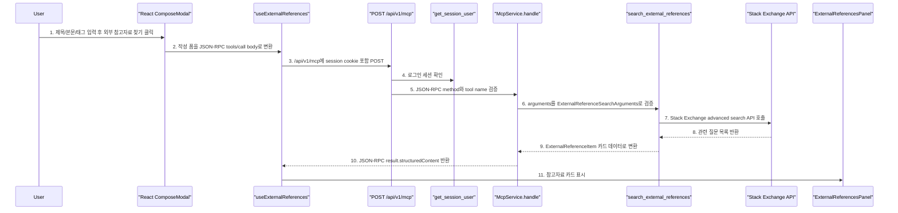

# Sprint 7 MCP 개념 및 의사결정 가이드

## 1. 이 문서의 목표

Sprint 7의 목표는 게시판에 **MCP 기반 외부 참고자료 찾기** 기능을 붙이는 것입니다.

이번 스프린트에서 확정한 방향은 아래입니다.

```text
사용자가 글 작성 화면에서 제목, 본문, 태그를 입력한다.
저장하기 전에 "외부 참고자료 찾기" 버튼을 누른다.
프론트는 FastAPI의 /api/v1/mcp endpoint로 JSON-RPC 요청을 보낸다.
MCP tool은 작성 중인 글을 query로 바꿔 외부 개발 지식 서비스를 검색한다.
결과는 글 작성 화면의 참고자료 카드로 표시한다.
Sprint 8 Agent는 이 MCP 결과를 글 초안/태그 추천에 활용한다.
```

사용자는 URL을 직접 입력하지 않습니다.

사용자 입장에서는 그냥 버튼 하나입니다.
MCP는 그 버튼 뒤에서 **AI/Agent가 사용할 tool 계약**을 먼저 만들어두는 역할입니다.

참고 기준:

```text
1. MCP 공식 소개 문서
   - https://modelcontextprotocol.io/docs/getting-started/intro

2. MCP Base Protocol 문서
   - https://modelcontextprotocol.io/specification/2025-06-18/basic

3. MCP Tools 문서
   - https://modelcontextprotocol.io/specification/2025-06-18/server/tools

4. Stack Exchange API advanced search 문서
   - https://api.stackexchange.com/docs/advanced-search
```

## 2. API와 MCP 차이

한 문장으로 정리하면 아래입니다.

```text
API는 사람이 정한 endpoint를 프론트/서버 코드가 호출하는 방식이고,
MCP는 Agent가 사용할 수 있는 tool을 JSON-RPC 표준 형태로 노출하는 방식이다.
```

중요한 점은 MCP가 API를 대체하지 않는다는 것입니다.

MCP tool 내부에서는 결국 HTTP API 호출, DB 조회, 파일 읽기, 외부 문서 fetch 같은 일을 합니다.
다만 그 기능을 Agent가 이해할 수 있도록 아래처럼 감쌉니다.

```json
{
  "jsonrpc": "2.0",
  "id": "external-reference-1",
  "method": "tools/call",
  "params": {
    "name": "search_external_references",
    "arguments": {
      "title": "FastAPI Session 인증 흐름",
      "content": "쿠키 기반 세션 인증과 의존성 주입 흐름을 정리합니다.",
      "tags": ["fastapi", "auth"],
      "limit": 3
    }
  }
}
```

이 요청은 일반 REST endpoint처럼 `POST /api/v1/mcp`로 들어오지만, body의 의미는 다릅니다.

| 구분 | 일반 REST API | MCP JSON-RPC |
| --- | --- | --- |
| 호출 대상 | endpoint | tool name |
| 기능 발견 | 개발자가 API 문서를 읽음 | `tools/list`로 tool 목록 조회 |
| 실행 요청 | `POST /api/v1/reference-search` | `method: tools/call` |
| 입력 계약 | endpoint별 request body | tool별 `inputSchema` |
| Sprint 8 연결 | Agent가 직접 쓰기 애매함 | Agent tool로 감싸기 쉬움 |

## 3. 이번 Sprint 7 최종 의사결정

| 항목 | 결정 |
| --- | --- |
| MCP 구현 방식 | JSON-RPC 직접 구현 |
| MCP server 위치 | 기존 FastAPI 내부 `/api/v1/mcp` router |
| 별도 FastMCP 사용 여부 | 사용하지 않음 |
| protocol 범위 | `initialize`, `tools/list`, `tools/call` |
| tool 이름 | `search_external_references` |
| 입력 방식 | 작성 중인 글의 `title`, `content`, `tags` |
| 사용자 URL 입력 | 없음 |
| 외부 서비스 | Stack Exchange advanced search API |
| API key 전략 | `STACK_EXCHANGE_API_KEY` server-only env로 optional 지원 |
| 권한 | 로그인 사용자만 호출 가능 |
| 결과 저장 | DB 저장 없음, 작성 화면에 일회성 카드 표시 |
| 실패 정책 | JSON-RPC error 반환, 글 작성은 계속 가능 |
| Sprint 8 연결 | Agent가 이 tool 결과를 초안/태그 추천에 활용 |

## 4. 왜 FastAPI 내부 router인가?

선택지는 세 가지였습니다.

| 선택지 | 설명 | 장점 | 단점 |
| --- | --- | --- | --- |
| FastAPI 내부 router | 기존 앱에 `/api/v1/mcp` 추가 | 세션 인증, CORS, 설정, 테스트 재사용 | 완전 독립 MCP 서버 느낌은 약함 |
| 별도 MCP 서버 | 게시판 API와 MCP 서버 분리 | 경계가 가장 선명함 | 포트, 배포, 인증 연결, 테스트가 복잡함 |
| FastMCP 사용 | MCP SDK 기반 구현 | 표준 서버 구현이 빠름 | 지금은 JSON-RPC 내부 흐름 학습이 덜 보임 |

이번에는 **FastAPI 내부 router + service 분리**가 맞습니다.

이유는 아래입니다.

```text
1. 지금 프론트 작성 화면에서 바로 호출해야 한다.
2. 기존 session cookie 인증을 그대로 쓸 수 있다.
3. 과제에서 요구한 JSON-RPC 요청/응답 구조를 코드로 직접 볼 수 있다.
4. tool 로직은 service로 분리했기 때문에 Sprint 8 Agent에서도 재사용할 수 있다.
5. 나중에 별도 MCP 서버가 필요하면 router만 분리하고 service는 유지할 수 있다.
```

즉, 이 구현은 "MCP 서버 역할을 하는 FastAPI endpoint"입니다.
별도 프로세스로 떠 있는 MCP 서버는 아니지만, JSON-RPC endpoint, tools/list, tools/call, 외부 서비스 연동을 갖기 때문에 Sprint 7 MVP에는 충분합니다.

## 5. 왜 URL 입력이 아닌 작성 내용 기반 검색인가?

처음에는 사용자가 공식문서 URL을 입력하는 방안도 고려했습니다.
하지만 현재 서비스 흐름에는 맞지 않습니다.

사용자는 글을 쓰고 있는 상황입니다.
이때 자연스러운 행동은 URL을 일부러 찾아 붙이는 것이 아니라, 작성 중인 문제 상황을 바탕으로 참고자료를 추천받는 것입니다.

따라서 입력은 아래처럼 잡았습니다.

```text
title:
FastAPI Session 인증 흐름

content:
쿠키 기반 세션 인증과 의존성 주입 흐름을 정리합니다.

tags:
fastapi, auth
```

MCP tool은 이 값을 검색 query로 변환합니다.

```text
"FastAPI Session 인증 흐름 fastapi auth 쿠키 기반 세션 인증과 의존성 주입 흐름..."
```

그 후 Stack Exchange API에서 관련 Stack Overflow 질문을 찾아 참고자료 카드로 돌려줍니다.

## 6. 왜 Stack Exchange API인가?

우리 서비스는 개발 지식 공유 게시판입니다.

따라서 날씨, 주식, 스포츠 같은 일반 외부 API보다 Stack Overflow 검색 결과가 글쓰기 보조 흐름에 더 자연스럽습니다.

Stack Exchange API를 선택한 이유는 아래입니다.

```text
1. 개발 관련 질문/답변 데이터라 게시판 주제와 맞는다.
2. 사용자가 URL을 넣지 않아도 검색 query 기반으로 결과를 찾을 수 있다.
3. 응답에 title, link, tags, score, answer_count, is_answered가 있어 카드 UI에 바로 쓰기 좋다.
4. API key 없이도 기본 호출이 가능하고, 필요하면 STACK_EXCHANGE_API_KEY를 server-side env로 추가할 수 있다.
5. Sprint 8 Agent가 "외부 참고자료"로 쓰기에 적당한 구조다.
```

중요한 보안/권한 전략은 아래입니다.

```text
1. 외부 서비스 key는 프론트에 절대 전달하지 않는다.
2. key가 필요하면 backend .env의 STACK_EXCHANGE_API_KEY에만 둔다.
3. MCP endpoint는 로그인 사용자만 호출할 수 있다.
4. 외부 호출 timeout을 둔다.
5. 실패해도 게시글 저장 흐름은 막지 않는다.
```

## 7. Sprint 7 전체 흐름



다이어그램 번호와 같은 순서로 코드를 보면 됩니다.

```text
1. 제목/본문/태그 입력 후 외부 참고자료 찾기 클릭
   - frontend/src/components/ComposeModal.tsx
   - 확인: 버튼은 submit이 아니라 type="button"이다. 클릭해도 게시글 저장은 일어나지 않는다.

2. 작성 폼을 JSON-RPC tools/call body로 변환
   - frontend/src/hooks/useExternalReferences.ts
   - 확인: method는 "tools/call", tool name은 "search_external_references"다.

3. /api/v1/mcp에 session cookie 포함 POST
   - frontend/src/hooks/useApiRequest.ts
   - 확인: credentials: "include"라서 기존 session cookie가 같이 전송된다.

4. 로그인 세션 확인
   - backend/app/api/v1/mcp.py
   - backend/app/api/v1/auth.py get_session_user()
   - 확인: 비로그인 사용자는 MCP를 호출할 수 없다.

5. JSON-RPC method와 tool name 검증
   - backend/app/services/mcp_service.py McpService.handle()
   - 확인: initialize, tools/list, tools/call만 허용한다.

6. arguments를 ExternalReferenceSearchArguments로 검증
   - backend/app/schemas/mcp.py ExternalReferenceSearchArguments
   - 확인: title/content/tags/limit을 검증하고, 너무 짧은 입력은 JSON-RPC error가 된다.

7. Stack Exchange advanced search API 호출
   - backend/app/services/external_reference_service.py StackExchangeReferenceProvider.search()
   - 확인: 서버에서만 외부 API를 호출한다.

8. 관련 질문 목록 반환
   - backend/app/services/external_reference_service.py StackExchangeReferenceProvider.search()
   - 확인: 외부 응답의 items를 읽는다.

9. ExternalReferenceItem 카드 데이터로 변환
   - backend/app/services/external_reference_service.py _to_reference_item()
   - 확인: title, url, source, summary, tags, score, answer_count, is_answered로 정리한다.

10. JSON-RPC result.structuredContent 반환
   - backend/app/services/mcp_service.py _call_tool()
   - 확인: Agent가 읽기 쉬운 structuredContent.items로 반환한다.

11. 참고자료 카드 표시
   - frontend/src/components/ExternalReferencesPanel.tsx
   - 확인: 결과는 DB에 저장하지 않고 작성 화면에 일회성으로만 표시한다.
```

## 8. JSON-RPC 응답 형태

성공 응답:

```json
{
  "jsonrpc": "2.0",
  "id": "external-reference-1",
  "result": {
    "tool": "search_external_references",
    "content": [
      {
        "type": "text",
        "text": "외부 참고자료 3건을 찾았습니다."
      }
    ],
    "structuredContent": {
      "items": [
        {
          "title": "FastAPI dependency injection session auth example",
          "url": "https://stackoverflow.com/questions/...",
          "source": "Stack Overflow",
          "summary": "Stack Overflow에서 찾은 관련 질문입니다. · 답변 2개 · 점수 5 · 채택된 답변이 있습니다.",
          "tags": ["fastapi", "authentication"],
          "score": 5,
          "answer_count": 2,
          "is_answered": true
        }
      ]
    }
  }
}
```

실패 응답:

```json
{
  "jsonrpc": "2.0",
  "id": "external-reference-1",
  "error": {
    "code": -32000,
    "message": "외부 참고자료를 불러오지 못했습니다.",
    "data": {
      "code": "MCP_EXTERNAL_REFERENCE_FAILED"
    }
  }
}
```

## 9. 완료 기준

Sprint 7은 아래를 말로 설명할 수 있으면 완료입니다.

```text
1. MCP가 일반 API와 무엇이 다른지 설명할 수 있다.
2. /api/v1/mcp가 왜 JSON-RPC endpoint인지 설명할 수 있다.
3. tools/list와 tools/call의 차이를 설명할 수 있다.
4. search_external_references tool의 입력과 출력을 설명할 수 있다.
5. 외부 서비스 key가 왜 frontend에 있으면 안 되는지 설명할 수 있다.
6. 참고자료 결과를 왜 DB에 저장하지 않았는지 설명할 수 있다.
7. Sprint 8 Agent가 이 결과를 어떻게 재사용할지 설명할 수 있다.
```
