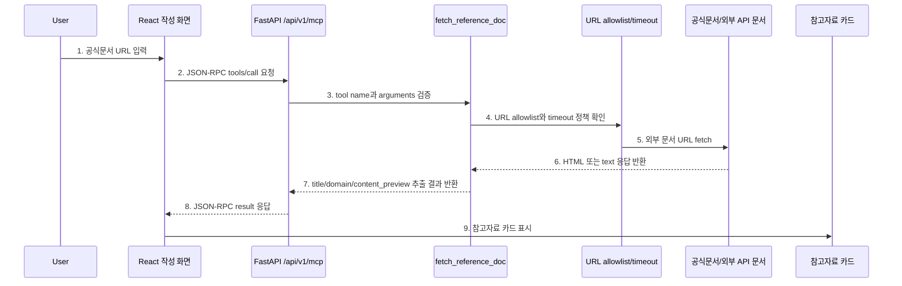
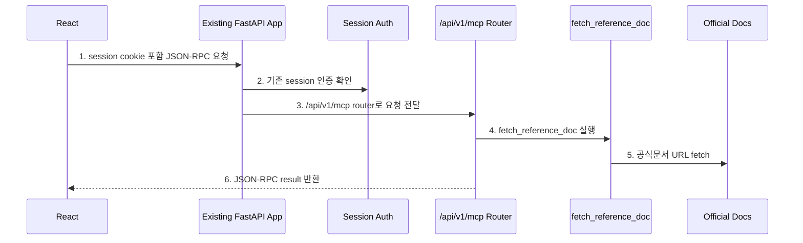
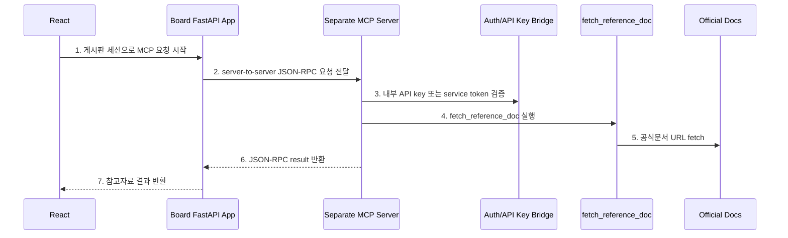

# Sprint 7 MCP 개념 및 의사결정 가이드

## 1. 이 문서의 목표

이 문서는 Sprint 7에서 구현할 **FastAPI 기반 MCP 기능**을 이해하고, 구현 전에 필요한 의사결정을 내리기 위한 가이드입니다.

지금 가장 헷갈리는 지점은 아래 질문입니다.

```text
API와 MCP는 뭐가 다른가?
MCP server를 FastAPI 내부 router로 두는 것과 별도 서버로 두는 것은 뭐가 다른가?
공식문서/외부 API 참고자료 가져오기는 MCP로 어떻게 표현되는가?
```

이 문서는 위 질문에 답하는 것을 목표로 합니다.

참고 기준:

```text
1. MCP 공식 소개 문서
   - https://modelcontextprotocol.io/docs/getting-started/intro

2. MCP Base Protocol 문서
   - https://modelcontextprotocol.io/specification/2025-06-18/basic

3. MCP Tools 문서
   - https://modelcontextprotocol.io/specification/2025-06-18/server/tools
```

## 2. 한 문장으로 이해하기

```text
API는 서비스 기능을 외부에 노출하는 방식이고,
MCP는 AI 또는 Agent가 그런 기능을 tool처럼 발견하고 호출할 수 있게 만드는 표준 인터페이스다.
```

MCP는 API를 대체하지 않습니다.

MCP tool 내부에서는 결국 아래 같은 일을 합니다.

```text
1. 외부 HTTP API 호출
2. DB 조회
3. 파일 읽기
4. 공식문서 페이지 fetch
5. 계산 함수 실행
```

즉, MCP는 새로운 종류의 비즈니스 로직이라기보다 **AI가 사용할 수 있도록 기존 기능/API/데이터 접근을 표준 tool 계약으로 감싸는 층**입니다.

## 3. API와 MCP의 차이

| 구분 | 일반 API | MCP |
| --- | --- | --- |
| 주 사용 주체 | 프론트엔드, 백엔드, 외부 개발자 | AI 앱, Agent, LLM tool caller |
| 목적 | 특정 서비스 기능 호출 | AI가 사용할 수 있는 tool 제공 |
| 대표 형식 | REST, GraphQL, RPC 등 자유 | JSON-RPC 2.0 기반 메시지 |
| 호출 예시 | `GET /api/v1/posts/1` | `tools/call`로 `fetch_reference_doc` 호출 |
| 기능 발견 | 개발자가 API 문서를 읽음 | 클라이언트가 `tools/list`로 tool 목록 확인 가능 |
| 입력 계약 | endpoint마다 다름 | tool name + input schema |
| 출력 계약 | endpoint마다 다름 | tool result content 또는 structured result |
| 우리 프로젝트 의미 | 게시글 CRUD, 로그인, 댓글 API | Agent가 사용할 외부 참고자료 수집 tool |

중요한 차이는 **“누가 이 기능을 이해하고 호출하느냐”**입니다.

일반 API는 개발자가 코드를 짜서 호출합니다.

MCP tool은 Agent가 아래처럼 판단해서 호출할 수 있어야 합니다.

```text
사용자가 글을 쓰고 있다.
공식문서 URL이 있다.
내가 사용할 수 있는 tool 중 fetch_reference_doc이 있다.
이 tool은 url을 입력으로 받는다.
그러면 이 URL을 넣어 참고자료를 가져와야겠다.
```

## 4. 같은 기능을 API와 MCP로 표현하면

목표 기능:

```text
FastAPI 공식문서 URL을 넣으면 title, domain, description, content_preview를 가져온다.
```

일반 API처럼 만들면 아래처럼 됩니다.

```http
POST /api/v1/reference-docs/fetch
Content-Type: application/json

{
  "url": "https://fastapi.tiangolo.com/tutorial/dependencies/"
}
```

MCP 형태로 만들면 아래처럼 됩니다.

```json
{
  "jsonrpc": "2.0",
  "id": "req-1",
  "method": "tools/call",
  "params": {
    "name": "fetch_reference_doc",
    "arguments": {
      "url": "https://fastapi.tiangolo.com/tutorial/dependencies/"
    }
  }
}
```

겉보기에는 둘 다 HTTP POST일 수 있습니다.

하지만 의미가 다릅니다.

```text
일반 API:
- "이 endpoint는 reference document를 fetch한다."

MCP:
- "이 서버는 fetch_reference_doc이라는 tool을 제공한다."
- "이 tool은 url이라는 input을 받는다."
- "AI/Agent는 tools/list로 이 tool의 존재와 schema를 알 수 있다."
- "AI/Agent는 tools/call로 이 tool을 호출할 수 있다."
```

## 5. MCP 핵심 구성 요소

| 구성 요소 | 의미 | 우리 프로젝트 기준 |
| --- | --- | --- |
| Host | AI 기능을 실행하는 앱 | Sprint 8 Agent 또는 AI 글쓰기 도우미 |
| Client | MCP server와 통신하는 쪽 | Agent 내부 tool caller 또는 프론트 임시 호출자 |
| Server | tool/resource/prompt를 제공하는 서버 | Sprint 7에서 만들 FastAPI MCP router/module |
| Tool | 실행 가능한 기능 | `fetch_reference_doc` |
| Resource | 읽을 수 있는 자료 | 가져온 공식문서/외부 API 문서 내용 |
| Prompt | 재사용 가능한 프롬프트 템플릿 | Sprint 8 글 초안 생성 prompt 후보 |

Sprint 7에서는 Host/Agent가 아직 완성되지 않았으므로, 먼저 Server와 Tool을 만듭니다.

```text
Sprint 7:
- MCP endpoint
- JSON-RPC request/response
- fetch_reference_doc tool
- 공식문서/외부 API 문서 URL fetch
- 참고자료 카드 표시

Sprint 8:
- Agent가 이 MCP tool을 호출
- RAG 결과와 MCP 결과를 합쳐 초안/태그 제안
```

## 6. Sprint 7에서 만들 기능

추천 MVP:

```text
글 작성 화면에서 공식문서 또는 외부 API 문서 URL을 입력한다.
사용자가 "참고자료 가져오기" 버튼을 누른다.
프론트는 MCP JSON-RPC request를 보낸다.
FastAPI MCP endpoint는 fetch_reference_doc tool을 실행한다.
tool은 URL을 fetch해서 title, domain, description, content_preview를 추출한다.
프론트는 결과를 참고자료 카드로 보여준다.
```

대상 URL 예시:

```text
https://fastapi.tiangolo.com/tutorial/dependencies/
https://react.dev/reference/react/useEffect
https://developer.mozilla.org/en-US/docs/Web/HTTP/CORS
https://www.postgresql.org/docs/current/tutorial.html
https://platform.openai.com/docs/
```

## 7. Sprint 7 기본 흐름



다이어그램 번호와 같은 순서로 코드를 보면 됩니다.

```text
1. 공식문서 URL 입력
   - 코드 위치 후보: frontend/src/components/ComposeModal.tsx
   - 확인: 게시글 작성 화면 안에 참고자료 URL 입력 UI를 둔다.

2. JSON-RPC tools/call 요청
   - 코드 위치 후보: frontend/src/hooks/useReferenceDocs.ts
   - 확인: 프론트가 일반 REST payload가 아니라 jsonrpc/method/params 형태로 요청한다.

3. tool name과 arguments 검증
   - 코드 위치 후보: backend/app/api/v1/mcp.py
   - 확인: method가 tools/call인지, name이 fetch_reference_doc인지 확인한다.

4. URL allowlist와 timeout 정책 확인
   - 코드 위치 후보: backend/app/services/mcp_service.py
   - 확인: 허용한 공식문서/외부 API 문서 도메인인지 확인한다.

5. 외부 문서 URL fetch
   - 코드 위치 후보: backend/app/services/reference_doc_service.py
   - 확인: 외부 URL에 HTTP GET 요청을 보낸다.

6. HTML 또는 text 응답 반환
   - 코드 위치 후보: backend/app/services/reference_doc_service.py
   - 확인: 응답 status, content-type, body size 제한을 확인한다.

7. title/domain/content_preview 추출 결과 반환
   - 코드 위치 후보: backend/app/services/reference_doc_service.py
   - 확인: HTML title, meta description, 본문 일부를 추출한다.

8. JSON-RPC result 응답
   - 코드 위치 후보: backend/app/api/v1/mcp.py
   - 확인: id를 그대로 돌려주고 result 또는 error 중 하나만 반환한다.

9. 참고자료 카드 표시
   - 코드 위치 후보: frontend/src/components/ReferenceDocPanel.tsx
   - 확인: 가져온 참고자료를 글쓰기 화면 안에 일회성 카드로 표시한다.
```

## 8. FastAPI 내부 router vs 별도 MCP 서버

Sprint 7에서 가장 중요한 의사결정입니다.

선택지는 크게 세 가지입니다.

```text
1. FastAPI 내부 router
2. 별도 FastAPI MCP 서버
3. 내부 tool service + 나중에 별도 서버로 분리 가능한 hybrid
```

### 8.1 옵션 A: FastAPI 내부 router

구조:

```text
기존 FastAPI 앱
├── /api/v1/auth
├── /api/v1/posts
├── /api/v1/ai/rag
└── /api/v1/mcp        <- Sprint 7에서 추가
```

흐름:



다이어그램 번호와 같은 순서로 보면 됩니다.

```text
1. session cookie 포함 JSON-RPC 요청
   - 프론트는 기존 fetch와 credentials include 방식을 그대로 쓴다.

2. 기존 session 인증 확인
   - backend/app/api/v1/auth.py의 get_session_user를 재사용할 수 있다.

3. /api/v1/mcp router로 요청 전달
   - 기존 FastAPI app에 include_router만 추가하면 된다.

4. fetch_reference_doc 실행
   - MCP tool service는 일반 Python class/function으로 구현한다.

5. 공식문서 URL fetch
   - 외부 URL 호출은 server-side에서만 수행한다.

6. JSON-RPC result 반환
   - 응답은 JSON-RPC 형식으로 맞춘다.
```

장점:

```text
1. 구현이 가장 빠르다.
2. 기존 session auth를 그대로 쓸 수 있다.
3. 기존 CORS, settings, error handling 구조를 재사용할 수 있다.
4. 프론트 연동이 쉽다.
5. 테스트 작성이 단순하다.
6. 지금 게시판 MVP와 가장 잘 맞는다.
```

단점:

```text
1. 외부 AI client가 바로 붙는 "완전한 독립 MCP 서버" 느낌은 약하다.
2. 게시판 API와 MCP tool이 같은 앱에 있어 경계가 흐릴 수 있다.
3. MCP lifecycle initialize, capability negotiation까지 완전 구현하지 않으면 "MCP 스타일 JSON-RPC endpoint"에 가깝다.
4. 나중에 여러 앱에서 같은 MCP server를 재사용하려면 분리 작업이 필요하다.
```

이 옵션은 아래 상황에 적합합니다.

```text
1. Sprint 기간이 짧다.
2. 프론트 작성 화면에서 바로 써야 한다.
3. 인증을 기존 세션으로 처리하고 싶다.
4. 외부 도구 1개만 MVP로 구현한다.
5. Sprint 8 Agent도 같은 FastAPI 앱 안에서 돌릴 가능성이 높다.
```

### 8.2 옵션 B: 별도 FastAPI MCP 서버

구조:

```text
게시판 FastAPI 앱
├── /api/v1/auth
├── /api/v1/posts
└── /api/v1/ai/rag

별도 MCP FastAPI 앱
└── /mcp
```

흐름:



다이어그램 번호와 같은 순서로 보면 됩니다.

```text
1. 게시판 세션으로 MCP 요청 시작
   - 프론트는 기존 게시판 API에 요청하거나, MCP server로 직접 요청할 수 있다.

2. server-to-server JSON-RPC 요청 전달
   - 게시판 API가 별도 MCP server를 호출한다.

3. 내부 API key 또는 service token 검증
   - 별도 서버이므로 인증 전략을 따로 정해야 한다.

4. fetch_reference_doc 실행
   - MCP server가 tool 실행 책임을 가진다.

5. 공식문서 URL fetch
   - 외부 URL 호출은 MCP server에서 수행한다.

6. JSON-RPC result 반환
   - MCP server는 게시판 API에 결과를 돌려준다.

7. 참고자료 결과 반환
   - 게시판 API가 프론트에 결과를 전달한다.
```

장점:

```text
1. MCP server 경계가 명확하다.
2. 나중에 다른 Agent/AI client가 재사용하기 쉽다.
3. 게시판 API와 tool runtime을 분리할 수 있다.
4. tool별 timeout, rate limit, logging을 독립적으로 관리하기 좋다.
5. 실제 MCP server 구조를 설명하기 쉽다.
```

단점:

```text
1. 서버가 하나 더 생긴다.
2. 실행/배포/포트/CORS 설정이 늘어난다.
3. 게시판 session을 MCP server가 어떻게 신뢰할지 별도 설계가 필요하다.
4. 로컬 개발과 테스트가 복잡해진다.
5. 지금 Sprint 7 MVP에는 구현 비용이 크다.
```

이 옵션은 아래 상황에 적합합니다.

```text
1. 여러 서비스나 Agent가 같은 MCP server를 재사용해야 한다.
2. 외부 AI client가 직접 MCP server에 붙어야 한다.
3. tool이 많고, 게시판 API와 독립적으로 확장해야 한다.
4. 배포 구조를 분리할 여유가 있다.
```

### 8.3 옵션 C: Hybrid

구조:

```text
FastAPI 내부 router로 시작한다.
단, 실제 tool 로직은 service class로 분리한다.
나중에 별도 MCP server가 필요하면 router만 바꾸고 service는 재사용한다.
```

예시:

```text
backend/app/api/v1/mcp.py
backend/app/services/mcp_service.py
backend/app/services/reference_doc_service.py
backend/app/schemas/mcp.py
```

장점:

```text
1. 지금은 빠르게 구현할 수 있다.
2. 나중에 별도 서버로 분리하기 쉽다.
3. Sprint 7 MVP와 Sprint 8 Agent 연동 둘 다 대응할 수 있다.
4. 코드 구조상 MCP router와 tool logic의 책임이 분리된다.
```

단점:

```text
1. 엄밀한 독립 MCP server는 아직 아니다.
2. 문서에서 "현재는 내부 router, 추후 분리 가능"이라고 설명해야 한다.
```

추천:

```text
Sprint 7에서는 옵션 C가 가장 적절하다.

구현은 FastAPI 내부 router로 하되,
tool 실행 로직은 service로 분리한다.
```

## 9. Sprint 7 의사결정 사항

### 9.1 MCP server 위치

선택지:

```text
1. FastAPI 내부 router
2. 별도 FastAPI MCP server
3. 내부 router + service 분리 hybrid
```

추천:

```text
3. 내부 router + service 분리 hybrid
```

이유:

```text
1. 지금은 게시판 프론트에서 바로 호출해야 한다.
2. 기존 session 인증을 재사용할 수 있다.
3. 구현 범위를 Sprint 7 안에 끝낼 수 있다.
4. Sprint 8 Agent가 같은 service를 tool로 재사용할 수 있다.
5. 나중에 별도 MCP server로 분리할 수 있다.
```

### 9.2 MCP protocol 구현 범위

선택지:

```text
1. tools/call만 구현
2. tools/list + tools/call 구현
3. initialize/lifecycle까지 포함한 더 완전한 MCP server 구현
```

추천:

```text
2. tools/list + tools/call 구현
```

이유:

```text
1. tools/call만 있으면 그냥 JSON-RPC API처럼 보일 수 있다.
2. tools/list가 있으면 "이 서버가 어떤 tool을 제공하는지"를 설명할 수 있다.
3. initialize/lifecycle까지 구현하기에는 Sprint 7 MVP 범위가 커진다.
```

### 9.3 Tool 이름

선택지:

```text
1. fetch_url_metadata
2. fetch_reference_doc
3. fetch_official_doc
```

추천:

```text
fetch_reference_doc
```

이유:

```text
1. 공식문서와 외부 API 문서를 모두 포괄한다.
2. URL metadata만 가져오는 것보다 "참고자료"라는 제품 의미가 드러난다.
3. Sprint 8 Agent가 이해하기 쉬운 tool 이름이다.
```

### 9.4 입력 방식

선택지:

```text
1. URL 직접 입력
2. 서비스명 + 검색어 입력
3. URL 또는 검색어 둘 다 지원
```

추천:

```text
1. URL 직접 입력
```

이유:

```text
1. 검색 기능까지 붙이면 외부 검색 API가 필요해진다.
2. URL 입력은 구현과 데모가 명확하다.
3. SSRF allowlist 검증도 URL 기준으로 하기 쉽다.
```

### 9.5 허용 URL 범위

선택지:

```text
1. 모든 URL 허용
2. allowlist 도메인만 허용
3. 공식문서 도메인은 허용, 일반 블로그는 차단
```

추천:

```text
2. allowlist 도메인만 허용
```

초기 allowlist 후보:

```text
fastapi.tiangolo.com
react.dev
developer.mozilla.org
www.postgresql.org
platform.openai.com
docs.python.org
docs.sqlalchemy.org
```

이유:

```text
1. 외부 URL fetch는 SSRF 위험이 있다.
2. MVP에서는 "공식문서/외부 API 문서"로 범위를 제한하는 편이 설명하기 좋다.
3. 허용 도메인을 문서화하면 보안 의사결정으로도 의미가 있다.
```

### 9.6 가져올 데이터

추천 output:

```json
{
  "title": "Dependencies - FastAPI",
  "domain": "fastapi.tiangolo.com",
  "url": "https://fastapi.tiangolo.com/tutorial/dependencies/",
  "description": "FastAPI dependencies guide",
  "content_preview": "FastAPI has a very powerful but intuitive Dependency Injection system...",
  "fetched_at": "2026-06-16T00:00:00Z"
}
```

결정 포인트:

```text
1. HTML 전체를 저장하지 않는다.
2. preview는 길이 제한을 둔다.
3. title/description/content_preview 정도만 카드에 표시한다.
```

### 9.7 결과 저장 여부

선택지:

```text
1. DB에 reference_docs 테이블로 저장
2. 게시글 draft state에만 일회성 표시
3. 사용자가 "본문에 추가"를 누르면 글 내용에 삽입
```

추천:

```text
2. 일회성 표시
```

이유:

```text
1. Sprint 7의 핵심은 MCP tool 호출 구조다.
2. 저장 정책까지 들어가면 범위가 커진다.
3. Sprint 8 Agent가 초안에 반영할 때 저장 여부를 다시 결정할 수 있다.
```

### 9.8 인증과 권한

선택지:

```text
1. 비로그인 허용
2. 로그인 사용자만 허용
3. 관리자만 허용
```

추천:

```text
2. 로그인 사용자만 허용
```

이유:

```text
1. 글쓰기 보조 기능이다.
2. 외부 URL fetch 남용을 줄여야 한다.
3. 기존 session auth를 재사용할 수 있다.
```

### 9.9 실패 처리

추천 error code:

```text
MCP_INVALID_REQUEST
MCP_TOOL_NOT_FOUND
MCP_URL_NOT_ALLOWED
MCP_FETCH_TIMEOUT
MCP_FETCH_FAILED
MCP_PARSE_FAILED
```

정책:

```text
1. 실패해도 글 작성은 계속 가능하다.
2. JSON-RPC error 형식으로 반환한다.
3. 프론트는 참고자료 카드 영역에만 실패 메시지를 표시한다.
```

### 9.10 프론트 UI

선택지:

```text
1. 작성 화면 안 URL input + 가져오기 버튼
2. 별도 MCP 테스트 페이지
3. URL 입력 시 자동 호출
```

추천:

```text
1. 작성 화면 안 URL input + 가져오기 버튼
```

이유:

```text
1. 글쓰기 보조 흐름에 자연스럽게 들어간다.
2. 자동 호출보다 비용/보안/UX가 명확하다.
3. 발표 데모가 쉽다.
```

## 10. 추천 최종 결정안

```text
Sprint 7에서는 FastAPI 내부 /api/v1/mcp router를 MCP Server 역할로 만든다.
단, tool 실행 로직은 service로 분리해서 나중에 별도 MCP server로 뺄 수 있게 한다.

MCP protocol 범위는 tools/list와 tools/call을 구현한다.
tool은 fetch_reference_doc 하나로 시작한다.
입력은 공식문서/외부 API 문서 URL이다.
허용 도메인은 allowlist로 제한한다.
로그인 사용자만 호출할 수 있다.
결과는 DB에 저장하지 않고 글 작성 화면에 참고자료 카드로 일회성 표시한다.
실패해도 글 작성은 계속 가능해야 한다.
```

중요한 점은 `/api/v1/mcp`가 단순한 일반 REST API가 아니어야 한다는 것입니다.

```text
충족해야 하는 최소 조건:
1. JSON-RPC 2.0 형태의 request/response를 받는다.
2. tools/list로 제공 tool 목록을 반환한다.
3. tools/call로 fetch_reference_doc tool을 실행한다.
4. tool 실행 중 실제 외부 문서 URL 또는 외부 API를 호출한다.
5. API key 또는 권한 관리 전략을 문서화한다.
```

이 조건을 만족하면 같은 FastAPI 앱 안에 있어도 "MCP Server 역할을 하는 endpoint"라고 설명할 수 있습니다.
다만 발표 설득력만 보면 별도 서버가 더 선명하고, 구현 안정성은 내부 router가 더 좋습니다.

## 11. 과제 고려사항 기준 점검

### 11.1 MCP 요구사항 기준

과제 고려사항을 기준으로 보면 Sprint 7에서 반드시 보여줘야 하는 것은 아래입니다.

| 과제 고려사항 | 우리 구현에서 만족해야 하는 형태 | 주의점 |
| --- | --- | --- |
| MCP Server 구현 | `/api/v1/mcp` 또는 별도 MCP FastAPI 앱 | 단순 내부 함수 호출만 있으면 부족하다. JSON-RPC endpoint가 있어야 한다. |
| JSON-RPC 기반 요청/응답 처리 | `tools/list`, `tools/call` 요청/응답 | 일반 REST endpoint처럼 만들면 MCP 설명력이 약하다. |
| 최소 1개 이상의 실제 외부 서비스 연동 | 공식문서/외부 API 문서 URL fetch 또는 외부 API 호출 | mock response만 반환하면 요구사항을 만족하기 어렵다. |
| API Key / 권한 관리 전략 포함 | 로그인 사용자만 호출, allowlist, timeout, server-only env key 정책 | 외부 서비스가 API key를 안 쓰더라도 권한/보안 전략은 문서화해야 한다. |

따라서 결론은 이렇습니다.

```text
맞다.
Sprint 7에서는 MCP Server 역할을 구현하고,
실제로 외부 문서 URL 또는 외부 API를 호출해야 한다.
```

공식문서 URL fetch는 실제 외부 HTTP 호출이므로 MVP 외부 연동으로 사용할 수 있습니다.
다만 과제에서 "API Key"를 매우 엄격하게 본다면, key가 필요한 외부 API를 하나 붙이는 편이 더 안전합니다.

선택지는 아래처럼 정리할 수 있습니다.

| 선택지 | 설명 | 장점 | 리스크 |
| --- | --- | --- | --- |
| 공식문서 URL fetch | FastAPI/React/MDN/PostgreSQL 공식문서 URL을 서버에서 가져온다. | 구현이 단순하고 게시글 작성 흐름과 잘 맞는다. | API key가 없는 외부 호출이라 "API Key 관리"는 전략 문서 중심이 된다. |
| 외부 검색 API | 공식문서 검색 API나 검색 서비스 API를 호출한다. | API key 관리까지 명확하게 보여줄 수 있다. | 키 발급, 비용, rate limit, 실패 처리가 추가된다. |
| 외부 URL fetch + OpenAI 요약 | URL fetch 후 OpenAI로 참고자료 요약을 만든다. | 이미 OpenAI key 관리 구조가 있고 결과 품질이 좋다. | Sprint 6 요약과 역할이 겹칠 수 있다. |

현재 프로젝트에는 이미 OpenAI key가 RAG embedding/summary에 사용됩니다.
하지만 Sprint 7 MCP의 외부 서비스는 "참고자료를 가져오는 역할"로 따로 설명하는 편이 좋습니다.

### 11.2 RAG 요구사항 기준

RAG 고려사항은 현재 Sprint 6 구현과 비교하면 아래처럼 볼 수 있습니다.

| 과제 고려사항 | 현재 상태 | 판단 |
| --- | --- | --- |
| 데이터 소스 연동 | PostgreSQL의 `posts`, `tags`, `post_embeddings`를 사용 | 충족. mock data가 있어도 실제 DB에 저장된 게시글을 대상으로 검색한다. |
| LLM에 맞는 Embedding 모델 연동 | 실제 앱은 LangChain `OpenAIEmbeddings`, 테스트는 LangChain `Embeddings` mock | 충족. 테스트 mock은 정상적인 테스트 전략이다. |
| Vector DB 선택 | PostgreSQL + pgvector | 충족. 과제 예시에도 포함되는 선택지다. |
| 프레임워크 선택 | LangChain | 충족. Sprint 8 Agent tool 연결까지 고려한 선택이다. |

즉, 현재 RAG에서 가장 조심할 부분은 두 가지입니다.

```text
1. 데이터가 mock뿐이라고 설명하면 안 된다.
   실제 데이터 소스는 PostgreSQL 게시글 DB이고,
   seed data는 데모를 위한 초기 데이터라고 설명해야 한다.

2. LangChain이 pgvector를 대체한다고 설명하면 안 된다.
   pgvector는 vector 저장/검색 엔진이고,
   LangChain은 Embeddings, Document, VectorStore, Tool/Agent 연결을 돕는 framework다.
```

현재 Sprint 6 RAG는 LangChain 기반으로 리팩토링되어 있습니다.

```text
게시글 저장
-> LangChain OpenAIEmbeddings 또는 mock Embeddings
-> LangChain Document 변환
-> LangChain PGVector에 저장
-> 작성 중인 글을 query text로 변환
-> PGVector similarity search
-> 현재 posts/tags 테이블로 결과 재확인
-> 관련 글 top-3와 summary 반환
```

발표/채점에서 "프레임워크 선택"을 물어보면 이렇게 답하면 됩니다.

```text
RAG framework는 LangChain을 선택했다.
이유는 Sprint 8에서 Agent를 붙일 예정이고,
RAG 검색과 MCP 참고자료 조회를 LangChain tool로 감싸 Agent가 호출하기 쉽게 만들기 위해서다.

Vector DB는 PostgreSQL + pgvector를 유지한다.
LangChain은 pgvector 위에서 Embeddings, Document, PGVector VectorStore, Agent tool 연결을 표준화한다.
```

## 12. 구현 전 체크 질문

아래 질문에 답하면 구현을 시작할 수 있습니다.

```text
1. MCP server 위치는 FastAPI 내부 router + service 분리 hybrid로 갈 것인가?
2. tools/list와 tools/call을 둘 다 구현할 것인가?
3. tool 이름은 fetch_reference_doc으로 확정할 것인가?
4. URL 입력 방식으로 갈 것인가?
5. allowlist 도메인은 어디까지 허용할 것인가?
6. 결과는 DB 저장 없이 일회성 카드로 표시할 것인가?
7. 로그인 사용자만 호출 가능하게 할 것인가?
8. 실패 코드는 위 추천안으로 갈 것인가?
9. 프론트는 작성 모달 안에 URL input + 가져오기 버튼을 둘 것인가?
```
