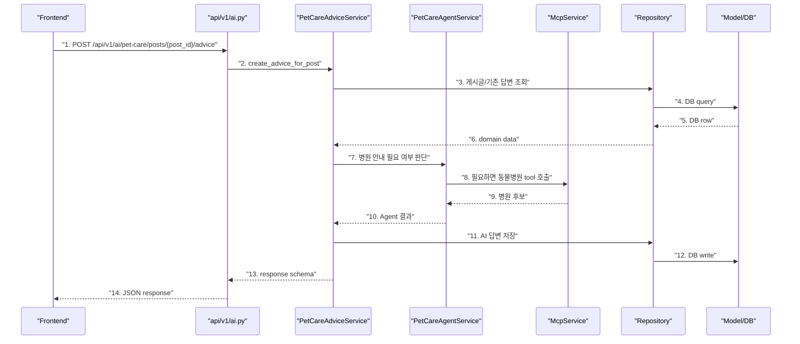

# Frontend / Backend Architecture Guide

## 1. 이 문서의 목적

이 문서는 현재 프로젝트의 백엔드/프론트엔드 파일 구조를 초보자 기준으로 설명한다.

핵심 질문은 세 가지다.

1. 백엔드의 MVC 또는 계층 분리는 무엇인가?
2. 프론트엔드는 MVC처럼 나누는가, 아니면 다르게 나누는가?
3. 현재 우리 프론트 코드는 어느 정도 잘 분리되어 있고, 어디가 읽기 어려운가?

## 2. 결론 먼저

현재 백엔드는 전통적인 MVC 그대로라기보다는 **FastAPI 기반 Layered Architecture**에 가깝다.

```text
API Router
-> Service
-> Repository
-> Model
-> DB
```

현재 프론트엔드는 MVC라기보다는 **React 컴포넌트 + Hook 분리 구조**다.

```text
App
-> Custom Hooks
-> Components
-> API Request
```

현재 프론트 분리 상태는 이렇게 평가할 수 있다.

| 항목 | 평가 |
| --- | --- |
| 컴포넌트 분리 | 기본적으로 되어 있음 |
| hook 분리 | 게시글/댓글/인증/AI 답변 등 기능별로 되어 있음 |
| 읽기 쉬움 | 초보자에게는 아직 어려움 |
| 가장 큰 파일 | `PostDetail.tsx`, `useBoardController.ts`, `usePosts.ts` |
| 문제 성격 | 구조가 아예 없는 문제는 아니고, 기능이 쌓이면서 일부 파일이 커진 문제 |

즉, 지금 프론트는 “완전 엉망”은 아니다.  
다만 AI로 기능을 빠르게 붙이다 보니, **일부 파일이 너무 많은 책임을 갖고 있어서 처음 읽는 사람에게 블랙박스처럼 보이는 상태**다.

## 3. MVC 패턴이란?

MVC는 Model, View, Controller를 나누는 방식이다.

```text
Model      = 데이터와 DB 구조
View       = 사용자에게 보이는 화면
Controller = 요청을 받아서 Model과 View를 연결
```

웹 백엔드 기준으로 단순화하면 이렇게 볼 수 있다.

```text
사용자 요청
-> Controller
-> Model/DB 처리
-> 응답 반환
```

예를 들어 게시글 목록 조회라면:

```text
GET /posts
-> PostsController
-> Post Model에서 DB 조회
-> posts response 반환
```

## 4. 우리 백엔드는 MVC인가?

우리 백엔드는 MVC라는 말로 설명할 수는 있지만, 실제 구조는 더 세분화되어 있다.

현재 백엔드 구조:

```text
backend/app
├── api
│   └── v1
│       ├── posts.py
│       ├── comments.py
│       ├── auth.py
│       ├── ai.py
│       └── mcp.py
├── services
│   ├── post_service.py
│   ├── pet_care_advice_service.py
│   ├── pet_care_agent_service.py
│   └── mcp_service.py
├── repositories
│   ├── post_repository.py
│   ├── pet_care_advice_repository.py
│   └── knowledge_repository.py
├── models
│   ├── post.py
│   ├── pet_care_advice.py
│   └── knowledge.py
└── schemas
    ├── post.py
    ├── ai.py
    └── mcp.py
```

이걸 MVC에 억지로 대응시키면:

| MVC | 우리 백엔드 |
| --- | --- |
| Model | `models/`, `repositories/` |
| View | API 서버에서는 HTML View가 없고, JSON response가 View 역할 |
| Controller | `api/v1/*.py` |

하지만 더 정확한 설명은 이것이다.

```text
API Router = HTTP 요청/응답 담당
Service = 비즈니스 로직 담당
Repository = DB 조회/저장 담당
Model = DB 테이블 구조 담당
Schema = 요청/응답 데이터 모양 담당
```

## 5. 백엔드 흐름 예시

AI 답변 생성 흐름을 백엔드 계층으로 보면 다음과 같다.



번호별 책임:

1. 프론트가 API 요청을 보낸다.
2. Router는 HTTP 요청을 Service로 넘긴다.
3. Service는 필요한 비즈니스 판단을 한다.
4. Repository는 DB 조회/저장을 맡는다.
5. Model은 실제 테이블 구조다.
6. Service는 DB 결과를 받아 다음 로직을 진행한다.
7. Agent는 병원 안내가 필요한지 판단한다.
8. MCP는 외부 도구 호출 계층이다.
9. 병원 후보가 Agent로 돌아온다.
10. Service는 RAG/MCP/LLM 결과를 조합한다.
11. Repository에 저장을 맡긴다.
12. DB에 저장된다.
13. Schema 형태로 응답을 만든다.
14. 프론트로 JSON이 돌아간다.

## 6. 백엔드에서 파일을 읽는 기준

백엔드를 읽을 때는 이 순서로 보면 된다.

```text
1. api/v1/*.py
   어떤 URL이 어떤 service 함수를 호출하는지 본다.

2. services/*.py
   실제 로직과 의사결정이 어디에 있는지 본다.

3. repositories/*.py
   DB에서 무엇을 조회/저장하는지 본다.

4. models/*.py
   테이블 컬럼과 관계를 본다.

5. schemas/*.py
   요청/응답 JSON 모양을 본다.
```

예:

```text
api/v1/ai.py
-> pet_care_advice_service.py
-> pet_care_agent_service.py
-> mcp_service.py
-> kakao_local_service.py
-> pet_care_advice_repository.py
-> pet_care_advice.py
-> schemas/ai.py
```

## 7. 프론트엔드는 MVC인가?

React 프론트엔드는 보통 MVC라고 부르지 않는다.

React에서는 보통 이렇게 나눈다.

```text
Component = 화면 조각
Hook = 상태와 로직
API Client = 서버 요청
Type = 데이터 모양
Util = 작은 변환 함수
Style = CSS
```

현재 프론트 구조:

```text
frontend/src
├── App.tsx
├── components
│   ├── PostDetail.tsx
│   ├── PostList.tsx
│   ├── ComposeModal.tsx
│   ├── AuthPanel.tsx
│   └── ...
├── hooks
│   ├── useBoardController.ts
│   ├── usePosts.ts
│   ├── usePetCareAdvice.ts
│   ├── useComments.ts
│   ├── useAuth.ts
│   └── ...
├── types.ts
├── utils
│   └── postFormatting.ts
├── constants
│   └── board.ts
└── styles.css
```

## 8. 프론트 폴더별 역할

### 8.1 `App.tsx`

역할:

```text
전체 화면 배치
어떤 컴포넌트를 보여줄지 결정
hook에서 받은 값과 함수를 컴포넌트에 연결
```

초보자용 해석:

```text
App.tsx는 프론트의 배선판이다.
직접 복잡한 일을 하기보다, hook에서 받은 상태와 함수를 화면 컴포넌트에 꽂아준다.
```

예:

```tsx
<PostDetail
  selectedPost={board.selectedPost}
  adviceState={board.petCareAdviceState}
  onGenerateAdvice={board.generateAdviceForSelectedPost}
/>
```

의미:

```text
PostDetail 화면에 selectedPost와 AI 답변 상태를 넘기고,
AI 답변 생성 버튼을 누르면 board.generateAdviceForSelectedPost를 실행하게 연결한다.
```

### 8.2 `components/`

역할:

```text
화면을 그리는 함수들
```

대표 파일:

| 파일 | 역할 |
| --- | --- |
| `PostList.tsx` | 게시글 카드 목록 |
| `PostDetail.tsx` | 게시글 상세, AI 답변, 병원 후보, 댓글 |
| `ComposeModal.tsx` | 질문 작성 모달 |
| `AuthPanel.tsx` | 로그인/회원가입 |
| `TopBar.tsx` | 상단 메뉴 |
| `HeroSearch.tsx` | 검색/필터 영역 |

컴포넌트는 이렇게 읽으면 된다.

```text
이 함수는 무엇을 화면에 보여주는가?
어떤 props를 받는가?
어떤 버튼이 어떤 onClick 함수를 실행하는가?
```

컴포넌트를 읽을 때 처음부터 모든 코드를 이해하려고 하면 안 된다.

먼저 볼 것:

```text
return (...) 안의 JSX
화면에 보이는 텍스트
button의 onClick
form의 onSubmit
```

### 8.3 `hooks/`

역할:

```text
상태와 동작을 묶어둔 함수들
```

대표 파일:

| 파일 | 역할 |
| --- | --- |
| `useBoardController.ts` | 프론트 전체 조율자 |
| `usePosts.ts` | 게시글 목록/작성/수정/삭제/선택 |
| `usePetCareAdvice.ts` | AI 답변 불러오기/생성 |
| `useComments.ts` | 댓글 조회/작성/삭제 |
| `useAuth.ts` | 로그인/회원가입/세션 |
| `usePostSearch.ts` | 검색/정렬/태그 필터 |
| `useApiRequest.ts` | fetch wrapper |

초보자용 해석:

```text
hook은 프론트의 service처럼 보면 된다.
```

예:

```text
usePosts = 게시글 서비스
usePetCareAdvice = AI 답변 서비스
useComments = 댓글 서비스
useAuth = 인증 서비스
```

hook을 읽을 때는 먼저 두 가지만 보면 된다.

```text
1. 어떤 useState를 갖고 있는가?
2. return에서 어떤 값/함수를 밖으로 내보내는가?
```

### 8.4 `types.ts`

역할:

```text
프론트에서 사용하는 데이터 모양 정의
```

예:

```ts
export interface PetCareAdvice {
  answer: string;
  action_plan: string[];
  sources: PetCareSource[];
  hospital_candidates: PetCareHospitalCandidate[];
}
```

의미:

```text
프론트가 AI 답변 데이터를 이런 모양으로 기대한다.
```

초보자 기준으로 `types.ts`는 백엔드의 `schemas/*.py`와 비슷한 역할이라고 보면 된다.

### 8.5 `utils/`

역할:

```text
작은 변환 함수
```

예:

```text
태그 문자열 -> 배열
빈 문자열 -> null
날짜 포맷
```

### 8.6 `styles.css`

역할:

```text
전체 CSS
```

현재는 CSS가 한 파일에 꽤 많이 모여 있다.  
초보자 입장에서는 컴포넌트별 CSS 파일보다 찾기는 단순하지만, 파일이 커질수록 특정 스타일을 찾기 어려워진다.

## 9. 현재 프론트 분리 상태 평가

현재 프론트는 기능별로 어느 정도 분리되어 있다.

좋은 점:

```text
components/와 hooks/가 나뉘어 있다.
API 요청은 useApiRequest로 어느 정도 모여 있다.
게시글, 댓글, 인증, AI 답변 hook이 분리되어 있다.
types.ts로 데이터 모양이 정의되어 있다.
```

읽기 어려운 점:

```text
PostDetail.tsx가 470줄로 크다.
useBoardController.ts가 250줄로 많은 흐름을 조율한다.
usePosts.ts가 234줄로 게시글 관련 일을 많이 한다.
App.tsx가 여러 컴포넌트 배선을 한 번에 담당한다.
styles.css가 커져서 스타일 추적이 어렵다.
```

즉, 현재 구조는 다음 상태다.

```text
기본 분리는 되어 있지만,
AI 기능과 게시판 기능이 계속 붙으면서 일부 파일이 커졌다.
초보자가 읽기에는 컴포넌트/훅 단위가 아직 크다.
```

## 10. 지금 프론트 코드가 블랙박스처럼 느껴지는 이유

첫 번째 이유는 props 배선 때문이다.

예:

```tsx
<PostDetail
  adviceState={board.petCareAdviceState}
  onGenerateAdvice={board.generateAdviceForSelectedPost}
/>
```

`PostDetail` 안에서는 `onGenerateAdvice`만 보인다.  
하지만 실제 함수는 `useBoardController` 안의 `generateAdviceForSelectedPost`다.

즉, 화면 파일 하나만 보면 전체 흐름이 안 보인다.

두 번째 이유는 상태가 여러 hook에 나뉘어 있기 때문이다.

```text
selectedPost -> usePosts
adviceByPostId -> usePetCareAdvice
comments -> useComments
currentUser -> useAuth
search -> usePostSearch
```

이 구조는 나쁜 구조가 아니다.  
다만 익숙하지 않으면 “값이 어디서 생긴 건지” 계속 놓치게 된다.

세 번째 이유는 `useBoardController`가 중앙 조율자라서 많은 함수가 모여 있기 때문이다.

```text
게시글 선택
글 작성
글 수정
댓글
AI 답변
로그인
검색
```

이 흐름들이 한 파일에 모여 있어, 처음 읽으면 복잡하게 느껴진다.

## 11. 프론트 구조를 백엔드 계층과 비교하면

정확히 1:1 대응되지는 않지만, 초보자용으로 이렇게 비교할 수 있다.

| 백엔드 | 프론트 |
| --- | --- |
| `api/v1/*.py` | `App.tsx` + 컴포넌트 이벤트 |
| `services/*.py` | `hooks/*.ts` |
| `repositories/*.py` | `useApiRequest.ts` + API 호출 함수 |
| `models/*.py` | `types.ts` |
| DB | React state / 백엔드 API 응답 |
| JSON response | Component props |

조심할 점:

```text
프론트에는 DB가 없다.
프론트의 Model은 보통 서버 데이터 타입과 state다.
프론트의 Controller는 명확한 파일 하나가 아니라 hook과 이벤트 핸들러에 흩어져 있다.
```

## 12. 좋은 프론트 분리 기준

프론트 파일을 나눌 때 기준은 보통 다음과 같다.

### 12.1 화면 기준

```text
PostList
PostDetail
ComposeModal
AuthPanel
```

화면에서 독립적으로 보이는 덩어리는 컴포넌트로 나눈다.

### 12.2 기능 상태 기준

```text
usePosts
useComments
useAuth
usePetCareAdvice
```

상태와 API 호출이 함께 움직이는 기능은 hook으로 나눈다.

### 12.3 공통 API 기준

```text
useApiRequest
```

모든 요청에서 공통으로 필요한 에러 처리, credentials, JSON parsing은 한 곳에 둔다.

### 12.4 데이터 타입 기준

```text
types.ts
```

백엔드 응답과 프론트 state의 모양은 타입으로 정의한다.

## 13. 현재 코드에서 더 나누면 좋은 부분

가장 먼저 나누면 좋은 파일은 `PostDetail.tsx`다.

현재 `PostDetail.tsx`는 게시글 상세, 수정 폼, AI 답변, 병원 후보, 참고 근거, 댓글까지 모두 포함한다.

나눌 수 있는 후보:

```text
PostDetailHeader
PostBodySection
PostEditForm
AiAnswerSection
HospitalCandidatesSection
SourceListSection
CommentsSection
```

이렇게 나누면 초보자가 읽을 때:

```text
AI 답변만 보고 싶으면 AiAnswerSection
병원 후보만 보고 싶으면 HospitalCandidatesSection
댓글만 보고 싶으면 CommentsSection
```

으로 이동할 수 있다.

두 번째 후보는 `useBoardController.ts`다.

현재 이 파일은 전체 조율자 역할을 한다. 이 구조 자체는 나쁘지 않지만, 커질수록 다음처럼 더 나눌 수 있다.

```text
usePostSelectionFlow
usePostMutationFlow
useAdviceFlow
useAuthFlow
```

다만 지금 당장 과하게 나누면 오히려 더 헷갈릴 수 있다.  
학습 단계에서는 먼저 문서로 흐름을 이해하고, 그 다음 작은 컴포넌트부터 나누는 편이 좋다.

## 14. 프론트 코드를 읽는 실전 순서

프론트 코드는 파일 위에서 아래로 읽으면 어렵다.

대신 이렇게 읽는다.

```text
1. 화면에서 보이는 텍스트를 검색한다.
2. 그 텍스트가 들어 있는 컴포넌트를 찾는다.
3. 버튼이면 onClick, 폼이면 onSubmit을 찾는다.
4. 그 함수가 props로 받은 것인지 확인한다.
5. App.tsx에서 실제로 어떤 함수가 연결됐는지 찾는다.
6. useBoardController에서 그 함수를 찾는다.
7. 해당 hook으로 이동한다.
8. API request를 찾는다.
```

예: AI 답변 생성

```text
AI 답변 생성 텍스트 검색
-> PostDetail.tsx
-> onGenerateAdvice
-> App.tsx
-> board.generateAdviceForSelectedPost
-> useBoardController.ts
-> petCareAdvice.generateForPost
-> usePetCareAdvice.ts
-> POST /api/v1/ai/pet-care/posts/{id}/advice
```

## 15. 현재 프론트 구조를 한 문장으로 설명하기

발표나 팀원 설명용으로는 이렇게 말하면 된다.

```text
프론트는 React 컴포넌트와 custom hook으로 분리했습니다.
컴포넌트는 화면을 그리고, hook은 상태 관리와 API 호출을 담당합니다.
App.tsx는 hook에서 받은 상태와 함수를 각 화면 컴포넌트에 연결하는 배선판 역할을 합니다.
```

조금 더 솔직하게 말하면:

```text
기본적인 분리는 되어 있지만, PostDetail과 useBoardController가 커져서 이후에는 AI 답변, 병원 후보, 댓글 영역을 더 작은 컴포넌트로 나누는 리팩토링이 필요합니다.
```

## 16. 지금 당장 학습할 때 볼 파일

처음에는 이 순서만 보면 된다.

```text
1. frontend/src/App.tsx
2. frontend/src/hooks/useBoardController.ts
3. frontend/src/hooks/usePetCareAdvice.ts
4. frontend/src/components/PostDetail.tsx
5. frontend/src/types.ts
```

그리고 백엔드는 같은 기능 기준으로:

```text
1. backend/app/api/v1/ai.py
2. backend/app/services/pet_care_advice_service.py
3. backend/app/services/pet_care_agent_service.py
4. backend/app/services/mcp_service.py
5. backend/app/repositories/pet_care_advice_repository.py
6. backend/app/models/pet_care_advice.py
7. backend/app/schemas/ai.py
```

## 17. 최종 판단

현재 백엔드는 계층 분리가 비교적 명확하다.

```text
Router -> Service -> Repository -> Model
```

현재 프론트도 컴포넌트와 hook 분리는 되어 있다.

```text
App -> Hooks -> Components -> API
```

하지만 프론트는 다음 이유로 더 복잡하게 느껴진다.

```text
상태가 여러 hook에 흩어져 있다.
props로 함수가 내려간다.
화면 코드와 조건부 렌더링이 섞인다.
일부 파일이 크다.
```

따라서 다음 프론트 학습/개선 방향은:

```text
1. 기능 하나씩 흐름 추적
2. PostDetail부터 작은 컴포넌트로 분리
3. useBoardController의 역할 문서화
4. API 응답 타입과 state 저장 위치를 계속 연결해서 보기
```

이 순서가 가장 현실적이다.
