# Fullstack Red Components Concept Guide

## 0. 이 문서의 목적

이 문서는 코치님이 제공한 Full Stack Tech Roadmap 이미지에서 **빨간색으로 표시된 최소 학습 항목**을 초보자 친화적으로 정리한 개념 문서다.

목표는 모든 기술을 깊게 구현하는 것이 아니다.

목표는 다음 질문에 답할 수 있게 되는 것이다.

```text
이 개념은 무엇인가?
왜 필요한가?
풀스택 서비스에서 어디에 등장하는가?
우리 프로젝트에서는 어떤 식으로 연결되는가?
```

## 1. 전체 그림

풀스택 서비스는 단순히 프론트와 백엔드를 붙인 것이 아니다.

사용자 행동 하나가 아래 흐름을 지나간다.

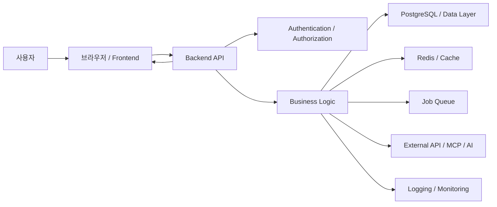

게시글 작성 하나로 보면:

```text
사용자 입력
-> React form state
-> POST /posts
-> Session 인증 확인
-> request validation
-> service 로직
-> transaction
-> PostgreSQL 저장
-> response 반환
-> frontend state 갱신
-> 화면 다시 렌더링
```

이 흐름을 설명하려면 언어, API, 인증, DB, 보안, 프론트 상태, 테스트, 설정을 모두 조금씩 알아야 한다.

## 2. 우선순위 지도

모든 항목을 같은 깊이로 공부하면 실패한다.

초반 우선순위는 다음 순서가 좋다.

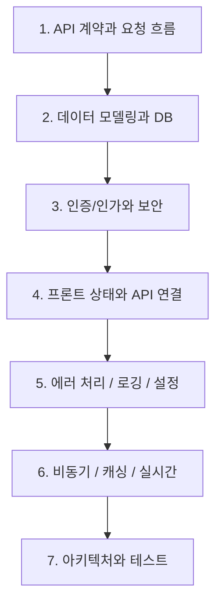

5주 프로젝트 전에는 최소한 다음을 팀원이 같은 언어로 말할 수 있어야 한다.

```text
API endpoint
request/response
HTTP status code
DB table과 관계
Session/JWT/OAuth2 차이
React state/props
CSR/SSR 차이
transaction
CSRF/CORS
logging/configuration
```

---

# Part 1. Language Basics

## 3. TypeScript

TypeScript는 JavaScript에 타입을 붙인 언어다.

JavaScript:

```ts
function add(a, b) {
  return a + b;
}
```

TypeScript:

```ts
function add(a: number, b: number): number {
  return a + b;
}
```

핵심은 “코드 실행 전에 데이터 모양 오류를 줄이는 것”이다.

프론트에서 중요한 이유:

```text
API 응답 데이터 모양을 명확히 알 수 있다.
컴포넌트 props 실수를 줄인다.
state에 잘못된 값을 넣는 실수를 줄인다.
```

예:

```ts
interface Post {
  id: number;
  title: string;
  content: string;
}
```

이 타입이 있으면 `post.title`은 문자열이라고 IDE와 컴파일러가 알 수 있다.

초보자가 가져갈 핵심:

```text
TypeScript = 프론트 코드에서 데이터 모양을 약속하는 도구
```

## 4. OOP

OOP는 Object-Oriented Programming, 객체지향 프로그래밍이다.

초보자는 먼저 이렇게 이해하면 된다.

```text
OOP = 코드를 책임 단위로 나누고, 각 단위가 자기 일만 하게 만드는 사고방식
```

백엔드에서는 OOP식 사고가 특히 중요하다.

```text
router = HTTP 요청과 응답 담당
service = 비즈니스 규칙 담당
repository = DB 접근 담당
```

즉, 백엔드 코드를 읽을 때는 “이 클래스/함수가 무슨 책임을 가지는가?”를 먼저 보면 된다.

자세한 설명은 [OOP and Functional Programming Guide](./oop-functional-programming-guide.md)를 참고한다.

## 5. Functional Programming

Functional Programming은 함수형 프로그래밍이다.

초보자는 먼저 이렇게 이해하면 된다.

```text
Functional Programming = 데이터를 직접 망가뜨리지 않고, 작은 함수들을 연결해서 새 결과를 만드는 방식
```

프론트에서는 함수형 스타일이 특히 자주 보인다.

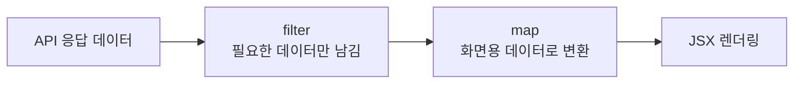

```text
posts.filter(...)
posts.map(...)
setPosts([...posts, newPost])
```

프론트 코드를 읽을 때는 “state가 어떤 함수들을 거쳐 화면 데이터가 되는가?”를 먼저 보면 된다.

자세한 설명은 [OOP and Functional Programming Guide](./oop-functional-programming-guide.md)를 참고한다.

## 6. Error Handling

Error handling은 오류를 숨기지 않고 분류해서 처리하는 것이다.

오류는 크게 나눌 수 있다.

```text
사용자 입력 오류
인증 오류
권한 오류
없는 데이터 요청
외부 API 실패
DB 실패
서버 버그
```

백엔드 예:

```json
{
  "error": {
    "code": "POST_NOT_FOUND",
    "message": "게시글을 찾을 수 없습니다.",
    "details": {}
  }
}
```

프론트 예:

```text
AI 답변을 생성하지 못했습니다.
다시 시도해 주세요.
```

중요한 점:

```text
에러를 그냥 500으로 뭉개면 프론트가 대응할 수 없다.
에러 code를 일관되게 주면 프론트가 상황별 UI를 만들 수 있다.
```

초보자가 가져갈 핵심:

```text
Error handling = 실패를 예측 가능한 응답으로 바꾸는 작업
```

## 7. Test Framework

Test framework는 코드가 예상대로 동작하는지 자동으로 확인하는 도구다.

대표 예:

```text
Python: pytest
JavaScript/TypeScript: Jest, Vitest
Frontend E2E: Playwright, Cypress
```

테스트 종류:

```text
Unit test = 작은 함수/서비스 테스트
Integration test = DB/API까지 연결 테스트
E2E test = 브라우저에서 실제 사용자 흐름 테스트
```

프로젝트에서 중요한 이유:

```text
AI가 만든 코드가 기존 기능을 깨뜨렸는지 확인할 수 있다.
리팩토링할 때 안전망이 된다.
팀원이 고친 코드의 부작용을 빨리 찾는다.
```

초보자가 가져갈 핵심:

```text
Test framework = 코드 변경이 기존 기능을 깨지 않았는지 확인하는 자동 안전망
```

---

# Part 2. Backend Framework

## 9. Framework

Framework는 서버나 앱을 만들 때 필요한 기본 구조를 제공하는 도구다.

프레임워크가 제공하는 것:

```text
라우팅
요청/응답 처리
validation
middleware
dependency injection
error handling
테스트 도구
```

FastAPI 예:

```py
@router.post("/posts")
def create_post(payload: PostCreate):
    ...
```

프레임워크 없이도 서버를 만들 수는 있지만, 팀 프로젝트에서는 프레임워크가 구조와 규칙을 제공하기 때문에 중요하다.

초보자가 가져갈 핵심:

```text
Framework = 반복되는 서버 구조를 제공해서 팀이 같은 방식으로 개발하게 해주는 도구
```

---

# Part 3. API

## 10. REST

REST는 리소스를 URL로 표현하고 HTTP method로 행동을 표현하는 API 설계 방식이다.

게시글 예:

```text
GET /posts          게시글 목록 조회
POST /posts         게시글 작성
GET /posts/1        1번 게시글 조회
PATCH /posts/1      1번 게시글 수정
DELETE /posts/1     1번 게시글 삭제
```

핵심:

```text
URL = 무엇을 다루는가
HTTP method = 무엇을 할 것인가
status code = 결과가 어떤 상태인가
```

초보자가 가져갈 핵심:

```text
REST = 백엔드 리소스를 일관된 URL과 HTTP method로 다루는 방식
```

## 11. API Design

API design은 프론트와 백엔드가 주고받을 약속을 정하는 것이다.

API 설계에서 정해야 하는 것:

```text
endpoint
method
request body
response body
status code
error response
인증 필요 여부
pagination/search/sort 방식
```

좋은 API 예:

```http
POST /api/v1/posts
```

Request:

```json
{
  "title": "강아지가 기침해요",
  "content": "5개월 강아지가 켁켁거립니다.",
  "tags": ["기침", "자견"],
  "region": "서울 마포구"
}
```

Response:

```json
{
  "id": 1,
  "title": "강아지가 기침해요",
  "author_display_name": "Team One"
}
```

초보자가 가져갈 핵심:

```text
API design = 프론트와 백엔드가 서로 헷갈리지 않게 정하는 데이터 계약
```

## 12. HTTP Error Handling

HTTP error handling은 실패를 status code로 표현하는 것이다.

자주 쓰는 코드:

```text
400 Bad Request = 요청 형식이 잘못됨
401 Unauthorized = 로그인 필요
403 Forbidden = 권한 없음
404 Not Found = 데이터 없음
409 Conflict = 중복/충돌
422 Unprocessable Entity = validation 실패
429 Too Many Requests = 요청 너무 많음
500 Internal Server Error = 서버 내부 오류
503 Service Unavailable = 외부 서비스/일시 장애
```

예:

```text
작성자만 삭제 가능한 게시글을 다른 사용자가 삭제 시도
-> 403 Forbidden
```

초보자가 가져갈 핵심:

```text
HTTP error handling = 실패 이유를 프론트가 이해할 수 있는 표준 코드로 표현하는 것
```

## 13. GraphQL

GraphQL은 클라이언트가 필요한 데이터 모양을 직접 요청하는 API 방식이다.

REST:

```text
GET /posts/1
```

GraphQL:

```graphql
query {
  post(id: 1) {
    title
    author {
      displayName
    }
  }
}
```

장점:

```text
필요한 필드만 요청 가능
여러 데이터를 한 번에 요청 가능
프론트 요구사항이 자주 바뀔 때 유연함
```

단점:

```text
초기 학습 비용이 있음
캐싱과 권한 처리가 REST보다 복잡할 수 있음
서버 schema 설계가 중요함
```

초보자가 가져갈 핵심:

```text
GraphQL = endpoint보다 데이터 모양을 중심으로 요청하는 API 방식
```

---

# Part 4. Authentication

## 14. Authentication vs Authorization

인증과 인가는 다르다.

```text
Authentication = 너 누구야?
Authorization = 너 이거 해도 돼?
```

예:

```text
로그인 성공 = 인증
내 글만 삭제 가능 = 인가
```

## 15. Session

Session 인증은 서버가 로그인 상태를 저장하는 방식이다.

흐름:

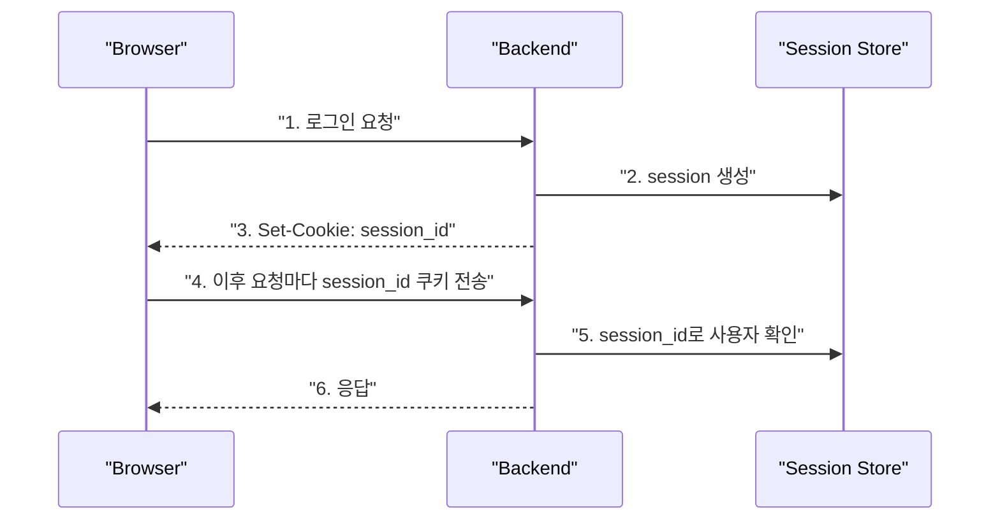

장점:

```text
서버에서 세션을 강제로 만료시킬 수 있다.
브라우저 쿠키와 잘 맞는다.
구현이 직관적이다.
```

단점:

```text
서버가 session 저장소를 가져야 한다.
서버 여러 대로 늘어나면 session store 공유가 필요하다.
CSRF 방어를 고려해야 한다.
```

초보자가 가져갈 핵심:

```text
Session = 서버가 로그인 상태를 기억하고, 브라우저는 session_id 쿠키를 보내는 방식
```

## 16. JWT

JWT는 JSON Web Token이다.

서버가 사용자 정보를 서명된 토큰으로 만들어 클라이언트에게 주고, 이후 클라이언트가 그 토큰을 요청에 붙여 보낸다.

형태:

```text
header.payload.signature
```

흐름:

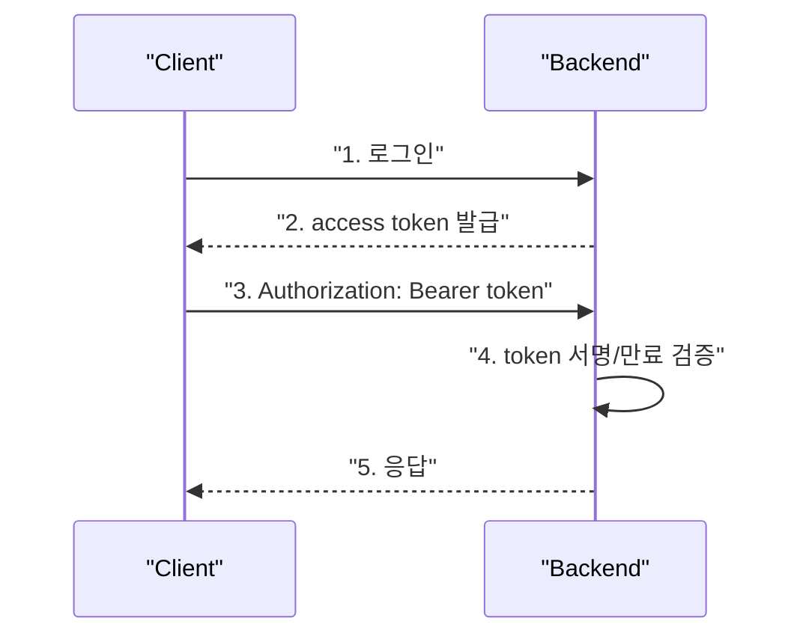

장점:

```text
서버가 session을 저장하지 않아도 된다.
모바일/외부 API와 잘 맞는다.
분산 환경에서 사용하기 쉽다.
```

단점:

```text
이미 발급한 token을 즉시 폐기하기 어렵다.
토큰 저장 위치에 따라 XSS/CSRF 위험이 달라진다.
access/refresh token 설계가 필요하다.
```

초보자가 가져갈 핵심:

```text
JWT = 서버가 서명한 토큰을 클라이언트가 들고 다니는 인증 방식
```

## 17. OAuth2

OAuth2는 다른 서비스의 권한을 위임받기 위한 표준이다.

예:

```text
카카오 로그인
구글 로그인
깃허브 로그인
```

소셜 로그인 흐름:

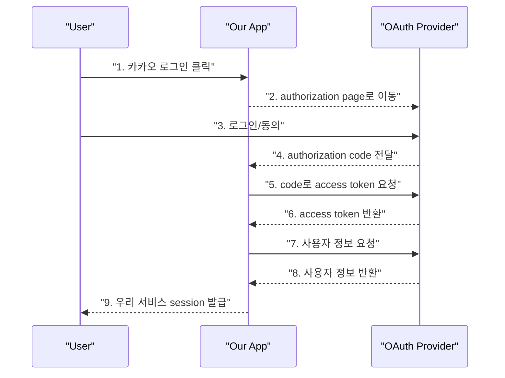

초보자가 가져갈 핵심:

```text
OAuth2 = 다른 서비스 로그인을 이용해 사용자 인증/권한 위임을 처리하는 표준 흐름
```

---

# Part 5. Realtime

## 18. WebSocket

WebSocket은 브라우저와 서버가 연결을 계속 유지하면서 양방향으로 메시지를 주고받는 방식이다.

HTTP:

```text
요청 -> 응답 -> 연결 종료
```

WebSocket:

```text
연결 유지
서버도 클라이언트에게 먼저 메시지 보낼 수 있음
```

예:

```text
채팅
실시간 알림
협업 편집
실시간 게임
```

초보자가 가져갈 핵심:

```text
WebSocket = 서버와 브라우저가 계속 연결된 채 양방향 실시간 통신을 하는 방식
```

## 19. SSE

SSE는 Server-Sent Events다.

서버가 브라우저로 이벤트를 계속 보내는 단방향 실시간 통신이다.

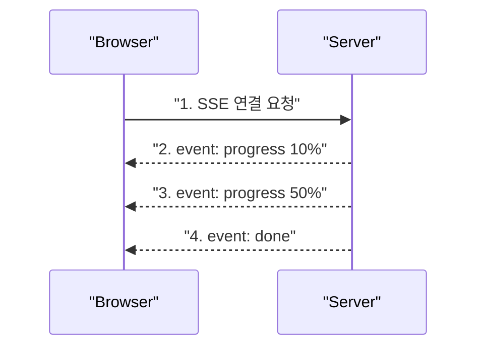

WebSocket과 비교:

```text
WebSocket = 양방향
SSE = 서버 -> 클라이언트 단방향
```

AI 답변 생성 진행률처럼 서버가 상태만 보내면 되는 경우 SSE가 더 단순할 수 있다.

초보자가 가져갈 핵심:

```text
SSE = 서버가 브라우저로 진행 상황이나 알림을 계속 보내는 단방향 실시간 방식
```

---

# Part 6. Security

## 20. HTTPS

HTTPS는 HTTP 통신을 암호화하는 방식이다.

HTTP 문제:

```text
중간에서 요청/응답을 엿볼 수 있다.
쿠키나 토큰이 노출될 수 있다.
```

HTTPS는 TLS를 사용해 통신을 암호화한다.

초보자가 가져갈 핵심:

```text
HTTPS = 브라우저와 서버 사이 통신을 암호화해서 쿠키/토큰/개인정보를 보호하는 기본 조건
```

## 21. Rate Limit

Rate limit은 일정 시간 동안 요청 횟수를 제한하는 것이다.

예:

```text
로그인 API는 1분에 5번까지만 허용
AI 답변 생성은 사용자당 1분에 3번까지만 허용
```

필요한 이유:

```text
무차별 대입 공격 방어
API 남용 방지
LLM 비용 폭증 방지
서버 과부하 방지
```

Redis를 rate limit 저장소로 자주 사용한다.

초보자가 가져갈 핵심:

```text
Rate limit = 사용자가 너무 많은 요청을 보내지 못하게 제한하는 안전장치
```

## 22. CSRF / CORS

CSRF와 CORS는 이름이 비슷하지만 다르다.

### CSRF

CSRF는 Cross-Site Request Forgery다.

브라우저가 쿠키를 자동으로 보내는 성질을 악용하는 공격이다.

예:

```text
사용자가 우리 사이트에 로그인해 있음
공격 사이트에 접속함
공격 사이트가 우리 서버에 POST 요청을 보냄
브라우저가 session 쿠키를 자동으로 붙임
서버가 진짜 사용자 요청으로 착각할 수 있음
```

방어:

```text
SameSite 쿠키
CSRF token
Origin/Referer 검증
중요 요청에 추가 검증
```

### CORS

CORS는 Cross-Origin Resource Sharing이다.

브라우저가 다른 origin의 API를 호출할 수 있는지 서버가 허용하는 정책이다.

예:

```text
frontend: http://localhost:5174
backend: http://localhost:8001
```

둘은 origin이 다르므로 CORS 설정이 필요하다.

초보자가 가져갈 핵심:

```text
CSRF = 쿠키 자동 전송을 악용한 공격
CORS = 브라우저가 다른 출처 API 호출을 허용할지 정하는 정책
```

---

# Part 7. Async / Queue

## 23. Async

Async는 오래 걸리는 I/O 작업을 기다리는 동안 다른 일을 처리할 수 있게 하는 방식이다.

I/O 작업:

```text
DB 요청
외부 API 요청
파일 읽기
네트워크 요청
```

Python FastAPI 예:

```py
async def get_posts():
    ...
```

주의:

```text
async는 CPU 작업을 빠르게 만드는 마법이 아니다.
네트워크/DB처럼 기다리는 시간이 많은 작업에서 효율적이다.
```

초보자가 가져갈 핵심:

```text
Async = 오래 기다리는 작업 중에도 서버가 멈추지 않게 하는 방식
```

## 24. Job Queue

Job Queue는 오래 걸리는 작업을 즉시 처리하지 않고 작업 큐에 넣어 백그라운드 worker가 처리하게 하는 구조다.

예:

```text
AI 답변 생성
대량 embedding 생성
이메일 발송
이미지 처리
파일 분석
```

흐름:

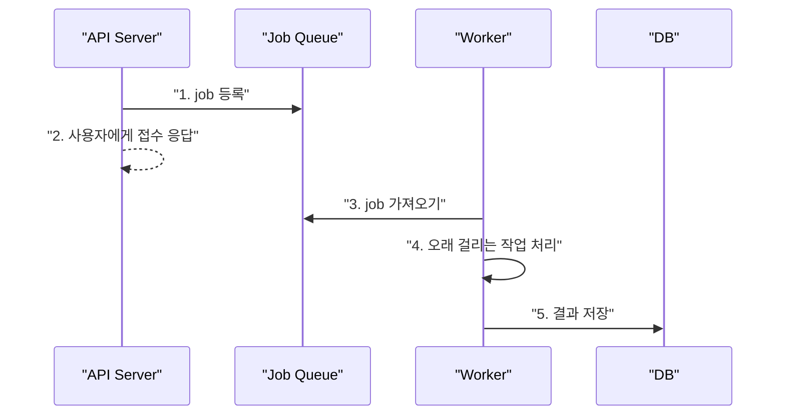

초보자가 가져갈 핵심:

```text
Job Queue = 오래 걸리는 작업을 백그라운드로 넘기는 구조
```

---

# Part 8. Data Layer

## 25. PostgreSQL

PostgreSQL은 대표적인 관계형 데이터베이스다.

저장하는 것:

```text
users
posts
comments
tags
sessions
AI 답변
RAG knowledge metadata
```

장점:

```text
관계형 데이터 모델링에 강함
transaction 지원
index 지원
JSON 컬럼 지원
pgvector 확장으로 vector search 가능
```

초보자가 가져갈 핵심:

```text
PostgreSQL = 서비스의 핵심 데이터를 안정적으로 저장하는 관계형 DB
```

## 26. SQL CRUD

CRUD는 Create, Read, Update, Delete다.

SQL 기준:

```sql
INSERT -- Create
SELECT -- Read
UPDATE -- Update
DELETE -- Delete
```

게시글 예:

```text
글 작성 = Create
글 목록/상세 조회 = Read
글 수정 = Update
글 삭제 = Delete
```

초보자가 가져갈 핵심:

```text
CRUD = 대부분의 서비스 기능을 이루는 기본 데이터 조작
```

## 27. Join

Join은 여러 테이블의 데이터를 관계를 기준으로 합쳐서 조회하는 것이다.

예:

```text
posts.author_id -> users.id
```

게시글과 작성자 이름을 같이 보여주려면 join이 필요하다.

```sql
SELECT posts.title, users.display_name
FROM posts
JOIN users ON posts.author_id = users.id;
```

Join 종류:

```text
INNER JOIN = 양쪽에 매칭되는 데이터만
LEFT JOIN = 왼쪽 데이터는 모두, 오른쪽은 있으면 붙임
```

초보자가 가져갈 핵심:

```text
Join = 테이블을 나눠 저장한 데이터를 다시 연결해서 읽는 방법
```

## 28. Primary Key / Foreign Key / Index

### Primary Key

테이블에서 row를 유일하게 식별하는 값이다.

예:

```text
users.id
posts.id
comments.id
```

### Foreign Key

다른 테이블의 primary key를 참조하는 값이다.

예:

```text
posts.author_id -> users.id
comments.post_id -> posts.id
```

### Index

검색을 빠르게 하기 위한 자료구조다.

예:

```text
posts.created_at index
tags.name index
sessions.token_hash index
```

주의:

```text
index는 조회를 빠르게 하지만 쓰기 비용과 저장 공간을 늘린다.
모든 컬럼에 index를 거는 것은 좋은 전략이 아니다.
```

초보자가 가져갈 핵심:

```text
PK = row의 신분증
FK = 테이블 간 연결
Index = 빨리 찾기 위한 목차
```

## 29. Data Modeling

Data modeling은 서비스에서 다루는 개념을 DB 구조로 바꾸는 작업이다.

예:

```text
사용자
게시글
댓글
태그
AI 답변
병원 후보
```

질문:

```text
무엇을 별도 테이블로 둘 것인가?
무엇을 JSON으로 저장할 것인가?
1:N 관계인가?
N:M 관계인가?
삭제 시 같이 지워야 하는가?
```

초보자가 가져갈 핵심:

```text
Data modeling = 서비스 개념을 테이블과 관계로 바꾸는 설계
```

## 30. ERD

ERD는 Entity Relationship Diagram이다.

테이블과 관계를 그림으로 표현한다.

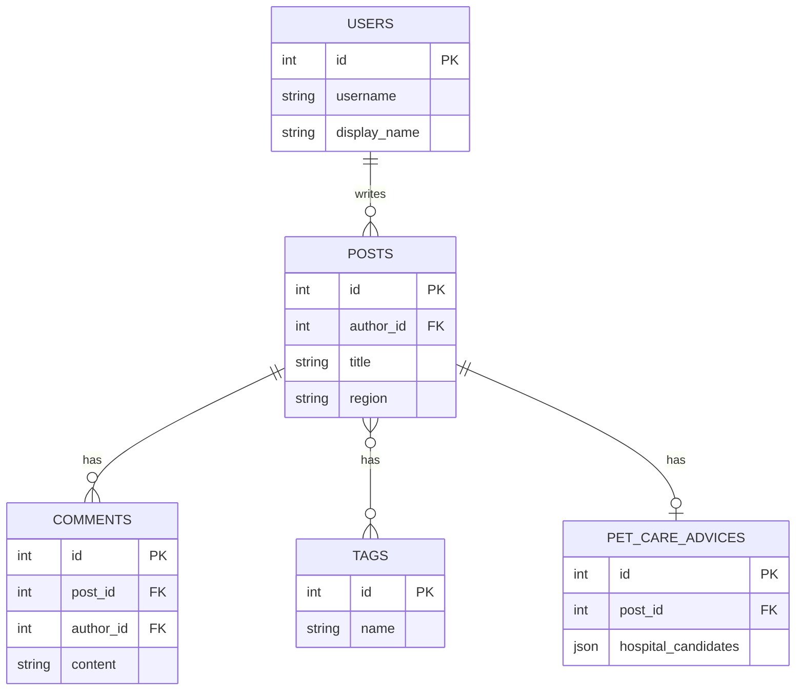

관계:

```text
1:1 = 사용자와 프로필
1:N = 게시글 하나에 댓글 여러 개
N:M = 게시글 여러 개와 태그 여러 개
```

초보자가 가져갈 핵심:

```text
ERD = 데이터 모델을 팀원이 같은 그림으로 이해하게 해주는 도구
```

## 31. Normalization

Normalization은 중복을 줄이고 데이터 무결성을 높이기 위해 테이블을 나누는 것이다.

나쁜 예:

```text
posts 테이블에 author_name, author_email을 매번 저장
```

좋은 예:

```text
users 테이블에 사용자 정보 저장
posts.author_id로 연결
```

장점:

```text
중복 감소
수정 오류 감소
관계 명확
```

단점:

```text
join이 필요해짐
조회 쿼리가 복잡해질 수 있음
```

초보자가 가져갈 핵심:

```text
Normalization = 중복을 줄이기 위해 데이터를 관계 있는 테이블로 나누는 것
```

## 32. Transaction

Transaction은 여러 DB 작업을 하나의 작업 단위로 묶는 것이다.

예:

```text
게시글 저장
태그 연결 저장
AI 답변 상태 저장
```

이 중 하나라도 실패하면 전체를 되돌려야 할 수 있다.

Transaction의 핵심:

```text
모두 성공하거나
모두 실패해야 한다
```

예:

```py
try:
    create_post()
    create_tags()
    db.commit()
except:
    db.rollback()
```

초보자가 가져갈 핵심:

```text
Transaction = 데이터 변경 여러 개를 안전하게 한 묶음으로 처리하는 것
```

---

# Part 9. Caching

## 33. Redis

Redis는 메모리 기반 key-value 저장소다.

자주 쓰는 용도:

```text
캐싱
session store
rate limit
job queue backend
실시간 pub/sub
```

예:

```text
인기글 목록을 매번 DB에서 계산하지 않고 Redis에 60초 저장
```

장점:

```text
매우 빠름
TTL 설정 가능
카운터/큐/pubsub에 유용
```

단점:

```text
메모리 기반이라 영구 저장 DB와 용도가 다름
캐시 무효화 전략이 필요함
```

초보자가 가져갈 핵심:

```text
Redis = 자주 읽거나 빠르게 처리해야 하는 임시 데이터를 저장하는 빠른 저장소
```

---

# Part 10. Operations Basics

## 34. Logging

Logging은 서비스에서 일어난 일을 기록하는 것이다.

기록할 것:

```text
요청 시작/종료
에러 발생
외부 API 실패
AI 답변 생성 실패
DB 작업 실패
중요한 상태 변경
```

좋은 로그:

```text
어떤 요청에서
어떤 사용자가
무슨 작업을 하다가
왜 실패했는지
```

나쁜 로그:

```text
error happened
something failed
```

초보자가 가져갈 핵심:

```text
Logging = 배포 후 문제를 추적하기 위해 남기는 서비스의 기록
```

## 35. Testing

Testing은 코드가 기대대로 동작하는지 검증하는 것이다.

백엔드 테스트 예:

```text
로그인 없이 글 작성하면 401
작성자가 아닌 사용자가 삭제하면 403
AI 답변 생성 후 DB에 저장됨
```

프론트 테스트 예:

```text
질문 작성 버튼을 누르면 모달이 열림
API 실패 시 에러 메시지가 보임
AI 답변이 있으면 답변 카드가 보임
```

초보자가 가져갈 핵심:

```text
Testing = 코드가 내가 의도한 동작을 계속 유지하는지 확인하는 작업
```

## 36. Configuration

Configuration은 환경마다 달라지는 설정값을 코드와 분리하는 것이다.

예:

```text
DATABASE_URL
OPENAI_API_KEY
KAKAO_REST_API_KEY
SESSION_EXPIRE_HOURS
CORS_ORIGINS
```

왜 필요한가:

```text
로컬/테스트/배포 환경이 다르다.
API Key를 코드에 넣으면 보안 사고가 난다.
설정 변경 때문에 코드를 다시 수정하면 위험하다.
```

초보자가 가져갈 핵심:

```text
Configuration = 환경별 설정과 비밀값을 코드 밖에서 관리하는 것
```

---

# Part 11. Architecture

## 37. MVC

MVC는 Model, View, Controller로 책임을 나누는 구조다.

```text
Model = 데이터와 DB 구조
View = 사용자에게 보여주는 화면 또는 응답
Controller = 요청을 받아 Model과 View를 연결
```

백엔드 API에서는 View가 HTML이 아니라 JSON response에 가깝다.

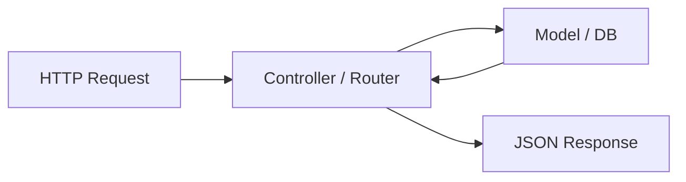

초보자가 가져갈 핵심:

```text
MVC = 요청 처리, 데이터, 화면/응답을 분리해서 코드가 섞이지 않게 하는 구조
```

## 38. Layered Architecture

Layered Architecture는 코드를 계층으로 나누는 구조다.

우리 백엔드에 더 가까운 설명이다.

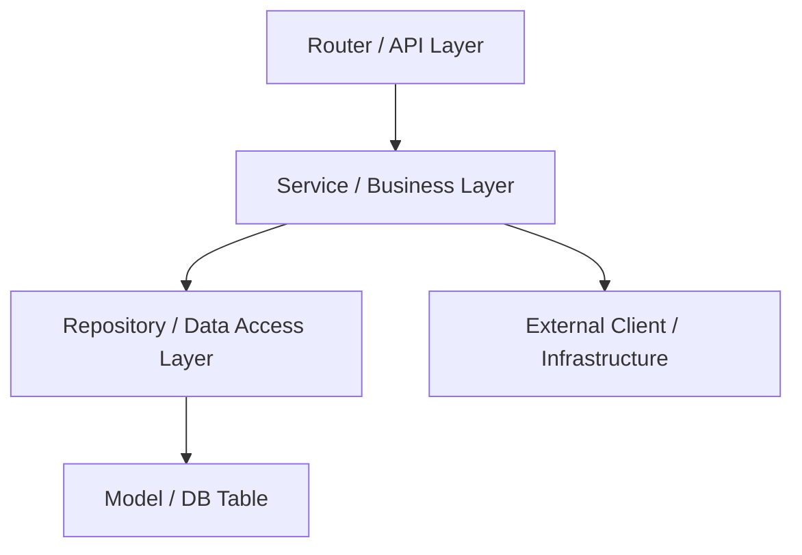

계층별 책임:

```text
Router = HTTP 요청/응답
Service = 비즈니스 규칙
Repository = DB query
Model = 테이블 구조
External Client = OpenAI, Kakao 같은 외부 API
```

좋은 의존 방향:

```text
Router -> Service -> Repository -> DB
Service -> External Client
```

피해야 할 것:

```text
Repository가 Router를 아는 것
Model에 비즈니스 로직이 과도하게 들어가는 것
Router에 DB query가 직접 들어가는 것
```

초보자가 가져갈 핵심:

```text
Layered Architecture = 요청 처리, 비즈니스 로직, DB 접근을 층으로 나누는 구조
```

---

# Part 12. Frontend

## 39. HTML / CSS / JavaScript / TypeScript

프론트 기본 4요소다.

```text
HTML = 문서 구조
CSS = 스타일
JavaScript = 동작
TypeScript = 타입이 있는 JavaScript
```

예:

```text
HTML: 버튼이 있다
CSS: 버튼이 노란색이다
JavaScript: 버튼을 누르면 모달이 열린다
TypeScript: 버튼 handler의 입력 타입을 보장한다
```

초보자가 가져갈 핵심:

```text
HTML/CSS/JS/TS = 브라우저 화면을 구조, 스타일, 동작, 타입으로 나누는 기본 기술
```

## 40. React

React는 UI를 컴포넌트로 나누어 만드는 라이브러리다.

컴포넌트 예:

```tsx
function PostCard({ post }) {
  return <article>{post.title}</article>;
}
```

React의 핵심:

```text
state가 바뀌면 화면이 다시 그려진다.
UI를 작은 컴포넌트로 나눈다.
props로 부모가 자식에게 데이터를 준다.
event handler로 사용자 행동을 처리한다.
```

초보자가 가져갈 핵심:

```text
React = state에 따라 화면을 자동으로 다시 그려주는 컴포넌트 기반 UI 도구
```

## 41. CSR

CSR은 Client-Side Rendering이다.

브라우저가 JavaScript를 받아서 화면을 그린다.

흐름:

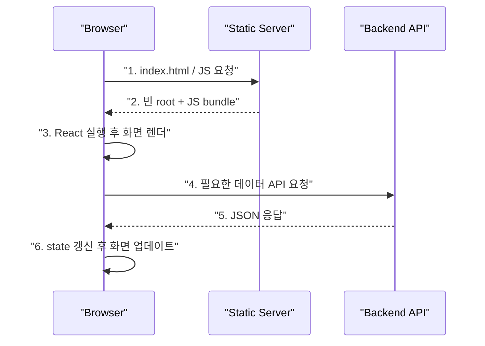

장점:

```text
구현이 단순하다.
프론트/백엔드 분리가 명확하다.
앱처럼 동작하는 화면에 좋다.
```

단점:

```text
첫 로딩에서 빈 화면이 보일 수 있다.
SEO가 중요한 사이트에는 불리할 수 있다.
```

초보자가 가져갈 핵심:

```text
CSR = 브라우저에서 React가 화면을 그리는 방식
```

## 42. SSR

SSR은 Server-Side Rendering이다.

서버가 HTML을 먼저 만들어 브라우저에 보낸다.

흐름:

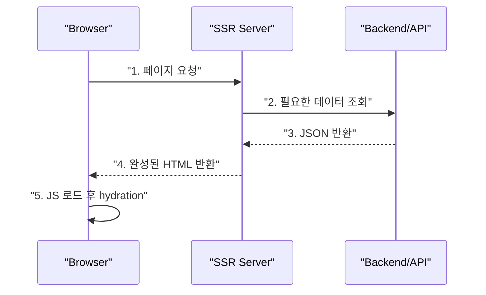

장점:

```text
첫 화면 표시가 빠를 수 있다.
SEO에 유리하다.
공유 링크 미리보기에 좋다.
```

단점:

```text
서버 구조가 복잡해진다.
배포/캐싱/상태 관리 고려가 늘어난다.
```

초보자가 가져갈 핵심:

```text
SSR = 서버가 먼저 HTML을 만들어 보내고 브라우저가 이어받는 렌더링 방식
```

## 43. Component Design

Component design은 UI를 어떤 단위로 나눌지 정하는 것이다.

나쁜 예:

```text
PostDetail.tsx 하나가 상세, AI 답변, 병원 후보, 댓글, 수정 폼을 모두 담당
```

더 나은 예:

```text
PostDetail
├── PostBodySection
├── AiAnswerSection
├── HospitalCandidatesSection
├── SourceListSection
└── CommentsSection
```

좋은 컴포넌트 기준:

```text
이름만 봐도 역할이 보인다.
props가 너무 많지 않다.
한 화면 책임만 가진다.
재사용 가능하거나 읽기 쉬운 단위다.
```

초보자가 가져갈 핵심:

```text
Component design = 화면을 읽기 쉽고 바꾸기 쉬운 조각으로 나누는 설계
```

## 44. State / Props

State는 컴포넌트가 기억하는 값이다.

```ts
const [selectedPost, setSelectedPost] = useState<Post | null>(null);
```

Props는 부모가 자식에게 넘겨주는 값이다.

```tsx
<PostDetail selectedPost={selectedPost} />
```

관계:

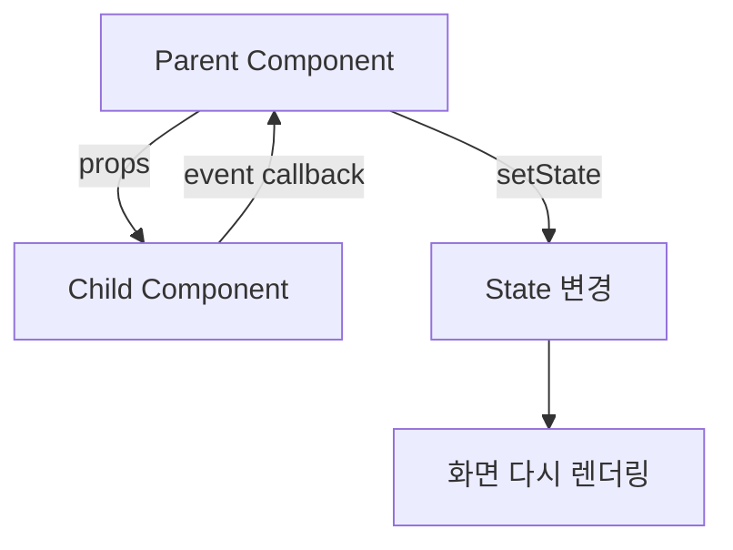

초보자가 가져갈 핵심:

```text
State = 컴포넌트가 가진 변하는 값
Props = 부모가 자식에게 넘기는 값과 함수
```

## 45. Event

Event는 사용자의 행동이다.

예:

```text
click
submit
change
keydown
scroll
```

React 예:

```tsx
<button onClick={onGenerateAdvice}>
  AI 답변 생성
</button>
```

의미:

```text
버튼을 클릭하면 onGenerateAdvice 함수가 실행된다.
```

초보자가 가져갈 핵심:

```text
Event = 사용자의 행동을 코드의 함수와 연결하는 것
```

## 46. Lifecycle

Lifecycle은 컴포넌트가 생기고, 업데이트되고, 사라지는 흐름이다.

React 함수형 컴포넌트에서는 `useEffect`로 많이 다룬다.

예:

```ts
useEffect(() => {
  loadPosts();
}, []);
```

의미:

```text
컴포넌트가 처음 렌더링될 때 게시글 목록을 불러온다.
```

초보자가 가져갈 핵심:

```text
Lifecycle = 컴포넌트가 화면에 나타나고 바뀌고 사라지는 시점에 실행되는 흐름
```

## 47. Routing

Routing은 URL에 따라 어떤 화면을 보여줄지 정하는 것이다.

예:

```text
/              홈
/posts/1       게시글 상세
/login         로그인
/my-questions  내 질문
```

React에서는 React Router 같은 도구를 많이 쓴다.

현재 프로젝트는 큰 라우터보다 state로 화면을 전환하는 구조에 가깝다.

초보자가 가져갈 핵심:

```text
Routing = URL과 화면을 연결하는 규칙
```

## 48. State Management

State management는 여러 컴포넌트가 공유하는 상태를 어디에서 관리할지 정하는 것이다.

작은 앱:

```text
useState
props 전달
custom hook
```

커지는 앱:

```text
Zustand
Redux Toolkit
React Query
Context
```

상태 종류:

```text
client state = 모달 열림, 선택된 탭, 입력 폼
server state = API에서 가져온 게시글 목록, 사용자 정보, AI 답변
```

초보자가 가져갈 핵심:

```text
State management = 화면 곳곳에서 쓰는 변하는 값을 어디에 둘지 정하는 것
```

## 49. Frontend Testing

프론트 테스트는 화면이 의도대로 동작하는지 확인한다.

종류:

```text
Unit test = 작은 함수 테스트
Component test = 컴포넌트 렌더링 테스트
Integration test = API mock과 사용자 행동 테스트
E2E test = 실제 브라우저에서 전체 흐름 테스트
```

예:

```text
AI 답변이 있으면 AI 답변 카드가 보인다.
로그인하지 않으면 댓글 작성 폼 대신 로그인 안내가 보인다.
질문 작성 후 목록에 새 글이 보인다.
```

초보자가 가져갈 핵심:

```text
Frontend testing = 사용자 화면과 상호작용이 깨지지 않았는지 확인하는 테스트
```

## 50. UI Framework

UI framework는 버튼, 모달, 폼, 레이아웃 같은 UI 구성 요소를 빠르게 만들 수 있게 해주는 도구다.

예:

```text
Tailwind CSS
MUI
shadcn/ui
Bootstrap
```

장점:

```text
빠르게 일정한 UI를 만들 수 있다.
접근성/상태 스타일이 어느 정도 준비되어 있다.
팀 스타일을 통일하기 쉽다.
```

단점:

```text
도구의 사용법을 배워야 한다.
무분별하게 쓰면 앱이 도구 스타일에 끌려간다.
커스텀 디자인과 충돌할 수 있다.
```

초보자가 가져갈 핵심:

```text
UI framework = 반복되는 화면 요소를 빠르게 만들기 위한 UI 도구 모음
```

---

# 51. 핵심 흐름별로 다시 묶어보기

## 51.1 게시글 작성 흐름

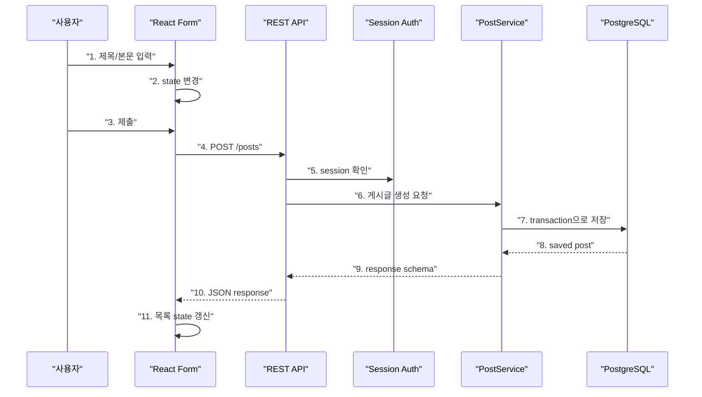

이 흐름에서 등장하는 개념:

```text
React
state/props
event
REST
Session
API design
PostgreSQL
CRUD
transaction
error handling
```

## 51.2 로그인 흐름

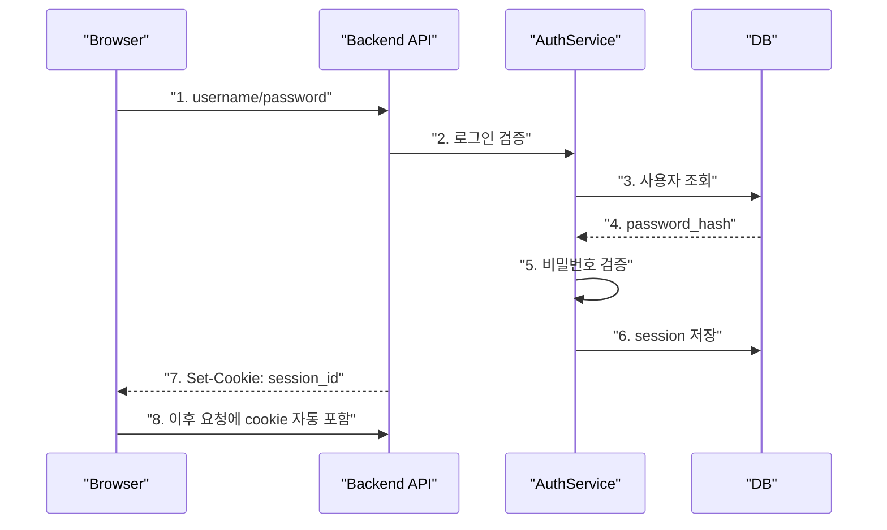

이 흐름에서 등장하는 개념:

```text
Session
cookie
CSRF
CORS
HTTPS
error handling
configuration
```

## 51.3 AI 답변 생성 흐름

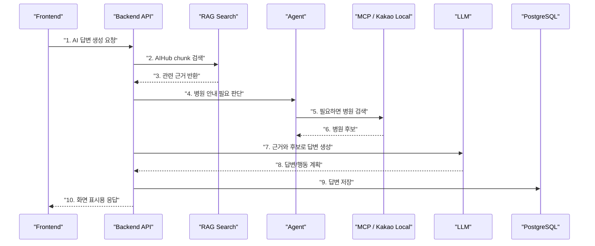

이 흐름에서 등장하는 개념:

```text
API design
RDBMS
external API
error handling
configuration
logging
testing
```

---

# 52. 팀 프로젝트 시작 전 체크리스트

5주 프로젝트 시작 전에 팀이 최소한 합의해야 하는 것:

```text
1. 서비스의 핵심 사용자와 MVP 범위
2. API endpoint 초안
3. request/response/error 형식
4. DB 테이블과 ERD
5. 인증 방식: Session/JWT/OAuth2 중 무엇을 쓸지
6. 프론트 폴더 구조와 상태 관리 방식
7. 백엔드 계층 구조
8. 외부 API/AI 기능 실패 처리
9. 환경변수와 비밀키 관리
10. 테스트 최소 범위
```

이 체크리스트를 먼저 맞추면 AI로 코드를 생성하더라도 팀 코드가 덜 무너진다.

## 53. 마지막 요약

빨간색 항목들은 전부 외울 목록이 아니다.

이 항목들은 풀스택 팀 프로젝트에서 회의가 막히지 않기 위한 공통 언어다.

가장 중요한 연결은 다음이다.

```text
Frontend 개념
-> 사용자가 화면에서 무엇을 하는가

API 개념
-> 프론트와 백엔드가 어떤 약속으로 대화하는가

Authentication/Security
-> 누가 무엇을 할 수 있고 어떻게 보호하는가

Data Layer
-> 어떤 데이터가 어떻게 저장되고 연결되는가

Architecture
-> 코드를 어디에 두고 책임을 어떻게 나누는가

Testing/Logging/Configuration
-> 만든 기능을 어떻게 안전하게 운영하고 고치는가
```

이 문서를 읽은 뒤에는 각 개념을 깊게 외우는 것보다, 하나의 사용자 흐름에 어떤 개념들이 함께 등장하는지 설명하는 연습을 하는 것이 더 중요하다.
