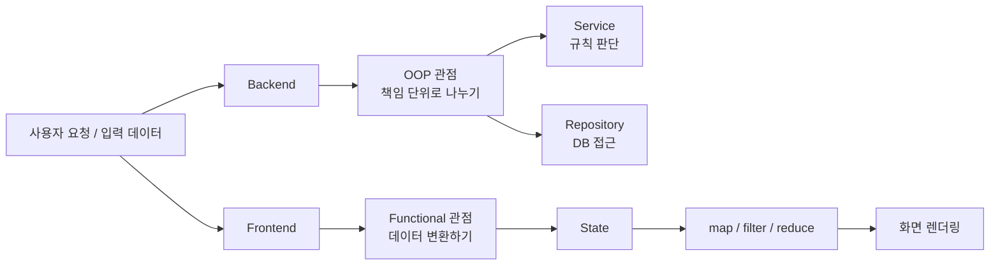
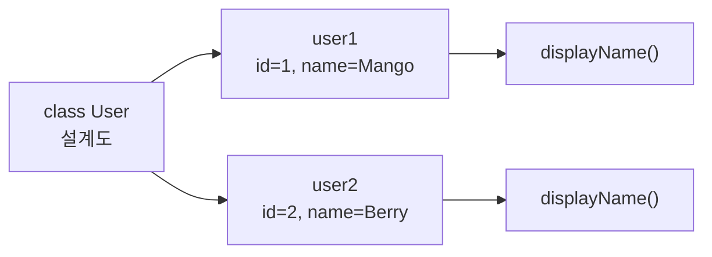
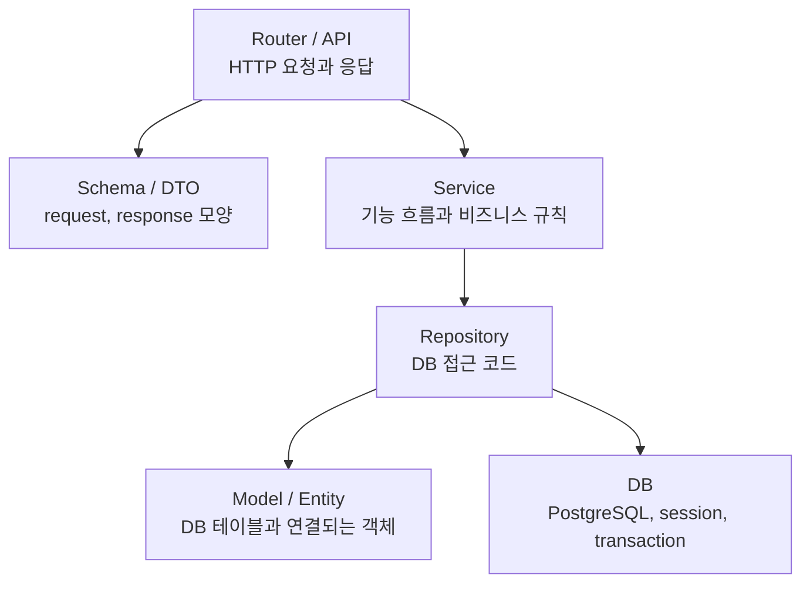
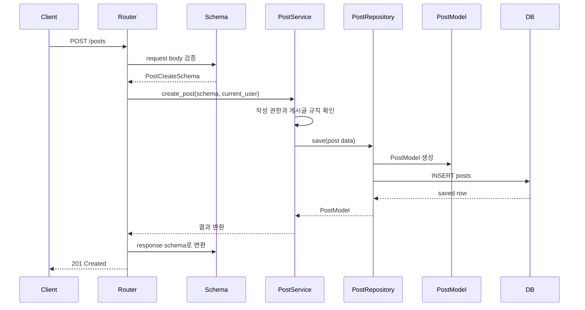
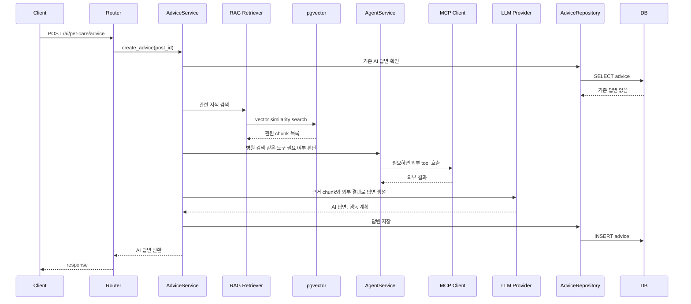
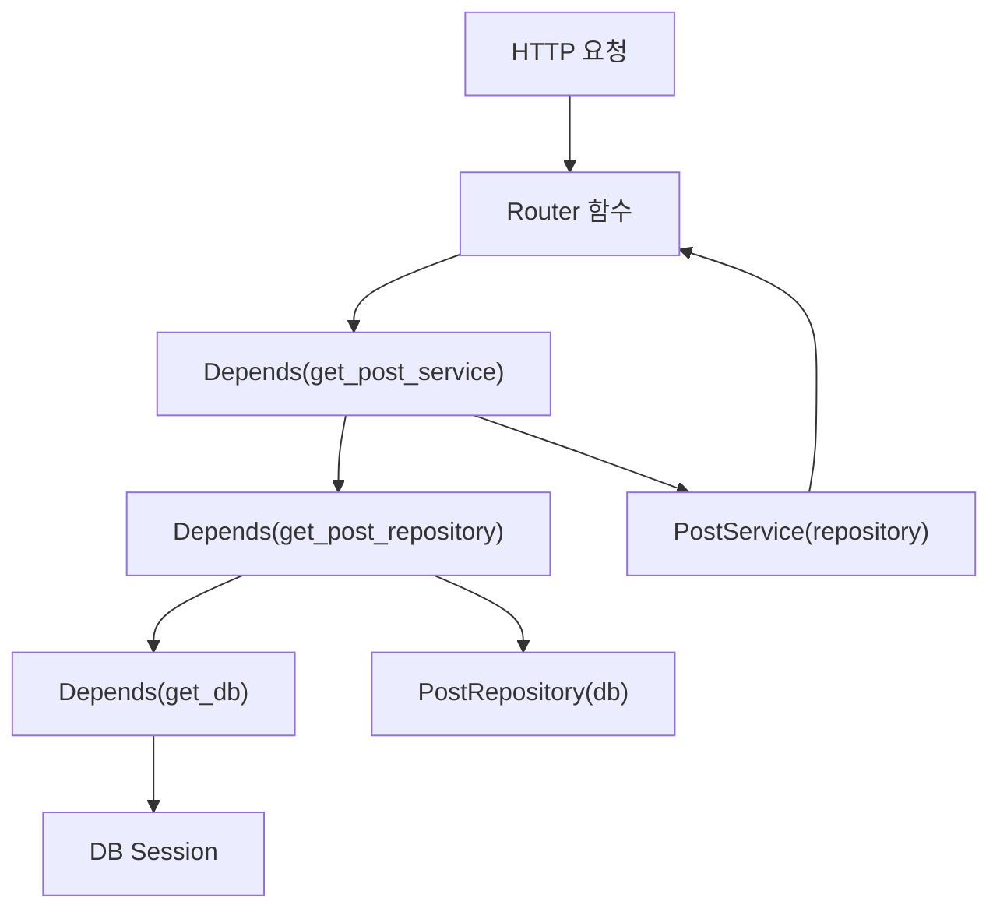
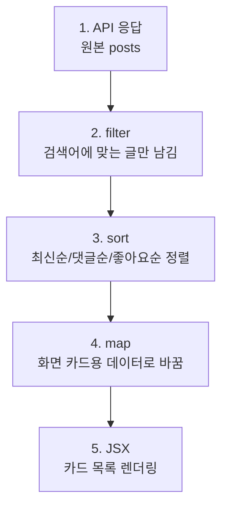
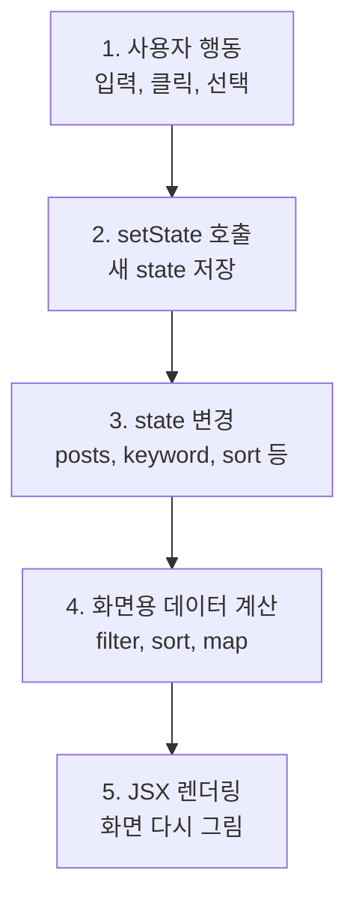
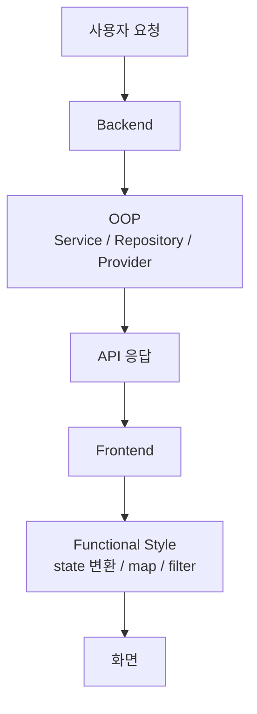

# OOP and Functional Programming Guide

## 1. 이 문서의 목적

이 문서는 OOP와 Functional Programming을 초보자 기준으로 비교해서 이해하기 위한 문서다.

로드맵에서 두 개념이 따로 보이지만, 실제 풀스택 프로젝트에서는 보통 이렇게 만난다.

```text
Backend
-> OOP 성향이 강하다.
-> service, repository, provider, manager 같은 책임 단위로 코드를 나눈다.

Frontend
-> Functional Programming 성향이 강하다.
-> state, props, 배열 데이터를 map/filter로 변환해서 화면을 만든다.
```

중요한 것은 “백엔드는 무조건 OOP, 프론트는 무조건 함수형”이라는 뜻이 아니다.

실제 코드는 둘을 섞어서 쓴다. 다만 처음 코드를 읽을 때는 아래 관점으로 보면 훨씬 덜 막힌다.

```text
백엔드 코드를 읽을 때:
이 클래스/서비스가 무슨 책임을 가지는가?

프론트 코드를 읽을 때:
이 state가 어떤 함수들을 거쳐 어떤 화면으로 바뀌는가?
```

---

## 2. 한 장으로 보는 차이



같은 게시글 기능을 봐도 관심사가 다르다.

```text
백엔드 관심사
- 게시글 작성 권한이 있는가?
- 제목과 본문 길이는 유효한가?
- 어떤 테이블에 저장할 것인가?
- 트랜잭션이 필요한가?
- 에러 응답은 어떻게 줄 것인가?

프론트 관심사
- 입력값을 어떤 state에 담을 것인가?
- 제출 중 loading 상태를 어떻게 보여줄 것인가?
- API 성공 후 목록 state를 어떻게 바꿀 것인가?
- 게시글 배열을 어떻게 카드 목록으로 렌더링할 것인가?
```

그래서 백엔드에서는 “책임 분리”가 중요하고, 프론트에서는 “상태와 데이터 변환”이 중요하다.

---

## 3. OOP

OOP는 Object-Oriented Programming, 객체지향 프로그래밍이다.

초보자에게는 이렇게 이해하는 것이 가장 좋다.

```text
OOP = 관련 있는 데이터와 기능을 하나의 책임 단위로 묶는 방식
```

처음부터 상속, 다형성, 추상화 같은 단어를 외우려고 하면 잘 와닿지 않는다. 프로젝트 코드에서는 먼저 “이 코드가 무슨 책임을 가지는가?”를 보는 게 더 중요하다.

### 3.1 게시글 기능으로 보는 OOP

게시글에는 데이터가 있다.

```text
id
title
content
author_id
created_at
```

게시글과 관련된 행동도 있다.

```text
게시글 생성
게시글 수정
게시글 삭제
작성자인지 확인
댓글 개수 계산
좋아요 처리
```

이걸 아무 파일에나 흩뿌려두면 나중에 코드가 커졌을 때 찾기가 어렵다.

```text
게시글 생성 정책은 어디 있지?
작성자만 수정 가능하다는 규칙은 어디 있지?
DB 저장 코드는 어디 있지?
```

OOP는 이런 책임을 의미 있는 단위로 묶어서 코드 위치를 예측 가능하게 만든다.

### 3.2 클래스와 객체

`class`는 설계도이고, `object` 또는 `instance`는 그 설계도로 만든 실제 값이다.

```text
class User = 사용자 설계도
user1 = 실제 사용자 한 명
user2 = 또 다른 실제 사용자 한 명
```

예:

```ts
class User {
  id: number;
  name: string;

  constructor(id: number, name: string) {
    this.id = id;
    this.name = name;
  }

  displayName() {
    return this.name;
  }
}

const user = new User(1, "Mango");
```

여기서 `User`는 단순히 `id`, `name`만 담는 것이 아니라 `displayName()`이라는 사용자 관련 행동도 가진다.



### 3.3 백엔드에서 OOP가 많이 보이는 이유

백엔드는 요청 하나를 처리할 때 여러 책임이 섞인다.

예를 들어 “게시글 작성” 요청을 보면:

```text
HTTP 요청 받기
로그인 여부 확인
입력값 검증
게시글 작성 규칙 확인
DB 저장
AI 답변 생성 요청
응답 반환
에러 처리
```

이걸 한 함수에 전부 넣으면 코드는 빨리 만들 수 있지만, 금방 읽기 어려워진다.

그래서 백엔드에서는 보통 책임을 여러 계층으로 나눈다.

처음에는 `Router`, `Service`, `Repository` 정도만 보여도 충분해 보인다. 그런데 실제 프로젝트를 보면 `DB`, `Model`, `Schema`, `Provider`, `Client` 같은 이름이 더 나온다.

이 이름들은 보통 아래 역할을 가진다.

```text
Router / API
- HTTP 요청을 받는다.
- URL, method, status code, response를 다룬다.
- "POST /posts 요청이 들어오면 어떤 service를 부를지"를 결정한다.

Schema / DTO
- request body와 response body의 데이터 모양을 정의한다.
- 사용자가 보낸 값이 유효한지 검증한다.
- API 밖으로 내보낼 데이터 모양을 정한다.

Service
- 실제 기능 흐름과 비즈니스 규칙을 담당한다.
- "작성자만 수정 가능하다", "AI 답변은 이미 있으면 재생성하지 않는다" 같은 규칙을 둔다.
- 여러 repository, provider, client를 조합한다.

Repository
- DB 조회/저장/수정/삭제를 담당한다.
- SQLAlchemy나 SQL 쿼리를 service 밖으로 숨긴다.
- service가 DB 세부 구현을 몰라도 되게 한다.

Model / Entity
- DB 테이블과 가장 가까운 코드다.
- ORM을 쓴다면 DB row 하나가 어떤 객체로 표현되는지 정의한다.
- posts, users, comments 같은 테이블 구조와 연결된다.

DB
- 실제 데이터베이스 연결, session, transaction을 담당한다.
- PostgreSQL과 연결하고 commit/rollback을 처리한다.

Provider / Client
- 외부 시스템 호출을 담당한다.
- OpenAI, Kakao API, MCP JSON-RPC, 외부 검색 API 같은 것을 감싼다.
```

가장 헷갈리기 쉬운 것은 `Model`과 `Schema`다.

둘은 모두 “데이터 모양”을 다루지만 목적이 다르다.

```text
Schema
- API 요청/응답용 데이터 모양
- 예: 게시글 작성 request, 게시글 목록 response
- 사용자가 보거나 보내는 데이터에 가깝다.

Model
- DB 테이블용 데이터 모양
- 예: posts 테이블 row, users 테이블 row
- DB에 저장되는 데이터에 가깝다.
```

예를 들어 게시글 작성 request에는 `title`, `content`, `tags`만 있을 수 있다.

하지만 DB model에는 더 많은 필드가 있을 수 있다.

```text
PostCreateSchema
- title
- content
- tags

PostModel
- id
- title
- content
- author_id
- like_count
- created_at
- updated_at
```

즉, `Schema`는 API의 약속이고, `Model`은 DB의 약속이다.

그리고 `DB`는 model 자체가 아니라, model을 실제 PostgreSQL에 저장하고 가져오는 연결 계층에 가깝다.



게시글 작성 흐름을 조금 더 실무식으로 보면 아래와 같다.



각 계층의 책임은 다르다.

```text
Router
- URL과 HTTP method를 받는다.
- request body를 service에 넘긴다.
- response를 반환한다.

Schema
- request/response 데이터 모양을 정의한다.
- 필수값, 타입, 길이 같은 API 입출력 검증을 담당한다.
- DB model을 그대로 외부에 노출하지 않게 막는다.

Service
- 비즈니스 규칙을 판단한다.
- 여러 repository나 외부 API 호출을 조합한다.
- 기능의 중심 흐름을 가진다.

Repository
- DB 접근을 담당한다.
- SQLAlchemy/SQL 쿼리를 숨긴다.
- 조회, 생성, 수정, 삭제를 수행한다.

Model
- DB 테이블 구조와 연결된다.
- ORM이 DB row를 객체로 다룰 수 있게 한다.
- 보통 API response 모양과 1:1로 같지 않다.

DB
- database session과 transaction을 담당한다.
- commit/rollback이 일어나는 곳과 가깝다.
```

초보자가 백엔드 코드를 읽을 때는 이 질문부터 던지면 된다.

```text
이 함수는 HTTP 처리를 하는가?
이 함수는 비즈니스 규칙을 판단하는가?
이 함수는 DB에 접근하는가?
이 클래스는 API 데이터 모양인가, DB 테이블 모양인가?
```

이 질문에 따라 router, service, repository 중 어디를 봐야 하는지 감이 잡힌다.

AI 기능이 들어가면 계층이 조금 더 늘어난다.

일반 CRUD는 보통 DB 안에서 끝난다.

```text
Router
-> Service
-> Repository
-> DB
```

하지만 AI 기능은 외부 모델, vector DB, embedding, RAG, MCP 같은 요소가 들어온다.

그래서 service가 모든 것을 직접 처리하면 금방 너무 커진다.

AI 기능이 있는 백엔드는 보통 아래처럼 나눈다.

```text
AdviceService
- AI 답변 생성이라는 기능 흐름을 담당한다.
- 이미 생성된 답변이 있는지 확인한다.
- RAG 검색, LLM 호출, 결과 저장을 조합한다.

Retriever / RAG Service
- 사용자 질문과 관련 있는 지식 chunk를 검색한다.
- pgvector, LangChain, embedding 검색을 감싼다.

Embedding Provider
- 텍스트를 embedding vector로 바꾼다.
- OpenAI embedding API나 mock embedding을 감싼다.

LLM Provider
- 검색된 근거를 바탕으로 답변을 생성한다.
- OpenAI chat model 호출을 감싼다.

Agent Service
- 어떤 도구를 쓸지 판단한다.
- 예: 병원 검색이 필요한지 판단하고 MCP tool 호출을 결정한다.

MCP Client / Tool Client
- JSON-RPC나 외부 API 호출을 담당한다.
- Kakao Local API, 공공 API 같은 외부 기능을 감싼다.

Advice Repository
- 생성된 AI 답변을 DB에 저장하고 조회한다.
```

AI 기능 흐름은 이렇게 볼 수 있다.



여기서 중요한 점은 AI 기능도 결국 OOP의 책임 분리 원칙을 따른다는 것이다.

```text
Service가 모든 것을 직접 하지 않는다.
검색은 Retriever가 맡는다.
LLM 호출은 Provider가 맡는다.
외부 tool 호출은 MCP Client가 맡는다.
저장은 Repository가 맡는다.
```

이렇게 나누면 AI provider를 OpenAI에서 다른 모델로 바꾸거나, vector DB 검색 방식을 바꾸거나, MCP tool을 추가해도 전체 코드가 덜 흔들린다.

### 3.4 캡슐화

캡슐화는 내부 구현을 밖에서 함부로 건드리지 못하게 숨기는 것이다.

쉽게 말하면:

```text
밖에서는 필요한 기능만 호출한다.
안에서 정확히 어떻게 처리하는지는 그 객체가 책임진다.
```

예:

```ts
class SessionManager {
  createSession(userId: number) {
    // session_id 생성
    // session_id hash 저장
    // 만료 시간 설정
    // cookie 값 반환
  }
}
```

다른 코드는 `createSession()`만 호출하면 된다.

session id를 어떻게 만들고, hash를 어떻게 저장하고, 만료 시간을 어떻게 계산하는지는 `SessionManager`가 책임진다.

이렇게 하면 장점이 있다.

```text
세션 구현 방식이 바뀌어도 호출하는 쪽 코드는 덜 흔들린다.
중요한 보안 로직이 여러 파일에 흩어지지 않는다.
테스트할 단위가 명확해진다.
```

### 3.5 상속보다 조합을 먼저 이해하기

OOP를 배우면 상속을 많이 본다.

```text
Animal
└── Dog
```

상속은 기존 클래스의 성질을 물려받는 것이다.

하지만 실무 서비스 코드에서는 상속보다 조합이 더 자주 안전하다.

조합은 필요한 객체를 가져다 쓰는 방식이다.

```ts
class PostService {
  constructor(private postRepository: PostRepository) {}
}
```

`PostService`가 `PostRepository`를 상속받는 것이 아니다.

`PostService`가 자기 일을 하기 위해 `PostRepository`를 가져다 쓰는 것이다.

이렇게 하면 역할이 섞이지 않는다.

```text
PostService = 게시글 규칙 담당
PostRepository = 게시글 DB 접근 담당
```

초보자는 상속을 깊게 파기 전에, 먼저 “책임을 나누고 필요한 객체를 가져다 쓴다”는 감각을 잡는 것이 좋다.

여기서 자주 같이 나오는 개념이 의존성 주입이다.

결론부터 말하면:

```text
조합과 의존성 주입은 같은 말은 아니다.

조합
= 어떤 객체가 다른 객체를 사용해서 자기 일을 하는 구조

의존성 주입
= 그 사용할 객체를 내부에서 직접 만들지 않고, 바깥에서 넣어주는 방식
```

즉, 의존성 주입은 조합을 구현하는 대표적인 방법 중 하나다.

조합만 있는 코드는 이렇게 생길 수 있다.

```ts
class PostService {
  private postRepository = new PostRepository();
}
```

이 코드도 `PostService`가 `PostRepository`를 사용하므로 조합이다.

하지만 `PostService`가 내부에서 직접 `new PostRepository()`를 만들어버린다. 그러면 나중에 테스트할 때 가짜 repository로 바꾸기 어렵고, DB session 같은 요청별 자원을 넣기도 애매하다.

의존성 주입을 쓰면 이렇게 바뀐다.

```ts
class PostService {
  constructor(private postRepository: PostRepository) {}
}
```

이제 `PostService`는 `PostRepository`를 직접 만들지 않는다.

바깥에서 만들어서 넣어준다.

```text
PostService
-> PostRepository가 필요하다는 사실만 안다.
-> PostRepository를 어떻게 만드는지는 모른다.
```

이 차이가 중요하다.

```text
직접 생성
- PostService 안에서 new PostRepository()
- 결합도가 높다.
- 테스트에서 바꾸기 어렵다.

의존성 주입
- PostService 밖에서 PostRepository를 만들어 넣어줌
- 결합도가 낮다.
- 테스트에서 mock/fake로 바꾸기 쉽다.
```

FastAPI에서는 이 의존성 주입을 `Depends`로 자주 한다.

예를 들면:

```py
def get_post_repository(
    db: Session = Depends(get_db),
) -> PostRepository:
    return PostRepository(db)


def get_post_service(
    post_repository: PostRepository = Depends(get_post_repository),
) -> PostService:
    return PostService(post_repository)


@router.post("/posts")
def create_post(
    payload: PostCreate,
    post_service: PostService = Depends(get_post_service),
):
    return post_service.create_post(payload)
```

이 흐름을 풀면 아래와 같다.



FastAPI가 해주는 일은 “이 router 함수가 실행되려면 어떤 객체들이 필요한지 보고, 순서대로 만들어서 넣어주는 것”이다.

이 방식이 좋은 이유:

```text
router가 service 생성 방법을 자세히 몰라도 된다.
service가 repository 생성 방법을 몰라도 된다.
repository가 DB session을 외부에서 받기 때문에 요청 단위 transaction 관리가 쉬워진다.
테스트에서 get_post_service나 get_post_repository를 가짜 구현으로 교체할 수 있다.
```

AI 기능이 있을 때도 같은 원리가 적용된다.

예를 들어 `PetCareAdviceService`가 아래 객체들을 필요로 할 수 있다.

```text
KnowledgeRetriever
LLMProvider
PetCareAgentService
PetCareAdviceRepository
```

`PetCareAdviceService`가 이 객체들을 내부에서 전부 직접 만들면 코드가 강하게 묶인다.

대신 의존성 주입으로 받으면 바꾸기 쉽다.

```text
실제 앱
- OpenAIEmbeddingProvider
- OpenAIChatProvider
- KakaoMCPClient

테스트
- MockEmbeddingProvider
- FakeLLMProvider
- FakeMCPClient
```

즉, AI 기능에서 의존성 주입은 더 중요해진다.

외부 API, LLM, embedding, MCP는 실패할 수 있고 비용도 든다. 테스트할 때 매번 실제 OpenAI나 Kakao API를 호출하면 느리고 불안정하다. 그래서 service는 “필요한 역할”에만 의존하고, 실제 구현은 바깥에서 주입받는 구조가 좋다.

정리하면:

```text
조합
- 객체가 다른 객체를 사용해서 기능을 완성하는 구조

의존성 주입
- 그 다른 객체를 내부에서 만들지 않고 외부에서 넣어주는 방식

FastAPI Depends
- 의존성 주입을 프레임워크가 도와주는 장치
```

### 3.6 OOP 코드를 읽는 체크리스트

```text
이 클래스는 무슨 책임을 가지는가?
이 함수는 이 클래스 안에 있는 게 자연스러운가?
이 파일은 API schema인가, DB model인가?
HTTP request/response 처리가 service나 repository까지 내려가 있지는 않은가?
DB 접근 코드가 router나 service에 너무 많이 섞여 있지는 않은가?
외부 API나 LLM 호출 코드가 service 안에 직접 박혀 있지는 않은가?
FastAPI Depends로 주입받는 객체가 무엇이고, 왜 필요한가?
하나의 클래스가 너무 많은 일을 하고 있지는 않은가?
테스트할 때 이 클래스를 독립적으로 확인할 수 있는가?
```

OOP의 핵심:

```text
OOP = 코드를 책임 단위로 나누고, 각 단위가 자기 일만 하게 만드는 사고방식
```

---

## 4. Functional Programming

Functional Programming은 함수형 프로그래밍이다.

초보자에게는 이렇게 이해하면 충분하다.

```text
Functional Programming = 데이터를 직접 망가뜨리지 않고, 작은 함수들을 연결해서 새 결과를 만드는 방식
```

OOP가 “누가 이 책임을 가질 것인가?”에 집중한다면, 함수형 프로그래밍은 “이 데이터를 어떤 순서로 바꿀 것인가?”에 집중한다.

### 4.1 가장 기본 그림

함수형 프로그래밍은 입력을 받아서 출력을 만든다.


예:

```ts
function getTitle(post: Post): string {
  return post.title;
}
```

이 함수는 `post`를 받아서 `title`을 반환한다.

가능하면 함수가 바깥 세상을 몰래 바꾸지 않는 것이 좋다.

### 4.2 순수 함수

순수 함수는 같은 입력을 넣으면 항상 같은 출력을 주는 함수다.

```ts
function add(a: number, b: number): number {
  return a + b;
}
```

`add(1, 2)`는 언제 호출해도 `3`이다.

반대로 아래 함수는 순수 함수가 아니다.

```ts
let count = 0;

function increase() {
  count += 1;
  return count;
}
```

이 함수는 호출할 때마다 결과가 달라진다. 함수 바깥에 있는 `count`를 바꾸기 때문이다.

순수 함수가 좋은 이유:

```text
입력과 출력만 보면 이해할 수 있다.
테스트하기 쉽다.
예상하지 못한 부작용이 줄어든다.
React 화면 렌더링 흐름과 잘 맞는다.
```

### 4.3 불변성

불변성은 원본 데이터를 직접 바꾸지 않는다는 뜻이다.

나쁜 예:

```ts
posts.push(newPost);
setPosts(posts);
```

이 코드는 기존 `posts` 배열 자체를 바꾼다.

React에서는 이런 식으로 원본을 직접 바꾸면 화면 갱신이 꼬일 수 있다.

좋은 예:

```ts
setPosts([...posts, newPost]);
```

이 코드는 기존 배열은 그대로 두고, 새 게시글이 추가된 새 배열을 만든다.

초보자는 이것만 먼저 기억해도 좋다.

```text
React state는 직접 수정하지 말고 새 값으로 교체한다.
```

### 4.4 프론트에서 함수형 스타일이 많이 보이는 이유

프론트엔드는 “데이터를 화면으로 바꾸는 일”을 계속 한다.

백엔드가 보내준 데이터는 보통 화면에 그대로 쓰기에는 너무 원본에 가깝다.

예를 들어 서버가 게시글 목록을 이렇게 준다고 해보자.

```text
[
  {
    id: 1,
    title: "강아지가 기침해요",
    content: "어제부터 계속 켁켁거립니다...",
    author_id: 3,
    author_name: "보호자A",
    comment_count: 2,
    like_count: 5,
    created_at: "2026-06-17T10:00:00"
  },
  ...
]
```

하지만 화면 카드에는 이 데이터를 전부 보여주지 않을 수 있다.

카드에 필요한 것은 대략 이런 것들이다.

```text
제목
본문 미리보기 80자
작성자 이름
댓글 수
좋아요 수
작성일
```

게다가 사용자가 검색어를 입력하면 일부 게시글만 보여줘야 한다.

정렬을 바꾸면 순서도 바뀌어야 한다.

즉, 프론트에서는 이런 일이 계속 일어난다.

```text
서버에서 받은 원본 게시글 목록
-> 검색어에 맞는 글만 남김
-> 정렬 기준에 맞게 순서 변경
-> 카드 UI에 필요한 모양으로 바꿈
-> 화면에 그림
```

이 흐름이 함수형 스타일과 잘 맞는다.

왜냐하면 함수형 스타일은 “원본 데이터를 작은 단계로 바꿔서 새 결과를 만드는 방식”이기 때문이다.



코드로 보면:

```ts
const visiblePosts = posts
  .filter((post) => post.title.includes(keyword))
  .map((post) => ({
    id: post.id,
    title: post.title,
    preview: post.content.slice(0, 80),
  }));
```

이 코드는 다음 순서로 읽으면 된다.

```text
1. posts 전체 목록이 있다.
2. keyword가 포함된 글만 남긴다.
3. 화면에 필요한 id, title, preview만 뽑는다.
4. visiblePosts를 렌더링에 사용한다.
```

여기서 중요한 점은 `posts` 원본을 직접 고치지 않는다는 것이다.

`visiblePosts`라는 “화면에 보여줄 새 목록”을 따로 만든다.

이게 프론트에서 함수형 스타일이 자주 보이는 가장 큰 이유다.

```text
서버 데이터는 원본으로 두고,
화면에 필요한 데이터는 map/filter/sort로 새로 만든다.
```

### 4.5 map, filter, reduce

프론트엔드에서 함수형 스타일을 가장 자주 보는 곳은 배열 처리다.

왜 배열이 자주 나오냐면, 화면에는 목록이 많기 때문이다.

```text
게시글 목록
댓글 목록
태그 목록
병원 후보 목록
참고 근거 목록
검색 결과 목록
```

이 목록을 화면에 맞게 다루려면 `map`, `filter`, `reduce` 같은 배열 함수가 자주 나온다.

초보자는 처음에 이렇게 잡으면 된다.

```text
map = 모양 바꾸기
filter = 일부만 남기기
reduce = 하나로 합치기
```

`map`은 각 항목을 다른 모양으로 바꾼다.

```ts
const titles = posts.map((post) => post.title);
```

위 코드는 게시글 객체 목록에서 제목만 뽑는다.

```text
[게시글1, 게시글2, 게시글3]
-> map
-> [제목1, 제목2, 제목3]
```

조금 더 실제 화면에 가까운 예시는 이렇다.

```ts
const postCards = posts.map((post) => ({
  id: post.id,
  title: post.title,
  preview: post.content.slice(0, 80),
  meta: `${post.commentCount}개의 댓글`,
}));
```

이 코드는 “서버 게시글 데이터”를 “화면 카드 데이터”로 바꾼다.

`filter`는 조건에 맞는 항목만 남긴다.

```ts
const myPosts = posts.filter((post) => post.authorId === currentUser.id);
```

위 코드는 전체 게시글 중 내가 쓴 글만 남긴다.

```text
전체 게시글
-> 내가 쓴 글만 통과
-> 내 게시글 목록
```

검색도 `filter`로 볼 수 있다.

```ts
const searchedPosts = posts.filter((post) =>
  post.title.includes(keyword) || post.content.includes(keyword)
);
```

이 코드는 제목이나 본문에 검색어가 들어간 글만 남긴다.

`reduce`는 여러 값을 하나의 결과로 합친다.

```ts
const totalLikes = posts.reduce((sum, post) => sum + post.likeCount, 0);
```

```text
게시글 좋아요 수 여러 개
-> 전부 더함
-> 전체 좋아요 수 하나
```

`reduce`는 처음에는 어렵게 느껴질 수 있다.

실무 초반에는 `map`, `filter`를 먼저 익히면 된다.

`reduce`는 일단 이렇게만 기억해도 충분하다.

```text
reduce = 목록 전체를 돌면서 최종 결과 하나를 만드는 도구
```

예를 들면:

```text
좋아요 총합
댓글 총합
태그별 게시글 개수
카테고리별 데이터 묶기
```

처음 코드를 읽을 때는 이렇게 보면 된다.

```text
map을 보면:
목록의 각 항목이 어떤 모양으로 바뀌는지 본다.

filter를 보면:
어떤 조건을 통과한 항목만 남는지 본다.

reduce를 보면:
여러 항목을 모아서 최종적으로 무엇 하나를 만들려는지 본다.
```

### 4.6 React state와 연결하기

React 화면은 state가 바뀌면 다시 그려진다.

여기서 state는 “화면이 기억하고 있는 값”이라고 보면 된다.

예를 들어 게시판 화면에는 이런 state가 있을 수 있다.

```text
posts = 게시글 목록
keyword = 검색어
sort = 정렬 기준
selectedPost = 지금 열어본 게시글
isLoading = 로딩 중인지 여부
error = 에러 메시지
```

사용자가 화면에서 뭔가를 하면 state가 바뀐다.

```text
검색어 입력
-> keyword state 변경
-> posts를 keyword 기준으로 filter
-> 화면에 보이는 게시글 목록 변경

정렬 선택
-> sort state 변경
-> posts를 sort 기준으로 정렬
-> 화면 순서 변경

게시글 클릭
-> selectedPost state 변경
-> 상세 모달 열림
```

그래서 React 코드에서는 아래 흐름이 자주 나온다.



예:

```ts
function addPost(newPost: Post) {
  setPosts((prevPosts) => [newPost, ...prevPosts]);
}
```

이 코드는 기존 `prevPosts`를 직접 바꾸지 않는다.

새 게시글과 기존 게시글을 합친 새 배열을 만들어서 state를 교체한다.

왜 이렇게 하냐면 React는 state가 새 값으로 바뀌었다고 판단해야 화면을 다시 그리기 때문이다.

나쁜 예:

```ts
function addPost(newPost: Post) {
  posts.push(newPost);
  setPosts(posts);
}
```

이 코드는 기존 배열 자체를 바꾼다.

React 입장에서는 “이전 posts와 새 posts가 같은 배열인데?”처럼 보일 수 있다.

그래서 화면 갱신이 예상과 다르게 동작할 수 있다.

좋은 예:

```ts
function addPost(newPost: Post) {
  setPosts((prevPosts) => [newPost, ...prevPosts]);
}
```

이 코드는 새 배열을 만든다.

React가 “state가 새 값으로 바뀌었구나”라고 판단하기 쉽다.

프론트 코드를 읽을 때는 아래 흐름을 따라가면 된다.

```text
1. 어떤 state가 있는가?
2. 사용자가 어떤 이벤트를 발생시키는가?
3. 이벤트 핸들러가 어떤 새 state를 만드는가?
4. 그 state가 어떤 map/filter를 거치는가?
5. 최종적으로 어떤 JSX로 화면에 그려지는가?
```

조금 더 실제적으로는 이렇게 추적하면 된다.

```text
1. 화면에서 바뀌는 값 이름을 찾는다.
   예: keyword, selectedPost, posts

2. 그 값을 바꾸는 함수를 찾는다.
   예: setKeyword, setSelectedPost, setPosts

3. 그 값으로 계산되는 화면용 데이터를 찾는다.
   예: visiblePosts, postCards, filteredComments

4. 그 데이터가 JSX 어디에서 쓰이는지 찾는다.
   예: visiblePosts.map(...)
```

즉, 프론트 코드는 처음부터 위에서 아래로 다 읽으려고 하기보다, state 하나를 잡고 따라가는 게 좋다.

```text
state 하나 선택
-> setState 찾기
-> map/filter 찾기
-> JSX에서 어디에 그려지는지 보기
```

### 4.7 함수형 코드를 읽는 체크리스트

```text
이 함수의 입력은 무엇인가?
이 함수의 출력은 무엇인가?
원본 데이터를 직접 바꾸고 있지는 않은가?
map/filter/reduce가 어떤 순서로 연결되어 있는가?
state 변경이 새 값을 만드는 방식으로 되어 있는가?
API 응답 데이터와 화면 렌더링 데이터가 어떻게 달라지는가?
```

함수형 프로그래밍의 핵심:

```text
Functional Programming = 원본 데이터를 직접 바꾸지 않고, 작은 함수들로 새 데이터를 만들어 화면과 로직을 예측 가능하게 만드는 방식
```

---

## 5. 둘을 같이 보는 방법

OOP와 함수형 프로그래밍은 반대말이 아니다.

실제 풀스택 프로젝트에서는 둘을 같이 쓴다.



백엔드에서는 OOP식으로 책임을 나눈다.

```text
PostService
PetCareAdviceService
PetCareAgentService
Repository
Provider
```

프론트에서는 함수형 스타일로 데이터를 변환한다.

```text
posts.filter(...)
posts.map(...)
setPosts([...posts, newPost])
```

가장 단순하게 정리하면:

```text
OOP
-> 코드를 역할별로 어디에 둘지 정하는 데 강하다.
-> 백엔드 service/repository 구조를 이해하는 데 중요하다.

Functional Programming
-> 데이터를 어떤 순서로 바꿔서 화면에 보여줄지 이해하는 데 강하다.
-> React state, props, 렌더링 흐름을 이해하는 데 중요하다.
```

---

## 6. 20분 학습 루트

시간이 적을 때는 아래 순서로 보면 된다.

```text
1. OOP에서 "책임"이라는 단어를 이해한다.
2. router/service/repository가 각각 무엇을 책임지는지 본다.
3. 함수형에서 "원본을 바꾸지 않고 새 값을 만든다"는 말을 이해한다.
4. map/filter가 배열을 어떻게 바꾸는지 본다.
5. React state가 새 값으로 교체되며 화면이 다시 그려지는 흐름을 본다.
```

최종 목표는 아래 두 문장을 설명할 수 있는 것이다.

```text
백엔드 코드는 책임 단위로 나눠서 읽는다.
프론트 코드는 state가 어떻게 변환되어 화면이 되는지 따라가며 읽는다.
```
