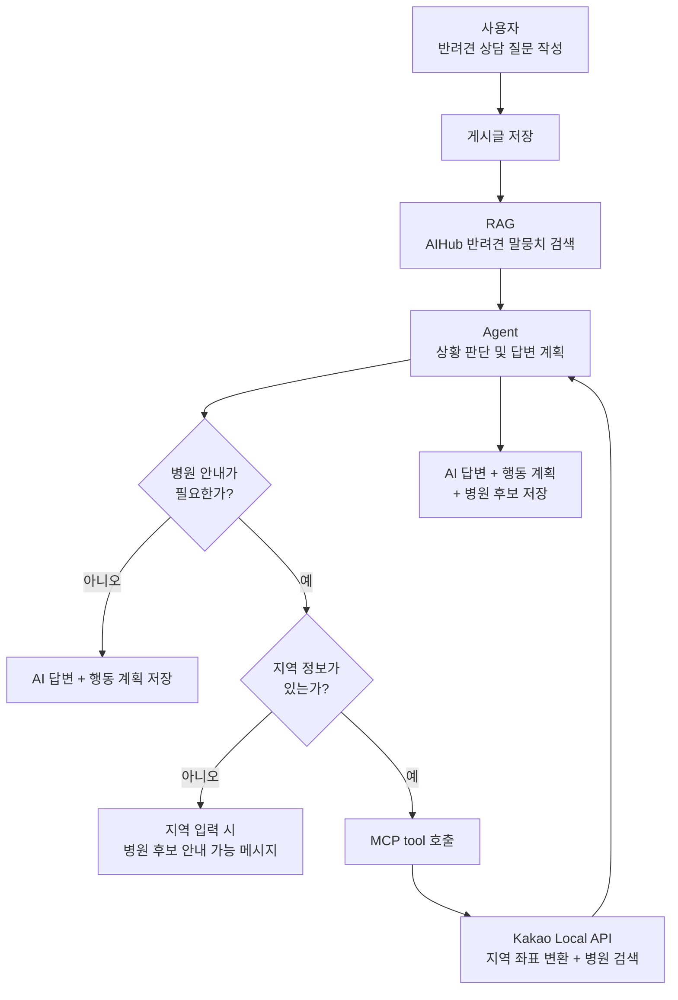
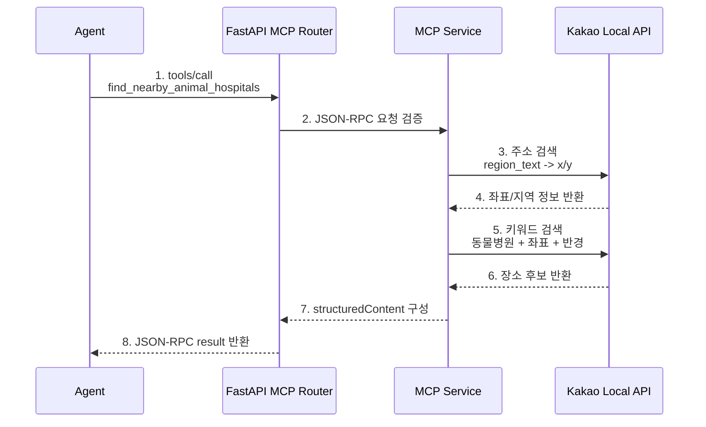

# Pet Care MCP Decision Record

## 목적

이번 단계의 목표는 기존 개발 지식 참고자료 MCP를 제거하고, **AI 반려견 케어 상담 보드**에 맞는 MCP 기능을 새로 정의하는 것이다.

MCP는 단순 검색 기능이 아니라, Agent가 필요할 때 호출하는 외부 도구 계층으로 둔다. RAG가 AIHub 반려견 말뭉치에서 증상/질병/관리 근거를 찾는 역할이라면, MCP는 외부 지역/장소 API를 통해 보호자에게 실제 행동으로 이어지는 정보를 가져오는 역할을 맡는다.

## 최종 결정

| 항목 | 결정 |
| --- | --- |
| MCP 도메인 | 반려견 병원 안내용 지역/장소 조회 |
| 외부 API | Kakao Local API 우선 |
| CSV 파일 | 사용하지 않음. fallback으로도 사용하지 않음 |
| 기존 개발 지식 참고자료 MCP | 제거 대상 |
| Agent 연동 방식 | Agent가 병원 안내 필요성을 판단한 경우에만 MCP 호출 |
| 사용자 지역 입력 | 선택 입력으로 둠 |
| 병원 표시 방식 | API 응답의 장소명, 주소, 전화번호, 거리, Kakao place URL 사용 |
| 저장 정책 | MCP 결과는 AI 답변 생성 시 함께 저장할 수 있게 설계하되, 1차 구현에서는 Agent 답변 저장 구조와 함께 확정 |

## 왜 CSV를 쓰지 않는가

전국 동물병원 CSV는 데이터가 많고 정상 영업 병원도 5천 건 이상 있지만, MCP의 핵심 목적과는 조금 다르다.

CSV를 단순 조회하면 다음 문제가 생긴다.

- 외부 기능 호출이라기보다 로컬 DB 검색처럼 보인다.
- RAG와 역할 차이가 흐려진다.
- 같은 구 병원을 문자열 매칭으로 반환하면 추천 품질이 낮다.
- 거리순 정렬을 하려면 좌표계 변환이 필요해 구현 범위가 커진다.
- 최신 영업 정보나 장소 상세 페이지 연결이 약하다.

따라서 CSV는 fallback으로도 사용하지 않는다. 병원 후보는 외부 장소 API에서 바로 가져온다.

## 왜 Kakao Local API인가

Kakao Local API는 이번 MCP 요구에 필요한 두 흐름을 모두 제공한다.

1. 지역/주소를 좌표로 변환
   - 예: `서울 마포구` -> 경도/위도
   - 사용 API: 주소 검색 API

2. 좌표와 반경 기준으로 장소 검색
   - 예: 좌표 주변 `동물병원` 검색
   - 사용 API: 키워드 장소 검색 API

공식 문서 기준으로 Kakao Local API는 REST API 키 인증을 사용하고, 키워드 장소 검색은 중심 좌표, 반경, 정렬, 페이징을 지원한다. 응답에는 장소명, 주소, 전화번호, 좌표, Kakao 장소 상세 URL이 포함된다.

## RAG, MCP, Agent 역할 분리



## MCP Tool 설계

### Tool 1. `geocode_region`

지역 문자열을 좌표와 정규화된 주소 정보로 바꾼다.

입력:

```json
{
  "region_text": "서울 마포구"
}
```

출력:

```json
{
  "region_text": "서울 마포구",
  "normalized_address": "서울 마포구",
  "x": "126.901...",
  "y": "37.566...",
  "region_1depth_name": "서울",
  "region_2depth_name": "마포구"
}
```

### Tool 2. `find_nearby_animal_hospitals`

지역 또는 좌표 기준으로 주변 동물병원을 찾는다.

입력:

```json
{
  "region_text": "서울 마포구",
  "radius_meters": 5000,
  "limit": 5
}
```

출력:

```json
{
  "items": [
    {
      "name": "OO동물병원",
      "address": "서울 마포구 ...",
      "road_address": "서울 마포구 ...",
      "phone": "02-...",
      "distance_meters": 730,
      "place_url": "https://place.map.kakao.com/...",
      "source": "kakao_local"
    }
  ]
}
```

## JSON-RPC 흐름



1. Agent가 병원 안내가 필요하다고 판단하면 MCP tool을 호출한다.
   - 코드 위치 예정: `backend/app/services/agent_service.py`

2. FastAPI MCP Router가 JSON-RPC 요청을 받는다.
   - 기존 코드 위치: `backend/app/api/v1/mcp.py`

3. MCP Service는 tool 이름과 arguments를 검증한다.
   - 기존 코드 위치: `backend/app/services/mcp_service.py`

4. `region_text`가 있으면 Kakao 주소 검색으로 좌표를 구한다.
   - 코드: `backend/app/services/kakao_local_service.py`

5. 좌표 기준으로 `동물병원` 키워드 검색을 호출한다.
   - 코드: `backend/app/services/mcp_service.py`

6. Kakao Local API가 장소 후보를 반환한다.
   - 필요한 필드: `place_name`, `road_address_name`, `address_name`, `phone`, `distance`, `place_url`, `x`, `y`

7. MCP Service는 Agent가 바로 사용할 수 있는 구조화 결과로 변환한다.
   - `structuredContent.items`에 병원 후보를 담는다.

8. Agent는 RAG 근거와 MCP 결과를 합쳐 최종 답변을 만든다.
   - 최종 저장 위치는 기존 AI 답변 저장 구조를 확장한다.

## 사용자 입력 정책

지역 입력은 필수가 아니다.

질문 작성 UI에는 선택 필드로 둔다.

```text
병원 안내가 필요할 때 사용할 지역 (선택)
예: 서울 마포구
```

이유:

- 모든 질문에 병원 추천이 필요한 것은 아니다.
- 지역을 필수로 만들면 상담 질문 작성 흐름이 무거워진다.
- Agent가 병원 안내 필요성을 판단한 경우에만 지역 정보가 의미를 가진다.

지역이 없는데 Agent가 병원 안내가 필요하다고 판단하면 답변에 다음 메시지를 포함한다.

```text
지역을 입력하면 가까운 동물병원 후보를 함께 안내할 수 있습니다.
```

## 기존 외부 참고자료 MCP 제거 범위

다음 항목은 새 도메인과 맞지 않으므로 제거한다.

| 제거 대상 | 이유 |
| --- | --- |
| 기존 개발 지식 참고자료 tool | 개발 지식 게시판 시절 기능 |
| 기존 외부 개발 문서 provider | 반려견 케어 도메인과 맞지 않음 |
| 기존 외부 참고자료 schema/test/UI 문구 | 현재 서비스 흐름에서 혼란 유발 |
| 작성 중 외부 참고자료 카드 | Agent 병원 안내 흐름으로 대체 |

## 구현 순서

1. 기존 외부 참고자료 MCP 제거
   - service, schema, dependency, tests, frontend reference panel 정리

2. Kakao Local 설정 추가
   - `KAKAO_REST_API_KEY`
   - `KAKAO_LOCAL_API_BASE_URL`
   - timeout 설정

3. Kakao Local client 구현
   - 주소 검색
   - 키워드 장소 검색
   - 실패/timeout/error response 처리

4. MCP schema/tool 구현
   - `geocode_region`
   - `find_nearby_animal_hospitals`

5. MCP 테스트
   - JSON-RPC initialize
   - tools/list
   - geocode_region mock provider
   - find_nearby_animal_hospitals mock provider
   - API key 없음/외부 API 실패 처리

6. Agent 연동 준비
   - 병원 안내 필요성 판단은 Sprint Agent 단계에서 구현
   - MCP는 먼저 독립 tool로 완성

## 보안 및 권한 전략

- Kakao REST API Key는 `.env`에 둔다.
- 프론트로 API Key를 내려보내지 않는다.
- MCP 호출은 기존처럼 로그인 사용자만 가능하게 유지한다.
- Agent가 내부적으로 호출하는 경우에도 서버 내부에서만 Kakao API를 호출한다.
- 외부 API 실패 시 사용자의 상담 저장/조회 흐름은 실패시키지 않는다.

## 완료 기준

이 의사결정이 구현되면 다음을 만족해야 한다.

1. 기존 개발 지식 참고자료 MCP 흔적이 코드와 UI에서 사라진다.
2. MCP `tools/list`에 반려견 케어 도메인 tool만 노출된다.
3. JSON-RPC로 지역 좌표 변환 tool을 호출할 수 있다.
4. JSON-RPC로 지역 기반 동물병원 검색 tool을 호출할 수 있다.
5. 병원 후보에는 Kakao place URL이 포함된다.
6. CSV는 사용하지 않는다.
7. Agent 구현 단계에서 MCP tool을 그대로 호출할 수 있다.
