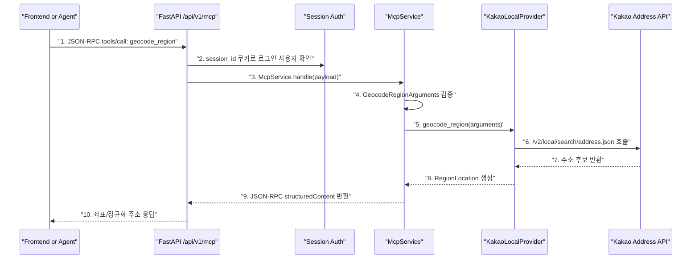
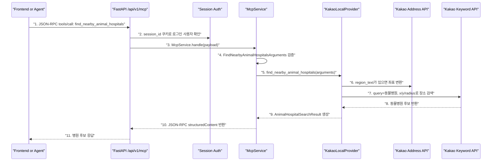
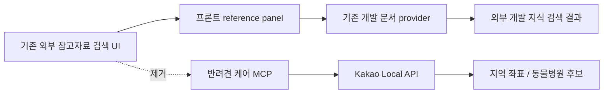

# Pet Care MCP Implementation Record

## 1. 구현 목표

이번 단계에서는 개발 지식 게시판 시절의 외부 참고자료 MCP를 제거하고, **AI 반려견 케어 상담 보드**에 맞는 MCP 기반을 다시 만들었다.

핵심 결정은 다음과 같다.

- MCP는 RAG처럼 내부 지식 chunk를 검색하는 기능이 아니다.
- MCP는 Agent가 필요할 때 외부 기능을 호출하기 위한 JSON-RPC tool 계층이다.
- 이번 구현의 외부 기능은 Kakao Local API 기반 지역 좌표 변환과 주변 동물병원 검색이다.
- CSV 병원 데이터는 사용하지 않는다. fallback으로도 쓰지 않는다.
- 프론트 작성 화면의 외부 참고자료 카드 흐름은 제거했다.

## 2. 최종 MCP 도구

| Tool | 역할 | 입력 | 출력 |
| --- | --- | --- | --- |
| `geocode_region` | 지역/주소 텍스트를 좌표로 변환 | `region_text` | 정규화 주소, 위도/경도 |
| `find_nearby_animal_hospitals` | 좌표 또는 지역 기준 주변 동물병원 검색 | `region_text` 또는 `x/y`, `radius_meters`, `limit` | 병원명, 주소, 전화번호, 거리, Kakao 장소 URL |

## 3. 지역 좌표 변환 흐름



### 3.1 번호별 코드 확인

1. `backend/app/schemas/mcp.py`
   - `JsonRpcRequest`
   - JSON-RPC 요청 형태를 받는다.

2. `backend/app/api/v1/mcp.py`
   - `call_mcp`
   - `get_session_user`를 통해 로그인 세션이 없으면 MCP 호출이 막힌다.

3. `backend/app/services/mcp_service.py`
   - `McpService.handle`
   - `initialize`, `tools/list`, `tools/call`을 JSON-RPC 방식으로 분기한다.

4. `backend/app/schemas/mcp.py`
   - `GeocodeRegionArguments`
   - `region_text`가 비어 있거나 너무 짧으면 `MCP_INVALID_TOOL_ARGUMENTS`로 실패한다.

5. `backend/app/services/mcp_service.py`
   - `McpService._call_geocode_region`
   - 검증된 인자를 provider에 넘긴다.

6. `backend/app/services/kakao_local_service.py`
   - `KakaoLocalProvider.geocode_region`
   - Kakao Local 주소 검색 API를 서버에서 호출한다. API Key는 프론트로 내려가지 않는다.

7. `backend/app/services/kakao_local_service.py`
   - `KakaoLocalProvider._to_location`
   - Kakao 응답의 주소, 경도, 위도, 지역명을 내부 schema로 변환한다.

8. `backend/app/schemas/mcp.py`
   - `RegionLocation`, `GeocodeRegionResult`
   - MCP tool의 구조화된 결과 타입이다.

9. `backend/app/services/mcp_service.py`
   - `McpService._result`
   - JSON-RPC 성공 응답을 만든다.

10. `backend/app/api/v1/mcp.py`
    - 클라이언트 또는 이후 Agent가 `structuredContent.location`을 사용한다.

## 4. 동물병원 검색 흐름



### 4.1 번호별 코드 확인

1. `backend/app/services/mcp_service.py`
   - `FIND_NEARBY_ANIMAL_HOSPITALS_TOOL`
   - tool 이름은 `find_nearby_animal_hospitals`다.

2. `backend/app/api/v1/mcp.py`
   - `call_mcp`
   - 현재 MCP endpoint는 로그인 사용자만 호출 가능하다.

3. `backend/app/services/mcp_service.py`
   - `McpService._call_tool`
   - tool 이름에 따라 병원 검색 함수로 dispatch한다.

4. `backend/app/schemas/mcp.py`
   - `FindNearbyAnimalHospitalsArguments`
   - `region_text` 또는 `x/y` 둘 중 하나가 반드시 필요하다.
   - `radius_meters`는 최대 `20000`, 기본값은 `5000`이다.
   - `limit`은 최대 `10`, 기본값은 `5`다.

5. `backend/app/services/mcp_service.py`
   - `McpService._call_find_nearby_animal_hospitals`
   - 검증된 인자를 location provider에 전달한다.

6. `backend/app/services/kakao_local_service.py`
   - `KakaoLocalProvider.find_nearby_animal_hospitals`
   - `region_text`가 있으면 먼저 `geocode_region`으로 좌표를 만든다.
   - 이미 `x/y`가 있으면 주소 검색 없이 바로 장소 검색으로 간다.

7. `backend/app/services/kakao_local_service.py`
   - `KakaoLocalProvider.find_nearby_animal_hospitals`
   - Kakao 키워드 검색 API에 `query=동물병원`, `x`, `y`, `radius`, `sort=distance`를 보낸다.

8. `backend/app/services/kakao_local_service.py`
   - `KakaoLocalProvider._to_hospital_item`
   - Kakao 응답에서 병원명, 주소, 도로명주소, 전화번호, 거리, place URL을 뽑는다.

9. `backend/app/schemas/mcp.py`
   - `AnimalHospitalItem`, `AnimalHospitalSearchResult`
   - UI/Agent가 쓰기 쉬운 구조화 결과다.

10. `backend/app/services/mcp_service.py`
    - `McpService._result`
    - JSON-RPC `structuredContent`에 병원 후보 목록을 담는다.

11. 이후 Sprint 8 Agent 구현에서 이 결과를 AI 답변의 병원 안내 섹션에 사용할 수 있다.

## 5. 제거된 흐름



제거/정리한 파일과 역할은 다음과 같다.

| 파일 | 변경 |
| --- | --- |
| `backend/app/services/external_reference_service.py` | 삭제 |
| `frontend/src/components/ExternalReferencesPanel.tsx` | 삭제 |
| `frontend/src/hooks/useExternalReferences.ts` | 삭제 |
| `frontend/src/types.ts` | 기존 외부 참고자료 타입 제거 |
| `frontend/src/utils/postFormatting.ts` | 기존 외부 참고자료 payload builder 제거 |
| `frontend/src/styles.css` | reference panel/card 스타일 제거 |

## 6. 설정

`.env`에 실제 호출용 Kakao REST API Key가 필요하다.

```text
KAKAO_REST_API_KEY=...
KAKAO_LOCAL_API_BASE_URL=https://dapi.kakao.com
KAKAO_LOCAL_TIMEOUT_SECONDS=5
```

주의할 점:

- Kakao Key는 서버에서만 사용한다.
- 프론트에 노출하지 않는다.
- Key가 없으면 실제 Kakao API 호출은 실패한다.
- 테스트는 fake provider를 사용하므로 실제 Key 없이도 통과한다.

## 7. 현재 단계의 한계

이번 구현은 MCP tool 기반 구현이다. 아직 다음은 붙지 않았다.

- 상담 질문 작성 시 지역 입력 UI
- Agent가 답변 생성 중 병원 안내 필요성을 판단하는 흐름
- AI 답변에 병원 후보를 함께 저장하는 흐름

즉, 지금은 **Agent가 사용할 수 있는 MCP 도구를 준비한 상태**다. 실제 사용자 화면에서 자연스럽게 병원 후보가 보이는 것은 Sprint 8 Agent 연동 단계에서 진행한다.

## 8. 검증 결과

```text
PYTHONPATH=. pytest backend/tests/test_mcp_flow.py
7 passed
```

```text
PYTHONPATH=. pytest backend/tests
42 passed
```

```text
npm run build
통과
```

## 9. 다음 단계

다음 단계는 Sprint 8 Agent 연동이다.

구현 방향은 다음 순서가 적절하다.

1. 사용자의 상담 질문에서 병원 안내가 필요한지 판단한다.
2. 지역 정보가 없으면 병원 검색을 건너뛰고 지역 입력 안내 문구를 답변에 포함한다.
3. 지역 정보가 있으면 Agent가 `find_nearby_animal_hospitals` MCP tool을 호출한다.
4. AIHub RAG 근거와 MCP 병원 후보를 함께 사용해 답변을 만든다.
5. 생성된 답변, 행동 계획, 참고 근거, 병원 후보를 저장한다.
