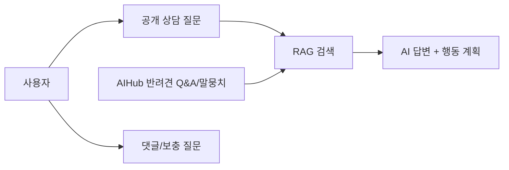
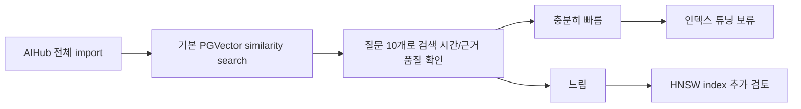

# Pet-care Pivot Decision Record

## 1. 결정 요약

기존 `AI 생활지원 매칭 보드`를 중단하고, 현재 서비스 방향을 **AI 반려견 케어 상담 보드**로 바꾼다.

## 2. 왜 이 방향인가

AIHub `반려견 성장 및 질병 관련 말뭉치 데이터`는 보호자 질문과 답변, 원천 말뭉치가 함께 들어 있어 RAG 지식베이스로 적합하다.

이 데이터는 게시글 카드로 보여줄 데이터가 아니라, 사용자의 질문에 답하기 위한 근거 데이터다. 따라서 게시판에는 사용자 상담 질문만 공개로 저장하고, AIHub 데이터는 별도 knowledge table에 저장한다.

## 3. 데이터 역할

| 데이터 | 역할 |
| --- | --- |
| 사용자 `Post` | 공개 상담 질문 |
| 사용자 `Comment` | 댓글, 추가 경험, 보충 질문 |
| AIHub Q&A 라벨링 데이터 | 질문과 답변을 하나의 RAG chunk로 저장 |
| AIHub 원천 말뭉치 | 긴 본문을 여러 chunk로 나눠 저장 |
| Validation 데이터 | 이번 MVP에서는 전체 corpus에 포함 |

## 4. 안전 기준

AI 답변은 수의학적 확정 진단이 아니다.

반드시 아래 기준을 지킨다.

1. 질병을 확정하지 않는다.
2. 약물 용량이나 처방을 지시하지 않는다.
3. 응급, 악화, 지속 증상은 수의사 상담을 권장한다.
4. 답변에는 참고 근거 chunk를 함께 보여준다.

## 5. 구현 기본값

| 항목 | 결정 |
| --- | --- |
| 질문 공개 범위 | 공개 |
| 질문 작성 권한 | 로그인 필요 |
| 댓글 작성 권한 | 로그인 필요 |
| AI 답변 생성 권한 | 로그인 필요 |
| AIHub 저장 위치 | `knowledge_documents`, `knowledge_chunks` |
| Embedding 모델 | `text-embedding-3-small` |
| Embedding 사용 | 실제 앱 OpenAI, 테스트 mock |
| AIHub import 범위 | Training/Validation, Q&A/원천 말뭉치 전체 |
| Chunk 전략 | Q&A는 1 chunk, 원천 말뭉치는 현재 `1800자/200자 overlap` 유지 |
| RAG 검색 필터 | 1차 baseline은 metadata filter 없이 전체 검색 |
| Vector index 튜닝 | 1차 baseline에서는 보류, 검색 시간이 느릴 때 HNSW 검토 |
| MCP | 이번 1차 피봇 범위 제외 |

## 6. Vector Index 결정

이번 import에서는 pgvector/LangChain PGVector collection에 벡터를 저장하고 기본 similarity search로 baseline을 먼저 확인한다.

HNSW나 IVFFlat 같은 명시적 vector index 튜닝은 바로 적용하지 않는다.

이 결정의 이유는 다음과 같다.

1. 현재 AIHub chunk 수는 약 2.4만 개라 MVP baseline에서는 인덱스 없이도 검색 시간이 충분할 가능성이 있다.
2. HNSW/IVFFlat은 답변 품질 개선보다 검색 속도와 확장성 개선에 가깝다.
3. 먼저 baseline 검색 시간을 측정해야 인덱스 도입 효과를 설명할 수 있다.
4. RAG 학습 우선순위는 `질문 -> embedding -> vector search -> source chunk -> AI 답변` 흐름 이해다.

따라서 다음 기준으로 후속 결정한다.

| 조건 | 후속 결정 |
| --- | --- |
| 검색 응답이 충분히 빠름 | 현재 구조 유지 |
| 검색 응답이 느림 | HNSW index 명시 생성 |
| 검색 결과 품질이 낮음 | index가 아니라 chunk 전략, metadata boost, reranking을 검토 |

## 7. 기존 생활지원 피봇 처리

`docs3/pivot-*` 문서는 과거 기록으로 남긴다. 다만 실행 코드와 README의 기본 방향은 pet-care pivot을 기준으로 한다.
