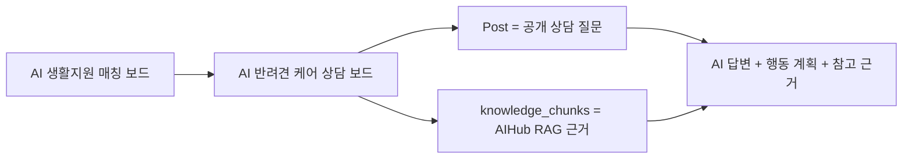
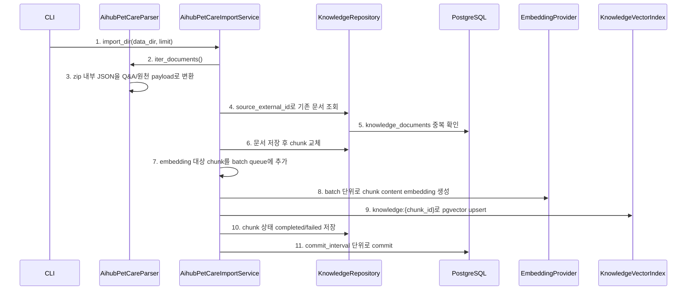
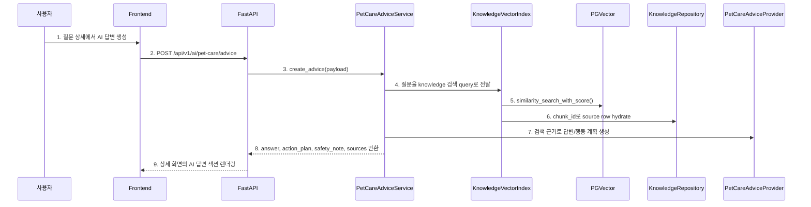
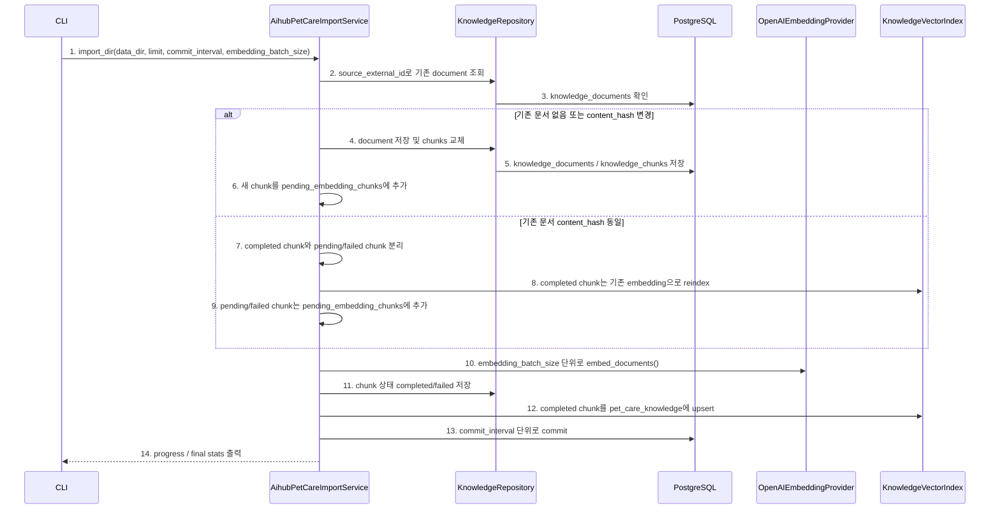

# Pet-care Pivot 구현 기록

## 1. 구현 요약

이번 구현은 `AI 생활지원 매칭 보드`를 **AI 반려견 케어 상담 보드**로 전환한 1차 피봇입니다.

핵심 변경은 세 가지입니다.

1. 공개 게시판의 의미를 `지원 카드`에서 `반려견 케어 상담 질문`으로 변경
2. AIHub 반려견 Q&A/원천 말뭉치를 별도 knowledge table에 저장
3. 질문 상세 화면에서 RAG 기반 `AI 답변`, `행동 계획`, `참고 근거`를 표시

AIHub 원본 데이터는 repo에 넣지 않습니다. 로컬 다운로드 경로에서 `import_aihub_pet_care` script로 읽어 DB와 pgvector collection에 적재합니다.

## 2. 도메인 변경



| 기존 의미 | 새 의미 |
| --- | --- |
| 지원 정보 목록 | 공개 상담 질문 목록 |
| 상담 등록 | 질문 작성 |
| 내 상담 기록 | 내 질문 |
| 공개 지원/시설 카드 RAG | AIHub 반려견 Q&A/말뭉치 RAG |
| 관련 지원 카드 요약 | AI 답변, 행동 계획, 참고 근거 |

## 3. AIHub Import 흐름



1. `import_dir(data_dir, limit)`
   - 코드: `backend/app/scripts/import_aihub_pet_care.py`
   - 함수: `main()`
   - 확인: CLI 인자 `--data-dir`, `--limit`, `--embedding-provider`를 받아 import service를 실행한다.

2. `iter_documents()`
   - 코드: `backend/app/services/aihub_pet_care_import_service.py`
   - 클래스/함수: `AihubPetCareParser.iter_documents()`
   - 확인: AIHub 데이터 디렉터리 아래의 모든 `.zip` 파일을 순회한다.

3. zip 내부 JSON을 Q&A/원천 payload로 변환
   - 코드: `backend/app/services/aihub_pet_care_import_service.py`
   - 함수: `AihubPetCareParser._parse_qa()`, `AihubPetCareParser._parse_corpus()`
   - 확인: 라벨링 Q&A는 질문+답변 하나의 chunk로, 원천 말뭉치는 긴 본문을 여러 chunk로 만든다.

4. source_external_id로 기존 문서 조회
   - 코드: `backend/app/repositories/knowledge_repository.py`
   - 함수: `KnowledgeRepository.get_document_by_external_id()`
   - 확인: zip 상대 경로와 entry 이름 기반 hash로 중복 import를 막는다.

5. knowledge_documents 중복 확인
   - 코드: `backend/app/models/knowledge.py`
   - 클래스: `KnowledgeDocument`
   - 확인: `source_external_id` unique constraint가 문서 단위 idempotency를 보장한다.

6. 문서 저장 후 chunk 교체
   - 코드: `backend/app/repositories/knowledge_repository.py`
   - 함수: `KnowledgeRepository.save_document()`, `KnowledgeRepository.replace_chunks()`
   - 확인: 문서 내용이 바뀌면 기존 chunk를 지우고 새 chunk로 교체한다.

7. embedding 대상 chunk를 batch queue에 추가
   - 코드: `backend/app/services/aihub_pet_care_import_service.py`
   - 함수: `AihubPetCareImportService.import_dir()`
   - 확인: chunk마다 바로 OpenAI API를 호출하지 않고 `pending_embedding_chunks`에 모은다.

8. batch 단위로 chunk content embedding 생성
   - 코드: `backend/app/services/aihub_pet_care_import_service.py`
   - 함수: `AihubPetCareImportService._sync_embedding_batch()`
   - 확인: 실제 앱은 OpenAI embedding, 테스트는 mock embedding을 사용한다.

9. knowledge:{chunk_id}로 pgvector upsert
   - 코드: `backend/app/services/knowledge_rag_index.py`
   - 함수: `KnowledgeVectorIndex.upsert_chunk()`
   - 확인: LangChain PGVector collection `pet_care_knowledge`에 chunk를 저장한다.

10. chunk 상태 completed/failed 저장
   - 코드: `backend/app/repositories/knowledge_repository.py`
   - 함수: `KnowledgeRepository.update_chunk_completed()`, `KnowledgeRepository.update_chunk_failed()`
   - 확인: embedding 실패도 chunk row를 남기고 `status=failed`로 기록한다.

11. `commit_interval` 단위로 commit
    - 코드: `backend/app/services/aihub_pet_care_import_service.py`
    - 함수: `AihubPetCareImportService.import_dir()`
    - 확인: 전체 import가 중간 실패해도 batch 단위로 진행 상태를 남긴다.

## 4. AI 답변 생성 흐름



1. 질문 상세에서 AI 답변 생성
   - 코드: `frontend/src/components/PostDetail.tsx`
   - 컴포넌트: `AiAnswerSection`
   - 확인: 로그인 사용자는 `AI 답변 생성` 버튼을 누를 수 있다.

2. `POST /api/v1/ai/pet-care/advice`
   - 코드: `frontend/src/hooks/usePetCareAdvice.ts`
   - 함수: `generateForPost()`, `generateForCreatedPost()`
   - 확인: 질문 제목, 본문, 태그를 API payload로 보낸다.

3. `create_advice(payload)`
   - 코드: `backend/app/api/v1/ai.py`
   - 함수: `create_pet_care_advice()`
   - 확인: 세션 인증 후 `PetCareAdviceService`로 요청을 넘긴다.

4. 질문을 knowledge 검색 query로 전달
   - 코드: `backend/app/services/pet_care_advice_service.py`
   - 함수: `PetCareAdviceService.create_advice()`
   - 확인: 사용자의 질문을 저장하지 않고 RAG query로만 사용한다.

5. `similarity_search_with_score()`
   - 코드: `backend/app/services/knowledge_rag_index.py`
   - 함수: `KnowledgeVectorIndex.find_related_chunks()`
   - 확인: LangChain PGVector collection에서 관련 chunk top-k를 찾는다.

6. chunk_id로 source row hydrate
   - 코드: `backend/app/repositories/knowledge_repository.py`
   - 함수: `KnowledgeRepository.hydrate_search_rows()`
   - 확인: vector metadata의 `chunk_id`로 DB row를 다시 읽어 source 정보를 구성한다.

7. 검색 근거로 답변/행동 계획 생성
   - 코드: `backend/app/services/pet_care_advice_service.py`
   - 클래스/함수: `OpenAIPetCareAdviceProvider.generate()`
   - 확인: 확정 진단, 처방, 약물 용량 지시를 피하고 JSON 답변을 요청한다.

8. `answer`, `action_plan`, `safety_note`, `sources` 반환
   - 코드: `backend/app/schemas/ai.py`
   - 클래스: `PetCareAdviceResponse`, `PetCareSourceChunk`
   - 확인: 안전 문구와 참고 근거가 항상 응답 구조에 포함된다.

9. 상세 화면의 AI 답변 섹션 렌더링
   - 코드: `frontend/src/components/PostDetail.tsx`
   - 컴포넌트: `AiAnswerSection`
   - 확인: 답변, 행동 계획, 안전 안내, 참고 근거 목록을 한 화면에 보여준다.

## 5. 확인해야 하는 핵심 코드

| 흐름 | 파일 |
| --- | --- |
| AIHub parser/import | `backend/app/services/aihub_pet_care_import_service.py` |
| knowledge table | `backend/app/models/knowledge.py` |
| RAG 검색 | `backend/app/services/knowledge_rag_index.py` |
| AI 답변 생성 | `backend/app/services/pet_care_advice_service.py` |
| AI API | `backend/app/api/v1/ai.py` |
| 질문 목록/상세 UI | `frontend/src/components/PostList.tsx`, `frontend/src/components/PostDetail.tsx` |
| AI 답변 hook | `frontend/src/hooks/usePetCareAdvice.ts` |

## 6. 검증 결과

```text
python3 -m pytest backend/tests
38 passed

npm run build
passed
```

## 7. AIHub Import 안정화 구현

이번 추가 구현은 전체 AIHub import 전에 필요한 안정성 보강이다.

핵심은 네 가지다.

1. 같은 원본 문서를 다시 import할 때 중복 생성하지 않는다.
2. 이미 존재하는 문서라도 `pending/failed` chunk는 다시 embedding한다.
3. completed chunk는 OpenAI embedding을 다시 호출하지 않고 pgvector collection에 reindex한다.
4. 전체 import 중간 상태를 볼 수 있도록 batch embedding, batch commit, progress log를 제공한다.



1. `import_dir(data_dir, limit, commit_interval, embedding_batch_size)`
   - 코드: `backend/app/scripts/import_aihub_pet_care.py`
   - 함수: `main()`
   - 확인: CLI에서 `--commit-interval`, `--embedding-batch-size`, `--progress-interval`을 받을 수 있다.

2. `source_external_id`로 기존 document 조회
   - 코드: `backend/app/services/aihub_pet_care_import_service.py`
   - 함수: `AihubPetCareImportService._import_document()`
   - 확인: zip 상대 경로와 JSON entry 기반 hash로 같은 원본 문서를 찾는다.

3. `knowledge_documents` 확인
   - 코드: `backend/app/repositories/knowledge_repository.py`
   - 함수: `KnowledgeRepository.get_document_by_external_id()`
   - 확인: 기존 문서를 chunk와 함께 hydrate해서 재시도 여부를 판단한다.

4. document 저장 및 chunks 교체
   - 코드: `backend/app/repositories/knowledge_repository.py`
   - 함수: `KnowledgeRepository.save_document()`, `KnowledgeRepository.replace_chunks()`
   - 확인: 새 문서거나 내용이 바뀐 문서는 chunk를 새로 만든다.

5. `knowledge_documents` / `knowledge_chunks` 저장
   - 코드: `backend/app/models/knowledge.py`
   - 클래스: `KnowledgeDocument`, `KnowledgeChunk`
   - 확인: 원본 추적 정보와 검색 단위 chunk를 분리해서 저장한다.

6. 새 chunk를 `pending_embedding_chunks`에 추가
   - 코드: `backend/app/services/aihub_pet_care_import_service.py`
   - 함수: `AihubPetCareImportService.import_dir()`
   - 확인: chunk마다 바로 OpenAI 호출하지 않고 batch 처리를 위해 대기열에 모은다.

7. completed chunk와 pending/failed chunk 분리
   - 코드: `backend/app/services/aihub_pet_care_import_service.py`
   - 함수: `AihubPetCareImportService._sync_existing_chunks()`
   - 확인: 같은 원본 문서라도 미완료 chunk는 다시 embedding 대상으로 올린다.

8. completed chunk는 기존 embedding으로 reindex
   - 코드: `backend/app/services/aihub_pet_care_import_service.py`
   - 함수: `AihubPetCareImportService._reindex_completed_chunk()`
   - 확인: OpenAI API를 다시 호출하지 않고 저장된 embedding으로 `pet_care_knowledge` collection을 복구한다.

9. pending/failed chunk는 `pending_embedding_chunks`에 추가
   - 코드: `backend/app/services/aihub_pet_care_import_service.py`
   - 함수: `AihubPetCareImportService._sync_existing_chunks()`
   - 확인: 이전 import가 중간 실패했거나 embedding 없이 적재된 경우 재실행으로 복구할 수 있다.

10. `embedding_batch_size` 단위로 `embed_documents()`
    - 코드: `backend/app/services/aihub_pet_care_import_service.py`
    - 함수: `AihubPetCareImportService._sync_embedding_batch()`
    - 확인: OpenAI embedding 호출을 chunk별 개별 호출이 아니라 batch 호출로 줄인다.

11. chunk 상태 `completed/failed` 저장
    - 코드: `backend/app/repositories/knowledge_repository.py`
    - 함수: `KnowledgeRepository.update_chunk_completed()`, `KnowledgeRepository.update_chunk_failed()`
    - 확인: 실패한 chunk는 `status=failed`, `error_message`, `attempt_count`로 남긴다.

12. completed chunk를 `pet_care_knowledge`에 upsert
    - 코드: `backend/app/services/knowledge_rag_index.py`
    - 함수: `KnowledgeVectorIndex.upsert_chunk()`
    - 확인: LangChain PGVector collection에는 `knowledge:{chunk_id}` id와 metadata를 저장한다.

13. `commit_interval` 단위로 commit
    - 코드: `backend/app/services/aihub_pet_care_import_service.py`
    - 함수: `AihubPetCareImportService.import_dir()`
    - 확인: 전체 import 중간 실패 시 처음부터 다시 하지 않도록 batch 단위로 DB commit한다.

14. progress / final stats 출력
    - 코드: `backend/app/scripts/import_aihub_pet_care.py`
    - 함수: `print_progress()`
    - 확인: 생성/수정/스킵/embedding/reindex/failed 수치를 CLI에서 확인한다.

## 8. 검증 결과

### 자동 테스트

```text
python3 -m pytest backend/tests/test_aihub_pet_care_import.py
3 passed
```

추가한 테스트는 아래를 확인한다.

1. AIHub zip 내부 Q&A/원천 JSON 파싱
2. 같은 데이터 재실행 시 document 중복 생성 방지
3. embedding 없이 들어간 기존 pending chunk를 재실행으로 embedding 복구

### OpenAI smoke import

실제 AIHub 데이터 20개를 `text-embedding-3-small`로 import했다.

```text
python3 -m backend.app.scripts.import_aihub_pet_care \
  --limit 20 \
  --embedding-provider openai \
  --commit-interval 5 \
  --embedding-batch-size 32 \
  --progress-interval 10
```

결과:

```text
documents_created=20
chunks_created=93
chunks_embedded=93
chunks_failed=0
```

같은 명령을 다시 실행했을 때:

```text
documents_skipped=20
chunks_created=0
chunks_embedded=0
chunks_reindexed=93
chunks_failed=0
```

즉 중복 생성 없이 기존 completed chunk를 pgvector collection에 다시 연결할 수 있다.

### 전체 AIHub import

전체 AIHub 데이터도 같은 importer로 적재했다.

```text
python3 -m backend.app.scripts.import_aihub_pet_care \
  --embedding-provider openai \
  --commit-interval 100 \
  --embedding-batch-size 64 \
  --progress-interval 1000
```

결과:

```text
documents_created=21825
documents_skipped=20
chunks_created=24031
chunks_embedded=24031
chunks_failed=0
chunks_reindexed=93
```

`documents_skipped=20`, `chunks_reindexed=93`은 앞서 실행한 smoke import 20개를 다시 만났기 때문에 발생했다. 새로 embedding을 다시 호출하지 않고 기존 completed chunk를 pgvector collection에 다시 upsert했다.

최종 DB 상태:

```text
knowledge_documents=21847
knowledge_chunks=24126
completed_chunks=24126
failed_chunks=0
```

문서/청크 수가 parser 기준보다 2개 많은 것은 테스트 과정에서 만든 샘플 knowledge document가 개발 DB에 남아 있기 때문이다.

### 전체 corpus 검색 baseline

전체 corpus를 import한 상태에서 OpenAI embedding query로 10개 질문을 검색했다.

| 질문 | 결과 수 | 응답 시간 |
| --- | ---: | ---: |
| 강아지가 밤마다 마른 기침을 해요 | 3 | 약 1303ms |
| 자견 예방접종은 언제 해야 하나요 | 3 | 약 387ms |
| 강아지가 설사를 계속해요 | 3 | 약 376ms |
| 강아지가 피부를 계속 긁고 발을 핥아요 | 3 | 약 331ms |
| 노령견이 산책 후 다리를 절뚝거려요 | 3 | 약 217ms |
| 눈곱이 많고 눈을 비벼요 | 3 | 약 329ms |
| 중성화 수술 후 상처 관리는 어떻게 하나요 | 3 | 약 346ms |
| 심장사상충 예방약을 늦게 먹였어요 | 3 | 약 349ms |
| 강아지가 물을 많이 마시고 소변을 자주 봐요 | 3 | 약 474ms |
| 사료를 바꾼 뒤 귀 냄새가 심해졌어요 | 3 | 약 386ms |

요약:

```text
avg_ms=449.7
max_ms=1303.0
min_ms=216.9
```

해석:

1. 현재 데이터 규모에서는 명시적 HNSW index 없이도 baseline 검색 응답은 대체로 빠르다.
2. 다만 “기침” 질문처럼 top source가 증상과 완전히 맞지 않는 사례가 있어, 검색 품질 개선은 index보다 reranking, metadata boost, query rewriting 쪽에서 검토하는 것이 맞다.
3. 현재 결정대로 vector index 튜닝은 보류하고, 품질 개선 필요성이 생기면 retrieval 개선 기법을 별도 단계로 다룬다.

### AI 답변 API smoke

샘플 게시글과 같은 질문으로 `POST /api/v1/ai/pet-care/advice`를 호출했다.

결과:

```text
status=200
action_plan_count=6
source_count=5
```

응답에는 `answer`, `action_plan`, `safety_note`, `sources`가 모두 포함되었다.

## 9. 다음 단계

1. 상세 화면에서 AI 답변 생성까지 실제 UI로 확인한다.
2. 답변을 DB에 영구 저장할지 결정한다.
3. 검색 품질 개선이 필요하면 chunk 전략, metadata boost, reranking을 검토한다.
4. Sprint 7 이후 MCP가 필요하면 유기동물 공공 API나 반려동물 공공 정책 API를 외부 provider로 붙인다.
