# Pivot 1차 구현 기록

> 후속 변경: Pivot 2차에서 상담 케이스는 공개 게시판 콘텐츠가 아니라 **비공개 지원 매칭 요청**으로 재정의했습니다. 현재 기준 문서는 `docs3/pivot-2/implementation-record.md`를 우선해서 보면 됩니다. 이 문서는 기존 게시판 구조를 생활지원 도메인으로 1차 전환한 기록으로 남깁니다.

## 1. 목표

Pivot 1차 구현의 목표는 기존 **AI 지식 공유 게시판**을 완전히 새로 만들지 않고, 현재 코드 구조를 최대한 재사용해서 **AI 생활지원 매칭 보드**로 전환할 수 있는 기반을 만드는 것입니다.

이번 단계에서 바뀐 핵심은 아래입니다.

```text
1. Post의 의미를 게시글에서 지원 카드 / 시설 카드 / 상담 케이스로 확장
2. 생활지원 도메인에 필요한 최소 필드를 posts에 추가
3. API 응답, 프론트 타입, RAG embedding text, LangChain metadata까지 새 필드 연결
4. UI 문구와 색감을 어두운 개발 블로그형에서 밝은 공공서비스형으로 변경
5. 기존 CRUD/Auth/Comment/Tag/Search/RAG 구조는 유지
```

이번 구현은 피봇의 **기반 작업**입니다. 실제 공공데이터 적재, MCP provider 교체, Agent 상담 흐름은 아직 구현하지 않았습니다.

## 2. Before / After

```mermaid
flowchart LR
    subgraph Before["Before: AI 지식 공유 게시판"]
        B1["Post = 개발 지식 게시글"]
        B2["Comment = 댓글"]
        B3["Tag = 기술 태그"]
        B4["RAG = 유사 개발 글 추천"]
        B5["UI = 어두운 블로그형"]
    end

    subgraph After["After: AI 생활지원 매칭 보드"]
        A1["Post = 지원 카드 / 시설 카드 / 상담 케이스"]
        A2["Comment = 상담 메모 / 추가 조건"]
        A3["Tag = 청년 / 주거 / 취업 / 지역 / 대상"]
        A4["RAG = 관련 지원/시설/케이스 추천"]
        A5["UI = 밝은 공공서비스형"]
    end

    B1 --> A1
    B2 --> A2
    B3 --> A3
    B4 --> A4
    B5 --> A5
```

## 3. 주요 변경 요약

| 영역 | 변경 전 | 변경 후 |
| --- | --- | --- |
| 서비스명 | AI 지식 공유 게시판 | AI 생활지원 매칭 보드 |
| `Post` 의미 | 일반 게시글 | 지원 카드 / 공공시설 카드 / 상담 케이스 |
| `Comment` 의미 | 댓글 | 상담 메모 / 추가 조건 |
| `Like` 의미 | 좋아요 | 관심 |
| `Tag` 의미 | 개발 기술 태그 | 대상, 지역, 분야 태그 |
| RAG 추천 | 유사 게시글 추천 | 관련 지원/시설/상담 케이스 추천 |
| UI 톤 | 어두운 블로그형 | 밝은 정부/공공기관 서비스 톤 |
| DB 구조 | `posts.title/content/author_id` 중심 | `post_type/region/source_*` 추가 |

## 4. 새 도메인 매핑

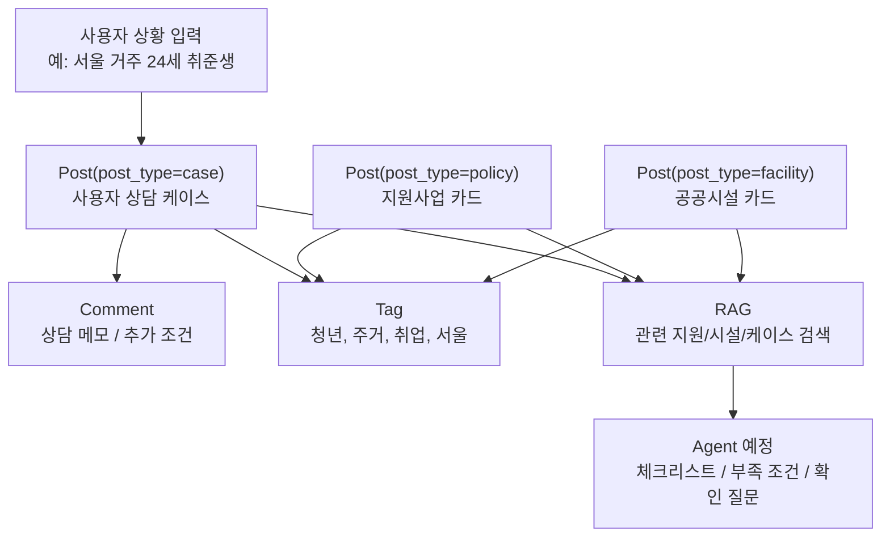

이제 `Post` 하나가 무조건 사람이 쓴 글만 의미하지 않습니다.

```text
post_type=policy   -> 정책/지원사업 카드
post_type=facility -> 공공시설/상담센터 카드
post_type=case     -> 사용자가 작성한 상담 케이스
```

## 5. 데이터 모델 변화

기존 `posts` 테이블에 아래 필드를 추가했습니다.

| 필드 | 의미 | 예시 |
| --- | --- | --- |
| `post_type` | 카드 종류 | `policy`, `facility`, `case` |
| `region` | 지역 | `서울`, `마포구` |
| `source_name` | 출처명 | `서울 열린데이터광장` |
| `source_url` | 원문 URL | `https://data.seoul.go.kr/...` |
| `source_external_id` | 외부 데이터 원본 id | `seoul-policy-001` |

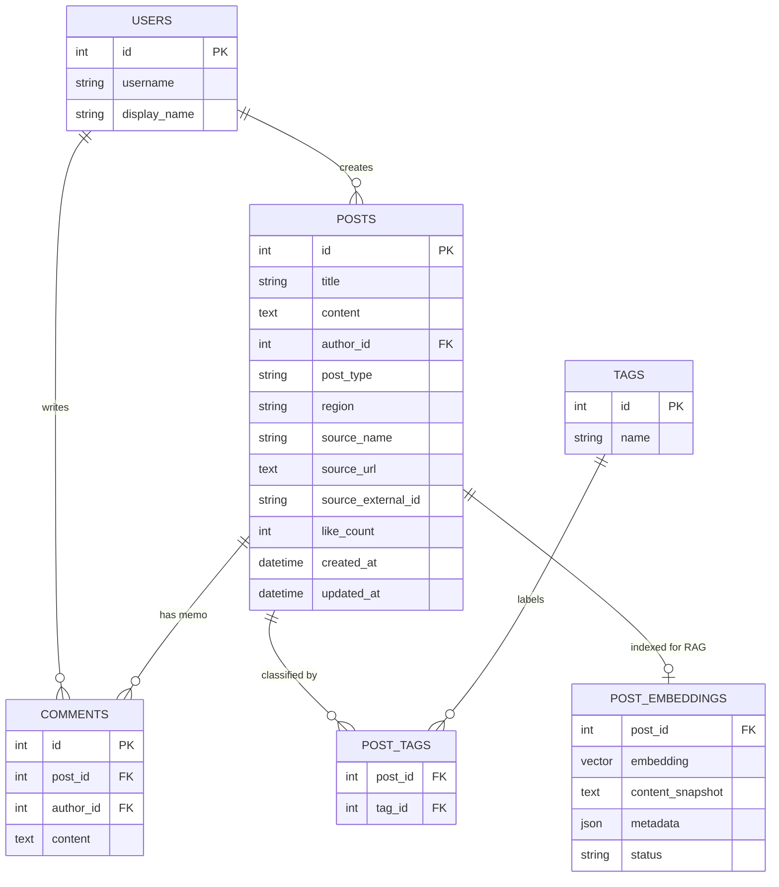

## 6. 변경된 파일 구조

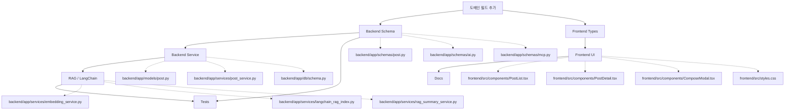

## 7. 상담 케이스 작성 흐름

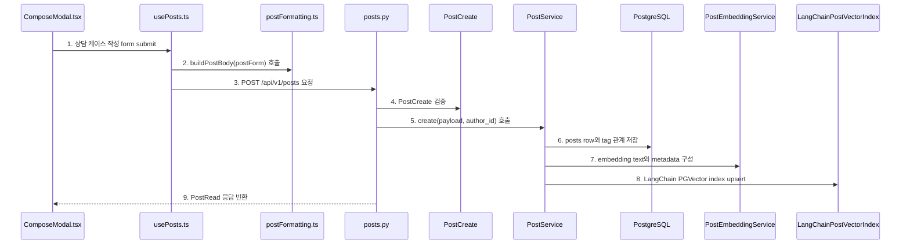

다이어그램 번호와 같은 순서로 코드를 보면 됩니다.

```text
1. 상담 케이스 작성 form submit
   - 코드: frontend/src/components/ComposeModal.tsx
   - 함수: ComposeModal()
   - 확인: 화면에서는 상담 제목, 상황 설명, 지역, 관심 태그를 입력한다.

2. buildPostBody(postForm) 호출
   - 코드: frontend/src/utils/postFormatting.ts
   - 함수: buildPostBody()
   - 확인: title/content/tags뿐 아니라 post_type/region/source_* 필드를 request body에 포함한다.

3. POST /api/v1/posts 요청
   - 코드: frontend/src/hooks/usePosts.ts
   - 함수: createPost()
   - 확인: 로그인한 사용자만 상담 케이스를 작성할 수 있다.

4. PostCreate 검증
   - 코드: backend/app/schemas/post.py
   - 클래스: PostCreate, PostType
   - 확인: post_type은 policy/facility/case 중 하나로 제한된다.

5. create(payload, author_id) 호출
   - 코드: backend/app/services/post_service.py
   - 함수: PostService.create()
   - 확인: payload에서 tags를 제외한 새 도메인 필드가 Post 모델로 들어간다.

6. posts row와 tag 관계 저장
   - 코드: backend/app/models/post.py
   - 클래스: Post
   - 확인: post_type/region/source_* 필드가 posts row에 저장된다.

7. embedding text와 metadata 구성
   - 코드: backend/app/services/embedding_service.py
   - 함수: PostEmbeddingService.build_post_text(), build_metadata()
   - 확인: RAG 검색 대상에 type/region/source가 반영된다.

8. LangChain PGVector index upsert
   - 코드: backend/app/services/langchain_rag_index.py
   - 함수: LangChainPostVectorIndex.upsert_post(), _build_document()
   - 확인: LangChain Document metadata에 post_type/region/source_*가 들어간다.

9. PostRead 응답 반환
   - 코드: backend/app/schemas/post.py
   - 클래스: PostRead
   - 확인: 프론트가 카드 타입, 지역, 출처를 화면에 표시할 수 있다.
```

## 8. 목록 조회와 화면 렌더링 흐름

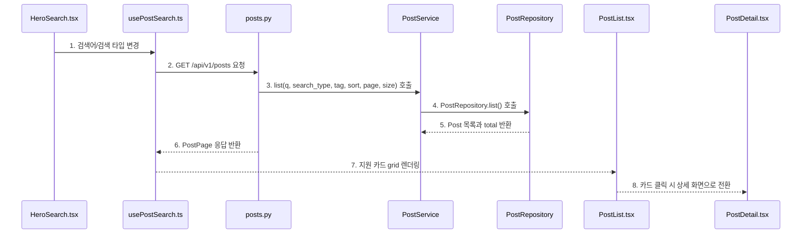

다이어그램 번호와 같은 순서로 코드를 보면 됩니다.

```text
1. 검색어/검색 타입 변경
   - 코드: frontend/src/components/HeroSearch.tsx
   - 함수: HeroSearch()
   - 확인: 검색 화면 문구가 복지정책, 청년지원, 공공시설, 상담 케이스 기준으로 바뀌었다.

2. GET /api/v1/posts 요청
   - 코드: frontend/src/hooks/usePostSearch.ts
   - 함수: loadPosts()
   - 확인: 기존 검색 API를 그대로 사용한다.

3. list(q, search_type, tag, sort, page, size) 호출
   - 코드: backend/app/services/post_service.py
   - 함수: PostService.list()
   - 확인: 검색, 태그 필터, 정렬, 페이징 흐름은 유지된다.

4. PostRepository.list() 호출
   - 코드: backend/app/repositories/post_repository.py
   - 함수: PostRepository.list()
   - 확인: title/content/author 검색과 tag 필터가 DB 조회로 변환된다.

5. Post 목록과 total 반환
   - 코드: backend/app/repositories/post_repository.py
   - 함수: PostRepository.list()
   - 확인: 댓글 수는 상담 메모 수로, like_count는 관심 수로 사용된다.

6. PostPage 응답 반환
   - 코드: backend/app/schemas/post.py
   - 클래스: PostPage, PostRead
   - 확인: items/page/size/total/total_pages와 새 도메인 필드가 함께 반환된다.

7. 지원 카드 grid 렌더링
   - 코드: frontend/src/components/PostList.tsx
   - 함수: PostList(), PostCard()
   - 확인: 카드에 지원 카드/시설 카드/상담 케이스 배지, 지역, 상담 메모 수, 관심 수가 표시된다.

8. 카드 클릭 시 상세 화면으로 전환
   - 코드: frontend/src/components/PostDetail.tsx
   - 함수: PostDetail()
   - 확인: 목록 아래에 상세를 붙이지 않고, 선택한 카드 상세 화면만 보여주는 기존 UX를 유지한다.
```

## 9. RAG 흐름 변화

피봇 전에는 RAG가 개발 게시글의 title/content/tags 중심으로 동작했습니다. 이제는 생활지원 매칭을 위해 `post_type`, `region`, `source_name`이 embedding text와 metadata에 들어갑니다.

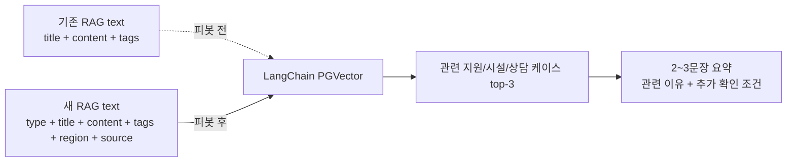

## 10. RAG 자동 추천 흐름

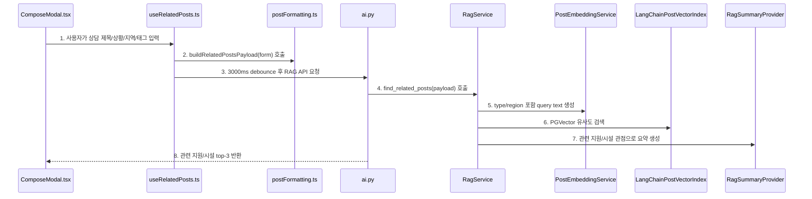

다이어그램 번호와 같은 순서로 코드를 보면 됩니다.

```text
1. 사용자가 상담 제목/상황/지역/태그 입력
   - 코드: frontend/src/components/ComposeModal.tsx
   - 함수: ComposeModal()
   - 확인: 작성 중인 상담 케이스 입력값이 RAG query의 기준이 된다.

2. buildRelatedPostsPayload(form) 호출
   - 코드: frontend/src/utils/postFormatting.ts
   - 함수: buildRelatedPostsPayload()
   - 확인: post_type과 region도 RAG 요청 payload에 포함한다.

3. 3000ms debounce 후 RAG API 요청
   - 코드: frontend/src/hooks/useRelatedPosts.ts
   - 함수: scheduleRelatedPosts(), loadRelatedPosts()
   - 확인: 입력이 20자 이상이고 3초 동안 멈추면 자동 추천을 요청한다.

4. find_related_posts(payload) 호출
   - 코드: backend/app/api/v1/ai.py, backend/app/services/rag_service.py
   - 함수: find_related_posts(), RagService.find_related_posts()
   - 확인: 세션 인증 후 RAG service가 검색 흐름을 시작한다.

5. type/region 포함 query text 생성
   - 코드: backend/app/services/embedding_service.py
   - 함수: PostEmbeddingService.build_text()
   - 확인: type, title, content, tags, region, source 형식의 embedding text를 만든다.

6. PGVector 유사도 검색
   - 코드: backend/app/services/langchain_rag_index.py
   - 함수: LangChainPostVectorIndex.find_related_posts()
   - 확인: LangChain PGVector store에서 유사한 기존 카드를 찾는다.

7. 관련 지원/시설 관점으로 요약 생성
   - 코드: backend/app/services/rag_summary_service.py
   - 함수: OpenAIRagSummaryProvider.summarize()
   - 확인: 단정적인 수급 가능 판단 대신 관련 이유와 추가 확인 조건을 요약한다.

8. 관련 지원/시설 top-3 반환
   - 코드: frontend/src/components/RelatedPostsPanel.tsx
   - 함수: RelatedPostsPanel()
   - 확인: 화면에는 유사 게시글이 아니라 관련 지원/시설로 표시된다.
```

## 11. UI 변화

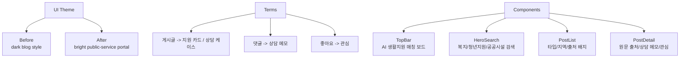

화면에서 바뀐 대표 문구는 아래입니다.

| 변경 전 | 변경 후 |
| --- | --- |
| AI 지식 공유 게시판 | AI 생활지원 매칭 보드 |
| 현재까지 작성된 게시글 | 지원 카드와 상담 케이스 |
| 새 글 작성 | 상담 케이스 작성 |
| 댓글 | 상담 메모 |
| 좋아요 | 관심 |
| 유사 게시글 | 관련 지원/시설 |

## 12. 이번 단계에서 유지한 것

피봇이라고 해서 모든 코드를 새로 만들지는 않았습니다. 아래 구조는 그대로 유지했습니다.

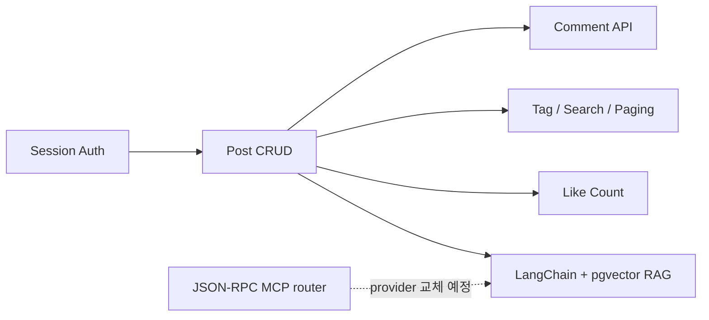

유지한 이유는 명확합니다.

```text
1. 기존 구조가 이미 Auth/CRUD/Search/RAG 흐름을 갖고 있다.
2. 피봇의 핵심은 도메인 해석과 데이터 소스 변경이지, 게시판 엔진 전체 교체가 아니다.
3. 빠르게 공공데이터를 넣고 데모 가능한 상태로 가려면 기존 Post 기반 구조를 재사용하는 편이 안전하다.
```

## 13. 아직 남은 작업

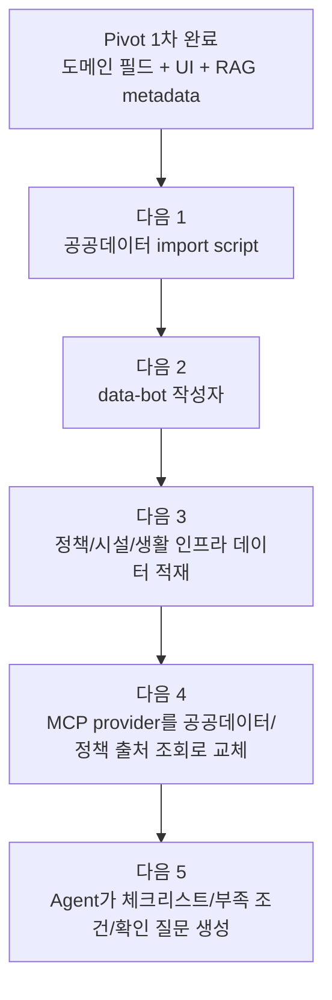

아직 구현하지 않은 항목은 아래입니다.

```text
1. 실제 공공데이터 수집/정제
2. data-bot 사용자 생성 또는 보장 로직
3. 대량 import 시 embedding 생성 전략
4. MCP 외부 참고자료 provider 교체
5. 상담 케이스 기반 Agent 응답
6. 정책/시설 전용 테이블이 필요한지 재검토
```

## 14. 검증 결과

실행한 검증:

```text
npm run build
python3 -m pytest backend/tests
```

결과:

```text
frontend build: 통과
backend tests: 32 passed
```

브라우저 확인:

```text
http://127.0.0.1:5173
```

확인한 화면 상태:

```text
1. 상단 서비스명: AI 생활지원 매칭 보드
2. 목록 제목: 지원 카드와 상담 케이스
3. 정렬: 상담 메모 많은 순, 관심 많은 순
4. 작성 버튼: 상담 케이스 작성
5. 초기 상태 문구: 지원 카드와 상담 케이스를 탐색하세요.
```
