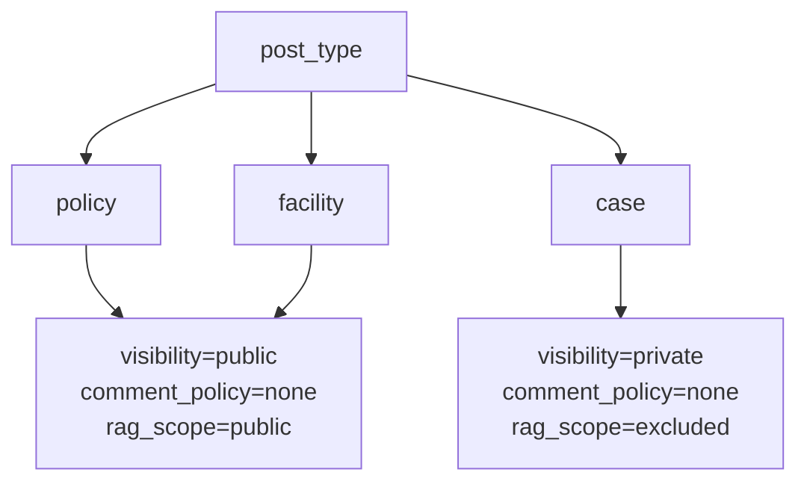
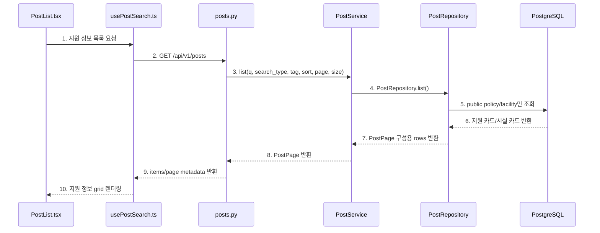
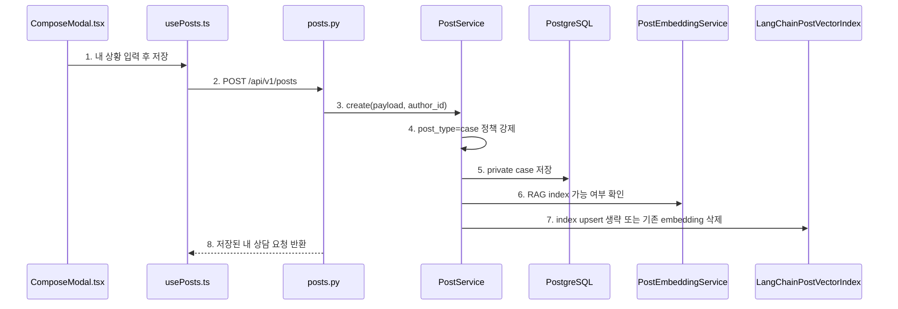
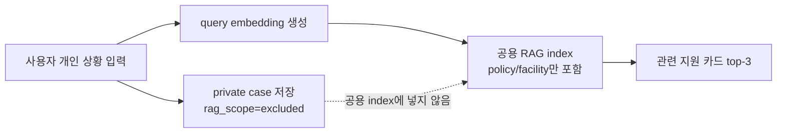
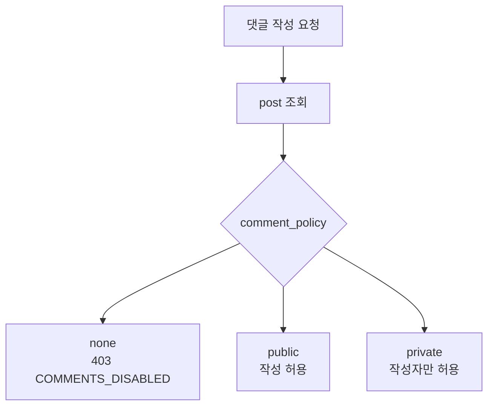
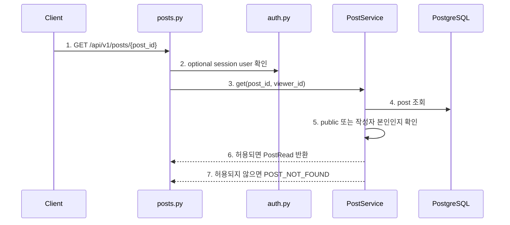

# Pivot 2차 구현 기록

> 후속 결정: Pivot 3차에서 MVP 방향을 **공개 지원 정보 보드 + 비공개 AI 지원 매칭 + 내 상담 기록**으로 확정했습니다. 제품 방향과 다음 구현 순서는 `docs3/pivot-3/mvp-direction-and-data-plan.md`를 우선해서 보면 됩니다. 이 문서는 그 방향을 가능하게 만든 공개/비공개 정책 구현 기록입니다.

## 1. 목표

Pivot 2차 구현의 목표는 **지원 카드와 상담 케이스를 같은 공개 게시판 콘텐츠로 섞지 않는 것**입니다.

정리된 방향은 아래입니다.

```text
지원 카드 / 시설 카드
- 공공데이터 기반 공개 정보
- RAG 지식베이스에 포함
- 댓글 없음
- 관심 등록 가능

내 상담 요청
- 사용자가 자기 상황을 입력하는 개인 지원 매칭 요청
- 기본 비공개
- RAG 지식베이스에 저장하지 않음
- 검색 query와 개인 기록으로만 사용
```

즉, 상담 케이스는 이제 “글을 올리는 게시글”이 아니라 **내 상황으로 지원을 찾는 private matching request**입니다.

## 2. 핵심 결정

| 항목 | 결정 |
| --- | --- |
| 공개 목록 | `policy`, `facility`만 노출 |
| 상담 요청 | `case`로 저장하되 기본 비공개 |
| RAG index | `policy`, `facility`만 포함 |
| 개인 상담 입력 | RAG query로만 사용 |
| 댓글 | 지원 카드와 개인 상담 요청 모두 기본 비활성화 |
| 관심 등록 | 공개 지원 카드에만 허용 |
| 직접 조회 | private case는 작성자만 조회 |
| 내 상담 기록 | `GET /api/v1/posts/my-consultations` endpoint 추가 |

## 3. 새 정책 필드

`posts`에 아래 필드를 추가했습니다.

| 필드 | 값 | 의미 |
| --- | --- | --- |
| `visibility` | `public`, `private` | 공개 목록 노출 여부와 직접 조회 가능 범위 |
| `comment_policy` | `none`, `public`, `private` | 상담 메모 허용 정책 |
| `rag_scope` | `public`, `excluded` | 공용 RAG index 포함 여부 |

기본 정책은 아래처럼 강제됩니다.



코드 기준:

```text
backend/app/services/post_service.py
- PostService._default_policy_for_type()
- create()
- update()
```

`PostCreate` 요청에서 사용자가 정책 필드를 직접 고르지 않아도, 서버가 `post_type`에 따라 정책을 정합니다. `PostUpdate`에서도 `case`를 public RAG에 넣는 식의 잘못된 조합을 막기 위해 서버가 다시 정책을 강제합니다.

## 4. 공개 지원 정보 목록 흐름



다이어그램 번호와 같은 순서로 코드를 보면 됩니다.

```text
1. 지원 정보 목록 요청
   - 코드: frontend/src/components/PostList.tsx
   - 함수: PostList()
   - 확인: 화면 제목이 “지원 정보”이고 버튼은 “내 상황으로 지원 찾기”다.

2. GET /api/v1/posts
   - 코드: frontend/src/hooks/usePostSearch.ts
   - 함수: loadPosts()
   - 확인: 기존 목록 API를 호출하지만 의미는 공개 지원 정보 목록이다.

3. list(q, search_type, tag, sort, page, size)
   - 코드: backend/app/api/v1/posts.py
   - 함수: list_posts()
   - 확인: query parameter를 PostService로 전달한다.

4. PostRepository.list()
   - 코드: backend/app/services/post_service.py
   - 함수: PostService.list()
   - 확인: service는 repository에 목록 조회를 위임한다.

5. public policy/facility만 조회
   - 코드: backend/app/repositories/post_repository.py
   - 함수: PostRepository.list()
   - 확인: `visibility=public`이고 `post_type in ('policy', 'facility')`인 row만 조회한다.

6. 지원 카드/시설 카드 반환
   - 코드: backend/app/repositories/post_repository.py
   - 함수: PostRepository.list()
   - 확인: private case는 목록 결과에 섞이지 않는다.

7. PostPage 구성용 rows 반환
   - 코드: backend/app/repositories/post_repository.py
   - 함수: PostRepository.list()
   - 확인: posts와 total을 함께 반환한다.

8. PostPage 반환
   - 코드: backend/app/services/post_service.py
   - 함수: PostService.list()
   - 확인: page/size/total/total_pages를 계산한다.

9. items/page metadata 반환
   - 코드: frontend/src/hooks/usePostSearch.ts
   - 함수: loadPosts()
   - 확인: API 응답을 posts/pageMeta 상태에 저장한다.

10. 지원 정보 grid 렌더링
    - 코드: frontend/src/components/PostList.tsx
    - 함수: PostCard()
    - 확인: 카드에는 지원 카드/시설 카드, 지역, 출처, 관심 수를 보여준다.
```

## 5. 내 상담 요청 저장 흐름



다이어그램 번호와 같은 순서로 코드를 보면 됩니다.

```text
1. 내 상황 입력 후 저장
   - 코드: frontend/src/components/ComposeModal.tsx
   - 함수: ComposeModal()
   - 확인: UI는 “상담 케이스 작성”이 아니라 “내 상황으로 지원 찾기”로 보인다.

2. POST /api/v1/posts
   - 코드: frontend/src/hooks/usePosts.ts
   - 함수: createPost()
   - 확인: 로그인한 사용자만 내 상담 요청을 저장할 수 있다.

3. create(payload, author_id)
   - 코드: backend/app/api/v1/posts.py
   - 함수: create_post()
   - 확인: session user의 id를 author_id로 넘긴다.

4. post_type=case 정책 강제
   - 코드: backend/app/services/post_service.py
   - 함수: PostService._default_policy_for_type()
   - 확인: case는 `visibility=private`, `comment_policy=none`, `rag_scope=excluded`가 된다.

5. private case 저장
   - 코드: backend/app/services/post_service.py
   - 함수: PostService.create()
   - 확인: 상담 요청은 DB에는 저장되지만 공개 목록에는 나오지 않는다.

6. RAG index 가능 여부 확인
   - 코드: backend/app/services/post_service.py
   - 함수: PostService._is_rag_indexable()
   - 확인: case는 공용 RAG index 대상이 아니다.

7. index upsert 생략 또는 기존 embedding 삭제
   - 코드: backend/app/services/post_service.py
   - 함수: PostService._sync_embedding(), _delete_embedding()
   - 확인: 개인정보가 들어갈 수 있는 상담 요청은 embedding DB에 저장하지 않는다.

8. 저장된 내 상담 요청 반환
   - 코드: frontend/src/hooks/usePosts.ts
   - 함수: createPost()
   - 확인: 저장 후 상세 화면에서 비공개/RAG 제외 상태를 확인할 수 있다.
```

## 6. RAG 검색 흐름

사용자 상담 입력은 RAG 지식베이스에 저장하지 않습니다. 대신 현재 입력을 query로만 사용합니다.



핵심 코드:

```text
backend/app/services/post_service.py
- _is_rag_indexable()
- _sync_embedding()

backend/app/services/langchain_rag_index.py
- _hydrate_related_posts()

backend/app/services/rag_summary_service.py
- OpenAIRagSummaryProvider._build_prompt()
```

`LangChainPostVectorIndex._hydrate_related_posts()`에서도 한 번 더 필터링합니다. 만약 과거에 private case vector가 남아 있어도 최종 Post row hydrate 단계에서 아래 조건을 만족하지 않으면 응답에서 제외합니다.

```text
visibility = public
rag_scope = public
post_type in (policy, facility)
```

## 7. 댓글/상담 메모 정책

지원 카드는 공식/공공데이터 기반 정보이므로 댓글을 열어두지 않습니다. 개인 상담 요청도 공개 토론 글이 아니므로 기본적으로 상담 메모를 받지 않습니다.



코드 기준:

```text
backend/app/services/comment_service.py
- CommentService.create()
- CommentService.list_by_post()

frontend/src/components/PostDetail.tsx
- PostDetail()
```

현재 기본값은 `comment_policy=none`입니다. 프론트 상세 화면에서도 지원 정보에는 댓글 영역 대신 “지원 정보에는 상담 메모를 받지 않습니다” 안내를 보여줍니다.

## 8. 직접 조회와 개인정보 보호

private case는 작성자만 조회할 수 있습니다.



다이어그램 번호와 같은 순서로 코드를 보면 됩니다.

```text
1. GET /api/v1/posts/{post_id}
   - 코드: backend/app/api/v1/posts.py
   - 함수: get_post()
   - 확인: 공개 지원 정보와 private case 조회가 같은 endpoint를 쓴다.

2. optional session user 확인
   - 코드: backend/app/api/v1/auth.py
   - 함수: get_optional_session_user()
   - 확인: 로그인하지 않아도 public 지원 정보는 볼 수 있다.

3. get(post_id, viewer_id)
   - 코드: backend/app/services/post_service.py
   - 함수: PostService.get()
   - 확인: viewer_id를 service에 전달한다.

4. post 조회
   - 코드: backend/app/repositories/post_repository.py
   - 함수: PostRepository.get()
   - 확인: Post row와 author/tag 정보를 조회한다.

5. public 또는 작성자 본인인지 확인
   - 코드: backend/app/services/post_service.py
   - 함수: PostService._can_view()
   - 확인: private case는 작성자 본인만 통과한다.

6. 허용되면 PostRead 반환
   - 코드: backend/app/schemas/post.py
   - 클래스: PostRead
   - 확인: visibility/comment_policy/rag_scope도 응답에 포함된다.

7. 허용되지 않으면 POST_NOT_FOUND
   - 코드: backend/app/services/post_service.py
   - 함수: PostService.get()
   - 확인: 타인의 private case 존재 여부를 노출하지 않는다.
```

## 9. UI 변화

| 이전 표현 | 변경 후 표현 |
| --- | --- |
| 지원 카드와 상담 케이스 | 지원 정보 |
| 상담 케이스 작성 | 내 상황으로 지원 찾기 |
| 상담 제목 | 요청 제목 |
| 상황 설명 | 내 상황 |
| 상담 케이스 저장 | 내 상담 요청 저장 |
| 상담 케이스 | 내 상담 요청 |

`PostDetail`에서는 `visibility=private`와 `rag_scope=excluded` 배지를 보여줍니다. 사용자가 자신의 상담 요청을 볼 때 “이 내용은 공용 RAG 지식베이스에 들어가지 않는다”는 점을 확인할 수 있게 하기 위한 장치입니다.

## 10. 검증

실행한 검증:

```text
npm run build
python3 -m pytest backend/tests/test_post_service.py
python3 -m compileall -q backend/app backend/tests
```

결과:

```text
frontend build: 통과
post service unit tests: 4 passed
python compileall: 통과
```

전체 DB 통합 테스트는 로컬 PostgreSQL 접근 권한이 필요한 테스트라 이 사이드 대화에서는 실행하지 않았습니다.
