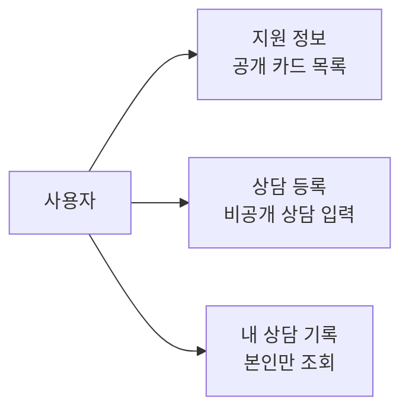
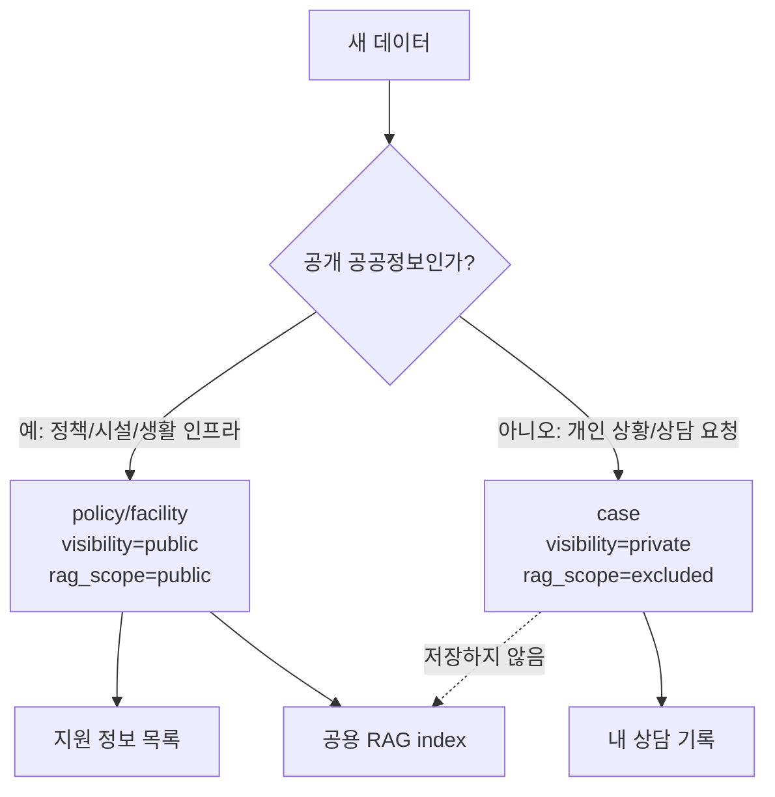
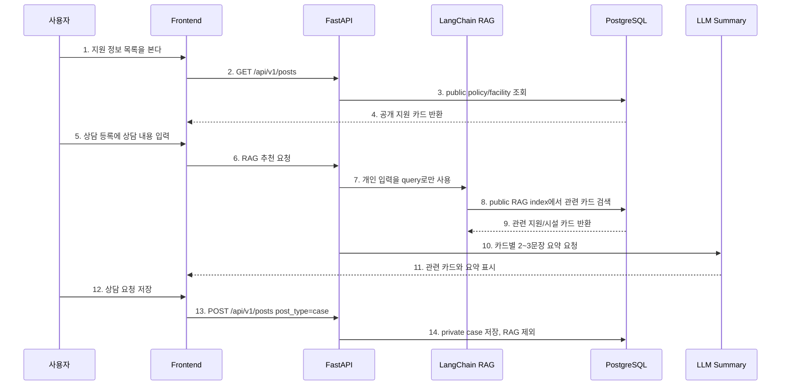
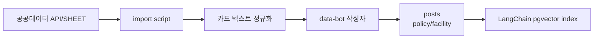

# Pivot 3차 MVP 방향 및 데이터 계획

> 후속 구현: Pivot 4차에서 `내 상담 기록` 프론트 화면을 추가했고, Pivot 5차에서 공공데이터 seed/import script와 `data-bot` 적재 흐름을 추가했습니다. 현재 다음 구현 우선순위는 MCP provider를 공공데이터/정책 출처 조회로 교체하는 것입니다.

## 1. 이번 결정의 핵심

이번 결정은 피봇 후 애매해진 역할을 다시 나누는 것입니다.

```text
게시판 = 공개 지원 정보 보드
상담 요청 = 비공개 AI 매칭 요청
RAG = 비공개 상담 입력으로 공개 지원/시설 카드 검색
AI 큐레이션 = MVP 이후 polishing
```

즉, 사용자의 개인 상담 요청을 공개 게시판 글처럼 다루지 않습니다. 대신 게시판에는 다른 사용자가 그냥 볼 수 있는 공공 지원 정보가 올라가고, 개인 상담 요청은 로그인한 사용자의 비공개 기록으로만 남깁니다.

## 2. 왜 그래도 게시판이 필요한가

만약 서비스가 “내 상황을 입력하면 AI가 답해준다”만 한다면 게시판이 필요 없습니다. 하지만 이 프로젝트에서 게시판은 아래 역할을 맡습니다.

| 역할 | 설명 |
| --- | --- |
| 공개 정보 저장소 | 복지정책, 청년지원, 공공시설, 생활 인프라 카드를 사용자가 탐색할 수 있게 한다. |
| RAG 지식베이스 | AI 매칭이 참고할 공개 데이터를 카드 단위로 저장한다. |
| 신뢰 근거 | AI 답변이 어떤 지원 카드와 출처를 바탕으로 나왔는지 보여준다. |
| 큐레이션 화면 | 나중에 AI/admin이 만든 추천 묶음이나 특집 정보를 보여줄 수 있다. |
| 발표 데모 기반 | 일반 CRUD 게시판 기능과 AI 기능이 하나의 데이터 흐름으로 연결된다. |

그래서 게시판은 “유저가 자기 고민을 공개로 올리는 곳”이 아니라 “AI가 참고할 수 있고 사람도 읽을 수 있는 공개 지원 정보 보드”입니다.

## 3. 메뉴 구조

MVP 메뉴는 세 개로 나눕니다.



| 메뉴 | 공개 여부 | 로그인 필요 | 내용 |
| --- | --- | --- | --- |
| 지원 정보 | 공개 | 아니오 | 지원 카드, 시설 카드 목록과 상세 |
| 상담 등록 | 비공개 입력 | 예 | 상담 내용 입력, 관련 지원 추천, 체크리스트 생성 |
| 내 상담 기록 | 비공개 | 예 | 내가 저장한 상담 요청과 AI 매칭 결과 |

## 4. 데이터 공개 정책



핵심 원칙:

1. 공공데이터 기반 지원/시설 카드는 공개 목록에 보여준다.
2. 공공데이터 기반 지원/시설 카드는 RAG index에 넣는다.
3. 사용자의 개인 상담 요청은 공개 목록에 보여주지 않는다.
4. 사용자의 개인 상담 요청은 RAG index에 넣지 않는다.
5. 개인 상담 요청은 현재 검색 query와 본인 기록으로만 사용한다.

## 5. MVP 범위

지금은 MVP를 먼저 완성하고, 그 뒤에 polishing을 합니다.

### MVP에 포함

| 기능 | 이유 |
| --- | --- |
| 공개 지원 정보 목록/상세 | 게시판이 존재해야 하는 이유를 만든다. |
| 지원/시설 카드 seed | RAG와 화면이 빈 상태가 되지 않게 한다. |
| 상담 등록 | 사용자의 실제 문제 진입점이다. |
| RAG 추천 top-3 | 현재 구현된 LangChain/pgvector 흐름을 피봇 도메인에 맞게 사용한다. |
| 추천 카드 요약 | 사용자가 왜 이 카드가 추천됐는지 이해할 수 있게 한다. |
| 내 상담 기록 | 비공개 요청을 저장한 뒤 다시 볼 수 있게 한다. |

### MVP 이후 polishing

| 기능 | 나중으로 미루는 이유 |
| --- | --- |
| AI 자동 게시글 발행 | 정책 정보 오류가 치명적이라 검수 흐름이 필요하다. |
| AI 큐레이션 특집 글 | 기본 지원 카드와 상담 흐름이 먼저 안정되어야 한다. |
| 관리자 검수 화면 | MVP 이후 운영 기능에 가깝다. |
| 개인화 추천 | 사용자 행동 데이터가 쌓인 뒤 의미가 있다. |
| 지도/거리 기반 추천 | 시설 데이터가 충분히 들어간 뒤 붙이는 것이 좋다. |

## 6. 전체 사용자 흐름



다이어그램 번호와 같은 순서로 보면 됩니다.

```text
1. 지원 정보 목록을 본다
   - 코드: frontend/src/components/PostList.tsx
   - 확인: public support/facility card 목록을 보여준다.

2. GET /api/v1/posts
   - 코드: frontend/src/hooks/usePostSearch.ts
   - 확인: 목록 API를 호출한다.

3. public policy/facility 조회
   - 코드: backend/app/repositories/post_repository.py
   - 확인: visibility=public, post_type in (policy, facility)만 조회한다.

4. 공개 지원 카드 반환
   - 코드: backend/app/services/post_service.py
   - 확인: private case가 목록에 섞이지 않는다.

5. 상담 등록에 상담 내용 입력
   - 코드: frontend/src/components/ComposeModal.tsx
   - 확인: 사용자는 개인 상황을 공개 글이 아니라 private matching request로 입력한다.

6. RAG 추천 요청
   - 코드: frontend/src/hooks/useRelatedPosts.ts
   - 확인: 입력 debounce 후 관련 카드 API를 호출한다.

7. 개인 입력을 query로만 사용
   - 코드: backend/app/services/rag_service.py
   - 확인: query embedding은 만들지만 상담 요청을 index에 저장하지 않는다.

8. public RAG index에서 관련 카드 검색
   - 코드: backend/app/services/langchain_rag_index.py
   - 확인: policy/facility + public/rag public 조건을 만족하는 카드만 hydrate한다.

9. 관련 지원/시설 카드 반환
   - 코드: backend/app/schemas/ai.py
   - 확인: 추천 결과는 관련 공개 카드 목록이다.

10. 카드별 2~3문장 요약 요청
    - 코드: backend/app/services/rag_summary_service.py
    - 확인: 개인 상황과 카드 내용을 보고 추천 이유를 요약한다.

11. 관련 카드와 요약 표시
    - 코드: frontend/src/components/RelatedPostsPanel.tsx
    - 확인: 사용자가 추천 근거를 읽을 수 있다.

12. 상담 요청 저장
    - 코드: frontend/src/hooks/usePosts.ts
    - 확인: 사용자가 저장을 선택하면 private case로 저장한다.

13. POST /api/v1/posts post_type=case
    - 코드: backend/app/api/v1/posts.py
    - 확인: 로그인 사용자 id를 author_id로 연결한다.

14. private case 저장, RAG 제외
    - 코드: backend/app/services/post_service.py
    - 확인: visibility=private, comment_policy=none, rag_scope=excluded를 강제한다.
```

## 7. 공공데이터 수집 계획

우선 실제 공공데이터를 가져오되, 처음부터 완벽한 정책 DB를 만들지 않습니다. MVP에서는 `Post`에 카드로 적재하고, 나중에 필요할 때 전용 테이블로 분리합니다.

### 1차 데이터 후보

| 우선순위 | 데이터 유형 | 카드 타입 | 이유 |
| --- | --- | --- | --- |
| 1 | 청년/주거/취업/복지 지원사업 | `policy` | 사용자 상담 요청과 직접 매칭하기 쉽다. |
| 2 | 복지관/청년센터/상담센터/공공시설 | `facility` | 지역 기반 추천과 카드 수 확보에 좋다. |
| 3 | 생활 인프라/보건/안전 시설 | `facility` | 데이터 양을 늘리고 생활지원 보드 느낌을 강화한다. |
| 4 | 공지/보도자료/정책 안내 | `policy` | AI 큐레이션 글의 원천 자료로 쓸 수 있다. |

### 후보 출처

| 출처 | 활용 |
| --- | --- |
| 공공데이터포털 | 사회복지, 보건의료, 산업고용, 재난안전, REST/JSON 데이터 후보 탐색 |
| 서울 열린데이터광장 | 서울시 복지/보건/주택/산업경제 OpenAPI, SHEET, FILE 데이터 후보 탐색 |
| 각 지자체/기관 정책 페이지 | MCP provider가 정책 출처를 찾는 대상으로 사용 |

현재 확인한 기준:

- 공공데이터포털은 사회복지, 보건의료, 산업고용 등 분류와 REST/JSON 서비스 유형을 제공한다.
- 서울 열린데이터광장은 OpenAPI, SHEET, FILE 등 여러 유형을 제공하고 복지/보건/주택/산업경제 데이터를 가진다.

### 적재 방식



적재 기본값:

```text
author = data-bot
post_type = policy 또는 facility
visibility = public
comment_policy = none
rag_scope = public
source_name = 데이터 제공처
source_url = 원본 페이지 또는 API 문서
source_external_id = 원본 row id
```

## 8. 바로 다음 구현

1. MCP provider 교체
   - 현재 외부 참고자료 provider는 피봇 전 흔적이다.
   - 공공데이터/정책 출처 조회 provider로 바꾼다.

2. 상담 상세의 Agent 답변 생성/저장 흐름
   - 관련 지원 카드만 보여주는 수준에서 끝내지 않고, 신청 가능성/부족 조건/체크리스트를 `AI 답변` 섹션에 저장한다.
   - 상담이 수정되면 기존 AI 답변은 직접 수정하지 않고 재생성 필요 상태로 다룬다.
   - 상담이 삭제되면 연결된 AI 답변도 함께 삭제한다.

3. UI polishing
   - 어두운 블로그 UI가 아니라 밝은 정부/공공기관 서비스 톤으로 정리한다.
