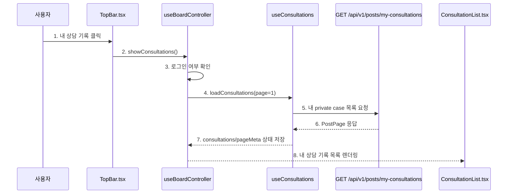
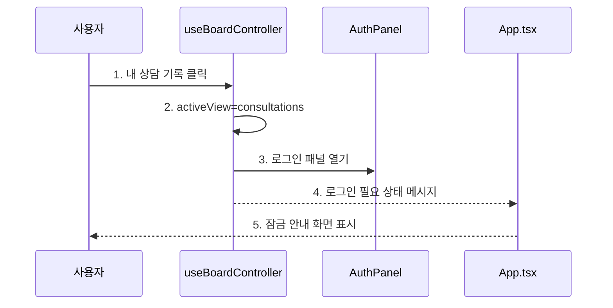
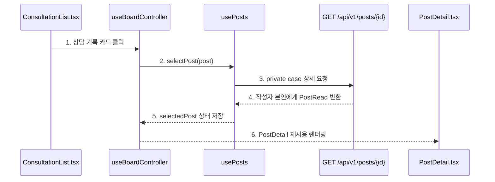

# Pivot 4차 구현 기록 - 내 상담 기록 UI

## 1. 목표

이번 구현의 목표는 Pivot 3차에서 확정한 MVP 메뉴 구조 중 빠져 있던 **내 상담 기록** 화면을 추가하는 것입니다.

```text
지원 정보 = 공개 지원/시설 카드 목록
상담 등록 = 비공개 상담 요청 입력
내 상담 기록 = 로그인한 사용자 본인의 private case 목록
AI 답변 = 상담 상세에서 Agent 답변을 보여줄 영역
```

백엔드에는 이미 `GET /api/v1/posts/my-consultations` endpoint가 있었으므로, 이번 작업은 프론트 화면 전환과 private case 목록 조회를 연결하는 데 집중했습니다.

## 2. 변경 요약

| 영역 | 변경 |
| --- | --- |
| 화면 상태 | `support`, `consultations` view 추가 |
| 상단 메뉴 | `지원 정보`, `내 상담 기록` 버튼으로 정리 |
| 상담 등록 | 공개 지원 목록과 상담 기록 화면의 action button으로 제공 |
| 상담 기록 조회 | `useConsultations` hook 추가 |
| 상담 기록 목록 | `ConsultationList` 컴포넌트 추가 |
| AI 답변 영역 | 상담 상세 화면에 Agent 답변 placeholder 추가 |
| 상세 화면 | 기존 `PostDetail` 재사용 |
| 문서 | README의 완료/다음 구현 목록 갱신 |

## 3. 내 상담 기록 진입 흐름



다이어그램 번호와 같은 순서로 코드를 보면 됩니다.

```text
1. 내 상담 기록 클릭
   - 코드: frontend/src/components/TopBar.tsx
   - 함수: TopBar()
   - 확인: 상단 주요 메뉴에 `내 상담 기록` 버튼이 있다.

2. showConsultations()
   - 코드: frontend/src/hooks/useBoardController.ts
   - 함수: showConsultations()
   - 확인: activeView를 `consultations`로 바꾸고 상세/AI 패널 상태를 초기화한다.

3. 로그인 여부 확인
   - 코드: frontend/src/hooks/useBoardController.ts
   - 함수: showConsultations()
   - 확인: 비로그인 사용자는 로그인 패널을 열고, 상담 기록 목록을 요청하지 않는다.

4. loadConsultations(page=1)
   - 코드: frontend/src/hooks/useConsultations.ts
   - 함수: loadConsultations()
   - 확인: 로그인 사용자일 때 첫 페이지 상담 기록을 불러온다.

5. 내 private case 목록 요청
   - 코드: frontend/src/hooks/useConsultations.ts
   - 함수: loadConsultations()
   - 확인: `/api/v1/posts/my-consultations?page=1&size=9`를 호출한다.

6. PostPage 응답
   - 코드: backend/app/api/v1/posts.py
   - 함수: list_my_consultations()
   - 확인: 서버는 session user의 private case 목록만 반환한다.

7. consultations/pageMeta 상태 저장
   - 코드: frontend/src/hooks/useConsultations.ts
   - 함수: loadConsultations()
   - 확인: items와 page metadata를 각각 상태에 저장한다.

8. 내 상담 기록 목록 렌더링
   - 코드: frontend/src/components/ConsultationList.tsx
   - 함수: ConsultationList()
   - 확인: 공개 지원 카드와 다른 private request 카드 UI로 보여준다.
```

## 4. 비로그인 보호 흐름



다이어그램 번호와 같은 순서로 코드를 보면 됩니다.

```text
1. 내 상담 기록 클릭
   - 코드: frontend/src/components/TopBar.tsx
   - 함수: TopBar()
   - 확인: 비로그인 상태에서도 메뉴는 보인다.

2. activeView=consultations
   - 코드: frontend/src/hooks/useBoardController.ts
   - 함수: showConsultations()
   - 확인: 로그인 후 같은 메뉴 맥락에서 상담 기록을 불러올 수 있게 view를 먼저 바꾼다.

3. 로그인 패널 열기
   - 코드: frontend/src/hooks/useBoardController.ts
   - 함수: handleAuthRequired()
   - 확인: AuthPanel이 login 모드로 열린다.

4. 로그인 필요 상태 메시지
   - 코드: frontend/src/hooks/useBoardController.ts
   - 함수: handleAuthRequired()
   - 확인: "내 상담 기록은 로그인이 필요합니다." 메시지를 표시한다.

5. 잠금 안내 화면 표시
   - 코드: frontend/src/App.tsx
   - 함수: App()
   - 확인: currentUser가 없으면 ConsultationList 대신 locked-panel을 보여준다.
```

## 5. 상담 기록 상세 흐름



다이어그램 번호와 같은 순서로 코드를 보면 됩니다.

```text
1. 상담 기록 카드 클릭
   - 코드: frontend/src/components/ConsultationList.tsx
   - 함수: ConsultationCard()
   - 확인: 카드 click 또는 Enter 입력으로 상세를 연다.

2. selectPost(post)
   - 코드: frontend/src/hooks/useBoardController.ts
   - 함수: selectPost()
   - 확인: 공개 지원 카드와 같은 상세 조회 함수를 재사용한다.

3. private case 상세 요청
   - 코드: frontend/src/hooks/usePosts.ts
   - 함수: selectPost()
   - 확인: `/api/v1/posts/{id}`를 호출한다.

4. 작성자 본인에게 PostRead 반환
   - 코드: backend/app/services/post_service.py
   - 함수: get()
   - 확인: private case는 작성자 본인만 볼 수 있다.

5. selectedPost 상태 저장
   - 코드: frontend/src/hooks/usePosts.ts
   - 함수: selectPost()
   - 확인: 선택한 private case가 selectedPost가 된다.

6. PostDetail 재사용 렌더링
   - 코드: frontend/src/components/PostDetail.tsx
   - 함수: PostDetail()
   - 확인: `비공개`, `RAG 제외` 배지와 개인정보 보호 안내가 표시된다.
```

## 6. 구현 파일

| 파일 | 역할 |
| --- | --- |
| `frontend/src/types.ts` | `BoardView` 타입 추가 |
| `frontend/src/hooks/useConsultations.ts` | 내 상담 기록 목록 API 호출과 page state 관리 |
| `frontend/src/hooks/useBoardController.ts` | activeView, 메뉴 전환, 상담 기록 로드 흐름 연결 |
| `frontend/src/components/TopBar.tsx` | `지원 정보`, `내 상담 기록` 메뉴 추가 |
| `frontend/src/components/ConsultationList.tsx` | private case 목록 UI |
| `frontend/src/components/PostDetail.tsx` | 상담 상세 `AI 답변` 섹션 추가 |
| `frontend/src/App.tsx` | activeView에 따른 화면 분기 |
| `frontend/src/styles.css` | 상담 기록 목록과 상단 메뉴 스타일 |
| `README.md` | 완료 상태와 다음 구현 순서 갱신 |

## 7. 검증

실행한 검증:

```text
npm run build
python3 -m compileall -q backend/app backend/tests
```

결과:

```text
frontend build: 통과
python compileall: 통과
```

DB 통합 테스트는 이번 프론트 중심 변경에서는 실행하지 않았습니다. 다음 공공데이터 import 작업을 시작하기 전에는 PostgreSQL을 켜고 전체 테스트를 한 번 돌리는 것이 좋습니다.

## 8. 후속 UI 정리

사용자 피드백에 따라 아래 기준을 추가로 반영했습니다.

```text
상단 메뉴에서 AI 지원 찾기 제거
상담 진입 버튼은 상담 등록으로 통일
상담 상세에는 AI 답변 섹션을 항상 예약
```

수정/삭제 정책은 아래처럼 잡습니다.

| 동작 | 정책 |
| --- | --- |
| 상담 수정 | 기존 AI 답변을 직접 수정하지 않고, 재생성 필요 상태로 본다. |
| 상담 삭제 | 상담 기록과 연결된 AI 답변을 함께 삭제한다. |
| Agent 연결 전 | AI 답변 섹션에 답변 대기 placeholder를 보여준다. |
