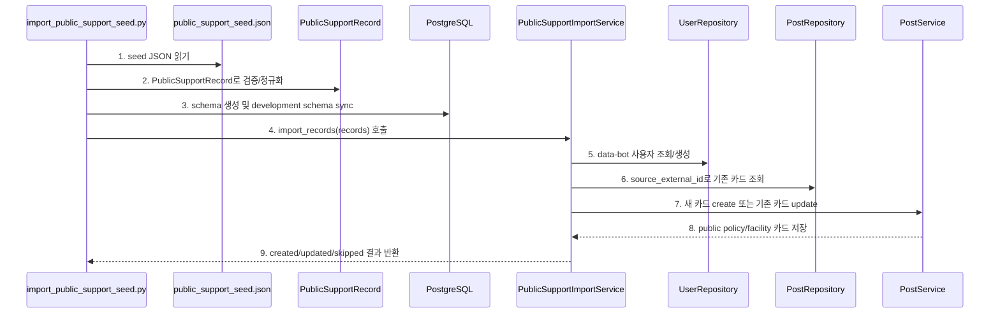
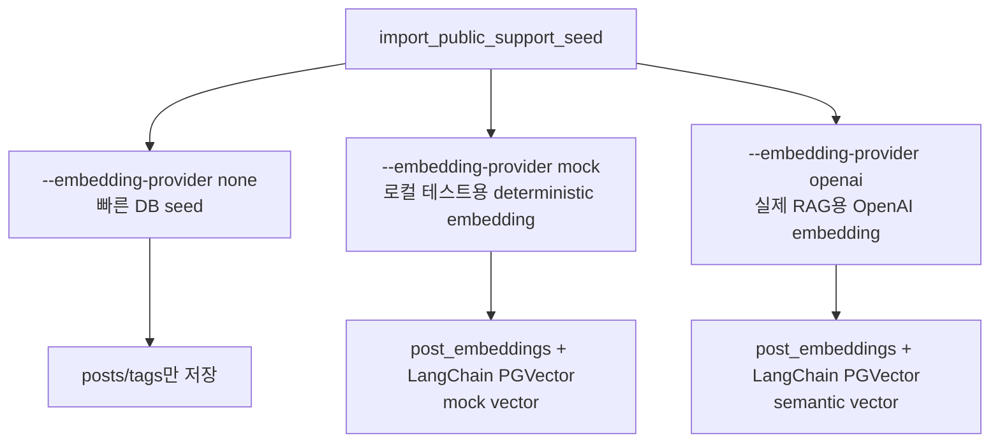
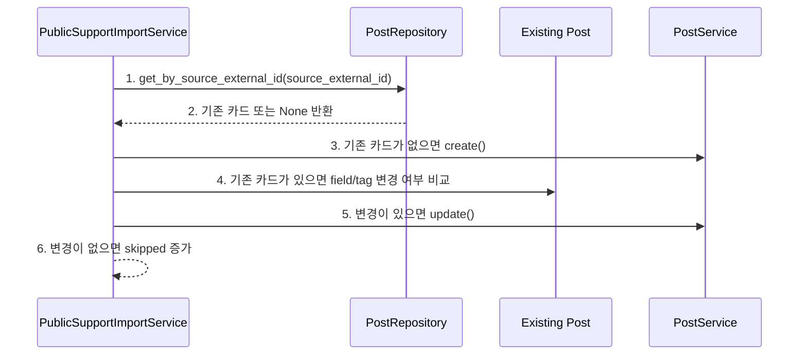

# Pivot 5차 구현 기록 - 공공데이터 Seed Import

## 1. 목표

이번 구현의 목표는 공개 지원/시설 카드가 빈 상태로 남지 않도록, **`data-bot` 작성자 기반 공공데이터 seed/import 흐름**을 추가하는 것입니다.

MVP에서 공공데이터는 아직 별도 `policies`, `facilities` 테이블로 분리하지 않습니다. 기존 `Post`를 재사용해 공개 카드로 적재합니다.

```text
policy/facility row
-> data-bot 작성자
-> visibility=public
-> comment_policy=none
-> rag_scope=public
-> source_external_id 기준 upsert
```

## 2. 구현 요약

| 영역 | 변경 |
| --- | --- |
| seed 파일 | `backend/app/data/public_support_seed.json` 추가 |
| CLI | `python3 -m backend.app.scripts.import_public_support_seed` 추가 |
| data-bot | 없으면 `data-bot` 사용자를 자동 생성 |
| 중복 방지 | `source_external_id` 기준 upsert |
| 공개 정책 | imported row는 `visibility=public`, `comment_policy=none`, `rag_scope=public` |
| embedding 전략 | `none`, `mock`, `openai` 옵션으로 명시 선택 |
| 테스트 | data-bot 생성, public card 생성, source id upsert 검증 |

## 3. 추가된 파일

```text
backend/app/data/public_support_seed.json
backend/app/scripts/__init__.py
backend/app/scripts/import_public_support_seed.py
backend/app/services/public_support_import_service.py
backend/tests/test_public_support_import.py
docs3/pivot-5/implementation-record.md
```

수정한 파일:

```text
backend/app/repositories/post_repository.py
README.md
AGENT.md
docs3/pivot-3/mvp-direction-and-data-plan.md
```

## 4. Seed 데이터 구조

seed JSON 한 row는 아래 형태입니다.

```json
{
  "source_external_id": "seed-policy-youth-housing-seoul",
  "post_type": "policy",
  "title": "[청년/주거] 서울 청년 월세 부담 상담",
  "content": "서울 거주 청년이 월세 부담...",
  "tags": ["청년", "주거", "월세", "서울"],
  "region": "서울",
  "source_name": "서울청년포털",
  "source_url": "https://youth.seoul.go.kr"
}
```

`post_type`은 `policy` 또는 `facility`만 허용합니다. 사용자의 private 상담 요청인 `case`는 이 import 경로로 만들지 않습니다.

## 5. Import 실행 흐름



다이어그램 번호와 같은 순서로 코드를 보면 됩니다.

```text
1. seed JSON 읽기
   - 코드: backend/app/scripts/import_public_support_seed.py
   - 함수: load_records()
   - 확인: 기본 파일은 backend/app/data/public_support_seed.json이다.

2. PublicSupportRecord로 검증/정규화
   - 코드: backend/app/services/public_support_import_service.py
   - 클래스/함수: PublicSupportRecord.from_mapping()
   - 확인: post_type은 policy/facility만 허용하고, source_external_id/title/content는 필수다.

3. schema 생성 및 development schema sync
   - 코드: backend/app/scripts/import_public_support_seed.py
   - 함수: main()
   - 확인: Base.metadata.create_all()과 ensure_development_schema()를 실행해 로컬 DB를 준비한다.

4. import_records(records) 호출
   - 코드: backend/app/scripts/import_public_support_seed.py
   - 함수: main(), build_import_service()
   - 확인: CLI option에 따라 embedding provider가 none/mock/openai 중 하나로 정해진다.

5. data-bot 사용자 조회/생성
   - 코드: backend/app/services/public_support_import_service.py
   - 함수: PublicSupportImportService._get_or_create_data_bot()
   - 확인: username=data-bot 사용자가 없으면 자동 생성한다.

6. source_external_id로 기존 카드 조회
   - 코드: backend/app/repositories/post_repository.py
   - 함수: PostRepository.get_by_source_external_id()
   - 확인: 같은 외부 원본 id가 있으면 새로 만들지 않고 update 여부를 판단한다.

7. 새 카드 create 또는 기존 카드 update
   - 코드: backend/app/services/public_support_import_service.py
   - 함수: PublicSupportImportService.import_records()
   - 확인: 새 source id는 create, 변경된 source id는 update, 동일하면 skipped로 센다.

8. public policy/facility 카드 저장
   - 코드: backend/app/services/post_service.py
   - 함수: PostService.create(), PostService.update()
   - 확인: policy/facility는 visibility=public, comment_policy=none, rag_scope=public으로 저장된다.

9. created/updated/skipped 결과 반환
   - 코드: backend/app/services/public_support_import_service.py
   - 클래스: PublicSupportImportResult
   - 확인: CLI가 적재 결과를 숫자로 출력한다.
```

## 6. Embedding 옵션



기본값은 `none`입니다. 이유는 seed를 넣을 때마다 외부 API 비용이나 네트워크 실패가 생기는 것을 피하기 위해서입니다.

실제 RAG 추천을 데모하려면 `.env`에 `OPENAI_API_KEY`가 설정된 상태에서 아래처럼 실행합니다.

```bash
.venv/bin/python -m backend.app.scripts.import_public_support_seed --embedding-provider openai
```

## 7. Upsert 판단 흐름



다이어그램 번호와 같은 순서로 코드를 보면 됩니다.

```text
1. get_by_source_external_id(source_external_id)
   - 코드: backend/app/repositories/post_repository.py
   - 함수: PostRepository.get_by_source_external_id()
   - 확인: 외부 원본 id를 기준으로 기존 row를 찾는다.

2. 기존 카드 또는 None 반환
   - 코드: backend/app/repositories/post_repository.py
   - 함수: PostRepository.get_by_source_external_id()
   - 확인: tag와 author relationship도 함께 로드한다.

3. 기존 카드가 없으면 create()
   - 코드: backend/app/services/public_support_import_service.py
   - 함수: PublicSupportImportService.import_records()
   - 확인: PostCreate payload로 새 public card를 만든다.

4. 기존 카드가 있으면 field/tag 변경 여부 비교
   - 코드: backend/app/services/public_support_import_service.py
   - 함수: PublicSupportImportService._record_changed()
   - 확인: title/content/type/region/source/tags가 바뀌었는지 비교한다.

5. 변경이 있으면 update()
   - 코드: backend/app/services/public_support_import_service.py
   - 함수: PublicSupportImportService.import_records()
   - 확인: 기존 post_id를 유지하면서 내용과 tag를 갱신한다.

6. 변경이 없으면 skipped 증가
   - 코드: backend/app/services/public_support_import_service.py
   - 함수: PublicSupportImportService.import_records()
   - 확인: 같은 seed를 여러 번 실행해도 중복 row를 만들지 않는다.
```

## 8. 실행 명령

검증만 실행:

```bash
.venv/bin/python -m backend.app.scripts.import_public_support_seed --dry-run
```

빠른 DB seed:

```bash
.venv/bin/python -m backend.app.scripts.import_public_support_seed --embedding-provider none
```

실제 RAG용 seed:

```bash
.venv/bin/python -m backend.app.scripts.import_public_support_seed --embedding-provider openai
```

일부만 넣기:

```bash
.venv/bin/python -m backend.app.scripts.import_public_support_seed --limit 5
```

## 9. 검증

실행한 검증:

```text
python3 -m backend.app.scripts.import_public_support_seed --dry-run --limit 3
python3 -m pytest backend/tests/test_public_support_import.py
npm run build
python3 -m pytest backend/tests
```

검증 결과:

```text
dry-run: 통과
public support import tests: 2 passed
frontend build: 통과
backend tests: 통과
```

## 10. 다음 구현

다음 구현 우선순위는 **MCP provider를 공공데이터/정책 출처 조회로 교체**하는 것입니다.

현재 MCP endpoint와 JSON-RPC tool 구조는 있지만 provider가 아직 피봇 전 Stack Exchange 기반입니다. 다음 단계에서는 아래처럼 바꿔야 합니다.

```text
search_external_references
-> 상담 제목/내용/태그/지역 입력
-> seed/public support cards 또는 공공데이터 출처 검색
-> 정책/시설 참고자료 카드 반환
-> Sprint 8 Agent가 이 결과를 사용
```
