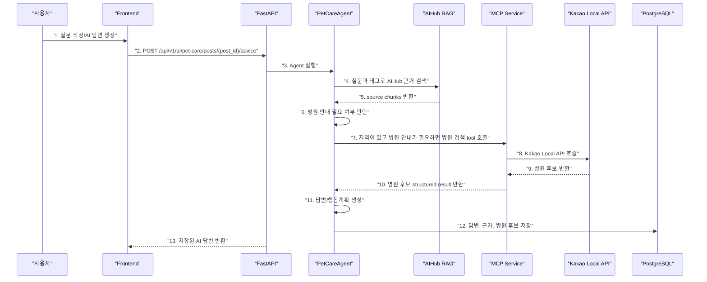

# Sprint 8 Agent Decision Record

## 1. 목표

Sprint 8의 목표는 기존 RAG 답변 생성 흐름에 **Agent 판단 + MCP 병원 검색**을 붙이는 것이다.

현재까지 구현된 상태:

- AIHub 반려견 말뭉치 기반 RAG 검색 가능
- AI 답변 생성 및 저장 가능
- Kakao Local API 기반 MCP tool 준비 완료
- MCP tool은 지역 좌표 변환과 주변 동물병원 검색을 수행 가능

Sprint 8에서는 사용자가 상담 질문을 작성하면 Agent가 다음을 판단한다.

1. AIHub RAG 근거를 검색한다.
2. 질문이 병원 안내가 필요한 상황인지 판단한다.
3. 지역 정보가 있으면 MCP로 주변 동물병원을 검색한다.
4. 답변, 행동 계획, 참고 근거, 병원 후보를 함께 저장한다.

## 2. 확정 결정

| 항목 | 결정 |
| --- | --- |
| 생애주기 입력 | 별도 입력하지 않음 |
| 생애주기 판단 | 제목/본문/태그에서 Agent와 RAG가 참고 |
| 지역 입력 | 선택 입력 |
| 지역 없을 때 | 병원 후보 검색은 하지 않고 안내 문구만 표시 |
| MCP 호출 기준 | 위험 키워드 기반 판단 + LLM 판단 혼합 |
| 병원 후보 저장 | AI 답변과 함께 저장 |
| 저장 구조 | `pet_care_advices.hospital_candidates` JSON 필드 추가 |
| Agent 구현 방식 | LangChain 기반 단순 Agent/orchestrator |
| 답변 재생성 | 게시글 수정으로 stale 된 경우에만 허용 |

## 3. `life_cycle` 정리

현재 `life_cycle`은 게시글 DB 컬럼이 아니다.

코드 기준으로는 다음처럼 나뉜다.

| 위치 | 현재 의미 |
| --- | --- |
| `knowledge_documents.life_cycle` | AIHub 원본 메타데이터 |
| `knowledge_chunks.life_cycle` | AIHub chunk 메타데이터 |
| `PetCareAdviceRequest.life_cycle` | AI 답변 요청용 선택 메타데이터 |
| `posts.region` | 게시글의 선택 문자열 필드 |

문제는 지금 프론트에서 `posts.region`을 “반려견 정보”처럼 사용하고 있었다는 점이다.

```text
예: 5개월, 말티푸, 자견
```

Sprint 8부터는 이 의미를 바꾼다.

```text
posts.region = 병원 검색에 사용할 실제 지역
예: 서울 마포구, 부산 해운대구
```

생애주기나 나이 정보는 별도 DB 필드로 만들지 않는다. 사용자는 제목/본문/태그에 자연스럽게 작성한다.

예:

```text
제목: 5개월 강아지가 켁켁 기침해요
본문: 말티푸 자견이고 최근 기침이 반복됩니다.
태그: 기침, 자견, 호흡기
지역: 서울 마포구
```

## 4. 왜 `life_cycle` 컬럼을 추가하지 않는가

이번 MVP에서는 생애주기가 핵심 검색 조건이 아니다.

이유:

- 사용자가 정확한 생애주기를 모를 수 있다.
- 나이/견종/증상은 본문과 태그에 자연스럽게 들어간다.
- RAG 검색은 본문/태그만으로도 관련 chunk를 찾을 수 있다.
- 병원 MCP에는 생애주기가 아니라 실제 지역이 필요하다.

따라서 Sprint 8에서는 `life_cycle`을 게시글 필드로 승격하지 않는다.

## 5. 지역 입력 정책

지역 입력은 선택이다.

이유:

- 모든 상담 질문에 병원 안내가 필요한 것은 아니다.
- 지역 입력을 필수로 만들면 질문 작성이 무거워진다.
- 온라인 상담 질문만 남기고 싶은 사용자도 있다.

UI 문구는 다음처럼 바꾼다.

```text
지역 (선택)
예: 서울 마포구
```

지역이 없는 경우 Agent는 MCP를 호출하지 않는다.

대신 답변에 다음 문구를 포함할 수 있다.

```text
가까운 동물병원 후보가 필요하면 질문에 지역을 추가해 주세요.
예: 서울 마포구
```

## 6. MCP 호출 기준

MCP는 항상 호출하지 않는다.

호출 기준은 B/C 혼합으로 결정했다.

### 6.1 위험 키워드 기반 판단

다음 표현이 있으면 병원 안내 필요성이 높다고 본다.

```text
병원
응급
호흡곤란
피
출혈
경련
의식
쓰러짐
반복 구토
구토가 계속
설사가 계속
심한 통증
걷지 못함
```

### 6.2 LLM 판단

키워드만으로 애매한 경우에는 Agent가 질문과 RAG 근거를 보고 병원 안내 필요성을 판단한다.

단, MVP에서는 복잡한 multi-step autonomous agent보다 순서가 명확한 단순 Agent로 구현한다.

```text
입력 분석
-> RAG 검색
-> 병원 안내 필요 여부 판단
-> 지역이 있으면 MCP 호출
-> 답변 생성
-> 저장
```

## 7. Agent 구현 방식

결정: LangChain 기반 단순 Agent/orchestrator

여기서 말하는 Agent는 “무한히 알아서 생각하고 도구를 계속 호출하는 Agent”가 아니다.

이번 Sprint 8의 Agent는 다음처럼 이해하면 된다.

```text
사용자 질문을 보고
필요한 도구를 정해진 순서로 쓰고
그 결과를 모아서 답변을 생성하는 조율자
```

LangChain을 쓰는 이유:

- 이미 RAG index에서 LangChain PGVector를 사용 중이다.
- Sprint 8에서 RAG 결과와 MCP tool 결과를 하나의 입력으로 묶기 쉽다.
- 이후 Agent 고도화 시 tool/runnable 구조로 확장하기 쉽다.

이번에는 LangGraph 같은 복잡한 graph 구조는 사용하지 않는다.

## 8. 답변 재생성 정책

AI 답변은 한 번 생성되면 기본적으로 다시 생성하지 않는다.

재생성 허용 조건:

- 게시글 제목/본문/태그/지역이 수정되어 기존 답변이 `stale` 상태가 된 경우

재생성 제한 이유:

- 불필요한 LLM 비용을 막는다.
- 같은 질문에서 답변이 계속 바뀌는 혼란을 줄인다.
- 사용자가 실수로 여러 번 생성 버튼을 누르는 문제를 막는다.

## 9. 저장 구조

`pet_care_advices`에 JSON 필드를 추가한다.

```text
hospital_candidates JSON NOT NULL DEFAULT []
```

저장 예시:

```json
[
  {
    "name": "시그널동물의료센터",
    "address": "서울 마포구 성산동 592-8",
    "road_address": "서울 마포구 모래내로1길 9",
    "phone": "0507-1327-1873",
    "distance_meters": 229,
    "place_url": "http://place.map.kakao.com/930199142",
    "source": "kakao_local"
  }
]
```

별도 테이블을 만들지 않는 이유:

- 병원 후보는 독립 엔티티가 아니라 AI 답변의 부가 결과다.
- MVP에서는 정렬/검색/수정 대상이 아니다.
- 답변과 함께 snapshot으로 저장하는 편이 디버깅과 발표에 유리하다.

## 10. 구현 흐름



### 번호별 확인할 코드 예정

1. `frontend/src/components/ComposeModal.tsx`
   - `region` 입력을 “지역 (선택)”으로 변경

2. `frontend/src/hooks/usePetCareAdvice.ts`
   - AI 답변 생성 API 호출

3. `backend/app/services/pet_care_agent_service.py`
   - 새 Agent/orchestrator 구현 예정

4. `backend/app/services/knowledge_rag_index.py`
   - AIHub knowledge chunk 검색

5. `backend/app/repositories/knowledge_repository.py`
   - 검색 결과 hydrate

6. `backend/app/services/pet_care_agent_service.py`
   - 위험 키워드 + LLM 판단

7. `backend/app/services/mcp_service.py`
   - `find_nearby_animal_hospitals` tool 호출

8. `backend/app/services/kakao_local_service.py`
   - Kakao Local API 호출

9. `backend/app/schemas/mcp.py`
   - `AnimalHospitalItem`

10. `backend/app/services/pet_care_agent_service.py`
    - MCP 결과를 답변 생성 context에 포함

11. `backend/app/services/pet_care_advice_service.py`
    - 답변 생성 provider 호출

12. `backend/app/models/pet_care_advice.py`
    - `hospital_candidates` 저장

13. `frontend/src/components/PostDetail.tsx`
    - AI 답변 안에 병원 후보 카드 표시

## 11. 이번 Sprint 8에서 하지 않는 것

- 생애주기 전용 컬럼 추가
- 생애주기 선택 UI 추가
- 자동 태깅
- RAG reranking 고도화
- 병원 지도 UI
- 병원 DB 별도 저장
- 사용자가 AI 답변을 반복 재생성하는 기능

## 12. 완료 기준

Sprint 8 완료 기준:

1. 질문 작성 시 지역 입력은 선택이다.
2. 생애주기는 별도 입력하지 않고 태그/본문에서 처리한다.
3. AI 답변 생성 시 Agent가 RAG 근거를 사용한다.
4. 병원 안내가 필요하고 지역이 있으면 MCP로 병원 후보를 가져온다.
5. 병원 후보는 AI 답변과 함께 저장된다.
6. 게시글을 수정해 답변이 stale 상태가 된 경우에만 재생성이 가능하다.
7. 상세 화면에서 AI 답변, 행동 계획, 참고 근거, 병원 후보가 구조적으로 보인다.
